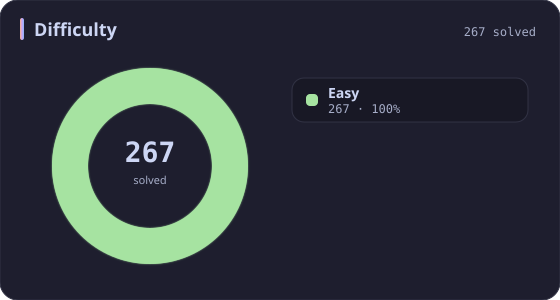
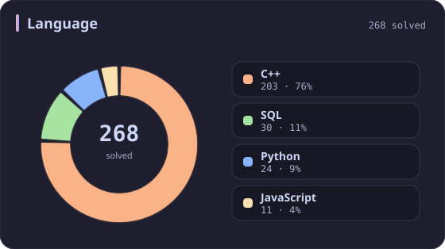
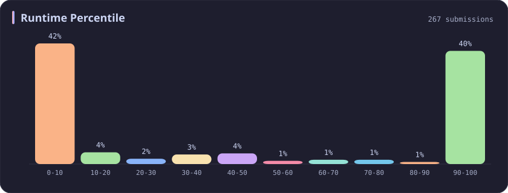
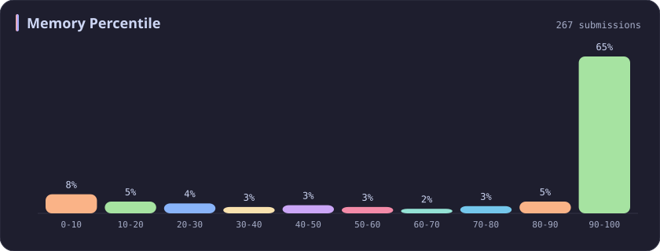
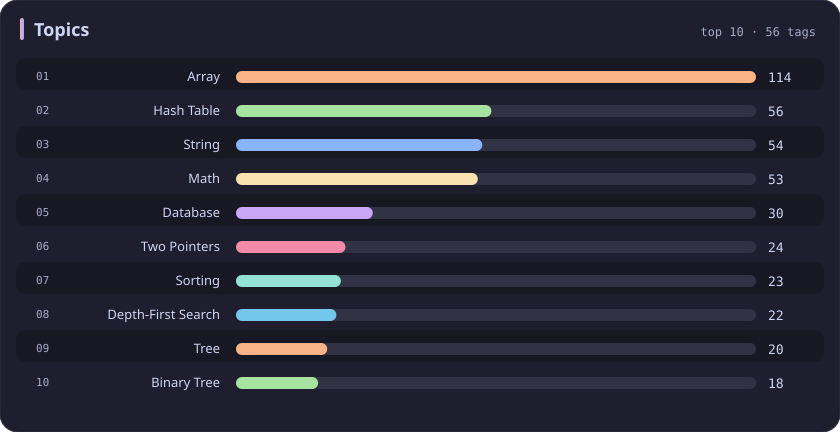

# Easy Stats

[All stats](../../README.md)

**268** problems · updated `2026-09-04 19:32 UTC`

## Stats

### Difficulty

| **Easy** | [Medium](medium.md) | [Hard](hard.md) |
| :---: | :---: | :---: |
| **268** | 393 | 70 |

### Language

### Runtime Percentile

### Memory Percentile

### Topics

---

## Recent Activity

Latest **100** accepted submissions.

| Date | Title | Difficulty | Lang | Runtime | Memory |
| :--- | :--- | :---: | :---: | ---: | ---: |
| 2026&#8209;09&#8209;04 | [1464. Maximum Product of Two Elements in an Array](https://leetcode.com/problems/maximum-product-of-two-elements-in-an-array/) | Easy | C++ | 0 ms `100.00%` | 16.9 MB `5.69%` |
| 2026&#8209;09&#8209;04 | [1. Two Sum](https://leetcode.com/problems/two-sum/) | Easy | C++ | 3 ms `67.25%` | 14.8 MB `58.55%` |
| 2026&#8209;09&#8209;04 | [704. Binary Search](https://leetcode.com/problems/binary-search/) | Easy | C++ | 0 ms `100.00%` | 31.3 MB `81.38%` |
| 2026&#8209;09&#8209;04 | [3903. Smallest Stable Index I](https://leetcode.com/problems/smallest-stable-index-i/) | Easy | C++ | 0 ms `100.00%` | 31.5 MB `20.68%` |
| 2026&#8209;09&#8209;02 | [3875. Construct Uniform Parity Array I](https://leetcode.com/problems/construct-uniform-parity-array-i/) | Easy | C++ | 0 ms `100.00%` | 30.3 MB `27.31%` |
| 2026&#8209;08&#8209;20 | [3069. Distribute Elements Into Two Arrays I](https://leetcode.com/problems/distribute-elements-into-two-arrays-i/) | Easy | C++ | 0 ms `100.00%` | 24 MB `32.91%` |
| 2026&#8209;08&#8209;18 | [3471. Find the Largest Almost Missing Integer](https://leetcode.com/problems/find-the-largest-almost-missing-integer/) | Easy | C++ | 0 ms `100.00%` | 28.9 MB `92.57%` |
| 2026&#8209;08&#8209;13 | [270. Closest Binary Search Tree Value](https://leetcode.com/problems/closest-binary-search-tree-value/) | Easy | C++ | 0 ms `100.00%` | 21.2 MB `48.40%` |
| 2026&#8209;06&#8209;06 | [3950. Exactly One Consecutive Set Bits Pair](https://leetcode.com/problems/exactly-one-consecutive-set-bits-pair/) | Easy | C++ | 0 ms `100.00%` | 8.5 MB `7.25%` |
| 2026&#8209;06&#8209;06 | [2574. Left and Right Sum Differences](https://leetcode.com/problems/left-and-right-sum-differences/) | Easy | C++ | 0 ms `100.00%` | 15.2 MB `41.89%` |
| 2026&#8209;05&#8209;31 | [3945. Digit Frequency Score](https://leetcode.com/problems/digit-frequency-score/) | Easy | C++ | 0 ms `100.00%` | 8.7 MB `54.46%` |
| 2026&#8209;05&#8209;24 | [3940. Limit Occurrences in Sorted Array](https://leetcode.com/problems/limit-occurrences-in-sorted-array/) | Easy | C++ | 0 ms `100.00%` | 34.2 MB `8.37%` |
| 2026&#8209;05&#8209;23 | [3936. Minimum Swaps to Move Zeros to End](https://leetcode.com/problems/minimum-swaps-to-move-zeros-to-end/) | Easy | Python | 0 ms `100.00%` | 19.2 MB `57.55%` |
| 2026&#8209;05&#8209;23 | [2744. Find Maximum Number of String Pairs](https://leetcode.com/problems/find-maximum-number-of-string-pairs/) | Easy | Python | 15 ms `8.76%` | 19.3 MB `18.79%` |
| 2026&#8209;05&#8209;23 | [1752. Check if Array Is Sorted and Rotated](https://leetcode.com/problems/check-if-array-is-sorted-and-rotated/) | Easy | C++ | 0 ms `100.00%` | 11.4 MB `19.48%` |
| 2026&#8209;05&#8209;19 | [2540. Minimum Common Value](https://leetcode.com/problems/minimum-common-value/) | Easy | C++ | 0 ms `100.00%` | 54.6 MB `26.20%` |
| 2026&#8209;02&#8209;19 | [696. Count Binary Substrings](https://leetcode.com/problems/count-binary-substrings/) | Easy | C++ | 0 ms `100.00%` | 13.1 MB `56.88%` |
| 2026&#8209;02&#8209;08 | [110. Balanced Binary Tree](https://leetcode.com/problems/balanced-binary-tree/) | Easy | C++ | 0 ms `100.00%` | 23 MB `83.72%` |
| 2026&#8209;02&#8209;05 | [3379. Transformed Array](https://leetcode.com/problems/transformed-array/) | Easy | C++ | 4 ms `78.48%` | 25.8 MB `9.70%` |
| 2025&#8209;10&#8209;14 | [3349. Adjacent Increasing Subarrays Detection I](https://leetcode.com/problems/adjacent-increasing-subarrays-detection-i/) | Easy | C++ | 13 ms `51.08%` | 40.4 MB `54.98%` |
| 2025&#8209;10&#8209;13 | [2273. Find Resultant Array After Removing Anagrams](https://leetcode.com/problems/find-resultant-array-after-removing-anagrams/) | Easy | C++ | 3 ms `45.53%` | 17.9 MB `24.76%` |
| 2025&#8209;10&#8209;12 | [3712. Sum of Elements With Frequency Divisible by K](https://leetcode.com/problems/sum-of-elements-with-frequency-divisible-by-k/) | Easy | C++ | 0 ms `100.00%` | 26.4 MB `12.32%` |
| 2025&#8209;10&#8209;11 | [3707. Equal Score Substrings](https://leetcode.com/problems/equal-score-substrings/) | Easy | C++ | 3 ms `23.55%` | 8.6 MB `44.95%` |
| 2025&#8209;10&#8209;01 | [1518. Water Bottles](https://leetcode.com/problems/water-bottles/) | Easy | C++ | 0 ms `100.00%` | 7.8 MB `46.26%` |
| 2025&#8209;09&#8209;28 | [976. Largest Perimeter Triangle](https://leetcode.com/problems/largest-perimeter-triangle/) | Easy | C++ | 12 ms `25.68%` | 25.6 MB `79.00%` |
| 2025&#8209;09&#8209;28 | [3697. Compute Decimal Representation](https://leetcode.com/problems/compute-decimal-representation/) | Easy | C++ | 0 ms `100.00%` | 9.8 MB `33.26%` |
| 2025&#8209;09&#8209;27 | [3692. Majority Frequency Characters](https://leetcode.com/problems/majority-frequency-characters/) | Easy | C++ | 5 ms `31.61%` | 9.2 MB `86.77%` |
| 2025&#8209;09&#8209;27 | [3688. Bitwise OR of Even Numbers in an Array](https://leetcode.com/problems/bitwise-or-of-even-numbers-in-an-array/) | Easy | C++ | 0 ms `100.00%` | 24.5 MB `71.15%` |
| 2025&#8209;09&#8209;27 | [812. Largest Triangle Area](https://leetcode.com/problems/largest-triangle-area/) | Easy | C++ | 0 ms `100.00%` | 10.6 MB `7.20%` |
| 2025&#8209;09&#8209;22 | [3005. Count Elements With Maximum Frequency](https://leetcode.com/problems/count-elements-with-maximum-frequency/) | Easy | C++ | 0 ms `100.00%` | 23.6 MB `8.88%` |
| 2025&#8209;09&#8209;16 | [1150. Check If a Number Is Majority Element in a Sorted Array](https://leetcode.com/problems/check-if-a-number-is-majority-element-in-a-sorted-array/) | Easy | Python | 0 ms `100.00%` | 18 MB `100.00%` |
| 2025&#8209;09&#8209;15 | [1935. Maximum Number of Words You Can Type](https://leetcode.com/problems/maximum-number-of-words-you-can-type/) | Easy | Python | 3 ms `33.08%` | 17.9 MB `100.00%` |
| 2025&#8209;09&#8209;13 | [3541. Find Most Frequent Vowel and Consonant](https://leetcode.com/problems/find-most-frequent-vowel-and-consonant/) | Easy | C++ | 2 ms `39.99%` | 10 MB `24.45%` |
| 2025&#8209;09&#8209;10 | [1133. Largest Unique Number](https://leetcode.com/problems/largest-unique-number/) | Easy | C++ | 0 ms `100.00%` | 12.2 MB `95.53%` |
| 2025&#8209;09&#8209;08 | [1317. Convert Integer to the Sum of Two No-Zero Integers](https://leetcode.com/problems/convert-integer-to-the-sum-of-two-no-zero-integers/) | Easy | C++ | 0 ms `100.00%` | 8.2 MB `60.98%` |
| 2025&#8209;09&#8209;07 | [1304. Find N Unique Integers Sum up to Zero](https://leetcode.com/problems/find-n-unique-integers-sum-up-to-zero/) | Easy | Python | 3 ms `4.43%` | 17.9 MB `100.00%` |
| 2025&#8209;09&#8209;04 | [3516. Find Closest Person](https://leetcode.com/problems/find-closest-person/) | Easy | C++ | 0 ms `100.00%` | 8.7 MB `0.00%` |
| 2025&#8209;08&#8209;26 | [3000. Maximum Area of Longest Diagonal Rectangle](https://leetcode.com/problems/maximum-area-of-longest-diagonal-rectangle/) | Easy | C++ | 1 ms `15.78%` | 29.8 MB `13.11%` |
| 2025&#8209;08&#8209;16 | [1323. Maximum 69 Number](https://leetcode.com/problems/maximum-69-number/) | Easy | Python | 0 ms `100.00%` | 17.9 MB `100.00%` |
| 2025&#8209;06&#8209;16 | [2016. Maximum Difference Between Increasing Elements](https://leetcode.com/problems/maximum-difference-between-increasing-elements/) | Easy | Python | 0 ms `100.00%` | 17.9 MB `100.00%` |
| 2025&#8209;06&#8209;14 | [2566. Maximum Difference by Remapping a Digit](https://leetcode.com/problems/maximum-difference-by-remapping-a-digit/) | Easy | Python | 0 ms `100.00%` | 17.9 MB `100.00%` |
| 2025&#8209;06&#8209;12 | [3423. Maximum Difference Between Adjacent Elements in a Circular Array](https://leetcode.com/problems/maximum-difference-between-adjacent-elements-in-a-circular-array/) | Easy | Python | 3 ms `42.01%` | 17.8 MB `100.00%` |
| 2025&#8209;06&#8209;10 | [3442. Maximum Difference Between Even and Odd Frequency I](https://leetcode.com/problems/maximum-difference-between-even-and-odd-frequency-i/) | Easy | C++ | 3 ms `36.10%` | 9.9 MB `27.80%` |
| 2025&#8209;05&#8209;27 | [2894. Divisible and Non-divisible Sums Difference](https://leetcode.com/problems/divisible-and-non-divisible-sums-difference/) | Easy | C++ | 0 ms `100.00%` | 8.3 MB `66.09%` |
| 2025&#8209;05&#8209;25 | [3560. Find Minimum Log Transportation Cost](https://leetcode.com/problems/find-minimum-log-transportation-cost/) | Easy | C++ | 0 ms `100.00%` | 8.9 MB `19.00%` |
| 2025&#8209;05&#8209;24 | [2942. Find Words Containing Character](https://leetcode.com/problems/find-words-containing-character/) | Easy | Python | 0 ms `100.00%` | 17.7 MB `100.00%` |
| 2025&#8209;05&#8209;19 | [3024. Type of Triangle](https://leetcode.com/problems/type-of-triangle/) | Easy | C++ | 0 ms `100.00%` | 22.8 MB `92.33%` |
| 2025&#8209;05&#8209;15 | [2900. Longest Unequal Adjacent Groups Subsequence I](https://leetcode.com/problems/longest-unequal-adjacent-groups-subsequence-i/) | Easy | C++ | 0 ms `100.00%` | 29.9 MB `88.73%` |
| 2025&#8209;05&#8209;12 | [3289. The Two Sneaky Numbers of Digitville](https://leetcode.com/problems/the-two-sneaky-numbers-of-digitville/) | Easy | C++ | 0 ms `100.00%` | 26.5 MB `21.86%` |
| 2025&#8209;05&#8209;12 | [1180. Count Substrings with Only One Distinct Letter](https://leetcode.com/problems/count-substrings-with-only-one-distinct-letter/) | Easy | C++ | 0 ms `100.00%` | 8.5 MB `29.73%` |
| 2025&#8209;05&#8209;12 | [1134. Armstrong Number](https://leetcode.com/problems/armstrong-number/) | Easy | C++ | 0 ms `100.00%` | 8 MB `38.46%` |
| 2025&#8209;05&#8209;12 | [346. Moving Average from Data Stream](https://leetcode.com/problems/moving-average-from-data-stream/) | Easy | C++ | 3 ms `46.36%` | 20.8 MB `80.04%` |
| 2025&#8209;05&#8209;12 | [359. Logger Rate Limiter](https://leetcode.com/problems/logger-rate-limiter/) | Easy | C++ | 4 ms `86.98%` | 39.2 MB `89.46%` |
| 2025&#8209;05&#8209;12 | [2094. Finding 3-Digit Even Numbers](https://leetcode.com/problems/finding-3-digit-even-numbers/) | Easy | C++ | 0 ms `100.00%` | 12.5 MB `82.00%` |
| 2025&#8209;05&#8209;11 | [1550. Three Consecutive Odds](https://leetcode.com/problems/three-consecutive-odds/) | Easy | C++ | 0 ms `100.00%` | 11.9 MB `22.03%` |
| 2025&#8209;05&#8209;11 | [3545. Minimum Deletions for At Most K Distinct Characters](https://leetcode.com/problems/minimum-deletions-for-at-most-k-distinct-characters/) | Easy | C++ | 3 ms `41.64%` | 9 MB `89.15%` |
| 2025&#8209;05&#8209;06 | [1920. Build Array from Permutation](https://leetcode.com/problems/build-array-from-permutation/) | Easy | Python | 0 ms `100.00%` | 18 MB `100.00%` |
| 2025&#8209;05&#8209;04 | [252. Meeting Rooms](https://leetcode.com/problems/meeting-rooms/) | Easy | C++ | 3 ms `39.58%` | 15.9 MB `79.28%` |
| 2025&#8209;05&#8209;04 | [163. Missing Ranges](https://leetcode.com/problems/missing-ranges/) | Easy | C++ | 0 ms `100.00%` | 9.3 MB `68.98%` |
| 2025&#8209;05&#8209;04 | [422. Valid Word Square](https://leetcode.com/problems/valid-word-square/) | Easy | Python | 18 ms `65.88%` | 18.4 MB `100.00%` |
| 2025&#8209;05&#8209;04 | [1426. Counting Elements](https://leetcode.com/problems/counting-elements/) | Easy | C++ | 0 ms `100.00%` | 11.5 MB `36.21%` |
| 2025&#8209;05&#8209;04 | [1165. Single-Row Keyboard](https://leetcode.com/problems/single-row-keyboard/) | Easy | C++ | 0 ms `100.00%` | 9.2 MB `95.06%` |
| 2025&#8209;05&#8209;04 | [1128. Number of Equivalent Domino Pairs](https://leetcode.com/problems/number-of-equivalent-domino-pairs/) | Easy | C++ | 0 ms `100.00%` | 26.1 MB `92.76%` |
| 2025&#8209;05&#8209;04 | [3536. Maximum Product of Two Digits](https://leetcode.com/problems/maximum-product-of-two-digits/) | Easy | C++ | 3 ms `10.81%` | 8.9 MB `31.83%` |
| 2025&#8209;04&#8209;30 | [1295. Find Numbers with Even Number of Digits](https://leetcode.com/problems/find-numbers-with-even-number-of-digits/) | Easy | Python | 4 ms `32.34%` | 12.5 MB `4.41%` |
| 2025&#8209;04&#8209;28 | [734. Sentence Similarity](https://leetcode.com/problems/sentence-similarity/) | Easy | C++ | 2 ms `52.34%` | 15.7 MB `70.09%` |
| 2025&#8209;04&#8209;27 | [3392. Count Subarrays of Length Three With a Condition](https://leetcode.com/problems/count-subarrays-of-length-three-with-a-condition/) | Easy | C++ | 0 ms `100.00%` | 48.5 MB `9.55%` |
| 2025&#8209;04&#8209;26 | [266. Palindrome Permutation](https://leetcode.com/problems/palindrome-permutation/) | Easy | C++ | 0 ms `100.00%` | 8.2 MB `88.46%` |
| 2025&#8209;04&#8209;26 | [760. Find Anagram Mappings](https://leetcode.com/problems/find-anagram-mappings/) | Easy | Python | 0 ms `100.00%` | 17.7 MB `100.00%` |
| 2025&#8209;04&#8209;26 | [1474. Delete N Nodes After M Nodes of a Linked List](https://leetcode.com/problems/delete-n-nodes-after-m-nodes-of-a-linked-list/) | Easy | C++ | 0 ms `100.00%` | 21 MB `10.00%` |
| 2025&#8209;04&#8209;25 | [1427. Perform String Shifts](https://leetcode.com/problems/perform-string-shifts/) | Easy | Python | 0 ms `100.00%` | 17.9 MB `100.00%` |
| 2025&#8209;04&#8209;25 | [1056. Confusing Number](https://leetcode.com/problems/confusing-number/) | Easy | Python | 0 ms `100.00%` | 18 MB `100.00%` |
| 2025&#8209;04&#8209;24 | [121. Best Time to Buy and Sell Stock](https://leetcode.com/problems/best-time-to-buy-and-sell-stock/) | Easy | C++ | 0 ms `100.00%` | 97.2 MB `99.49%` |
| 2025&#8209;04&#8209;24 | [169. Majority Element](https://leetcode.com/problems/majority-element/) | Easy | C++ | 0 ms `100.00%` | 28.1 MB `95.18%` |
| 2025&#8209;04&#8209;24 | [26. Remove Duplicates from Sorted Array](https://leetcode.com/problems/remove-duplicates-from-sorted-array/) | Easy | C++ | 0 ms `100.00%` | 22.6 MB `52.70%` |
| 2025&#8209;04&#8209;24 | [27. Remove Element](https://leetcode.com/problems/remove-element/) | Easy | C++ | 0 ms `100.00%` | 11.8 MB `48.98%` |
| 2025&#8209;04&#8209;24 | [88. Merge Sorted Array](https://leetcode.com/problems/merge-sorted-array/) | Easy | C++ | 0 ms `100.00%` | 12.4 MB `82.77%` |
| 2025&#8209;04&#8209;23 | [338. Counting Bits](https://leetcode.com/problems/counting-bits/) | Easy | C++ | 0 ms `100.00%` | 11.4 MB `8.16%` |
| 2025&#8209;04&#8209;23 | [136. Single Number](https://leetcode.com/problems/single-number/) | Easy | C++ | 0 ms `100.00%` | 20.5 MB `98.78%` |
| 2025&#8209;04&#8209;23 | [1137. N-th Tribonacci Number](https://leetcode.com/problems/n-th-tribonacci-number/) | Easy | C++ | 0 ms `100.00%` | 7.7 MB `98.51%` |
| 2025&#8209;04&#8209;23 | [746. Min Cost Climbing Stairs](https://leetcode.com/problems/min-cost-climbing-stairs/) | Easy | C++ | 0 ms `100.00%` | 17.5 MB `75.70%` |
| 2025&#8209;04&#8209;23 | [374. Guess Number Higher or Lower](https://leetcode.com/problems/guess-number-higher-or-lower/) | Easy | C++ | 2 ms `56.17%` | 8.1 MB `6.63%` |
| 2025&#8209;04&#8209;23 | [1399. Count Largest Group](https://leetcode.com/problems/count-largest-group/) | Easy | C++ | 0 ms `100.00%` | 7.9 MB `77.49%` |
| 2025&#8209;04&#8209;19 | [700. Search in a Binary Search Tree](https://leetcode.com/problems/search-in-a-binary-search-tree/) | Easy | C++ | 0 ms `100.00%` | 35.5 MB `31.70%` |
| 2025&#8209;04&#8209;19 | [872. Leaf-Similar Trees](https://leetcode.com/problems/leaf-similar-trees/) | Easy | C++ | 0 ms `100.00%` | 15.1 MB `99.71%` |
| 2025&#8209;04&#8209;19 | [104. Maximum Depth of Binary Tree](https://leetcode.com/problems/maximum-depth-of-binary-tree/) | Easy | C++ | 0 ms `100.00%` | 19.1 MB `99.94%` |
| 2025&#8209;04&#8209;19 | [206. Reverse Linked List](https://leetcode.com/problems/reverse-linked-list/) | Easy | C++ | 0 ms `100.00%` | 13.4 MB `72.41%` |
| 2025&#8209;04&#8209;19 | [933. Number of Recent Calls](https://leetcode.com/problems/number-of-recent-calls/) | Easy | C++ | 20 ms `40.20%` | 64.1 MB `69.17%` |
| 2025&#8209;04&#8209;19 | [1207. Unique Number of Occurrences](https://leetcode.com/problems/unique-number-of-occurrences/) | Easy | C++ | 0 ms `100.00%` | 11.8 MB `88.68%` |
| 2025&#8209;04&#8209;19 | [2215. Find the Difference of Two Arrays](https://leetcode.com/problems/find-the-difference-of-two-arrays/) | Easy | Python | 5 ms `77.75%` | 18 MB `100.00%` |
| 2025&#8209;04&#8209;19 | [1732. Find the Highest Altitude](https://leetcode.com/problems/find-the-highest-altitude/) | Easy | C++ | 0 ms `100.00%` | 10.8 MB `44.88%` |
| 2025&#8209;04&#8209;19 | [724. Find Pivot Index](https://leetcode.com/problems/find-pivot-index/) | Easy | C++ | 0 ms `100.00%` | 37.1 MB `10.61%` |
| 2025&#8209;04&#8209;19 | [643. Maximum Average Subarray I](https://leetcode.com/problems/maximum-average-subarray-i/) | Easy | C++ | 0 ms `100.00%` | 113.7 MB `86.94%` |
| 2025&#8209;04&#8209;19 | [392. Is Subsequence](https://leetcode.com/problems/is-subsequence/) | Easy | C++ | 0 ms `100.00%` | 8.5 MB `91.47%` |
| 2025&#8209;04&#8209;19 | [283. Move Zeroes](https://leetcode.com/problems/move-zeroes/) | Easy | C++ | 0 ms `100.00%` | 23.9 MB `19.59%` |
| 2025&#8209;04&#8209;19 | [345. Reverse Vowels of a String](https://leetcode.com/problems/reverse-vowels-of-a-string/) | Easy | C++ | 0 ms `100.00%` | 11.6 MB `5.33%` |
| 2025&#8209;04&#8209;19 | [605. Can Place Flowers](https://leetcode.com/problems/can-place-flowers/) | Easy | C++ | 0 ms `100.00%` | 24.1 MB `43.87%` |
| 2025&#8209;04&#8209;17 | [2176. Count Equal and Divisible Pairs in an Array](https://leetcode.com/problems/count-equal-and-divisible-pairs-in-an-array/) | Easy | C++ | 0 ms `100.00%` | 15.4 MB `93.57%` |
| 2025&#8209;04&#8209;14 | [1534. Count Good Triplets](https://leetcode.com/problems/count-good-triplets/) | Easy | C++ | 0 ms `100.00%` | 11.2 MB `7.75%` |
| 2025&#8209;04&#8209;11 | [1431. Kids With the Greatest Number of Candies](https://leetcode.com/problems/kids-with-the-greatest-number-of-candies/) | Easy | C++ | 1 ms `3.25%` | 12.5 MB `60.06%` |
