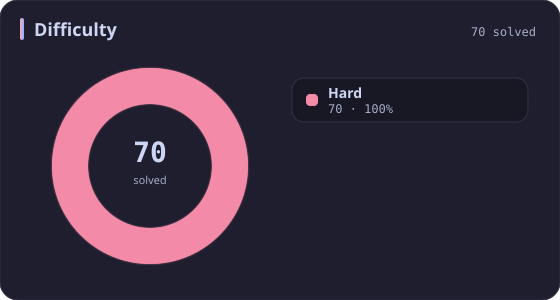
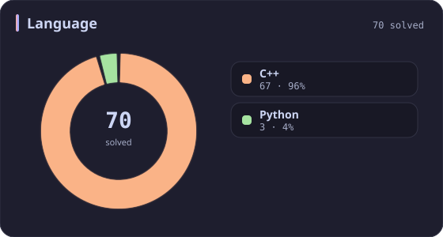
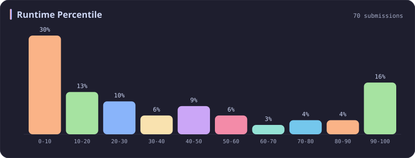
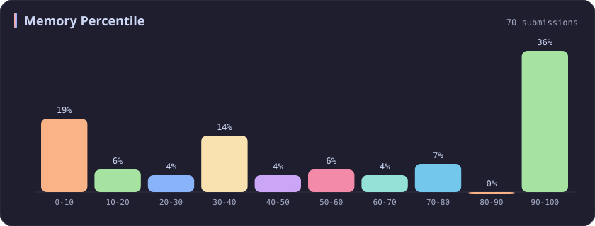
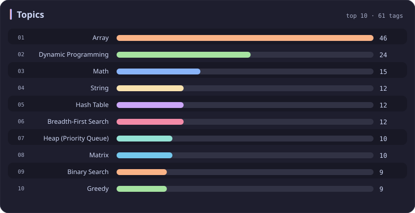

# Hard Stats

[All stats](../../README.md)

**70** problems · updated `2026-09-04 19:12 UTC`

## Stats

### Difficulty

| [Easy](easy.md) | [Medium](medium.md) | **Hard** |
| :---: | :---: | :---: |
| 267 | 393 | **70** |

### Language

### Runtime Percentile

### Memory Percentile

### Topics

---

## Recent Activity

Latest **70** accepted submissions.

| Date | Title | Difficulty | Lang | Runtime | Memory |
| :--- | :--- | :---: | :---: | ---: | ---: |
| 2026-08-17 | [1563. Stone Game V](https://leetcode.com/problems/stone-game-v/) | Hard | C++ | 407 ms `57.19%` | 27.6 MB `46.96%` |
| 2025-10-17 | [3003. Maximize the Number of Partitions After Operations](https://leetcode.com/problems/maximize-the-number-of-partitions-after-operations/) | Hard | C++ | 4 ms `96.26%` | 12.3 MB `97.20%` |
| 2025-10-12 | [3539. Find Sum of Array Product of Magical Sequences](https://leetcode.com/problems/find-sum-of-array-product-of-magical-sequences/) | Hard | Python | 411 ms `97.50%` | 33.9 MB `70.00%` |
| 2025-10-12 | [3715. Sum of Perfect Square Ancestors](https://leetcode.com/problems/sum-of-perfect-square-ancestors/) | Hard | C++ | 1461 ms `21.09%` | 383.2 MB `25.85%` |
| 2025-10-11 | [3710. Maximum Partition Factor](https://leetcode.com/problems/maximum-partition-factor/) | Hard | C++ | 1245 ms `35.15%` | 336.4 MB `37.63%` |
| 2025-10-08 | [774. Minimize Max Distance to Gas Station](https://leetcode.com/problems/minimize-max-distance-to-gas-station/) | Hard | C++ | 9 ms `66.90%` | 18 MB `8.45%` |
| 2025-10-06 | [778. Swim in Rising Water](https://leetcode.com/problems/swim-in-rising-water/) | Hard | C++ | 34 ms `7.85%` | 17.1 MB `10.48%` |
| 2025-10-03 | [407. Trapping Rain Water II](https://leetcode.com/problems/trapping-rain-water-ii/) | Hard | C++ | 34 ms `43.03%` | 22.7 MB `32.34%` |
| 2025-09-29 | [1121. Divide Array Into Increasing Sequences](https://leetcode.com/problems/divide-array-into-increasing-sequences/) | Hard | C++ | 95 ms `41.67%` | 107.6 MB `33.33%` |
| 2025-09-28 | [3700. Number of ZigZag Arrays II](https://leetcode.com/problems/number-of-zigzag-arrays-ii/) | Hard | C++ | 285 ms `71.83%` | 23.4 MB `79.93%` |
| 2025-09-28 | [3699. Number of ZigZag Arrays I](https://leetcode.com/problems/number-of-zigzag-arrays-i/) | Hard | C++ | 407 ms `76.79%` | 11.7 MB `94.59%` |
| 2025-09-27 | [3695. Maximize Alternating Sum Using Swaps](https://leetcode.com/problems/maximize-alternating-sum-using-swaps/) | Hard | C++ | 294 ms `56.92%` | 341.9 MB `32.45%` |
| 2025-09-21 | [1912. Design Movie Rental System](https://leetcode.com/problems/design-movie-rental-system/) | Hard | C++ | 333 ms `34.71%` | 444.6 MB `8.94%` |
| 2025-09-16 | [2197. Replace Non-Coprime Numbers in Array](https://leetcode.com/problems/replace-non-coprime-numbers-in-array/) | Hard | C++ | 2138 ms `5.26%` | 306.9 MB `5.26%` |
| 2025-09-06 | [3495. Minimum Operations to Make Array Elements Zero](https://leetcode.com/problems/minimum-operations-to-make-array-elements-zero/) | Hard | C++ | 7 ms `87.50%` | 183.2 MB `73.61%` |
| 2025-09-03 | [3027. Find the Number of Ways to Place People II](https://leetcode.com/problems/find-the-number-of-ways-to-place-people-ii/) | Hard | C++ | 221 ms `15.38%` | 47.6 MB `5.77%` |
| 2025-08-31 | [37. Sudoku Solver](https://leetcode.com/problems/sudoku-solver/) | Hard | C++ | 46 ms `97.76%` | 8.7 MB `97.42%` |
| 2025-08-27 | [3459. Length of Longest V-Shaped Diagonal Segment](https://leetcode.com/problems/length-of-longest-v-shaped-diagonal-segment/) | Hard | C++ | 231 ms `91.38%` | 111.8 MB `52.16%` |
| 2025-06-09 | [440. K-th Smallest in Lexicographical Order](https://leetcode.com/problems/k-th-smallest-in-lexicographical-order/) | Hard | C++ | 0 ms `100.00%` | 8.1 MB `2.40%` |
| 2025-06-04 | [3406. Find the Lexicographically Largest String From the Box II](https://leetcode.com/problems/find-the-lexicographically-largest-string-from-the-box-ii/) | Hard | C++ | 510 ms `0.00%` | 278 MB `0.00%` |
| 2025-06-03 | [1298. Maximum Candies You Can Get from Boxes](https://leetcode.com/problems/maximum-candies-you-can-get-from-boxes/) | Hard | C++ | 8 ms `43.38%` | 44.5 MB `100.00%` |
| 2025-06-02 | [135. Candy](https://leetcode.com/problems/candy/) | Hard | C++ | 4 ms `28.57%` | 22.9 MB `69.10%` |
| 2025-05-29 | [3068. Find the Maximum Sum of Node Values](https://leetcode.com/problems/find-the-maximum-sum-of-node-values/) | Hard | C++ | 111 ms `11.83%` | 158 MB `11.26%` |
| 2025-05-29 | [3373. Maximize the Number of Target Nodes After Connecting Trees II](https://leetcode.com/problems/maximize-the-number-of-target-nodes-after-connecting-trees-ii/) | Hard | C++ | 457 ms `27.98%` | 387.2 MB `21.76%` |
| 2025-05-26 | [1857. Largest Color Value in a Directed Graph](https://leetcode.com/problems/largest-color-value-in-a-directed-graph/) | Hard | C++ | 401 ms `39.45%` | 188.9 MB `30.53%` |
| 2025-05-14 | [3337. Total Characters in String After Transformations II](https://leetcode.com/problems/total-characters-in-string-after-transformations-ii/) | Hard | C++ | 543 ms `9.64%` | 70.7 MB `42.17%` |
| 2025-05-12 | [770. Basic Calculator IV](https://leetcode.com/problems/basic-calculator-iv/) | Hard | C++ | 4 ms `85.71%` | 21.8 MB `99.51%` |
| 2025-05-11 | [772. Basic Calculator III](https://leetcode.com/problems/basic-calculator-iii/) | Hard | C++ | 0 ms `100.00%` | 11.5 MB `56.44%` |
| 2025-05-11 | [224. Basic Calculator](https://leetcode.com/problems/basic-calculator/) | Hard | C++ | 19 ms `7.01%` | 23.2 MB `5.06%` |
| 2025-05-11 | [3547. Maximum Sum of Edge Values in a Graph](https://leetcode.com/problems/maximum-sum-of-edge-values-in-a-graph/) | Hard | C++ | 195 ms `41.78%` | 191.3 MB `100.00%` |
| 2025-05-11 | [3548. Equal Sum Grid Partition II](https://leetcode.com/problems/equal-sum-grid-partition-ii/) | Hard | C++ | 826 ms `55.46%` | 400.9 MB `37.86%` |
| 2025-05-09 | [3343. Count Number of Balanced Permutations](https://leetcode.com/problems/count-number-of-balanced-permutations/) | Hard | C++ | 150 ms `50.60%` | 19.4 MB `65.06%` |
| 2025-05-01 | [2071. Maximum Number of Tasks You Can Assign](https://leetcode.com/problems/maximum-number-of-tasks-you-can-assign/) | Hard | C++ | 714 ms `60.06%` | 286.3 MB `39.93%` |
| 2025-04-28 | [2302. Count Subarrays With Score Less Than K](https://leetcode.com/problems/count-subarrays-with-score-less-than-k/) | Hard | C++ | 0 ms `100.00%` | 99.1 MB `45.78%` |
| 2025-04-26 | [499. The Maze III](https://leetcode.com/problems/the-maze-iii/) | Hard | C++ | 17 ms `6.78%` | 20.2 MB `5.08%` |
| 2025-04-26 | [2444. Count Subarrays With Fixed Bounds](https://leetcode.com/problems/count-subarrays-with-fixed-bounds/) | Hard | C++ | 0 ms `100.00%` | 94 MB `36.87%` |
| 2025-04-23 | [302. Smallest Rectangle Enclosing Black Pixels](https://leetcode.com/problems/smallest-rectangle-enclosing-black-pixels/) | Hard | C++ | 8 ms `13.11%` | 23.9 MB `13.11%` |
| 2025-04-22 | [2338. Count the Number of Ideal Arrays](https://leetcode.com/problems/count-the-number-of-ideal-arrays/) | Hard | C++ | 10 ms `75.00%` | 10.3 MB `76.47%` |
| 2025-04-07 | [317. Shortest Distance from All Buildings](https://leetcode.com/problems/shortest-distance-from-all-buildings/) | Hard | C++ | 470 ms `46.48%` | 197.7 MB `39.44%` |
| 2024-11-17 | [862. Shortest Subarray with Sum at Least K](https://leetcode.com/problems/shortest-subarray-with-sum-at-least-k/) | Hard | C++ | 50 ms `9.43%` | 112.6 MB `5.17%` |
| 2024-10-30 | [1671. Minimum Number of Removals to Make Mountain Array](https://leetcode.com/problems/minimum-number-of-removals-to-make-mountain-array/) | Hard | C++ | 5 ms `89.20%` | 15.1 MB `99.67%` |
| 2024-10-29 | [265. Paint House II](https://leetcode.com/problems/paint-house-ii/) | Hard | C++ | 0 ms `100.00%` | 15.4 MB `52.47%` |
| 2024-10-26 | [2458. Height of Binary Tree After Subtree Removal Queries](https://leetcode.com/problems/height-of-binary-tree-after-subtree-removal-queries/) | Hard | C++ | 339 ms `28.83%` | 312.8 MB `34.69%` |
| 2024-10-20 | [1106. Parsing A Boolean Expression](https://leetcode.com/problems/parsing-a-boolean-expression/) | Hard | C++ | 9 ms `21.74%` | 13.3 MB `9.84%` |
| 2024-04-13 | [85. Maximal Rectangle](https://leetcode.com/problems/maximal-rectangle/) | Hard | Python | 1343 ms `6.67%` | 24.6 MB `50.77%` |
| 2024-04-12 | [42. Trapping Rain Water](https://leetcode.com/problems/trapping-rain-water/) | Hard | C++ | 13 ms `4.64%` | 22.2 MB `100.00%` |
| 2024-03-30 | [992. Subarrays with K Different Integers](https://leetcode.com/problems/subarrays-with-k-different-integers/) | Hard | C++ | 1061 ms `5.69%` | 46.9 MB `95.70%` |
| 2024-03-26 | [10. Regular Expression Matching](https://leetcode.com/problems/regular-expression-matching/) | Hard | C++ | 39 ms `10.93%` | 23.9 MB `5.07%` |
| 2024-03-26 | [41. First Missing Positive](https://leetcode.com/problems/first-missing-positive/) | Hard | C++ | 43 ms `17.11%` | 46.5 MB `99.96%` |
| 2023-10-08 | [1458. Max Dot Product of Two Subsequences](https://leetcode.com/problems/max-dot-product-of-two-subsequences/) | Hard | C++ | 24 ms `48.36%` | 9.8 MB `100.00%` |
| 2023-10-07 | [1420. Build Array Where You Can Find The Maximum Exactly K Comparisons](https://leetcode.com/problems/build-array-where-you-can-find-the-maximum-exactly-k-comparisons/) | Hard | C++ | 4 ms `99.37%` | 8.7 MB `99.69%` |
| 2023-10-01 | [185. Department Top Three Salaries](https://leetcode.com/problems/department-top-three-salaries/) | Hard | Python | 745 ms `5.52%` | 62.8 MB `100.00%` |
| 2023-04-15 | [2218. Maximum Value of K Coins From Piles](https://leetcode.com/problems/maximum-value-of-k-coins-from-piles/) | Hard | C++ | 615 ms `5.04%` | 18 MB `93.82%` |
| 2023-04-15 | [2642. Design Graph With Shortest Path Calculator](https://leetcode.com/problems/design-graph-with-shortest-path-calculator/) | Hard | C++ | 220 ms `11.24%` | 78.1 MB `73.94%` |
| 2023-04-01 | [2608. Shortest Cycle in a Graph](https://leetcode.com/problems/shortest-cycle-in-a-graph/) | Hard | C++ | 510 ms `5.11%` | 107.9 MB `90.12%` |
| 2023-03-31 | [1444. Number of Ways of Cutting a Pizza](https://leetcode.com/problems/number-of-ways-of-cutting-a-pizza/) | Hard | C++ | 23 ms `8.59%` | 8.2 MB `100.00%` |
| 2023-03-30 | [87. Scramble String](https://leetcode.com/problems/scramble-string/) | Hard | C++ | 171 ms `7.11%` | 36.2 MB `9.90%` |
| 2023-03-29 | [1402. Reducing Dishes](https://leetcode.com/problems/reducing-dishes/) | Hard | C++ | 24 ms `22.97%` | 8.2 MB `100.00%` |
| 2023-03-26 | [2360. Longest Cycle in a Graph](https://leetcode.com/problems/longest-cycle-in-a-graph/) | Hard | C++ | 164 ms `35.56%` | 90.2 MB `99.93%` |
| 2023-03-12 | [23. Merge k Sorted Lists](https://leetcode.com/problems/merge-k-sorted-lists/) | Hard | C++ | 30 ms `15.41%` | 13.9 MB `99.99%` |
| 2023-03-05 | [1345. Jump Game IV](https://leetcode.com/problems/jump-game-iv/) | Hard | C++ | 467 ms `5.02%` | 137.8 MB `19.25%` |
| 2023-03-05 | [2585. Number of Ways to Earn Points](https://leetcode.com/problems/number-of-ways-to-earn-points/) | Hard | C++ | 280 ms `5.27%` | 17 MB `63.85%` |
| 2023-03-05 | [2584. Split the Array to Make Coprime Products](https://leetcode.com/problems/split-the-array-to-make-coprime-products/) | Hard | C++ | 512 ms `26.86%` | 21.6 MB `100.00%` |
| 2023-03-04 | [2581. Count Number of Possible Root Nodes](https://leetcode.com/problems/count-number-of-possible-root-nodes/) | Hard | C++ | 701 ms `18.68%` | 247.9 MB `22.18%` |
| 2023-02-24 | [1675. Minimize Deviation in Array](https://leetcode.com/problems/minimize-deviation-in-array/) | Hard | C++ | 561 ms `5.36%` | 56.8 MB `99.49%` |
| 2023-02-23 | [239. Sliding Window Maximum](https://leetcode.com/problems/sliding-window-maximum/) | Hard | C++ | 998 ms `5.17%` | 191.6 MB `5.71%` |
| 2023-02-23 | [502. IPO](https://leetcode.com/problems/ipo/) | Hard | C++ | 232 ms `5.04%` | 78.1 MB `100.00%` |
| 2023-02-17 | [52. N-Queens II](https://leetcode.com/problems/n-queens-ii/) | Hard | C++ | 0 ms `100.00%` | 6.1 MB `100.00%` |
| 2023-02-17 | [51. N-Queens](https://leetcode.com/problems/n-queens/) | Hard | C++ | 7 ms `16.31%` | 8.4 MB `100.00%` |
| 2023-02-15 | [4. Median of Two Sorted Arrays](https://leetcode.com/problems/median-of-two-sorted-arrays/) | Hard | C++ | 66 ms `5.81%` | 90.2 MB `99.98%` |
