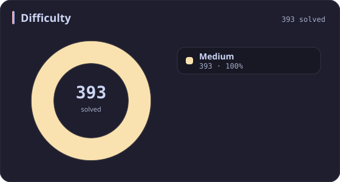
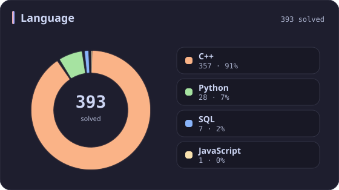
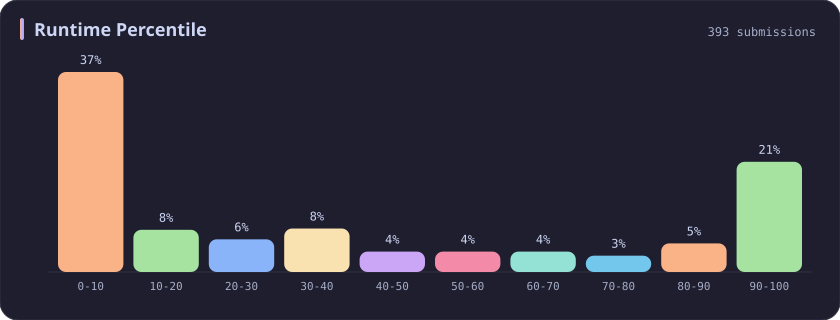
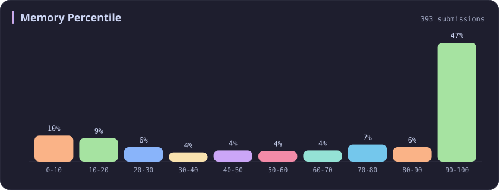

# Medium Stats

[All stats](../../README.md)

**393** problems · updated `2026-09-04 19:32 UTC`

## Stats

### Difficulty

| [Easy](easy.md) | **Medium** | [Hard](hard.md) |
| :---: | :---: | :---: |
| 268 | **393** | 70 |

### Language

### Runtime Percentile

### Memory Percentile

### Topics

---

## Recent Activity

Latest **100** accepted submissions.

| Date | Title | Difficulty | Lang | Runtime | Memory |
| :--- | :--- | :---: | :---: | ---: | ---: |
| 2026&#8209;09&#8209;03 | [3876. Construct Uniform Parity Array II](https://leetcode.com/problems/construct-uniform-parity-array-ii/) | Medium | C++ | 7 ms `42.89%` | 165.7 MB `84.39%` |
| 2026&#8209;08&#8209;20 | [308. Range Sum Query 2D - Mutable](https://leetcode.com/problems/range-sum-query-2d-mutable/) | Medium | C++ | 19 ms `58.17%` | 44.6 MB `11.30%` |
| 2026&#8209;08&#8209;19 | [1386. Cinema Seat Allocation](https://leetcode.com/problems/cinema-seat-allocation/) | Medium | C++ | 125 ms `9.88%` | 84.2 MB `20.70%` |
| 2026&#8209;08&#8209;17 | [877. Stone Game](https://leetcode.com/problems/stone-game/) | Medium | C++ | 12 ms `17.70%` | 19.8 MB `7.31%` |
| 2026&#8209;08&#8209;13 | [286. Walls and Gates](https://leetcode.com/problems/walls-and-gates/) | Medium | C++ | 7 ms `44.44%` | 19 MB `83.33%` |
| 2026&#8209;08&#8209;13 | [250. Count Univalue Subtrees](https://leetcode.com/problems/count-univalue-subtrees/) | Medium | C++ | 0 ms `100.00%` | 18.5 MB `75.93%` |
| 2026&#8209;08&#8209;13 | [549. Binary Tree Longest Consecutive Sequence II](https://leetcode.com/problems/binary-tree-longest-consecutive-sequence-ii/) | Medium | C++ | 0 ms `100.00%` | 22.7 MB `78.57%` |
| 2026&#8209;06&#8209;11 | [3558. Number of Ways to Assign Edge Weights I](https://leetcode.com/problems/number-of-ways-to-assign-edge-weights-i/) | Medium | C++ | 303 ms `53.85%` | 346.5 MB `44.39%` |
| 2026&#8209;06&#8209;08 | [2161. Partition Array According to Given Pivot](https://leetcode.com/problems/partition-array-according-to-given-pivot/) | Medium | C++ | 7 ms `58.96%` | 139.4 MB `16.25%` |
| 2026&#8209;06&#8209;06 | [3952. Maximum Total Value of Covered Indices](https://leetcode.com/problems/maximum-total-value-of-covered-indices/) | Medium | C++ | 127 ms `33.96%` | 236.8 MB `31.46%` |
| 2026&#8209;06&#8209;06 | [3951. Minimum Energy to Maintain Brightness](https://leetcode.com/problems/minimum-energy-to-maintain-brightness/) | Medium | C++ | 74 ms `83.55%` | 203.6 MB `61.06%` |
| 2026&#8209;06&#8209;04 | [723. Candy Crush](https://leetcode.com/problems/candy-crush/) | Medium | C++ | 4 ms `61.92%` | 14.4 MB `20.92%` |
| 2026&#8209;06&#8209;04 | [298. Binary Tree Longest Consecutive Sequence](https://leetcode.com/problems/binary-tree-longest-consecutive-sequence/) | Medium | C++ | 0 ms `100.00%` | 32.9 MB `74.42%` |
| 2026&#8209;06&#8209;04 | [1265. Print Immutable Linked List in Reverse](https://leetcode.com/problems/print-immutable-linked-list-in-reverse/) | Medium | C++ | 0 ms `100.00%` | 9.9 MB `5.81%` |
| 2026&#8209;06&#8209;04 | [369. Plus One Linked List](https://leetcode.com/problems/plus-one-linked-list/) | Medium | C++ | 0 ms `100.00%` | 12.2 MB `56.32%` |
| 2026&#8209;06&#8209;04 | [3751. Total Waviness of Numbers in Range I](https://leetcode.com/problems/total-waviness-of-numbers-in-range-i/) | Medium | C++ | 50 ms `45.88%` | 9.3 MB `72.51%` |
| 2026&#8209;05&#8209;24 | [3942. Minimum Operations to Sort a Permutation](https://leetcode.com/problems/minimum-operations-to-sort-a-permutation/) | Medium | C++ | 15 ms `10.97%` | 156.1 MB `8.67%` |
| 2026&#8209;05&#8209;24 | [3941. Password Strength](https://leetcode.com/problems/password-strength/) | Medium | C++ | 20 ms `39.05%` | 17.6 MB `58.98%` |
| 2026&#8209;05&#8209;23 | [3938. Maximum Path Intersection Sum in a Grid](https://leetcode.com/problems/maximum-path-intersection-sum-in-a-grid/) | Medium | C++ | 72 ms `9.23%` | 185.7 MB `5.00%` |
| 2026&#8209;05&#8209;23 | [3937. Minimum Operations to Make Array Modulo Alternating I](https://leetcode.com/problems/minimum-operations-to-make-array-modulo-alternating-i/) | Medium | C++ | 7 ms `79.04%` | 25.4 MB `15.30%` |
| 2026&#8209;05&#8209;22 | [33. Search in Rotated Sorted Array](https://leetcode.com/problems/search-in-rotated-sorted-array/) | Medium | C++ | 0 ms `100.00%` | 15 MB `96.75%` |
| 2026&#8209;05&#8209;21 | [3043. Find the Length of the Longest Common Prefix](https://leetcode.com/problems/find-the-length-of-the-longest-common-prefix/) | Medium | C++ | 374 ms `18.26%` | 156.5 MB `52.60%` |
| 2026&#8209;05&#8209;20 | [2061. Number of Spaces Cleaning Robot Cleaned](https://leetcode.com/problems/number-of-spaces-cleaning-robot-cleaned/) | Medium | C++ | 65 ms `26.67%` | 54 MB `26.67%` |
| 2026&#8209;05&#8209;20 | [2657. Find the Prefix Common Array of Two Arrays](https://leetcode.com/problems/find-the-prefix-common-array-of-two-arrays/) | Medium | C++ | 0 ms `100.00%` | 85.9 MB `74.63%` |
| 2026&#8209;03&#8209;25 | [3546. Equal Sum Grid Partition I](https://leetcode.com/problems/equal-sum-grid-partition-i/) | Medium | C++ | 12 ms `34.01%` | 130.2 MB `100.00%` |
| 2026&#8209;02&#8209;10 | [3719. Longest Balanced Subarray I](https://leetcode.com/problems/longest-balanced-subarray-i/) | Medium | C++ | 151 ms `89.04%` | 35.7 MB `94.90%` |
| 2026&#8209;02&#8209;09 | [1382. Balance a Binary Search Tree](https://leetcode.com/problems/balance-a-binary-search-tree/) | Medium | C++ | 22 ms `20.32%` | 65.6 MB `66.43%` |
| 2026&#8209;02&#8209;08 | [1653. Minimum Deletions to Make String Balanced](https://leetcode.com/problems/minimum-deletions-to-make-string-balanced/) | Medium | C++ | 51 ms `18.43%` | 55.1 MB `19.34%` |
| 2026&#8209;02&#8209;06 | [3634. Minimum Removals to Balance Array](https://leetcode.com/problems/minimum-removals-to-balance-array/) | Medium | C++ | 31 ms `62.90%` | 105 MB `86.33%` |
| 2025&#8209;10&#8209;16 | [2598. Smallest Missing Non-negative Integer After Operations](https://leetcode.com/problems/smallest-missing-non-negative-integer-after-operations/) | Medium | C++ | 169 ms `13.05%` | 138.6 MB `45.43%` |
| 2025&#8209;10&#8209;15 | [3350. Adjacent Increasing Subarrays Detection II](https://leetcode.com/problems/adjacent-increasing-subarrays-detection-ii/) | Medium | C++ | 282 ms `8.37%` | 219.4 MB `6.08%` |
| 2025&#8209;10&#8209;12 | [3714. Longest Balanced Substring II](https://leetcode.com/problems/longest-balanced-substring-ii/) | Medium | C++ | 1603 ms `59.24%` | 403.9 MB `18.22%` |
| 2025&#8209;10&#8209;12 | [3713. Longest Balanced Substring I](https://leetcode.com/problems/longest-balanced-substring-i/) | Medium | C++ | 3030 ms `5.07%` | 498.4 MB `5.06%` |
| 2025&#8209;10&#8209;11 | [3147. Taking Maximum Energy From the Mystic Dungeon](https://leetcode.com/problems/taking-maximum-energy-from-the-mystic-dungeon/) | Medium | C++ | 141 ms `82.37%` | 151.8 MB `100.00%` |
| 2025&#8209;10&#8209;11 | [3186. Maximum Total Damage With Spell Casting](https://leetcode.com/problems/maximum-total-damage-with-spell-casting/) | Medium | C++ | 111 ms `86.08%` | 162.8 MB `90.83%` |
| 2025&#8209;10&#8209;11 | [3708. Longest Fibonacci Subarray](https://leetcode.com/problems/longest-fibonacci-subarray/) | Medium | C++ | 0 ms `100.00%` | 102.8 MB `45.05%` |
| 2025&#8209;10&#8209;09 | [3494. Find the Minimum Amount of Time to Brew Potions](https://leetcode.com/problems/find-the-minimum-amount-of-time-to-brew-potions/) | Medium | C++ | 575 ms `18.46%` | 407.4 MB `15.38%` |
| 2025&#8209;10&#8209;08 | [2300. Successful Pairs of Spells and Potions](https://leetcode.com/problems/successful-pairs-of-spells-and-potions/) | Medium | C++ | 47 ms `42.48%` | 138.4 MB `8.28%` |
| 2025&#8209;10&#8209;07 | [1488. Avoid Flood in The City](https://leetcode.com/problems/avoid-flood-in-the-city/) | Medium | C++ | 216 ms `21.79%` | 121.2 MB `100.00%` |
| 2025&#8209;10&#8209;05 | [417. Pacific Atlantic Water Flow](https://leetcode.com/problems/pacific-atlantic-water-flow/) | Medium | C++ | 4 ms `76.47%` | 22.2 MB `76.03%` |
| 2025&#8209;10&#8209;04 | [11. Container With Most Water](https://leetcode.com/problems/container-with-most-water/) | Medium | C++ | 0 ms `100.00%` | 62.8 MB `79.30%` |
| 2025&#8209;10&#8209;03 | [1135. Connecting Cities With Minimum Cost](https://leetcode.com/problems/connecting-cities-with-minimum-cost/) | Medium | C++ | 45 ms `32.04%` | 58.5 MB `26.21%` |
| 2025&#8209;10&#8209;02 | [3100. Water Bottles II](https://leetcode.com/problems/water-bottles-ii/) | Medium | C++ | 2 ms `38.80%` | 8.7 MB `15.89%` |
| 2025&#8209;09&#8209;30 | [2221. Find Triangular Sum of an Array](https://leetcode.com/problems/find-triangular-sum-of-an-array/) | Medium | C++ | 431 ms `5.07%` | 384.5 MB `5.28%` |
| 2025&#8209;09&#8209;29 | [1039. Minimum Score Triangulation of Polygon](https://leetcode.com/problems/minimum-score-triangulation-of-polygon/) | Medium | C++ | 5 ms `10.47%` | 11.4 MB `15.89%` |
| 2025&#8209;09&#8209;28 | [3698. Split Array With Minimum Difference](https://leetcode.com/problems/split-array-with-minimum-difference/) | Medium | C++ | 0 ms `100.00%` | 169.6 MB `94.85%` |
| 2025&#8209;09&#8209;27 | [3694. Distinct Points Reachable After Substring Removal](https://leetcode.com/problems/distinct-points-reachable-after-substring-removal/) | Medium | C++ | 130 ms `52.48%` | 53.5 MB `42.98%` |
| 2025&#8209;09&#8209;27 | [3693. Climbing Stairs II](https://leetcode.com/problems/climbing-stairs-ii/) | Medium | C++ | 20 ms `54.23%` | 177.8 MB `64.31%` |
| 2025&#8209;09&#8209;27 | [3690. Split and Merge Array Transformation](https://leetcode.com/problems/split-and-merge-array-transformation/) | Medium | C++ | 1672 ms `7.57%` | 432.5 MB `21.01%` |
| 2025&#8209;09&#8209;27 | [3689. Maximum Total Subarray Value I](https://leetcode.com/problems/maximum-total-subarray-value-i/) | Medium | C++ | 5 ms `15.46%` | 103.6 MB `97.34%` |
| 2025&#8209;09&#8209;26 | [1152. Analyze User Website Visit Pattern](https://leetcode.com/problems/analyze-user-website-visit-pattern/) | Medium | C++ | 55 ms `19.05%` | 26.6 MB `42.86%` |
| 2025&#8209;09&#8209;26 | [611. Valid Triangle Number](https://leetcode.com/problems/valid-triangle-number/) | Medium | C++ | 430 ms `8.62%` | 16.8 MB `10.43%` |
| 2025&#8209;09&#8209;25 | [120. Triangle](https://leetcode.com/problems/triangle/) | Medium | C++ | 0 ms `100.00%` | 13.9 MB `5.01%` |
| 2025&#8209;09&#8209;24 | [166. Fraction to Recurring Decimal](https://leetcode.com/problems/fraction-to-recurring-decimal/) | Medium | Python | 0 ms `100.00%` | 17.9 MB `100.00%` |
| 2025&#8209;09&#8209;23 | [165. Compare Version Numbers](https://leetcode.com/problems/compare-version-numbers/) | Medium | Python | 0 ms `100.00%` | 17.7 MB `100.00%` |
| 2025&#8209;09&#8209;20 | [3508. Implement Router](https://leetcode.com/problems/implement-router/) | Medium | C++ | 190 ms `82.01%` | 415.1 MB `99.28%` |
| 2025&#8209;09&#8209;19 | [3484. Design Spreadsheet](https://leetcode.com/problems/design-spreadsheet/) | Medium | Python | 57 ms `96.77%` | 23.5 MB `100.00%` |
| 2025&#8209;09&#8209;18 | [3408. Design Task Manager](https://leetcode.com/problems/design-task-manager/) | Medium | C++ | 209 ms `78.45%` | 347.5 MB `98.90%` |
| 2025&#8209;09&#8209;17 | [2353. Design a Food Rating System](https://leetcode.com/problems/design-a-food-rating-system/) | Medium | C++ | 164 ms `34.81%` | 162.7 MB `91.36%` |
| 2025&#8209;09&#8209;14 | [966. Vowel Spellchecker](https://leetcode.com/problems/vowel-spellchecker/) | Medium | C++ | 37 ms `68.34%` | 41.6 MB `55.21%` |
| 2025&#8209;09&#8209;12 | [3227. Vowels Game in a String](https://leetcode.com/problems/vowels-game-in-a-string/) | Medium | Python | 0 ms `100.00%` | 18.2 MB `100.00%` |
| 2025&#8209;09&#8209;11 | [2785. Sort Vowels in a String](https://leetcode.com/problems/sort-vowels-in-a-string/) | Medium | C++ | 19 ms `35.89%` | 20.6 MB `5.76%` |
| 2025&#8209;09&#8209;10 | [1733. Minimum Number of People to Teach](https://leetcode.com/problems/minimum-number-of-people-to-teach/) | Medium | C++ | 35 ms `82.77%` | 67.6 MB `68.42%` |
| 2025&#8209;09&#8209;09 | [2327. Number of People Aware of a Secret](https://leetcode.com/problems/number-of-people-aware-of-a-secret/) | Medium | C++ | 34 ms `9.11%` | 9.1 MB `92.86%` |
| 2025&#8209;09&#8209;05 | [2749. Minimum Operations to Make the Integer Zero](https://leetcode.com/problems/minimum-operations-to-make-the-integer-zero/) | Medium | C++ | 0 ms `100.00%` | 8.2 MB `42.26%` |
| 2025&#8209;09&#8209;02 | [3025. Find the Number of Ways to Place People I](https://leetcode.com/problems/find-the-number-of-ways-to-place-people-i/) | Medium | C++ | 19 ms `25.00%` | 32.7 MB `28.24%` |
| 2025&#8209;09&#8209;01 | [1792. Maximum Average Pass Ratio](https://leetcode.com/problems/maximum-average-pass-ratio/) | Medium | C++ | 273 ms `89.50%` | 97.9 MB `69.41%` |
| 2025&#8209;08&#8209;30 | [36. Valid Sudoku](https://leetcode.com/problems/valid-sudoku/) | Medium | C++ | 0 ms `100.00%` | 22.7 MB `57.13%` |
| 2025&#8209;08&#8209;29 | [3021. Alice and Bob Playing Flower Game](https://leetcode.com/problems/alice-and-bob-playing-flower-game/) | Medium | C++ | 0 ms `100.00%` | 8.4 MB `89.39%` |
| 2025&#8209;08&#8209;28 | [3446. Sort Matrix by Diagonals](https://leetcode.com/problems/sort-matrix-by-diagonals/) | Medium | C++ | 4 ms `84.97%` | 43.3 MB `86.76%` |
| 2025&#8209;08&#8209;27 | [1181. Before and After Puzzle](https://leetcode.com/problems/before-and-after-puzzle/) | Medium | Python | 15 ms `5.56%` | 18.2 MB `100.00%` |
| 2025&#8209;08&#8209;25 | [498. Diagonal Traverse](https://leetcode.com/problems/diagonal-traverse/) | Medium | C++ | 0 ms `100.00%` | 22.8 MB `70.10%` |
| 2025&#8209;06&#8209;19 | [2294. Partition Array Such That Maximum Difference Is K](https://leetcode.com/problems/partition-array-such-that-maximum-difference-is-k/) | Medium | C++ | 35 ms `76.66%` | 87 MB `100.00%` |
| 2025&#8209;06&#8209;18 | [2966. Divide Array Into Arrays With Max Difference](https://leetcode.com/problems/divide-array-into-arrays-with-max-difference/) | Medium | C++ | 115 ms `13.42%` | 126.1 MB `18.08%` |
| 2025&#8209;06&#8209;15 | [1432. Max Difference You Can Get From Changing an Integer](https://leetcode.com/problems/max-difference-you-can-get-from-changing-an-integer/) | Medium | Python | 0 ms `100.00%` | 17.6 MB `100.00%` |
| 2025&#8209;06&#8209;13 | [2616. Minimize the Maximum Difference of Pairs](https://leetcode.com/problems/minimize-the-maximum-difference-of-pairs/) | Medium | C++ | 30 ms `30.34%` | 86.8 MB `50.70%` |
| 2025&#8209;06&#8209;08 | [386. Lexicographical Numbers](https://leetcode.com/problems/lexicographical-numbers/) | Medium | C++ | 0 ms `100.00%` | 14.2 MB `46.29%` |
| 2025&#8209;06&#8209;07 | [3170. Lexicographically Minimum String After Removing Stars](https://leetcode.com/problems/lexicographically-minimum-string-after-removing-stars/) | Medium | C++ | 54 ms `80.71%` | 27.2 MB `42.51%` |
| 2025&#8209;06&#8209;06 | [2434. Using a Robot to Print the Lexicographically Smallest String](https://leetcode.com/problems/using-a-robot-to-print-the-lexicographically-smallest-string/) | Medium | C++ | 67 ms `26.26%` | 51.4 MB `5.20%` |
| 2025&#8209;06&#8209;05 | [1061. Lexicographically Smallest Equivalent String](https://leetcode.com/problems/lexicographically-smallest-equivalent-string/) | Medium | C++ | 2 ms `46.62%` | 9 MB `53.92%` |
| 2025&#8209;06&#8209;04 | [3403. Find the Lexicographically Largest String From the Box I](https://leetcode.com/problems/find-the-lexicographically-largest-string-from-the-box-i/) | Medium | C++ | 9 ms `91.91%` | 12.9 MB `76.28%` |
| 2025&#8209;06&#8209;01 | [2929. Distribute Candies Among Children II](https://leetcode.com/problems/distribute-candies-among-children-ii/) | Medium | C++ | 14 ms `49.47%` | 8.9 MB `83.04%` |
| 2025&#8209;05&#8209;31 | [909. Snakes and Ladders](https://leetcode.com/problems/snakes-and-ladders/) | Medium | C++ | 0 ms `100.00%` | 16.9 MB `67.49%` |
| 2025&#8209;05&#8209;30 | [2359. Find Closest Node to Given Two Nodes](https://leetcode.com/problems/find-closest-node-to-given-two-nodes/) | Medium | C++ | 162 ms `13.13%` | 162.6 MB `10.77%` |
| 2025&#8209;05&#8209;28 | [3372. Maximize the Number of Target Nodes After Connecting Trees I](https://leetcode.com/problems/maximize-the-number-of-target-nodes-after-connecting-trees-i/) | Medium | C++ | 181 ms `69.37%` | 62.9 MB `70.27%` |
| 2025&#8209;05&#8209;25 | [2131. Longest Palindrome by Concatenating Two Letter Words](https://leetcode.com/problems/longest-palindrome-by-concatenating-two-letter-words/) | Medium | C++ | 27 ms `88.02%` | 171.9 MB `78.72%` |
| 2025&#8209;05&#8209;25 | [3561. Resulting String After Adjacent Removals](https://leetcode.com/problems/resulting-string-after-adjacent-removals/) | Medium | C++ | 106 ms `36.98%` | 78.6 MB `7.40%` |
| 2025&#8209;05&#8209;24 | [3557. Find Maximum Number of Non Intersecting Substrings](https://leetcode.com/problems/find-maximum-number-of-non-intersecting-substrings/) | Medium | C++ | 3 ms `98.31%` | 20.2 MB `90.40%` |
| 2025&#8209;05&#8209;24 | [3556. Sum of Largest Prime Substrings](https://leetcode.com/problems/sum-of-largest-prime-substrings/) | Medium | C++ | 15 ms `51.49%` | 10.8 MB `60.40%` |
| 2025&#8209;05&#8209;22 | [3362. Zero Array Transformation III](https://leetcode.com/problems/zero-array-transformation-iii/) | Medium | C++ | 128 ms `50.88%` | 224.5 MB `38.16%` |
| 2025&#8209;05&#8209;21 | [73. Set Matrix Zeroes](https://leetcode.com/problems/set-matrix-zeroes/) | Medium | C++ | 0 ms `100.00%` | 18.7 MB `99.98%` |
| 2025&#8209;05&#8209;20 | [3355. Zero Array Transformation I](https://leetcode.com/problems/zero-array-transformation-i/) | Medium | C++ | 220 ms `5.01%` | 298.2 MB `30.88%` |
| 2025&#8209;05&#8209;17 | [75. Sort Colors](https://leetcode.com/problems/sort-colors/) | Medium | C++ | 0 ms `100.00%` | 11.7 MB `11.44%` |
| 2025&#8209;05&#8209;16 | [2901. Longest Unequal Adjacent Groups Subsequence II](https://leetcode.com/problems/longest-unequal-adjacent-groups-subsequence-ii/) | Medium | C++ | 63 ms `64.73%` | 34.4 MB `74.88%` |
| 2025&#8209;05&#8209;13 | [3335. Total Characters in String After Transformations I](https://leetcode.com/problems/total-characters-in-string-after-transformations-i/) | Medium | C++ | 14 ms `98.77%` | 19.2 MB `88.62%` |
| 2025&#8209;05&#8209;12 | [708. Insert into a Sorted Circular Linked List](https://leetcode.com/problems/insert-into-a-sorted-circular-linked-list/) | Medium | C++ | 11 ms `8.16%` | 13.1 MB `96.60%` |
| 2025&#8209;05&#8209;12 | [1429. First Unique Number](https://leetcode.com/problems/first-unique-number/) | Medium | C++ | 195 ms `84.46%` | 128.1 MB `99.72%` |
| 2025&#8209;05&#8209;11 | [227. Basic Calculator II](https://leetcode.com/problems/basic-calculator-ii/) | Medium | C++ | 38 ms `5.53%` | 38.6 MB `5.00%` |
| 2025&#8209;05&#8209;11 | [484. Find Permutation](https://leetcode.com/problems/find-permutation/) | Medium | C++ | 3 ms `29.79%` | 14.4 MB `14.89%` |
| 2025&#8209;05&#8209;11 | [439. Ternary Expression Parser](https://leetcode.com/problems/ternary-expression-parser/) | Medium | C++ | 0 ms `100.00%` | 8.9 MB `79.45%` |
