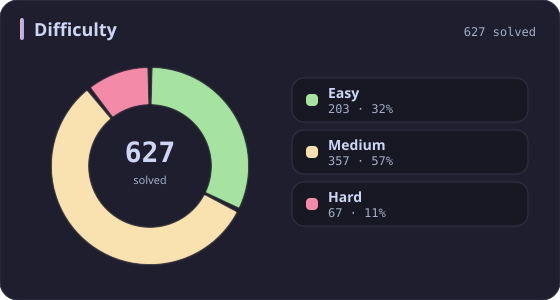
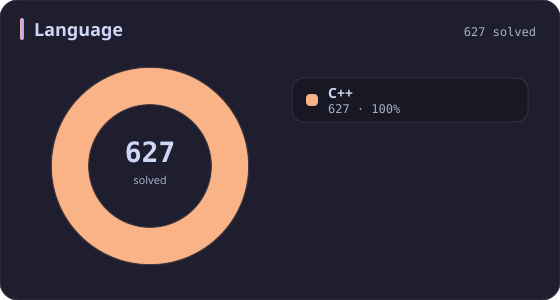
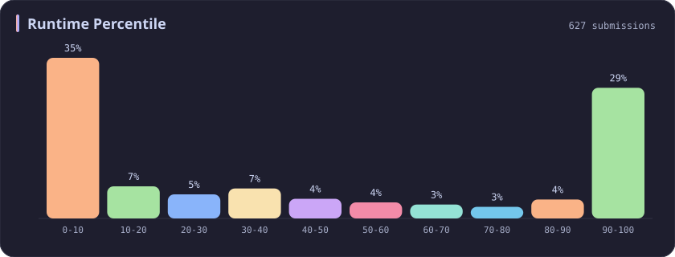
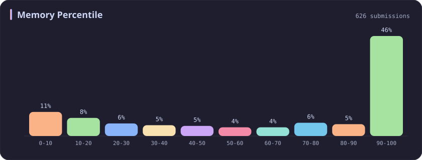
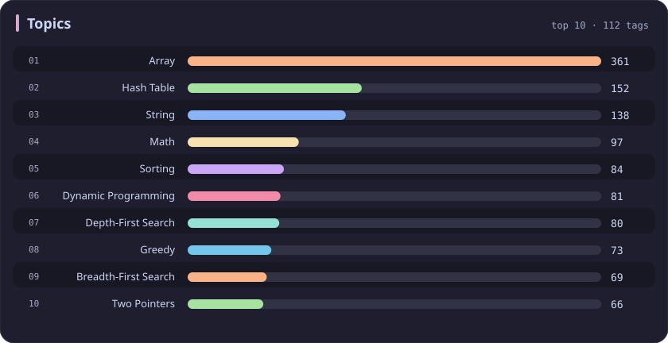

# C++ Stats

[All stats](../../README.md)

**626** problems · updated `2026-09-04 19:12 UTC`

## Stats

### Difficulty

### Language

| **C++** | [Python](python.md) | [SQL](sql.md) | [JavaScript](javascript.md) |
| :---: | :---: | :---: | :---: |
| **626** | 55 | 37 | 12 |

### Runtime Percentile

### Memory Percentile

### Topics

---

## Recent Activity

Latest **100** accepted submissions.

| Date | Title | Difficulty | Lang | Runtime | Memory |
| :--- | :--- | :---: | :---: | ---: | ---: |
| 2026-09-04 | [1. Two Sum](https://leetcode.com/problems/two-sum/) | Easy | C++ | 3 ms `67.25%` | 14.8 MB `58.55%` |
| 2026-09-04 | [704. Binary Search](https://leetcode.com/problems/binary-search/) | Easy | C++ | 0 ms `100.00%` | 31.3 MB `81.38%` |
| 2026-09-04 | [3903. Smallest Stable Index I](https://leetcode.com/problems/smallest-stable-index-i/) | Easy | C++ | 0 ms `100.00%` | 31.5 MB `20.68%` |
| 2026-09-03 | [3876. Construct Uniform Parity Array II](https://leetcode.com/problems/construct-uniform-parity-array-ii/) | Medium | C++ | 7 ms `42.89%` | 165.7 MB `84.39%` |
| 2026-09-02 | [3875. Construct Uniform Parity Array I](https://leetcode.com/problems/construct-uniform-parity-array-i/) | Easy | C++ | 0 ms `100.00%` | 30.3 MB `27.31%` |
| 2026-08-20 | [308. Range Sum Query 2D - Mutable](https://leetcode.com/problems/range-sum-query-2d-mutable/) | Medium | C++ | 19 ms `58.17%` | 44.6 MB `11.30%` |
| 2026-08-20 | [3069. Distribute Elements Into Two Arrays I](https://leetcode.com/problems/distribute-elements-into-two-arrays-i/) | Easy | C++ | 0 ms `100.00%` | 24 MB `32.91%` |
| 2026-08-19 | [1386. Cinema Seat Allocation](https://leetcode.com/problems/cinema-seat-allocation/) | Medium | C++ | 125 ms `9.88%` | 84.2 MB `20.70%` |
| 2026-08-18 | [3471. Find the Largest Almost Missing Integer](https://leetcode.com/problems/find-the-largest-almost-missing-integer/) | Easy | C++ | 0 ms `100.00%` | 28.9 MB `92.57%` |
| 2026-08-17 | [877. Stone Game](https://leetcode.com/problems/stone-game/) | Medium | C++ | 12 ms `17.70%` | 19.8 MB `7.31%` |
| 2026-08-17 | [1563. Stone Game V](https://leetcode.com/problems/stone-game-v/) | Hard | C++ | 407 ms `57.19%` | 27.6 MB `46.96%` |
| 2026-08-13 | [286. Walls and Gates](https://leetcode.com/problems/walls-and-gates/) | Medium | C++ | 7 ms `44.44%` | 19 MB `83.33%` |
| 2026-08-13 | [270. Closest Binary Search Tree Value](https://leetcode.com/problems/closest-binary-search-tree-value/) | Easy | C++ | 0 ms `100.00%` | 21.2 MB `48.40%` |
| 2026-08-13 | [250. Count Univalue Subtrees](https://leetcode.com/problems/count-univalue-subtrees/) | Medium | C++ | 0 ms `100.00%` | 18.5 MB `75.93%` |
| 2026-08-13 | [549. Binary Tree Longest Consecutive Sequence II](https://leetcode.com/problems/binary-tree-longest-consecutive-sequence-ii/) | Medium | C++ | 0 ms `100.00%` | 22.7 MB `78.57%` |
| 2026-06-11 | [3558. Number of Ways to Assign Edge Weights I](https://leetcode.com/problems/number-of-ways-to-assign-edge-weights-i/) | Medium | C++ | 303 ms `53.85%` | 346.5 MB `44.39%` |
| 2026-06-08 | [2161. Partition Array According to Given Pivot](https://leetcode.com/problems/partition-array-according-to-given-pivot/) | Medium | C++ | 7 ms `58.96%` | 139.4 MB `16.25%` |
| 2026-06-06 | [3952. Maximum Total Value of Covered Indices](https://leetcode.com/problems/maximum-total-value-of-covered-indices/) | Medium | C++ | 127 ms `33.96%` | 236.8 MB `31.46%` |
| 2026-06-06 | [3951. Minimum Energy to Maintain Brightness](https://leetcode.com/problems/minimum-energy-to-maintain-brightness/) | Medium | C++ | 74 ms `83.55%` | 203.6 MB `61.06%` |
| 2026-06-06 | [3950. Exactly One Consecutive Set Bits Pair](https://leetcode.com/problems/exactly-one-consecutive-set-bits-pair/) | Easy | C++ | 0 ms `100.00%` | 8.5 MB `7.25%` |
| 2026-06-06 | [2574. Left and Right Sum Differences](https://leetcode.com/problems/left-and-right-sum-differences/) | Easy | C++ | 0 ms `100.00%` | 15.2 MB `41.89%` |
| 2026-06-04 | [723. Candy Crush](https://leetcode.com/problems/candy-crush/) | Medium | C++ | 4 ms `61.92%` | 14.4 MB `20.92%` |
| 2026-06-04 | [298. Binary Tree Longest Consecutive Sequence](https://leetcode.com/problems/binary-tree-longest-consecutive-sequence/) | Medium | C++ | 0 ms `100.00%` | 32.9 MB `74.42%` |
| 2026-06-04 | [1265. Print Immutable Linked List in Reverse](https://leetcode.com/problems/print-immutable-linked-list-in-reverse/) | Medium | C++ | 0 ms `100.00%` | 9.9 MB `5.81%` |
| 2026-06-04 | [369. Plus One Linked List](https://leetcode.com/problems/plus-one-linked-list/) | Medium | C++ | 0 ms `100.00%` | 12.2 MB `56.32%` |
| 2026-06-04 | [3751. Total Waviness of Numbers in Range I](https://leetcode.com/problems/total-waviness-of-numbers-in-range-i/) | Medium | C++ | 50 ms `45.88%` | 9.3 MB `72.51%` |
| 2026-05-31 | [3945. Digit Frequency Score](https://leetcode.com/problems/digit-frequency-score/) | Easy | C++ | 0 ms `100.00%` | 8.7 MB `54.46%` |
| 2026-05-24 | [3942. Minimum Operations to Sort a Permutation](https://leetcode.com/problems/minimum-operations-to-sort-a-permutation/) | Medium | C++ | 15 ms `10.97%` | 156.1 MB `8.67%` |
| 2026-05-24 | [3941. Password Strength](https://leetcode.com/problems/password-strength/) | Medium | C++ | 20 ms `39.05%` | 17.6 MB `58.98%` |
| 2026-05-24 | [3940. Limit Occurrences in Sorted Array](https://leetcode.com/problems/limit-occurrences-in-sorted-array/) | Easy | C++ | 0 ms `100.00%` | 34.2 MB `8.37%` |
| 2026-05-23 | [3938. Maximum Path Intersection Sum in a Grid](https://leetcode.com/problems/maximum-path-intersection-sum-in-a-grid/) | Medium | C++ | 72 ms `9.23%` | 185.7 MB `5.00%` |
| 2026-05-23 | [3937. Minimum Operations to Make Array Modulo Alternating I](https://leetcode.com/problems/minimum-operations-to-make-array-modulo-alternating-i/) | Medium | C++ | 7 ms `79.04%` | 25.4 MB `15.30%` |
| 2026-05-23 | [1752. Check if Array Is Sorted and Rotated](https://leetcode.com/problems/check-if-array-is-sorted-and-rotated/) | Easy | C++ | 0 ms `100.00%` | 11.4 MB `19.48%` |
| 2026-05-22 | [33. Search in Rotated Sorted Array](https://leetcode.com/problems/search-in-rotated-sorted-array/) | Medium | C++ | 0 ms `100.00%` | 15 MB `96.75%` |
| 2026-05-21 | [3043. Find the Length of the Longest Common Prefix](https://leetcode.com/problems/find-the-length-of-the-longest-common-prefix/) | Medium | C++ | 374 ms `18.26%` | 156.5 MB `52.60%` |
| 2026-05-20 | [2061. Number of Spaces Cleaning Robot Cleaned](https://leetcode.com/problems/number-of-spaces-cleaning-robot-cleaned/) | Medium | C++ | 65 ms `26.67%` | 54 MB `26.67%` |
| 2026-05-20 | [2657. Find the Prefix Common Array of Two Arrays](https://leetcode.com/problems/find-the-prefix-common-array-of-two-arrays/) | Medium | C++ | 0 ms `100.00%` | 85.9 MB `74.63%` |
| 2026-05-19 | [2540. Minimum Common Value](https://leetcode.com/problems/minimum-common-value/) | Easy | C++ | 0 ms `100.00%` | 54.6 MB `26.20%` |
| 2026-03-25 | [3546. Equal Sum Grid Partition I](https://leetcode.com/problems/equal-sum-grid-partition-i/) | Medium | C++ | 12 ms `34.01%` | 130.2 MB `100.00%` |
| 2026-02-19 | [696. Count Binary Substrings](https://leetcode.com/problems/count-binary-substrings/) | Easy | C++ | 0 ms `100.00%` | 13.1 MB `56.88%` |
| 2026-02-10 | [3719. Longest Balanced Subarray I](https://leetcode.com/problems/longest-balanced-subarray-i/) | Medium | C++ | 151 ms `89.04%` | 35.7 MB `94.90%` |
| 2026-02-09 | [1382. Balance a Binary Search Tree](https://leetcode.com/problems/balance-a-binary-search-tree/) | Medium | C++ | 22 ms `20.32%` | 65.6 MB `66.43%` |
| 2026-02-08 | [1653. Minimum Deletions to Make String Balanced](https://leetcode.com/problems/minimum-deletions-to-make-string-balanced/) | Medium | C++ | 51 ms `18.43%` | 55.1 MB `19.34%` |
| 2026-02-08 | [110. Balanced Binary Tree](https://leetcode.com/problems/balanced-binary-tree/) | Easy | C++ | 0 ms `100.00%` | 23 MB `83.72%` |
| 2026-02-06 | [3634. Minimum Removals to Balance Array](https://leetcode.com/problems/minimum-removals-to-balance-array/) | Medium | C++ | 31 ms `62.90%` | 105 MB `86.33%` |
| 2026-02-05 | [3379. Transformed Array](https://leetcode.com/problems/transformed-array/) | Easy | C++ | 4 ms `78.48%` | 25.8 MB `9.70%` |
| 2025-10-17 | [3003. Maximize the Number of Partitions After Operations](https://leetcode.com/problems/maximize-the-number-of-partitions-after-operations/) | Hard | C++ | 4 ms `96.26%` | 12.3 MB `97.20%` |
| 2025-10-16 | [2598. Smallest Missing Non-negative Integer After Operations](https://leetcode.com/problems/smallest-missing-non-negative-integer-after-operations/) | Medium | C++ | 169 ms `13.05%` | 138.6 MB `45.43%` |
| 2025-10-15 | [3350. Adjacent Increasing Subarrays Detection II](https://leetcode.com/problems/adjacent-increasing-subarrays-detection-ii/) | Medium | C++ | 282 ms `8.37%` | 219.4 MB `6.08%` |
| 2025-10-14 | [3349. Adjacent Increasing Subarrays Detection I](https://leetcode.com/problems/adjacent-increasing-subarrays-detection-i/) | Easy | C++ | 13 ms `51.08%` | 40.4 MB `54.98%` |
| 2025-10-13 | [2273. Find Resultant Array After Removing Anagrams](https://leetcode.com/problems/find-resultant-array-after-removing-anagrams/) | Easy | C++ | 3 ms `45.53%` | 17.9 MB `24.76%` |
| 2025-10-12 | [3715. Sum of Perfect Square Ancestors](https://leetcode.com/problems/sum-of-perfect-square-ancestors/) | Hard | C++ | 1461 ms `21.09%` | 383.2 MB `25.85%` |
| 2025-10-12 | [3714. Longest Balanced Substring II](https://leetcode.com/problems/longest-balanced-substring-ii/) | Medium | C++ | 1603 ms `59.24%` | 403.9 MB `18.22%` |
| 2025-10-12 | [3713. Longest Balanced Substring I](https://leetcode.com/problems/longest-balanced-substring-i/) | Medium | C++ | 3030 ms `5.07%` | 498.4 MB `5.06%` |
| 2025-10-12 | [3712. Sum of Elements With Frequency Divisible by K](https://leetcode.com/problems/sum-of-elements-with-frequency-divisible-by-k/) | Easy | C++ | 0 ms `100.00%` | 26.4 MB `12.32%` |
| 2025-10-11 | [3147. Taking Maximum Energy From the Mystic Dungeon](https://leetcode.com/problems/taking-maximum-energy-from-the-mystic-dungeon/) | Medium | C++ | 141 ms `82.37%` | 151.8 MB `100.00%` |
| 2025-10-11 | [3186. Maximum Total Damage With Spell Casting](https://leetcode.com/problems/maximum-total-damage-with-spell-casting/) | Medium | C++ | 111 ms `86.08%` | 162.8 MB `90.83%` |
| 2025-10-11 | [3710. Maximum Partition Factor](https://leetcode.com/problems/maximum-partition-factor/) | Hard | C++ | 1245 ms `35.15%` | 336.4 MB `37.63%` |
| 2025-10-11 | [3708. Longest Fibonacci Subarray](https://leetcode.com/problems/longest-fibonacci-subarray/) | Medium | C++ | 0 ms `100.00%` | 102.8 MB `45.05%` |
| 2025-10-11 | [3707. Equal Score Substrings](https://leetcode.com/problems/equal-score-substrings/) | Easy | C++ | 3 ms `23.55%` | 8.6 MB `44.95%` |
| 2025-10-09 | [3494. Find the Minimum Amount of Time to Brew Potions](https://leetcode.com/problems/find-the-minimum-amount-of-time-to-brew-potions/) | Medium | C++ | 575 ms `18.46%` | 407.4 MB `15.38%` |
| 2025-10-08 | [774. Minimize Max Distance to Gas Station](https://leetcode.com/problems/minimize-max-distance-to-gas-station/) | Hard | C++ | 9 ms `66.90%` | 18 MB `8.45%` |
| 2025-10-08 | [2300. Successful Pairs of Spells and Potions](https://leetcode.com/problems/successful-pairs-of-spells-and-potions/) | Medium | C++ | 47 ms `42.48%` | 138.4 MB `8.28%` |
| 2025-10-07 | [1488. Avoid Flood in The City](https://leetcode.com/problems/avoid-flood-in-the-city/) | Medium | C++ | 216 ms `21.79%` | 121.2 MB `100.00%` |
| 2025-10-06 | [778. Swim in Rising Water](https://leetcode.com/problems/swim-in-rising-water/) | Hard | C++ | 34 ms `7.85%` | 17.1 MB `10.48%` |
| 2025-10-05 | [417. Pacific Atlantic Water Flow](https://leetcode.com/problems/pacific-atlantic-water-flow/) | Medium | C++ | 4 ms `76.47%` | 22.2 MB `76.03%` |
| 2025-10-04 | [11. Container With Most Water](https://leetcode.com/problems/container-with-most-water/) | Medium | C++ | 0 ms `100.00%` | 62.8 MB `79.30%` |
| 2025-10-03 | [1135. Connecting Cities With Minimum Cost](https://leetcode.com/problems/connecting-cities-with-minimum-cost/) | Medium | C++ | 45 ms `32.04%` | 58.5 MB `26.21%` |
| 2025-10-03 | [407. Trapping Rain Water II](https://leetcode.com/problems/trapping-rain-water-ii/) | Hard | C++ | 34 ms `43.03%` | 22.7 MB `32.34%` |
| 2025-10-02 | [3100. Water Bottles II](https://leetcode.com/problems/water-bottles-ii/) | Medium | C++ | 2 ms `38.80%` | 8.7 MB `15.89%` |
| 2025-10-01 | [1518. Water Bottles](https://leetcode.com/problems/water-bottles/) | Easy | C++ | 0 ms `100.00%` | 7.8 MB `46.26%` |
| 2025-09-30 | [2221. Find Triangular Sum of an Array](https://leetcode.com/problems/find-triangular-sum-of-an-array/) | Medium | C++ | 431 ms `5.07%` | 384.5 MB `5.28%` |
| 2025-09-29 | [1121. Divide Array Into Increasing Sequences](https://leetcode.com/problems/divide-array-into-increasing-sequences/) | Hard | C++ | 95 ms `41.67%` | 107.6 MB `33.33%` |
| 2025-09-29 | [1039. Minimum Score Triangulation of Polygon](https://leetcode.com/problems/minimum-score-triangulation-of-polygon/) | Medium | C++ | 5 ms `10.47%` | 11.4 MB `15.89%` |
| 2025-09-28 | [976. Largest Perimeter Triangle](https://leetcode.com/problems/largest-perimeter-triangle/) | Easy | C++ | 12 ms `25.68%` | 25.6 MB `79.00%` |
| 2025-09-28 | [3700. Number of ZigZag Arrays II](https://leetcode.com/problems/number-of-zigzag-arrays-ii/) | Hard | C++ | 285 ms `71.83%` | 23.4 MB `79.93%` |
| 2025-09-28 | [3699. Number of ZigZag Arrays I](https://leetcode.com/problems/number-of-zigzag-arrays-i/) | Hard | C++ | 407 ms `76.79%` | 11.7 MB `94.59%` |
| 2025-09-28 | [3698. Split Array With Minimum Difference](https://leetcode.com/problems/split-array-with-minimum-difference/) | Medium | C++ | 0 ms `100.00%` | 169.6 MB `94.85%` |
| 2025-09-28 | [3697. Compute Decimal Representation](https://leetcode.com/problems/compute-decimal-representation/) | Easy | C++ | 0 ms `100.00%` | 9.8 MB `33.26%` |
| 2025-09-27 | [3695. Maximize Alternating Sum Using Swaps](https://leetcode.com/problems/maximize-alternating-sum-using-swaps/) | Hard | C++ | 294 ms `56.92%` | 341.9 MB `32.45%` |
| 2025-09-27 | [3694. Distinct Points Reachable After Substring Removal](https://leetcode.com/problems/distinct-points-reachable-after-substring-removal/) | Medium | C++ | 130 ms `52.48%` | 53.5 MB `42.98%` |
| 2025-09-27 | [3693. Climbing Stairs II](https://leetcode.com/problems/climbing-stairs-ii/) | Medium | C++ | 20 ms `54.23%` | 177.8 MB `64.31%` |
| 2025-09-27 | [3692. Majority Frequency Characters](https://leetcode.com/problems/majority-frequency-characters/) | Easy | C++ | 5 ms `31.61%` | 9.2 MB `86.77%` |
| 2025-09-27 | [3690. Split and Merge Array Transformation](https://leetcode.com/problems/split-and-merge-array-transformation/) | Medium | C++ | 1672 ms `7.57%` | 432.5 MB `21.01%` |
| 2025-09-27 | [3689. Maximum Total Subarray Value I](https://leetcode.com/problems/maximum-total-subarray-value-i/) | Medium | C++ | 5 ms `15.46%` | 103.6 MB `97.34%` |
| 2025-09-27 | [3688. Bitwise OR of Even Numbers in an Array](https://leetcode.com/problems/bitwise-or-of-even-numbers-in-an-array/) | Easy | C++ | 0 ms `100.00%` | 24.5 MB `71.15%` |
| 2025-09-27 | [812. Largest Triangle Area](https://leetcode.com/problems/largest-triangle-area/) | Easy | C++ | 0 ms `100.00%` | 10.6 MB `7.20%` |
| 2025-09-26 | [1152. Analyze User Website Visit Pattern](https://leetcode.com/problems/analyze-user-website-visit-pattern/) | Medium | C++ | 55 ms `19.05%` | 26.6 MB `42.86%` |
| 2025-09-26 | [611. Valid Triangle Number](https://leetcode.com/problems/valid-triangle-number/) | Medium | C++ | 430 ms `8.62%` | 16.8 MB `10.43%` |
| 2025-09-25 | [120. Triangle](https://leetcode.com/problems/triangle/) | Medium | C++ | 0 ms `100.00%` | 13.9 MB `5.01%` |
| 2025-09-22 | [3005. Count Elements With Maximum Frequency](https://leetcode.com/problems/count-elements-with-maximum-frequency/) | Easy | C++ | 0 ms `100.00%` | 23.6 MB `8.88%` |
| 2025-09-21 | [1912. Design Movie Rental System](https://leetcode.com/problems/design-movie-rental-system/) | Hard | C++ | 333 ms `34.71%` | 444.6 MB `8.94%` |
| 2025-09-20 | [3508. Implement Router](https://leetcode.com/problems/implement-router/) | Medium | C++ | 190 ms `82.01%` | 415.1 MB `99.28%` |
| 2025-09-18 | [3408. Design Task Manager](https://leetcode.com/problems/design-task-manager/) | Medium | C++ | 209 ms `78.45%` | 347.5 MB `98.90%` |
| 2025-09-17 | [2353. Design a Food Rating System](https://leetcode.com/problems/design-a-food-rating-system/) | Medium | C++ | 164 ms `34.81%` | 162.7 MB `91.36%` |
| 2025-09-16 | [2197. Replace Non-Coprime Numbers in Array](https://leetcode.com/problems/replace-non-coprime-numbers-in-array/) | Hard | C++ | 2138 ms `5.26%` | 306.9 MB `5.26%` |
| 2025-09-14 | [966. Vowel Spellchecker](https://leetcode.com/problems/vowel-spellchecker/) | Medium | C++ | 37 ms `68.34%` | 41.6 MB `55.21%` |
| 2025-09-13 | [3541. Find Most Frequent Vowel and Consonant](https://leetcode.com/problems/find-most-frequent-vowel-and-consonant/) | Easy | C++ | 2 ms `39.99%` | 10 MB `24.45%` |
| 2025-09-11 | [2785. Sort Vowels in a String](https://leetcode.com/problems/sort-vowels-in-a-string/) | Medium | C++ | 19 ms `35.89%` | 20.6 MB `5.76%` |
| 2025-09-10 | [1133. Largest Unique Number](https://leetcode.com/problems/largest-unique-number/) | Easy | C++ | 0 ms `100.00%` | 12.2 MB `95.53%` |
