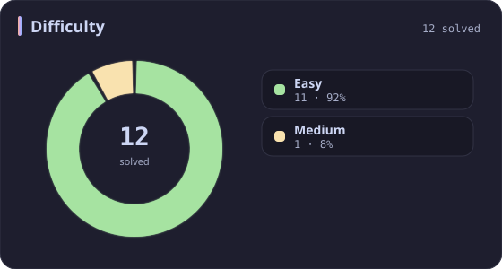
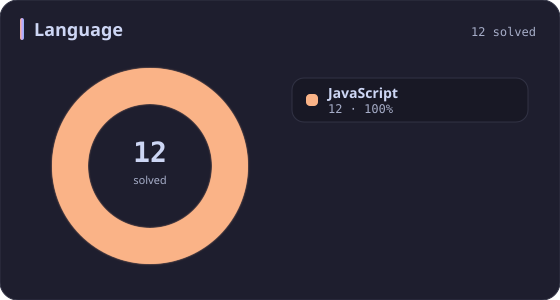
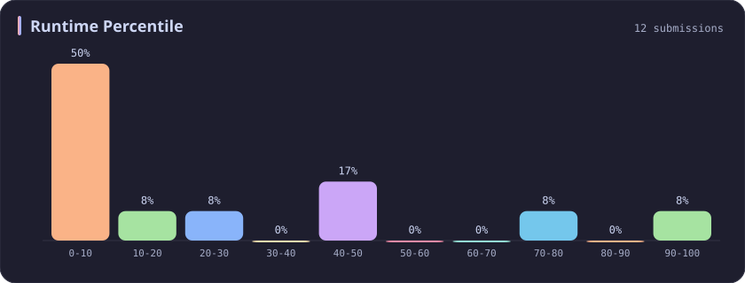
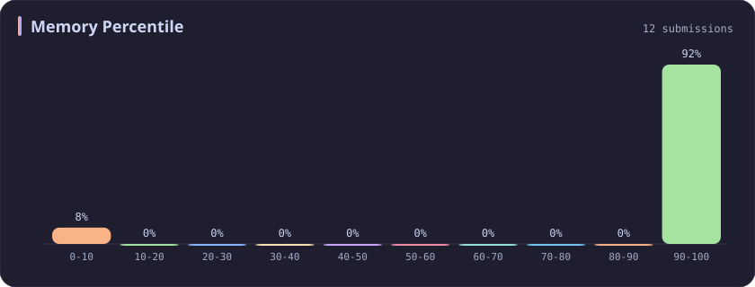

# JavaScript Stats

[All stats](../../README.md)

**12** problems · updated `2026-09-04 19:23 UTC`

## Stats

### Difficulty

### Language

| [C++](cpp.md) | [Python](python.md) | [SQL](sql.md) | **JavaScript** |
| :---: | :---: | :---: | :---: |
| 626 | 55 | 37 | **12** |

### Runtime Percentile

### Memory Percentile

---

## Recent Activity

Latest **12** accepted submissions.

| Date | Title | Difficulty | Lang | Runtime | Memory |
| :--- | :--- | :---: | :---: | ---: | ---: |
| 2023&#8209;10&#8209;04 | [2727. Is Object Empty](https://leetcode.com/problems/is-object-empty/) | Easy | JavaScript | 39 ms `78.61%` | 44 MB `100.00%` |
| 2023&#8209;10&#8209;01 | [2623. Memoize](https://leetcode.com/problems/memoize/) | Medium | JavaScript | 405 ms `5.08%` | 106.4 MB `5.24%` |
| 2023&#8209;10&#8209;01 | [2666. Allow One Function Call](https://leetcode.com/problems/allow-one-function-call/) | Easy | JavaScript | 53 ms `9.76%` | 42 MB `100.00%` |
| 2023&#8209;10&#8209;01 | [2703. Return Length of Arguments Passed](https://leetcode.com/problems/return-length-of-arguments-passed/) | Easy | JavaScript | 55 ms `5.98%` | 41.8 MB `100.00%` |
| 2023&#8209;10&#8209;01 | [2629. Function Composition](https://leetcode.com/problems/function-composition/) | Easy | JavaScript | 63 ms `16.45%` | 43.6 MB `100.00%` |
| 2023&#8209;10&#8209;01 | [2626. Array Reduce Transformation](https://leetcode.com/problems/array-reduce-transformation/) | Easy | JavaScript | 61 ms `5.87%` | 41.8 MB `100.00%` |
| 2023&#8209;10&#8209;01 | [2634. Filter Elements from Array](https://leetcode.com/problems/filter-elements-from-array/) | Easy | JavaScript | 46 ms `41.32%` | 41.7 MB `100.00%` |
| 2023&#8209;10&#8209;01 | [2635. Apply Transform Over Each Element in Array](https://leetcode.com/problems/apply-transform-over-each-element-in-array/) | Easy | JavaScript | 46 ms `40.86%` | 42.1 MB `100.00%` |
| 2023&#8209;10&#8209;01 | [2665. Counter II](https://leetcode.com/problems/counter-ii/) | Easy | JavaScript | 73 ms `5.64%` | 43.8 MB `100.00%` |
| 2023&#8209;10&#8209;01 | [2704. To Be Or Not To Be](https://leetcode.com/problems/to-be-or-not-to-be/) | Easy | JavaScript | 50 ms `20.98%` | 42.3 MB `100.00%` |
| 2023&#8209;10&#8209;01 | [2620. Counter](https://leetcode.com/problems/counter/) | Easy | JavaScript | 35 ms `90.66%` | 41.6 MB `100.00%` |
| 2023&#8209;10&#8209;01 | [2667. Create Hello World Function](https://leetcode.com/problems/create-hello-world-function/) | Easy | JavaScript | 52 ms `8.40%` | 42.1 MB `100.00%` |
