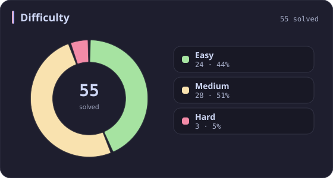
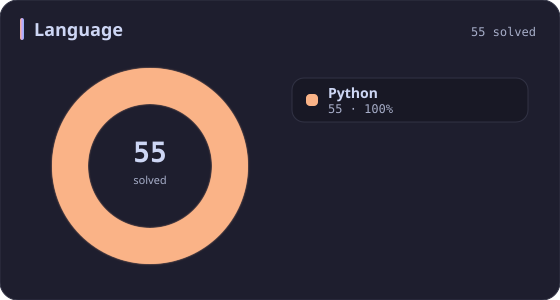
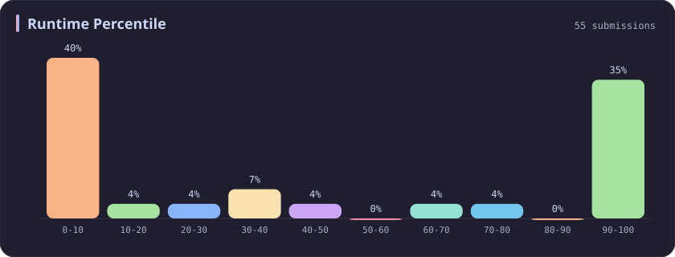
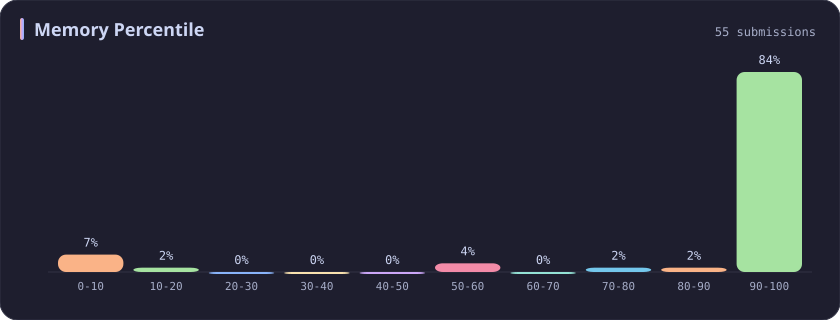
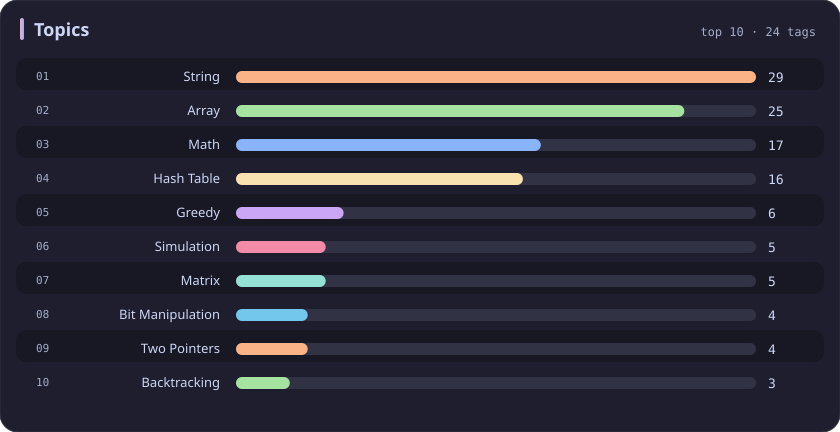

# Python Stats

[All stats](../../README.md)

**55** problems · updated `2026-09-04 19:10 UTC`

## Stats

### Difficulty

### Language

| [C++](cpp.md) | **Python** | [SQL](sql.md) | [JavaScript](javascript.md) |
| :---: | :---: | :---: | :---: |
| 626 | **55** | 37 | 12 |

### Runtime Percentile

### Memory Percentile

### Topics

---

## Recent Activity

Latest **55** accepted submissions.

| Date | # | Title | Difficulty | Lang | Runtime | Memory |
| :--- | ---: | :--- | :---: | :---: | ---: | ---: |
| 2026-05-23 | 3936 | [Minimum Swaps to Move Zeros to End](https://leetcode.com/problems/minimum-swaps-to-move-zeros-to-end/) | Easy | Python | 0 ms `100.00%` | 19.2 MB `57.55%` |
| 2026-05-23 | 2744 | [Find Maximum Number of String Pairs](https://leetcode.com/problems/find-maximum-number-of-string-pairs/) | Easy | Python | 15 ms `8.76%` | 19.3 MB `18.79%` |
| 2025-10-12 | 3539 | [Find Sum of Array Product of Magical Sequences](https://leetcode.com/problems/find-sum-of-array-product-of-magical-sequences/) | Hard | Python | 411 ms `97.50%` | 33.9 MB `70.00%` |
| 2025-09-24 | 166 | [Fraction to Recurring Decimal](https://leetcode.com/problems/fraction-to-recurring-decimal/) | Medium | Python | 0 ms `100.00%` | 17.9 MB `100.00%` |
| 2025-09-23 | 165 | [Compare Version Numbers](https://leetcode.com/problems/compare-version-numbers/) | Medium | Python | 0 ms `100.00%` | 17.7 MB `100.00%` |
| 2025-09-19 | 3484 | [Design Spreadsheet](https://leetcode.com/problems/design-spreadsheet/) | Medium | Python | 57 ms `96.77%` | 23.5 MB `100.00%` |
| 2025-09-16 | 1150 | [Check If a Number Is Majority Element in a Sorted Array](https://leetcode.com/problems/check-if-a-number-is-majority-element-in-a-sorted-array/) | Easy | Python | 0 ms `100.00%` | 18 MB `100.00%` |
| 2025-09-15 | 1935 | [Maximum Number of Words You Can Type](https://leetcode.com/problems/maximum-number-of-words-you-can-type/) | Easy | Python | 3 ms `33.08%` | 17.9 MB `100.00%` |
| 2025-09-12 | 3227 | [Vowels Game in a String](https://leetcode.com/problems/vowels-game-in-a-string/) | Medium | Python | 0 ms `100.00%` | 18.2 MB `100.00%` |
| 2025-09-07 | 1304 | [Find N Unique Integers Sum up to Zero](https://leetcode.com/problems/find-n-unique-integers-sum-up-to-zero/) | Easy | Python | 3 ms `4.43%` | 17.9 MB `100.00%` |
| 2025-08-27 | 1181 | [Before and After Puzzle](https://leetcode.com/problems/before-and-after-puzzle/) | Medium | Python | 15 ms `5.56%` | 18.2 MB `100.00%` |
| 2025-08-16 | 1323 | [Maximum 69 Number](https://leetcode.com/problems/maximum-69-number/) | Easy | Python | 0 ms `100.00%` | 17.9 MB `100.00%` |
| 2025-06-16 | 2016 | [Maximum Difference Between Increasing Elements](https://leetcode.com/problems/maximum-difference-between-increasing-elements/) | Easy | Python | 0 ms `100.00%` | 17.9 MB `100.00%` |
| 2025-06-15 | 1432 | [Max Difference You Can Get From Changing an Integer](https://leetcode.com/problems/max-difference-you-can-get-from-changing-an-integer/) | Medium | Python | 0 ms `100.00%` | 17.6 MB `100.00%` |
| 2025-06-14 | 2566 | [Maximum Difference by Remapping a Digit](https://leetcode.com/problems/maximum-difference-by-remapping-a-digit/) | Easy | Python | 0 ms `100.00%` | 17.9 MB `100.00%` |
| 2025-06-12 | 3423 | [Maximum Difference Between Adjacent Elements in a Circular Array](https://leetcode.com/problems/maximum-difference-between-adjacent-elements-in-a-circular-array/) | Easy | Python | 3 ms `42.01%` | 17.8 MB `100.00%` |
| 2025-05-24 | 2942 | [Find Words Containing Character](https://leetcode.com/problems/find-words-containing-character/) | Easy | Python | 0 ms `100.00%` | 17.7 MB `100.00%` |
| 2025-05-06 | 1920 | [Build Array from Permutation](https://leetcode.com/problems/build-array-from-permutation/) | Easy | Python | 0 ms `100.00%` | 18 MB `100.00%` |
| 2025-05-04 | 531 | [Lonely Pixel I](https://leetcode.com/problems/lonely-pixel-i/) | Medium | Python | 32 ms `5.66%` | 22.9 MB `100.00%` |
| 2025-05-04 | 422 | [Valid Word Square](https://leetcode.com/problems/valid-word-square/) | Easy | Python | 18 ms `65.88%` | 18.4 MB `100.00%` |
| 2025-05-03 | 1007 | [Minimum Domino Rotations For Equal Row](https://leetcode.com/problems/minimum-domino-rotations-for-equal-row/) | Medium | Python | 91 ms `9.86%` | 18.4 MB `100.00%` |
| 2025-04-30 | 1295 | [Find Numbers with Even Number of Digits](https://leetcode.com/problems/find-numbers-with-even-number-of-digits/) | Easy | Python | 4 ms `32.34%` | 12.5 MB `4.41%` |
| 2025-04-26 | 760 | [Find Anagram Mappings](https://leetcode.com/problems/find-anagram-mappings/) | Easy | Python | 0 ms `100.00%` | 17.7 MB `100.00%` |
| 2025-04-25 | 161 | [One Edit Distance](https://leetcode.com/problems/one-edit-distance/) | Medium | Python | 3 ms `26.80%` | 17.7 MB `100.00%` |
| 2025-04-25 | 1427 | [Perform String Shifts](https://leetcode.com/problems/perform-string-shifts/) | Easy | Python | 0 ms `100.00%` | 17.9 MB `100.00%` |
| 2025-04-25 | 1056 | [Confusing Number](https://leetcode.com/problems/confusing-number/) | Easy | Python | 0 ms `100.00%` | 18 MB `100.00%` |
| 2025-04-23 | 216 | [Combination Sum III](https://leetcode.com/problems/combination-sum-iii/) | Medium | Python | 3 ms `19.31%` | 18 MB `100.00%` |
| 2025-04-23 | 17 | [Letter Combinations of a Phone Number](https://leetcode.com/problems/letter-combinations-of-a-phone-number/) | Medium | Python | 0 ms `100.00%` | 17.7 MB `100.00%` |
| 2025-04-19 | 2215 | [Find the Difference of Two Arrays](https://leetcode.com/problems/find-the-difference-of-two-arrays/) | Easy | Python | 5 ms `77.75%` | 18 MB `100.00%` |
| 2025-04-19 | 2352 | [Equal Row and Column Pairs](https://leetcode.com/problems/equal-row-and-column-pairs/) | Medium | Python | 51 ms `32.70%` | 22.1 MB `99.98%` |
| 2025-04-19 | 151 | [Reverse Words in a String](https://leetcode.com/problems/reverse-words-in-a-string/) | Medium | Python | 3 ms `30.78%` | 17.8 MB `100.00%` |
| 2024-11-14 | 1213 | [Intersection of Three Sorted Arrays](https://leetcode.com/problems/intersection-of-three-sorted-arrays/) | Easy | Python | 4 ms `41.61%` | 16.9 MB `100.00%` |
| 2024-11-02 | 2490 | [Circular Sentence](https://leetcode.com/problems/circular-sentence/) | Easy | Python | 0 ms `100.00%` | 16.6 MB `100.00%` |
| 2024-10-21 | 1593 | [Split a String Into the Max Number of Unique Substrings](https://leetcode.com/problems/split-a-string-into-the-max-number-of-unique-substrings/) | Medium | Python | 1706 ms `5.01%` | 29.9 MB `8.46%` |
| 2024-10-20 | 648 | [Replace Words](https://leetcode.com/problems/replace-words/) | Medium | Python | 136 ms `24.51%` | 26.7 MB `100.00%` |
| 2024-04-13 | 85 | [Maximal Rectangle](https://leetcode.com/problems/maximal-rectangle/) | Hard | Python | 1343 ms `6.67%` | 24.6 MB `50.77%` |
| 2024-04-11 | 402 | [Remove K Digits](https://leetcode.com/problems/remove-k-digits/) | Medium | Python | 63 ms `5.34%` | 18.1 MB `100.00%` |
| 2024-04-01 | 58 | [Length of Last Word](https://leetcode.com/problems/length-of-last-word/) | Easy | Python | 37 ms `0.22%` | 16.7 MB `100.00%` |
| 2023-10-02 | 2038 | [Remove Colored Pieces if Both Neighbors are the Same Color](https://leetcode.com/problems/remove-colored-pieces-if-both-neighbors-are-the-same-color/) | Medium | Python | 205 ms `9.43%` | 19.9 MB `85.28%` |
| 2023-10-01 | 185 | [Department Top Three Salaries](https://leetcode.com/problems/department-top-three-salaries/) | Hard | Python | 745 ms `5.52%` | 62.8 MB `100.00%` |
| 2023-09-30 | 180 | [Consecutive Numbers](https://leetcode.com/problems/consecutive-numbers/) | Medium | Python | 897 ms `5.05%` | 60.6 MB `100.00%` |
| 2023-04-12 | 71 | [Simplify Path](https://leetcode.com/problems/simplify-path/) | Medium | Python | 37 ms `5.67%` | 13.7 MB `100.00%` |
| 2023-03-25 | 49 | [Group Anagrams](https://leetcode.com/problems/group-anagrams/) | Medium | Python | 110 ms `5.00%` | 19.1 MB `100.00%` |
| 2023-03-17 | 43 | [Multiply Strings](https://leetcode.com/problems/multiply-strings/) | Medium | Python | 36 ms `64.41%` | 13.8 MB `100.00%` |
| 2023-03-10 | 1309 | [Decrypt String from Alphabet to Integer Mapping](https://leetcode.com/problems/decrypt-string-from-alphabet-to-integer-mapping/) | Easy | Python | 27 ms `0.47%` | 13.7 MB `100.00%` |
| 2023-03-10 | 709 | [To Lower Case](https://leetcode.com/problems/to-lower-case/) | Easy | Python | 38 ms `0.05%` | 13.9 MB `100.00%` |
| 2023-03-10 | 1678 | [Goal Parser Interpretation](https://leetcode.com/problems/goal-parser-interpretation/) | Easy | Python | 30 ms `99.06%` | 13.9 MB `100.00%` |
| 2023-03-06 | 29 | [Divide Two Integers](https://leetcode.com/problems/divide-two-integers/) | Medium | Python | 211 ms `2.00%` | 31.8 MB `6.12%` |
| 2023-02-28 | 537 | [Complex Number Multiplication](https://leetcode.com/problems/complex-number-multiplication/) | Medium | Python | 32 ms `0.00%` | 13.9 MB `100.00%` |
| 2023-02-21 | 2564 | [Substring XOR Queries](https://leetcode.com/problems/substring-xor-queries/) | Medium | Python | 2986 ms `5.68%` | 148.4 MB `6.82%` |
| 2023-02-20 | 2546 | [Apply Bitwise Operations to Make Strings Equal](https://leetcode.com/problems/apply-bitwise-operations-to-make-strings-equal/) | Medium | Python | 37 ms `10.53%` | 15 MB `100.00%` |
| 2023-02-19 | 13 | [Roman to Integer](https://leetcode.com/problems/roman-to-integer/) | Easy | Python | 52 ms `5.25%` | 13.9 MB `100.00%` |
| 2023-02-19 | 8 | [String to Integer (atoi)](https://leetcode.com/problems/string-to-integer-atoi/) | Medium | Python | 31 ms `5.60%` | 13.8 MB `100.00%` |
| 2023-02-16 | 7 | [Reverse Integer](https://leetcode.com/problems/reverse-integer/) | Medium | Python | 42 ms `79.32%` | 13.9 MB `100.00%` |
| 2023-02-16 | 50 | [Pow(x, n)](https://leetcode.com/problems/powx-n/) | Medium | Python | 26 ms `0.77%` | 13.9 MB `100.00%` |
