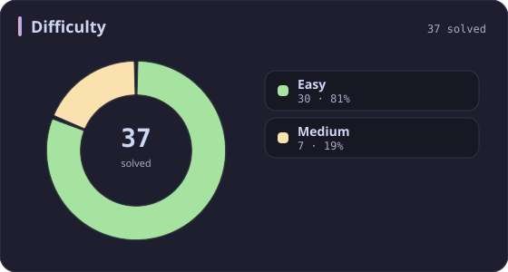
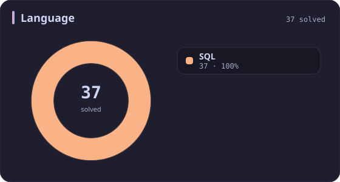
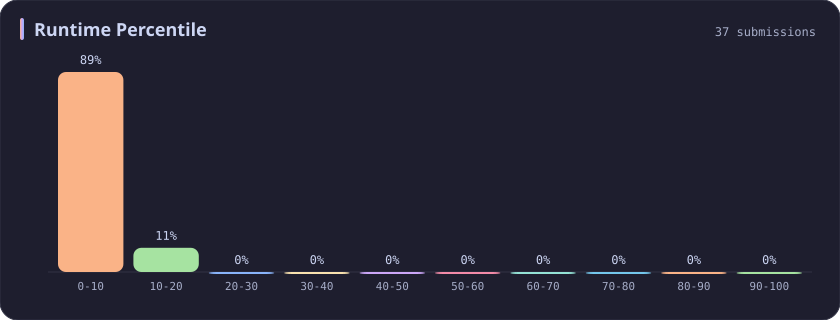
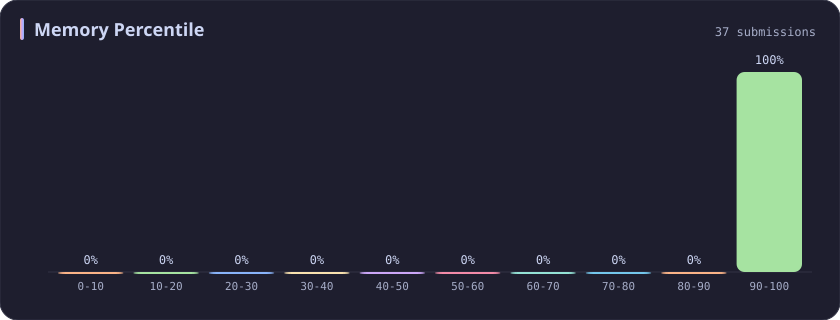

# SQL Stats

[All stats](../../README.md)

**37** problems · updated `2026-09-05 03:36 UTC+8`

## Stats

### Difficulty

### Language

| [C++](cpp.md) | [Python](python.md) | **SQL** | [JavaScript](javascript.md) |
| :---: | :---: | :---: | :---: |
| 627 | 55 | **37** | 12 |

### Runtime Percentile

### Memory Percentile

### Topics

---

## Recent Activity

Latest **37** accepted submissions.

| Date | Title | Difficulty | Lang | Runtime | Memory |
| :--- | :--- | :---: | :---: | ---: | ---: |
| 2023&#8209;03&#8209;09 | [1393. Capital Gain/Loss](https://leetcode.com/problems/capital-gainloss/) | Medium | SQL | 1187 ms `5.00%` | 0.0B `100.00%` |
| 2023&#8209;03&#8209;09 | [1407. Top Travellers](https://leetcode.com/problems/top-travellers/) | Easy | SQL | 1771 ms `5.02%` | 0.0B `100.00%` |
| 2023&#8209;03&#8209;09 | [1158. Market Analysis I](https://leetcode.com/problems/market-analysis-i/) | Medium | SQL | 2378 ms `5.01%` | 0.0B `100.00%` |
| 2023&#8209;03&#8209;09 | [1050. Actors and Directors Who Cooperated At Least Three Times](https://leetcode.com/problems/actors-and-directors-who-cooperated-at-least-three-times/) | Easy | SQL | 673 ms `5.01%` | 0.0B `100.00%` |
| 2023&#8209;03&#8209;09 | [586. Customer Placing the Largest Number of Orders](https://leetcode.com/problems/customer-placing-the-largest-number-of-orders/) | Easy | SQL | 875 ms `5.01%` | 0.0B `100.00%` |
| 2023&#8209;03&#8209;09 | [1890. The Latest Login in 2020](https://leetcode.com/problems/the-latest-login-in-2020/) | Easy | SQL | 1439 ms `5.02%` | 0.0B `100.00%` |
| 2023&#8209;03&#8209;09 | [1729. Find Followers Count](https://leetcode.com/problems/find-followers-count/) | Easy | SQL | 1076 ms `5.01%` | 0.0B `100.00%` |
| 2023&#8209;03&#8209;09 | [1587. Bank Account Summary II](https://leetcode.com/problems/bank-account-summary-ii/) | Easy | SQL | 2064 ms `5.01%` | 0.0B `100.00%` |
| 2023&#8209;03&#8209;09 | [1084. Sales Analysis III](https://leetcode.com/problems/sales-analysis-iii/) | Easy | SQL | 2837 ms `5.01%` | 0.0B `100.00%` |
| 2023&#8209;03&#8209;09 | [182. Duplicate Emails](https://leetcode.com/problems/duplicate-emails/) | Easy | SQL | 702 ms `5.09%` | 0.0B `100.00%` |
| 2023&#8209;03&#8209;09 | [1741. Find Total Time Spent by Each Employee](https://leetcode.com/problems/find-total-time-spent-by-each-employee/) | Easy | SQL | 1228 ms `5.02%` | 0.0B `100.00%` |
| 2023&#8209;03&#8209;09 | [511. Game Play Analysis I](https://leetcode.com/problems/game-play-analysis-i/) | Easy | SQL | 926 ms `5.31%` | 0.0B `100.00%` |
| 2023&#8209;03&#8209;09 | [1693. Daily Leads and Partners](https://leetcode.com/problems/daily-leads-and-partners/) | Easy | SQL | 1347 ms `5.00%` | 0.0B `100.00%` |
| 2023&#8209;03&#8209;09 | [1141. User Activity for the Past 30 Days I](https://leetcode.com/problems/user-activity-for-the-past-30-days-i/) | Easy | SQL | 839 ms `5.62%` | 0.0B `100.00%` |
| 2023&#8209;03&#8209;09 | [197. Rising Temperature](https://leetcode.com/problems/rising-temperature/) | Easy | SQL | 685 ms `11.20%` | 0.0B `100.00%` |
| 2023&#8209;03&#8209;09 | [607. Sales Person](https://leetcode.com/problems/sales-person/) | Easy | SQL | 2756 ms `5.00%` | 0.0B `100.00%` |
| 2023&#8209;03&#8209;09 | [1148. Article Views I](https://leetcode.com/problems/article-views-i/) | Easy | SQL | 947 ms `5.02%` | 0.0B `100.00%` |
| 2023&#8209;03&#8209;09 | [1581. Customer Who Visited but Did Not Make Any Transactions](https://leetcode.com/problems/customer-who-visited-but-did-not-make-any-transactions/) | Easy | SQL | 2651 ms `5.01%` | 0.0B `100.00%` |
| 2023&#8209;03&#8209;09 | [175. Combine Two Tables](https://leetcode.com/problems/combine-two-tables/) | Easy | SQL | 700 ms `5.99%` | 0.0B `100.00%` |
| 2023&#8209;03&#8209;09 | [176. Second Highest Salary](https://leetcode.com/problems/second-highest-salary/) | Medium | SQL | 448 ms `8.16%` | 0.0B `100.00%` |
| 2023&#8209;03&#8209;09 | [608. Tree Node](https://leetcode.com/problems/tree-node/) | Medium | SQL | 983 ms `5.01%` | 0.0B `100.00%` |
| 2023&#8209;03&#8209;09 | [1795. Rearrange Products Table](https://leetcode.com/problems/rearrange-products-table/) | Easy | SQL | 1320 ms `5.02%` | 0.0B `100.00%` |
| 2023&#8209;03&#8209;09 | [1965. Employees With Missing Information](https://leetcode.com/problems/employees-with-missing-information/) | Easy | SQL | 1081 ms `5.00%` | 0.0B `100.00%` |
| 2023&#8209;03&#8209;09 | [1527. Patients With a Condition](https://leetcode.com/problems/patients-with-a-condition/) | Easy | SQL | 797 ms `5.00%` | 0.0B `100.00%` |
| 2023&#8209;03&#8209;09 | [1484. Group Sold Products By The Date](https://leetcode.com/problems/group-sold-products-by-the-date/) | Easy | SQL | 801 ms `5.42%` | 0.0B `100.00%` |
| 2023&#8209;03&#8209;09 | [1667. Fix Names in a Table](https://leetcode.com/problems/fix-names-in-a-table/) | Easy | SQL | 1712 ms `5.00%` | 0.0B `100.00%` |
| 2023&#8209;03&#8209;09 | [196. Delete Duplicate Emails](https://leetcode.com/problems/delete-duplicate-emails/) | Easy | SQL | 1709 ms `5.01%` | 0.0B `100.00%` |
| 2023&#8209;03&#8209;09 | [627. Swap Sex of Employees](https://leetcode.com/problems/swap-sex-of-employees/) | Easy | SQL | 418 ms `7.48%` | 0.0B `100.00%` |
| 2023&#8209;03&#8209;09 | [1873. Calculate Special Bonus](https://leetcode.com/problems/calculate-special-bonus/) | Easy | SQL | 1043 ms `5.65%` | 0.0B `100.00%` |
| 2023&#8209;03&#8209;09 | [584. Find Customer Referee](https://leetcode.com/problems/find-customer-referee/) | Easy | SQL | 926 ms `5.00%` | 0.0B `100.00%` |
| 2023&#8209;03&#8209;09 | [183. Customers Who Never Order](https://leetcode.com/problems/customers-who-never-order/) | Easy | SQL | 1020 ms `5.01%` | 0.0B `100.00%` |
| 2023&#8209;03&#8209;09 | [1757. Recyclable and Low Fat Products](https://leetcode.com/problems/recyclable-and-low-fat-products/) | Easy | SQL | 1211 ms `5.01%` | 0.0B `100.00%` |
| 2023&#8209;03&#8209;06 | [595. Big Countries](https://leetcode.com/problems/big-countries/) | Easy | SQL | 557 ms `5.02%` | 0.0B `100.00%` |
| 2023&#8209;02&#8209;16 | [184. Department Highest Salary](https://leetcode.com/problems/department-highest-salary/) | Medium | SQL | 1233 ms `12.08%` | 0.0B `100.00%` |
| 2023&#8209;02&#8209;16 | [181. Employees Earning More Than Their Managers](https://leetcode.com/problems/employees-earning-more-than-their-managers/) | Easy | SQL | 682 ms `11.60%` | 0.0B `100.00%` |
| 2023&#8209;02&#8209;16 | [178. Rank Scores](https://leetcode.com/problems/rank-scores/) | Medium | SQL | 551 ms `13.85%` | 0.0B `100.00%` |
| 2023&#8209;02&#8209;16 | [177. Nth Highest Salary](https://leetcode.com/problems/nth-highest-salary/) | Medium | SQL | 1189 ms `5.00%` | 0.0B `100.00%` |
