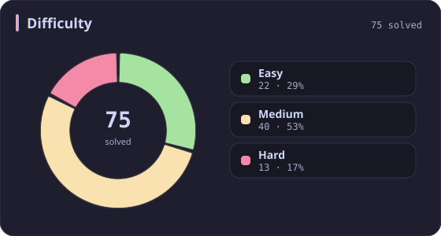
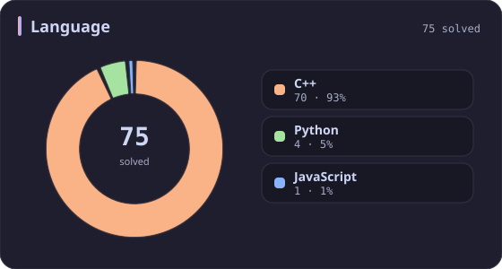
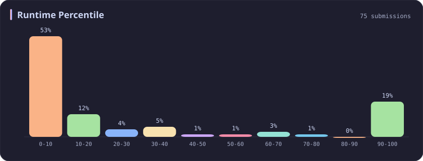
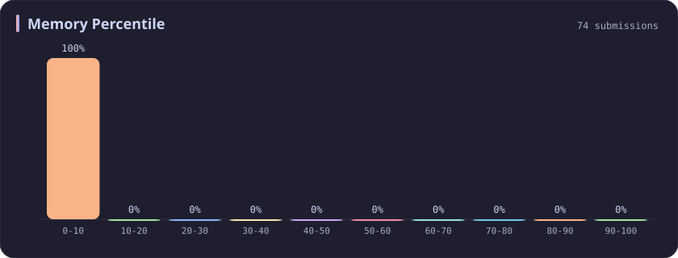
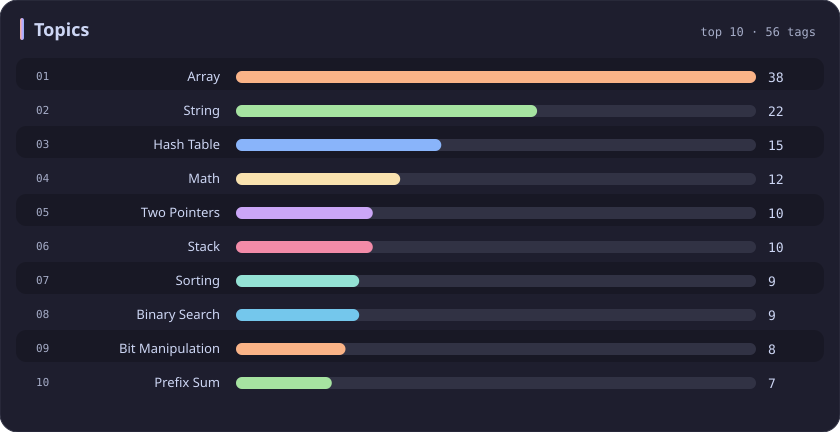

# Memory 0-10% Stats

[All stats](../../README.md)

**75** problems · updated `2026-09-05 03:41 UTC+8`

## Stats

### Difficulty

### Language

### Runtime Percentile

### Memory Percentile

| **0-10** | [10-20](10-20.md) | [20-30](20-30.md) | [30-40](30-40.md) | [40-50](40-50.md) | [50-60](50-60.md) | [60-70](60-70.md) | [70-80](70-80.md) | [80-90](80-90.md) | [90-100](90-100.md) |
| :---: | :---: | :---: | :---: | :---: | :---: | :---: | :---: | :---: | :---: |
| **75** | 53 | 36 | 31 | 29 | 27 | 25 | 39 | 35 | 381 |

### Topics

---

## Recent Activity

Latest **75** accepted submissions.

| Date | Title | Difficulty | Lang | Runtime | Memory |
| :--- | :--- | :---: | :---: | ---: | ---: |
| 2026&#8209;09&#8209;05 | [1464. Maximum Product of Two Elements in an Array](https://leetcode.com/problems/maximum-product-of-two-elements-in-an-array/) | Easy | C++ | 0 ms `100.00%` | 16.9 MB `5.69%` |
| 2026&#8209;08&#8209;18 | [877. Stone Game](https://leetcode.com/problems/stone-game/) | Medium | C++ | 12 ms `17.70%` | 19.8 MB `7.31%` |
| 2026&#8209;06&#8209;06 | [3950. Exactly One Consecutive Set Bits Pair](https://leetcode.com/problems/exactly-one-consecutive-set-bits-pair/) | Easy | C++ | 0 ms `100.00%` | 8.5 MB `7.25%` |
| 2026&#8209;06&#8209;04 | [1265. Print Immutable Linked List in Reverse](https://leetcode.com/problems/print-immutable-linked-list-in-reverse/) | Medium | C++ | 0 ms `100.00%` | 9.9 MB `5.81%` |
| 2026&#8209;05&#8209;24 | [3942. Minimum Operations to Sort a Permutation](https://leetcode.com/problems/minimum-operations-to-sort-a-permutation/) | Medium | C++ | 15 ms `10.97%` | 156.1 MB `8.67%` |
| 2026&#8209;05&#8209;24 | [3940. Limit Occurrences in Sorted Array](https://leetcode.com/problems/limit-occurrences-in-sorted-array/) | Easy | C++ | 0 ms `100.00%` | 34.2 MB `8.37%` |
| 2026&#8209;05&#8209;23 | [3938. Maximum Path Intersection Sum in a Grid](https://leetcode.com/problems/maximum-path-intersection-sum-in-a-grid/) | Medium | C++ | 72 ms `9.23%` | 185.7 MB `5.00%` |
| 2026&#8209;02&#8209;05 | [3379. Transformed Array](https://leetcode.com/problems/transformed-array/) | Easy | C++ | 4 ms `78.48%` | 25.8 MB `9.70%` |
| 2025&#8209;10&#8209;15 | [3350. Adjacent Increasing Subarrays Detection II](https://leetcode.com/problems/adjacent-increasing-subarrays-detection-ii/) | Medium | C++ | 282 ms `8.37%` | 219.4 MB `6.08%` |
| 2025&#8209;10&#8209;12 | [3713. Longest Balanced Substring I](https://leetcode.com/problems/longest-balanced-substring-i/) | Medium | C++ | 3030 ms `5.07%` | 498.4 MB `5.06%` |
| 2025&#8209;10&#8209;08 | [774. Minimize Max Distance to Gas Station](https://leetcode.com/problems/minimize-max-distance-to-gas-station/) | Hard | C++ | 9 ms `66.90%` | 18 MB `8.45%` |
| 2025&#8209;10&#8209;08 | [2300. Successful Pairs of Spells and Potions](https://leetcode.com/problems/successful-pairs-of-spells-and-potions/) | Medium | C++ | 47 ms `42.48%` | 138.4 MB `8.28%` |
| 2025&#8209;09&#8209;30 | [2221. Find Triangular Sum of an Array](https://leetcode.com/problems/find-triangular-sum-of-an-array/) | Medium | C++ | 431 ms `5.07%` | 384.5 MB `5.28%` |
| 2025&#8209;09&#8209;27 | [812. Largest Triangle Area](https://leetcode.com/problems/largest-triangle-area/) | Easy | C++ | 0 ms `100.00%` | 10.6 MB `7.20%` |
| 2025&#8209;09&#8209;25 | [120. Triangle](https://leetcode.com/problems/triangle/) | Medium | C++ | 0 ms `100.00%` | 13.9 MB `5.01%` |
| 2025&#8209;09&#8209;22 | [3005. Count Elements With Maximum Frequency](https://leetcode.com/problems/count-elements-with-maximum-frequency/) | Easy | C++ | 0 ms `100.00%` | 23.6 MB `8.88%` |
| 2025&#8209;09&#8209;21 | [1912. Design Movie Rental System](https://leetcode.com/problems/design-movie-rental-system/) | Hard | C++ | 333 ms `34.71%` | 444.6 MB `8.94%` |
| 2025&#8209;09&#8209;16 | [2197. Replace Non-Coprime Numbers in Array](https://leetcode.com/problems/replace-non-coprime-numbers-in-array/) | Hard | C++ | 2138 ms `5.26%` | 306.9 MB `5.26%` |
| 2025&#8209;09&#8209;11 | [2785. Sort Vowels in a String](https://leetcode.com/problems/sort-vowels-in-a-string/) | Medium | C++ | 19 ms `35.89%` | 20.6 MB `5.76%` |
| 2025&#8209;09&#8209;04 | [3516. Find Closest Person](https://leetcode.com/problems/find-closest-person/) | Easy | C++ | 0 ms `100.00%` | 8.7 MB `0.00%` |
| 2025&#8209;09&#8209;03 | [3027. Find the Number of Ways to Place People II](https://leetcode.com/problems/find-the-number-of-ways-to-place-people-ii/) | Hard | C++ | 221 ms `15.38%` | 47.6 MB `5.77%` |
| 2025&#8209;06&#8209;09 | [440. K-th Smallest in Lexicographical Order](https://leetcode.com/problems/k-th-smallest-in-lexicographical-order/) | Hard | C++ | 0 ms `100.00%` | 8.1 MB `2.40%` |
| 2025&#8209;06&#8209;06 | [2434. Using a Robot to Print the Lexicographically Smallest String](https://leetcode.com/problems/using-a-robot-to-print-the-lexicographically-smallest-string/) | Medium | C++ | 67 ms `26.26%` | 51.4 MB `5.20%` |
| 2025&#8209;06&#8209;05 | [3406. Find the Lexicographically Largest String From the Box II](https://leetcode.com/problems/find-the-lexicographically-largest-string-from-the-box-ii/) | Hard | C++ | 510 ms `0.00%` | 278 MB `0.00%` |
| 2025&#8209;05&#8209;25 | [3561. Resulting String After Adjacent Removals](https://leetcode.com/problems/resulting-string-after-adjacent-removals/) | Medium | C++ | 106 ms `36.98%` | 78.6 MB `7.40%` |
| 2025&#8209;05&#8209;12 | [227. Basic Calculator II](https://leetcode.com/problems/basic-calculator-ii/) | Medium | C++ | 38 ms `5.53%` | 38.6 MB `5.00%` |
| 2025&#8209;05&#8209;12 | [224. Basic Calculator](https://leetcode.com/problems/basic-calculator/) | Hard | C++ | 19 ms `7.01%` | 23.2 MB `5.06%` |
| 2025&#8209;05&#8209;10 | [3542. Minimum Operations to Convert All Elements to Zero](https://leetcode.com/problems/minimum-operations-to-convert-all-elements-to-zero/) | Medium | C++ | 1960 ms `5.13%` | 484.1 MB `5.40%` |
| 2025&#8209;04&#8209;30 | [1295. Find Numbers with Even Number of Digits](https://leetcode.com/problems/find-numbers-with-even-number-of-digits/) | Easy | Python | 4 ms `32.34%` | 12.5 MB `4.41%` |
| 2025&#8209;04&#8209;27 | [3392. Count Subarrays of Length Three With a Condition](https://leetcode.com/problems/count-subarrays-of-length-three-with-a-condition/) | Easy | C++ | 0 ms `100.00%` | 48.5 MB `9.55%` |
| 2025&#8209;04&#8209;27 | [3532. Path Existence Queries in a Graph I](https://leetcode.com/problems/path-existence-queries-in-a-graph-i/) | Medium | C++ | 482 ms `5.06%` | 327.8 MB `5.23%` |
| 2025&#8209;04&#8209;26 | [499. The Maze III](https://leetcode.com/problems/the-maze-iii/) | Hard | C++ | 17 ms `6.78%` | 20.2 MB `5.08%` |
| 2025&#8209;04&#8209;24 | [1318. Minimum Flips to Make a OR b Equal to c](https://leetcode.com/problems/minimum-flips-to-make-a-or-b-equal-to-c/) | Medium | C++ | 0 ms `100.00%` | 7.9 MB `4.95%` |
| 2025&#8209;04&#8209;24 | [338. Counting Bits](https://leetcode.com/problems/counting-bits/) | Easy | C++ | 0 ms `100.00%` | 11.4 MB `8.16%` |
| 2025&#8209;04&#8209;24 | [374. Guess Number Higher or Lower](https://leetcode.com/problems/guess-number-higher-or-lower/) | Easy | C++ | 2 ms `56.17%` | 8.1 MB `6.63%` |
| 2025&#8209;04&#8209;21 | [2336. Smallest Number in Infinite Set](https://leetcode.com/problems/smallest-number-in-infinite-set/) | Medium | C++ | 33 ms `14.17%` | 54.3 MB `9.29%` |
| 2025&#8209;04&#8209;21 | [1926. Nearest Exit from Entrance in Maze](https://leetcode.com/problems/nearest-exit-from-entrance-in-maze/) | Medium | C++ | 139 ms `5.55%` | 69.5 MB `5.01%` |
| 2025&#8209;04&#8209;20 | [649. Dota2 Senate](https://leetcode.com/problems/dota2-senate/) | Medium | C++ | 7 ms `17.56%` | 12.6 MB `7.47%` |
| 2025&#8209;04&#8209;20 | [1161. Maximum Level Sum of a Binary Tree](https://leetcode.com/problems/maximum-level-sum-of-a-binary-tree/) | Medium | C++ | 8 ms `21.91%` | 115.7 MB `5.42%` |
| 2025&#8209;04&#8209;20 | [345. Reverse Vowels of a String](https://leetcode.com/problems/reverse-vowels-of-a-string/) | Easy | C++ | 0 ms `100.00%` | 11.6 MB `5.33%` |
| 2025&#8209;04&#8209;14 | [1534. Count Good Triplets](https://leetcode.com/problems/count-good-triplets/) | Easy | C++ | 0 ms `100.00%` | 11.2 MB `7.75%` |
| 2025&#8209;04&#8209;11 | [1071. Greatest Common Divisor of Strings](https://leetcode.com/problems/greatest-common-divisor-of-strings/) | Easy | C++ | 19 ms `5.25%` | 46.6 MB `5.11%` |
| 2025&#8209;04&#8209;11 | [2843.   Count Symmetric Integers](https://leetcode.com/problems/count-symmetric-integers/) | Easy | C++ | 77 ms `18.11%` | 10.5 MB `8.76%` |
| 2024&#8209;11&#8209;17 | [862. Shortest Subarray with Sum at Least K](https://leetcode.com/problems/shortest-subarray-with-sum-at-least-k/) | Hard | C++ | 50 ms `9.43%` | 112.6 MB `5.17%` |
| 2024&#8209;11&#8209;04 | [2955. Number of Same-End Substrings](https://leetcode.com/problems/number-of-same-end-substrings/) | Medium | C++ | 238 ms `15.38%` | 230.3 MB `7.69%` |
| 2024&#8209;11&#8209;04 | [3163. String Compression III](https://leetcode.com/problems/string-compression-iii/) | Medium | C++ | 26 ms `65.21%` | 35.5 MB `5.36%` |
| 2024&#8209;11&#8209;03 | [796. Rotate String](https://leetcode.com/problems/rotate-string/) | Easy | C++ | 2 ms `8.59%` | 8.6 MB `6.12%` |
| 2024&#8209;10&#8209;23 | [2641. Cousins in Binary Tree II](https://leetcode.com/problems/cousins-in-binary-tree-ii/) | Medium | C++ | 157 ms `16.02%` | 392.9 MB `8.35%` |
| 2024&#8209;10&#8209;21 | [1593. Split a String Into the Max Number of Unique Substrings](https://leetcode.com/problems/split-a-string-into-the-max-number-of-unique-substrings/) | Medium | Python | 1706 ms `5.01%` | 29.9 MB `8.46%` |
| 2024&#8209;10&#8209;20 | [1106. Parsing A Boolean Expression](https://leetcode.com/problems/parsing-a-boolean-expression/) | Hard | C++ | 9 ms `21.74%` | 13.3 MB `9.84%` |
| 2024&#8209;04&#8209;23 | [310. Minimum Height Trees](https://leetcode.com/problems/minimum-height-trees/) | Medium | C++ | 1508 ms `5.02%` | 436.1 MB `5.04%` |
| 2024&#8209;04&#8209;05 | [1544. Make The String Great](https://leetcode.com/problems/make-the-string-great/) | Easy | C++ | 8 ms `1.08%` | 11.4 MB `6.07%` |
| 2024&#8209;03&#8209;30 | [3096. Minimum Levels to Gain More Points](https://leetcode.com/problems/minimum-levels-to-gain-more-points/) | Medium | C++ | 221 ms `6.38%` | 291.7 MB `8.08%` |
| 2024&#8209;03&#8209;27 | [713. Subarray Product Less Than K](https://leetcode.com/problems/subarray-product-less-than-k/) | Medium | C++ | 62 ms `9.64%` | 63.8 MB `5.29%` |
| 2024&#8209;03&#8209;26 | [10. Regular Expression Matching](https://leetcode.com/problems/regular-expression-matching/) | Hard | C++ | 39 ms `10.93%` | 23.9 MB `5.07%` |
| 2024&#8209;03&#8209;24 | [645. Set Mismatch](https://leetcode.com/problems/set-mismatch/) | Easy | C++ | 69 ms `8.82%` | 35.3 MB `6.03%` |
| 2024&#8209;03&#8209;24 | [287. Find the Duplicate Number](https://leetcode.com/problems/find-the-duplicate-number/) | Medium | C++ | 216 ms `5.28%` | 88.1 MB `9.66%` |
| 2024&#8209;03&#8209;23 | [18. 4Sum](https://leetcode.com/problems/4sum/) | Medium | C++ | 336 ms `5.01%` | 81.5 MB `5.13%` |
| 2023&#8209;10&#8209;01 | [2623. Memoize](https://leetcode.com/problems/memoize/) | Medium | JavaScript | 405 ms `5.08%` | 106.4 MB `5.24%` |
| 2023&#8209;04&#8209;09 | [2615. Sum of Distances](https://leetcode.com/problems/sum-of-distances/) | Medium | C++ | 414 ms `5.00%` | 139.5 MB `7.50%` |
| 2023&#8209;04&#8209;03 | [881. Boats to Save People](https://leetcode.com/problems/boats-to-save-people/) | Medium | C++ | 246 ms `5.78%` | 70.4 MB `5.29%` |
| 2023&#8209;03&#8209;30 | [87. Scramble String](https://leetcode.com/problems/scramble-string/) | Hard | C++ | 171 ms `7.11%` | 36.2 MB `9.90%` |
| 2023&#8209;03&#8209;25 | [15. 3Sum](https://leetcode.com/problems/3sum/) | Medium | C++ | 2275 ms `5.02%` | 305.4 MB `5.21%` |
| 2023&#8209;03&#8209;25 | [438. Find All Anagrams in a String](https://leetcode.com/problems/find-all-anagrams-in-a-string/) | Medium | C++ | 64 ms `8.56%` | 37.9 MB `5.00%` |
| 2023&#8209;03&#8209;25 | [101. Symmetric Tree](https://leetcode.com/problems/symmetric-tree/) | Easy | C++ | 10 ms `0.52%` | 19 MB `6.22%` |
| 2023&#8209;03&#8209;21 | [21. Merge Two Sorted Lists](https://leetcode.com/problems/merge-two-sorted-lists/) | Easy | C++ | 12 ms `0.53%` | 23.1 MB `8.45%` |
| 2023&#8209;03&#8209;12 | [2588. Count the Number of Beautiful Subarrays](https://leetcode.com/problems/count-the-number-of-beautiful-subarrays/) | Medium | C++ | 509 ms `5.14%` | 132.3 MB `9.00%` |
| 2023&#8209;03&#8209;11 | [109. Convert Sorted List to Binary Search Tree](https://leetcode.com/problems/convert-sorted-list-to-binary-search-tree/) | Medium | C++ | 435 ms `5.92%` | 345.2 MB `5.43%` |
| 2023&#8209;03&#8209;06 | [29. Divide Two Integers](https://leetcode.com/problems/divide-two-integers/) | Medium | Python | 211 ms `2.00%` | 31.8 MB `6.12%` |
| 2023&#8209;03&#8209;06 | [590. N-ary Tree Postorder Traversal](https://leetcode.com/problems/n-ary-tree-postorder-traversal/) | Easy | C++ | 33 ms `8.49%` | 16.3 MB `8.15%` |
| 2023&#8209;02&#8209;26 | [2576. Find the Maximum Number of Marked Indices](https://leetcode.com/problems/find-the-maximum-number-of-marked-indices/) | Medium | C++ | 374 ms `5.81%` | 100.2 MB `5.16%` |
| 2023&#8209;02&#8209;23 | [239. Sliding Window Maximum](https://leetcode.com/problems/sliding-window-maximum/) | Hard | C++ | 998 ms `5.17%` | 191.6 MB `5.71%` |
| 2023&#8209;02&#8209;21 | [2564. Substring XOR Queries](https://leetcode.com/problems/substring-xor-queries/) | Medium | Python | 2986 ms `5.68%` | 148.4 MB `6.82%` |
| 2023&#8209;02&#8209;19 | [14. Longest Common Prefix](https://leetcode.com/problems/longest-common-prefix/) | Easy | C++ | 10 ms `3.73%` | 15.4 MB `5.08%` |
| 2023&#8209;02&#8209;17 | [2545. Sort the Students by Their Kth Score](https://leetcode.com/problems/sort-the-students-by-their-kth-score/) | Medium | C++ | 80 ms `5.17%` | 55.9 MB `5.27%` |
