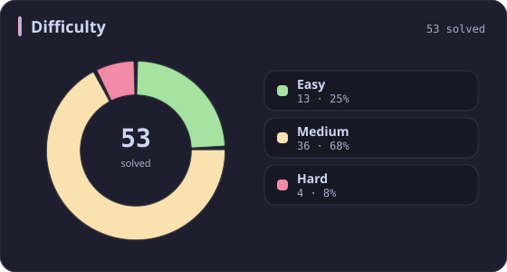
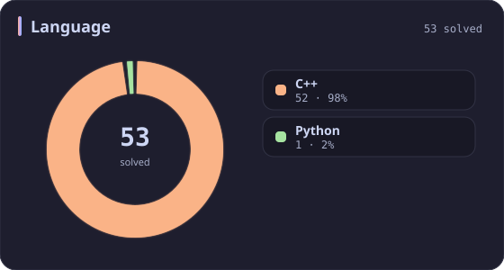
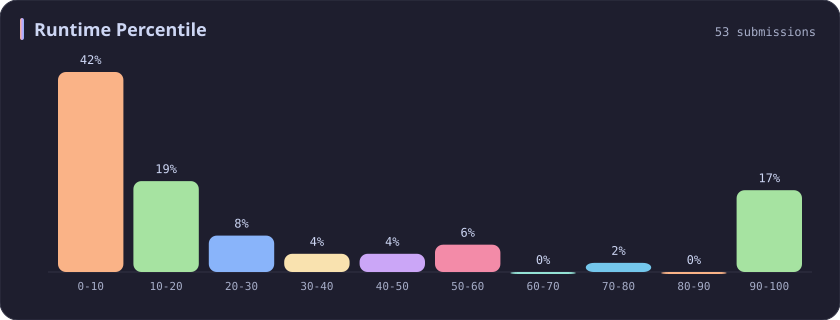
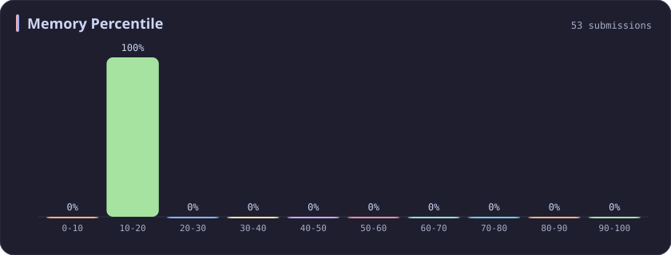
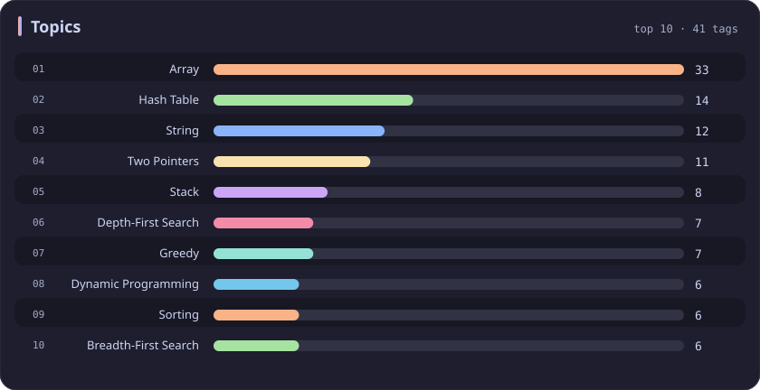

# Memory 10-20% Stats

[All stats](../../README.md)

**53** problems · updated `2026-09-06 09:44 UTC+8`

## Stats

### Difficulty

### Language

### Runtime Percentile

### Memory Percentile

| [0-10](0-10.md) | **10-20** | [20-30](20-30.md) | [30-40](30-40.md) | [40-50](40-50.md) | [50-60](50-60.md) | [60-70](60-70.md) | [70-80](70-80.md) | [80-90](80-90.md) | [90-100](90-100.md) |
| :---: | :---: | :---: | :---: | :---: | :---: | :---: | :---: | :---: | :---: |
| 75 | **53** | 36 | 31 | 29 | 27 | 25 | 39 | 35 | 381 |

### Topics

---

## Recent Activity

Latest **53** accepted submissions.

| Date | Title | Difficulty | Lang | Runtime | Memory |
| :--- | :--- | :---: | :---: | ---: | ---: |
| 2026&#8209;08&#8209;20 | [308. Range Sum Query 2D - Mutable](https://leetcode.com/problems/range-sum-query-2d-mutable/) | Medium | C++ | 19 ms `58.17%` | 44.6 MB `11.30%` |
| 2026&#8209;06&#8209;09 | [2161. Partition Array According to Given Pivot](https://leetcode.com/problems/partition-array-according-to-given-pivot/) | Medium | C++ | 7 ms `58.96%` | 139.4 MB `16.25%` |
| 2026&#8209;05&#8209;23 | [3937. Minimum Operations to Make Array Modulo Alternating I](https://leetcode.com/problems/minimum-operations-to-make-array-modulo-alternating-i/) | Medium | C++ | 7 ms `79.04%` | 25.4 MB `15.30%` |
| 2026&#8209;05&#8209;23 | [2744. Find Maximum Number of String Pairs](https://leetcode.com/problems/find-maximum-number-of-string-pairs/) | Easy | Python | 15 ms `8.76%` | 19.3 MB `18.79%` |
| 2026&#8209;05&#8209;23 | [1752. Check if Array Is Sorted and Rotated](https://leetcode.com/problems/check-if-array-is-sorted-and-rotated/) | Easy | C++ | 0 ms `100.00%` | 11.4 MB `19.48%` |
| 2026&#8209;02&#8209;08 | [1653. Minimum Deletions to Make String Balanced](https://leetcode.com/problems/minimum-deletions-to-make-string-balanced/) | Medium | C++ | 51 ms `18.43%` | 55.1 MB `19.34%` |
| 2025&#8209;10&#8209;12 | [3714. Longest Balanced Substring II](https://leetcode.com/problems/longest-balanced-substring-ii/) | Medium | C++ | 1603 ms `59.24%` | 403.9 MB `18.22%` |
| 2025&#8209;10&#8209;12 | [3712. Sum of Elements With Frequency Divisible by K](https://leetcode.com/problems/sum-of-elements-with-frequency-divisible-by-k/) | Easy | C++ | 0 ms `100.00%` | 26.4 MB `12.32%` |
| 2025&#8209;10&#8209;09 | [3494. Find the Minimum Amount of Time to Brew Potions](https://leetcode.com/problems/find-the-minimum-amount-of-time-to-brew-potions/) | Medium | C++ | 575 ms `18.46%` | 407.4 MB `15.38%` |
| 2025&#8209;10&#8209;06 | [778. Swim in Rising Water](https://leetcode.com/problems/swim-in-rising-water/) | Hard | C++ | 34 ms `7.85%` | 17.1 MB `10.48%` |
| 2025&#8209;10&#8209;03 | [3100. Water Bottles II](https://leetcode.com/problems/water-bottles-ii/) | Medium | C++ | 2 ms `38.80%` | 8.7 MB `15.89%` |
| 2025&#8209;09&#8209;29 | [1039. Minimum Score Triangulation of Polygon](https://leetcode.com/problems/minimum-score-triangulation-of-polygon/) | Medium | C++ | 5 ms `10.47%` | 11.4 MB `15.89%` |
| 2025&#8209;09&#8209;26 | [611. Valid Triangle Number](https://leetcode.com/problems/valid-triangle-number/) | Medium | C++ | 430 ms `8.62%` | 16.8 MB `10.43%` |
| 2025&#8209;08&#8209;26 | [3000. Maximum Area of Longest Diagonal Rectangle](https://leetcode.com/problems/maximum-area-of-longest-diagonal-rectangle/) | Easy | C++ | 1 ms `15.78%` | 29.8 MB `13.11%` |
| 2025&#8209;06&#8209;18 | [2966. Divide Array Into Arrays With Max Difference](https://leetcode.com/problems/divide-array-into-arrays-with-max-difference/) | Medium | C++ | 115 ms `13.42%` | 126.1 MB `18.08%` |
| 2025&#8209;05&#8209;31 | [2359. Find Closest Node to Given Two Nodes](https://leetcode.com/problems/find-closest-node-to-given-two-nodes/) | Medium | C++ | 162 ms `13.13%` | 162.6 MB `10.77%` |
| 2025&#8209;05&#8209;29 | [3068. Find the Maximum Sum of Node Values](https://leetcode.com/problems/find-the-maximum-sum-of-node-values/) | Hard | C++ | 111 ms `11.83%` | 158 MB `11.26%` |
| 2025&#8209;05&#8209;25 | [3560. Find Minimum Log Transportation Cost](https://leetcode.com/problems/find-minimum-log-transportation-cost/) | Easy | C++ | 0 ms `100.00%` | 8.9 MB `19.00%` |
| 2025&#8209;05&#8209;17 | [75. Sort Colors](https://leetcode.com/problems/sort-colors/) | Medium | C++ | 0 ms `100.00%` | 11.7 MB `11.44%` |
| 2025&#8209;05&#8209;11 | [484. Find Permutation](https://leetcode.com/problems/find-permutation/) | Medium | C++ | 3 ms `29.79%` | 14.4 MB `14.89%` |
| 2025&#8209;05&#8209;04 | [311. Sparse Matrix Multiplication](https://leetcode.com/problems/sparse-matrix-multiplication/) | Medium | C++ | 0 ms `100.00%` | 12.5 MB `11.29%` |
| 2025&#8209;05&#8209;03 | [353. Design Snake Game](https://leetcode.com/problems/design-snake-game/) | Medium | C++ | 199 ms `5.48%` | 582.8 MB `19.86%` |
| 2025&#8209;04&#8209;27 | [3531. Count Covered Buildings](https://leetcode.com/problems/count-covered-buildings/) | Medium | C++ | 894 ms `10.51%` | 451.1 MB `10.05%` |
| 2025&#8209;04&#8209;26 | [1474. Delete N Nodes After M Nodes of a Linked List](https://leetcode.com/problems/delete-n-nodes-after-m-nodes-of-a-linked-list/) | Easy | C++ | 0 ms `100.00%` | 21 MB `10.00%` |
| 2025&#8209;04&#8209;26 | [624. Maximum Distance in Arrays](https://leetcode.com/problems/maximum-distance-in-arrays/) | Medium | C++ | 0 ms `100.00%` | 108.2 MB `18.53%` |
| 2025&#8209;04&#8209;25 | [2845. Count of Interesting Subarrays](https://leetcode.com/problems/count-of-interesting-subarrays/) | Medium | C++ | 59 ms `42.22%` | 127.3 MB `10.79%` |
| 2025&#8209;04&#8209;24 | [2462. Total Cost to Hire K Workers](https://leetcode.com/problems/total-cost-to-hire-k-workers/) | Medium | C++ | 56 ms `23.98%` | 79.8 MB `18.79%` |
| 2025&#8209;04&#8209;24 | [302. Smallest Rectangle Enclosing Black Pixels](https://leetcode.com/problems/smallest-rectangle-enclosing-black-pixels/) | Hard | C++ | 8 ms `13.11%` | 23.9 MB `13.11%` |
| 2025&#8209;04&#8209;20 | [2095. Delete the Middle Node of a Linked List](https://leetcode.com/problems/delete-the-middle-node-of-a-linked-list/) | Medium | C++ | 19 ms `8.47%` | 342.5 MB `17.31%` |
| 2025&#8209;04&#8209;20 | [2130. Maximum Twin Sum of a Linked List](https://leetcode.com/problems/maximum-twin-sum-of-a-linked-list/) | Medium | C++ | 5 ms `36.76%` | 138.4 MB `17.32%` |
| 2025&#8209;04&#8209;20 | [394. Decode String](https://leetcode.com/problems/decode-string/) | Medium | C++ | 1 ms `29.13%` | 9.7 MB `10.91%` |
| 2025&#8209;04&#8209;20 | [724. Find Pivot Index](https://leetcode.com/problems/find-pivot-index/) | Easy | C++ | 0 ms `100.00%` | 37.1 MB `10.61%` |
| 2025&#8209;04&#8209;20 | [1493. Longest Subarray of 1's After Deleting One Element](https://leetcode.com/problems/longest-subarray-of-1s-after-deleting-one-element/) | Medium | C++ | 4 ms `15.22%` | 62.3 MB `13.21%` |
| 2025&#8209;04&#8209;20 | [283. Move Zeroes](https://leetcode.com/problems/move-zeroes/) | Easy | C++ | 0 ms `100.00%` | 23.9 MB `19.59%` |
| 2025&#8209;04&#8209;11 | [1768. Merge Strings Alternately](https://leetcode.com/problems/merge-strings-alternately/) | Easy | C++ | 3 ms `40.70%` | 8.6 MB `13.54%` |
| 2024&#8209;11&#8209;19 | [2461. Maximum Sum of Distinct Subarrays With Length K](https://leetcode.com/problems/maximum-sum-of-distinct-subarrays-with-length-k/) | Medium | C++ | 212 ms `8.96%` | 100.9 MB `13.48%` |
| 2024&#8209;11&#8209;05 | [2914. Minimum Number of Changes to Make Binary String Beautiful](https://leetcode.com/problems/minimum-number-of-changes-to-make-binary-string-beautiful/) | Medium | C++ | 9 ms `5.33%` | 16.9 MB `11.93%` |
| 2024&#8209;04&#8209;06 | [1249. Minimum Remove to Make Valid Parentheses](https://leetcode.com/problems/minimum-remove-to-make-valid-parentheses/) | Medium | C++ | 17 ms `9.28%` | 15.1 MB `17.08%` |
| 2024&#8209;03&#8209;24 | [523. Continuous Subarray Sum](https://leetcode.com/problems/continuous-subarray-sum/) | Medium | C++ | 268 ms `5.32%` | 147.1 MB `17.99%` |
| 2024&#8209;03&#8209;23 | [234. Palindrome Linked List](https://leetcode.com/problems/palindrome-linked-list/) | Easy | C++ | 173 ms `5.13%` | 130.7 MB `18.01%` |
| 2023&#8209;04&#8209;04 | [2405. Optimal Partition of String](https://leetcode.com/problems/optimal-partition-of-string/) | Medium | C++ | 248 ms `5.08%` | 72.1 MB `11.02%` |
| 2023&#8209;04&#8209;01 | [2606. Find the Substring With Maximum Cost](https://leetcode.com/problems/find-the-substring-with-maximum-cost/) | Medium | C++ | 51 ms `5.05%` | 42.5 MB `18.08%` |
| 2023&#8209;03&#8209;25 | [2316. Count Unreachable Pairs of Nodes in an Undirected Graph](https://leetcode.com/problems/count-unreachable-pairs-of-nodes-in-an-undirected-graph/) | Medium | C++ | 647 ms `5.00%` | 207.1 MB `14.30%` |
| 2023&#8209;03&#8209;23 | [1319. Number of Operations to Make Network Connected](https://leetcode.com/problems/number-of-operations-to-make-network-connected/) | Medium | C++ | 166 ms `5.53%` | 56.3 MB `12.39%` |
| 2023&#8209;03&#8209;18 | [2592. Maximize Greatness of an Array](https://leetcode.com/problems/maximize-greatness-of-an-array/) | Medium | C++ | 244 ms `5.29%` | 96.7 MB `16.04%` |
| 2023&#8209;03&#8209;15 | [53. Maximum Subarray](https://leetcode.com/problems/maximum-subarray/) | Medium | C++ | 144 ms `4.53%` | 73.1 MB `14.90%` |
| 2023&#8209;03&#8209;13 | [567. Permutation in String](https://leetcode.com/problems/permutation-in-string/) | Medium | C++ | 42 ms `25.26%` | 30 MB `10.40%` |
| 2023&#8209;03&#8209;11 | [617. Merge Two Binary Trees](https://leetcode.com/problems/merge-two-binary-trees/) | Easy | C++ | 45 ms `5.21%` | 34.2 MB `11.43%` |
| 2023&#8209;03&#8209;10 | [496. Next Greater Element I](https://leetcode.com/problems/next-greater-element-i/) | Easy | C++ | 13 ms `5.79%` | 15.8 MB `15.09%` |
| 2023&#8209;03&#8209;10 | [589. N-ary Tree Preorder Traversal](https://leetcode.com/problems/n-ary-tree-preorder-traversal/) | Easy | C++ | 40 ms `5.08%` | 16.3 MB `11.81%` |
| 2023&#8209;03&#8209;05 | [1345. Jump Game IV](https://leetcode.com/problems/jump-game-iv/) | Hard | C++ | 467 ms `5.02%` | 137.8 MB `19.25%` |
| 2023&#8209;02&#8209;27 | [427. Construct Quad Tree](https://leetcode.com/problems/construct-quad-tree/) | Medium | C++ | 31 ms `5.31%` | 23.5 MB `15.71%` |
| 2023&#8209;02&#8209;19 | [6. Zigzag Conversion](https://leetcode.com/problems/zigzag-conversion/) | Medium | C++ | 35 ms `7.55%` | 16.6 MB `16.72%` |
