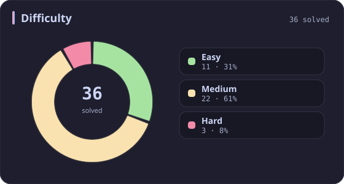
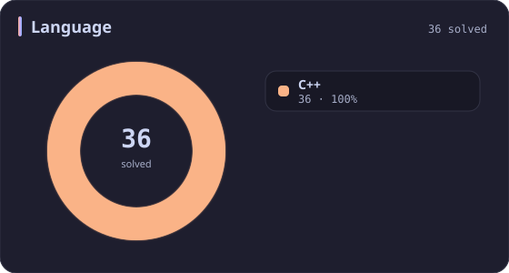
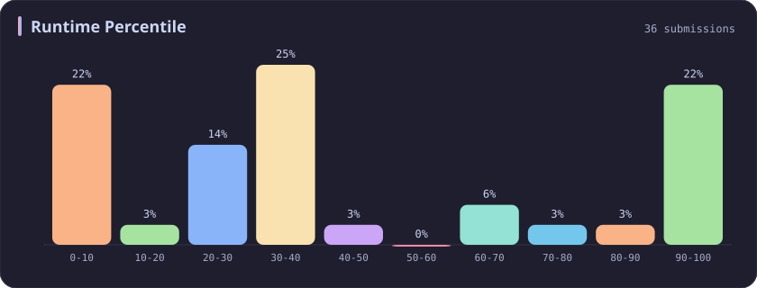
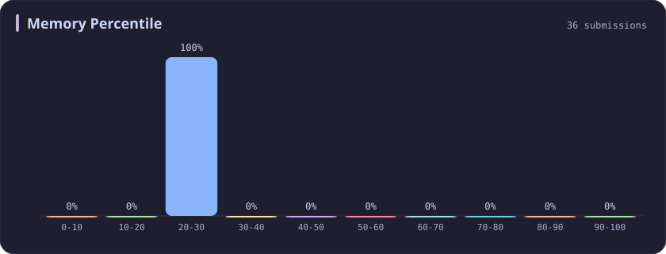

# Memory 20-30% Stats

[All stats](../../README.md)

**36** problems · updated `2026-09-04 19:32 UTC`

## Stats

### Difficulty

### Language

### Runtime Percentile

### Memory Percentile

| [0-10](0-10.md) | [10-20](10-20.md) | **20-30** | [30-40](30-40.md) | [40-50](40-50.md) | [50-60](50-60.md) | [60-70](60-70.md) | [70-80](70-80.md) | [80-90](80-90.md) | [90-100](90-100.md) |
| :---: | :---: | :---: | :---: | :---: | :---: | :---: | :---: | :---: | :---: |
| 75 | 53 | **36** | 31 | 29 | 27 | 25 | 39 | 35 | 381 |

### Topics

---

## Recent Activity

Latest **36** accepted submissions.

| Date | Title | Difficulty | Lang | Runtime | Memory |
| :--- | :--- | :---: | :---: | ---: | ---: |
| 2026&#8209;09&#8209;04 | [3903. Smallest Stable Index I](https://leetcode.com/problems/smallest-stable-index-i/) | Easy | C++ | 0 ms `100.00%` | 31.5 MB `20.68%` |
| 2026&#8209;09&#8209;02 | [3875. Construct Uniform Parity Array I](https://leetcode.com/problems/construct-uniform-parity-array-i/) | Easy | C++ | 0 ms `100.00%` | 30.3 MB `27.31%` |
| 2026&#8209;08&#8209;19 | [1386. Cinema Seat Allocation](https://leetcode.com/problems/cinema-seat-allocation/) | Medium | C++ | 125 ms `9.88%` | 84.2 MB `20.70%` |
| 2026&#8209;06&#8209;04 | [723. Candy Crush](https://leetcode.com/problems/candy-crush/) | Medium | C++ | 4 ms `61.92%` | 14.4 MB `20.92%` |
| 2026&#8209;05&#8209;20 | [2061. Number of Spaces Cleaning Robot Cleaned](https://leetcode.com/problems/number-of-spaces-cleaning-robot-cleaned/) | Medium | C++ | 65 ms `26.67%` | 54 MB `26.67%` |
| 2026&#8209;05&#8209;19 | [2540. Minimum Common Value](https://leetcode.com/problems/minimum-common-value/) | Easy | C++ | 0 ms `100.00%` | 54.6 MB `26.20%` |
| 2025&#8209;10&#8209;13 | [2273. Find Resultant Array After Removing Anagrams](https://leetcode.com/problems/find-resultant-array-after-removing-anagrams/) | Easy | C++ | 3 ms `45.53%` | 17.9 MB `24.76%` |
| 2025&#8209;10&#8209;12 | [3715. Sum of Perfect Square Ancestors](https://leetcode.com/problems/sum-of-perfect-square-ancestors/) | Hard | C++ | 1461 ms `21.09%` | 383.2 MB `25.85%` |
| 2025&#8209;10&#8209;03 | [1135. Connecting Cities With Minimum Cost](https://leetcode.com/problems/connecting-cities-with-minimum-cost/) | Medium | C++ | 45 ms `32.04%` | 58.5 MB `26.21%` |
| 2025&#8209;09&#8209;27 | [3690. Split and Merge Array Transformation](https://leetcode.com/problems/split-and-merge-array-transformation/) | Medium | C++ | 1672 ms `7.57%` | 432.5 MB `21.01%` |
| 2025&#8209;09&#8209;13 | [3541. Find Most Frequent Vowel and Consonant](https://leetcode.com/problems/find-most-frequent-vowel-and-consonant/) | Easy | C++ | 2 ms `39.99%` | 10 MB `24.45%` |
| 2025&#8209;09&#8209;02 | [3025. Find the Number of Ways to Place People I](https://leetcode.com/problems/find-the-number-of-ways-to-place-people-i/) | Medium | C++ | 19 ms `25.00%` | 32.7 MB `28.24%` |
| 2025&#8209;06&#8209;10 | [3442. Maximum Difference Between Even and Odd Frequency I](https://leetcode.com/problems/maximum-difference-between-even-and-odd-frequency-i/) | Easy | C++ | 3 ms `36.10%` | 9.9 MB `27.80%` |
| 2025&#8209;05&#8209;29 | [3373. Maximize the Number of Target Nodes After Connecting Trees II](https://leetcode.com/problems/maximize-the-number-of-target-nodes-after-connecting-trees-ii/) | Hard | C++ | 457 ms `27.98%` | 387.2 MB `21.76%` |
| 2025&#8209;05&#8209;12 | [3289. The Two Sneaky Numbers of Digitville](https://leetcode.com/problems/the-two-sneaky-numbers-of-digitville/) | Easy | C++ | 0 ms `100.00%` | 26.5 MB `21.86%` |
| 2025&#8209;05&#8209;12 | [1180. Count Substrings with Only One Distinct Letter](https://leetcode.com/problems/count-substrings-with-only-one-distinct-letter/) | Easy | C++ | 0 ms `100.00%` | 8.5 MB `29.73%` |
| 2025&#8209;05&#8209;11 | [1550. Three Consecutive Odds](https://leetcode.com/problems/three-consecutive-odds/) | Easy | C++ | 0 ms `100.00%` | 11.9 MB `22.03%` |
| 2025&#8209;05&#8209;07 | [3341. Find Minimum Time to Reach Last Room I](https://leetcode.com/problems/find-minimum-time-to-reach-last-room-i/) | Medium | C++ | 26 ms `37.76%` | 31.1 MB `25.92%` |
| 2025&#8209;05&#8209;04 | [1198. Find Smallest Common Element in All Rows](https://leetcode.com/problems/find-smallest-common-element-in-all-rows/) | Medium | C++ | 12 ms `33.33%` | 31.3 MB `25.56%` |
| 2025&#8209;05&#8209;04 | [3537. Fill a Special Grid](https://leetcode.com/problems/fill-a-special-grid/) | Medium | C++ | 8 ms `75.76%` | 69.1 MB `22.22%` |
| 2025&#8209;04&#8209;24 | [380. Insert Delete GetRandom O(1)](https://leetcode.com/problems/insert-delete-getrandom-o1/) | Medium | C++ | 31 ms `93.33%` | 113.3 MB `28.69%` |
| 2025&#8209;04&#8209;24 | [901. Online Stock Span](https://leetcode.com/problems/online-stock-span/) | Medium | C++ | 43 ms `21.61%` | 95.1 MB `28.25%` |
| 2025&#8209;04&#8209;23 | [198. House Robber](https://leetcode.com/problems/house-robber/) | Medium | C++ | 0 ms `100.00%` | 10.8 MB `23.91%` |
| 2025&#8209;04&#8209;23 | [875. Koko Eating Bananas](https://leetcode.com/problems/koko-eating-bananas/) | Medium | C++ | 19 ms `8.77%` | 23.1 MB `24.37%` |
| 2025&#8209;04&#8209;23 | [2542. Maximum Subsequence Score](https://leetcode.com/problems/maximum-subsequence-score/) | Medium | C++ | 75 ms `30.92%` | 99.3 MB `27.05%` |
| 2025&#8209;04&#8209;20 | [994. Rotting Oranges](https://leetcode.com/problems/rotting-oranges/) | Medium | C++ | 1 ms `36.04%` | 17.2 MB `28.15%` |
| 2025&#8209;04&#8209;19 | [437. Path Sum III](https://leetcode.com/problems/path-sum-iii/) | Medium | C++ | 12 ms `30.68%` | 21.5 MB `25.06%` |
| 2025&#8209;04&#8209;19 | [1679. Max Number of K-Sum Pairs](https://leetcode.com/problems/max-number-of-k-sum-pairs/) | Medium | C++ | 106 ms `31.48%` | 72 MB `23.30%` |
| 2025&#8209;04&#8209;18 | [38. Count and Say](https://leetcode.com/problems/count-and-say/) | Medium | C++ | 3 ms `81.25%` | 10.3 MB `21.90%` |
| 2025&#8209;04&#8209;11 | [323. Number of Connected Components in an Undirected Graph](https://leetcode.com/problems/number-of-connected-components-in-an-undirected-graph/) | Medium | C++ | 3 ms `63.11%` | 18.7 MB `22.04%` |
| 2024&#8209;04&#8209;18 | [463. Island Perimeter](https://leetcode.com/problems/island-perimeter/) | Easy | C++ | 78 ms `5.13%` | 104.4 MB `25.27%` |
| 2024&#8209;03&#8209;24 | [1570. Dot Product of Two Sparse Vectors](https://leetcode.com/problems/dot-product-of-two-sparse-vectors/) | Medium | C++ | 162 ms `9.76%` | 175.2 MB `21.95%` |
| 2023&#8209;03&#8209;27 | [653. Two Sum IV - Input is a BST](https://leetcode.com/problems/two-sum-iv-input-is-a-bst/) | Easy | C++ | 48 ms `5.08%` | 39 MB `20.06%` |
| 2023&#8209;03&#8209;19 | [211. Design Add and Search Words Data Structure](https://leetcode.com/problems/design-add-and-search-words-data-structure/) | Medium | C++ | 1831 ms `5.01%` | 628.4 MB `27.78%` |
| 2023&#8209;03&#8209;04 | [2581. Count Number of Possible Root Nodes](https://leetcode.com/problems/count-number-of-possible-root-nodes/) | Hard | C++ | 701 ms `18.68%` | 247.9 MB `22.18%` |
| 2023&#8209;02&#8209;28 | [652. Find Duplicate Subtrees](https://leetcode.com/problems/find-duplicate-subtrees/) | Medium | C++ | 40 ms `5.04%` | 56 MB `22.85%` |
