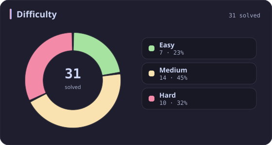
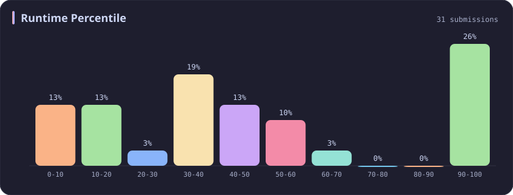
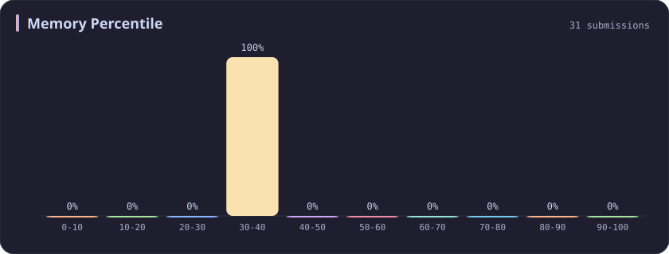

# Memory 30-40% Stats

[All stats](../../README.md)

**31** problems · updated `2026-09-05 03:41 UTC+8`

## Stats

### Difficulty

### Language

### Runtime Percentile

### Memory Percentile

| [0-10](0-10.md) | [10-20](10-20.md) | [20-30](20-30.md) | **30-40** | [40-50](40-50.md) | [50-60](50-60.md) | [60-70](60-70.md) | [70-80](70-80.md) | [80-90](80-90.md) | [90-100](90-100.md) |
| :---: | :---: | :---: | :---: | :---: | :---: | :---: | :---: | :---: | :---: |
| 75 | 53 | 36 | **31** | 29 | 27 | 25 | 39 | 35 | 381 |

### Topics

---

## Recent Activity

Latest **31** accepted submissions.

| Date | Title | Difficulty | Lang | Runtime | Memory |
| :--- | :--- | :---: | :---: | ---: | ---: |
| 2026&#8209;08&#8209;20 | [3069. Distribute Elements Into Two Arrays I](https://leetcode.com/problems/distribute-elements-into-two-arrays-i/) | Easy | C++ | 0 ms `100.00%` | 24 MB `32.91%` |
| 2026&#8209;06&#8209;06 | [3952. Maximum Total Value of Covered Indices](https://leetcode.com/problems/maximum-total-value-of-covered-indices/) | Medium | C++ | 127 ms `33.96%` | 236.8 MB `31.46%` |
| 2025&#8209;10&#8209;11 | [3710. Maximum Partition Factor](https://leetcode.com/problems/maximum-partition-factor/) | Hard | C++ | 1245 ms `35.15%` | 336.4 MB `37.63%` |
| 2025&#8209;10&#8209;03 | [407. Trapping Rain Water II](https://leetcode.com/problems/trapping-rain-water-ii/) | Hard | C++ | 34 ms `43.03%` | 22.7 MB `32.34%` |
| 2025&#8209;09&#8209;29 | [1121. Divide Array Into Increasing Sequences](https://leetcode.com/problems/divide-array-into-increasing-sequences/) | Hard | C++ | 95 ms `41.67%` | 107.6 MB `33.33%` |
| 2025&#8209;09&#8209;28 | [3697. Compute Decimal Representation](https://leetcode.com/problems/compute-decimal-representation/) | Easy | C++ | 0 ms `100.00%` | 9.8 MB `33.26%` |
| 2025&#8209;09&#8209;27 | [3695. Maximize Alternating Sum Using Swaps](https://leetcode.com/problems/maximize-alternating-sum-using-swaps/) | Hard | C++ | 294 ms `56.92%` | 341.9 MB `32.45%` |
| 2025&#8209;05&#8209;27 | [1857. Largest Color Value in a Directed Graph](https://leetcode.com/problems/largest-color-value-in-a-directed-graph/) | Hard | C++ | 401 ms `39.45%` | 188.9 MB `30.53%` |
| 2025&#8209;05&#8209;22 | [3362. Zero Array Transformation III](https://leetcode.com/problems/zero-array-transformation-iii/) | Medium | C++ | 128 ms `50.88%` | 224.5 MB `38.16%` |
| 2025&#8209;05&#8209;20 | [3355. Zero Array Transformation I](https://leetcode.com/problems/zero-array-transformation-i/) | Medium | C++ | 220 ms `5.01%` | 298.2 MB `30.88%` |
| 2025&#8209;05&#8209;12 | [1134. Armstrong Number](https://leetcode.com/problems/armstrong-number/) | Easy | C++ | 0 ms `100.00%` | 8 MB `38.46%` |
| 2025&#8209;05&#8209;11 | [3548. Equal Sum Grid Partition II](https://leetcode.com/problems/equal-sum-grid-partition-ii/) | Hard | C++ | 826 ms `55.46%` | 400.9 MB `37.86%` |
| 2025&#8209;05&#8209;04 | [1426. Counting Elements](https://leetcode.com/problems/counting-elements/) | Easy | C++ | 0 ms `100.00%` | 11.5 MB `36.21%` |
| 2025&#8209;05&#8209;04 | [3536. Maximum Product of Two Digits](https://leetcode.com/problems/maximum-product-of-two-digits/) | Easy | C++ | 3 ms `10.81%` | 8.9 MB `31.83%` |
| 2025&#8209;05&#8209;02 | [838. Push Dominoes](https://leetcode.com/problems/push-dominoes/) | Medium | C++ | 27 ms `32.11%` | 27.2 MB `30.96%` |
| 2025&#8209;05&#8209;01 | [2071. Maximum Number of Tasks You Can Assign](https://leetcode.com/problems/maximum-number-of-tasks-you-can-assign/) | Hard | C++ | 714 ms `60.06%` | 286.3 MB `39.93%` |
| 2025&#8209;04&#8209;26 | [2444. Count Subarrays With Fixed Bounds](https://leetcode.com/problems/count-subarrays-with-fixed-bounds/) | Hard | C++ | 0 ms `100.00%` | 94 MB `36.87%` |
| 2025&#8209;04&#8209;24 | [238. Product of Array Except Self](https://leetcode.com/problems/product-of-array-except-self/) | Medium | C++ | 2 ms `42.79%` | 41.6 MB `37.92%` |
| 2025&#8209;04&#8209;24 | [274. H-Index](https://leetcode.com/problems/h-index/) | Medium | C++ | 0 ms `100.00%` | 12.3 MB `35.12%` |
| 2025&#8209;04&#8209;24 | [739. Daily Temperatures](https://leetcode.com/problems/daily-temperatures/) | Medium | C++ | 27 ms `34.20%` | 107.4 MB `34.92%` |
| 2025&#8209;04&#8209;21 | [841. Keys and Rooms](https://leetcode.com/problems/keys-and-rooms/) | Medium | C++ | 3 ms `14.63%` | 14.7 MB `37.21%` |
| 2025&#8209;04&#8209;20 | [781. Rabbits in Forest](https://leetcode.com/problems/rabbits-in-forest/) | Medium | C++ | 4 ms `7.15%` | 12.3 MB `37.72%` |
| 2025&#8209;04&#8209;20 | [1466. Reorder Routes to Make All Paths Lead to the City Zero](https://leetcode.com/problems/reorder-routes-to-make-all-paths-lead-to-the-city-zero/) | Medium | C++ | 141 ms `31.08%` | 117.5 MB `32.39%` |
| 2025&#8209;04&#8209;20 | [700. Search in a Binary Search Tree](https://leetcode.com/problems/search-in-a-binary-search-tree/) | Easy | C++ | 0 ms `100.00%` | 35.5 MB `31.70%` |
| 2025&#8209;04&#8209;20 | [2390. Removing Stars From a String](https://leetcode.com/problems/removing-stars-from-a-string/) | Medium | C++ | 7 ms `96.62%` | 29.8 MB `36.41%` |
| 2025&#8209;04&#8209;07 | [317. Shortest Distance from All Buildings](https://leetcode.com/problems/shortest-distance-from-all-buildings/) | Hard | C++ | 470 ms `46.48%` | 197.7 MB `39.44%` |
| 2024&#8209;10&#8209;27 | [2458. Height of Binary Tree After Subtree Removal Queries](https://leetcode.com/problems/height-of-binary-tree-after-subtree-removal-queries/) | Hard | C++ | 339 ms `28.83%` | 312.8 MB `34.69%` |
| 2024&#8209;10&#8209;19 | [1545. Find Kth Bit in Nth Binary String](https://leetcode.com/problems/find-kth-bit-in-nth-binary-string/) | Medium | C++ | 86 ms `11.17%` | 46.1 MB `31.53%` |
| 2024&#8209;04&#8209;21 | [1992. Find All Groups of Farmland](https://leetcode.com/problems/find-all-groups-of-farmland/) | Medium | C++ | 510 ms `7.61%` | 106.4 MB `31.99%` |
| 2024&#8209;04&#8209;02 | [205. Isomorphic Strings](https://leetcode.com/problems/isomorphic-strings/) | Easy | C++ | 8 ms `6.43%` | 9.4 MB `30.13%` |
| 2023&#8209;02&#8209;22 | [39. Combination Sum](https://leetcode.com/problems/combination-sum/) | Medium | C++ | 37 ms `12.78%` | 15.4 MB `30.14%` |
