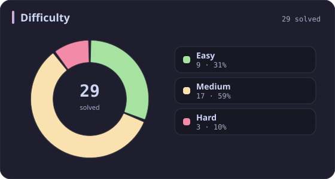
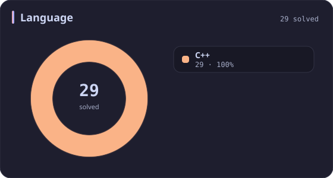
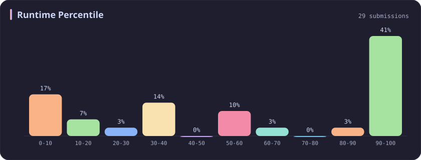
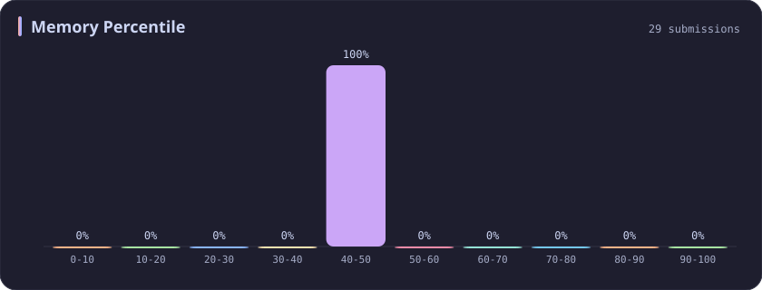
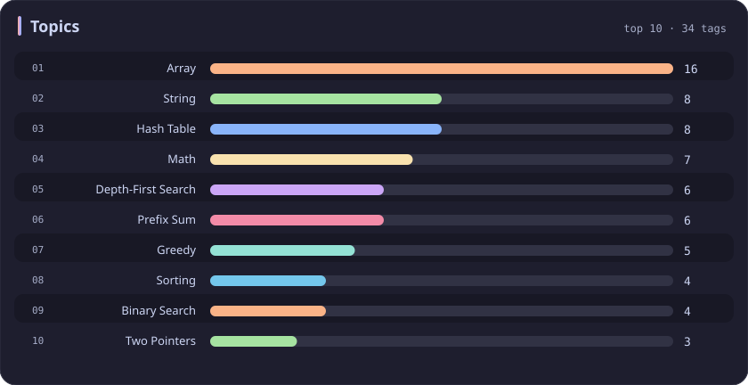

# Memory 40-50% Stats

[All stats](../../README.md)

**29** problems · updated `2026-09-04 19:12 UTC`

## Stats

### Difficulty

### Language

### Runtime Percentile

### Memory Percentile

| [0-10](0-10.md) | [10-20](10-20.md) | [20-30](20-30.md) | [30-40](30-40.md) | **40-50** | [50-60](50-60.md) | [60-70](60-70.md) | [70-80](70-80.md) | [80-90](80-90.md) | [90-100](90-100.md) |
| :---: | :---: | :---: | :---: | :---: | :---: | :---: | :---: | :---: | :---: |
| 74 | 53 | 36 | 31 | **29** | 27 | 25 | 39 | 35 | 381 |

### Topics

---

## Recent Activity

Latest **29** accepted submissions.

| Date | Title | Difficulty | Lang | Runtime | Memory |
| :--- | :--- | :---: | :---: | ---: | ---: |
| 2026-08-17 | [1563. Stone Game V](https://leetcode.com/problems/stone-game-v/) | Hard | C++ | 407 ms `57.19%` | 27.6 MB `46.96%` |
| 2026-08-13 | [270. Closest Binary Search Tree Value](https://leetcode.com/problems/closest-binary-search-tree-value/) | Easy | C++ | 0 ms `100.00%` | 21.2 MB `48.40%` |
| 2026-06-11 | [3558. Number of Ways to Assign Edge Weights I](https://leetcode.com/problems/number-of-ways-to-assign-edge-weights-i/) | Medium | C++ | 303 ms `53.85%` | 346.5 MB `44.39%` |
| 2026-06-06 | [2574. Left and Right Sum Differences](https://leetcode.com/problems/left-and-right-sum-differences/) | Easy | C++ | 0 ms `100.00%` | 15.2 MB `41.89%` |
| 2025-10-16 | [2598. Smallest Missing Non-negative Integer After Operations](https://leetcode.com/problems/smallest-missing-non-negative-integer-after-operations/) | Medium | C++ | 169 ms `13.05%` | 138.6 MB `45.43%` |
| 2025-10-11 | [3708. Longest Fibonacci Subarray](https://leetcode.com/problems/longest-fibonacci-subarray/) | Medium | C++ | 0 ms `100.00%` | 102.8 MB `45.05%` |
| 2025-10-11 | [3707. Equal Score Substrings](https://leetcode.com/problems/equal-score-substrings/) | Easy | C++ | 3 ms `23.55%` | 8.6 MB `44.95%` |
| 2025-10-01 | [1518. Water Bottles](https://leetcode.com/problems/water-bottles/) | Easy | C++ | 0 ms `100.00%` | 7.8 MB `46.26%` |
| 2025-09-27 | [3694. Distinct Points Reachable After Substring Removal](https://leetcode.com/problems/distinct-points-reachable-after-substring-removal/) | Medium | C++ | 130 ms `52.48%` | 53.5 MB `42.98%` |
| 2025-09-26 | [1152. Analyze User Website Visit Pattern](https://leetcode.com/problems/analyze-user-website-visit-pattern/) | Medium | C++ | 55 ms `19.05%` | 26.6 MB `42.86%` |
| 2025-09-05 | [2749. Minimum Operations to Make the Integer Zero](https://leetcode.com/problems/minimum-operations-to-make-the-integer-zero/) | Medium | C++ | 0 ms `100.00%` | 8.2 MB `42.26%` |
| 2025-06-08 | [386. Lexicographical Numbers](https://leetcode.com/problems/lexicographical-numbers/) | Medium | C++ | 0 ms `100.00%` | 14.2 MB `46.29%` |
| 2025-06-07 | [3170. Lexicographically Minimum String After Removing Stars](https://leetcode.com/problems/lexicographically-minimum-string-after-removing-stars/) | Medium | C++ | 54 ms `80.71%` | 27.2 MB `42.51%` |
| 2025-05-14 | [3337. Total Characters in String After Transformations II](https://leetcode.com/problems/total-characters-in-string-after-transformations-ii/) | Hard | C++ | 543 ms `9.64%` | 70.7 MB `42.17%` |
| 2025-05-08 | [3342. Find Minimum Time to Reach Last Room II](https://leetcode.com/problems/find-minimum-time-to-reach-last-room-ii/) | Medium | C++ | 777 ms `30.12%` | 116.8 MB `49.84%` |
| 2025-04-28 | [2302. Count Subarrays With Score Less Than K](https://leetcode.com/problems/count-subarrays-with-score-less-than-k/) | Hard | C++ | 0 ms `100.00%` | 99.1 MB `45.78%` |
| 2025-04-26 | [1214. Two Sum BSTs](https://leetcode.com/problems/two-sum-bsts/) | Medium | C++ | 0 ms `100.00%` | 29.5 MB `42.11%` |
| 2025-04-24 | [27. Remove Element](https://leetcode.com/problems/remove-element/) | Easy | C++ | 0 ms `100.00%` | 11.8 MB `48.98%` |
| 2025-04-19 | [1657. Determine if Two Strings Are Close](https://leetcode.com/problems/determine-if-two-strings-are-close/) | Medium | C++ | 27 ms `35.74%` | 23.6 MB `49.60%` |
| 2025-04-19 | [1732. Find the Highest Altitude](https://leetcode.com/problems/find-the-highest-altitude/) | Easy | C++ | 0 ms `100.00%` | 10.8 MB `44.88%` |
| 2025-04-19 | [605. Can Place Flowers](https://leetcode.com/problems/can-place-flowers/) | Easy | C++ | 0 ms `100.00%` | 24.1 MB `43.87%` |
| 2025-04-08 | [3396. Minimum Number of Operations to Make Elements in Array Distinct](https://leetcode.com/problems/minimum-number-of-operations-to-make-elements-in-array-distinct/) | Easy | C++ | 0 ms `100.00%` | 27.9 MB `40.94%` |
| 2025-02-14 | [448. Find All Numbers Disappeared in an Array](https://leetcode.com/problems/find-all-numbers-disappeared-in-an-array/) | Easy | C++ | 4 ms `66.42%` | 54.8 MB `45.01%` |
| 2024-11-11 | [2601. Prime Subtraction Operation](https://leetcode.com/problems/prime-subtraction-operation/) | Medium | C++ | 25 ms `34.60%` | 28.7 MB `41.64%` |
| 2024-04-03 | [79. Word Search](https://leetcode.com/problems/word-search/) | Medium | C++ | 375 ms `39.57%` | 10.8 MB `49.28%` |
| 2024-03-23 | [148. Sort List](https://leetcode.com/problems/sort-list/) | Medium | C++ | 124 ms `5.01%` | 58.8 MB `49.20%` |
| 2023-03-22 | [2492. Minimum Score of a Path Between Two Cities](https://leetcode.com/problems/minimum-score-of-a-path-between-two-cities/) | Medium | C++ | 578 ms `5.00%` | 146.9 MB `45.12%` |
| 2023-03-12 | [2587. Rearrange Array to Maximize Prefix Score](https://leetcode.com/problems/rearrange-array-to-maximize-prefix-score/) | Medium | C++ | 158 ms `5.18%` | 90.1 MB `47.79%` |
| 2023-02-26 | [2575. Find the Divisibility Array of a String](https://leetcode.com/problems/find-the-divisibility-array-of-a-string/) | Medium | C++ | 59 ms `5.93%` | 26.4 MB `46.36%` |
