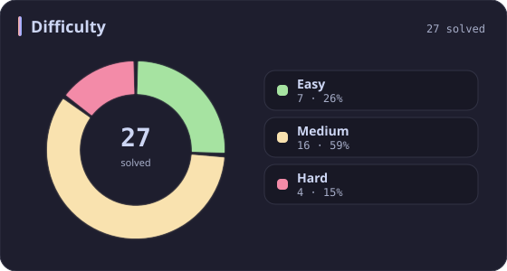
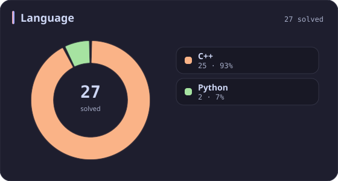
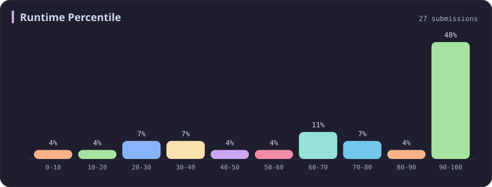
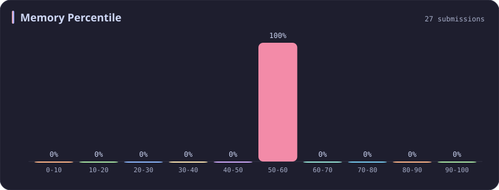
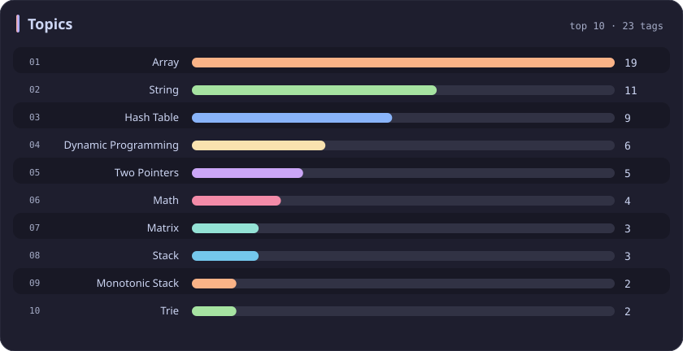

# Memory 50-60% Stats

[All stats](../../README.md)

**27** problems · updated `2026-09-04 19:14 UTC`

## Stats

### Difficulty

### Language

### Runtime Percentile

### Memory Percentile

| [0-10](0-10.md) | [10-20](10-20.md) | [20-30](20-30.md) | [30-40](30-40.md) | [40-50](40-50.md) | **50-60** | [60-70](60-70.md) | [70-80](70-80.md) | [80-90](80-90.md) | [90-100](90-100.md) |
| :---: | :---: | :---: | :---: | :---: | :---: | :---: | :---: | :---: | :---: |
| 74 | 53 | 36 | 31 | 29 | **27** | 25 | 39 | 35 | 381 |

### Topics

---

## Recent Activity

Latest **27** accepted submissions.

| Date | Title | Difficulty | Lang | Runtime | Memory |
| :--- | :--- | :---: | :---: | ---: | ---: |
| 2026&#8209;09&#8209;04 | [1. Two Sum](https://leetcode.com/problems/two-sum/) | Easy | C++ | 3 ms `67.25%` | 14.8 MB `58.55%` |
| 2026&#8209;06&#8209;04 | [369. Plus One Linked List](https://leetcode.com/problems/plus-one-linked-list/) | Medium | C++ | 0 ms `100.00%` | 12.2 MB `56.32%` |
| 2026&#8209;05&#8209;31 | [3945. Digit Frequency Score](https://leetcode.com/problems/digit-frequency-score/) | Easy | C++ | 0 ms `100.00%` | 8.7 MB `54.46%` |
| 2026&#8209;05&#8209;24 | [3941. Password Strength](https://leetcode.com/problems/password-strength/) | Medium | C++ | 20 ms `39.05%` | 17.6 MB `58.98%` |
| 2026&#8209;05&#8209;23 | [3936. Minimum Swaps to Move Zeros to End](https://leetcode.com/problems/minimum-swaps-to-move-zeros-to-end/) | Easy | Python | 0 ms `100.00%` | 19.2 MB `57.55%` |
| 2026&#8209;05&#8209;21 | [3043. Find the Length of the Longest Common Prefix](https://leetcode.com/problems/find-the-length-of-the-longest-common-prefix/) | Medium | C++ | 374 ms `18.26%` | 156.5 MB `52.60%` |
| 2026&#8209;02&#8209;19 | [696. Count Binary Substrings](https://leetcode.com/problems/count-binary-substrings/) | Easy | C++ | 0 ms `100.00%` | 13.1 MB `56.88%` |
| 2025&#8209;10&#8209;14 | [3349. Adjacent Increasing Subarrays Detection I](https://leetcode.com/problems/adjacent-increasing-subarrays-detection-i/) | Easy | C++ | 13 ms `51.08%` | 40.4 MB `54.98%` |
| 2025&#8209;09&#8209;14 | [966. Vowel Spellchecker](https://leetcode.com/problems/vowel-spellchecker/) | Medium | C++ | 37 ms `68.34%` | 41.6 MB `55.21%` |
| 2025&#8209;08&#8209;30 | [36. Valid Sudoku](https://leetcode.com/problems/valid-sudoku/) | Medium | C++ | 0 ms `100.00%` | 22.7 MB `57.13%` |
| 2025&#8209;08&#8209;27 | [3459. Length of Longest V-Shaped Diagonal Segment](https://leetcode.com/problems/length-of-longest-v-shaped-diagonal-segment/) | Hard | C++ | 231 ms `91.38%` | 111.8 MB `52.16%` |
| 2025&#8209;06&#8209;13 | [2616. Minimize the Maximum Difference of Pairs](https://leetcode.com/problems/minimize-the-maximum-difference-of-pairs/) | Medium | C++ | 30 ms `30.34%` | 86.8 MB `50.70%` |
| 2025&#8209;06&#8209;05 | [1061. Lexicographically Smallest Equivalent String](https://leetcode.com/problems/lexicographically-smallest-equivalent-string/) | Medium | C++ | 2 ms `46.62%` | 9 MB `53.92%` |
| 2025&#8209;05&#8209;11 | [772. Basic Calculator III](https://leetcode.com/problems/basic-calculator-iii/) | Hard | C++ | 0 ms `100.00%` | 11.5 MB `56.44%` |
| 2025&#8209;05&#8209;04 | [616. Add Bold Tag in String](https://leetcode.com/problems/add-bold-tag-in-string/) | Medium | C++ | 7 ms `65.58%` | 13.9 MB `59.74%` |
| 2025&#8209;05&#8209;04 | [186. Reverse Words in a String II](https://leetcode.com/problems/reverse-words-in-a-string-ii/) | Medium | C++ | 0 ms `100.00%` | 20.1 MB `59.42%` |
| 2025&#8209;04&#8209;26 | [3527. Find the Most Common Response](https://leetcode.com/problems/find-the-most-common-response/) | Medium | C++ | 1472 ms `24.07%` | 479.3 MB `51.50%` |
| 2025&#8209;04&#8209;24 | [80. Remove Duplicates from Sorted Array II](https://leetcode.com/problems/remove-duplicates-from-sorted-array-ii/) | Medium | C++ | 7 ms `72.05%` | 19.6 MB `59.90%` |
| 2025&#8209;04&#8209;24 | [26. Remove Duplicates from Sorted Array](https://leetcode.com/problems/remove-duplicates-from-sorted-array/) | Easy | C++ | 0 ms `100.00%` | 22.6 MB `52.70%` |
| 2025&#8209;04&#8209;23 | [1143. Longest Common Subsequence](https://leetcode.com/problems/longest-common-subsequence/) | Medium | C++ | 24 ms `72.81%` | 27.4 MB `55.87%` |
| 2025&#8209;04&#8209;21 | [2145. Count the Hidden Sequences](https://leetcode.com/problems/count-the-hidden-sequences/) | Medium | C++ | 0 ms `100.00%` | 112.6 MB `50.89%` |
| 2025&#8209;04&#8209;20 | [3524. Find X Value of Array I](https://leetcode.com/problems/find-x-value-of-array-i/) | Medium | C++ | 150 ms `82.08%` | 151.2 MB `54.72%` |
| 2025&#8209;04&#8209;20 | [3523. Make Array Non-decreasing](https://leetcode.com/problems/make-array-non-decreasing/) | Medium | C++ | 0 ms `100.00%` | 206.4 MB `51.04%` |
| 2024&#8209;11&#8209;08 | [1829. Maximum XOR for Each Query](https://leetcode.com/problems/maximum-xor-for-each-query/) | Medium | C++ | 12 ms `20.47%` | 99.6 MB `58.04%` |
| 2024&#8209;10&#8209;29 | [265. Paint House II](https://leetcode.com/problems/paint-house-ii/) | Hard | C++ | 0 ms `100.00%` | 15.4 MB `52.47%` |
| 2024&#8209;10&#8209;19 | [2451. Odd String Difference](https://leetcode.com/problems/odd-string-difference/) | Easy | C++ | 0 ms `100.00%` | 10.2 MB `55.73%` |
| 2024&#8209;04&#8209;13 | [85. Maximal Rectangle](https://leetcode.com/problems/maximal-rectangle/) | Hard | Python | 1343 ms `6.67%` | 24.6 MB `50.77%` |
