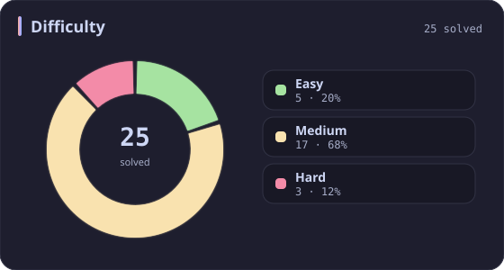
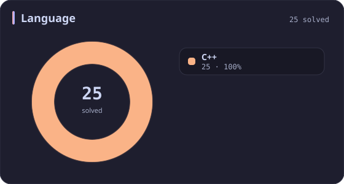
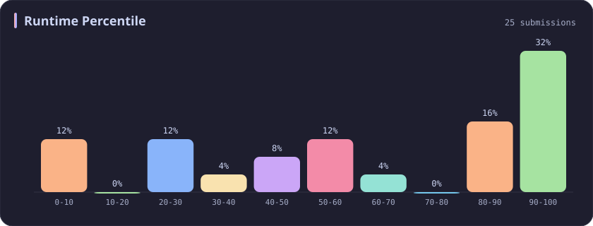
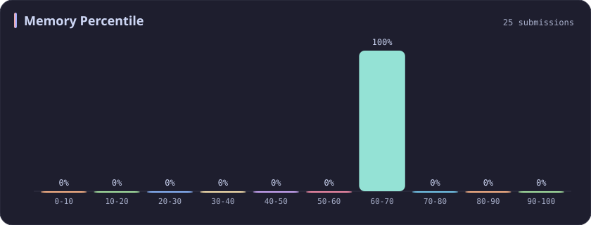
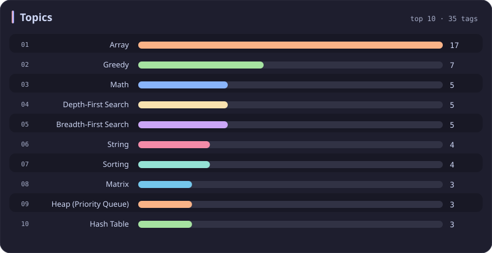

# Memory 60-70% Stats

[All stats](../../README.md)

**25** problems · updated `2026-09-04 19:14 UTC`

## Stats

### Difficulty

### Language

### Runtime Percentile

### Memory Percentile

| [0-10](0-10.md) | [10-20](10-20.md) | [20-30](20-30.md) | [30-40](30-40.md) | [40-50](40-50.md) | [50-60](50-60.md) | **60-70** | [70-80](70-80.md) | [80-90](80-90.md) | [90-100](90-100.md) |
| :---: | :---: | :---: | :---: | :---: | :---: | :---: | :---: | :---: | :---: |
| 74 | 53 | 36 | 31 | 29 | 27 | **25** | 39 | 35 | 381 |

### Topics

---

## Recent Activity

Latest **25** accepted submissions.

| Date | Title | Difficulty | Lang | Runtime | Memory |
| :--- | :--- | :---: | :---: | ---: | ---: |
| 2026&#8209;06&#8209;06 | [3951. Minimum Energy to Maintain Brightness](https://leetcode.com/problems/minimum-energy-to-maintain-brightness/) | Medium | C++ | 74 ms `83.55%` | 203.6 MB `61.06%` |
| 2026&#8209;02&#8209;09 | [1382. Balance a Binary Search Tree](https://leetcode.com/problems/balance-a-binary-search-tree/) | Medium | C++ | 22 ms `20.32%` | 65.6 MB `66.43%` |
| 2025&#8209;09&#8209;27 | [3693. Climbing Stairs II](https://leetcode.com/problems/climbing-stairs-ii/) | Medium | C++ | 20 ms `54.23%` | 177.8 MB `64.31%` |
| 2025&#8209;09&#8209;10 | [1733. Minimum Number of People to Teach](https://leetcode.com/problems/minimum-number-of-people-to-teach/) | Medium | C++ | 35 ms `82.77%` | 67.6 MB `68.42%` |
| 2025&#8209;09&#8209;08 | [1317. Convert Integer to the Sum of Two No-Zero Integers](https://leetcode.com/problems/convert-integer-to-the-sum-of-two-no-zero-integers/) | Easy | C++ | 0 ms `100.00%` | 8.2 MB `60.98%` |
| 2025&#8209;09&#8209;01 | [1792. Maximum Average Pass Ratio](https://leetcode.com/problems/maximum-average-pass-ratio/) | Medium | C++ | 273 ms `89.50%` | 97.9 MB `69.41%` |
| 2025&#8209;06&#8209;02 | [135. Candy](https://leetcode.com/problems/candy/) | Hard | C++ | 4 ms `28.57%` | 22.9 MB `69.10%` |
| 2025&#8209;05&#8209;31 | [909. Snakes and Ladders](https://leetcode.com/problems/snakes-and-ladders/) | Medium | C++ | 0 ms `100.00%` | 16.9 MB `67.49%` |
| 2025&#8209;05&#8209;27 | [2894. Divisible and Non-divisible Sums Difference](https://leetcode.com/problems/divisible-and-non-divisible-sums-difference/) | Easy | C++ | 0 ms `100.00%` | 8.3 MB `66.09%` |
| 2025&#8209;05&#8209;24 | [3556. Sum of Largest Prime Substrings](https://leetcode.com/problems/sum-of-largest-prime-substrings/) | Medium | C++ | 15 ms `51.49%` | 10.8 MB `60.40%` |
| 2025&#8209;05&#8209;09 | [3343. Count Number of Balanced Permutations](https://leetcode.com/problems/count-number-of-balanced-permutations/) | Hard | C++ | 150 ms `50.60%` | 19.4 MB `65.06%` |
| 2025&#8209;05&#8209;04 | [163. Missing Ranges](https://leetcode.com/problems/missing-ranges/) | Easy | C++ | 0 ms `100.00%` | 9.3 MB `68.98%` |
| 2025&#8209;04&#8209;26 | [505. The Maze II](https://leetcode.com/problems/the-maze-ii/) | Medium | C++ | 3 ms `85.22%` | 24.3 MB `63.05%` |
| 2025&#8209;04&#8209;24 | [134. Gas Station](https://leetcode.com/problems/gas-station/) | Medium | C++ | 3 ms `34.61%` | 112.5 MB `61.27%` |
| 2025&#8209;04&#8209;24 | [189. Rotate Array](https://leetcode.com/problems/rotate-array/) | Medium | C++ | 0 ms `100.00%` | 29.6 MB `66.58%` |
| 2025&#8209;04&#8209;24 | [1268. Search Suggestions System](https://leetcode.com/problems/search-suggestions-system/) | Medium | C++ | 31 ms `64.68%` | 44 MB `62.90%` |
| 2025&#8209;04&#8209;20 | [399. Evaluate Division](https://leetcode.com/problems/evaluate-division/) | Medium | C++ | 2 ms `22.06%` | 12 MB `60.01%` |
| 2025&#8209;04&#8209;19 | [199. Binary Tree Right Side View](https://leetcode.com/problems/binary-tree-right-side-view/) | Medium | C++ | 0 ms `100.00%` | 14.9 MB `63.75%` |
| 2025&#8209;04&#8209;19 | [328. Odd Even Linked List](https://leetcode.com/problems/odd-even-linked-list/) | Medium | C++ | 0 ms `100.00%` | 15.6 MB `63.59%` |
| 2025&#8209;04&#8209;19 | [933. Number of Recent Calls](https://leetcode.com/problems/number-of-recent-calls/) | Easy | C++ | 20 ms `40.20%` | 64.1 MB `69.17%` |
| 2025&#8209;04&#8209;19 | [334. Increasing Triplet Subsequence](https://leetcode.com/problems/increasing-triplet-subsequence/) | Medium | C++ | 0 ms `100.00%` | 115.7 MB `67.97%` |
| 2025&#8209;04&#8209;11 | [1431. Kids With the Greatest Number of Candies](https://leetcode.com/problems/kids-with-the-greatest-number-of-candies/) | Easy | C++ | 1 ms `3.25%` | 12.5 MB `60.06%` |
| 2024&#8209;10&#8209;20 | [846. Hand of Straights](https://leetcode.com/problems/hand-of-straights/) | Medium | C++ | 57 ms `7.27%` | 32.2 MB `63.49%` |
| 2024&#8209;04&#8209;19 | [200. Number of Islands](https://leetcode.com/problems/number-of-islands/) | Medium | C++ | 28 ms `47.94%` | 16.8 MB `60.84%` |
| 2023&#8209;03&#8209;05 | [2585. Number of Ways to Earn Points](https://leetcode.com/problems/number-of-ways-to-earn-points/) | Hard | C++ | 280 ms `5.27%` | 17 MB `63.85%` |
