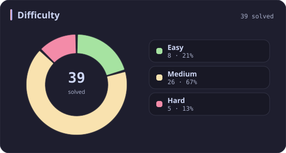
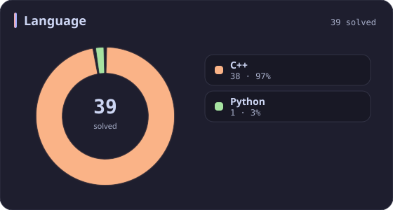
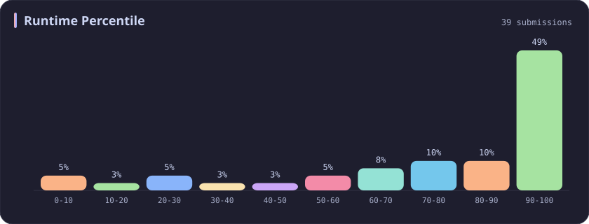
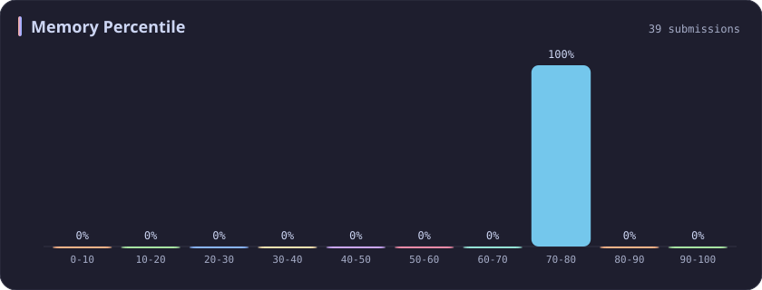

# Memory 70-80% Stats

[All stats](../../README.md)

**39** problems · updated `2026-09-04 19:32 UTC`

## Stats

### Difficulty

### Language

### Runtime Percentile

### Memory Percentile

| [0-10](0-10.md) | [10-20](10-20.md) | [20-30](20-30.md) | [30-40](30-40.md) | [40-50](40-50.md) | [50-60](50-60.md) | [60-70](60-70.md) | **70-80** | [80-90](80-90.md) | [90-100](90-100.md) |
| :---: | :---: | :---: | :---: | :---: | :---: | :---: | :---: | :---: | :---: |
| 75 | 53 | 36 | 31 | 29 | 27 | 25 | **39** | 35 | 381 |

### Topics

---

## Recent Activity

Latest **39** accepted submissions.

| Date | Title | Difficulty | Lang | Runtime | Memory |
| :--- | :--- | :---: | :---: | ---: | ---: |
| 2026&#8209;08&#8209;13 | [250. Count Univalue Subtrees](https://leetcode.com/problems/count-univalue-subtrees/) | Medium | C++ | 0 ms `100.00%` | 18.5 MB `75.93%` |
| 2026&#8209;08&#8209;13 | [549. Binary Tree Longest Consecutive Sequence II](https://leetcode.com/problems/binary-tree-longest-consecutive-sequence-ii/) | Medium | C++ | 0 ms `100.00%` | 22.7 MB `78.57%` |
| 2026&#8209;06&#8209;04 | [298. Binary Tree Longest Consecutive Sequence](https://leetcode.com/problems/binary-tree-longest-consecutive-sequence/) | Medium | C++ | 0 ms `100.00%` | 32.9 MB `74.42%` |
| 2026&#8209;06&#8209;04 | [3751. Total Waviness of Numbers in Range I](https://leetcode.com/problems/total-waviness-of-numbers-in-range-i/) | Medium | C++ | 50 ms `45.88%` | 9.3 MB `72.51%` |
| 2026&#8209;05&#8209;20 | [2657. Find the Prefix Common Array of Two Arrays](https://leetcode.com/problems/find-the-prefix-common-array-of-two-arrays/) | Medium | C++ | 0 ms `100.00%` | 85.9 MB `74.63%` |
| 2025&#8209;10&#8209;12 | [3539. Find Sum of Array Product of Magical Sequences](https://leetcode.com/problems/find-sum-of-array-product-of-magical-sequences/) | Hard | Python | 411 ms `97.50%` | 33.9 MB `70.00%` |
| 2025&#8209;10&#8209;05 | [417. Pacific Atlantic Water Flow](https://leetcode.com/problems/pacific-atlantic-water-flow/) | Medium | C++ | 4 ms `76.47%` | 22.2 MB `76.03%` |
| 2025&#8209;10&#8209;04 | [11. Container With Most Water](https://leetcode.com/problems/container-with-most-water/) | Medium | C++ | 0 ms `100.00%` | 62.8 MB `79.30%` |
| 2025&#8209;09&#8209;28 | [976. Largest Perimeter Triangle](https://leetcode.com/problems/largest-perimeter-triangle/) | Easy | C++ | 12 ms `25.68%` | 25.6 MB `79.00%` |
| 2025&#8209;09&#8209;28 | [3700. Number of ZigZag Arrays II](https://leetcode.com/problems/number-of-zigzag-arrays-ii/) | Hard | C++ | 285 ms `71.83%` | 23.4 MB `79.93%` |
| 2025&#8209;09&#8209;27 | [3688. Bitwise OR of Even Numbers in an Array](https://leetcode.com/problems/bitwise-or-of-even-numbers-in-an-array/) | Easy | C++ | 0 ms `100.00%` | 24.5 MB `71.15%` |
| 2025&#8209;09&#8209;06 | [3495. Minimum Operations to Make Array Elements Zero](https://leetcode.com/problems/minimum-operations-to-make-array-elements-zero/) | Hard | C++ | 7 ms `87.50%` | 183.2 MB `73.61%` |
| 2025&#8209;08&#8209;25 | [498. Diagonal Traverse](https://leetcode.com/problems/diagonal-traverse/) | Medium | C++ | 0 ms `100.00%` | 22.8 MB `70.10%` |
| 2025&#8209;06&#8209;04 | [3403. Find the Lexicographically Largest String From the Box I](https://leetcode.com/problems/find-the-lexicographically-largest-string-from-the-box-i/) | Medium | C++ | 9 ms `91.91%` | 12.9 MB `76.28%` |
| 2025&#8209;05&#8209;28 | [3372. Maximize the Number of Target Nodes After Connecting Trees I](https://leetcode.com/problems/maximize-the-number-of-target-nodes-after-connecting-trees-i/) | Medium | C++ | 181 ms `69.37%` | 62.9 MB `70.27%` |
| 2025&#8209;05&#8209;25 | [2131. Longest Palindrome by Concatenating Two Letter Words](https://leetcode.com/problems/longest-palindrome-by-concatenating-two-letter-words/) | Medium | C++ | 27 ms `88.02%` | 171.9 MB `78.72%` |
| 2025&#8209;05&#8209;16 | [2901. Longest Unequal Adjacent Groups Subsequence II](https://leetcode.com/problems/longest-unequal-adjacent-groups-subsequence-ii/) | Medium | C++ | 63 ms `64.73%` | 34.4 MB `74.88%` |
| 2025&#8209;05&#8209;11 | [439. Ternary Expression Parser](https://leetcode.com/problems/ternary-expression-parser/) | Medium | C++ | 0 ms `100.00%` | 8.9 MB `79.45%` |
| 2025&#8209;05&#8209;11 | [1272. Remove Interval](https://leetcode.com/problems/remove-interval/) | Medium | C++ | 4 ms `78.08%` | 42.6 MB `73.97%` |
| 2025&#8209;05&#8209;04 | [252. Meeting Rooms](https://leetcode.com/problems/meeting-rooms/) | Easy | C++ | 3 ms `39.58%` | 15.9 MB `79.28%` |
| 2025&#8209;05&#8209;04 | [1100. Find K-Length Substrings With No Repeated Characters](https://leetcode.com/problems/find-k-length-substrings-with-no-repeated-characters/) | Medium | C++ | 0 ms `100.00%` | 9 MB `73.74%` |
| 2025&#8209;05&#8209;04 | [340. Longest Substring with At Most K Distinct Characters](https://leetcode.com/problems/longest-substring-with-at-most-k-distinct-characters/) | Medium | C++ | 0 ms `100.00%` | 9.7 MB `78.62%` |
| 2025&#8209;04&#8209;28 | [734. Sentence Similarity](https://leetcode.com/problems/sentence-similarity/) | Easy | C++ | 2 ms `52.34%` | 15.7 MB `70.09%` |
| 2025&#8209;04&#8209;26 | [490. The Maze](https://leetcode.com/problems/the-maze/) | Medium | C++ | 0 ms `100.00%` | 22.9 MB `79.49%` |
| 2025&#8209;04&#8209;25 | [280. Wiggle Sort](https://leetcode.com/problems/wiggle-sort/) | Medium | C++ | 0 ms `100.00%` | 17.7 MB `79.14%` |
| 2025&#8209;04&#8209;24 | [45. Jump Game II](https://leetcode.com/problems/jump-game-ii/) | Medium | C++ | 0 ms `100.00%` | 20.6 MB `78.55%` |
| 2025&#8209;04&#8209;23 | [72. Edit Distance](https://leetcode.com/problems/edit-distance/) | Medium | C++ | 11 ms `28.88%` | 13.1 MB `74.14%` |
| 2025&#8209;04&#8209;23 | [62. Unique Paths](https://leetcode.com/problems/unique-paths/) | Medium | C++ | 0 ms `100.00%` | 9 MB `72.04%` |
| 2025&#8209;04&#8209;23 | [746. Min Cost Climbing Stairs](https://leetcode.com/problems/min-cost-climbing-stairs/) | Easy | C++ | 0 ms `100.00%` | 17.5 MB `75.70%` |
| 2025&#8209;04&#8209;23 | [1399. Count Largest Group](https://leetcode.com/problems/count-largest-group/) | Easy | C++ | 0 ms `100.00%` | 7.9 MB `77.49%` |
| 2025&#8209;04&#8209;22 | [2338. Count the Number of Ideal Arrays](https://leetcode.com/problems/count-the-number-of-ideal-arrays/) | Hard | C++ | 10 ms `75.00%` | 10.3 MB `76.47%` |
| 2025&#8209;04&#8209;20 | [3522. Calculate Score After Performing Instructions](https://leetcode.com/problems/calculate-score-after-performing-instructions/) | Medium | C++ | 4 ms `64.29%` | 167.2 MB `74.06%` |
| 2025&#8209;04&#8209;19 | [206. Reverse Linked List](https://leetcode.com/problems/reverse-linked-list/) | Easy | C++ | 0 ms `100.00%` | 13.4 MB `72.41%` |
| 2025&#8209;04&#8209;19 | [325. Maximum Size Subarray Sum Equals k](https://leetcode.com/problems/maximum-size-subarray-sum-equals-k/) | Medium | C++ | 353 ms `6.74%` | 122.8 MB `74.16%` |
| 2025&#8209;04&#8209;09 | [3375. Minimum Operations to Make Array Values Equal to K](https://leetcode.com/problems/minimum-operations-to-make-array-values-equal-to-k/) | Easy | C++ | 6 ms `89.22%` | 32.2 MB `71.12%` |
| 2025&#8209;04&#8209;07 | [416. Partition Equal Subset Sum](https://leetcode.com/problems/partition-equal-subset-sum/) | Medium | C++ | 71 ms `85.52%` | 15.9 MB `74.44%` |
| 2024&#8209;10&#8209;29 | [2684. Maximum Number of Moves in a Grid](https://leetcode.com/problems/maximum-number-of-moves-in-a-grid/) | Medium | C++ | 15 ms `58.58%` | 74.4 MB `74.18%` |
| 2023&#8209;04&#8209;15 | [2642. Design Graph With Shortest Path Calculator](https://leetcode.com/problems/design-graph-with-shortest-path-calculator/) | Hard | C++ | 220 ms `11.24%` | 78.1 MB `73.94%` |
| 2023&#8209;03&#8209;26 | [2602. Minimum Operations to Make All Array Elements Equal](https://leetcode.com/problems/minimum-operations-to-make-all-array-elements-equal/) | Medium | C++ | 270 ms `5.04%` | 84.5 MB `78.02%` |
