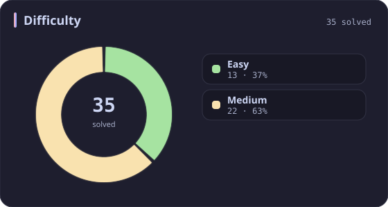
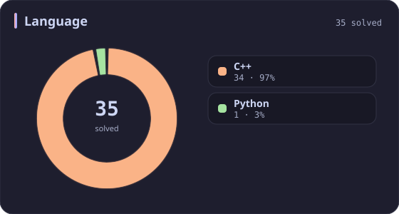
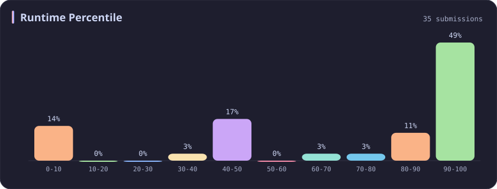
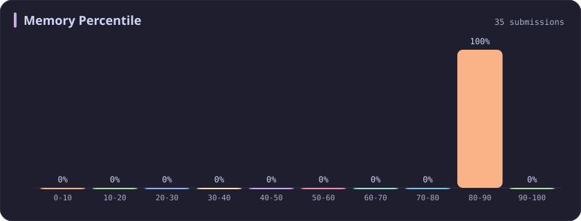

# Memory 80-90% Stats

[All stats](../../README.md)

**35** problems · updated `2026-09-04 19:14 UTC`

## Stats

### Difficulty

### Language

### Runtime Percentile

### Memory Percentile

| [0-10](0-10.md) | [10-20](10-20.md) | [20-30](20-30.md) | [30-40](30-40.md) | [40-50](40-50.md) | [50-60](50-60.md) | [60-70](60-70.md) | [70-80](70-80.md) | **80-90** | [90-100](90-100.md) |
| :---: | :---: | :---: | :---: | :---: | :---: | :---: | :---: | :---: | :---: |
| 74 | 53 | 36 | 31 | 29 | 27 | 25 | 39 | **35** | 381 |

### Topics

---

## Recent Activity

Latest **35** accepted submissions.

| Date | Title | Difficulty | Lang | Runtime | Memory |
| :--- | :--- | :---: | :---: | ---: | ---: |
| 2026&#8209;09&#8209;04 | [704. Binary Search](https://leetcode.com/problems/binary-search/) | Easy | C++ | 0 ms `100.00%` | 31.3 MB `81.38%` |
| 2026&#8209;09&#8209;03 | [3876. Construct Uniform Parity Array II](https://leetcode.com/problems/construct-uniform-parity-array-ii/) | Medium | C++ | 7 ms `42.89%` | 165.7 MB `84.39%` |
| 2026&#8209;08&#8209;13 | [286. Walls and Gates](https://leetcode.com/problems/walls-and-gates/) | Medium | C++ | 7 ms `44.44%` | 19 MB `83.33%` |
| 2026&#8209;02&#8209;08 | [110. Balanced Binary Tree](https://leetcode.com/problems/balanced-binary-tree/) | Easy | C++ | 0 ms `100.00%` | 23 MB `83.72%` |
| 2026&#8209;02&#8209;06 | [3634. Minimum Removals to Balance Array](https://leetcode.com/problems/minimum-removals-to-balance-array/) | Medium | C++ | 31 ms `62.90%` | 105 MB `86.33%` |
| 2025&#8209;09&#8209;27 | [3692. Majority Frequency Characters](https://leetcode.com/problems/majority-frequency-characters/) | Easy | C++ | 5 ms `31.61%` | 9.2 MB `86.77%` |
| 2025&#8209;08&#8209;29 | [3021. Alice and Bob Playing Flower Game](https://leetcode.com/problems/alice-and-bob-playing-flower-game/) | Medium | C++ | 0 ms `100.00%` | 8.4 MB `89.39%` |
| 2025&#8209;08&#8209;28 | [3446. Sort Matrix by Diagonals](https://leetcode.com/problems/sort-matrix-by-diagonals/) | Medium | C++ | 4 ms `84.97%` | 43.3 MB `86.76%` |
| 2025&#8209;06&#8209;01 | [2929. Distribute Candies Among Children II](https://leetcode.com/problems/distribute-candies-among-children-ii/) | Medium | C++ | 14 ms `49.47%` | 8.9 MB `83.04%` |
| 2025&#8209;05&#8209;15 | [2900. Longest Unequal Adjacent Groups Subsequence I](https://leetcode.com/problems/longest-unequal-adjacent-groups-subsequence-i/) | Easy | C++ | 0 ms `100.00%` | 29.9 MB `88.73%` |
| 2025&#8209;05&#8209;13 | [3335. Total Characters in String After Transformations I](https://leetcode.com/problems/total-characters-in-string-after-transformations-i/) | Medium | C++ | 14 ms `98.77%` | 19.2 MB `88.62%` |
| 2025&#8209;05&#8209;12 | [346. Moving Average from Data Stream](https://leetcode.com/problems/moving-average-from-data-stream/) | Easy | C++ | 3 ms `46.36%` | 20.8 MB `80.04%` |
| 2025&#8209;05&#8209;12 | [359. Logger Rate Limiter](https://leetcode.com/problems/logger-rate-limiter/) | Easy | C++ | 4 ms `86.98%` | 39.2 MB `89.46%` |
| 2025&#8209;05&#8209;12 | [2094. Finding 3-Digit Even Numbers](https://leetcode.com/problems/finding-3-digit-even-numbers/) | Easy | C++ | 0 ms `100.00%` | 12.5 MB `82.00%` |
| 2025&#8209;05&#8209;11 | [3545. Minimum Deletions for At Most K Distinct Characters](https://leetcode.com/problems/minimum-deletions-for-at-most-k-distinct-characters/) | Easy | C++ | 3 ms `41.64%` | 9 MB `89.15%` |
| 2025&#8209;05&#8209;05 | [790. Domino and Tromino Tiling](https://leetcode.com/problems/domino-and-tromino-tiling/) | Medium | C++ | 0 ms `100.00%` | 7.9 MB `86.89%` |
| 2025&#8209;05&#8209;04 | [487. Max Consecutive Ones II](https://leetcode.com/problems/max-consecutive-ones-ii/) | Medium | C++ | 0 ms `100.00%` | 39.8 MB `87.01%` |
| 2025&#8209;05&#8209;04 | [159. Longest Substring with At Most Two Distinct Characters](https://leetcode.com/problems/longest-substring-with-at-most-two-distinct-characters/) | Medium | C++ | 3 ms `93.66%` | 12.1 MB `88.81%` |
| 2025&#8209;05&#8209;03 | [981. Time Based Key-Value Store](https://leetcode.com/problems/time-based-key-value-store/) | Medium | C++ | 38 ms `86.73%` | 136.5 MB `84.35%` |
| 2025&#8209;04&#8209;26 | [266. Palindrome Permutation](https://leetcode.com/problems/palindrome-permutation/) | Easy | C++ | 0 ms `100.00%` | 8.2 MB `88.46%` |
| 2025&#8209;04&#8209;24 | [55. Jump Game](https://leetcode.com/problems/jump-game/) | Medium | C++ | 0 ms `100.00%` | 52.3 MB `83.21%` |
| 2025&#8209;04&#8209;24 | [88. Merge Sorted Array](https://leetcode.com/problems/merge-sorted-array/) | Easy | C++ | 0 ms `100.00%` | 12.4 MB `82.77%` |
| 2025&#8209;04&#8209;20 | [450. Delete Node in a BST](https://leetcode.com/problems/delete-node-in-a-bst/) | Medium | C++ | 0 ms `100.00%` | 34.3 MB `87.09%` |
| 2025&#8209;04&#8209;19 | [735. Asteroid Collision](https://leetcode.com/problems/asteroid-collision/) | Medium | C++ | 0 ms `100.00%` | 21.6 MB `89.55%` |
| 2025&#8209;04&#8209;19 | [1207. Unique Number of Occurrences](https://leetcode.com/problems/unique-number-of-occurrences/) | Easy | C++ | 0 ms `100.00%` | 11.8 MB `88.68%` |
| 2025&#8209;04&#8209;19 | [1456. Maximum Number of Vowels in a Substring of Given Length](https://leetcode.com/problems/maximum-number-of-vowels-in-a-substring-of-given-length/) | Medium | C++ | 3 ms `87.94%` | 13 MB `89.77%` |
| 2025&#8209;04&#8209;19 | [643. Maximum Average Subarray I](https://leetcode.com/problems/maximum-average-subarray-i/) | Easy | C++ | 0 ms `100.00%` | 113.7 MB `86.94%` |
| 2024&#8209;11&#8209;12 | [2070. Most Beautiful Item for Each Query](https://leetcode.com/problems/most-beautiful-item-for-each-query/) | Medium | C++ | 35 ms `96.42%` | 92.3 MB `86.68%` |
| 2024&#8209;11&#8209;01 | [1957. Delete Characters to Make Fancy String](https://leetcode.com/problems/delete-characters-to-make-fancy-string/) | Easy | C++ | 23 ms `77.42%` | 42.7 MB `87.55%` |
| 2024&#8209;04&#8209;22 | [752. Open the Lock](https://leetcode.com/problems/open-the-lock/) | Medium | C++ | 837 ms `5.02%` | 38.2 MB `86.83%` |
| 2023&#8209;10&#8209;02 | [2038. Remove Colored Pieces if Both Neighbors are the Same Color](https://leetcode.com/problems/remove-colored-pieces-if-both-neighbors-are-the-same-color/) | Medium | Python | 205 ms `9.43%` | 19.9 MB `85.28%` |
| 2023&#8209;04&#8209;14 | [516. Longest Palindromic Subsequence](https://leetcode.com/problems/longest-palindromic-subsequence/) | Medium | C++ | 85 ms `41.32%` | 72.3 MB `81.80%` |
| 2023&#8209;04&#8209;02 | [2611. Mice and Cheese](https://leetcode.com/problems/mice-and-cheese/) | Medium | C++ | 217 ms `5.13%` | 110.2 MB `81.62%` |
| 2023&#8209;03&#8209;18 | [2593. Find Score of an Array After Marking All Elements](https://leetcode.com/problems/find-score-of-an-array-after-marking-all-elements/) | Medium | C++ | 379 ms `7.82%` | 102.9 MB `87.24%` |
| 2023&#8209;02&#8209;16 | [22. Generate Parentheses](https://leetcode.com/problems/generate-parentheses/) | Medium | C++ | 14 ms `6.05%` | 13 MB `82.22%` |
