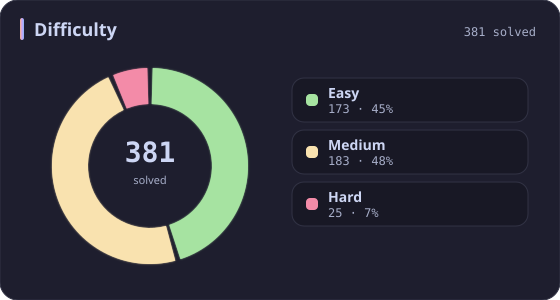
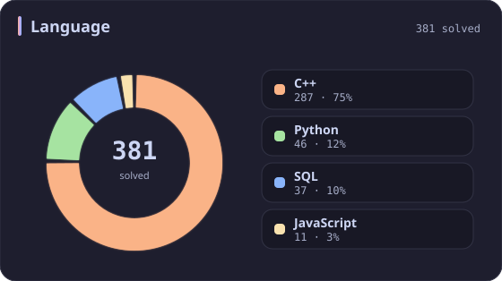
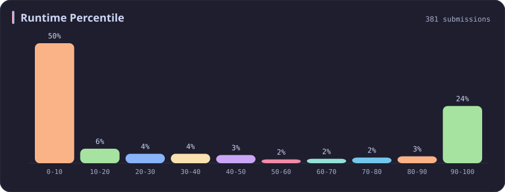
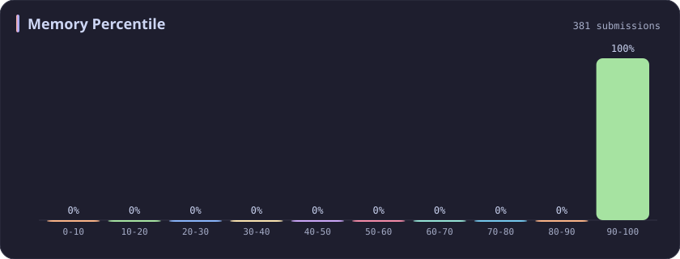

# Memory 90-100% Stats

[All stats](../../README.md)

**381** problems · updated `2026-09-04 19:23 UTC`

## Stats

### Difficulty

### Language

### Runtime Percentile

### Memory Percentile

| [0-10](0-10.md) | [10-20](10-20.md) | [20-30](20-30.md) | [30-40](30-40.md) | [40-50](40-50.md) | [50-60](50-60.md) | [60-70](60-70.md) | [70-80](70-80.md) | [80-90](80-90.md) | **90-100** |
| :---: | :---: | :---: | :---: | :---: | :---: | :---: | :---: | :---: | :---: |
| 74 | 53 | 36 | 31 | 29 | 27 | 25 | 39 | 35 | **381** |

### Topics

---

## Recent Activity

Latest **100** accepted submissions.

| Date | Title | Difficulty | Lang | Runtime | Memory |
| :--- | :--- | :---: | :---: | ---: | ---: |
| 2026&#8209;08&#8209;18 | [3471. Find the Largest Almost Missing Integer](https://leetcode.com/problems/find-the-largest-almost-missing-integer/) | Easy | C++ | 0 ms `100.00%` | 28.9 MB `92.57%` |
| 2026&#8209;05&#8209;22 | [33. Search in Rotated Sorted Array](https://leetcode.com/problems/search-in-rotated-sorted-array/) | Medium | C++ | 0 ms `100.00%` | 15 MB `96.75%` |
| 2026&#8209;03&#8209;25 | [3546. Equal Sum Grid Partition I](https://leetcode.com/problems/equal-sum-grid-partition-i/) | Medium | C++ | 12 ms `34.01%` | 130.2 MB `100.00%` |
| 2026&#8209;02&#8209;10 | [3719. Longest Balanced Subarray I](https://leetcode.com/problems/longest-balanced-subarray-i/) | Medium | C++ | 151 ms `89.04%` | 35.7 MB `94.90%` |
| 2025&#8209;10&#8209;17 | [3003. Maximize the Number of Partitions After Operations](https://leetcode.com/problems/maximize-the-number-of-partitions-after-operations/) | Hard | C++ | 4 ms `96.26%` | 12.3 MB `97.20%` |
| 2025&#8209;10&#8209;11 | [3147. Taking Maximum Energy From the Mystic Dungeon](https://leetcode.com/problems/taking-maximum-energy-from-the-mystic-dungeon/) | Medium | C++ | 141 ms `82.37%` | 151.8 MB `100.00%` |
| 2025&#8209;10&#8209;11 | [3186. Maximum Total Damage With Spell Casting](https://leetcode.com/problems/maximum-total-damage-with-spell-casting/) | Medium | C++ | 111 ms `86.08%` | 162.8 MB `90.83%` |
| 2025&#8209;10&#8209;07 | [1488. Avoid Flood in The City](https://leetcode.com/problems/avoid-flood-in-the-city/) | Medium | C++ | 216 ms `21.79%` | 121.2 MB `100.00%` |
| 2025&#8209;09&#8209;28 | [3699. Number of ZigZag Arrays I](https://leetcode.com/problems/number-of-zigzag-arrays-i/) | Hard | C++ | 407 ms `76.79%` | 11.7 MB `94.59%` |
| 2025&#8209;09&#8209;28 | [3698. Split Array With Minimum Difference](https://leetcode.com/problems/split-array-with-minimum-difference/) | Medium | C++ | 0 ms `100.00%` | 169.6 MB `94.85%` |
| 2025&#8209;09&#8209;27 | [3689. Maximum Total Subarray Value I](https://leetcode.com/problems/maximum-total-subarray-value-i/) | Medium | C++ | 5 ms `15.46%` | 103.6 MB `97.34%` |
| 2025&#8209;09&#8209;24 | [166. Fraction to Recurring Decimal](https://leetcode.com/problems/fraction-to-recurring-decimal/) | Medium | Python | 0 ms `100.00%` | 17.9 MB `100.00%` |
| 2025&#8209;09&#8209;23 | [165. Compare Version Numbers](https://leetcode.com/problems/compare-version-numbers/) | Medium | Python | 0 ms `100.00%` | 17.7 MB `100.00%` |
| 2025&#8209;09&#8209;20 | [3508. Implement Router](https://leetcode.com/problems/implement-router/) | Medium | C++ | 190 ms `82.01%` | 415.1 MB `99.28%` |
| 2025&#8209;09&#8209;19 | [3484. Design Spreadsheet](https://leetcode.com/problems/design-spreadsheet/) | Medium | Python | 57 ms `96.77%` | 23.5 MB `100.00%` |
| 2025&#8209;09&#8209;18 | [3408. Design Task Manager](https://leetcode.com/problems/design-task-manager/) | Medium | C++ | 209 ms `78.45%` | 347.5 MB `98.90%` |
| 2025&#8209;09&#8209;17 | [2353. Design a Food Rating System](https://leetcode.com/problems/design-a-food-rating-system/) | Medium | C++ | 164 ms `34.81%` | 162.7 MB `91.36%` |
| 2025&#8209;09&#8209;16 | [1150. Check If a Number Is Majority Element in a Sorted Array](https://leetcode.com/problems/check-if-a-number-is-majority-element-in-a-sorted-array/) | Easy | Python | 0 ms `100.00%` | 18 MB `100.00%` |
| 2025&#8209;09&#8209;15 | [1935. Maximum Number of Words You Can Type](https://leetcode.com/problems/maximum-number-of-words-you-can-type/) | Easy | Python | 3 ms `33.08%` | 17.9 MB `100.00%` |
| 2025&#8209;09&#8209;12 | [3227. Vowels Game in a String](https://leetcode.com/problems/vowels-game-in-a-string/) | Medium | Python | 0 ms `100.00%` | 18.2 MB `100.00%` |
| 2025&#8209;09&#8209;10 | [1133. Largest Unique Number](https://leetcode.com/problems/largest-unique-number/) | Easy | C++ | 0 ms `100.00%` | 12.2 MB `95.53%` |
| 2025&#8209;09&#8209;09 | [2327. Number of People Aware of a Secret](https://leetcode.com/problems/number-of-people-aware-of-a-secret/) | Medium | C++ | 34 ms `9.11%` | 9.1 MB `92.86%` |
| 2025&#8209;09&#8209;07 | [1304. Find N Unique Integers Sum up to Zero](https://leetcode.com/problems/find-n-unique-integers-sum-up-to-zero/) | Easy | Python | 3 ms `4.43%` | 17.9 MB `100.00%` |
| 2025&#8209;08&#8209;31 | [37. Sudoku Solver](https://leetcode.com/problems/sudoku-solver/) | Hard | C++ | 46 ms `97.76%` | 8.7 MB `97.42%` |
| 2025&#8209;08&#8209;27 | [1181. Before and After Puzzle](https://leetcode.com/problems/before-and-after-puzzle/) | Medium | Python | 15 ms `5.56%` | 18.2 MB `100.00%` |
| 2025&#8209;08&#8209;16 | [1323. Maximum 69 Number](https://leetcode.com/problems/maximum-69-number/) | Easy | Python | 0 ms `100.00%` | 17.9 MB `100.00%` |
| 2025&#8209;06&#8209;19 | [2294. Partition Array Such That Maximum Difference Is K](https://leetcode.com/problems/partition-array-such-that-maximum-difference-is-k/) | Medium | C++ | 35 ms `76.66%` | 87 MB `100.00%` |
| 2025&#8209;06&#8209;16 | [2016. Maximum Difference Between Increasing Elements](https://leetcode.com/problems/maximum-difference-between-increasing-elements/) | Easy | Python | 0 ms `100.00%` | 17.9 MB `100.00%` |
| 2025&#8209;06&#8209;15 | [1432. Max Difference You Can Get From Changing an Integer](https://leetcode.com/problems/max-difference-you-can-get-from-changing-an-integer/) | Medium | Python | 0 ms `100.00%` | 17.6 MB `100.00%` |
| 2025&#8209;06&#8209;14 | [2566. Maximum Difference by Remapping a Digit](https://leetcode.com/problems/maximum-difference-by-remapping-a-digit/) | Easy | Python | 0 ms `100.00%` | 17.9 MB `100.00%` |
| 2025&#8209;06&#8209;12 | [3423. Maximum Difference Between Adjacent Elements in a Circular Array](https://leetcode.com/problems/maximum-difference-between-adjacent-elements-in-a-circular-array/) | Easy | Python | 3 ms `42.01%` | 17.8 MB `100.00%` |
| 2025&#8209;06&#8209;03 | [1298. Maximum Candies You Can Get from Boxes](https://leetcode.com/problems/maximum-candies-you-can-get-from-boxes/) | Hard | C++ | 8 ms `43.38%` | 44.5 MB `100.00%` |
| 2025&#8209;05&#8209;24 | [3557. Find Maximum Number of Non Intersecting Substrings](https://leetcode.com/problems/find-maximum-number-of-non-intersecting-substrings/) | Medium | C++ | 3 ms `98.31%` | 20.2 MB `90.40%` |
| 2025&#8209;05&#8209;24 | [2942. Find Words Containing Character](https://leetcode.com/problems/find-words-containing-character/) | Easy | Python | 0 ms `100.00%` | 17.7 MB `100.00%` |
| 2025&#8209;05&#8209;21 | [73. Set Matrix Zeroes](https://leetcode.com/problems/set-matrix-zeroes/) | Medium | C++ | 0 ms `100.00%` | 18.7 MB `99.98%` |
| 2025&#8209;05&#8209;19 | [3024. Type of Triangle](https://leetcode.com/problems/type-of-triangle/) | Easy | C++ | 0 ms `100.00%` | 22.8 MB `92.33%` |
| 2025&#8209;05&#8209;12 | [708. Insert into a Sorted Circular Linked List](https://leetcode.com/problems/insert-into-a-sorted-circular-linked-list/) | Medium | C++ | 11 ms `8.16%` | 13.1 MB `96.60%` |
| 2025&#8209;05&#8209;12 | [1429. First Unique Number](https://leetcode.com/problems/first-unique-number/) | Medium | C++ | 195 ms `84.46%` | 128.1 MB `99.72%` |
| 2025&#8209;05&#8209;12 | [770. Basic Calculator IV](https://leetcode.com/problems/basic-calculator-iv/) | Hard | C++ | 4 ms `85.71%` | 21.8 MB `99.51%` |
| 2025&#8209;05&#8209;11 | [3547. Maximum Sum of Edge Values in a Graph](https://leetcode.com/problems/maximum-sum-of-edge-values-in-a-graph/) | Hard | C++ | 195 ms `41.78%` | 191.3 MB `100.00%` |
| 2025&#8209;05&#8209;10 | [2918. Minimum Equal Sum of Two Arrays After Replacing Zeros](https://leetcode.com/problems/minimum-equal-sum-of-two-arrays-after-replacing-zeros/) | Medium | C++ | 127 ms `94.22%` | 135.5 MB `100.00%` |
| 2025&#8209;05&#8209;06 | [1920. Build Array from Permutation](https://leetcode.com/problems/build-array-from-permutation/) | Easy | Python | 0 ms `100.00%` | 18 MB `100.00%` |
| 2025&#8209;05&#8209;04 | [253. Meeting Rooms II](https://leetcode.com/problems/meeting-rooms-ii/) | Medium | C++ | 0 ms `100.00%` | 15.9 MB `99.80%` |
| 2025&#8209;05&#8209;04 | [531. Lonely Pixel I](https://leetcode.com/problems/lonely-pixel-i/) | Medium | Python | 32 ms `5.66%` | 22.9 MB `100.00%` |
| 2025&#8209;05&#8209;04 | [422. Valid Word Square](https://leetcode.com/problems/valid-word-square/) | Easy | Python | 18 ms `65.88%` | 18.4 MB `100.00%` |
| 2025&#8209;05&#8209;04 | [249. Group Shifted Strings](https://leetcode.com/problems/group-shifted-strings/) | Medium | C++ | 1 ms `64.95%` | 10.9 MB `92.27%` |
| 2025&#8209;05&#8209;04 | [1165. Single-Row Keyboard](https://leetcode.com/problems/single-row-keyboard/) | Easy | C++ | 0 ms `100.00%` | 9.2 MB `95.06%` |
| 2025&#8209;05&#8209;04 | [1055. Shortest Way to Form String](https://leetcode.com/problems/shortest-way-to-form-string/) | Medium | C++ | 0 ms `100.00%` | 8.7 MB `96.94%` |
| 2025&#8209;05&#8209;04 | [1128. Number of Equivalent Domino Pairs](https://leetcode.com/problems/number-of-equivalent-domino-pairs/) | Easy | C++ | 0 ms `100.00%` | 26.1 MB `92.76%` |
| 2025&#8209;05&#8209;03 | [1007. Minimum Domino Rotations For Equal Row](https://leetcode.com/problems/minimum-domino-rotations-for-equal-row/) | Medium | Python | 91 ms `9.86%` | 18.4 MB `100.00%` |
| 2025&#8209;04&#8209;29 | [2962. Count Subarrays Where Max Element Appears at Least K Times](https://leetcode.com/problems/count-subarrays-where-max-element-appears-at-least-k-times/) | Medium | C++ | 0 ms `100.00%` | 121.5 MB `100.00%` |
| 2025&#8209;04&#8209;27 | [3529. Count Cells in Overlapping Horizontal and Vertical Substrings](https://leetcode.com/problems/count-cells-in-overlapping-horizontal-and-vertical-substrings/) | Medium | C++ | 2256 ms `5.71%` | 63.1 MB `95.71%` |
| 2025&#8209;04&#8209;26 | [3528. Unit Conversion I](https://leetcode.com/problems/unit-conversion-i/) | Medium | C++ | 92 ms `82.47%` | 232.5 MB `94.82%` |
| 2025&#8209;04&#8209;26 | [760. Find Anagram Mappings](https://leetcode.com/problems/find-anagram-mappings/) | Easy | Python | 0 ms `100.00%` | 17.7 MB `100.00%` |
| 2025&#8209;04&#8209;25 | [161. One Edit Distance](https://leetcode.com/problems/one-edit-distance/) | Medium | Python | 3 ms `26.80%` | 17.7 MB `100.00%` |
| 2025&#8209;04&#8209;25 | [1427. Perform String Shifts](https://leetcode.com/problems/perform-string-shifts/) | Easy | Python | 0 ms `100.00%` | 17.9 MB `100.00%` |
| 2025&#8209;04&#8209;25 | [1056. Confusing Number](https://leetcode.com/problems/confusing-number/) | Easy | Python | 0 ms `100.00%` | 18 MB `100.00%` |
| 2025&#8209;04&#8209;24 | [2799. Count Complete Subarrays in an Array](https://leetcode.com/problems/count-complete-subarrays-in-an-array/) | Medium | C++ | 19 ms `70.43%` | 40.3 MB `95.38%` |
| 2025&#8209;04&#8209;24 | [122. Best Time to Buy and Sell Stock II](https://leetcode.com/problems/best-time-to-buy-and-sell-stock-ii/) | Medium | C++ | 0 ms `100.00%` | 17 MB `100.00%` |
| 2025&#8209;04&#8209;24 | [121. Best Time to Buy and Sell Stock](https://leetcode.com/problems/best-time-to-buy-and-sell-stock/) | Easy | C++ | 0 ms `100.00%` | 97.2 MB `99.49%` |
| 2025&#8209;04&#8209;24 | [169. Majority Element](https://leetcode.com/problems/majority-element/) | Easy | C++ | 0 ms `100.00%` | 28.1 MB `95.18%` |
| 2025&#8209;04&#8209;24 | [452. Minimum Number of Arrows to Burst Balloons](https://leetcode.com/problems/minimum-number-of-arrows-to-burst-balloons/) | Medium | C++ | 44 ms `72.58%` | 93.7 MB `99.85%` |
| 2025&#8209;04&#8209;24 | [435. Non-overlapping Intervals](https://leetcode.com/problems/non-overlapping-intervals/) | Medium | C++ | 47 ms `52.82%` | 93.8 MB `90.88%` |
| 2025&#8209;04&#8209;24 | [208. Implement Trie (Prefix Tree)](https://leetcode.com/problems/implement-trie-prefix-tree/) | Medium | C++ | 15 ms `86.33%` | 29.9 MB `99.66%` |
| 2025&#8209;04&#8209;24 | [714. Best Time to Buy and Sell Stock with Transaction Fee](https://leetcode.com/problems/best-time-to-buy-and-sell-stock-with-transaction-fee/) | Medium | C++ | 0 ms `100.00%` | 58.9 MB `100.00%` |
| 2025&#8209;04&#8209;23 | [136. Single Number](https://leetcode.com/problems/single-number/) | Easy | C++ | 0 ms `100.00%` | 20.5 MB `98.78%` |
| 2025&#8209;04&#8209;23 | [1137. N-th Tribonacci Number](https://leetcode.com/problems/n-th-tribonacci-number/) | Easy | C++ | 0 ms `100.00%` | 7.7 MB `98.51%` |
| 2025&#8209;04&#8209;23 | [216. Combination Sum III](https://leetcode.com/problems/combination-sum-iii/) | Medium | Python | 3 ms `19.31%` | 18 MB `100.00%` |
| 2025&#8209;04&#8209;23 | [17. Letter Combinations of a Phone Number](https://leetcode.com/problems/letter-combinations-of-a-phone-number/) | Medium | Python | 0 ms `100.00%` | 17.7 MB `100.00%` |
| 2025&#8209;04&#8209;23 | [162. Find Peak Element](https://leetcode.com/problems/find-peak-element/) | Medium | C++ | 0 ms `100.00%` | 12.5 MB `97.81%` |
| 2025&#8209;04&#8209;21 | [215. Kth Largest Element in an Array](https://leetcode.com/problems/kth-largest-element-in-an-array/) | Medium | C++ | 38 ms `47.95%` | 64.7 MB `100.00%` |
| 2025&#8209;04&#8209;20 | [547. Number of Provinces](https://leetcode.com/problems/number-of-provinces/) | Medium | C++ | 2 ms `41.04%` | 19.3 MB `92.38%` |
| 2025&#8209;04&#8209;19 | [1372. Longest ZigZag Path in a Binary Tree](https://leetcode.com/problems/longest-zigzag-path-in-a-binary-tree/) | Medium | C++ | 0 ms `100.00%` | 94.3 MB `99.04%` |
| 2025&#8209;04&#8209;19 | [236. Lowest Common Ancestor of a Binary Tree](https://leetcode.com/problems/lowest-common-ancestor-of-a-binary-tree/) | Medium | C++ | 11 ms `100.00%` | 18.7 MB `100.00%` |
| 2025&#8209;04&#8209;19 | [1448. Count Good Nodes in Binary Tree](https://leetcode.com/problems/count-good-nodes-in-binary-tree/) | Medium | C++ | 104 ms `32.00%` | 88.1 MB `97.77%` |
| 2025&#8209;04&#8209;19 | [872. Leaf-Similar Trees](https://leetcode.com/problems/leaf-similar-trees/) | Easy | C++ | 0 ms `100.00%` | 15.1 MB `99.71%` |
| 2025&#8209;04&#8209;19 | [104. Maximum Depth of Binary Tree](https://leetcode.com/problems/maximum-depth-of-binary-tree/) | Easy | C++ | 0 ms `100.00%` | 19.1 MB `99.94%` |
| 2025&#8209;04&#8209;19 | [2215. Find the Difference of Two Arrays](https://leetcode.com/problems/find-the-difference-of-two-arrays/) | Easy | Python | 5 ms `77.75%` | 18 MB `100.00%` |
| 2025&#8209;04&#8209;19 | [2352. Equal Row and Column Pairs](https://leetcode.com/problems/equal-row-and-column-pairs/) | Medium | Python | 51 ms `32.70%` | 22.1 MB `99.98%` |
| 2025&#8209;04&#8209;19 | [1004. Max Consecutive Ones III](https://leetcode.com/problems/max-consecutive-ones-iii/) | Medium | C++ | 11 ms `6.07%` | 65.6 MB `100.00%` |
| 2025&#8209;04&#8209;19 | [392. Is Subsequence](https://leetcode.com/problems/is-subsequence/) | Easy | C++ | 0 ms `100.00%` | 8.5 MB `91.47%` |
| 2025&#8209;04&#8209;19 | [443. String Compression](https://leetcode.com/problems/string-compression/) | Medium | C++ | 0 ms `100.00%` | 13.6 MB `92.00%` |
| 2025&#8209;04&#8209;19 | [151. Reverse Words in a String](https://leetcode.com/problems/reverse-words-in-a-string/) | Medium | Python | 3 ms `30.78%` | 17.8 MB `100.00%` |
| 2025&#8209;04&#8209;19 | [2563. Count the Number of Fair Pairs](https://leetcode.com/problems/count-the-number-of-fair-pairs/) | Medium | C++ | 61 ms `59.74%` | 60.3 MB `100.00%` |
| 2025&#8209;04&#8209;17 | [2176. Count Equal and Divisible Pairs in an Array](https://leetcode.com/problems/count-equal-and-divisible-pairs-in-an-array/) | Easy | C++ | 0 ms `100.00%` | 15.4 MB `93.57%` |
| 2025&#8209;04&#8209;13 | [1922. Count Good Numbers](https://leetcode.com/problems/count-good-numbers/) | Medium | C++ | 2 ms `2.20%` | 7.8 MB `97.14%` |
| 2024&#8209;11&#8209;20 | [2516. Take K of Each Character From Left and Right](https://leetcode.com/problems/take-k-of-each-character-from-left-and-right/) | Medium | C++ | 21 ms `29.47%` | 11.9 MB `100.00%` |
| 2024&#8209;11&#8209;18 | [1652. Defuse the Bomb](https://leetcode.com/problems/defuse-the-bomb/) | Easy | C++ | 0 ms `100.00%` | 10.7 MB `99.92%` |
| 2024&#8209;11&#8209;16 | [3254. Find the Power of K-Size Subarrays I](https://leetcode.com/problems/find-the-power-of-k-size-subarrays-i/) | Medium | C++ | 11 ms `5.84%` | 33.7 MB `100.00%` |
| 2024&#8209;11&#8209;15 | [1574. Shortest Subarray to be Removed to Make Array Sorted](https://leetcode.com/problems/shortest-subarray-to-be-removed-to-make-array-sorted/) | Medium | C++ | 0 ms `100.00%` | 69.4 MB `100.00%` |
| 2024&#8209;11&#8209;14 | [2064. Minimized Maximum of Products Distributed to Any Store](https://leetcode.com/problems/minimized-maximum-of-products-distributed-to-any-store/) | Medium | C++ | 34 ms `46.39%` | 87.4 MB `100.00%` |
| 2024&#8209;11&#8209;14 | [1213. Intersection of Three Sorted Arrays](https://leetcode.com/problems/intersection-of-three-sorted-arrays/) | Easy | Python | 4 ms `41.61%` | 16.9 MB `100.00%` |
| 2024&#8209;11&#8209;10 | [3097. Shortest Subarray With OR at Least K II](https://leetcode.com/problems/shortest-subarray-with-or-at-least-k-ii/) | Medium | C++ | 51 ms `30.41%` | 88.3 MB `100.00%` |
| 2024&#8209;11&#8209;09 | [3133. Minimum Array End](https://leetcode.com/problems/minimum-array-end/) | Medium | C++ | 0 ms `100.00%` | 8.5 MB `100.00%` |
| 2024&#8209;11&#8209;07 | [2275. Largest Combination With Bitwise AND Greater Than Zero](https://leetcode.com/problems/largest-combination-with-bitwise-and-greater-than-zero/) | Medium | C++ | 43 ms `19.26%` | 60.2 MB `100.00%` |
| 2024&#8209;11&#8209;06 | [3011. Find if Array Can Be Sorted](https://leetcode.com/problems/find-if-array-can-be-sorted/) | Medium | C++ | 0 ms `100.00%` | 31.4 MB `100.00%` |
| 2024&#8209;11&#8209;02 | [2490. Circular Sentence](https://leetcode.com/problems/circular-sentence/) | Easy | Python | 0 ms `100.00%` | 16.6 MB `100.00%` |
| 2024&#8209;10&#8209;30 | [1671. Minimum Number of Removals to Make Mountain Array](https://leetcode.com/problems/minimum-number-of-removals-to-make-mountain-array/) | Hard | C++ | 5 ms `89.20%` | 15.1 MB `99.67%` |
| 2024&#8209;10&#8209;28 | [2501. Longest Square Streak in an Array](https://leetcode.com/problems/longest-square-streak-in-an-array/) | Medium | C++ | 115 ms `34.23%` | 86.3 MB `98.21%` |
| 2024&#8209;10&#8209;27 | [1277. Count Square Submatrices with All Ones](https://leetcode.com/problems/count-square-submatrices-with-all-ones/) | Medium | C++ | 1039 ms `5.05%` | 26.5 MB `100.00%` |
