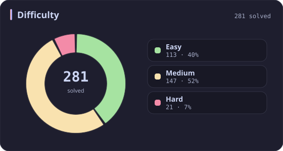
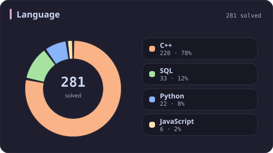
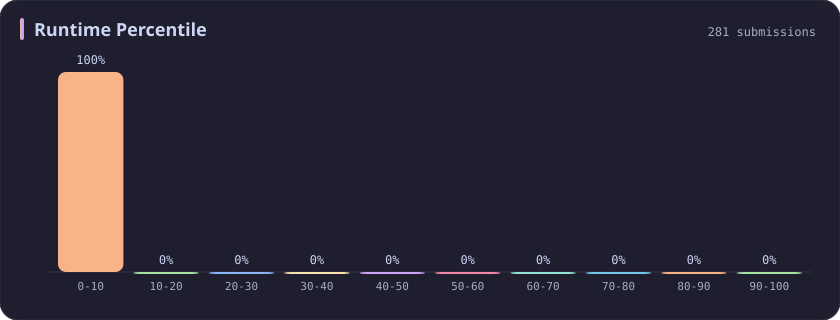
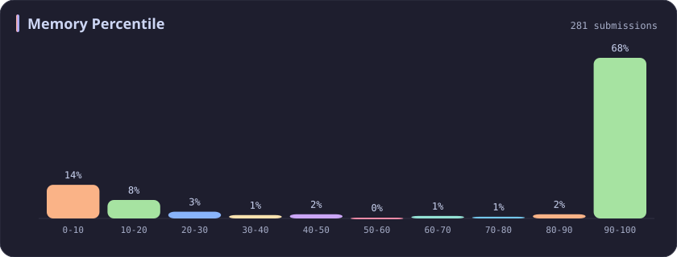

# Runtime 0-10% Stats

[All stats](../../README.md)

**281** problems · updated `2026-09-04 19:23 UTC`

## Stats

### Difficulty

### Language

### Runtime Percentile

| **0-10** | [10-20](10-20.md) | [20-30](20-30.md) | [30-40](30-40.md) | [40-50](40-50.md) | [50-60](50-60.md) | [60-70](60-70.md) | [70-80](70-80.md) | [80-90](80-90.md) | [90-100](90-100.md) |
| :---: | :---: | :---: | :---: | :---: | :---: | :---: | :---: | :---: | :---: |
| **281** | 51 | 36 | 45 | 31 | 22 | 21 | 19 | 26 | 198 |

### Memory Percentile

### Topics

---

## Recent Activity

Latest **100** accepted submissions.

| Date | Title | Difficulty | Lang | Runtime | Memory |
| :--- | :--- | :---: | :---: | ---: | ---: |
| 2026&#8209;08&#8209;19 | [1386. Cinema Seat Allocation](https://leetcode.com/problems/cinema-seat-allocation/) | Medium | C++ | 125 ms `9.88%` | 84.2 MB `20.70%` |
| 2026&#8209;05&#8209;23 | [3938. Maximum Path Intersection Sum in a Grid](https://leetcode.com/problems/maximum-path-intersection-sum-in-a-grid/) | Medium | C++ | 72 ms `9.23%` | 185.7 MB `5.00%` |
| 2026&#8209;05&#8209;23 | [2744. Find Maximum Number of String Pairs](https://leetcode.com/problems/find-maximum-number-of-string-pairs/) | Easy | Python | 15 ms `8.76%` | 19.3 MB `18.79%` |
| 2025&#8209;10&#8209;15 | [3350. Adjacent Increasing Subarrays Detection II](https://leetcode.com/problems/adjacent-increasing-subarrays-detection-ii/) | Medium | C++ | 282 ms `8.37%` | 219.4 MB `6.08%` |
| 2025&#8209;10&#8209;12 | [3713. Longest Balanced Substring I](https://leetcode.com/problems/longest-balanced-substring-i/) | Medium | C++ | 3030 ms `5.07%` | 498.4 MB `5.06%` |
| 2025&#8209;10&#8209;06 | [778. Swim in Rising Water](https://leetcode.com/problems/swim-in-rising-water/) | Hard | C++ | 34 ms `7.85%` | 17.1 MB `10.48%` |
| 2025&#8209;09&#8209;30 | [2221. Find Triangular Sum of an Array](https://leetcode.com/problems/find-triangular-sum-of-an-array/) | Medium | C++ | 431 ms `5.07%` | 384.5 MB `5.28%` |
| 2025&#8209;09&#8209;27 | [3690. Split and Merge Array Transformation](https://leetcode.com/problems/split-and-merge-array-transformation/) | Medium | C++ | 1672 ms `7.57%` | 432.5 MB `21.01%` |
| 2025&#8209;09&#8209;26 | [611. Valid Triangle Number](https://leetcode.com/problems/valid-triangle-number/) | Medium | C++ | 430 ms `8.62%` | 16.8 MB `10.43%` |
| 2025&#8209;09&#8209;16 | [2197. Replace Non-Coprime Numbers in Array](https://leetcode.com/problems/replace-non-coprime-numbers-in-array/) | Hard | C++ | 2138 ms `5.26%` | 306.9 MB `5.26%` |
| 2025&#8209;09&#8209;09 | [2327. Number of People Aware of a Secret](https://leetcode.com/problems/number-of-people-aware-of-a-secret/) | Medium | C++ | 34 ms `9.11%` | 9.1 MB `92.86%` |
| 2025&#8209;09&#8209;07 | [1304. Find N Unique Integers Sum up to Zero](https://leetcode.com/problems/find-n-unique-integers-sum-up-to-zero/) | Easy | Python | 3 ms `4.43%` | 17.9 MB `100.00%` |
| 2025&#8209;08&#8209;27 | [1181. Before and After Puzzle](https://leetcode.com/problems/before-and-after-puzzle/) | Medium | Python | 15 ms `5.56%` | 18.2 MB `100.00%` |
| 2025&#8209;06&#8209;04 | [3406. Find the Lexicographically Largest String From the Box II](https://leetcode.com/problems/find-the-lexicographically-largest-string-from-the-box-ii/) | Hard | C++ | 510 ms `0.00%` | 278 MB `0.00%` |
| 2025&#8209;05&#8209;20 | [3355. Zero Array Transformation I](https://leetcode.com/problems/zero-array-transformation-i/) | Medium | C++ | 220 ms `5.01%` | 298.2 MB `30.88%` |
| 2025&#8209;05&#8209;14 | [3337. Total Characters in String After Transformations II](https://leetcode.com/problems/total-characters-in-string-after-transformations-ii/) | Hard | C++ | 543 ms `9.64%` | 70.7 MB `42.17%` |
| 2025&#8209;05&#8209;12 | [708. Insert into a Sorted Circular Linked List](https://leetcode.com/problems/insert-into-a-sorted-circular-linked-list/) | Medium | C++ | 11 ms `8.16%` | 13.1 MB `96.60%` |
| 2025&#8209;05&#8209;11 | [227. Basic Calculator II](https://leetcode.com/problems/basic-calculator-ii/) | Medium | C++ | 38 ms `5.53%` | 38.6 MB `5.00%` |
| 2025&#8209;05&#8209;11 | [224. Basic Calculator](https://leetcode.com/problems/basic-calculator/) | Hard | C++ | 19 ms `7.01%` | 23.2 MB `5.06%` |
| 2025&#8209;05&#8209;10 | [3542. Minimum Operations to Convert All Elements to Zero](https://leetcode.com/problems/minimum-operations-to-convert-all-elements-to-zero/) | Medium | C++ | 1960 ms `5.13%` | 484.1 MB `5.40%` |
| 2025&#8209;05&#8209;04 | [531. Lonely Pixel I](https://leetcode.com/problems/lonely-pixel-i/) | Medium | Python | 32 ms `5.66%` | 22.9 MB `100.00%` |
| 2025&#8209;05&#8209;03 | [353. Design Snake Game](https://leetcode.com/problems/design-snake-game/) | Medium | C++ | 199 ms `5.48%` | 582.8 MB `19.86%` |
| 2025&#8209;05&#8209;03 | [1007. Minimum Domino Rotations For Equal Row](https://leetcode.com/problems/minimum-domino-rotations-for-equal-row/) | Medium | Python | 91 ms `9.86%` | 18.4 MB `100.00%` |
| 2025&#8209;04&#8209;27 | [3532. Path Existence Queries in a Graph I](https://leetcode.com/problems/path-existence-queries-in-a-graph-i/) | Medium | C++ | 482 ms `5.06%` | 327.8 MB `5.23%` |
| 2025&#8209;04&#8209;27 | [3529. Count Cells in Overlapping Horizontal and Vertical Substrings](https://leetcode.com/problems/count-cells-in-overlapping-horizontal-and-vertical-substrings/) | Medium | C++ | 2256 ms `5.71%` | 63.1 MB `95.71%` |
| 2025&#8209;04&#8209;26 | [499. The Maze III](https://leetcode.com/problems/the-maze-iii/) | Hard | C++ | 17 ms `6.78%` | 20.2 MB `5.08%` |
| 2025&#8209;04&#8209;23 | [875. Koko Eating Bananas](https://leetcode.com/problems/koko-eating-bananas/) | Medium | C++ | 19 ms `8.77%` | 23.1 MB `24.37%` |
| 2025&#8209;04&#8209;20 | [1926. Nearest Exit from Entrance in Maze](https://leetcode.com/problems/nearest-exit-from-entrance-in-maze/) | Medium | C++ | 139 ms `5.55%` | 69.5 MB `5.01%` |
| 2025&#8209;04&#8209;20 | [781. Rabbits in Forest](https://leetcode.com/problems/rabbits-in-forest/) | Medium | C++ | 4 ms `7.15%` | 12.3 MB `37.72%` |
| 2025&#8209;04&#8209;19 | [2095. Delete the Middle Node of a Linked List](https://leetcode.com/problems/delete-the-middle-node-of-a-linked-list/) | Medium | C++ | 19 ms `8.47%` | 342.5 MB `17.31%` |
| 2025&#8209;04&#8209;19 | [1004. Max Consecutive Ones III](https://leetcode.com/problems/max-consecutive-ones-iii/) | Medium | C++ | 11 ms `6.07%` | 65.6 MB `100.00%` |
| 2025&#8209;04&#8209;19 | [325. Maximum Size Subarray Sum Equals k](https://leetcode.com/problems/maximum-size-subarray-sum-equals-k/) | Medium | C++ | 353 ms `6.74%` | 122.8 MB `74.16%` |
| 2025&#8209;04&#8209;13 | [1922. Count Good Numbers](https://leetcode.com/problems/count-good-numbers/) | Medium | C++ | 2 ms `2.20%` | 7.8 MB `97.14%` |
| 2025&#8209;04&#8209;11 | [1431. Kids With the Greatest Number of Candies](https://leetcode.com/problems/kids-with-the-greatest-number-of-candies/) | Easy | C++ | 1 ms `3.25%` | 12.5 MB `60.06%` |
| 2025&#8209;04&#8209;11 | [1071. Greatest Common Divisor of Strings](https://leetcode.com/problems/greatest-common-divisor-of-strings/) | Easy | C++ | 19 ms `5.25%` | 46.6 MB `5.11%` |
| 2024&#8209;11&#8209;19 | [2461. Maximum Sum of Distinct Subarrays With Length K](https://leetcode.com/problems/maximum-sum-of-distinct-subarrays-with-length-k/) | Medium | C++ | 212 ms `8.96%` | 100.9 MB `13.48%` |
| 2024&#8209;11&#8209;17 | [862. Shortest Subarray with Sum at Least K](https://leetcode.com/problems/shortest-subarray-with-sum-at-least-k/) | Hard | C++ | 50 ms `9.43%` | 112.6 MB `5.17%` |
| 2024&#8209;11&#8209;16 | [3254. Find the Power of K-Size Subarrays I](https://leetcode.com/problems/find-the-power-of-k-size-subarrays-i/) | Medium | C++ | 11 ms `5.84%` | 33.7 MB `100.00%` |
| 2024&#8209;11&#8209;05 | [2914. Minimum Number of Changes to Make Binary String Beautiful](https://leetcode.com/problems/minimum-number-of-changes-to-make-binary-string-beautiful/) | Medium | C++ | 9 ms `5.33%` | 16.9 MB `11.93%` |
| 2024&#8209;11&#8209;03 | [796. Rotate String](https://leetcode.com/problems/rotate-string/) | Easy | C++ | 2 ms `8.59%` | 8.6 MB `6.12%` |
| 2024&#8209;10&#8209;27 | [1277. Count Square Submatrices with All Ones](https://leetcode.com/problems/count-square-submatrices-with-all-ones/) | Medium | C++ | 1039 ms `5.05%` | 26.5 MB `100.00%` |
| 2024&#8209;10&#8209;21 | [1593. Split a String Into the Max Number of Unique Substrings](https://leetcode.com/problems/split-a-string-into-the-max-number-of-unique-substrings/) | Medium | Python | 1706 ms `5.01%` | 29.9 MB `8.46%` |
| 2024&#8209;10&#8209;20 | [846. Hand of Straights](https://leetcode.com/problems/hand-of-straights/) | Medium | C++ | 57 ms `7.27%` | 32.2 MB `63.49%` |
| 2024&#8209;10&#8209;20 | [3110. Score of a String](https://leetcode.com/problems/score-of-a-string/) | Easy | C++ | 2 ms `7.95%` | 8.3 MB `100.00%` |
| 2024&#8209;04&#8209;23 | [310. Minimum Height Trees](https://leetcode.com/problems/minimum-height-trees/) | Medium | C++ | 1508 ms `5.02%` | 436.1 MB `5.04%` |
| 2024&#8209;04&#8209;22 | [752. Open the Lock](https://leetcode.com/problems/open-the-lock/) | Medium | C++ | 837 ms `5.02%` | 38.2 MB `86.83%` |
| 2024&#8209;04&#8209;20 | [1992. Find All Groups of Farmland](https://leetcode.com/problems/find-all-groups-of-farmland/) | Medium | C++ | 510 ms `7.61%` | 106.4 MB `31.99%` |
| 2024&#8209;04&#8209;18 | [463. Island Perimeter](https://leetcode.com/problems/island-perimeter/) | Easy | C++ | 78 ms `5.13%` | 104.4 MB `25.27%` |
| 2024&#8209;04&#8209;17 | [988. Smallest String Starting From Leaf](https://leetcode.com/problems/smallest-string-starting-from-leaf/) | Medium | C++ | 10 ms `6.63%` | 20.4 MB `100.00%` |
| 2024&#8209;04&#8209;17 | [623. Add One Row to Tree](https://leetcode.com/problems/add-one-row-to-tree/) | Medium | C++ | 8 ms `0.27%` | 24.3 MB `99.93%` |
| 2024&#8209;04&#8209;13 | [85. Maximal Rectangle](https://leetcode.com/problems/maximal-rectangle/) | Hard | Python | 1343 ms `6.67%` | 24.6 MB `50.77%` |
| 2024&#8209;04&#8209;12 | [42. Trapping Rain Water](https://leetcode.com/problems/trapping-rain-water/) | Hard | C++ | 13 ms `4.64%` | 22.2 MB `100.00%` |
| 2024&#8209;04&#8209;11 | [402. Remove K Digits](https://leetcode.com/problems/remove-k-digits/) | Medium | Python | 63 ms `5.34%` | 18.1 MB `100.00%` |
| 2024&#8209;04&#8209;07 | [678. Valid Parenthesis String](https://leetcode.com/problems/valid-parenthesis-string/) | Medium | C++ | 3 ms `9.38%` | 7.2 MB `100.00%` |
| 2024&#8209;04&#8209;06 | [1249. Minimum Remove to Make Valid Parentheses](https://leetcode.com/problems/minimum-remove-to-make-valid-parentheses/) | Medium | C++ | 17 ms `9.28%` | 15.1 MB `17.08%` |
| 2024&#8209;04&#8209;05 | [1544. Make The String Great](https://leetcode.com/problems/make-the-string-great/) | Easy | C++ | 8 ms `1.08%` | 11.4 MB `6.07%` |
| 2024&#8209;04&#8209;04 | [1614. Maximum Nesting Depth of the Parentheses](https://leetcode.com/problems/maximum-nesting-depth-of-the-parentheses/) | Easy | C++ | 4 ms `0.11%` | 8.1 MB `99.14%` |
| 2024&#8209;04&#8209;02 | [205. Isomorphic Strings](https://leetcode.com/problems/isomorphic-strings/) | Easy | C++ | 8 ms `6.43%` | 9.4 MB `30.13%` |
| 2024&#8209;04&#8209;01 | [58. Length of Last Word](https://leetcode.com/problems/length-of-last-word/) | Easy | Python | 37 ms `0.22%` | 16.7 MB `100.00%` |
| 2024&#8209;03&#8209;30 | [3096. Minimum Levels to Gain More Points](https://leetcode.com/problems/minimum-levels-to-gain-more-points/) | Medium | C++ | 221 ms `6.38%` | 291.7 MB `8.08%` |
| 2024&#8209;03&#8209;30 | [3095. Shortest Subarray With OR at Least K I](https://leetcode.com/problems/shortest-subarray-with-or-at-least-k-i/) | Easy | C++ | 4 ms `6.28%` | 26 MB `100.00%` |
| 2024&#8209;03&#8209;30 | [3092. Most Frequent IDs](https://leetcode.com/problems/most-frequent-ids/) | Medium | C++ | 474 ms `7.78%` | 157 MB `100.00%` |
| 2024&#8209;03&#8209;30 | [3090. Maximum Length Substring With Two Occurrences](https://leetcode.com/problems/maximum-length-substring-with-two-occurrences/) | Easy | C++ | 52 ms `5.17%` | 8 MB `100.00%` |
| 2024&#8209;03&#8209;30 | [992. Subarrays with K Different Integers](https://leetcode.com/problems/subarrays-with-k-different-integers/) | Hard | C++ | 1061 ms `5.69%` | 46.9 MB `95.70%` |
| 2024&#8209;03&#8209;28 | [2958. Length of Longest Subarray With at Most K Frequency](https://leetcode.com/problems/length-of-longest-subarray-with-at-most-k-frequency/) | Medium | C++ | 361 ms `5.11%` | 148.6 MB `99.25%` |
| 2024&#8209;03&#8209;27 | [713. Subarray Product Less Than K](https://leetcode.com/problems/subarray-product-less-than-k/) | Medium | C++ | 62 ms `9.64%` | 63.8 MB `5.29%` |
| 2024&#8209;03&#8209;24 | [1570. Dot Product of Two Sparse Vectors](https://leetcode.com/problems/dot-product-of-two-sparse-vectors/) | Medium | C++ | 162 ms `9.76%` | 175.2 MB `21.95%` |
| 2024&#8209;03&#8209;24 | [645. Set Mismatch](https://leetcode.com/problems/set-mismatch/) | Easy | C++ | 69 ms `8.82%` | 35.3 MB `6.03%` |
| 2024&#8209;03&#8209;24 | [287. Find the Duplicate Number](https://leetcode.com/problems/find-the-duplicate-number/) | Medium | C++ | 216 ms `5.28%` | 88.1 MB `9.66%` |
| 2024&#8209;03&#8209;23 | [111. Minimum Depth of Binary Tree](https://leetcode.com/problems/minimum-depth-of-binary-tree/) | Easy | C++ | 187 ms `5.21%` | 145 MB `99.96%` |
| 2024&#8209;03&#8209;23 | [107. Binary Tree Level Order Traversal II](https://leetcode.com/problems/binary-tree-level-order-traversal-ii/) | Medium | C++ | 4 ms `6.61%` | 13.8 MB `99.96%` |
| 2024&#8209;03&#8209;23 | [523. Continuous Subarray Sum](https://leetcode.com/problems/continuous-subarray-sum/) | Medium | C++ | 268 ms `5.32%` | 147.1 MB `17.99%` |
| 2024&#8209;03&#8209;23 | [515. Find Largest Value in Each Tree Row](https://leetcode.com/problems/find-largest-value-in-each-tree-row/) | Medium | C++ | 12 ms `1.76%` | 20.9 MB `99.88%` |
| 2024&#8209;03&#8209;23 | [148. Sort List](https://leetcode.com/problems/sort-list/) | Medium | C++ | 124 ms `5.01%` | 58.8 MB `49.20%` |
| 2024&#8209;03&#8209;23 | [207. Course Schedule](https://leetcode.com/problems/course-schedule/) | Medium | C++ | 18 ms `7.53%` | 17.5 MB `99.95%` |
| 2024&#8209;03&#8209;23 | [24. Swap Nodes in Pairs](https://leetcode.com/problems/swap-nodes-in-pairs/) | Medium | C++ | 3 ms `0.42%` | 9.4 MB `100.00%` |
| 2024&#8209;03&#8209;23 | [18. 4Sum](https://leetcode.com/problems/4sum/) | Medium | C++ | 336 ms `5.01%` | 81.5 MB `5.13%` |
| 2024&#8209;03&#8209;23 | [143. Reorder List](https://leetcode.com/problems/reorder-list/) | Medium | C++ | 31 ms `5.08%` | 22.4 MB `99.97%` |
| 2024&#8209;03&#8209;22 | [234. Palindrome Linked List](https://leetcode.com/problems/palindrome-linked-list/) | Easy | C++ | 173 ms `5.13%` | 130.7 MB `18.01%` |
| 2024&#8209;01&#8209;18 | [9. Palindrome Number](https://leetcode.com/problems/palindrome-number/) | Easy | C++ | 8 ms `8.99%` | 6.3 MB `100.00%` |
| 2023&#8209;10&#8209;09 | [34. Find First and Last Position of Element in Sorted Array](https://leetcode.com/problems/find-first-and-last-position-of-element-in-sorted-array/) | Medium | C++ | 10 ms `0.11%` | 13.9 MB `100.00%` |
| 2023&#8209;10&#8209;04 | [706. Design HashMap](https://leetcode.com/problems/design-hashmap/) | Easy | C++ | 113 ms `7.27%` | 53.5 MB `100.00%` |
| 2023&#8209;10&#8209;03 | [1512. Number of Good Pairs](https://leetcode.com/problems/number-of-good-pairs/) | Easy | C++ | 3 ms `2.39%` | 7.5 MB `100.00%` |
| 2023&#8209;10&#8209;02 | [2038. Remove Colored Pieces if Both Neighbors are the Same Color](https://leetcode.com/problems/remove-colored-pieces-if-both-neighbors-are-the-same-color/) | Medium | Python | 205 ms `9.43%` | 19.9 MB `85.28%` |
| 2023&#8209;10&#8209;01 | [2623. Memoize](https://leetcode.com/problems/memoize/) | Medium | JavaScript | 405 ms `5.08%` | 106.4 MB `5.24%` |
| 2023&#8209;10&#8209;01 | [2666. Allow One Function Call](https://leetcode.com/problems/allow-one-function-call/) | Easy | JavaScript | 53 ms `9.76%` | 42 MB `100.00%` |
| 2023&#8209;10&#8209;01 | [2703. Return Length of Arguments Passed](https://leetcode.com/problems/return-length-of-arguments-passed/) | Easy | JavaScript | 55 ms `5.98%` | 41.8 MB `100.00%` |
| 2023&#8209;10&#8209;01 | [2626. Array Reduce Transformation](https://leetcode.com/problems/array-reduce-transformation/) | Easy | JavaScript | 61 ms `5.87%` | 41.8 MB `100.00%` |
| 2023&#8209;10&#8209;01 | [2665. Counter II](https://leetcode.com/problems/counter-ii/) | Easy | JavaScript | 73 ms `5.64%` | 43.8 MB `100.00%` |
| 2023&#8209;10&#8209;01 | [2667. Create Hello World Function](https://leetcode.com/problems/create-hello-world-function/) | Easy | JavaScript | 52 ms `8.40%` | 42.1 MB `100.00%` |
| 2023&#8209;10&#8209;01 | [185. Department Top Three Salaries](https://leetcode.com/problems/department-top-three-salaries/) | Hard | Python | 745 ms `5.52%` | 62.8 MB `100.00%` |
| 2023&#8209;10&#8209;01 | [1804. Implement Trie II (Prefix Tree)](https://leetcode.com/problems/implement-trie-ii-prefix-tree/) | Medium | C++ | 158 ms `5.26%` | 60.6 MB `100.00%` |
| 2023&#8209;09&#8209;30 | [180. Consecutive Numbers](https://leetcode.com/problems/consecutive-numbers/) | Medium | Python | 897 ms `5.05%` | 60.6 MB `100.00%` |
| 2023&#8209;09&#8209;30 | [456. 132 Pattern](https://leetcode.com/problems/132-pattern/) | Medium | C++ | 71 ms `6.97%` | 49.1 MB `100.00%` |
| 2023&#8209;04&#8209;15 | [2218. Maximum Value of K Coins From Piles](https://leetcode.com/problems/maximum-value-of-k-coins-from-piles/) | Hard | C++ | 615 ms `5.04%` | 18 MB `93.82%` |
| 2023&#8209;04&#8209;15 | [2640. Find the Score of All Prefixes of an Array](https://leetcode.com/problems/find-the-score-of-all-prefixes-of-an-array/) | Medium | C++ | 146 ms `5.37%` | 58.9 MB `98.88%` |
| 2023&#8209;04&#8209;15 | [2639. Find the Width of Columns of a Grid](https://leetcode.com/problems/find-the-width-of-columns-of-a-grid/) | Easy | C++ | 28 ms `6.07%` | 10.2 MB `100.00%` |
| 2023&#8209;04&#8209;13 | [946. Validate Stack Sequences](https://leetcode.com/problems/validate-stack-sequences/) | Medium | C++ | 14 ms `1.96%` | 15.5 MB `100.00%` |
| 2023&#8209;04&#8209;12 | [71. Simplify Path](https://leetcode.com/problems/simplify-path/) | Medium | Python | 37 ms `5.67%` | 13.7 MB `100.00%` |
| 2023&#8209;04&#8209;09 | [2615. Sum of Distances](https://leetcode.com/problems/sum-of-distances/) | Medium | C++ | 414 ms `5.00%` | 139.5 MB `7.50%` |
