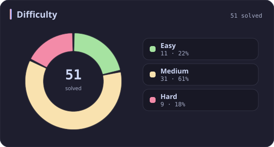
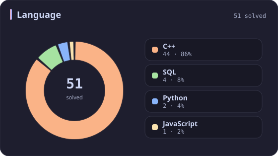
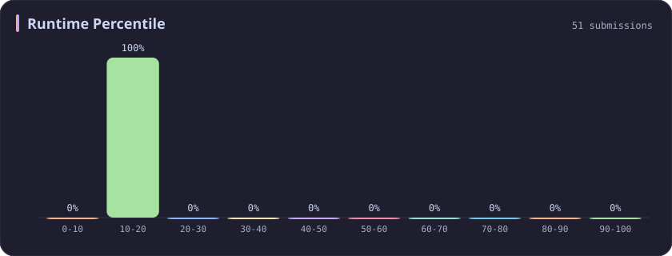
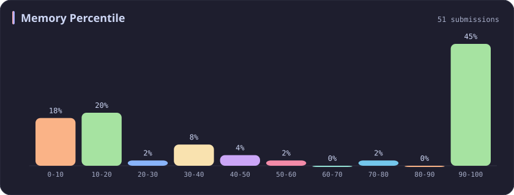
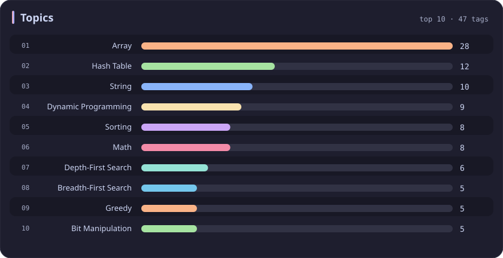

# Runtime 10-20% Stats

[All stats](../../README.md)

**51** problems · updated `2026-09-05 03:41 UTC+8`

## Stats

### Difficulty

### Language

### Runtime Percentile

| [0-10](0-10.md) | **10-20** | [20-30](20-30.md) | [30-40](30-40.md) | [40-50](40-50.md) | [50-60](50-60.md) | [60-70](60-70.md) | [70-80](70-80.md) | [80-90](80-90.md) | [90-100](90-100.md) |
| :---: | :---: | :---: | :---: | :---: | :---: | :---: | :---: | :---: | :---: |
| 281 | **51** | 36 | 45 | 31 | 22 | 21 | 19 | 26 | 199 |

### Memory Percentile

### Topics

---

## Recent Activity

Latest **51** accepted submissions.

| Date | Title | Difficulty | Lang | Runtime | Memory |
| :--- | :--- | :---: | :---: | ---: | ---: |
| 2026&#8209;08&#8209;18 | [877. Stone Game](https://leetcode.com/problems/stone-game/) | Medium | C++ | 12 ms `17.70%` | 19.8 MB `7.31%` |
| 2026&#8209;05&#8209;24 | [3942. Minimum Operations to Sort a Permutation](https://leetcode.com/problems/minimum-operations-to-sort-a-permutation/) | Medium | C++ | 15 ms `10.97%` | 156.1 MB `8.67%` |
| 2026&#8209;05&#8209;21 | [3043. Find the Length of the Longest Common Prefix](https://leetcode.com/problems/find-the-length-of-the-longest-common-prefix/) | Medium | C++ | 374 ms `18.26%` | 156.5 MB `52.60%` |
| 2026&#8209;02&#8209;08 | [1653. Minimum Deletions to Make String Balanced](https://leetcode.com/problems/minimum-deletions-to-make-string-balanced/) | Medium | C++ | 51 ms `18.43%` | 55.1 MB `19.34%` |
| 2025&#8209;10&#8209;16 | [2598. Smallest Missing Non-negative Integer After Operations](https://leetcode.com/problems/smallest-missing-non-negative-integer-after-operations/) | Medium | C++ | 169 ms `13.05%` | 138.6 MB `45.43%` |
| 2025&#8209;10&#8209;09 | [3494. Find the Minimum Amount of Time to Brew Potions](https://leetcode.com/problems/find-the-minimum-amount-of-time-to-brew-potions/) | Medium | C++ | 575 ms `18.46%` | 407.4 MB `15.38%` |
| 2025&#8209;09&#8209;29 | [1039. Minimum Score Triangulation of Polygon](https://leetcode.com/problems/minimum-score-triangulation-of-polygon/) | Medium | C++ | 5 ms `10.47%` | 11.4 MB `15.89%` |
| 2025&#8209;09&#8209;27 | [3689. Maximum Total Subarray Value I](https://leetcode.com/problems/maximum-total-subarray-value-i/) | Medium | C++ | 5 ms `15.46%` | 103.6 MB `97.34%` |
| 2025&#8209;09&#8209;26 | [1152. Analyze User Website Visit Pattern](https://leetcode.com/problems/analyze-user-website-visit-pattern/) | Medium | C++ | 55 ms `19.05%` | 26.6 MB `42.86%` |
| 2025&#8209;09&#8209;03 | [3027. Find the Number of Ways to Place People II](https://leetcode.com/problems/find-the-number-of-ways-to-place-people-ii/) | Hard | C++ | 221 ms `15.38%` | 47.6 MB `5.77%` |
| 2025&#8209;08&#8209;26 | [3000. Maximum Area of Longest Diagonal Rectangle](https://leetcode.com/problems/maximum-area-of-longest-diagonal-rectangle/) | Easy | C++ | 1 ms `15.78%` | 29.8 MB `13.11%` |
| 2025&#8209;06&#8209;18 | [2966. Divide Array Into Arrays With Max Difference](https://leetcode.com/problems/divide-array-into-arrays-with-max-difference/) | Medium | C++ | 115 ms `13.42%` | 126.1 MB `18.08%` |
| 2025&#8209;05&#8209;31 | [2359. Find Closest Node to Given Two Nodes](https://leetcode.com/problems/find-closest-node-to-given-two-nodes/) | Medium | C++ | 162 ms `13.13%` | 162.6 MB `10.77%` |
| 2025&#8209;05&#8209;29 | [3068. Find the Maximum Sum of Node Values](https://leetcode.com/problems/find-the-maximum-sum-of-node-values/) | Hard | C++ | 111 ms `11.83%` | 158 MB `11.26%` |
| 2025&#8209;05&#8209;04 | [3536. Maximum Product of Two Digits](https://leetcode.com/problems/maximum-product-of-two-digits/) | Easy | C++ | 3 ms `10.81%` | 8.9 MB `31.83%` |
| 2025&#8209;04&#8209;27 | [3531. Count Covered Buildings](https://leetcode.com/problems/count-covered-buildings/) | Medium | C++ | 894 ms `10.51%` | 451.1 MB `10.05%` |
| 2025&#8209;04&#8209;24 | [216. Combination Sum III](https://leetcode.com/problems/combination-sum-iii/) | Medium | Python | 3 ms `19.31%` | 18 MB `100.00%` |
| 2025&#8209;04&#8209;24 | [302. Smallest Rectangle Enclosing Black Pixels](https://leetcode.com/problems/smallest-rectangle-enclosing-black-pixels/) | Hard | C++ | 8 ms `13.11%` | 23.9 MB `13.11%` |
| 2025&#8209;04&#8209;21 | [2336. Smallest Number in Infinite Set](https://leetcode.com/problems/smallest-number-in-infinite-set/) | Medium | C++ | 33 ms `14.17%` | 54.3 MB `9.29%` |
| 2025&#8209;04&#8209;21 | [841. Keys and Rooms](https://leetcode.com/problems/keys-and-rooms/) | Medium | C++ | 3 ms `14.63%` | 14.7 MB `37.21%` |
| 2025&#8209;04&#8209;20 | [649. Dota2 Senate](https://leetcode.com/problems/dota2-senate/) | Medium | C++ | 7 ms `17.56%` | 12.6 MB `7.47%` |
| 2025&#8209;04&#8209;20 | [1493. Longest Subarray of 1's After Deleting One Element](https://leetcode.com/problems/longest-subarray-of-1s-after-deleting-one-element/) | Medium | C++ | 4 ms `15.22%` | 62.3 MB `13.21%` |
| 2025&#8209;04&#8209;11 | [2843.   Count Symmetric Integers](https://leetcode.com/problems/count-symmetric-integers/) | Easy | C++ | 77 ms `18.11%` | 10.5 MB `8.76%` |
| 2024&#8209;11&#8209;07 | [2275. Largest Combination With Bitwise AND Greater Than Zero](https://leetcode.com/problems/largest-combination-with-bitwise-and-greater-than-zero/) | Medium | C++ | 43 ms `19.26%` | 60.2 MB `100.00%` |
| 2024&#8209;11&#8209;04 | [2955. Number of Same-End Substrings](https://leetcode.com/problems/number-of-same-end-substrings/) | Medium | C++ | 238 ms `15.38%` | 230.3 MB `7.69%` |
| 2024&#8209;10&#8209;23 | [2641. Cousins in Binary Tree II](https://leetcode.com/problems/cousins-in-binary-tree-ii/) | Medium | C++ | 157 ms `16.02%` | 392.9 MB `8.35%` |
| 2024&#8209;10&#8209;20 | [1442. Count Triplets That Can Form Two Arrays of Equal XOR](https://leetcode.com/problems/count-triplets-that-can-form-two-arrays-of-equal-xor/) | Medium | C++ | 20 ms `17.46%` | 9.6 MB `100.00%` |
| 2024&#8209;10&#8209;19 | [1545. Find Kth Bit in Nth Binary String](https://leetcode.com/problems/find-kth-bit-in-nth-binary-string/) | Medium | C++ | 86 ms `11.17%` | 46.1 MB `31.53%` |
| 2024&#8209;04&#8209;21 | [1971. Find if Path Exists in Graph](https://leetcode.com/problems/find-if-path-exists-in-graph/) | Easy | C++ | 469 ms `17.31%` | 202.6 MB `99.88%` |
| 2024&#8209;03&#8209;26 | [10. Regular Expression Matching](https://leetcode.com/problems/regular-expression-matching/) | Hard | C++ | 39 ms `10.93%` | 23.9 MB `5.07%` |
| 2024&#8209;03&#8209;26 | [41. First Missing Positive](https://leetcode.com/problems/first-missing-positive/) | Hard | C++ | 43 ms `17.11%` | 46.5 MB `99.96%` |
| 2024&#8209;03&#8209;24 | [204. Count Primes](https://leetcode.com/problems/count-primes/) | Medium | C++ | 658 ms `12.86%` | 11.5 MB `99.23%` |
| 2024&#8209;03&#8209;23 | [16. 3Sum Closest](https://leetcode.com/problems/3sum-closest/) | Medium | C++ | 18 ms `14.57%` | 12.9 MB `100.00%` |
| 2023&#8209;10&#8209;06 | [343. Integer Break](https://leetcode.com/problems/integer-break/) | Medium | C++ | 2 ms `13.60%` | 6.2 MB `100.00%` |
| 2023&#8209;10&#8209;01 | [2629. Function Composition](https://leetcode.com/problems/function-composition/) | Easy | JavaScript | 63 ms `16.45%` | 43.6 MB `100.00%` |
| 2023&#8209;10&#8209;01 | [557. Reverse Words in a String III](https://leetcode.com/problems/reverse-words-in-a-string-iii/) | Easy | C++ | 10 ms `11.82%` | 10 MB `100.00%` |
| 2023&#8209;04&#8209;15 | [2642. Design Graph With Shortest Path Calculator](https://leetcode.com/problems/design-graph-with-shortest-path-calculator/) | Hard | C++ | 220 ms `11.24%` | 78.1 MB `73.94%` |
| 2023&#8209;03&#8209;21 | [429. N-ary Tree Level Order Traversal](https://leetcode.com/problems/n-ary-tree-level-order-traversal/) | Medium | C++ | 27 ms `13.57%` | 12.2 MB `100.00%` |
| 2023&#8209;03&#8209;20 | [118. Pascal's Triangle](https://leetcode.com/problems/pascals-triangle/) | Easy | C++ | 2 ms `15.08%` | 6.9 MB `100.00%` |
| 2023&#8209;03&#8209;12 | [23. Merge k Sorted Lists](https://leetcode.com/problems/merge-k-sorted-lists/) | Hard | C++ | 30 ms `15.41%` | 13.9 MB `99.99%` |
| 2023&#8209;03&#8209;11 | [303. Range Sum Query - Immutable](https://leetcode.com/problems/range-sum-query-immutable/) | Easy | C++ | 29 ms `14.62%` | 17.1 MB `100.00%` |
| 2023&#8209;03&#8209;10 | [1356. Sort Integers by The Number of 1 Bits](https://leetcode.com/problems/sort-integers-by-the-number-of-1-bits/) | Easy | C++ | 10 ms `10.81%` | 10 MB `100.00%` |
| 2023&#8209;03&#8209;09 | [197. Rising Temperature](https://leetcode.com/problems/rising-temperature/) | Easy | SQL | 685 ms `11.20%` | 0.0B `100.00%` |
| 2023&#8209;03&#8209;04 | [2581. Count Number of Possible Root Nodes](https://leetcode.com/problems/count-number-of-possible-root-nodes/) | Hard | C++ | 701 ms `18.68%` | 247.9 MB `22.18%` |
| 2023&#8209;02&#8209;22 | [39. Combination Sum](https://leetcode.com/problems/combination-sum/) | Medium | C++ | 37 ms `12.78%` | 15.4 MB `30.14%` |
| 2023&#8209;02&#8209;20 | [2186. Minimum Number of Steps to Make Two Strings Anagram II](https://leetcode.com/problems/minimum-number-of-steps-to-make-two-strings-anagram-ii/) | Medium | C++ | 105 ms `10.92%` | 28.9 MB `99.03%` |
| 2023&#8209;02&#8209;20 | [2546. Apply Bitwise Operations to Make Strings Equal](https://leetcode.com/problems/apply-bitwise-operations-to-make-strings-equal/) | Medium | Python | 37 ms `10.53%` | 15 MB `100.00%` |
| 2023&#8209;02&#8209;17 | [51. N-Queens](https://leetcode.com/problems/n-queens/) | Hard | C++ | 7 ms `16.31%` | 8.4 MB `100.00%` |
| 2023&#8209;02&#8209;16 | [184. Department Highest Salary](https://leetcode.com/problems/department-highest-salary/) | Medium | SQL | 1233 ms `12.08%` | 0.0B `100.00%` |
| 2023&#8209;02&#8209;16 | [181. Employees Earning More Than Their Managers](https://leetcode.com/problems/employees-earning-more-than-their-managers/) | Easy | SQL | 682 ms `11.60%` | 0.0B `100.00%` |
| 2023&#8209;02&#8209;16 | [178. Rank Scores](https://leetcode.com/problems/rank-scores/) | Medium | SQL | 551 ms `13.85%` | 0.0B `100.00%` |
