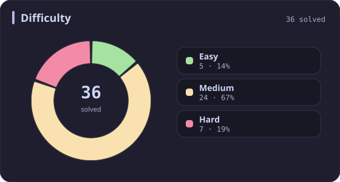
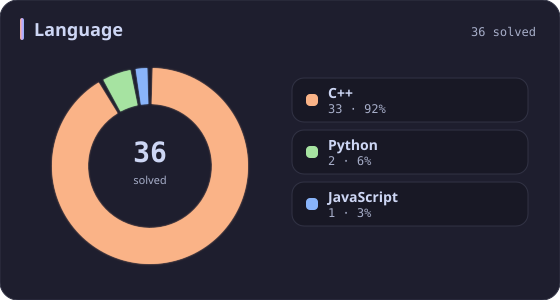
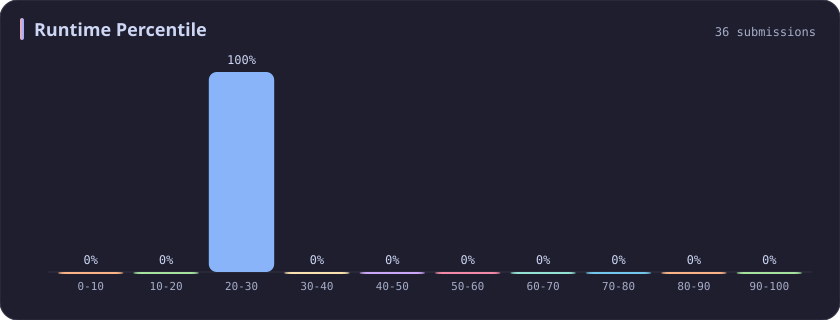
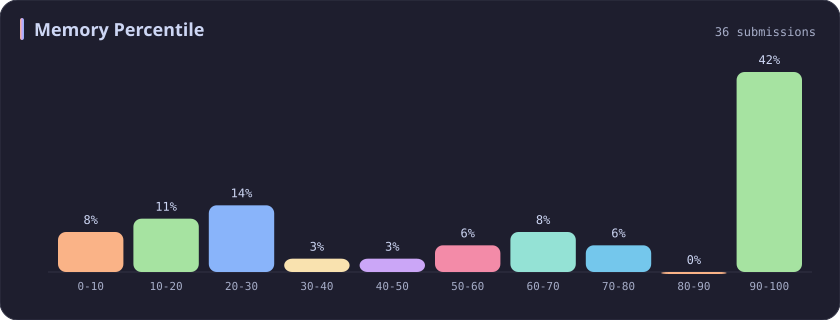

# Runtime 20-30% Stats

[All stats](../../README.md)

**36** problems · updated `2026-09-05 03:41 UTC+8`

## Stats

### Difficulty

### Language

### Runtime Percentile

| [0-10](0-10.md) | [10-20](10-20.md) | **20-30** | [30-40](30-40.md) | [40-50](40-50.md) | [50-60](50-60.md) | [60-70](60-70.md) | [70-80](70-80.md) | [80-90](80-90.md) | [90-100](90-100.md) |
| :---: | :---: | :---: | :---: | :---: | :---: | :---: | :---: | :---: | :---: |
| 281 | 51 | **36** | 45 | 31 | 22 | 21 | 19 | 26 | 199 |

### Memory Percentile

### Topics

---

## Recent Activity

Latest **36** accepted submissions.

| Date | Title | Difficulty | Lang | Runtime | Memory |
| :--- | :--- | :---: | :---: | ---: | ---: |
| 2026&#8209;05&#8209;20 | [2061. Number of Spaces Cleaning Robot Cleaned](https://leetcode.com/problems/number-of-spaces-cleaning-robot-cleaned/) | Medium | C++ | 65 ms `26.67%` | 54 MB `26.67%` |
| 2026&#8209;02&#8209;09 | [1382. Balance a Binary Search Tree](https://leetcode.com/problems/balance-a-binary-search-tree/) | Medium | C++ | 22 ms `20.32%` | 65.6 MB `66.43%` |
| 2025&#8209;10&#8209;12 | [3715. Sum of Perfect Square Ancestors](https://leetcode.com/problems/sum-of-perfect-square-ancestors/) | Hard | C++ | 1461 ms `21.09%` | 383.2 MB `25.85%` |
| 2025&#8209;10&#8209;11 | [3707. Equal Score Substrings](https://leetcode.com/problems/equal-score-substrings/) | Easy | C++ | 3 ms `23.55%` | 8.6 MB `44.95%` |
| 2025&#8209;10&#8209;07 | [1488. Avoid Flood in The City](https://leetcode.com/problems/avoid-flood-in-the-city/) | Medium | C++ | 216 ms `21.79%` | 121.2 MB `100.00%` |
| 2025&#8209;09&#8209;28 | [976. Largest Perimeter Triangle](https://leetcode.com/problems/largest-perimeter-triangle/) | Easy | C++ | 12 ms `25.68%` | 25.6 MB `79.00%` |
| 2025&#8209;09&#8209;02 | [3025. Find the Number of Ways to Place People I](https://leetcode.com/problems/find-the-number-of-ways-to-place-people-i/) | Medium | C++ | 19 ms `25.00%` | 32.7 MB `28.24%` |
| 2025&#8209;06&#8209;06 | [2434. Using a Robot to Print the Lexicographically Smallest String](https://leetcode.com/problems/using-a-robot-to-print-the-lexicographically-smallest-string/) | Medium | C++ | 67 ms `26.26%` | 51.4 MB `5.20%` |
| 2025&#8209;06&#8209;02 | [135. Candy](https://leetcode.com/problems/candy/) | Hard | C++ | 4 ms `28.57%` | 22.9 MB `69.10%` |
| 2025&#8209;05&#8209;29 | [3373. Maximize the Number of Target Nodes After Connecting Trees II](https://leetcode.com/problems/maximize-the-number-of-target-nodes-after-connecting-trees-ii/) | Hard | C++ | 457 ms `27.98%` | 387.2 MB `21.76%` |
| 2025&#8209;05&#8209;11 | [484. Find Permutation](https://leetcode.com/problems/find-permutation/) | Medium | C++ | 3 ms `29.79%` | 14.4 MB `14.89%` |
| 2025&#8209;04&#8209;26 | [3527. Find the Most Common Response](https://leetcode.com/problems/find-the-most-common-response/) | Medium | C++ | 1472 ms `24.07%` | 479.3 MB `51.50%` |
| 2025&#8209;04&#8209;26 | [161. One Edit Distance](https://leetcode.com/problems/one-edit-distance/) | Medium | Python | 3 ms `26.80%` | 17.7 MB `100.00%` |
| 2025&#8209;04&#8209;24 | [901. Online Stock Span](https://leetcode.com/problems/online-stock-span/) | Medium | C++ | 43 ms `21.61%` | 95.1 MB `28.25%` |
| 2025&#8209;04&#8209;24 | [72. Edit Distance](https://leetcode.com/problems/edit-distance/) | Medium | C++ | 11 ms `28.88%` | 13.1 MB `74.14%` |
| 2025&#8209;04&#8209;24 | [2462. Total Cost to Hire K Workers](https://leetcode.com/problems/total-cost-to-hire-k-workers/) | Medium | C++ | 56 ms `23.98%` | 79.8 MB `18.79%` |
| 2025&#8209;04&#8209;20 | [399. Evaluate Division](https://leetcode.com/problems/evaluate-division/) | Medium | C++ | 2 ms `22.06%` | 12 MB `60.01%` |
| 2025&#8209;04&#8209;20 | [1161. Maximum Level Sum of a Binary Tree](https://leetcode.com/problems/maximum-level-sum-of-a-binary-tree/) | Medium | C++ | 8 ms `21.91%` | 115.7 MB `5.42%` |
| 2025&#8209;04&#8209;20 | [394. Decode String](https://leetcode.com/problems/decode-string/) | Medium | C++ | 1 ms `29.13%` | 9.7 MB `10.91%` |
| 2024&#8209;11&#8209;21 | [2516. Take K of Each Character From Left and Right](https://leetcode.com/problems/take-k-of-each-character-from-left-and-right/) | Medium | C++ | 21 ms `29.47%` | 11.9 MB `100.00%` |
| 2024&#8209;11&#8209;08 | [1829. Maximum XOR for Each Query](https://leetcode.com/problems/maximum-xor-for-each-query/) | Medium | C++ | 12 ms `20.47%` | 99.6 MB `58.04%` |
| 2024&#8209;10&#8209;27 | [2458. Height of Binary Tree After Subtree Removal Queries](https://leetcode.com/problems/height-of-binary-tree-after-subtree-removal-queries/) | Hard | C++ | 339 ms `28.83%` | 312.8 MB `34.69%` |
| 2024&#8209;10&#8209;20 | [648. Replace Words](https://leetcode.com/problems/replace-words/) | Medium | Python | 136 ms `24.51%` | 26.7 MB `100.00%` |
| 2024&#8209;10&#8209;20 | [2486. Append Characters to String to Make Subsequence](https://leetcode.com/problems/append-characters-to-string-to-make-subsequence/) | Medium | C++ | 4 ms `21.75%` | 12.2 MB `99.78%` |
| 2024&#8209;10&#8209;20 | [1106. Parsing A Boolean Expression](https://leetcode.com/problems/parsing-a-boolean-expression/) | Hard | C++ | 9 ms `21.74%` | 13.3 MB `9.84%` |
| 2024&#8209;04&#8209;09 | [2073. Time Needed to Buy Tickets](https://leetcode.com/problems/time-needed-to-buy-tickets/) | Easy | C++ | 2 ms `24.65%` | 9.4 MB `100.00%` |
| 2024&#8209;03&#8209;24 | [113. Path Sum II](https://leetcode.com/problems/path-sum-ii/) | Medium | C++ | 8 ms `27.27%` | 18.8 MB `99.98%` |
| 2023&#8209;10&#8209;06 | [229. Majority Element II](https://leetcode.com/problems/majority-element-ii/) | Medium | C++ | 8 ms `29.21%` | 16.3 MB `100.00%` |
| 2023&#8209;10&#8209;01 | [2704. To Be Or Not To Be](https://leetcode.com/problems/to-be-or-not-to-be/) | Easy | JavaScript | 50 ms `20.98%` | 42.3 MB `100.00%` |
| 2023&#8209;03&#8209;29 | [1402. Reducing Dishes](https://leetcode.com/problems/reducing-dishes/) | Hard | C++ | 24 ms `22.97%` | 8.2 MB `100.00%` |
| 2023&#8209;03&#8209;19 | [2597. The Number of Beautiful Subsets](https://leetcode.com/problems/the-number-of-beautiful-subsets/) | Medium | C++ | 801 ms `28.10%` | 34 MB `100.00%` |
| 2023&#8209;03&#8209;16 | [424. Longest Repeating Character Replacement](https://leetcode.com/problems/longest-repeating-character-replacement/) | Medium | C++ | 13 ms `20.45%` | 7.1 MB `100.00%` |
| 2023&#8209;03&#8209;13 | [567. Permutation in String](https://leetcode.com/problems/permutation-in-string/) | Medium | C++ | 42 ms `25.26%` | 30 MB `10.40%` |
| 2023&#8209;03&#8209;05 | [2584. Split the Array to Make Coprime Products](https://leetcode.com/problems/split-the-array-to-make-coprime-products/) | Hard | C++ | 512 ms `26.86%` | 21.6 MB `100.00%` |
| 2023&#8209;03&#8209;03 | [1314. Matrix Block Sum](https://leetcode.com/problems/matrix-block-sum/) | Medium | C++ | 15 ms `21.90%` | 9.6 MB `100.00%` |
| 2023&#8209;02&#8209;16 | [69. Sqrt(x)](https://leetcode.com/problems/sqrtx/) | Easy | C++ | 3 ms `20.09%` | 6.1 MB `100.00%` |
