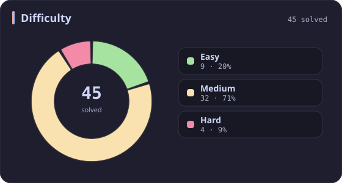
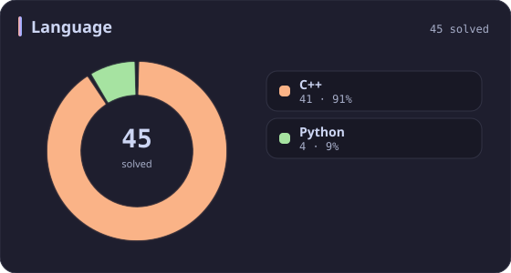
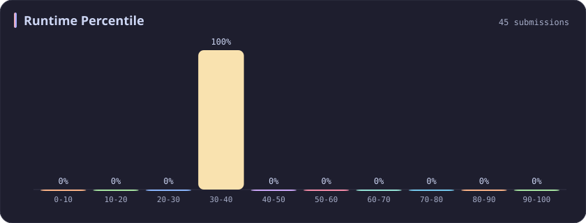
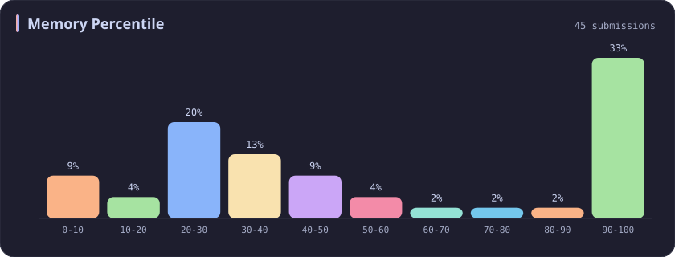
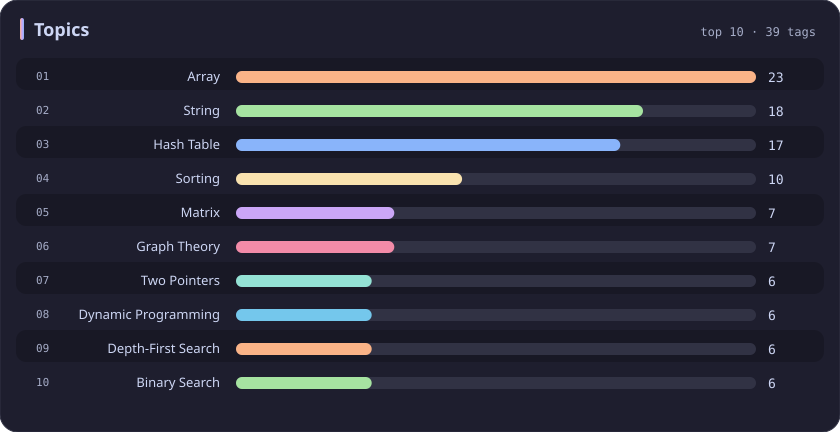

# Runtime 30-40% Stats

[All stats](../../README.md)

**45** problems · updated `2026-09-04 19:12 UTC`

## Stats

### Difficulty

### Language

### Runtime Percentile

| [0-10](0-10.md) | [10-20](10-20.md) | [20-30](20-30.md) | **30-40** | [40-50](40-50.md) | [50-60](50-60.md) | [60-70](60-70.md) | [70-80](70-80.md) | [80-90](80-90.md) | [90-100](90-100.md) |
| :---: | :---: | :---: | :---: | :---: | :---: | :---: | :---: | :---: | :---: |
| 281 | 51 | 36 | **45** | 31 | 22 | 21 | 19 | 26 | 198 |

### Memory Percentile

### Topics

---

## Recent Activity

Latest **45** accepted submissions.

| Date | Title | Difficulty | Lang | Runtime | Memory |
| :--- | :--- | :---: | :---: | ---: | ---: |
| 2026-06-06 | [3952. Maximum Total Value of Covered Indices](https://leetcode.com/problems/maximum-total-value-of-covered-indices/) | Medium | C++ | 127 ms `33.96%` | 236.8 MB `31.46%` |
| 2026-05-24 | [3941. Password Strength](https://leetcode.com/problems/password-strength/) | Medium | C++ | 20 ms `39.05%` | 17.6 MB `58.98%` |
| 2026-03-25 | [3546. Equal Sum Grid Partition I](https://leetcode.com/problems/equal-sum-grid-partition-i/) | Medium | C++ | 12 ms `34.01%` | 130.2 MB `100.00%` |
| 2025-10-11 | [3710. Maximum Partition Factor](https://leetcode.com/problems/maximum-partition-factor/) | Hard | C++ | 1245 ms `35.15%` | 336.4 MB `37.63%` |
| 2025-10-03 | [1135. Connecting Cities With Minimum Cost](https://leetcode.com/problems/connecting-cities-with-minimum-cost/) | Medium | C++ | 45 ms `32.04%` | 58.5 MB `26.21%` |
| 2025-10-02 | [3100. Water Bottles II](https://leetcode.com/problems/water-bottles-ii/) | Medium | C++ | 2 ms `38.80%` | 8.7 MB `15.89%` |
| 2025-09-27 | [3692. Majority Frequency Characters](https://leetcode.com/problems/majority-frequency-characters/) | Easy | C++ | 5 ms `31.61%` | 9.2 MB `86.77%` |
| 2025-09-21 | [1912. Design Movie Rental System](https://leetcode.com/problems/design-movie-rental-system/) | Hard | C++ | 333 ms `34.71%` | 444.6 MB `8.94%` |
| 2025-09-17 | [2353. Design a Food Rating System](https://leetcode.com/problems/design-a-food-rating-system/) | Medium | C++ | 164 ms `34.81%` | 162.7 MB `91.36%` |
| 2025-09-15 | [1935. Maximum Number of Words You Can Type](https://leetcode.com/problems/maximum-number-of-words-you-can-type/) | Easy | Python | 3 ms `33.08%` | 17.9 MB `100.00%` |
| 2025-09-13 | [3541. Find Most Frequent Vowel and Consonant](https://leetcode.com/problems/find-most-frequent-vowel-and-consonant/) | Easy | C++ | 2 ms `39.99%` | 10 MB `24.45%` |
| 2025-09-11 | [2785. Sort Vowels in a String](https://leetcode.com/problems/sort-vowels-in-a-string/) | Medium | C++ | 19 ms `35.89%` | 20.6 MB `5.76%` |
| 2025-06-13 | [2616. Minimize the Maximum Difference of Pairs](https://leetcode.com/problems/minimize-the-maximum-difference-of-pairs/) | Medium | C++ | 30 ms `30.34%` | 86.8 MB `50.70%` |
| 2025-06-10 | [3442. Maximum Difference Between Even and Odd Frequency I](https://leetcode.com/problems/maximum-difference-between-even-and-odd-frequency-i/) | Easy | C++ | 3 ms `36.10%` | 9.9 MB `27.80%` |
| 2025-05-26 | [1857. Largest Color Value in a Directed Graph](https://leetcode.com/problems/largest-color-value-in-a-directed-graph/) | Hard | C++ | 401 ms `39.45%` | 188.9 MB `30.53%` |
| 2025-05-25 | [3561. Resulting String After Adjacent Removals](https://leetcode.com/problems/resulting-string-after-adjacent-removals/) | Medium | C++ | 106 ms `36.98%` | 78.6 MB `7.40%` |
| 2025-05-08 | [3342. Find Minimum Time to Reach Last Room II](https://leetcode.com/problems/find-minimum-time-to-reach-last-room-ii/) | Medium | C++ | 777 ms `30.12%` | 116.8 MB `49.84%` |
| 2025-05-07 | [3341. Find Minimum Time to Reach Last Room I](https://leetcode.com/problems/find-minimum-time-to-reach-last-room-i/) | Medium | C++ | 26 ms `37.76%` | 31.1 MB `25.92%` |
| 2025-05-04 | [252. Meeting Rooms](https://leetcode.com/problems/meeting-rooms/) | Easy | C++ | 3 ms `39.58%` | 15.9 MB `79.28%` |
| 2025-05-04 | [1198. Find Smallest Common Element in All Rows](https://leetcode.com/problems/find-smallest-common-element-in-all-rows/) | Medium | C++ | 12 ms `33.33%` | 31.3 MB `25.56%` |
| 2025-05-02 | [838. Push Dominoes](https://leetcode.com/problems/push-dominoes/) | Medium | C++ | 27 ms `32.11%` | 27.2 MB `30.96%` |
| 2025-04-30 | [1295. Find Numbers with Even Number of Digits](https://leetcode.com/problems/find-numbers-with-even-number-of-digits/) | Easy | Python | 4 ms `32.34%` | 12.5 MB `4.41%` |
| 2025-04-24 | [134. Gas Station](https://leetcode.com/problems/gas-station/) | Medium | C++ | 3 ms `34.61%` | 112.5 MB `61.27%` |
| 2025-04-24 | [739. Daily Temperatures](https://leetcode.com/problems/daily-temperatures/) | Medium | C++ | 27 ms `34.20%` | 107.4 MB `34.92%` |
| 2025-04-23 | [2542. Maximum Subsequence Score](https://leetcode.com/problems/maximum-subsequence-score/) | Medium | C++ | 75 ms `30.92%` | 99.3 MB `27.05%` |
| 2025-04-20 | [994. Rotting Oranges](https://leetcode.com/problems/rotting-oranges/) | Medium | C++ | 1 ms `36.04%` | 17.2 MB `28.15%` |
| 2025-04-20 | [1466. Reorder Routes to Make All Paths Lead to the City Zero](https://leetcode.com/problems/reorder-routes-to-make-all-paths-lead-to-the-city-zero/) | Medium | C++ | 141 ms `31.08%` | 117.5 MB `32.39%` |
| 2025-04-19 | [1448. Count Good Nodes in Binary Tree](https://leetcode.com/problems/count-good-nodes-in-binary-tree/) | Medium | C++ | 104 ms `32.00%` | 88.1 MB `97.77%` |
| 2025-04-19 | [437. Path Sum III](https://leetcode.com/problems/path-sum-iii/) | Medium | C++ | 12 ms `30.68%` | 21.5 MB `25.06%` |
| 2025-04-19 | [2130. Maximum Twin Sum of a Linked List](https://leetcode.com/problems/maximum-twin-sum-of-a-linked-list/) | Medium | C++ | 5 ms `36.76%` | 138.4 MB `17.32%` |
| 2025-04-19 | [1657. Determine if Two Strings Are Close](https://leetcode.com/problems/determine-if-two-strings-are-close/) | Medium | C++ | 27 ms `35.74%` | 23.6 MB `49.60%` |
| 2025-04-19 | [2352. Equal Row and Column Pairs](https://leetcode.com/problems/equal-row-and-column-pairs/) | Medium | Python | 51 ms `32.70%` | 22.1 MB `99.98%` |
| 2025-04-19 | [1679. Max Number of K-Sum Pairs](https://leetcode.com/problems/max-number-of-k-sum-pairs/) | Medium | C++ | 106 ms `31.48%` | 72 MB `23.30%` |
| 2025-04-19 | [151. Reverse Words in a String](https://leetcode.com/problems/reverse-words-in-a-string/) | Medium | Python | 3 ms `30.78%` | 17.8 MB `100.00%` |
| 2024-11-11 | [2601. Prime Subtraction Operation](https://leetcode.com/problems/prime-subtraction-operation/) | Medium | C++ | 25 ms `34.60%` | 28.7 MB `41.64%` |
| 2024-11-10 | [3097. Shortest Subarray With OR at Least K II](https://leetcode.com/problems/shortest-subarray-with-or-at-least-k-ii/) | Medium | C++ | 51 ms `30.41%` | 88.3 MB `100.00%` |
| 2024-10-28 | [2501. Longest Square Streak in an Array](https://leetcode.com/problems/longest-square-streak-in-an-array/) | Medium | C++ | 115 ms `34.23%` | 86.3 MB `98.21%` |
| 2024-04-03 | [79. Word Search](https://leetcode.com/problems/word-search/) | Medium | C++ | 375 ms `39.57%` | 10.8 MB `49.28%` |
| 2024-03-25 | [442. Find All Duplicates in an Array](https://leetcode.com/problems/find-all-duplicates-in-an-array/) | Medium | C++ | 33 ms `32.10%` | 36 MB `100.00%` |
| 2024-03-23 | [1119. Remove Vowels from a String](https://leetcode.com/problems/remove-vowels-from-a-string/) | Easy | C++ | 3 ms `33.33%` | 7.5 MB `100.00%` |
| 2023-03-26 | [2360. Longest Cycle in a Graph](https://leetcode.com/problems/longest-cycle-in-a-graph/) | Hard | C++ | 164 ms `35.56%` | 90.2 MB `99.93%` |
| 2023-03-21 | [349. Intersection of Two Arrays](https://leetcode.com/problems/intersection-of-two-arrays/) | Easy | C++ | 3 ms `38.14%` | 11.2 MB `100.00%` |
| 2023-03-19 | [242. Valid Anagram](https://leetcode.com/problems/valid-anagram/) | Easy | C++ | 4 ms `33.94%` | 7.4 MB `100.00%` |
| 2023-02-19 | [12. Integer to Roman](https://leetcode.com/problems/integer-to-roman/) | Medium | C++ | 6 ms `33.57%` | 6 MB `100.00%` |
| 2023-02-15 | [5. Longest Palindromic Substring](https://leetcode.com/problems/longest-palindromic-substring/) | Medium | C++ | 37 ms `39.20%` | 7 MB `100.00%` |
