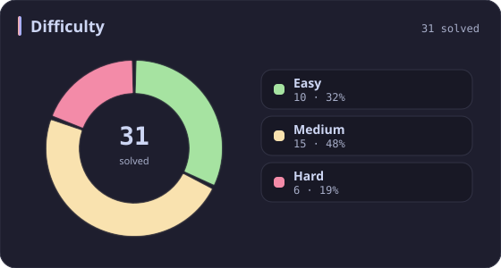
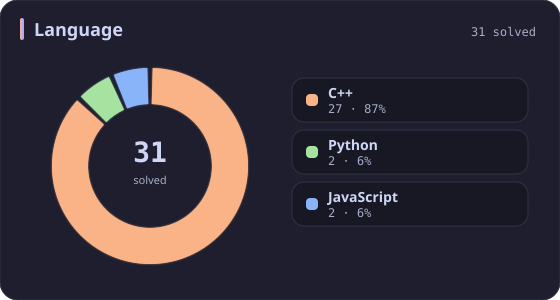
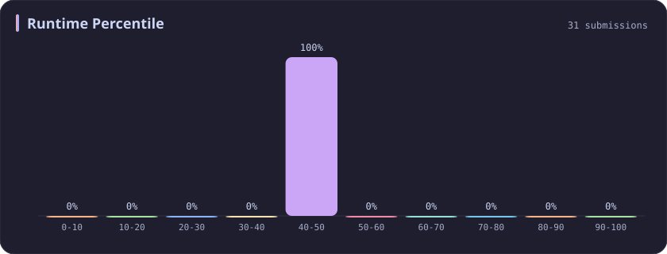
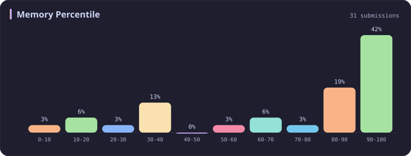

# Runtime 40-50% Stats

[All stats](../../README.md)

**31** problems · updated `2026-09-04 19:32 UTC`

## Stats

### Difficulty

### Language

### Runtime Percentile

| [0-10](0-10.md) | [10-20](10-20.md) | [20-30](20-30.md) | [30-40](30-40.md) | **40-50** | [50-60](50-60.md) | [60-70](60-70.md) | [70-80](70-80.md) | [80-90](80-90.md) | [90-100](90-100.md) |
| :---: | :---: | :---: | :---: | :---: | :---: | :---: | :---: | :---: | :---: |
| 281 | 51 | 36 | 45 | **31** | 22 | 21 | 19 | 26 | 199 |

### Memory Percentile

### Topics

---

## Recent Activity

Latest **31** accepted submissions.

| Date | Title | Difficulty | Lang | Runtime | Memory |
| :--- | :--- | :---: | :---: | ---: | ---: |
| 2026&#8209;09&#8209;03 | [3876. Construct Uniform Parity Array II](https://leetcode.com/problems/construct-uniform-parity-array-ii/) | Medium | C++ | 7 ms `42.89%` | 165.7 MB `84.39%` |
| 2026&#8209;08&#8209;13 | [286. Walls and Gates](https://leetcode.com/problems/walls-and-gates/) | Medium | C++ | 7 ms `44.44%` | 19 MB `83.33%` |
| 2026&#8209;06&#8209;04 | [3751. Total Waviness of Numbers in Range I](https://leetcode.com/problems/total-waviness-of-numbers-in-range-i/) | Medium | C++ | 50 ms `45.88%` | 9.3 MB `72.51%` |
| 2025&#8209;10&#8209;13 | [2273. Find Resultant Array After Removing Anagrams](https://leetcode.com/problems/find-resultant-array-after-removing-anagrams/) | Easy | C++ | 3 ms `45.53%` | 17.9 MB `24.76%` |
| 2025&#8209;10&#8209;08 | [2300. Successful Pairs of Spells and Potions](https://leetcode.com/problems/successful-pairs-of-spells-and-potions/) | Medium | C++ | 47 ms `42.48%` | 138.4 MB `8.28%` |
| 2025&#8209;10&#8209;03 | [407. Trapping Rain Water II](https://leetcode.com/problems/trapping-rain-water-ii/) | Hard | C++ | 34 ms `43.03%` | 22.7 MB `32.34%` |
| 2025&#8209;09&#8209;29 | [1121. Divide Array Into Increasing Sequences](https://leetcode.com/problems/divide-array-into-increasing-sequences/) | Hard | C++ | 95 ms `41.67%` | 107.6 MB `33.33%` |
| 2025&#8209;06&#8209;12 | [3423. Maximum Difference Between Adjacent Elements in a Circular Array](https://leetcode.com/problems/maximum-difference-between-adjacent-elements-in-a-circular-array/) | Easy | Python | 3 ms `42.01%` | 17.8 MB `100.00%` |
| 2025&#8209;06&#8209;05 | [1061. Lexicographically Smallest Equivalent String](https://leetcode.com/problems/lexicographically-smallest-equivalent-string/) | Medium | C++ | 2 ms `46.62%` | 9 MB `53.92%` |
| 2025&#8209;06&#8209;03 | [1298. Maximum Candies You Can Get from Boxes](https://leetcode.com/problems/maximum-candies-you-can-get-from-boxes/) | Hard | C++ | 8 ms `43.38%` | 44.5 MB `100.00%` |
| 2025&#8209;06&#8209;01 | [2929. Distribute Candies Among Children II](https://leetcode.com/problems/distribute-candies-among-children-ii/) | Medium | C++ | 14 ms `49.47%` | 8.9 MB `83.04%` |
| 2025&#8209;05&#8209;12 | [346. Moving Average from Data Stream](https://leetcode.com/problems/moving-average-from-data-stream/) | Easy | C++ | 3 ms `46.36%` | 20.8 MB `80.04%` |
| 2025&#8209;05&#8209;11 | [3547. Maximum Sum of Edge Values in a Graph](https://leetcode.com/problems/maximum-sum-of-edge-values-in-a-graph/) | Hard | C++ | 195 ms `41.78%` | 191.3 MB `100.00%` |
| 2025&#8209;05&#8209;11 | [3545. Minimum Deletions for At Most K Distinct Characters](https://leetcode.com/problems/minimum-deletions-for-at-most-k-distinct-characters/) | Easy | C++ | 3 ms `41.64%` | 9 MB `89.15%` |
| 2025&#8209;04&#8209;25 | [2845. Count of Interesting Subarrays](https://leetcode.com/problems/count-of-interesting-subarrays/) | Medium | C++ | 59 ms `42.22%` | 127.3 MB `10.79%` |
| 2025&#8209;04&#8209;24 | [238. Product of Array Except Self](https://leetcode.com/problems/product-of-array-except-self/) | Medium | C++ | 2 ms `42.79%` | 41.6 MB `37.92%` |
| 2025&#8209;04&#8209;21 | [215. Kth Largest Element in an Array](https://leetcode.com/problems/kth-largest-element-in-an-array/) | Medium | C++ | 38 ms `47.95%` | 64.7 MB `100.00%` |
| 2025&#8209;04&#8209;20 | [547. Number of Provinces](https://leetcode.com/problems/number-of-provinces/) | Medium | C++ | 2 ms `41.04%` | 19.3 MB `92.38%` |
| 2025&#8209;04&#8209;19 | [933. Number of Recent Calls](https://leetcode.com/problems/number-of-recent-calls/) | Easy | C++ | 20 ms `40.20%` | 64.1 MB `69.17%` |
| 2025&#8209;04&#8209;11 | [1768. Merge Strings Alternately](https://leetcode.com/problems/merge-strings-alternately/) | Easy | C++ | 3 ms `40.70%` | 8.6 MB `13.54%` |
| 2025&#8209;04&#8209;07 | [317. Shortest Distance from All Buildings](https://leetcode.com/problems/shortest-distance-from-all-buildings/) | Hard | C++ | 470 ms `46.48%` | 197.7 MB `39.44%` |
| 2024&#8209;11&#8209;14 | [2064. Minimized Maximum of Products Distributed to Any Store](https://leetcode.com/problems/minimized-maximum-of-products-distributed-to-any-store/) | Medium | C++ | 34 ms `46.39%` | 87.4 MB `100.00%` |
| 2024&#8209;11&#8209;14 | [1213. Intersection of Three Sorted Arrays](https://leetcode.com/problems/intersection-of-three-sorted-arrays/) | Easy | Python | 4 ms `41.61%` | 16.9 MB `100.00%` |
| 2024&#8209;04&#8209;19 | [200. Number of Islands](https://leetcode.com/problems/number-of-islands/) | Medium | C++ | 28 ms `47.94%` | 16.8 MB `60.84%` |
| 2024&#8209;03&#8209;20 | [1669. Merge In Between Linked Lists](https://leetcode.com/problems/merge-in-between-linked-lists/) | Medium | C++ | 204 ms `41.16%` | 98.1 MB `99.62%` |
| 2023&#8209;10&#8209;08 | [1458. Max Dot Product of Two Subsequences](https://leetcode.com/problems/max-dot-product-of-two-subsequences/) | Hard | C++ | 24 ms `48.36%` | 9.8 MB `100.00%` |
| 2023&#8209;10&#8209;01 | [2634. Filter Elements from Array](https://leetcode.com/problems/filter-elements-from-array/) | Easy | JavaScript | 46 ms `41.32%` | 41.7 MB `100.00%` |
| 2023&#8209;10&#8209;01 | [2635. Apply Transform Over Each Element in Array](https://leetcode.com/problems/apply-transform-over-each-element-in-array/) | Easy | JavaScript | 46 ms `40.86%` | 42.1 MB `100.00%` |
| 2023&#8209;04&#8209;14 | [516. Longest Palindromic Subsequence](https://leetcode.com/problems/longest-palindromic-subsequence/) | Medium | C++ | 85 ms `41.32%` | 72.3 MB `81.80%` |
| 2023&#8209;03&#8209;21 | [141. Linked List Cycle](https://leetcode.com/problems/linked-list-cycle/) | Easy | C++ | 11 ms `42.93%` | 8.2 MB `100.00%` |
| 2023&#8209;03&#8209;09 | [142. Linked List Cycle II](https://leetcode.com/problems/linked-list-cycle-ii/) | Medium | C++ | 8 ms `48.92%` | 7.6 MB `100.00%` |
