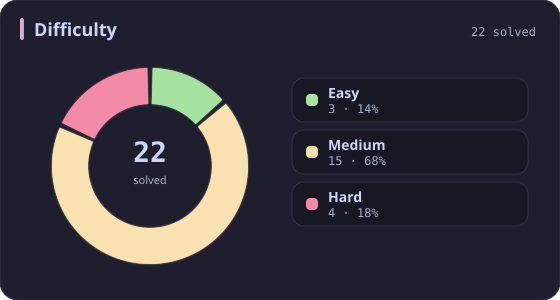
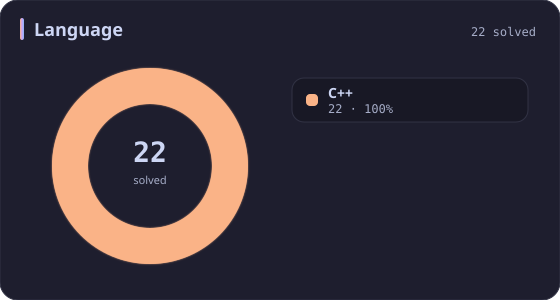
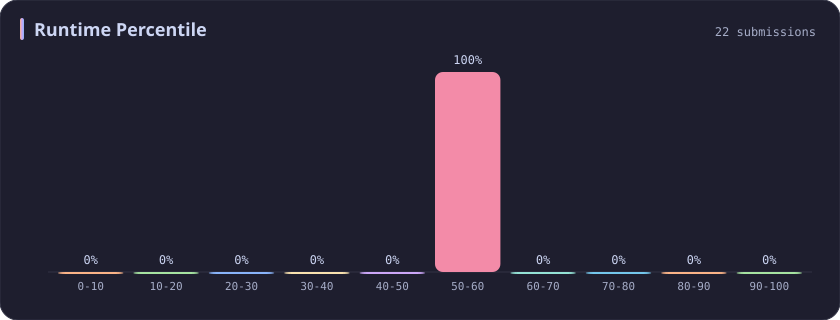
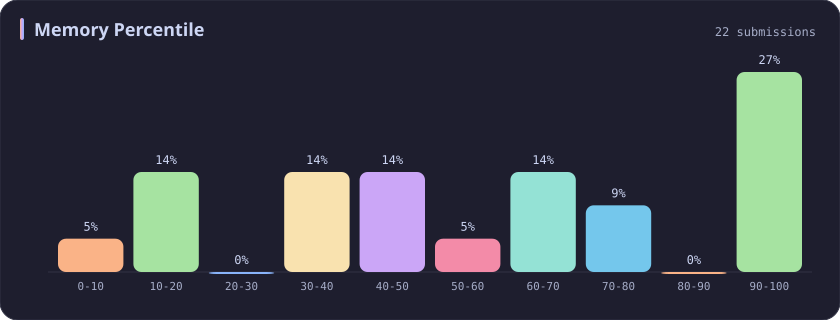
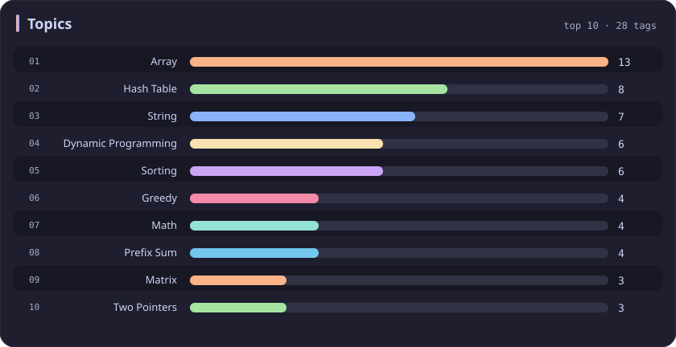

# Runtime 50-60% Stats

[All stats](../../README.md)

**22** problems · updated `2026-09-04 19:12 UTC`

## Stats

### Difficulty

### Language

### Runtime Percentile

| [0-10](0-10.md) | [10-20](10-20.md) | [20-30](20-30.md) | [30-40](30-40.md) | [40-50](40-50.md) | **50-60** | [60-70](60-70.md) | [70-80](70-80.md) | [80-90](80-90.md) | [90-100](90-100.md) |
| :---: | :---: | :---: | :---: | :---: | :---: | :---: | :---: | :---: | :---: |
| 281 | 51 | 36 | 45 | 31 | **22** | 21 | 19 | 26 | 198 |

### Memory Percentile

### Topics

---

## Recent Activity

Latest **22** accepted submissions.

| Date | Title | Difficulty | Lang | Runtime | Memory |
| :--- | :--- | :---: | :---: | ---: | ---: |
| 2026-08-20 | [308. Range Sum Query 2D - Mutable](https://leetcode.com/problems/range-sum-query-2d-mutable/) | Medium | C++ | 19 ms `58.17%` | 44.6 MB `11.30%` |
| 2026-08-17 | [1563. Stone Game V](https://leetcode.com/problems/stone-game-v/) | Hard | C++ | 407 ms `57.19%` | 27.6 MB `46.96%` |
| 2026-06-11 | [3558. Number of Ways to Assign Edge Weights I](https://leetcode.com/problems/number-of-ways-to-assign-edge-weights-i/) | Medium | C++ | 303 ms `53.85%` | 346.5 MB `44.39%` |
| 2026-06-08 | [2161. Partition Array According to Given Pivot](https://leetcode.com/problems/partition-array-according-to-given-pivot/) | Medium | C++ | 7 ms `58.96%` | 139.4 MB `16.25%` |
| 2025-10-14 | [3349. Adjacent Increasing Subarrays Detection I](https://leetcode.com/problems/adjacent-increasing-subarrays-detection-i/) | Easy | C++ | 13 ms `51.08%` | 40.4 MB `54.98%` |
| 2025-10-12 | [3714. Longest Balanced Substring II](https://leetcode.com/problems/longest-balanced-substring-ii/) | Medium | C++ | 1603 ms `59.24%` | 403.9 MB `18.22%` |
| 2025-09-27 | [3695. Maximize Alternating Sum Using Swaps](https://leetcode.com/problems/maximize-alternating-sum-using-swaps/) | Hard | C++ | 294 ms `56.92%` | 341.9 MB `32.45%` |
| 2025-09-27 | [3694. Distinct Points Reachable After Substring Removal](https://leetcode.com/problems/distinct-points-reachable-after-substring-removal/) | Medium | C++ | 130 ms `52.48%` | 53.5 MB `42.98%` |
| 2025-09-27 | [3693. Climbing Stairs II](https://leetcode.com/problems/climbing-stairs-ii/) | Medium | C++ | 20 ms `54.23%` | 177.8 MB `64.31%` |
| 2025-05-24 | [3556. Sum of Largest Prime Substrings](https://leetcode.com/problems/sum-of-largest-prime-substrings/) | Medium | C++ | 15 ms `51.49%` | 10.8 MB `60.40%` |
| 2025-05-22 | [3362. Zero Array Transformation III](https://leetcode.com/problems/zero-array-transformation-iii/) | Medium | C++ | 128 ms `50.88%` | 224.5 MB `38.16%` |
| 2025-05-11 | [3548. Equal Sum Grid Partition II](https://leetcode.com/problems/equal-sum-grid-partition-ii/) | Hard | C++ | 826 ms `55.46%` | 400.9 MB `37.86%` |
| 2025-05-09 | [3343. Count Number of Balanced Permutations](https://leetcode.com/problems/count-number-of-balanced-permutations/) | Hard | C++ | 150 ms `50.60%` | 19.4 MB `65.06%` |
| 2025-04-28 | [734. Sentence Similarity](https://leetcode.com/problems/sentence-similarity/) | Easy | C++ | 2 ms `52.34%` | 15.7 MB `70.09%` |
| 2025-04-24 | [435. Non-overlapping Intervals](https://leetcode.com/problems/non-overlapping-intervals/) | Medium | C++ | 47 ms `52.82%` | 93.8 MB `90.88%` |
| 2025-04-23 | [374. Guess Number Higher or Lower](https://leetcode.com/problems/guess-number-higher-or-lower/) | Easy | C++ | 2 ms `56.17%` | 8.1 MB `6.63%` |
| 2025-04-19 | [2563. Count the Number of Fair Pairs](https://leetcode.com/problems/count-the-number-of-fair-pairs/) | Medium | C++ | 61 ms `59.74%` | 60.3 MB `100.00%` |
| 2024-10-29 | [2684. Maximum Number of Moves in a Grid](https://leetcode.com/problems/maximum-number-of-moves-in-a-grid/) | Medium | C++ | 15 ms `58.58%` | 74.4 MB `74.18%` |
| 2024-10-22 | [2583. Kth Largest Sum in a Binary Tree](https://leetcode.com/problems/kth-largest-sum-in-a-binary-tree/) | Medium | C++ | 34 ms `58.53%` | 167 MB `100.00%` |
| 2024-04-25 | [2370. Longest Ideal Subsequence](https://leetcode.com/problems/longest-ideal-subsequence/) | Medium | C++ | 28 ms `57.00%` | 11.5 MB `100.00%` |
| 2023-03-10 | [3. Longest Substring Without Repeating Characters](https://leetcode.com/problems/longest-substring-without-repeating-characters/) | Medium | C++ | 21 ms `51.68%` | 8.6 MB `100.00%` |
| 2023-02-19 | [1282. Group the People Given the Group Size They Belong To](https://leetcode.com/problems/group-the-people-given-the-group-size-they-belong-to/) | Medium | C++ | 4 ms `51.29%` | 13.3 MB `100.00%` |
