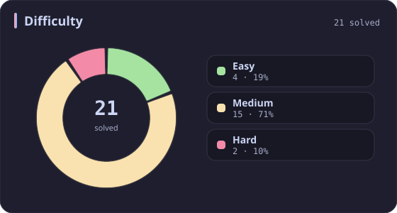
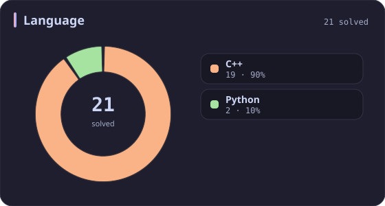
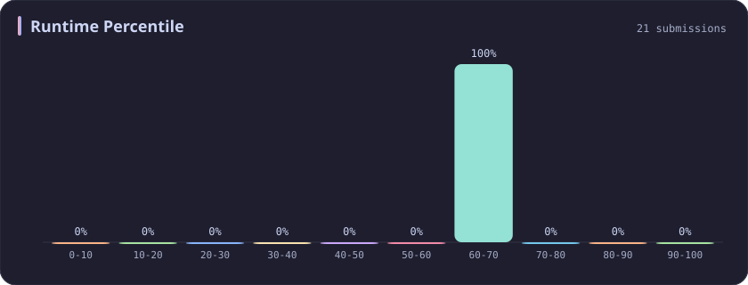
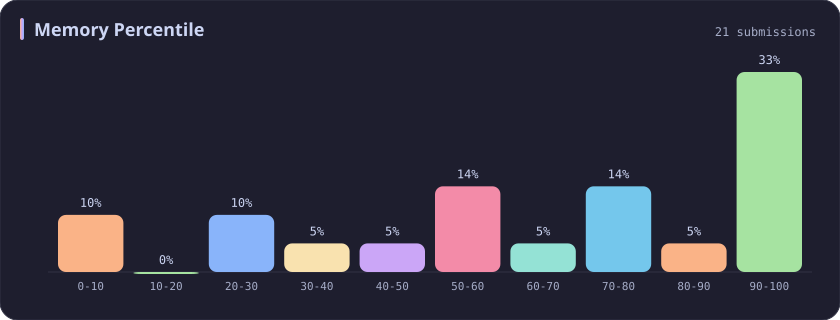
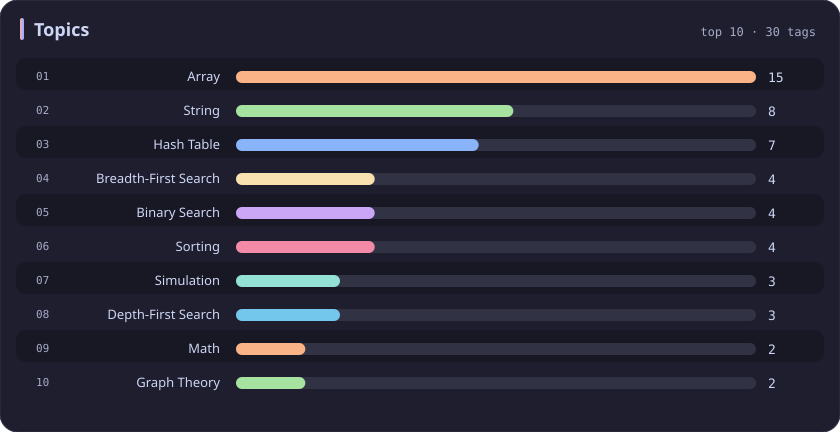

# Runtime 60-70% Stats

[All stats](../../README.md)

**21** problems · updated `2026-09-04 19:12 UTC`

## Stats

### Difficulty

### Language

### Runtime Percentile

| [0-10](0-10.md) | [10-20](10-20.md) | [20-30](20-30.md) | [30-40](30-40.md) | [40-50](40-50.md) | [50-60](50-60.md) | **60-70** | [70-80](70-80.md) | [80-90](80-90.md) | [90-100](90-100.md) |
| :---: | :---: | :---: | :---: | :---: | :---: | :---: | :---: | :---: | :---: |
| 281 | 51 | 36 | 45 | 31 | 22 | **21** | 19 | 26 | 198 |

### Memory Percentile

### Topics

---

## Recent Activity

Latest **21** accepted submissions.

| Date | Title | Difficulty | Lang | Runtime | Memory |
| :--- | :--- | :---: | :---: | ---: | ---: |
| 2026-09-04 | [1. Two Sum](https://leetcode.com/problems/two-sum/) | Easy | C++ | 3 ms `67.25%` | 14.8 MB `58.55%` |
| 2026-06-04 | [723. Candy Crush](https://leetcode.com/problems/candy-crush/) | Medium | C++ | 4 ms `61.92%` | 14.4 MB `20.92%` |
| 2026-02-06 | [3634. Minimum Removals to Balance Array](https://leetcode.com/problems/minimum-removals-to-balance-array/) | Medium | C++ | 31 ms `62.90%` | 105 MB `86.33%` |
| 2025-10-08 | [774. Minimize Max Distance to Gas Station](https://leetcode.com/problems/minimize-max-distance-to-gas-station/) | Hard | C++ | 9 ms `66.90%` | 18 MB `8.45%` |
| 2025-09-14 | [966. Vowel Spellchecker](https://leetcode.com/problems/vowel-spellchecker/) | Medium | C++ | 37 ms `68.34%` | 41.6 MB `55.21%` |
| 2025-05-28 | [3372. Maximize the Number of Target Nodes After Connecting Trees I](https://leetcode.com/problems/maximize-the-number-of-target-nodes-after-connecting-trees-i/) | Medium | C++ | 181 ms `69.37%` | 62.9 MB `70.27%` |
| 2025-05-16 | [2901. Longest Unequal Adjacent Groups Subsequence II](https://leetcode.com/problems/longest-unequal-adjacent-groups-subsequence-ii/) | Medium | C++ | 63 ms `64.73%` | 34.4 MB `74.88%` |
| 2025-05-04 | [616. Add Bold Tag in String](https://leetcode.com/problems/add-bold-tag-in-string/) | Medium | C++ | 7 ms `65.58%` | 13.9 MB `59.74%` |
| 2025-05-04 | [422. Valid Word Square](https://leetcode.com/problems/valid-word-square/) | Easy | Python | 18 ms `65.88%` | 18.4 MB `100.00%` |
| 2025-05-04 | [249. Group Shifted Strings](https://leetcode.com/problems/group-shifted-strings/) | Medium | C++ | 1 ms `64.95%` | 10.9 MB `92.27%` |
| 2025-05-01 | [2071. Maximum Number of Tasks You Can Assign](https://leetcode.com/problems/maximum-number-of-tasks-you-can-assign/) | Hard | C++ | 714 ms `60.06%` | 286.3 MB `39.93%` |
| 2025-04-24 | [1268. Search Suggestions System](https://leetcode.com/problems/search-suggestions-system/) | Medium | C++ | 31 ms `64.68%` | 44 MB `62.90%` |
| 2025-04-20 | [3522. Calculate Score After Performing Instructions](https://leetcode.com/problems/calculate-score-after-performing-instructions/) | Medium | C++ | 4 ms `64.29%` | 167.2 MB `74.06%` |
| 2025-04-11 | [323. Number of Connected Components in an Undirected Graph](https://leetcode.com/problems/number-of-connected-components-in-an-undirected-graph/) | Medium | C++ | 3 ms `63.11%` | 18.7 MB `22.04%` |
| 2025-02-14 | [448. Find All Numbers Disappeared in an Array](https://leetcode.com/problems/find-all-numbers-disappeared-in-an-array/) | Easy | C++ | 4 ms `66.42%` | 54.8 MB `45.01%` |
| 2024-11-04 | [3163. String Compression III](https://leetcode.com/problems/string-compression-iii/) | Medium | C++ | 26 ms `65.21%` | 35.5 MB `5.36%` |
| 2023-04-08 | [133. Clone Graph](https://leetcode.com/problems/clone-graph/) | Medium | C++ | 3 ms `68.22%` | 8.9 MB `100.00%` |
| 2023-03-17 | [43. Multiply Strings](https://leetcode.com/problems/multiply-strings/) | Medium | Python | 36 ms `64.41%` | 13.8 MB `100.00%` |
| 2023-03-09 | [1523. Count Odd Numbers in an Interval Range](https://leetcode.com/problems/count-odd-numbers-in-an-interval-range/) | Easy | C++ | 3 ms `64.39%` | 5.9 MB `100.00%` |
| 2023-03-01 | [912. Sort an Array](https://leetcode.com/problems/sort-an-array/) | Medium | C++ | 123 ms `68.89%` | 61.3 MB `100.00%` |
| 2023-02-17 | [322. Coin Change](https://leetcode.com/problems/coin-change/) | Medium | C++ | 27 ms `63.28%` | 10.1 MB `100.00%` |
