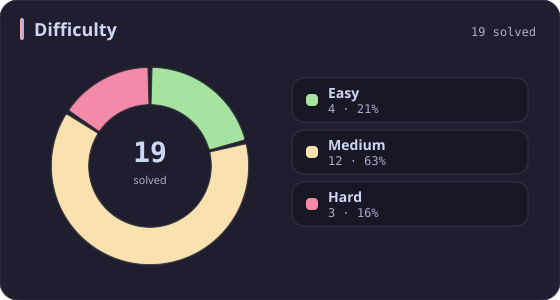
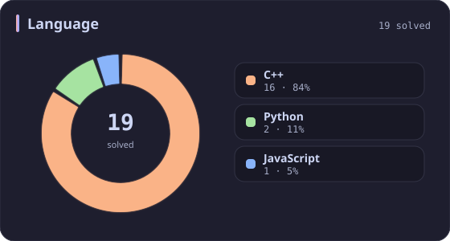
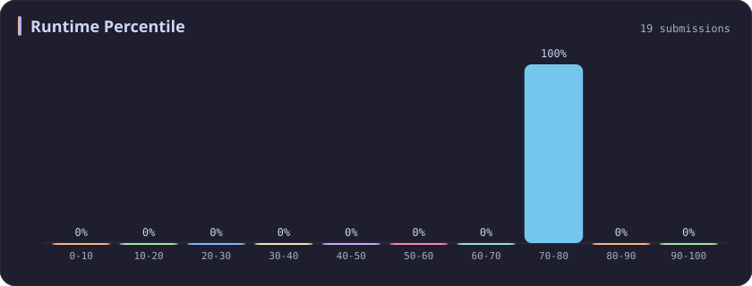
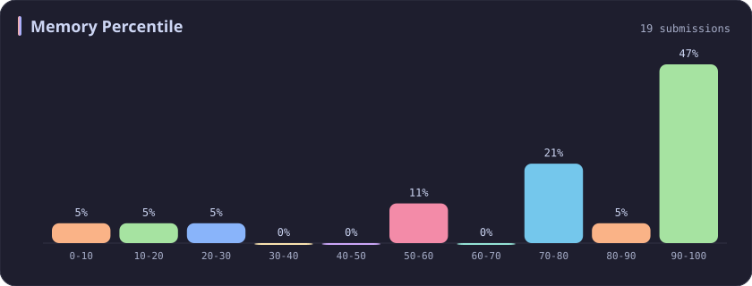
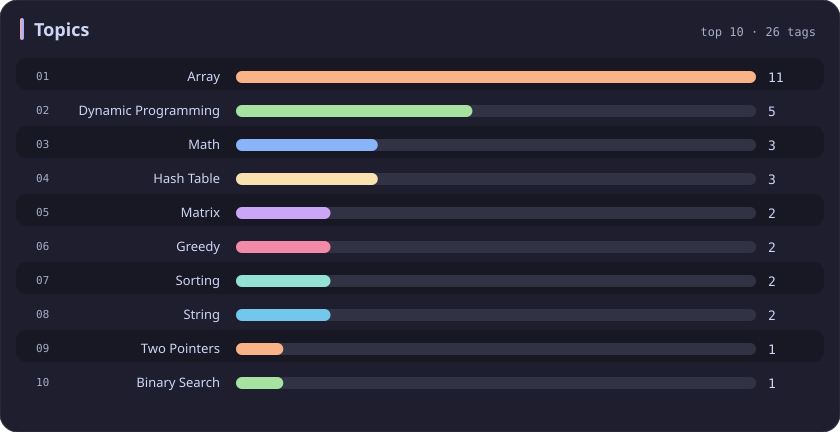

# Runtime 70-80% Stats

[All stats](../../README.md)

**19** problems · updated `2026-09-04 19:14 UTC`

## Stats

### Difficulty

### Language

### Runtime Percentile

| [0-10](0-10.md) | [10-20](10-20.md) | [20-30](20-30.md) | [30-40](30-40.md) | [40-50](40-50.md) | [50-60](50-60.md) | [60-70](60-70.md) | **70-80** | [80-90](80-90.md) | [90-100](90-100.md) |
| :---: | :---: | :---: | :---: | :---: | :---: | :---: | :---: | :---: | :---: |
| 281 | 51 | 36 | 45 | 31 | 22 | 21 | **19** | 26 | 198 |

### Memory Percentile

### Topics

---

## Recent Activity

Latest **19** accepted submissions.

| Date | Title | Difficulty | Lang | Runtime | Memory |
| :--- | :--- | :---: | :---: | ---: | ---: |
| 2026&#8209;05&#8209;23 | [3937. Minimum Operations to Make Array Modulo Alternating I](https://leetcode.com/problems/minimum-operations-to-make-array-modulo-alternating-i/) | Medium | C++ | 7 ms `79.04%` | 25.4 MB `15.30%` |
| 2026&#8209;02&#8209;05 | [3379. Transformed Array](https://leetcode.com/problems/transformed-array/) | Easy | C++ | 4 ms `78.48%` | 25.8 MB `9.70%` |
| 2025&#8209;10&#8209;05 | [417. Pacific Atlantic Water Flow](https://leetcode.com/problems/pacific-atlantic-water-flow/) | Medium | C++ | 4 ms `76.47%` | 22.2 MB `76.03%` |
| 2025&#8209;09&#8209;28 | [3700. Number of ZigZag Arrays II](https://leetcode.com/problems/number-of-zigzag-arrays-ii/) | Hard | C++ | 285 ms `71.83%` | 23.4 MB `79.93%` |
| 2025&#8209;09&#8209;28 | [3699. Number of ZigZag Arrays I](https://leetcode.com/problems/number-of-zigzag-arrays-i/) | Hard | C++ | 407 ms `76.79%` | 11.7 MB `94.59%` |
| 2025&#8209;09&#8209;18 | [3408. Design Task Manager](https://leetcode.com/problems/design-task-manager/) | Medium | C++ | 209 ms `78.45%` | 347.5 MB `98.90%` |
| 2025&#8209;06&#8209;19 | [2294. Partition Array Such That Maximum Difference Is K](https://leetcode.com/problems/partition-array-such-that-maximum-difference-is-k/) | Medium | C++ | 35 ms `76.66%` | 87 MB `100.00%` |
| 2025&#8209;05&#8209;11 | [1272. Remove Interval](https://leetcode.com/problems/remove-interval/) | Medium | C++ | 4 ms `78.08%` | 42.6 MB `73.97%` |
| 2025&#8209;05&#8209;04 | [3537. Fill a Special Grid](https://leetcode.com/problems/fill-a-special-grid/) | Medium | C++ | 8 ms `75.76%` | 69.1 MB `22.22%` |
| 2025&#8209;04&#8209;24 | [2799. Count Complete Subarrays in an Array](https://leetcode.com/problems/count-complete-subarrays-in-an-array/) | Medium | C++ | 19 ms `70.43%` | 40.3 MB `95.38%` |
| 2025&#8209;04&#8209;24 | [80. Remove Duplicates from Sorted Array II](https://leetcode.com/problems/remove-duplicates-from-sorted-array-ii/) | Medium | C++ | 7 ms `72.05%` | 19.6 MB `59.90%` |
| 2025&#8209;04&#8209;24 | [452. Minimum Number of Arrows to Burst Balloons](https://leetcode.com/problems/minimum-number-of-arrows-to-burst-balloons/) | Medium | C++ | 44 ms `72.58%` | 93.7 MB `99.85%` |
| 2025&#8209;04&#8209;23 | [1143. Longest Common Subsequence](https://leetcode.com/problems/longest-common-subsequence/) | Medium | C++ | 24 ms `72.81%` | 27.4 MB `55.87%` |
| 2025&#8209;04&#8209;22 | [2338. Count the Number of Ideal Arrays](https://leetcode.com/problems/count-the-number-of-ideal-arrays/) | Hard | C++ | 10 ms `75.00%` | 10.3 MB `76.47%` |
| 2025&#8209;04&#8209;19 | [2215. Find the Difference of Two Arrays](https://leetcode.com/problems/find-the-difference-of-two-arrays/) | Easy | Python | 5 ms `77.75%` | 18 MB `100.00%` |
| 2024&#8209;11&#8209;01 | [1957. Delete Characters to Make Fancy String](https://leetcode.com/problems/delete-characters-to-make-fancy-string/) | Easy | C++ | 23 ms `77.42%` | 42.7 MB `87.55%` |
| 2023&#8209;10&#8209;04 | [2727. Is Object Empty](https://leetcode.com/problems/is-object-empty/) | Easy | JavaScript | 39 ms `78.61%` | 44 MB `100.00%` |
| 2023&#8209;02&#8209;17 | [300. Longest Increasing Subsequence](https://leetcode.com/problems/longest-increasing-subsequence/) | Medium | C++ | 7 ms `74.79%` | 10.4 MB `100.00%` |
| 2023&#8209;02&#8209;16 | [7. Reverse Integer](https://leetcode.com/problems/reverse-integer/) | Medium | Python | 42 ms `79.32%` | 13.9 MB `100.00%` |
