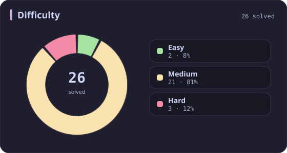
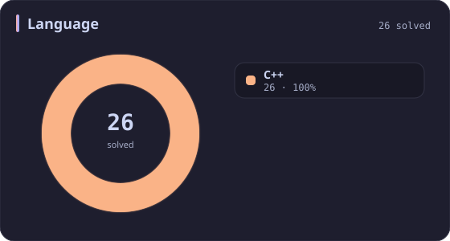
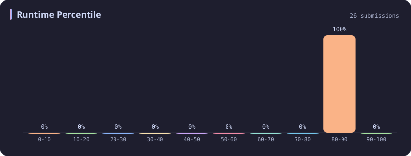
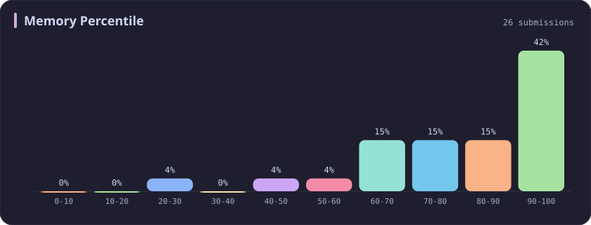
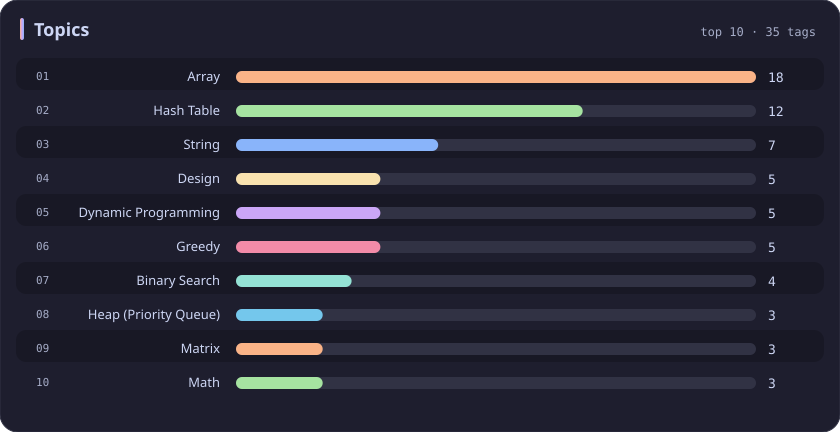

# Runtime 80-90% Stats

[All stats](../../README.md)

**26** problems · updated `2026-09-04 19:23 UTC`

## Stats

### Difficulty

### Language

### Runtime Percentile

| [0-10](0-10.md) | [10-20](10-20.md) | [20-30](20-30.md) | [30-40](30-40.md) | [40-50](40-50.md) | [50-60](50-60.md) | [60-70](60-70.md) | [70-80](70-80.md) | **80-90** | [90-100](90-100.md) |
| :---: | :---: | :---: | :---: | :---: | :---: | :---: | :---: | :---: | :---: |
| 281 | 51 | 36 | 45 | 31 | 22 | 21 | 19 | **26** | 198 |

### Memory Percentile

### Topics

---

## Recent Activity

Latest **26** accepted submissions.

| Date | Title | Difficulty | Lang | Runtime | Memory |
| :--- | :--- | :---: | :---: | ---: | ---: |
| 2026&#8209;06&#8209;06 | [3951. Minimum Energy to Maintain Brightness](https://leetcode.com/problems/minimum-energy-to-maintain-brightness/) | Medium | C++ | 74 ms `83.55%` | 203.6 MB `61.06%` |
| 2026&#8209;02&#8209;10 | [3719. Longest Balanced Subarray I](https://leetcode.com/problems/longest-balanced-subarray-i/) | Medium | C++ | 151 ms `89.04%` | 35.7 MB `94.90%` |
| 2025&#8209;10&#8209;11 | [3147. Taking Maximum Energy From the Mystic Dungeon](https://leetcode.com/problems/taking-maximum-energy-from-the-mystic-dungeon/) | Medium | C++ | 141 ms `82.37%` | 151.8 MB `100.00%` |
| 2025&#8209;10&#8209;11 | [3186. Maximum Total Damage With Spell Casting](https://leetcode.com/problems/maximum-total-damage-with-spell-casting/) | Medium | C++ | 111 ms `86.08%` | 162.8 MB `90.83%` |
| 2025&#8209;09&#8209;20 | [3508. Implement Router](https://leetcode.com/problems/implement-router/) | Medium | C++ | 190 ms `82.01%` | 415.1 MB `99.28%` |
| 2025&#8209;09&#8209;10 | [1733. Minimum Number of People to Teach](https://leetcode.com/problems/minimum-number-of-people-to-teach/) | Medium | C++ | 35 ms `82.77%` | 67.6 MB `68.42%` |
| 2025&#8209;09&#8209;06 | [3495. Minimum Operations to Make Array Elements Zero](https://leetcode.com/problems/minimum-operations-to-make-array-elements-zero/) | Hard | C++ | 7 ms `87.50%` | 183.2 MB `73.61%` |
| 2025&#8209;09&#8209;01 | [1792. Maximum Average Pass Ratio](https://leetcode.com/problems/maximum-average-pass-ratio/) | Medium | C++ | 273 ms `89.50%` | 97.9 MB `69.41%` |
| 2025&#8209;08&#8209;28 | [3446. Sort Matrix by Diagonals](https://leetcode.com/problems/sort-matrix-by-diagonals/) | Medium | C++ | 4 ms `84.97%` | 43.3 MB `86.76%` |
| 2025&#8209;06&#8209;07 | [3170. Lexicographically Minimum String After Removing Stars](https://leetcode.com/problems/lexicographically-minimum-string-after-removing-stars/) | Medium | C++ | 54 ms `80.71%` | 27.2 MB `42.51%` |
| 2025&#8209;05&#8209;25 | [2131. Longest Palindrome by Concatenating Two Letter Words](https://leetcode.com/problems/longest-palindrome-by-concatenating-two-letter-words/) | Medium | C++ | 27 ms `88.02%` | 171.9 MB `78.72%` |
| 2025&#8209;05&#8209;12 | [1429. First Unique Number](https://leetcode.com/problems/first-unique-number/) | Medium | C++ | 195 ms `84.46%` | 128.1 MB `99.72%` |
| 2025&#8209;05&#8209;12 | [359. Logger Rate Limiter](https://leetcode.com/problems/logger-rate-limiter/) | Easy | C++ | 4 ms `86.98%` | 39.2 MB `89.46%` |
| 2025&#8209;05&#8209;12 | [770. Basic Calculator IV](https://leetcode.com/problems/basic-calculator-iv/) | Hard | C++ | 4 ms `85.71%` | 21.8 MB `99.51%` |
| 2025&#8209;05&#8209;03 | [981. Time Based Key-Value Store](https://leetcode.com/problems/time-based-key-value-store/) | Medium | C++ | 38 ms `86.73%` | 136.5 MB `84.35%` |
| 2025&#8209;04&#8209;26 | [3528. Unit Conversion I](https://leetcode.com/problems/unit-conversion-i/) | Medium | C++ | 92 ms `82.47%` | 232.5 MB `94.82%` |
| 2025&#8209;04&#8209;26 | [505. The Maze II](https://leetcode.com/problems/the-maze-ii/) | Medium | C++ | 3 ms `85.22%` | 24.3 MB `63.05%` |
| 2025&#8209;04&#8209;24 | [208. Implement Trie (Prefix Tree)](https://leetcode.com/problems/implement-trie-prefix-tree/) | Medium | C++ | 15 ms `86.33%` | 29.9 MB `99.66%` |
| 2025&#8209;04&#8209;20 | [3524. Find X Value of Array I](https://leetcode.com/problems/find-x-value-of-array-i/) | Medium | C++ | 150 ms `82.08%` | 151.2 MB `54.72%` |
| 2025&#8209;04&#8209;19 | [1456. Maximum Number of Vowels in a Substring of Given Length](https://leetcode.com/problems/maximum-number-of-vowels-in-a-substring-of-given-length/) | Medium | C++ | 3 ms `87.94%` | 13 MB `89.77%` |
| 2025&#8209;04&#8209;18 | [38. Count and Say](https://leetcode.com/problems/count-and-say/) | Medium | C++ | 3 ms `81.25%` | 10.3 MB `21.90%` |
| 2025&#8209;04&#8209;09 | [3375. Minimum Operations to Make Array Values Equal to K](https://leetcode.com/problems/minimum-operations-to-make-array-values-equal-to-k/) | Easy | C++ | 6 ms `89.22%` | 32.2 MB `71.12%` |
| 2025&#8209;04&#8209;07 | [416. Partition Equal Subset Sum](https://leetcode.com/problems/partition-equal-subset-sum/) | Medium | C++ | 71 ms `85.52%` | 15.9 MB `74.44%` |
| 2024&#8209;10&#8209;30 | [1671. Minimum Number of Removals to Make Mountain Array](https://leetcode.com/problems/minimum-number-of-removals-to-make-mountain-array/) | Hard | C++ | 5 ms `89.20%` | 15.1 MB `99.67%` |
| 2024&#8209;10&#8209;22 | [2664. The Knight’s Tour](https://leetcode.com/problems/the-knights-tour/) | Medium | C++ | 71 ms `85.71%` | 7.7 MB `100.00%` |
| 2024&#8209;10&#8209;18 | [2044. Count Number of Maximum Bitwise-OR Subsets](https://leetcode.com/problems/count-number-of-maximum-bitwise-or-subsets/) | Medium | C++ | 7 ms `87.67%` | 10.1 MB `100.00%` |
