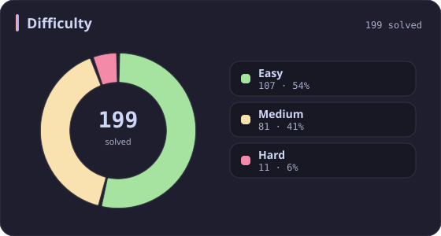
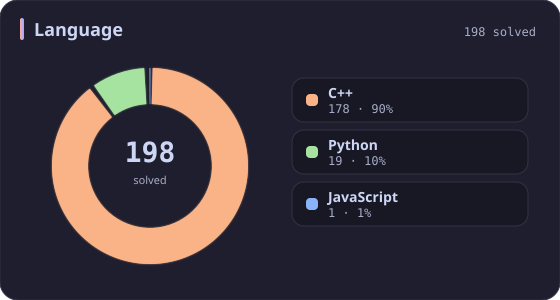
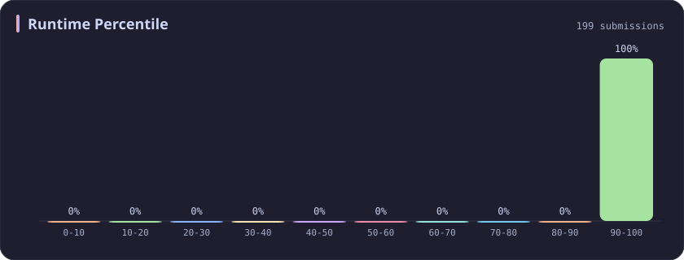
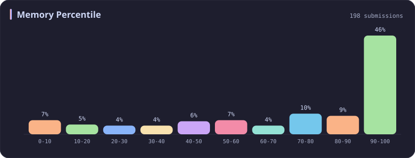
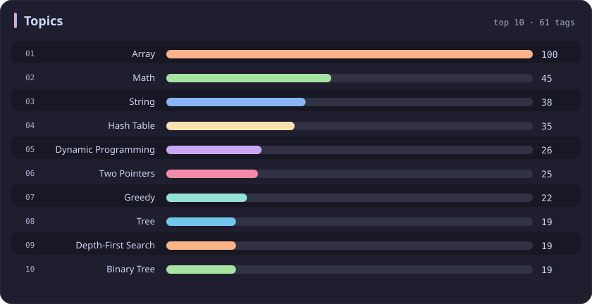

# Runtime 90-100% Stats

[All stats](../../README.md)

**198** problems · updated `2026-09-04 19:23 UTC`

## Stats

### Difficulty

### Language

### Runtime Percentile

| [0-10](0-10.md) | [10-20](10-20.md) | [20-30](20-30.md) | [30-40](30-40.md) | [40-50](40-50.md) | [50-60](50-60.md) | [60-70](60-70.md) | [70-80](70-80.md) | [80-90](80-90.md) | **90-100** |
| :---: | :---: | :---: | :---: | :---: | :---: | :---: | :---: | :---: | :---: |
| 281 | 51 | 36 | 45 | 31 | 22 | 21 | 19 | 26 | **198** |

### Memory Percentile

### Topics

---

## Recent Activity

Latest **100** accepted submissions.

| Date | Title | Difficulty | Lang | Runtime | Memory |
| :--- | :--- | :---: | :---: | ---: | ---: |
| 2026&#8209;09&#8209;04 | [704. Binary Search](https://leetcode.com/problems/binary-search/) | Easy | C++ | 0 ms `100.00%` | 31.3 MB `81.38%` |
| 2026&#8209;09&#8209;04 | [3903. Smallest Stable Index I](https://leetcode.com/problems/smallest-stable-index-i/) | Easy | C++ | 0 ms `100.00%` | 31.5 MB `20.68%` |
| 2026&#8209;09&#8209;02 | [3875. Construct Uniform Parity Array I](https://leetcode.com/problems/construct-uniform-parity-array-i/) | Easy | C++ | 0 ms `100.00%` | 30.3 MB `27.31%` |
| 2026&#8209;08&#8209;20 | [3069. Distribute Elements Into Two Arrays I](https://leetcode.com/problems/distribute-elements-into-two-arrays-i/) | Easy | C++ | 0 ms `100.00%` | 24 MB `32.91%` |
| 2026&#8209;08&#8209;18 | [3471. Find the Largest Almost Missing Integer](https://leetcode.com/problems/find-the-largest-almost-missing-integer/) | Easy | C++ | 0 ms `100.00%` | 28.9 MB `92.57%` |
| 2026&#8209;08&#8209;13 | [270. Closest Binary Search Tree Value](https://leetcode.com/problems/closest-binary-search-tree-value/) | Easy | C++ | 0 ms `100.00%` | 21.2 MB `48.40%` |
| 2026&#8209;08&#8209;13 | [250. Count Univalue Subtrees](https://leetcode.com/problems/count-univalue-subtrees/) | Medium | C++ | 0 ms `100.00%` | 18.5 MB `75.93%` |
| 2026&#8209;08&#8209;13 | [549. Binary Tree Longest Consecutive Sequence II](https://leetcode.com/problems/binary-tree-longest-consecutive-sequence-ii/) | Medium | C++ | 0 ms `100.00%` | 22.7 MB `78.57%` |
| 2026&#8209;06&#8209;06 | [3950. Exactly One Consecutive Set Bits Pair](https://leetcode.com/problems/exactly-one-consecutive-set-bits-pair/) | Easy | C++ | 0 ms `100.00%` | 8.5 MB `7.25%` |
| 2026&#8209;06&#8209;06 | [2574. Left and Right Sum Differences](https://leetcode.com/problems/left-and-right-sum-differences/) | Easy | C++ | 0 ms `100.00%` | 15.2 MB `41.89%` |
| 2026&#8209;06&#8209;04 | [298. Binary Tree Longest Consecutive Sequence](https://leetcode.com/problems/binary-tree-longest-consecutive-sequence/) | Medium | C++ | 0 ms `100.00%` | 32.9 MB `74.42%` |
| 2026&#8209;06&#8209;04 | [1265. Print Immutable Linked List in Reverse](https://leetcode.com/problems/print-immutable-linked-list-in-reverse/) | Medium | C++ | 0 ms `100.00%` | 9.9 MB `5.81%` |
| 2026&#8209;06&#8209;04 | [369. Plus One Linked List](https://leetcode.com/problems/plus-one-linked-list/) | Medium | C++ | 0 ms `100.00%` | 12.2 MB `56.32%` |
| 2026&#8209;05&#8209;31 | [3945. Digit Frequency Score](https://leetcode.com/problems/digit-frequency-score/) | Easy | C++ | 0 ms `100.00%` | 8.7 MB `54.46%` |
| 2026&#8209;05&#8209;24 | [3940. Limit Occurrences in Sorted Array](https://leetcode.com/problems/limit-occurrences-in-sorted-array/) | Easy | C++ | 0 ms `100.00%` | 34.2 MB `8.37%` |
| 2026&#8209;05&#8209;23 | [3936. Minimum Swaps to Move Zeros to End](https://leetcode.com/problems/minimum-swaps-to-move-zeros-to-end/) | Easy | Python | 0 ms `100.00%` | 19.2 MB `57.55%` |
| 2026&#8209;05&#8209;23 | [1752. Check if Array Is Sorted and Rotated](https://leetcode.com/problems/check-if-array-is-sorted-and-rotated/) | Easy | C++ | 0 ms `100.00%` | 11.4 MB `19.48%` |
| 2026&#8209;05&#8209;22 | [33. Search in Rotated Sorted Array](https://leetcode.com/problems/search-in-rotated-sorted-array/) | Medium | C++ | 0 ms `100.00%` | 15 MB `96.75%` |
| 2026&#8209;05&#8209;20 | [2657. Find the Prefix Common Array of Two Arrays](https://leetcode.com/problems/find-the-prefix-common-array-of-two-arrays/) | Medium | C++ | 0 ms `100.00%` | 85.9 MB `74.63%` |
| 2026&#8209;05&#8209;19 | [2540. Minimum Common Value](https://leetcode.com/problems/minimum-common-value/) | Easy | C++ | 0 ms `100.00%` | 54.6 MB `26.20%` |
| 2026&#8209;02&#8209;19 | [696. Count Binary Substrings](https://leetcode.com/problems/count-binary-substrings/) | Easy | C++ | 0 ms `100.00%` | 13.1 MB `56.88%` |
| 2026&#8209;02&#8209;08 | [110. Balanced Binary Tree](https://leetcode.com/problems/balanced-binary-tree/) | Easy | C++ | 0 ms `100.00%` | 23 MB `83.72%` |
| 2025&#8209;10&#8209;17 | [3003. Maximize the Number of Partitions After Operations](https://leetcode.com/problems/maximize-the-number-of-partitions-after-operations/) | Hard | C++ | 4 ms `96.26%` | 12.3 MB `97.20%` |
| 2025&#8209;10&#8209;12 | [3539. Find Sum of Array Product of Magical Sequences](https://leetcode.com/problems/find-sum-of-array-product-of-magical-sequences/) | Hard | Python | 411 ms `97.50%` | 33.9 MB `70.00%` |
| 2025&#8209;10&#8209;12 | [3712. Sum of Elements With Frequency Divisible by K](https://leetcode.com/problems/sum-of-elements-with-frequency-divisible-by-k/) | Easy | C++ | 0 ms `100.00%` | 26.4 MB `12.32%` |
| 2025&#8209;10&#8209;11 | [3708. Longest Fibonacci Subarray](https://leetcode.com/problems/longest-fibonacci-subarray/) | Medium | C++ | 0 ms `100.00%` | 102.8 MB `45.05%` |
| 2025&#8209;10&#8209;04 | [11. Container With Most Water](https://leetcode.com/problems/container-with-most-water/) | Medium | C++ | 0 ms `100.00%` | 62.8 MB `79.30%` |
| 2025&#8209;10&#8209;01 | [1518. Water Bottles](https://leetcode.com/problems/water-bottles/) | Easy | C++ | 0 ms `100.00%` | 7.8 MB `46.26%` |
| 2025&#8209;09&#8209;28 | [3698. Split Array With Minimum Difference](https://leetcode.com/problems/split-array-with-minimum-difference/) | Medium | C++ | 0 ms `100.00%` | 169.6 MB `94.85%` |
| 2025&#8209;09&#8209;28 | [3697. Compute Decimal Representation](https://leetcode.com/problems/compute-decimal-representation/) | Easy | C++ | 0 ms `100.00%` | 9.8 MB `33.26%` |
| 2025&#8209;09&#8209;27 | [3688. Bitwise OR of Even Numbers in an Array](https://leetcode.com/problems/bitwise-or-of-even-numbers-in-an-array/) | Easy | C++ | 0 ms `100.00%` | 24.5 MB `71.15%` |
| 2025&#8209;09&#8209;27 | [812. Largest Triangle Area](https://leetcode.com/problems/largest-triangle-area/) | Easy | C++ | 0 ms `100.00%` | 10.6 MB `7.20%` |
| 2025&#8209;09&#8209;25 | [120. Triangle](https://leetcode.com/problems/triangle/) | Medium | C++ | 0 ms `100.00%` | 13.9 MB `5.01%` |
| 2025&#8209;09&#8209;24 | [166. Fraction to Recurring Decimal](https://leetcode.com/problems/fraction-to-recurring-decimal/) | Medium | Python | 0 ms `100.00%` | 17.9 MB `100.00%` |
| 2025&#8209;09&#8209;23 | [165. Compare Version Numbers](https://leetcode.com/problems/compare-version-numbers/) | Medium | Python | 0 ms `100.00%` | 17.7 MB `100.00%` |
| 2025&#8209;09&#8209;22 | [3005. Count Elements With Maximum Frequency](https://leetcode.com/problems/count-elements-with-maximum-frequency/) | Easy | C++ | 0 ms `100.00%` | 23.6 MB `8.88%` |
| 2025&#8209;09&#8209;19 | [3484. Design Spreadsheet](https://leetcode.com/problems/design-spreadsheet/) | Medium | Python | 57 ms `96.77%` | 23.5 MB `100.00%` |
| 2025&#8209;09&#8209;16 | [1150. Check If a Number Is Majority Element in a Sorted Array](https://leetcode.com/problems/check-if-a-number-is-majority-element-in-a-sorted-array/) | Easy | Python | 0 ms `100.00%` | 18 MB `100.00%` |
| 2025&#8209;09&#8209;12 | [3227. Vowels Game in a String](https://leetcode.com/problems/vowels-game-in-a-string/) | Medium | Python | 0 ms `100.00%` | 18.2 MB `100.00%` |
| 2025&#8209;09&#8209;10 | [1133. Largest Unique Number](https://leetcode.com/problems/largest-unique-number/) | Easy | C++ | 0 ms `100.00%` | 12.2 MB `95.53%` |
| 2025&#8209;09&#8209;08 | [1317. Convert Integer to the Sum of Two No-Zero Integers](https://leetcode.com/problems/convert-integer-to-the-sum-of-two-no-zero-integers/) | Easy | C++ | 0 ms `100.00%` | 8.2 MB `60.98%` |
| 2025&#8209;09&#8209;05 | [2749. Minimum Operations to Make the Integer Zero](https://leetcode.com/problems/minimum-operations-to-make-the-integer-zero/) | Medium | C++ | 0 ms `100.00%` | 8.2 MB `42.26%` |
| 2025&#8209;09&#8209;04 | [3516. Find Closest Person](https://leetcode.com/problems/find-closest-person/) | Easy | C++ | 0 ms `100.00%` | 8.7 MB `0.00%` |
| 2025&#8209;08&#8209;31 | [37. Sudoku Solver](https://leetcode.com/problems/sudoku-solver/) | Hard | C++ | 46 ms `97.76%` | 8.7 MB `97.42%` |
| 2025&#8209;08&#8209;30 | [36. Valid Sudoku](https://leetcode.com/problems/valid-sudoku/) | Medium | C++ | 0 ms `100.00%` | 22.7 MB `57.13%` |
| 2025&#8209;08&#8209;29 | [3021. Alice and Bob Playing Flower Game](https://leetcode.com/problems/alice-and-bob-playing-flower-game/) | Medium | C++ | 0 ms `100.00%` | 8.4 MB `89.39%` |
| 2025&#8209;08&#8209;27 | [3459. Length of Longest V-Shaped Diagonal Segment](https://leetcode.com/problems/length-of-longest-v-shaped-diagonal-segment/) | Hard | C++ | 231 ms `91.38%` | 111.8 MB `52.16%` |
| 2025&#8209;08&#8209;25 | [498. Diagonal Traverse](https://leetcode.com/problems/diagonal-traverse/) | Medium | C++ | 0 ms `100.00%` | 22.8 MB `70.10%` |
| 2025&#8209;08&#8209;16 | [1323. Maximum 69 Number](https://leetcode.com/problems/maximum-69-number/) | Easy | Python | 0 ms `100.00%` | 17.9 MB `100.00%` |
| 2025&#8209;06&#8209;16 | [2016. Maximum Difference Between Increasing Elements](https://leetcode.com/problems/maximum-difference-between-increasing-elements/) | Easy | Python | 0 ms `100.00%` | 17.9 MB `100.00%` |
| 2025&#8209;06&#8209;15 | [1432. Max Difference You Can Get From Changing an Integer](https://leetcode.com/problems/max-difference-you-can-get-from-changing-an-integer/) | Medium | Python | 0 ms `100.00%` | 17.6 MB `100.00%` |
| 2025&#8209;06&#8209;14 | [2566. Maximum Difference by Remapping a Digit](https://leetcode.com/problems/maximum-difference-by-remapping-a-digit/) | Easy | Python | 0 ms `100.00%` | 17.9 MB `100.00%` |
| 2025&#8209;06&#8209;09 | [440. K-th Smallest in Lexicographical Order](https://leetcode.com/problems/k-th-smallest-in-lexicographical-order/) | Hard | C++ | 0 ms `100.00%` | 8.1 MB `2.40%` |
| 2025&#8209;06&#8209;08 | [386. Lexicographical Numbers](https://leetcode.com/problems/lexicographical-numbers/) | Medium | C++ | 0 ms `100.00%` | 14.2 MB `46.29%` |
| 2025&#8209;06&#8209;04 | [3403. Find the Lexicographically Largest String From the Box I](https://leetcode.com/problems/find-the-lexicographically-largest-string-from-the-box-i/) | Medium | C++ | 9 ms `91.91%` | 12.9 MB `76.28%` |
| 2025&#8209;05&#8209;31 | [909. Snakes and Ladders](https://leetcode.com/problems/snakes-and-ladders/) | Medium | C++ | 0 ms `100.00%` | 16.9 MB `67.49%` |
| 2025&#8209;05&#8209;27 | [2894. Divisible and Non-divisible Sums Difference](https://leetcode.com/problems/divisible-and-non-divisible-sums-difference/) | Easy | C++ | 0 ms `100.00%` | 8.3 MB `66.09%` |
| 2025&#8209;05&#8209;25 | [3560. Find Minimum Log Transportation Cost](https://leetcode.com/problems/find-minimum-log-transportation-cost/) | Easy | C++ | 0 ms `100.00%` | 8.9 MB `19.00%` |
| 2025&#8209;05&#8209;24 | [3557. Find Maximum Number of Non Intersecting Substrings](https://leetcode.com/problems/find-maximum-number-of-non-intersecting-substrings/) | Medium | C++ | 3 ms `98.31%` | 20.2 MB `90.40%` |
| 2025&#8209;05&#8209;24 | [2942. Find Words Containing Character](https://leetcode.com/problems/find-words-containing-character/) | Easy | Python | 0 ms `100.00%` | 17.7 MB `100.00%` |
| 2025&#8209;05&#8209;21 | [73. Set Matrix Zeroes](https://leetcode.com/problems/set-matrix-zeroes/) | Medium | C++ | 0 ms `100.00%` | 18.7 MB `99.98%` |
| 2025&#8209;05&#8209;19 | [3024. Type of Triangle](https://leetcode.com/problems/type-of-triangle/) | Easy | C++ | 0 ms `100.00%` | 22.8 MB `92.33%` |
| 2025&#8209;05&#8209;17 | [75. Sort Colors](https://leetcode.com/problems/sort-colors/) | Medium | C++ | 0 ms `100.00%` | 11.7 MB `11.44%` |
| 2025&#8209;05&#8209;15 | [2900. Longest Unequal Adjacent Groups Subsequence I](https://leetcode.com/problems/longest-unequal-adjacent-groups-subsequence-i/) | Easy | C++ | 0 ms `100.00%` | 29.9 MB `88.73%` |
| 2025&#8209;05&#8209;13 | [3335. Total Characters in String After Transformations I](https://leetcode.com/problems/total-characters-in-string-after-transformations-i/) | Medium | C++ | 14 ms `98.77%` | 19.2 MB `88.62%` |
| 2025&#8209;05&#8209;12 | [3289. The Two Sneaky Numbers of Digitville](https://leetcode.com/problems/the-two-sneaky-numbers-of-digitville/) | Easy | C++ | 0 ms `100.00%` | 26.5 MB `21.86%` |
| 2025&#8209;05&#8209;12 | [1180. Count Substrings with Only One Distinct Letter](https://leetcode.com/problems/count-substrings-with-only-one-distinct-letter/) | Easy | C++ | 0 ms `100.00%` | 8.5 MB `29.73%` |
| 2025&#8209;05&#8209;12 | [1134. Armstrong Number](https://leetcode.com/problems/armstrong-number/) | Easy | C++ | 0 ms `100.00%` | 8 MB `38.46%` |
| 2025&#8209;05&#8209;12 | [2094. Finding 3-Digit Even Numbers](https://leetcode.com/problems/finding-3-digit-even-numbers/) | Easy | C++ | 0 ms `100.00%` | 12.5 MB `82.00%` |
| 2025&#8209;05&#8209;11 | [772. Basic Calculator III](https://leetcode.com/problems/basic-calculator-iii/) | Hard | C++ | 0 ms `100.00%` | 11.5 MB `56.44%` |
| 2025&#8209;05&#8209;11 | [439. Ternary Expression Parser](https://leetcode.com/problems/ternary-expression-parser/) | Medium | C++ | 0 ms `100.00%` | 8.9 MB `79.45%` |
| 2025&#8209;05&#8209;11 | [1550. Three Consecutive Odds](https://leetcode.com/problems/three-consecutive-odds/) | Easy | C++ | 0 ms `100.00%` | 11.9 MB `22.03%` |
| 2025&#8209;05&#8209;10 | [2918. Minimum Equal Sum of Two Arrays After Replacing Zeros](https://leetcode.com/problems/minimum-equal-sum-of-two-arrays-after-replacing-zeros/) | Medium | C++ | 127 ms `94.22%` | 135.5 MB `100.00%` |
| 2025&#8209;05&#8209;06 | [1920. Build Array from Permutation](https://leetcode.com/problems/build-array-from-permutation/) | Easy | Python | 0 ms `100.00%` | 18 MB `100.00%` |
| 2025&#8209;05&#8209;05 | [790. Domino and Tromino Tiling](https://leetcode.com/problems/domino-and-tromino-tiling/) | Medium | C++ | 0 ms `100.00%` | 7.9 MB `86.89%` |
| 2025&#8209;05&#8209;04 | [253. Meeting Rooms II](https://leetcode.com/problems/meeting-rooms-ii/) | Medium | C++ | 0 ms `100.00%` | 15.9 MB `99.80%` |
| 2025&#8209;05&#8209;04 | [163. Missing Ranges](https://leetcode.com/problems/missing-ranges/) | Easy | C++ | 0 ms `100.00%` | 9.3 MB `68.98%` |
| 2025&#8209;05&#8209;04 | [311. Sparse Matrix Multiplication](https://leetcode.com/problems/sparse-matrix-multiplication/) | Medium | C++ | 0 ms `100.00%` | 12.5 MB `11.29%` |
| 2025&#8209;05&#8209;04 | [1426. Counting Elements](https://leetcode.com/problems/counting-elements/) | Easy | C++ | 0 ms `100.00%` | 11.5 MB `36.21%` |
| 2025&#8209;05&#8209;04 | [1165. Single-Row Keyboard](https://leetcode.com/problems/single-row-keyboard/) | Easy | C++ | 0 ms `100.00%` | 9.2 MB `95.06%` |
| 2025&#8209;05&#8209;04 | [1100. Find K-Length Substrings With No Repeated Characters](https://leetcode.com/problems/find-k-length-substrings-with-no-repeated-characters/) | Medium | C++ | 0 ms `100.00%` | 9 MB `73.74%` |
| 2025&#8209;05&#8209;04 | [487. Max Consecutive Ones II](https://leetcode.com/problems/max-consecutive-ones-ii/) | Medium | C++ | 0 ms `100.00%` | 39.8 MB `87.01%` |
| 2025&#8209;05&#8209;04 | [340. Longest Substring with At Most K Distinct Characters](https://leetcode.com/problems/longest-substring-with-at-most-k-distinct-characters/) | Medium | C++ | 0 ms `100.00%` | 9.7 MB `78.62%` |
| 2025&#8209;05&#8209;04 | [159. Longest Substring with At Most Two Distinct Characters](https://leetcode.com/problems/longest-substring-with-at-most-two-distinct-characters/) | Medium | C++ | 3 ms `93.66%` | 12.1 MB `88.81%` |
| 2025&#8209;05&#8209;04 | [1055. Shortest Way to Form String](https://leetcode.com/problems/shortest-way-to-form-string/) | Medium | C++ | 0 ms `100.00%` | 8.7 MB `96.94%` |
| 2025&#8209;05&#8209;04 | [186. Reverse Words in a String II](https://leetcode.com/problems/reverse-words-in-a-string-ii/) | Medium | C++ | 0 ms `100.00%` | 20.1 MB `59.42%` |
| 2025&#8209;05&#8209;04 | [1128. Number of Equivalent Domino Pairs](https://leetcode.com/problems/number-of-equivalent-domino-pairs/) | Easy | C++ | 0 ms `100.00%` | 26.1 MB `92.76%` |
| 2025&#8209;04&#8209;29 | [2962. Count Subarrays Where Max Element Appears at Least K Times](https://leetcode.com/problems/count-subarrays-where-max-element-appears-at-least-k-times/) | Medium | C++ | 0 ms `100.00%` | 121.5 MB `100.00%` |
| 2025&#8209;04&#8209;28 | [2302. Count Subarrays With Score Less Than K](https://leetcode.com/problems/count-subarrays-with-score-less-than-k/) | Hard | C++ | 0 ms `100.00%` | 99.1 MB `45.78%` |
| 2025&#8209;04&#8209;27 | [3392. Count Subarrays of Length Three With a Condition](https://leetcode.com/problems/count-subarrays-of-length-three-with-a-condition/) | Easy | C++ | 0 ms `100.00%` | 48.5 MB `9.55%` |
| 2025&#8209;04&#8209;26 | [266. Palindrome Permutation](https://leetcode.com/problems/palindrome-permutation/) | Easy | C++ | 0 ms `100.00%` | 8.2 MB `88.46%` |
| 2025&#8209;04&#8209;26 | [760. Find Anagram Mappings](https://leetcode.com/problems/find-anagram-mappings/) | Easy | Python | 0 ms `100.00%` | 17.7 MB `100.00%` |
| 2025&#8209;04&#8209;26 | [1474. Delete N Nodes After M Nodes of a Linked List](https://leetcode.com/problems/delete-n-nodes-after-m-nodes-of-a-linked-list/) | Easy | C++ | 0 ms `100.00%` | 21 MB `10.00%` |
| 2025&#8209;04&#8209;26 | [490. The Maze](https://leetcode.com/problems/the-maze/) | Medium | C++ | 0 ms `100.00%` | 22.9 MB `79.49%` |
| 2025&#8209;04&#8209;26 | [1214. Two Sum BSTs](https://leetcode.com/problems/two-sum-bsts/) | Medium | C++ | 0 ms `100.00%` | 29.5 MB `42.11%` |
| 2025&#8209;04&#8209;26 | [2444. Count Subarrays With Fixed Bounds](https://leetcode.com/problems/count-subarrays-with-fixed-bounds/) | Hard | C++ | 0 ms `100.00%` | 94 MB `36.87%` |
| 2025&#8209;04&#8209;25 | [1427. Perform String Shifts](https://leetcode.com/problems/perform-string-shifts/) | Easy | Python | 0 ms `100.00%` | 17.9 MB `100.00%` |
| 2025&#8209;04&#8209;25 | [1056. Confusing Number](https://leetcode.com/problems/confusing-number/) | Easy | Python | 0 ms `100.00%` | 18 MB `100.00%` |
| 2025&#8209;04&#8209;25 | [280. Wiggle Sort](https://leetcode.com/problems/wiggle-sort/) | Medium | C++ | 0 ms `100.00%` | 17.7 MB `79.14%` |
| 2025&#8209;04&#8209;25 | [624. Maximum Distance in Arrays](https://leetcode.com/problems/maximum-distance-in-arrays/) | Medium | C++ | 0 ms `100.00%` | 108.2 MB `18.53%` |
