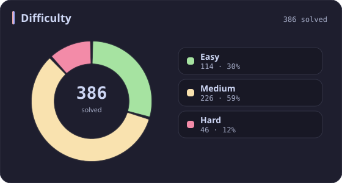
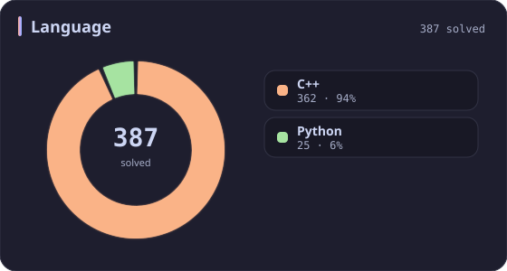
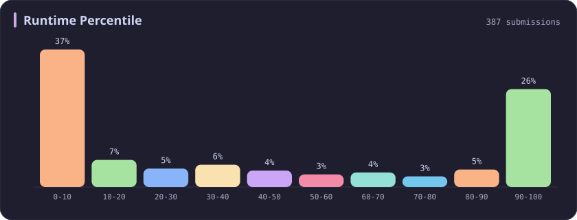
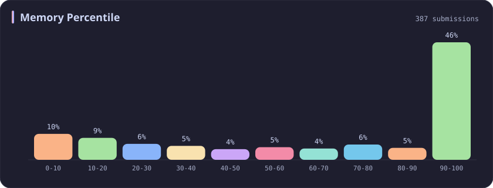

# Array Stats

[All stats](../../README.md)

**387** problems · updated `2026-09-05 03:36 UTC+8`

## Stats

### Difficulty

### Language

### Runtime Percentile

### Memory Percentile

### Topics

| Topic | # | Topic | # | Topic | # | Topic | # |
| :--- | ---: | :--- | ---: | :--- | ---: | :--- | ---: |
| **Array** | **387** | [Divide and Conquer](divide-and-conquer.md) | 16 | [Directed Acyclic Graph](directed-acyclic-graph.md) | 2 | [Range Minimum/Maximum Query](range-minimum-maximum-query.md) | 1 |
| [Hash Table](hash-table.md) | 168 | [Queue](queue.md) | 16 | [Quickselect](quickselect.md) | 2 | [Nim Game](nim-game.md) | 1 |
| [String](string.md) | 167 | [Trie](trie.md) | 11 | [Binary Lifting](binary-lifting.md) | 2 | [Impartial Game](impartial-game.md) | 1 |
| [Math](math.md) | 114 | [Binary Search Tree](binary-search-tree.md) | 11 | [Lowest Common Ancestor](lowest-common-ancestor.md) | 2 | [Binary Indexed Tree](binary-indexed-tree.md) | 1 |
| [Sorting](sorting.md) | 87 | [Monotonic Stack](monotonic-stack.md) | 10 | [Counting Sort](counting-sort.md) | 2 | [Sqrt Decomposition](sqrt-decomposition.md) | 1 |
| [Dynamic Programming](dynamic-programming.md) | 83 | [Number Theory](number-theory.md) | 10 | [Interactive](interactive.md) | 2 | [Complete Knapsack](complete-knapsack.md) | 1 |
| [Depth-First Search](depth-first-search.md) | 80 | [Ordered Set](ordered-set.md) | 8 | [Pigeonhole Principle](pigeonhole-principle.md) | 2 | [Reservoir Sampling](reservoir-sampling.md) | 1 |
| [Greedy](greedy.md) | 79 | [Combinatorics](combinatorics.md) | 7 | [Longest Increasing Subsequence](longest-increasing-subsequence.md) | 2 | [Bellman–Ford Algorithm](bellman-ford-algorithm.md) | 1 |
| [Two Pointers](two-pointers.md) | 70 | [Memoization](memoization.md) | 6 | [Segment Tree](segment-tree.md) | 2 | [Floyd–Warshall Algorithm](floyd-warshall-algorithm.md) | 1 |
| [Breadth-First Search](breadth-first-search.md) | 69 | [Data Stream](data-stream.md) | 6 | [Linear Algebra](linear-algebra.md) | 2 | [0-1 Knapsack](0-1-knapsack.md) | 1 |
| [Matrix](matrix.md) | 64 | [Shortest Path](shortest-path.md) | 6 | [Randomized](randomized.md) | 2 | [Aho–Corasick Algorithm](aho-corasick-algorithm.md) | 1 |
| [Binary Search](binary-search.md) | 63 | [Game Theory](game-theory.md) | 5 | [Heuristic Search](heuristic-search.md) | 2 | [Bidirectional Search](bidirectional-search.md) | 1 |
| [Tree](tree.md) | 60 | [Geometry](geometry.md) | 5 | [A* Search](a-search.md) | 2 | [Ternary Search](ternary-search.md) | 1 |
| [Binary Tree](binary-tree.md) | 50 | [Bracket Sequences](bracket-sequences.md) | 4 | [Hash Function](hash-function.md) | 2 | [Zero-Sum Game](zero-sum-game.md) | 1 |
| [Stack](stack.md) | 47 | [String Matching](string-matching.md) | 4 | [Greatest Common Divisor](greatest-common-divisor.md) | 2 | [Timsort](timsort.md) | 1 |
| [Prefix Sum](prefix-sum.md) | 46 | [Floyd's Cycle Finding Algorithm](floyd-s-cycle-finding-algorithm.md) | 4 | [Longest Common Subsequence](longest-common-subsequence.md) | 2 | [Radix Sort](radix-sort.md) | 1 |
| [Bit Manipulation](bit-manipulation.md) | 41 | [Topological Sort](topological-sort.md) | 4 | [Prime Factorization](prime-factorization.md) | 2 | [Triangulation](triangulation.md) | 1 |
| [Simulation](simulation.md) | 40 | [Monotonic Queue](monotonic-queue.md) | 4 | [Bitmask](bitmask.md) | 2 | [Euclidean Algorithm](euclidean-algorithm.md) | 1 |
| [Counting](counting.md) | 40 | [DP on Trees](dp-on-trees.md) | 4 | [Manacher](manacher.md) | 1 | [Minimum Spanning Tree](minimum-spanning-tree.md) | 1 |
| [Database](database.md) | 39 | [Brainteaser](brainteaser.md) | 4 | [Tournament Sort](tournament-sort.md) | 1 | [Doubly-Linked List](doubly-linked-list.md) | 1 |
| [Heap (Priority Queue)](heap-priority-queue.md) | 34 | [Polygons](polygons.md) | 4 | [Z Algorithm](z-algorithm.md) | 1 | [Least Common Multiple](least-common-multiple.md) | 1 |
| [Sliding Window](sliding-window.md) | 30 | [Merge Sort](merge-sort.md) | 3 | [Knuth–Morris–Pratt Algorithm](knuth-morris-pratt-algorithm.md) | 1 | [Fermat's Little Theorem](fermat-s-little-theorem.md) | 1 |
| [Linked List](linked-list.md) | 28 | [Algorithm X](algorithm-x.md) | 3 | [Boyer–Moore String-Search Algorithm](boyer-moore-string-search-algorithm.md) | 1 | [Kosaraju's Algorithm](kosaraju-s-algorithm.md) | 1 |
| [Graph Theory](graph-theory.md) | 27 | [Quicksort](quicksort.md) | 3 | [Dancing Links](dancing-links.md) | 1 | [Tarjan's SCC Algorithm](tarjan-s-scc-algorithm.md) | 1 |
| [Design](design.md) | 25 | [Minimax](minimax.md) | 3 | [Newton's Method](newton-s-method.md) | 1 | [Multiple Knapsack](multiple-knapsack.md) | 1 |
| [Recursion](recursion.md) | 21 | [Knapsack Problem](knapsack-problem.md) | 3 | [Bubble Sort](bubble-sort.md) | 1 | [Rolling Hash](rolling-hash.md) | 1 |
| [Backtracking](backtracking.md) | 18 | [Bucket Sort](bucket-sort.md) | 3 | [Primality Test](primality-test.md) | 1 |  |  |
| [Union-Find](union-find.md) | 17 | [Dijkstra's Algorithm](dijkstra-s-algorithm.md) | 3 | [Sieve Theory](sieve-theory.md) | 1 |  |  |
| [Enumeration](enumeration.md) | 17 | [Boyer–Moore Majority Vote Algorithm](boyer-moore-majority-vote-algorithm.md) | 2 | [Prime Number Sieve](prime-number-sieve.md) | 1 |  |  |

---

## Recent Activity

Latest **100** accepted submissions.

| Date | Title | Difficulty | Lang | Runtime | Memory |
| :--- | :--- | :---: | :---: | ---: | ---: |
| 2026&#8209;09&#8209;05 | [1464. Maximum Product of Two Elements in an Array](https://leetcode.com/problems/maximum-product-of-two-elements-in-an-array/) | Easy | C++ | 0 ms `100.00%` | 16.9 MB `5.69%` |
| 2026&#8209;09&#8209;05 | [1. Two Sum](https://leetcode.com/problems/two-sum/) | Easy | C++ | 3 ms `67.25%` | 14.8 MB `58.55%` |
| 2026&#8209;09&#8209;05 | [704. Binary Search](https://leetcode.com/problems/binary-search/) | Easy | C++ | 0 ms `100.00%` | 31.3 MB `81.38%` |
| 2026&#8209;09&#8209;04 | [3903. Smallest Stable Index I](https://leetcode.com/problems/smallest-stable-index-i/) | Easy | C++ | 0 ms `100.00%` | 31.5 MB `20.68%` |
| 2026&#8209;09&#8209;03 | [3876. Construct Uniform Parity Array II](https://leetcode.com/problems/construct-uniform-parity-array-ii/) | Medium | C++ | 7 ms `42.89%` | 165.7 MB `84.39%` |
| 2026&#8209;09&#8209;02 | [3875. Construct Uniform Parity Array I](https://leetcode.com/problems/construct-uniform-parity-array-i/) | Easy | C++ | 0 ms `100.00%` | 30.3 MB `27.31%` |
| 2026&#8209;08&#8209;20 | [308. Range Sum Query 2D - Mutable](https://leetcode.com/problems/range-sum-query-2d-mutable/) | Medium | C++ | 19 ms `58.17%` | 44.6 MB `11.30%` |
| 2026&#8209;08&#8209;20 | [3069. Distribute Elements Into Two Arrays I](https://leetcode.com/problems/distribute-elements-into-two-arrays-i/) | Easy | C++ | 0 ms `100.00%` | 24 MB `32.91%` |
| 2026&#8209;08&#8209;19 | [1386. Cinema Seat Allocation](https://leetcode.com/problems/cinema-seat-allocation/) | Medium | C++ | 125 ms `9.88%` | 84.2 MB `20.70%` |
| 2026&#8209;08&#8209;18 | [3471. Find the Largest Almost Missing Integer](https://leetcode.com/problems/find-the-largest-almost-missing-integer/) | Easy | C++ | 0 ms `100.00%` | 28.9 MB `92.57%` |
| 2026&#8209;08&#8209;18 | [877. Stone Game](https://leetcode.com/problems/stone-game/) | Medium | C++ | 12 ms `17.70%` | 19.8 MB `7.31%` |
| 2026&#8209;08&#8209;18 | [1563. Stone Game V](https://leetcode.com/problems/stone-game-v/) | Hard | C++ | 407 ms `57.19%` | 27.6 MB `46.96%` |
| 2026&#8209;08&#8209;13 | [286. Walls and Gates](https://leetcode.com/problems/walls-and-gates/) | Medium | C++ | 7 ms `44.44%` | 19 MB `83.33%` |
| 2026&#8209;06&#8209;09 | [2161. Partition Array According to Given Pivot](https://leetcode.com/problems/partition-array-according-to-given-pivot/) | Medium | C++ | 7 ms `58.96%` | 139.4 MB `16.25%` |
| 2026&#8209;06&#8209;06 | [3952. Maximum Total Value of Covered Indices](https://leetcode.com/problems/maximum-total-value-of-covered-indices/) | Medium | C++ | 127 ms `33.96%` | 236.8 MB `31.46%` |
| 2026&#8209;06&#8209;06 | [3951. Minimum Energy to Maintain Brightness](https://leetcode.com/problems/minimum-energy-to-maintain-brightness/) | Medium | C++ | 74 ms `83.55%` | 203.6 MB `61.06%` |
| 2026&#8209;06&#8209;06 | [2574. Left and Right Sum Differences](https://leetcode.com/problems/left-and-right-sum-differences/) | Easy | C++ | 0 ms `100.00%` | 15.2 MB `41.89%` |
| 2026&#8209;06&#8209;04 | [723. Candy Crush](https://leetcode.com/problems/candy-crush/) | Medium | C++ | 4 ms `61.92%` | 14.4 MB `20.92%` |
| 2026&#8209;05&#8209;24 | [3942. Minimum Operations to Sort a Permutation](https://leetcode.com/problems/minimum-operations-to-sort-a-permutation/) | Medium | C++ | 15 ms `10.97%` | 156.1 MB `8.67%` |
| 2026&#8209;05&#8209;24 | [3940. Limit Occurrences in Sorted Array](https://leetcode.com/problems/limit-occurrences-in-sorted-array/) | Easy | C++ | 0 ms `100.00%` | 34.2 MB `8.37%` |
| 2026&#8209;05&#8209;23 | [3938. Maximum Path Intersection Sum in a Grid](https://leetcode.com/problems/maximum-path-intersection-sum-in-a-grid/) | Medium | C++ | 72 ms `9.23%` | 185.7 MB `5.00%` |
| 2026&#8209;05&#8209;23 | [3937. Minimum Operations to Make Array Modulo Alternating I](https://leetcode.com/problems/minimum-operations-to-make-array-modulo-alternating-i/) | Medium | C++ | 7 ms `79.04%` | 25.4 MB `15.30%` |
| 2026&#8209;05&#8209;23 | [3936. Minimum Swaps to Move Zeros to End](https://leetcode.com/problems/minimum-swaps-to-move-zeros-to-end/) | Easy | Python | 0 ms `100.00%` | 19.2 MB `57.55%` |
| 2026&#8209;05&#8209;23 | [2744. Find Maximum Number of String Pairs](https://leetcode.com/problems/find-maximum-number-of-string-pairs/) | Easy | Python | 15 ms `8.76%` | 19.3 MB `18.79%` |
| 2026&#8209;05&#8209;23 | [1752. Check if Array Is Sorted and Rotated](https://leetcode.com/problems/check-if-array-is-sorted-and-rotated/) | Easy | C++ | 0 ms `100.00%` | 11.4 MB `19.48%` |
| 2026&#8209;05&#8209;22 | [33. Search in Rotated Sorted Array](https://leetcode.com/problems/search-in-rotated-sorted-array/) | Medium | C++ | 0 ms `100.00%` | 15 MB `96.75%` |
| 2026&#8209;05&#8209;21 | [3043. Find the Length of the Longest Common Prefix](https://leetcode.com/problems/find-the-length-of-the-longest-common-prefix/) | Medium | C++ | 374 ms `18.26%` | 156.5 MB `52.60%` |
| 2026&#8209;05&#8209;20 | [2061. Number of Spaces Cleaning Robot Cleaned](https://leetcode.com/problems/number-of-spaces-cleaning-robot-cleaned/) | Medium | C++ | 65 ms `26.67%` | 54 MB `26.67%` |
| 2026&#8209;05&#8209;20 | [2657. Find the Prefix Common Array of Two Arrays](https://leetcode.com/problems/find-the-prefix-common-array-of-two-arrays/) | Medium | C++ | 0 ms `100.00%` | 85.9 MB `74.63%` |
| 2026&#8209;05&#8209;19 | [2540. Minimum Common Value](https://leetcode.com/problems/minimum-common-value/) | Easy | C++ | 0 ms `100.00%` | 54.6 MB `26.20%` |
| 2026&#8209;03&#8209;25 | [3546. Equal Sum Grid Partition I](https://leetcode.com/problems/equal-sum-grid-partition-i/) | Medium | C++ | 12 ms `34.01%` | 130.2 MB `100.00%` |
| 2026&#8209;02&#8209;10 | [3719. Longest Balanced Subarray I](https://leetcode.com/problems/longest-balanced-subarray-i/) | Medium | C++ | 151 ms `89.04%` | 35.7 MB `94.90%` |
| 2026&#8209;02&#8209;06 | [3634. Minimum Removals to Balance Array](https://leetcode.com/problems/minimum-removals-to-balance-array/) | Medium | C++ | 31 ms `62.90%` | 105 MB `86.33%` |
| 2026&#8209;02&#8209;05 | [3379. Transformed Array](https://leetcode.com/problems/transformed-array/) | Easy | C++ | 4 ms `78.48%` | 25.8 MB `9.70%` |
| 2025&#8209;10&#8209;16 | [2598. Smallest Missing Non-negative Integer After Operations](https://leetcode.com/problems/smallest-missing-non-negative-integer-after-operations/) | Medium | C++ | 169 ms `13.05%` | 138.6 MB `45.43%` |
| 2025&#8209;10&#8209;15 | [3350. Adjacent Increasing Subarrays Detection II](https://leetcode.com/problems/adjacent-increasing-subarrays-detection-ii/) | Medium | C++ | 282 ms `8.37%` | 219.4 MB `6.08%` |
| 2025&#8209;10&#8209;14 | [3349. Adjacent Increasing Subarrays Detection I](https://leetcode.com/problems/adjacent-increasing-subarrays-detection-i/) | Easy | C++ | 13 ms `51.08%` | 40.4 MB `54.98%` |
| 2025&#8209;10&#8209;13 | [2273. Find Resultant Array After Removing Anagrams](https://leetcode.com/problems/find-resultant-array-after-removing-anagrams/) | Easy | C++ | 3 ms `45.53%` | 17.9 MB `24.76%` |
| 2025&#8209;10&#8209;12 | [3539. Find Sum of Array Product of Magical Sequences](https://leetcode.com/problems/find-sum-of-array-product-of-magical-sequences/) | Hard | Python | 411 ms `97.50%` | 33.9 MB `70.00%` |
| 2025&#8209;10&#8209;12 | [3715. Sum of Perfect Square Ancestors](https://leetcode.com/problems/sum-of-perfect-square-ancestors/) | Hard | C++ | 1461 ms `21.09%` | 383.2 MB `25.85%` |
| 2025&#8209;10&#8209;12 | [3712. Sum of Elements With Frequency Divisible by K](https://leetcode.com/problems/sum-of-elements-with-frequency-divisible-by-k/) | Easy | C++ | 0 ms `100.00%` | 26.4 MB `12.32%` |
| 2025&#8209;10&#8209;12 | [3147. Taking Maximum Energy From the Mystic Dungeon](https://leetcode.com/problems/taking-maximum-energy-from-the-mystic-dungeon/) | Medium | C++ | 141 ms `82.37%` | 151.8 MB `100.00%` |
| 2025&#8209;10&#8209;12 | [3186. Maximum Total Damage With Spell Casting](https://leetcode.com/problems/maximum-total-damage-with-spell-casting/) | Medium | C++ | 111 ms `86.08%` | 162.8 MB `90.83%` |
| 2025&#8209;10&#8209;11 | [3710. Maximum Partition Factor](https://leetcode.com/problems/maximum-partition-factor/) | Hard | C++ | 1245 ms `35.15%` | 336.4 MB `37.63%` |
| 2025&#8209;10&#8209;11 | [3708. Longest Fibonacci Subarray](https://leetcode.com/problems/longest-fibonacci-subarray/) | Medium | C++ | 0 ms `100.00%` | 102.8 MB `45.05%` |
| 2025&#8209;10&#8209;09 | [3494. Find the Minimum Amount of Time to Brew Potions](https://leetcode.com/problems/find-the-minimum-amount-of-time-to-brew-potions/) | Medium | C++ | 575 ms `18.46%` | 407.4 MB `15.38%` |
| 2025&#8209;10&#8209;08 | [774. Minimize Max Distance to Gas Station](https://leetcode.com/problems/minimize-max-distance-to-gas-station/) | Hard | C++ | 9 ms `66.90%` | 18 MB `8.45%` |
| 2025&#8209;10&#8209;08 | [2300. Successful Pairs of Spells and Potions](https://leetcode.com/problems/successful-pairs-of-spells-and-potions/) | Medium | C++ | 47 ms `42.48%` | 138.4 MB `8.28%` |
| 2025&#8209;10&#8209;07 | [1488. Avoid Flood in The City](https://leetcode.com/problems/avoid-flood-in-the-city/) | Medium | C++ | 216 ms `21.79%` | 121.2 MB `100.00%` |
| 2025&#8209;10&#8209;06 | [778. Swim in Rising Water](https://leetcode.com/problems/swim-in-rising-water/) | Hard | C++ | 34 ms `7.85%` | 17.1 MB `10.48%` |
| 2025&#8209;10&#8209;05 | [417. Pacific Atlantic Water Flow](https://leetcode.com/problems/pacific-atlantic-water-flow/) | Medium | C++ | 4 ms `76.47%` | 22.2 MB `76.03%` |
| 2025&#8209;10&#8209;04 | [11. Container With Most Water](https://leetcode.com/problems/container-with-most-water/) | Medium | C++ | 0 ms `100.00%` | 62.8 MB `79.30%` |
| 2025&#8209;10&#8209;03 | [407. Trapping Rain Water II](https://leetcode.com/problems/trapping-rain-water-ii/) | Hard | C++ | 34 ms `43.03%` | 22.7 MB `32.34%` |
| 2025&#8209;09&#8209;30 | [2221. Find Triangular Sum of an Array](https://leetcode.com/problems/find-triangular-sum-of-an-array/) | Medium | C++ | 431 ms `5.07%` | 384.5 MB `5.28%` |
| 2025&#8209;09&#8209;29 | [1121. Divide Array Into Increasing Sequences](https://leetcode.com/problems/divide-array-into-increasing-sequences/) | Hard | C++ | 95 ms `41.67%` | 107.6 MB `33.33%` |
| 2025&#8209;09&#8209;29 | [1039. Minimum Score Triangulation of Polygon](https://leetcode.com/problems/minimum-score-triangulation-of-polygon/) | Medium | C++ | 5 ms `10.47%` | 11.4 MB `15.89%` |
| 2025&#8209;09&#8209;28 | [976. Largest Perimeter Triangle](https://leetcode.com/problems/largest-perimeter-triangle/) | Easy | C++ | 12 ms `25.68%` | 25.6 MB `79.00%` |
| 2025&#8209;09&#8209;28 | [3698. Split Array With Minimum Difference](https://leetcode.com/problems/split-array-with-minimum-difference/) | Medium | C++ | 0 ms `100.00%` | 169.6 MB `94.85%` |
| 2025&#8209;09&#8209;28 | [3697. Compute Decimal Representation](https://leetcode.com/problems/compute-decimal-representation/) | Easy | C++ | 0 ms `100.00%` | 9.8 MB `33.26%` |
| 2025&#8209;09&#8209;27 | [3695. Maximize Alternating Sum Using Swaps](https://leetcode.com/problems/maximize-alternating-sum-using-swaps/) | Hard | C++ | 294 ms `56.92%` | 341.9 MB `32.45%` |
| 2025&#8209;09&#8209;27 | [3693. Climbing Stairs II](https://leetcode.com/problems/climbing-stairs-ii/) | Medium | C++ | 20 ms `54.23%` | 177.8 MB `64.31%` |
| 2025&#8209;09&#8209;27 | [3690. Split and Merge Array Transformation](https://leetcode.com/problems/split-and-merge-array-transformation/) | Medium | C++ | 1672 ms `7.57%` | 432.5 MB `21.01%` |
| 2025&#8209;09&#8209;27 | [3689. Maximum Total Subarray Value I](https://leetcode.com/problems/maximum-total-subarray-value-i/) | Medium | C++ | 5 ms `15.46%` | 103.6 MB `97.34%` |
| 2025&#8209;09&#8209;27 | [3688. Bitwise OR of Even Numbers in an Array](https://leetcode.com/problems/bitwise-or-of-even-numbers-in-an-array/) | Easy | C++ | 0 ms `100.00%` | 24.5 MB `71.15%` |
| 2025&#8209;09&#8209;27 | [812. Largest Triangle Area](https://leetcode.com/problems/largest-triangle-area/) | Easy | C++ | 0 ms `100.00%` | 10.6 MB `7.20%` |
| 2025&#8209;09&#8209;26 | [1152. Analyze User Website Visit Pattern](https://leetcode.com/problems/analyze-user-website-visit-pattern/) | Medium | C++ | 55 ms `19.05%` | 26.6 MB `42.86%` |
| 2025&#8209;09&#8209;26 | [611. Valid Triangle Number](https://leetcode.com/problems/valid-triangle-number/) | Medium | C++ | 430 ms `8.62%` | 16.8 MB `10.43%` |
| 2025&#8209;09&#8209;25 | [120. Triangle](https://leetcode.com/problems/triangle/) | Medium | C++ | 0 ms `100.00%` | 13.9 MB `5.01%` |
| 2025&#8209;09&#8209;22 | [3005. Count Elements With Maximum Frequency](https://leetcode.com/problems/count-elements-with-maximum-frequency/) | Easy | C++ | 0 ms `100.00%` | 23.6 MB `8.88%` |
| 2025&#8209;09&#8209;21 | [1912. Design Movie Rental System](https://leetcode.com/problems/design-movie-rental-system/) | Hard | C++ | 333 ms `34.71%` | 444.6 MB `8.94%` |
| 2025&#8209;09&#8209;21 | [3508. Implement Router](https://leetcode.com/problems/implement-router/) | Medium | C++ | 190 ms `82.01%` | 415.1 MB `99.28%` |
| 2025&#8209;09&#8209;20 | [3484. Design Spreadsheet](https://leetcode.com/problems/design-spreadsheet/) | Medium | Python | 57 ms `96.77%` | 23.5 MB `100.00%` |
| 2025&#8209;09&#8209;17 | [2353. Design a Food Rating System](https://leetcode.com/problems/design-a-food-rating-system/) | Medium | C++ | 164 ms `34.81%` | 162.7 MB `91.36%` |
| 2025&#8209;09&#8209;16 | [1150. Check If a Number Is Majority Element in a Sorted Array](https://leetcode.com/problems/check-if-a-number-is-majority-element-in-a-sorted-array/) | Easy | Python | 0 ms `100.00%` | 18 MB `100.00%` |
| 2025&#8209;09&#8209;16 | [2197. Replace Non-Coprime Numbers in Array](https://leetcode.com/problems/replace-non-coprime-numbers-in-array/) | Hard | C++ | 2138 ms `5.26%` | 306.9 MB `5.26%` |
| 2025&#8209;09&#8209;14 | [966. Vowel Spellchecker](https://leetcode.com/problems/vowel-spellchecker/) | Medium | C++ | 37 ms `68.34%` | 41.6 MB `55.21%` |
| 2025&#8209;09&#8209;10 | [1133. Largest Unique Number](https://leetcode.com/problems/largest-unique-number/) | Easy | C++ | 0 ms `100.00%` | 12.2 MB `95.53%` |
| 2025&#8209;09&#8209;10 | [1733. Minimum Number of People to Teach](https://leetcode.com/problems/minimum-number-of-people-to-teach/) | Medium | C++ | 35 ms `82.77%` | 67.6 MB `68.42%` |
| 2025&#8209;09&#8209;07 | [1304. Find N Unique Integers Sum up to Zero](https://leetcode.com/problems/find-n-unique-integers-sum-up-to-zero/) | Easy | Python | 3 ms `4.43%` | 17.9 MB `100.00%` |
| 2025&#8209;09&#8209;06 | [3495. Minimum Operations to Make Array Elements Zero](https://leetcode.com/problems/minimum-operations-to-make-array-elements-zero/) | Hard | C++ | 7 ms `87.50%` | 183.2 MB `73.61%` |
| 2025&#8209;09&#8209;03 | [3027. Find the Number of Ways to Place People II](https://leetcode.com/problems/find-the-number-of-ways-to-place-people-ii/) | Hard | C++ | 221 ms `15.38%` | 47.6 MB `5.77%` |
| 2025&#8209;09&#8209;02 | [3025. Find the Number of Ways to Place People I](https://leetcode.com/problems/find-the-number-of-ways-to-place-people-i/) | Medium | C++ | 19 ms `25.00%` | 32.7 MB `28.24%` |
| 2025&#8209;09&#8209;01 | [1792. Maximum Average Pass Ratio](https://leetcode.com/problems/maximum-average-pass-ratio/) | Medium | C++ | 273 ms `89.50%` | 97.9 MB `69.41%` |
| 2025&#8209;08&#8209;31 | [37. Sudoku Solver](https://leetcode.com/problems/sudoku-solver/) | Hard | C++ | 46 ms `97.76%` | 8.7 MB `97.42%` |
| 2025&#8209;08&#8209;30 | [36. Valid Sudoku](https://leetcode.com/problems/valid-sudoku/) | Medium | C++ | 0 ms `100.00%` | 22.7 MB `57.13%` |
| 2025&#8209;08&#8209;28 | [3446. Sort Matrix by Diagonals](https://leetcode.com/problems/sort-matrix-by-diagonals/) | Medium | C++ | 4 ms `84.97%` | 43.3 MB `86.76%` |
| 2025&#8209;08&#8209;27 | [1181. Before and After Puzzle](https://leetcode.com/problems/before-and-after-puzzle/) | Medium | Python | 15 ms `5.56%` | 18.2 MB `100.00%` |
| 2025&#8209;08&#8209;27 | [3459. Length of Longest V-Shaped Diagonal Segment](https://leetcode.com/problems/length-of-longest-v-shaped-diagonal-segment/) | Hard | C++ | 231 ms `91.38%` | 111.8 MB `52.16%` |
| 2025&#8209;08&#8209;26 | [3000. Maximum Area of Longest Diagonal Rectangle](https://leetcode.com/problems/maximum-area-of-longest-diagonal-rectangle/) | Easy | C++ | 1 ms `15.78%` | 29.8 MB `13.11%` |
| 2025&#8209;08&#8209;25 | [498. Diagonal Traverse](https://leetcode.com/problems/diagonal-traverse/) | Medium | C++ | 0 ms `100.00%` | 22.8 MB `70.10%` |
| 2025&#8209;06&#8209;19 | [2294. Partition Array Such That Maximum Difference Is K](https://leetcode.com/problems/partition-array-such-that-maximum-difference-is-k/) | Medium | C++ | 35 ms `76.66%` | 87 MB `100.00%` |
| 2025&#8209;06&#8209;18 | [2966. Divide Array Into Arrays With Max Difference](https://leetcode.com/problems/divide-array-into-arrays-with-max-difference/) | Medium | C++ | 115 ms `13.42%` | 126.1 MB `18.08%` |
| 2025&#8209;06&#8209;16 | [2016. Maximum Difference Between Increasing Elements](https://leetcode.com/problems/maximum-difference-between-increasing-elements/) | Easy | Python | 0 ms `100.00%` | 17.9 MB `100.00%` |
| 2025&#8209;06&#8209;13 | [2616. Minimize the Maximum Difference of Pairs](https://leetcode.com/problems/minimize-the-maximum-difference-of-pairs/) | Medium | C++ | 30 ms `30.34%` | 86.8 MB `50.70%` |
| 2025&#8209;06&#8209;13 | [3423. Maximum Difference Between Adjacent Elements in a Circular Array](https://leetcode.com/problems/maximum-difference-between-adjacent-elements-in-a-circular-array/) | Easy | Python | 3 ms `42.01%` | 17.8 MB `100.00%` |
| 2025&#8209;06&#8209;03 | [1298. Maximum Candies You Can Get from Boxes](https://leetcode.com/problems/maximum-candies-you-can-get-from-boxes/) | Hard | C++ | 8 ms `43.38%` | 44.5 MB `100.00%` |
| 2025&#8209;06&#8209;02 | [135. Candy](https://leetcode.com/problems/candy/) | Hard | C++ | 4 ms `28.57%` | 22.9 MB `69.10%` |
| 2025&#8209;06&#8209;01 | [909. Snakes and Ladders](https://leetcode.com/problems/snakes-and-ladders/) | Medium | C++ | 0 ms `100.00%` | 16.9 MB `67.49%` |
| 2025&#8209;05&#8209;29 | [3068. Find the Maximum Sum of Node Values](https://leetcode.com/problems/find-the-maximum-sum-of-node-values/) | Hard | C++ | 111 ms `11.83%` | 158 MB `11.26%` |
| 2025&#8209;05&#8209;25 | [2131. Longest Palindrome by Concatenating Two Letter Words](https://leetcode.com/problems/longest-palindrome-by-concatenating-two-letter-words/) | Medium | C++ | 27 ms `88.02%` | 171.9 MB `78.72%` |
