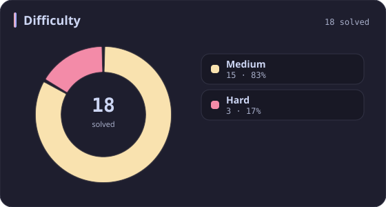
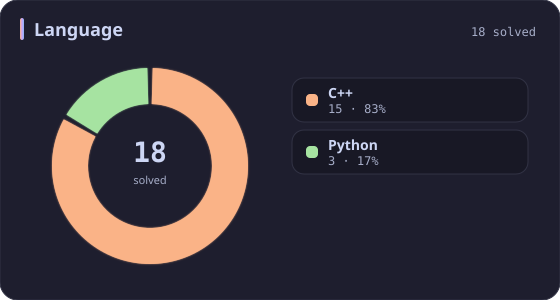
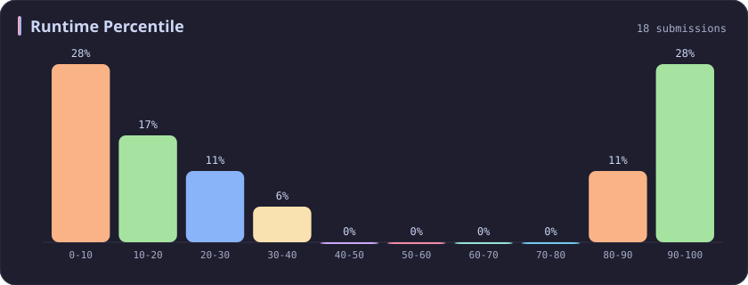
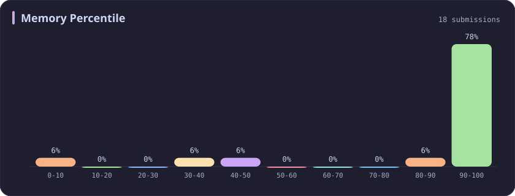
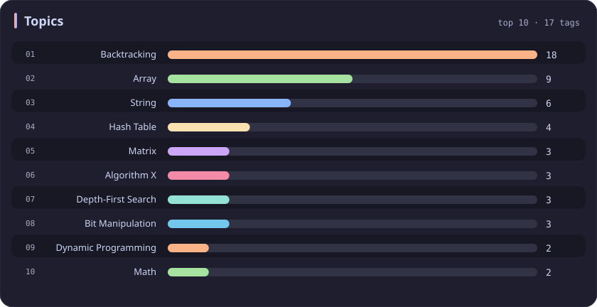

# Backtracking Stats

[All stats](../../README.md)

**18** problems · updated `2026-09-04 19:10 UTC`

## Stats

### Difficulty

### Language

### Runtime Percentile

### Memory Percentile

### Topics

| Topic | # | Topic | # | Topic | # | Topic | # |
| :--- | ---: | :--- | ---: | :--- | ---: | :--- | ---: |
| [Array](array.md) | 386 | [Divide and Conquer](divide-and-conquer.md) | 16 | [Directed Acyclic Graph](directed-acyclic-graph.md) | 2 | [Range Minimum/Maximum Query](range-minimum-maximum-query.md) | 1 |
| [Hash Table](hash-table.md) | 168 | [Queue](queue.md) | 16 | [Quickselect](quickselect.md) | 2 | [Nim Game](nim-game.md) | 1 |
| [String](string.md) | 167 | [Trie](trie.md) | 11 | [Binary Lifting](binary-lifting.md) | 2 | [Impartial Game](impartial-game.md) | 1 |
| [Math](math.md) | 114 | [Binary Search Tree](binary-search-tree.md) | 11 | [Lowest Common Ancestor](lowest-common-ancestor.md) | 2 | [Binary Indexed Tree](binary-indexed-tree.md) | 1 |
| [Sorting](sorting.md) | 86 | [Monotonic Stack](monotonic-stack.md) | 10 | [Counting Sort](counting-sort.md) | 2 | [Sqrt Decomposition](sqrt-decomposition.md) | 1 |
| [Dynamic Programming](dynamic-programming.md) | 83 | [Number Theory](number-theory.md) | 10 | [Interactive](interactive.md) | 2 | [Complete Knapsack](complete-knapsack.md) | 1 |
| [Depth-First Search](depth-first-search.md) | 80 | [Ordered Set](ordered-set.md) | 8 | [Pigeonhole Principle](pigeonhole-principle.md) | 2 | [Reservoir Sampling](reservoir-sampling.md) | 1 |
| [Greedy](greedy.md) | 79 | [Combinatorics](combinatorics.md) | 7 | [Longest Increasing Subsequence](longest-increasing-subsequence.md) | 2 | [Bellman–Ford Algorithm](bellman-ford-algorithm.md) | 1 |
| [Two Pointers](two-pointers.md) | 70 | [Memoization](memoization.md) | 6 | [Segment Tree](segment-tree.md) | 2 | [Floyd–Warshall Algorithm](floyd-warshall-algorithm.md) | 1 |
| [Breadth-First Search](breadth-first-search.md) | 69 | [Data Stream](data-stream.md) | 6 | [Linear Algebra](linear-algebra.md) | 2 | [0-1 Knapsack](0-1-knapsack.md) | 1 |
| [Matrix](matrix.md) | 64 | [Shortest Path](shortest-path.md) | 6 | [Randomized](randomized.md) | 2 | [Aho–Corasick Algorithm](aho-corasick-algorithm.md) | 1 |
| [Binary Search](binary-search.md) | 63 | [Game Theory](game-theory.md) | 5 | [Heuristic Search](heuristic-search.md) | 2 | [Bidirectional Search](bidirectional-search.md) | 1 |
| [Tree](tree.md) | 60 | [Geometry](geometry.md) | 5 | [A* Search](a-search.md) | 2 | [Ternary Search](ternary-search.md) | 1 |
| [Binary Tree](binary-tree.md) | 50 | [Bracket Sequences](bracket-sequences.md) | 4 | [Hash Function](hash-function.md) | 2 | [Zero-Sum Game](zero-sum-game.md) | 1 |
| [Stack](stack.md) | 47 | [String Matching](string-matching.md) | 4 | [Greatest Common Divisor](greatest-common-divisor.md) | 2 | [Timsort](timsort.md) | 1 |
| [Prefix Sum](prefix-sum.md) | 46 | [Floyd's Cycle Finding Algorithm](floyd-s-cycle-finding-algorithm.md) | 4 | [Longest Common Subsequence](longest-common-subsequence.md) | 2 | [Radix Sort](radix-sort.md) | 1 |
| [Bit Manipulation](bit-manipulation.md) | 41 | [Topological Sort](topological-sort.md) | 4 | [Prime Factorization](prime-factorization.md) | 2 | [Triangulation](triangulation.md) | 1 |
| [Simulation](simulation.md) | 40 | [Monotonic Queue](monotonic-queue.md) | 4 | [Bitmask](bitmask.md) | 2 | [Euclidean Algorithm](euclidean-algorithm.md) | 1 |
| [Counting](counting.md) | 40 | [DP on Trees](dp-on-trees.md) | 4 | [Manacher](manacher.md) | 1 | [Minimum Spanning Tree](minimum-spanning-tree.md) | 1 |
| [Database](database.md) | 39 | [Brainteaser](brainteaser.md) | 4 | [Tournament Sort](tournament-sort.md) | 1 | [Doubly-Linked List](doubly-linked-list.md) | 1 |
| [Heap (Priority Queue)](heap-priority-queue.md) | 33 | [Polygons](polygons.md) | 4 | [Z Algorithm](z-algorithm.md) | 1 | [Least Common Multiple](least-common-multiple.md) | 1 |
| [Sliding Window](sliding-window.md) | 30 | [Merge Sort](merge-sort.md) | 3 | [Knuth–Morris–Pratt Algorithm](knuth-morris-pratt-algorithm.md) | 1 | [Fermat's Little Theorem](fermat-s-little-theorem.md) | 1 |
| [Linked List](linked-list.md) | 28 | [Algorithm X](algorithm-x.md) | 3 | [Boyer–Moore String-Search Algorithm](boyer-moore-string-search-algorithm.md) | 1 | [Kosaraju's Algorithm](kosaraju-s-algorithm.md) | 1 |
| [Graph Theory](graph-theory.md) | 27 | [Quicksort](quicksort.md) | 3 | [Dancing Links](dancing-links.md) | 1 | [Tarjan's SCC Algorithm](tarjan-s-scc-algorithm.md) | 1 |
| [Design](design.md) | 25 | [Minimax](minimax.md) | 3 | [Newton's Method](newton-s-method.md) | 1 | [Multiple Knapsack](multiple-knapsack.md) | 1 |
| [Recursion](recursion.md) | 21 | [Knapsack Problem](knapsack-problem.md) | 3 | [Bubble Sort](bubble-sort.md) | 1 | [Rolling Hash](rolling-hash.md) | 1 |
| **Backtracking** | **18** | [Bucket Sort](bucket-sort.md) | 3 | [Primality Test](primality-test.md) | 1 |  |  |
| [Union-Find](union-find.md) | 17 | [Dijkstra's Algorithm](dijkstra-s-algorithm.md) | 3 | [Sieve Theory](sieve-theory.md) | 1 |  |  |
| [Enumeration](enumeration.md) | 17 | [Boyer–Moore Majority Vote Algorithm](boyer-moore-majority-vote-algorithm.md) | 2 | [Prime Number Sieve](prime-number-sieve.md) | 1 |  |  |

---

## Recent Activity

Latest **18** accepted submissions.

| Date | # | Title | Difficulty | Lang | Runtime | Memory |
| :--- | ---: | :--- | :---: | :---: | ---: | ---: |
| 2025-08-31 | 37 | [Sudoku Solver](https://leetcode.com/problems/sudoku-solver/) | Hard | C++ | 46 ms `97.76%` | 8.7 MB `97.42%` |
| 2025-04-23 | 216 | [Combination Sum III](https://leetcode.com/problems/combination-sum-iii/) | Medium | Python | 3 ms `19.31%` | 18 MB `100.00%` |
| 2025-04-23 | 17 | [Letter Combinations of a Phone Number](https://leetcode.com/problems/letter-combinations-of-a-phone-number/) | Medium | Python | 0 ms `100.00%` | 17.7 MB `100.00%` |
| 2024-10-22 | 2664 | [The Knight’s Tour](https://leetcode.com/problems/the-knights-tour/) | Medium | C++ | 71 ms `85.71%` | 7.7 MB `100.00%` |
| 2024-10-21 | 1593 | [Split a String Into the Max Number of Unique Substrings](https://leetcode.com/problems/split-a-string-into-the-max-number-of-unique-substrings/) | Medium | Python | 1706 ms `5.01%` | 29.9 MB `8.46%` |
| 2024-10-18 | 2044 | [Count Number of Maximum Bitwise-OR Subsets](https://leetcode.com/problems/count-number-of-maximum-bitwise-or-subsets/) | Medium | C++ | 7 ms `87.67%` | 10.1 MB `100.00%` |
| 2024-04-17 | 988 | [Smallest String Starting From Leaf](https://leetcode.com/problems/smallest-string-starting-from-leaf/) | Medium | C++ | 10 ms `6.63%` | 20.4 MB `100.00%` |
| 2024-04-03 | 79 | [Word Search](https://leetcode.com/problems/word-search/) | Medium | C++ | 375 ms `39.57%` | 10.8 MB `49.28%` |
| 2024-03-24 | 113 | [Path Sum II](https://leetcode.com/problems/path-sum-ii/) | Medium | C++ | 8 ms `27.27%` | 18.8 MB `99.98%` |
| 2023-03-19 | 2597 | [The Number of Beautiful Subsets](https://leetcode.com/problems/the-number-of-beautiful-subsets/) | Medium | C++ | 801 ms `28.10%` | 34 MB `100.00%` |
| 2023-03-13 | 77 | [Combinations](https://leetcode.com/problems/combinations/) | Medium | C++ | 7 ms `100.00%` | 9.9 MB `100.00%` |
| 2023-03-13 | 784 | [Letter Case Permutation](https://leetcode.com/problems/letter-case-permutation/) | Medium | C++ | 9 ms `5.58%` | 10.5 MB `100.00%` |
| 2023-03-13 | 46 | [Permutations](https://leetcode.com/problems/permutations/) | Medium | C++ | 0 ms `100.00%` | 7.7 MB `100.00%` |
| 2023-02-28 | 89 | [Gray Code](https://leetcode.com/problems/gray-code/) | Medium | C++ | 15 ms `5.23%` | 13.6 MB `99.98%` |
| 2023-02-22 | 39 | [Combination Sum](https://leetcode.com/problems/combination-sum/) | Medium | C++ | 37 ms `12.78%` | 15.4 MB `30.14%` |
| 2023-02-17 | 52 | [N-Queens II](https://leetcode.com/problems/n-queens-ii/) | Hard | C++ | 0 ms `100.00%` | 6.1 MB `100.00%` |
| 2023-02-17 | 51 | [N-Queens](https://leetcode.com/problems/n-queens/) | Hard | C++ | 7 ms `16.31%` | 8.4 MB `100.00%` |
| 2023-02-16 | 22 | [Generate Parentheses](https://leetcode.com/problems/generate-parentheses/) | Medium | C++ | 14 ms `6.05%` | 13 MB `82.22%` |
