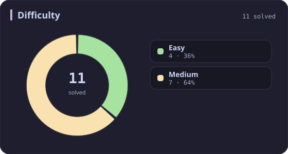
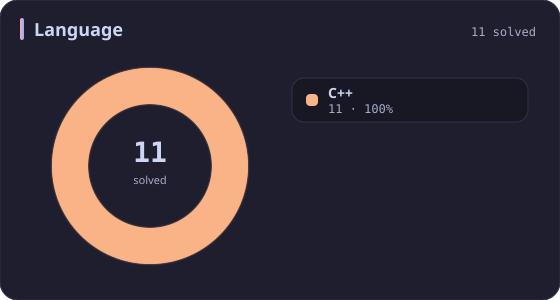
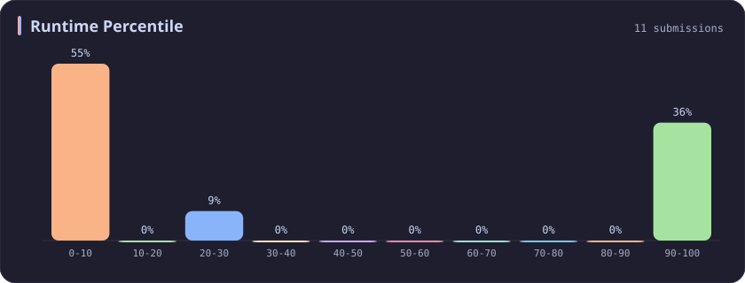
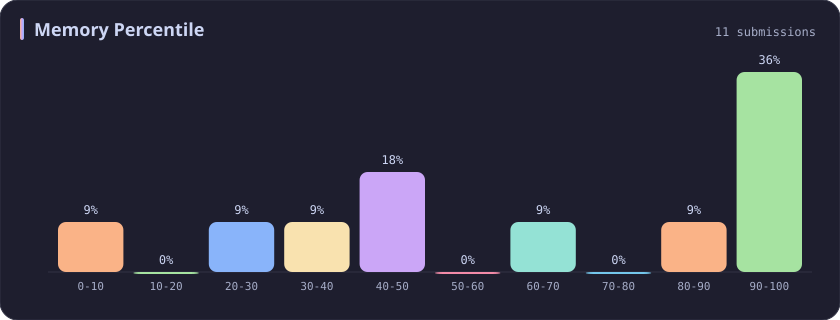
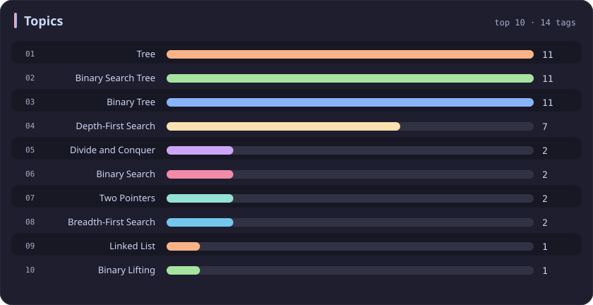

# Binary Search Tree Stats

[All stats](../../README.md)

**11** problems · updated `2026-09-04 19:14 UTC`

## Stats

### Difficulty

### Language

### Runtime Percentile

### Memory Percentile

### Topics

| Topic | # | Topic | # | Topic | # | Topic | # |
| :--- | ---: | :--- | ---: | :--- | ---: | :--- | ---: |
| [Array](array.md) | 386 | [Divide and Conquer](divide-and-conquer.md) | 16 | [Directed Acyclic Graph](directed-acyclic-graph.md) | 2 | [Range Minimum/Maximum Query](range-minimum-maximum-query.md) | 1 |
| [Hash Table](hash-table.md) | 168 | [Queue](queue.md) | 16 | [Quickselect](quickselect.md) | 2 | [Nim Game](nim-game.md) | 1 |
| [String](string.md) | 167 | [Trie](trie.md) | 11 | [Binary Lifting](binary-lifting.md) | 2 | [Impartial Game](impartial-game.md) | 1 |
| [Math](math.md) | 114 | **Binary Search Tree** | **11** | [Lowest Common Ancestor](lowest-common-ancestor.md) | 2 | [Binary Indexed Tree](binary-indexed-tree.md) | 1 |
| [Sorting](sorting.md) | 86 | [Monotonic Stack](monotonic-stack.md) | 10 | [Counting Sort](counting-sort.md) | 2 | [Sqrt Decomposition](sqrt-decomposition.md) | 1 |
| [Dynamic Programming](dynamic-programming.md) | 83 | [Number Theory](number-theory.md) | 10 | [Interactive](interactive.md) | 2 | [Complete Knapsack](complete-knapsack.md) | 1 |
| [Depth-First Search](depth-first-search.md) | 80 | [Ordered Set](ordered-set.md) | 8 | [Pigeonhole Principle](pigeonhole-principle.md) | 2 | [Reservoir Sampling](reservoir-sampling.md) | 1 |
| [Greedy](greedy.md) | 79 | [Combinatorics](combinatorics.md) | 7 | [Longest Increasing Subsequence](longest-increasing-subsequence.md) | 2 | [Bellman–Ford Algorithm](bellman-ford-algorithm.md) | 1 |
| [Two Pointers](two-pointers.md) | 70 | [Memoization](memoization.md) | 6 | [Segment Tree](segment-tree.md) | 2 | [Floyd–Warshall Algorithm](floyd-warshall-algorithm.md) | 1 |
| [Breadth-First Search](breadth-first-search.md) | 69 | [Data Stream](data-stream.md) | 6 | [Linear Algebra](linear-algebra.md) | 2 | [0-1 Knapsack](0-1-knapsack.md) | 1 |
| [Matrix](matrix.md) | 64 | [Shortest Path](shortest-path.md) | 6 | [Randomized](randomized.md) | 2 | [Aho–Corasick Algorithm](aho-corasick-algorithm.md) | 1 |
| [Binary Search](binary-search.md) | 63 | [Game Theory](game-theory.md) | 5 | [Heuristic Search](heuristic-search.md) | 2 | [Bidirectional Search](bidirectional-search.md) | 1 |
| [Tree](tree.md) | 60 | [Geometry](geometry.md) | 5 | [A* Search](a-search.md) | 2 | [Ternary Search](ternary-search.md) | 1 |
| [Binary Tree](binary-tree.md) | 50 | [Bracket Sequences](bracket-sequences.md) | 4 | [Hash Function](hash-function.md) | 2 | [Zero-Sum Game](zero-sum-game.md) | 1 |
| [Stack](stack.md) | 47 | [String Matching](string-matching.md) | 4 | [Greatest Common Divisor](greatest-common-divisor.md) | 2 | [Timsort](timsort.md) | 1 |
| [Prefix Sum](prefix-sum.md) | 46 | [Floyd's Cycle Finding Algorithm](floyd-s-cycle-finding-algorithm.md) | 4 | [Longest Common Subsequence](longest-common-subsequence.md) | 2 | [Radix Sort](radix-sort.md) | 1 |
| [Bit Manipulation](bit-manipulation.md) | 41 | [Topological Sort](topological-sort.md) | 4 | [Prime Factorization](prime-factorization.md) | 2 | [Triangulation](triangulation.md) | 1 |
| [Simulation](simulation.md) | 40 | [Monotonic Queue](monotonic-queue.md) | 4 | [Bitmask](bitmask.md) | 2 | [Euclidean Algorithm](euclidean-algorithm.md) | 1 |
| [Counting](counting.md) | 40 | [DP on Trees](dp-on-trees.md) | 4 | [Manacher](manacher.md) | 1 | [Minimum Spanning Tree](minimum-spanning-tree.md) | 1 |
| [Database](database.md) | 39 | [Brainteaser](brainteaser.md) | 4 | [Tournament Sort](tournament-sort.md) | 1 | [Doubly-Linked List](doubly-linked-list.md) | 1 |
| [Heap (Priority Queue)](heap-priority-queue.md) | 33 | [Polygons](polygons.md) | 4 | [Z Algorithm](z-algorithm.md) | 1 | [Least Common Multiple](least-common-multiple.md) | 1 |
| [Sliding Window](sliding-window.md) | 30 | [Merge Sort](merge-sort.md) | 3 | [Knuth–Morris–Pratt Algorithm](knuth-morris-pratt-algorithm.md) | 1 | [Fermat's Little Theorem](fermat-s-little-theorem.md) | 1 |
| [Linked List](linked-list.md) | 28 | [Algorithm X](algorithm-x.md) | 3 | [Boyer–Moore String-Search Algorithm](boyer-moore-string-search-algorithm.md) | 1 | [Kosaraju's Algorithm](kosaraju-s-algorithm.md) | 1 |
| [Graph Theory](graph-theory.md) | 27 | [Quicksort](quicksort.md) | 3 | [Dancing Links](dancing-links.md) | 1 | [Tarjan's SCC Algorithm](tarjan-s-scc-algorithm.md) | 1 |
| [Design](design.md) | 25 | [Minimax](minimax.md) | 3 | [Newton's Method](newton-s-method.md) | 1 | [Multiple Knapsack](multiple-knapsack.md) | 1 |
| [Recursion](recursion.md) | 21 | [Knapsack Problem](knapsack-problem.md) | 3 | [Bubble Sort](bubble-sort.md) | 1 | [Rolling Hash](rolling-hash.md) | 1 |
| [Backtracking](backtracking.md) | 18 | [Bucket Sort](bucket-sort.md) | 3 | [Primality Test](primality-test.md) | 1 |  |  |
| [Union-Find](union-find.md) | 17 | [Dijkstra's Algorithm](dijkstra-s-algorithm.md) | 3 | [Sieve Theory](sieve-theory.md) | 1 |  |  |
| [Enumeration](enumeration.md) | 17 | [Boyer–Moore Majority Vote Algorithm](boyer-moore-majority-vote-algorithm.md) | 2 | [Prime Number Sieve](prime-number-sieve.md) | 1 |  |  |

---

## Recent Activity

Latest **11** accepted submissions.

| Date | Title | Difficulty | Lang | Runtime | Memory |
| :--- | :--- | :---: | :---: | ---: | ---: |
| 2026&#8209;08&#8209;13 | [270. Closest Binary Search Tree Value](https://leetcode.com/problems/closest-binary-search-tree-value/) | Easy | C++ | 0 ms `100.00%` | 21.2 MB `48.40%` |
| 2026&#8209;02&#8209;09 | [1382. Balance a Binary Search Tree](https://leetcode.com/problems/balance-a-binary-search-tree/) | Medium | C++ | 22 ms `20.32%` | 65.6 MB `66.43%` |
| 2025&#8209;04&#8209;26 | [1214. Two Sum BSTs](https://leetcode.com/problems/two-sum-bsts/) | Medium | C++ | 0 ms `100.00%` | 29.5 MB `42.11%` |
| 2025&#8209;04&#8209;20 | [450. Delete Node in a BST](https://leetcode.com/problems/delete-node-in-a-bst/) | Medium | C++ | 0 ms `100.00%` | 34.3 MB `87.09%` |
| 2025&#8209;04&#8209;19 | [700. Search in a Binary Search Tree](https://leetcode.com/problems/search-in-a-binary-search-tree/) | Easy | C++ | 0 ms `100.00%` | 35.5 MB `31.70%` |
| 2023&#8209;03&#8209;27 | [701. Insert into a Binary Search Tree](https://leetcode.com/problems/insert-into-a-binary-search-tree/) | Medium | C++ | 117 ms `0.20%` | 57 MB `99.77%` |
| 2023&#8209;03&#8209;27 | [98. Validate Binary Search Tree](https://leetcode.com/problems/validate-binary-search-tree/) | Medium | C++ | 7 ms `1.76%` | 21.7 MB `95.02%` |
| 2023&#8209;03&#8209;27 | [653. Two Sum IV - Input is a BST](https://leetcode.com/problems/two-sum-iv-input-is-a-bst/) | Easy | C++ | 48 ms `5.08%` | 39 MB `20.06%` |
| 2023&#8209;03&#8209;27 | [235. Lowest Common Ancestor of a Binary Search Tree](https://leetcode.com/problems/lowest-common-ancestor-of-a-binary-search-tree/) | Medium | C++ | 38 ms `7.26%` | 23.2 MB `99.46%` |
| 2023&#8209;03&#8209;11 | [109. Convert Sorted List to Binary Search Tree](https://leetcode.com/problems/convert-sorted-list-to-binary-search-tree/) | Medium | C++ | 435 ms `5.92%` | 345.2 MB `5.43%` |
| 2023&#8209;02&#8209;17 | [783. Minimum Distance Between BST Nodes](https://leetcode.com/problems/minimum-distance-between-bst-nodes/) | Easy | C++ | 8 ms `0.25%` | 9.7 MB `100.00%` |
