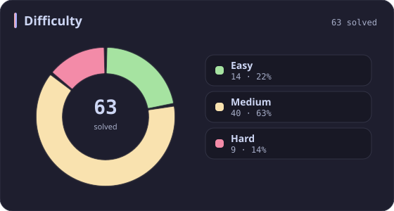
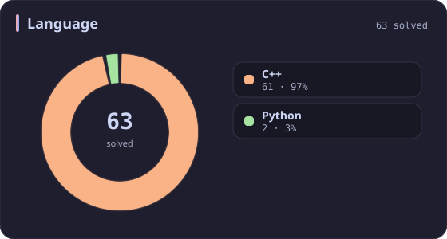
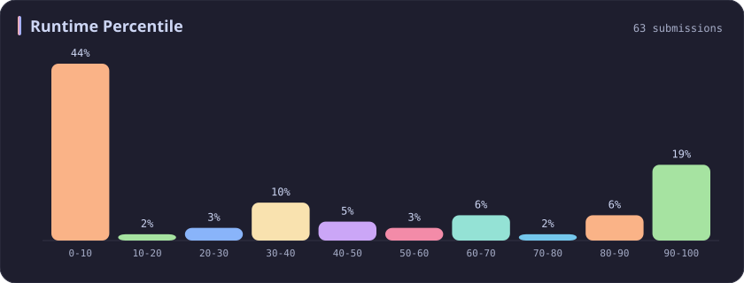
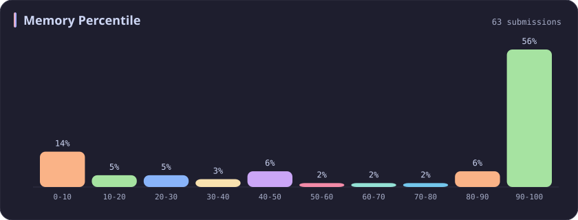
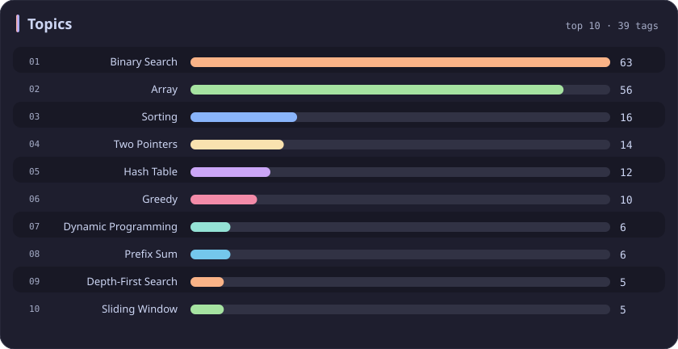

# Binary Search Stats

[All stats](../../README.md)

**63** problems · updated `2026-09-06 09:44 UTC+8`

## Stats

### Difficulty

### Language

### Runtime Percentile

### Memory Percentile

### Topics

| Topic | # | Topic | # | Topic | # | Topic | # |
| :--- | ---: | :--- | ---: | :--- | ---: | :--- | ---: |
| [Array](array.md) | 387 | [Divide and Conquer](divide-and-conquer.md) | 16 | [Directed Acyclic Graph](directed-acyclic-graph.md) | 2 | [Range Minimum/Maximum Query](range-minimum-maximum-query.md) | 1 |
| [Hash Table](hash-table.md) | 168 | [Queue](queue.md) | 16 | [Quickselect](quickselect.md) | 2 | [Nim Game](nim-game.md) | 1 |
| [String](string.md) | 167 | [Trie](trie.md) | 11 | [Binary Lifting](binary-lifting.md) | 2 | [Impartial Game](impartial-game.md) | 1 |
| [Math](math.md) | 114 | [Binary Search Tree](binary-search-tree.md) | 11 | [Lowest Common Ancestor](lowest-common-ancestor.md) | 2 | [Binary Indexed Tree](binary-indexed-tree.md) | 1 |
| [Sorting](sorting.md) | 87 | [Monotonic Stack](monotonic-stack.md) | 10 | [Counting Sort](counting-sort.md) | 2 | [Sqrt Decomposition](sqrt-decomposition.md) | 1 |
| [Dynamic Programming](dynamic-programming.md) | 83 | [Number Theory](number-theory.md) | 10 | [Interactive](interactive.md) | 2 | [Complete Knapsack](complete-knapsack.md) | 1 |
| [Depth-First Search](depth-first-search.md) | 80 | [Ordered Set](ordered-set.md) | 8 | [Pigeonhole Principle](pigeonhole-principle.md) | 2 | [Reservoir Sampling](reservoir-sampling.md) | 1 |
| [Greedy](greedy.md) | 79 | [Combinatorics](combinatorics.md) | 7 | [Longest Increasing Subsequence](longest-increasing-subsequence.md) | 2 | [Bellman–Ford Algorithm](bellman-ford-algorithm.md) | 1 |
| [Two Pointers](two-pointers.md) | 70 | [Memoization](memoization.md) | 6 | [Segment Tree](segment-tree.md) | 2 | [Floyd–Warshall Algorithm](floyd-warshall-algorithm.md) | 1 |
| [Breadth-First Search](breadth-first-search.md) | 69 | [Data Stream](data-stream.md) | 6 | [Linear Algebra](linear-algebra.md) | 2 | [0-1 Knapsack](0-1-knapsack.md) | 1 |
| [Matrix](matrix.md) | 64 | [Shortest Path](shortest-path.md) | 6 | [Randomized](randomized.md) | 2 | [Aho–Corasick Algorithm](aho-corasick-algorithm.md) | 1 |
| **Binary Search** | **63** | [Game Theory](game-theory.md) | 5 | [Heuristic Search](heuristic-search.md) | 2 | [Bidirectional Search](bidirectional-search.md) | 1 |
| [Tree](tree.md) | 60 | [Geometry](geometry.md) | 5 | [A* Search](a-search.md) | 2 | [Ternary Search](ternary-search.md) | 1 |
| [Binary Tree](binary-tree.md) | 50 | [Bracket Sequences](bracket-sequences.md) | 4 | [Hash Function](hash-function.md) | 2 | [Zero-Sum Game](zero-sum-game.md) | 1 |
| [Stack](stack.md) | 47 | [String Matching](string-matching.md) | 4 | [Greatest Common Divisor](greatest-common-divisor.md) | 2 | [Timsort](timsort.md) | 1 |
| [Prefix Sum](prefix-sum.md) | 46 | [Floyd's Cycle Finding Algorithm](floyd-s-cycle-finding-algorithm.md) | 4 | [Longest Common Subsequence](longest-common-subsequence.md) | 2 | [Radix Sort](radix-sort.md) | 1 |
| [Bit Manipulation](bit-manipulation.md) | 41 | [Topological Sort](topological-sort.md) | 4 | [Prime Factorization](prime-factorization.md) | 2 | [Triangulation](triangulation.md) | 1 |
| [Simulation](simulation.md) | 40 | [Monotonic Queue](monotonic-queue.md) | 4 | [Bitmask](bitmask.md) | 2 | [Euclidean Algorithm](euclidean-algorithm.md) | 1 |
| [Counting](counting.md) | 40 | [DP on Trees](dp-on-trees.md) | 4 | [Manacher](manacher.md) | 1 | [Minimum Spanning Tree](minimum-spanning-tree.md) | 1 |
| [Database](database.md) | 39 | [Brainteaser](brainteaser.md) | 4 | [Tournament Sort](tournament-sort.md) | 1 | [Doubly-Linked List](doubly-linked-list.md) | 1 |
| [Heap (Priority Queue)](heap-priority-queue.md) | 34 | [Polygons](polygons.md) | 4 | [Z Algorithm](z-algorithm.md) | 1 | [Least Common Multiple](least-common-multiple.md) | 1 |
| [Sliding Window](sliding-window.md) | 30 | [Merge Sort](merge-sort.md) | 3 | [Knuth–Morris–Pratt Algorithm](knuth-morris-pratt-algorithm.md) | 1 | [Fermat's Little Theorem](fermat-s-little-theorem.md) | 1 |
| [Linked List](linked-list.md) | 28 | [Algorithm X](algorithm-x.md) | 3 | [Boyer–Moore String-Search Algorithm](boyer-moore-string-search-algorithm.md) | 1 | [Kosaraju's Algorithm](kosaraju-s-algorithm.md) | 1 |
| [Graph Theory](graph-theory.md) | 27 | [Quicksort](quicksort.md) | 3 | [Dancing Links](dancing-links.md) | 1 | [Tarjan's SCC Algorithm](tarjan-s-scc-algorithm.md) | 1 |
| [Design](design.md) | 25 | [Minimax](minimax.md) | 3 | [Newton's Method](newton-s-method.md) | 1 | [Multiple Knapsack](multiple-knapsack.md) | 1 |
| [Recursion](recursion.md) | 21 | [Knapsack Problem](knapsack-problem.md) | 3 | [Bubble Sort](bubble-sort.md) | 1 | [Rolling Hash](rolling-hash.md) | 1 |
| [Backtracking](backtracking.md) | 18 | [Bucket Sort](bucket-sort.md) | 3 | [Primality Test](primality-test.md) | 1 |  |  |
| [Union-Find](union-find.md) | 17 | [Dijkstra's Algorithm](dijkstra-s-algorithm.md) | 3 | [Sieve Theory](sieve-theory.md) | 1 |  |  |
| [Enumeration](enumeration.md) | 17 | [Boyer–Moore Majority Vote Algorithm](boyer-moore-majority-vote-algorithm.md) | 2 | [Prime Number Sieve](prime-number-sieve.md) | 1 |  |  |

---

## Recent Activity

Latest **63** accepted submissions.

| Date | Title | Difficulty | Lang | Runtime | Memory |
| :--- | :--- | :---: | :---: | ---: | ---: |
| 2026&#8209;09&#8209;05 | [704. Binary Search](https://leetcode.com/problems/binary-search/) | Easy | C++ | 0 ms `100.00%` | 31.3 MB `81.38%` |
| 2026&#8209;08&#8209;13 | [270. Closest Binary Search Tree Value](https://leetcode.com/problems/closest-binary-search-tree-value/) | Easy | C++ | 0 ms `100.00%` | 21.2 MB `48.40%` |
| 2026&#8209;05&#8209;22 | [33. Search in Rotated Sorted Array](https://leetcode.com/problems/search-in-rotated-sorted-array/) | Medium | C++ | 0 ms `100.00%` | 15 MB `96.75%` |
| 2026&#8209;05&#8209;19 | [2540. Minimum Common Value](https://leetcode.com/problems/minimum-common-value/) | Easy | C++ | 0 ms `100.00%` | 54.6 MB `26.20%` |
| 2026&#8209;02&#8209;06 | [3634. Minimum Removals to Balance Array](https://leetcode.com/problems/minimum-removals-to-balance-array/) | Medium | C++ | 31 ms `62.90%` | 105 MB `86.33%` |
| 2025&#8209;10&#8209;15 | [3350. Adjacent Increasing Subarrays Detection II](https://leetcode.com/problems/adjacent-increasing-subarrays-detection-ii/) | Medium | C++ | 282 ms `8.37%` | 219.4 MB `6.08%` |
| 2025&#8209;10&#8209;12 | [3186. Maximum Total Damage With Spell Casting](https://leetcode.com/problems/maximum-total-damage-with-spell-casting/) | Medium | C++ | 111 ms `86.08%` | 162.8 MB `90.83%` |
| 2025&#8209;10&#8209;11 | [3710. Maximum Partition Factor](https://leetcode.com/problems/maximum-partition-factor/) | Hard | C++ | 1245 ms `35.15%` | 336.4 MB `37.63%` |
| 2025&#8209;10&#8209;08 | [774. Minimize Max Distance to Gas Station](https://leetcode.com/problems/minimize-max-distance-to-gas-station/) | Hard | C++ | 9 ms `66.90%` | 18 MB `8.45%` |
| 2025&#8209;10&#8209;08 | [2300. Successful Pairs of Spells and Potions](https://leetcode.com/problems/successful-pairs-of-spells-and-potions/) | Medium | C++ | 47 ms `42.48%` | 138.4 MB `8.28%` |
| 2025&#8209;10&#8209;07 | [1488. Avoid Flood in The City](https://leetcode.com/problems/avoid-flood-in-the-city/) | Medium | C++ | 216 ms `21.79%` | 121.2 MB `100.00%` |
| 2025&#8209;10&#8209;06 | [778. Swim in Rising Water](https://leetcode.com/problems/swim-in-rising-water/) | Hard | C++ | 34 ms `7.85%` | 17.1 MB `10.48%` |
| 2025&#8209;09&#8209;26 | [611. Valid Triangle Number](https://leetcode.com/problems/valid-triangle-number/) | Medium | C++ | 430 ms `8.62%` | 16.8 MB `10.43%` |
| 2025&#8209;09&#8209;21 | [3508. Implement Router](https://leetcode.com/problems/implement-router/) | Medium | C++ | 190 ms `82.01%` | 415.1 MB `99.28%` |
| 2025&#8209;09&#8209;16 | [1150. Check If a Number Is Majority Element in a Sorted Array](https://leetcode.com/problems/check-if-a-number-is-majority-element-in-a-sorted-array/) | Easy | Python | 0 ms `100.00%` | 18 MB `100.00%` |
| 2025&#8209;06&#8209;13 | [2616. Minimize the Maximum Difference of Pairs](https://leetcode.com/problems/minimize-the-maximum-difference-of-pairs/) | Medium | C++ | 30 ms `30.34%` | 86.8 MB `50.70%` |
| 2025&#8209;05&#8209;04 | [1198. Find Smallest Common Element in All Rows](https://leetcode.com/problems/find-smallest-common-element-in-all-rows/) | Medium | C++ | 12 ms `33.33%` | 31.3 MB `25.56%` |
| 2025&#8209;05&#8209;04 | [1055. Shortest Way to Form String](https://leetcode.com/problems/shortest-way-to-form-string/) | Medium | C++ | 0 ms `100.00%` | 8.7 MB `96.94%` |
| 2025&#8209;05&#8209;03 | [981. Time Based Key-Value Store](https://leetcode.com/problems/time-based-key-value-store/) | Medium | C++ | 38 ms `86.73%` | 136.5 MB `84.35%` |
| 2025&#8209;05&#8209;01 | [2071. Maximum Number of Tasks You Can Assign](https://leetcode.com/problems/maximum-number-of-tasks-you-can-assign/) | Hard | C++ | 714 ms `60.06%` | 286.3 MB `39.93%` |
| 2025&#8209;04&#8209;29 | [2302. Count Subarrays With Score Less Than K](https://leetcode.com/problems/count-subarrays-with-score-less-than-k/) | Hard | C++ | 0 ms `100.00%` | 99.1 MB `45.78%` |
| 2025&#8209;04&#8209;27 | [3532. Path Existence Queries in a Graph I](https://leetcode.com/problems/path-existence-queries-in-a-graph-i/) | Medium | C++ | 482 ms `5.06%` | 327.8 MB `5.23%` |
| 2025&#8209;04&#8209;26 | [1214. Two Sum BSTs](https://leetcode.com/problems/two-sum-bsts/) | Medium | C++ | 0 ms `100.00%` | 29.5 MB `42.11%` |
| 2025&#8209;04&#8209;24 | [1268. Search Suggestions System](https://leetcode.com/problems/search-suggestions-system/) | Medium | C++ | 31 ms `64.68%` | 44 MB `62.90%` |
| 2025&#8209;04&#8209;24 | [162. Find Peak Element](https://leetcode.com/problems/find-peak-element/) | Medium | C++ | 0 ms `100.00%` | 12.5 MB `97.81%` |
| 2025&#8209;04&#8209;24 | [374. Guess Number Higher or Lower](https://leetcode.com/problems/guess-number-higher-or-lower/) | Easy | C++ | 2 ms `56.17%` | 8.1 MB `6.63%` |
| 2025&#8209;04&#8209;24 | [875. Koko Eating Bananas](https://leetcode.com/problems/koko-eating-bananas/) | Medium | C++ | 19 ms `8.77%` | 23.1 MB `24.37%` |
| 2025&#8209;04&#8209;24 | [302. Smallest Rectangle Enclosing Black Pixels](https://leetcode.com/problems/smallest-rectangle-enclosing-black-pixels/) | Hard | C++ | 8 ms `13.11%` | 23.9 MB `13.11%` |
| 2025&#8209;04&#8209;20 | [1004. Max Consecutive Ones III](https://leetcode.com/problems/max-consecutive-ones-iii/) | Medium | C++ | 11 ms `6.07%` | 65.6 MB `100.00%` |
| 2025&#8209;04&#8209;19 | [2563. Count the Number of Fair Pairs](https://leetcode.com/problems/count-the-number-of-fair-pairs/) | Medium | C++ | 61 ms `59.74%` | 60.3 MB `100.00%` |
| 2024&#8209;11&#8209;17 | [862. Shortest Subarray with Sum at Least K](https://leetcode.com/problems/shortest-subarray-with-sum-at-least-k/) | Hard | C++ | 50 ms `9.43%` | 112.6 MB `5.17%` |
| 2024&#8209;11&#8209;15 | [1574. Shortest Subarray to be Removed to Make Array Sorted](https://leetcode.com/problems/shortest-subarray-to-be-removed-to-make-array-sorted/) | Medium | C++ | 0 ms `100.00%` | 69.4 MB `100.00%` |
| 2024&#8209;11&#8209;14 | [2064. Minimized Maximum of Products Distributed to Any Store](https://leetcode.com/problems/minimized-maximum-of-products-distributed-to-any-store/) | Medium | C++ | 34 ms `46.39%` | 87.4 MB `100.00%` |
| 2024&#8209;11&#8209;14 | [1213. Intersection of Three Sorted Arrays](https://leetcode.com/problems/intersection-of-three-sorted-arrays/) | Easy | Python | 4 ms `41.61%` | 16.9 MB `100.00%` |
| 2024&#8209;11&#8209;12 | [2070. Most Beautiful Item for Each Query](https://leetcode.com/problems/most-beautiful-item-for-each-query/) | Medium | C++ | 35 ms `96.42%` | 92.3 MB `86.68%` |
| 2024&#8209;11&#8209;11 | [2601. Prime Subtraction Operation](https://leetcode.com/problems/prime-subtraction-operation/) | Medium | C++ | 25 ms `34.60%` | 28.7 MB `41.64%` |
| 2024&#8209;10&#8209;31 | [1671. Minimum Number of Removals to Make Mountain Array](https://leetcode.com/problems/minimum-number-of-removals-to-make-mountain-array/) | Hard | C++ | 5 ms `89.20%` | 15.1 MB `99.67%` |
| 2024&#8209;10&#8209;28 | [2501. Longest Square Streak in an Array](https://leetcode.com/problems/longest-square-streak-in-an-array/) | Medium | C++ | 115 ms `34.23%` | 86.3 MB `98.21%` |
| 2024&#8209;03&#8209;27 | [713. Subarray Product Less Than K](https://leetcode.com/problems/subarray-product-less-than-k/) | Medium | C++ | 62 ms `9.64%` | 63.8 MB `5.29%` |
| 2024&#8209;03&#8209;24 | [287. Find the Duplicate Number](https://leetcode.com/problems/find-the-duplicate-number/) | Medium | C++ | 216 ms `5.28%` | 88.1 MB `9.66%` |
| 2023&#8209;10&#8209;09 | [34. Find First and Last Position of Element in Sorted Array](https://leetcode.com/problems/find-first-and-last-position-of-element-in-sorted-array/) | Medium | C++ | 10 ms `0.11%` | 13.9 MB `100.00%` |
| 2023&#8209;09&#8209;30 | [456. 132 Pattern](https://leetcode.com/problems/132-pattern/) | Medium | C++ | 71 ms `6.97%` | 49.1 MB `100.00%` |
| 2023&#8209;04&#8209;05 | [2439. Minimize Maximum of Array](https://leetcode.com/problems/minimize-maximum-of-array/) | Medium | C++ | 143 ms `5.03%` | 71.3 MB `100.00%` |
| 2023&#8209;03&#8209;26 | [2602. Minimum Operations to Make All Array Elements Equal](https://leetcode.com/problems/minimum-operations-to-make-all-array-elements-equal/) | Medium | C++ | 270 ms `5.04%` | 84.5 MB `78.02%` |
| 2023&#8209;03&#8209;21 | [349. Intersection of Two Arrays](https://leetcode.com/problems/intersection-of-two-arrays/) | Easy | C++ | 3 ms `38.14%` | 11.2 MB `100.00%` |
| 2023&#8209;03&#8209;21 | [350. Intersection of Two Arrays II](https://leetcode.com/problems/intersection-of-two-arrays-ii/) | Easy | C++ | 15 ms `5.21%` | 11.2 MB `100.00%` |
| 2023&#8209;03&#8209;20 | [74. Search a 2D Matrix](https://leetcode.com/problems/search-a-2d-matrix/) | Medium | C++ | 5 ms `0.15%` | 9.3 MB `100.00%` |
| 2023&#8209;03&#8209;18 | [2594. Minimum Time to Repair Cars](https://leetcode.com/problems/minimum-time-to-repair-cars/) | Medium | C++ | 121 ms `7.04%` | 53.9 MB `100.00%` |
| 2023&#8209;03&#8209;15 | [153. Find Minimum in Rotated Sorted Array](https://leetcode.com/problems/find-minimum-in-rotated-sorted-array/) | Medium | C++ | 4 ms `0.40%` | 10.2 MB `100.00%` |
| 2023&#8209;03&#8209;14 | [278. First Bad Version](https://leetcode.com/problems/first-bad-version/) | Easy | C++ | 0 ms `100.00%` | 6 MB `100.00%` |
| 2023&#8209;03&#8209;11 | [167. Two Sum II - Input Array Is Sorted](https://leetcode.com/problems/two-sum-ii-input-array-is-sorted/) | Medium | C++ | 11 ms `1.49%` | 15.7 MB `100.00%` |
| 2023&#8209;03&#8209;10 | [852. Peak Index in a Mountain Array](https://leetcode.com/problems/peak-index-in-a-mountain-array/) | Medium | C++ | 131 ms `0.52%` | 59.7 MB `100.00%` |
| 2023&#8209;03&#8209;10 | [35. Search Insert Position](https://leetcode.com/problems/search-insert-position/) | Easy | C++ | 3 ms `0.47%` | 9.7 MB `100.00%` |
| 2023&#8209;03&#8209;07 | [2187. Minimum Time to Complete Trips](https://leetcode.com/problems/minimum-time-to-complete-trips/) | Medium | C++ | 238 ms `5.01%` | 94.6 MB `100.00%` |
| 2023&#8209;03&#8209;06 | [1539. Kth Missing Positive Number](https://leetcode.com/problems/kth-missing-positive-number/) | Easy | C++ | 5 ms `4.63%` | 9.5 MB `100.00%` |
| 2023&#8209;03&#8209;03 | [2089. Find Target Indices After Sorting Array](https://leetcode.com/problems/find-target-indices-after-sorting-array/) | Easy | C++ | 3 ms `9.91%` | 11.5 MB `100.00%` |
| 2023&#8209;02&#8209;26 | [2576. Find the Maximum Number of Marked Indices](https://leetcode.com/problems/find-the-maximum-number-of-marked-indices/) | Medium | C++ | 374 ms `5.81%` | 100.2 MB `5.16%` |
| 2023&#8209;02&#8209;22 | [1011. Capacity To Ship Packages Within D Days](https://leetcode.com/problems/capacity-to-ship-packages-within-d-days/) | Medium | C++ | 55 ms `5.93%` | 26.2 MB `100.00%` |
| 2023&#8209;02&#8209;21 | [540. Single Element in a Sorted Array](https://leetcode.com/problems/single-element-in-a-sorted-array/) | Medium | C++ | 38 ms `3.56%` | 22.4 MB `100.00%` |
| 2023&#8209;02&#8209;17 | [300. Longest Increasing Subsequence](https://leetcode.com/problems/longest-increasing-subsequence/) | Medium | C++ | 7 ms `74.79%` | 10.4 MB `100.00%` |
| 2023&#8209;02&#8209;17 | [268. Missing Number](https://leetcode.com/problems/missing-number/) | Easy | C++ | 18 ms `9.47%` | 17.9 MB `99.97%` |
| 2023&#8209;02&#8209;16 | [69. Sqrt(x)](https://leetcode.com/problems/sqrtx/) | Easy | C++ | 3 ms `20.09%` | 6.1 MB `100.00%` |
| 2023&#8209;02&#8209;15 | [4. Median of Two Sorted Arrays](https://leetcode.com/problems/median-of-two-sorted-arrays/) | Hard | C++ | 66 ms `5.81%` | 90.2 MB `99.98%` |
