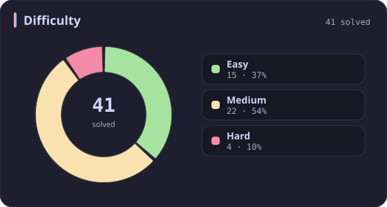
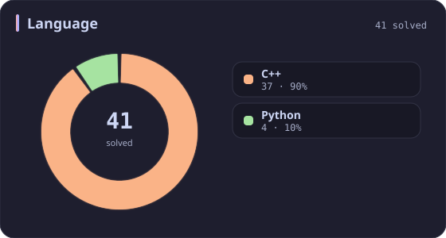
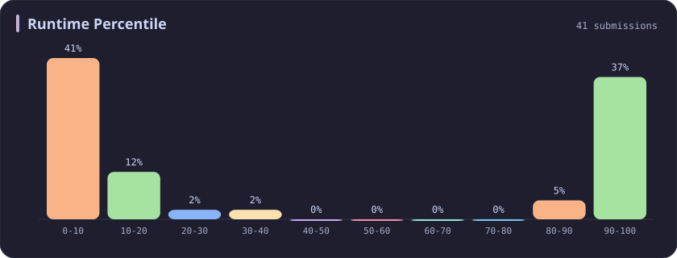
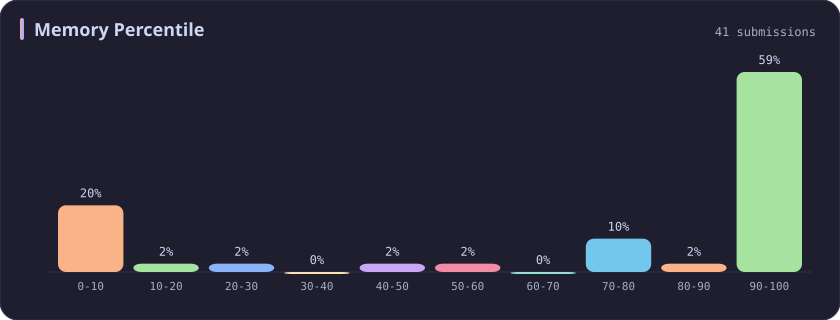
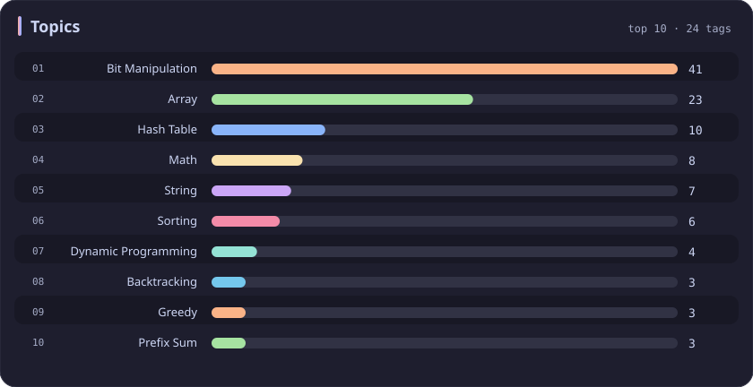

# Bit Manipulation Stats

[All stats](../../README.md)

**41** problems · updated `2026-09-05 03:41 UTC+8`

## Stats

### Difficulty

### Language

### Runtime Percentile

### Memory Percentile

### Topics

| Topic | # | Topic | # | Topic | # | Topic | # |
| :--- | ---: | :--- | ---: | :--- | ---: | :--- | ---: |
| [Array](array.md) | 387 | [Divide and Conquer](divide-and-conquer.md) | 16 | [Directed Acyclic Graph](directed-acyclic-graph.md) | 2 | [Range Minimum/Maximum Query](range-minimum-maximum-query.md) | 1 |
| [Hash Table](hash-table.md) | 168 | [Queue](queue.md) | 16 | [Quickselect](quickselect.md) | 2 | [Nim Game](nim-game.md) | 1 |
| [String](string.md) | 167 | [Trie](trie.md) | 11 | [Binary Lifting](binary-lifting.md) | 2 | [Impartial Game](impartial-game.md) | 1 |
| [Math](math.md) | 114 | [Binary Search Tree](binary-search-tree.md) | 11 | [Lowest Common Ancestor](lowest-common-ancestor.md) | 2 | [Binary Indexed Tree](binary-indexed-tree.md) | 1 |
| [Sorting](sorting.md) | 87 | [Monotonic Stack](monotonic-stack.md) | 10 | [Counting Sort](counting-sort.md) | 2 | [Sqrt Decomposition](sqrt-decomposition.md) | 1 |
| [Dynamic Programming](dynamic-programming.md) | 83 | [Number Theory](number-theory.md) | 10 | [Interactive](interactive.md) | 2 | [Complete Knapsack](complete-knapsack.md) | 1 |
| [Depth-First Search](depth-first-search.md) | 80 | [Ordered Set](ordered-set.md) | 8 | [Pigeonhole Principle](pigeonhole-principle.md) | 2 | [Reservoir Sampling](reservoir-sampling.md) | 1 |
| [Greedy](greedy.md) | 79 | [Combinatorics](combinatorics.md) | 7 | [Longest Increasing Subsequence](longest-increasing-subsequence.md) | 2 | [Bellman–Ford Algorithm](bellman-ford-algorithm.md) | 1 |
| [Two Pointers](two-pointers.md) | 70 | [Memoization](memoization.md) | 6 | [Segment Tree](segment-tree.md) | 2 | [Floyd–Warshall Algorithm](floyd-warshall-algorithm.md) | 1 |
| [Breadth-First Search](breadth-first-search.md) | 69 | [Data Stream](data-stream.md) | 6 | [Linear Algebra](linear-algebra.md) | 2 | [0-1 Knapsack](0-1-knapsack.md) | 1 |
| [Matrix](matrix.md) | 64 | [Shortest Path](shortest-path.md) | 6 | [Randomized](randomized.md) | 2 | [Aho–Corasick Algorithm](aho-corasick-algorithm.md) | 1 |
| [Binary Search](binary-search.md) | 63 | [Game Theory](game-theory.md) | 5 | [Heuristic Search](heuristic-search.md) | 2 | [Bidirectional Search](bidirectional-search.md) | 1 |
| [Tree](tree.md) | 60 | [Geometry](geometry.md) | 5 | [A* Search](a-search.md) | 2 | [Ternary Search](ternary-search.md) | 1 |
| [Binary Tree](binary-tree.md) | 50 | [Bracket Sequences](bracket-sequences.md) | 4 | [Hash Function](hash-function.md) | 2 | [Zero-Sum Game](zero-sum-game.md) | 1 |
| [Stack](stack.md) | 47 | [String Matching](string-matching.md) | 4 | [Greatest Common Divisor](greatest-common-divisor.md) | 2 | [Timsort](timsort.md) | 1 |
| [Prefix Sum](prefix-sum.md) | 46 | [Floyd's Cycle Finding Algorithm](floyd-s-cycle-finding-algorithm.md) | 4 | [Longest Common Subsequence](longest-common-subsequence.md) | 2 | [Radix Sort](radix-sort.md) | 1 |
| **Bit Manipulation** | **41** | [Topological Sort](topological-sort.md) | 4 | [Prime Factorization](prime-factorization.md) | 2 | [Triangulation](triangulation.md) | 1 |
| [Simulation](simulation.md) | 40 | [Monotonic Queue](monotonic-queue.md) | 4 | [Bitmask](bitmask.md) | 2 | [Euclidean Algorithm](euclidean-algorithm.md) | 1 |
| [Counting](counting.md) | 40 | [DP on Trees](dp-on-trees.md) | 4 | [Manacher](manacher.md) | 1 | [Minimum Spanning Tree](minimum-spanning-tree.md) | 1 |
| [Database](database.md) | 39 | [Brainteaser](brainteaser.md) | 4 | [Tournament Sort](tournament-sort.md) | 1 | [Doubly-Linked List](doubly-linked-list.md) | 1 |
| [Heap (Priority Queue)](heap-priority-queue.md) | 34 | [Polygons](polygons.md) | 4 | [Z Algorithm](z-algorithm.md) | 1 | [Least Common Multiple](least-common-multiple.md) | 1 |
| [Sliding Window](sliding-window.md) | 30 | [Merge Sort](merge-sort.md) | 3 | [Knuth–Morris–Pratt Algorithm](knuth-morris-pratt-algorithm.md) | 1 | [Fermat's Little Theorem](fermat-s-little-theorem.md) | 1 |
| [Linked List](linked-list.md) | 28 | [Algorithm X](algorithm-x.md) | 3 | [Boyer–Moore String-Search Algorithm](boyer-moore-string-search-algorithm.md) | 1 | [Kosaraju's Algorithm](kosaraju-s-algorithm.md) | 1 |
| [Graph Theory](graph-theory.md) | 27 | [Quicksort](quicksort.md) | 3 | [Dancing Links](dancing-links.md) | 1 | [Tarjan's SCC Algorithm](tarjan-s-scc-algorithm.md) | 1 |
| [Design](design.md) | 25 | [Minimax](minimax.md) | 3 | [Newton's Method](newton-s-method.md) | 1 | [Multiple Knapsack](multiple-knapsack.md) | 1 |
| [Recursion](recursion.md) | 21 | [Knapsack Problem](knapsack-problem.md) | 3 | [Bubble Sort](bubble-sort.md) | 1 | [Rolling Hash](rolling-hash.md) | 1 |
| [Backtracking](backtracking.md) | 18 | [Bucket Sort](bucket-sort.md) | 3 | [Primality Test](primality-test.md) | 1 |  |  |
| [Union-Find](union-find.md) | 17 | [Dijkstra's Algorithm](dijkstra-s-algorithm.md) | 3 | [Sieve Theory](sieve-theory.md) | 1 |  |  |
| [Enumeration](enumeration.md) | 17 | [Boyer–Moore Majority Vote Algorithm](boyer-moore-majority-vote-algorithm.md) | 2 | [Prime Number Sieve](prime-number-sieve.md) | 1 |  |  |

---

## Recent Activity

Latest **41** accepted submissions.

| Date | Title | Difficulty | Lang | Runtime | Memory |
| :--- | :--- | :---: | :---: | ---: | ---: |
| 2026&#8209;08&#8209;19 | [1386. Cinema Seat Allocation](https://leetcode.com/problems/cinema-seat-allocation/) | Medium | C++ | 125 ms `9.88%` | 84.2 MB `20.70%` |
| 2026&#8209;06&#8209;06 | [3950. Exactly One Consecutive Set Bits Pair](https://leetcode.com/problems/exactly-one-consecutive-set-bits-pair/) | Easy | C++ | 0 ms `100.00%` | 8.5 MB `7.25%` |
| 2026&#8209;05&#8209;20 | [2657. Find the Prefix Common Array of Two Arrays](https://leetcode.com/problems/find-the-prefix-common-array-of-two-arrays/) | Medium | C++ | 0 ms `100.00%` | 85.9 MB `74.63%` |
| 2025&#8209;10&#8209;17 | [3003. Maximize the Number of Partitions After Operations](https://leetcode.com/problems/maximize-the-number-of-partitions-after-operations/) | Hard | C++ | 4 ms `96.26%` | 12.3 MB `97.20%` |
| 2025&#8209;10&#8209;12 | [3539. Find Sum of Array Product of Magical Sequences](https://leetcode.com/problems/find-sum-of-array-product-of-magical-sequences/) | Hard | Python | 411 ms `97.50%` | 33.9 MB `70.00%` |
| 2025&#8209;09&#8209;27 | [3688. Bitwise OR of Even Numbers in an Array](https://leetcode.com/problems/bitwise-or-of-even-numbers-in-an-array/) | Easy | C++ | 0 ms `100.00%` | 24.5 MB `71.15%` |
| 2025&#8209;09&#8209;06 | [3495. Minimum Operations to Make Array Elements Zero](https://leetcode.com/problems/minimum-operations-to-make-array-elements-zero/) | Hard | C++ | 7 ms `87.50%` | 183.2 MB `73.61%` |
| 2025&#8209;09&#8209;05 | [2749. Minimum Operations to Make the Integer Zero](https://leetcode.com/problems/minimum-operations-to-make-the-integer-zero/) | Medium | C++ | 0 ms `100.00%` | 8.2 MB `42.26%` |
| 2025&#8209;05&#8209;29 | [3068. Find the Maximum Sum of Node Values](https://leetcode.com/problems/find-the-maximum-sum-of-node-values/) | Hard | C++ | 111 ms `11.83%` | 158 MB `11.26%` |
| 2025&#8209;04&#8209;26 | [266. Palindrome Permutation](https://leetcode.com/problems/palindrome-permutation/) | Easy | C++ | 0 ms `100.00%` | 8.2 MB `88.46%` |
| 2025&#8209;04&#8209;24 | [1318. Minimum Flips to Make a OR b Equal to c](https://leetcode.com/problems/minimum-flips-to-make-a-or-b-equal-to-c/) | Medium | C++ | 0 ms `100.00%` | 7.9 MB `4.95%` |
| 2025&#8209;04&#8209;24 | [338. Counting Bits](https://leetcode.com/problems/counting-bits/) | Easy | C++ | 0 ms `100.00%` | 11.4 MB `8.16%` |
| 2025&#8209;04&#8209;24 | [136. Single Number](https://leetcode.com/problems/single-number/) | Easy | C++ | 0 ms `100.00%` | 20.5 MB `98.78%` |
| 2024&#8209;11&#8209;10 | [3097. Shortest Subarray With OR at Least K II](https://leetcode.com/problems/shortest-subarray-with-or-at-least-k-ii/) | Medium | C++ | 51 ms `30.41%` | 88.3 MB `100.00%` |
| 2024&#8209;11&#8209;09 | [3133. Minimum Array End](https://leetcode.com/problems/minimum-array-end/) | Medium | C++ | 0 ms `100.00%` | 8.5 MB `100.00%` |
| 2024&#8209;11&#8209;08 | [1829. Maximum XOR for Each Query](https://leetcode.com/problems/maximum-xor-for-each-query/) | Medium | C++ | 12 ms `20.47%` | 99.6 MB `58.04%` |
| 2024&#8209;11&#8209;07 | [2275. Largest Combination With Bitwise AND Greater Than Zero](https://leetcode.com/problems/largest-combination-with-bitwise-and-greater-than-zero/) | Medium | C++ | 43 ms `19.26%` | 60.2 MB `100.00%` |
| 2024&#8209;11&#8209;06 | [3011. Find if Array Can Be Sorted](https://leetcode.com/problems/find-if-array-can-be-sorted/) | Medium | C++ | 0 ms `100.00%` | 31.4 MB `100.00%` |
| 2024&#8209;10&#8209;20 | [1442. Count Triplets That Can Form Two Arrays of Equal XOR](https://leetcode.com/problems/count-triplets-that-can-form-two-arrays-of-equal-xor/) | Medium | C++ | 20 ms `17.46%` | 9.6 MB `100.00%` |
| 2024&#8209;10&#8209;18 | [2044. Count Number of Maximum Bitwise-OR Subsets](https://leetcode.com/problems/count-number-of-maximum-bitwise-or-subsets/) | Medium | C++ | 7 ms `87.67%` | 10.1 MB `100.00%` |
| 2024&#8209;03&#8209;30 | [3095. Shortest Subarray With OR at Least K I](https://leetcode.com/problems/shortest-subarray-with-or-at-least-k-i/) | Easy | C++ | 4 ms `6.28%` | 26 MB `100.00%` |
| 2024&#8209;03&#8209;24 | [645. Set Mismatch](https://leetcode.com/problems/set-mismatch/) | Easy | C++ | 69 ms `8.82%` | 35.3 MB `6.03%` |
| 2024&#8209;03&#8209;24 | [287. Find the Duplicate Number](https://leetcode.com/problems/find-the-duplicate-number/) | Medium | C++ | 216 ms `5.28%` | 88.1 MB `9.66%` |
| 2023&#8209;03&#8209;19 | [2595. Number of Even and Odd Bits](https://leetcode.com/problems/number-of-even-and-odd-bits/) | Easy | C++ | 4 ms `2.85%` | 7.2 MB `100.00%` |
| 2023&#8209;03&#8209;17 | [67. Add Binary](https://leetcode.com/problems/add-binary/) | Easy | C++ | 6 ms `3.31%` | 6.5 MB `100.00%` |
| 2023&#8209;03&#8209;13 | [784. Letter Case Permutation](https://leetcode.com/problems/letter-case-permutation/) | Medium | C++ | 9 ms `5.58%` | 10.5 MB `100.00%` |
| 2023&#8209;03&#8209;13 | [190. Reverse Bits](https://leetcode.com/problems/reverse-bits/) | Easy | C++ | 6 ms `5.20%` | 6 MB `100.00%` |
| 2023&#8209;03&#8209;13 | [231. Power of Two](https://leetcode.com/problems/power-of-two/) | Easy | C++ | 0 ms `100.00%` | 5.9 MB `100.00%` |
| 2023&#8209;03&#8209;13 | [191. Number of 1 Bits](https://leetcode.com/problems/number-of-1-bits/) | Easy | C++ | 0 ms `100.00%` | 5.9 MB `100.00%` |
| 2023&#8209;03&#8209;12 | [2588. Count the Number of Beautiful Subarrays](https://leetcode.com/problems/count-the-number-of-beautiful-subarrays/) | Medium | C++ | 509 ms `5.14%` | 132.3 MB `9.00%` |
| 2023&#8209;03&#8209;10 | [1356. Sort Integers by The Number of 1 Bits](https://leetcode.com/problems/sort-integers-by-the-number-of-1-bits/) | Easy | C++ | 10 ms `10.81%` | 10 MB `100.00%` |
| 2023&#8209;03&#8209;10 | [389. Find the Difference](https://leetcode.com/problems/find-the-difference/) | Easy | C++ | 4 ms `3.98%` | 6.7 MB `100.00%` |
| 2023&#8209;03&#8209;08 | [2429. Minimize XOR](https://leetcode.com/problems/minimize-xor/) | Medium | C++ | 0 ms `100.00%` | 6.3 MB `100.00%` |
| 2023&#8209;03&#8209;06 | [29. Divide Two Integers](https://leetcode.com/problems/divide-two-integers/) | Medium | Python | 211 ms `2.00%` | 31.8 MB `6.12%` |
| 2023&#8209;03&#8209;05 | [2433. Find The Original Array of Prefix Xor](https://leetcode.com/problems/find-the-original-array-of-prefix-xor/) | Medium | C++ | 126 ms `6.56%` | 79.3 MB `99.52%` |
| 2023&#8209;02&#8209;28 | [89. Gray Code](https://leetcode.com/problems/gray-code/) | Medium | C++ | 15 ms `5.23%` | 13.6 MB `99.98%` |
| 2023&#8209;02&#8209;21 | [2564. Substring XOR Queries](https://leetcode.com/problems/substring-xor-queries/) | Medium | Python | 2986 ms `5.68%` | 148.4 MB `6.82%` |
| 2023&#8209;02&#8209;20 | [2546. Apply Bitwise Operations to Make Strings Equal](https://leetcode.com/problems/apply-bitwise-operations-to-make-strings-equal/) | Medium | Python | 37 ms `10.53%` | 15 MB `100.00%` |
| 2023&#8209;02&#8209;18 | [2568. Minimum Impossible OR](https://leetcode.com/problems/minimum-impossible-or/) | Medium | C++ | 105 ms `9.84%` | 47.7 MB `100.00%` |
| 2023&#8209;02&#8209;17 | [268. Missing Number](https://leetcode.com/problems/missing-number/) | Easy | C++ | 18 ms `9.47%` | 17.9 MB `99.97%` |
| 2023&#8209;02&#8209;16 | [260. Single Number III](https://leetcode.com/problems/single-number-iii/) | Medium | C++ | 28 ms `7.09%` | 12.1 MB `100.00%` |
