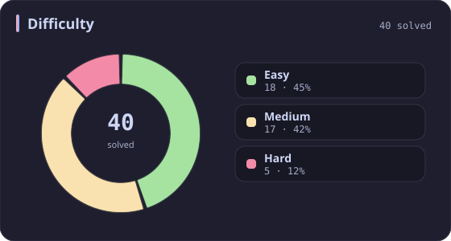
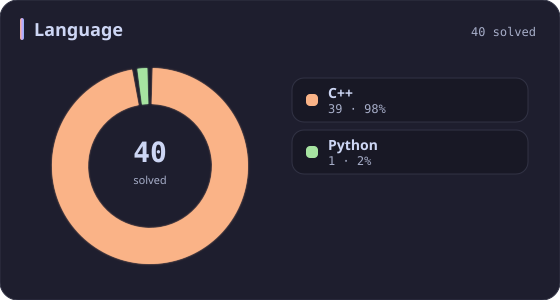
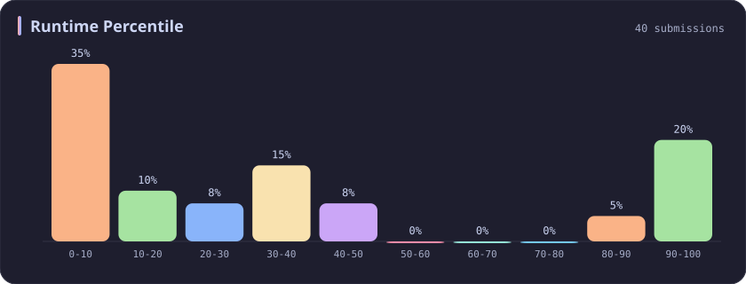
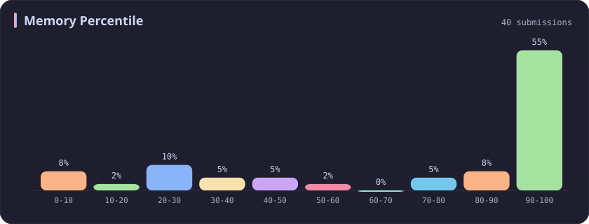
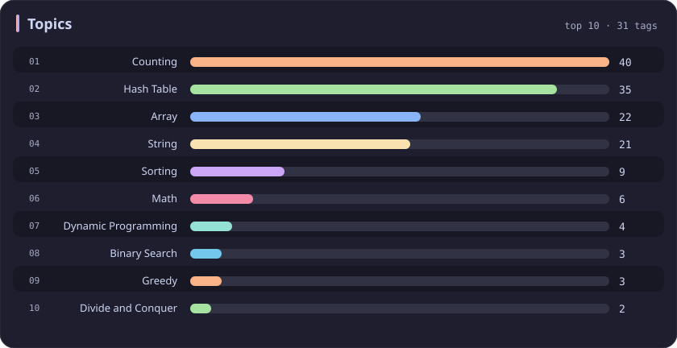

# Counting Stats

[All stats](../../README.md)

**40** problems · updated `2026-09-06 09:44 UTC+8`

## Stats

### Difficulty

### Language

### Runtime Percentile

### Memory Percentile

### Topics

| Topic | # | Topic | # | Topic | # | Topic | # |
| :--- | ---: | :--- | ---: | :--- | ---: | :--- | ---: |
| [Array](array.md) | 387 | [Divide and Conquer](divide-and-conquer.md) | 16 | [Directed Acyclic Graph](directed-acyclic-graph.md) | 2 | [Range Minimum/Maximum Query](range-minimum-maximum-query.md) | 1 |
| [Hash Table](hash-table.md) | 168 | [Queue](queue.md) | 16 | [Quickselect](quickselect.md) | 2 | [Nim Game](nim-game.md) | 1 |
| [String](string.md) | 167 | [Trie](trie.md) | 11 | [Binary Lifting](binary-lifting.md) | 2 | [Impartial Game](impartial-game.md) | 1 |
| [Math](math.md) | 114 | [Binary Search Tree](binary-search-tree.md) | 11 | [Lowest Common Ancestor](lowest-common-ancestor.md) | 2 | [Binary Indexed Tree](binary-indexed-tree.md) | 1 |
| [Sorting](sorting.md) | 87 | [Monotonic Stack](monotonic-stack.md) | 10 | [Counting Sort](counting-sort.md) | 2 | [Sqrt Decomposition](sqrt-decomposition.md) | 1 |
| [Dynamic Programming](dynamic-programming.md) | 83 | [Number Theory](number-theory.md) | 10 | [Interactive](interactive.md) | 2 | [Complete Knapsack](complete-knapsack.md) | 1 |
| [Depth-First Search](depth-first-search.md) | 80 | [Ordered Set](ordered-set.md) | 8 | [Pigeonhole Principle](pigeonhole-principle.md) | 2 | [Reservoir Sampling](reservoir-sampling.md) | 1 |
| [Greedy](greedy.md) | 79 | [Combinatorics](combinatorics.md) | 7 | [Longest Increasing Subsequence](longest-increasing-subsequence.md) | 2 | [Bellman–Ford Algorithm](bellman-ford-algorithm.md) | 1 |
| [Two Pointers](two-pointers.md) | 70 | [Memoization](memoization.md) | 6 | [Segment Tree](segment-tree.md) | 2 | [Floyd–Warshall Algorithm](floyd-warshall-algorithm.md) | 1 |
| [Breadth-First Search](breadth-first-search.md) | 69 | [Data Stream](data-stream.md) | 6 | [Linear Algebra](linear-algebra.md) | 2 | [0-1 Knapsack](0-1-knapsack.md) | 1 |
| [Matrix](matrix.md) | 64 | [Shortest Path](shortest-path.md) | 6 | [Randomized](randomized.md) | 2 | [Aho–Corasick Algorithm](aho-corasick-algorithm.md) | 1 |
| [Binary Search](binary-search.md) | 63 | [Game Theory](game-theory.md) | 5 | [Heuristic Search](heuristic-search.md) | 2 | [Bidirectional Search](bidirectional-search.md) | 1 |
| [Tree](tree.md) | 60 | [Geometry](geometry.md) | 5 | [A* Search](a-search.md) | 2 | [Ternary Search](ternary-search.md) | 1 |
| [Binary Tree](binary-tree.md) | 50 | [Bracket Sequences](bracket-sequences.md) | 4 | [Hash Function](hash-function.md) | 2 | [Zero-Sum Game](zero-sum-game.md) | 1 |
| [Stack](stack.md) | 47 | [String Matching](string-matching.md) | 4 | [Greatest Common Divisor](greatest-common-divisor.md) | 2 | [Timsort](timsort.md) | 1 |
| [Prefix Sum](prefix-sum.md) | 46 | [Floyd's Cycle Finding Algorithm](floyd-s-cycle-finding-algorithm.md) | 4 | [Longest Common Subsequence](longest-common-subsequence.md) | 2 | [Radix Sort](radix-sort.md) | 1 |
| [Bit Manipulation](bit-manipulation.md) | 41 | [Topological Sort](topological-sort.md) | 4 | [Prime Factorization](prime-factorization.md) | 2 | [Triangulation](triangulation.md) | 1 |
| [Simulation](simulation.md) | 40 | [Monotonic Queue](monotonic-queue.md) | 4 | [Bitmask](bitmask.md) | 2 | [Euclidean Algorithm](euclidean-algorithm.md) | 1 |
| **Counting** | **40** | [DP on Trees](dp-on-trees.md) | 4 | [Manacher](manacher.md) | 1 | [Minimum Spanning Tree](minimum-spanning-tree.md) | 1 |
| [Database](database.md) | 39 | [Brainteaser](brainteaser.md) | 4 | [Tournament Sort](tournament-sort.md) | 1 | [Doubly-Linked List](doubly-linked-list.md) | 1 |
| [Heap (Priority Queue)](heap-priority-queue.md) | 34 | [Polygons](polygons.md) | 4 | [Z Algorithm](z-algorithm.md) | 1 | [Least Common Multiple](least-common-multiple.md) | 1 |
| [Sliding Window](sliding-window.md) | 30 | [Merge Sort](merge-sort.md) | 3 | [Knuth–Morris–Pratt Algorithm](knuth-morris-pratt-algorithm.md) | 1 | [Fermat's Little Theorem](fermat-s-little-theorem.md) | 1 |
| [Linked List](linked-list.md) | 28 | [Algorithm X](algorithm-x.md) | 3 | [Boyer–Moore String-Search Algorithm](boyer-moore-string-search-algorithm.md) | 1 | [Kosaraju's Algorithm](kosaraju-s-algorithm.md) | 1 |
| [Graph Theory](graph-theory.md) | 27 | [Quicksort](quicksort.md) | 3 | [Dancing Links](dancing-links.md) | 1 | [Tarjan's SCC Algorithm](tarjan-s-scc-algorithm.md) | 1 |
| [Design](design.md) | 25 | [Minimax](minimax.md) | 3 | [Newton's Method](newton-s-method.md) | 1 | [Multiple Knapsack](multiple-knapsack.md) | 1 |
| [Recursion](recursion.md) | 21 | [Knapsack Problem](knapsack-problem.md) | 3 | [Bubble Sort](bubble-sort.md) | 1 | [Rolling Hash](rolling-hash.md) | 1 |
| [Backtracking](backtracking.md) | 18 | [Bucket Sort](bucket-sort.md) | 3 | [Primality Test](primality-test.md) | 1 |  |  |
| [Union-Find](union-find.md) | 17 | [Dijkstra's Algorithm](dijkstra-s-algorithm.md) | 3 | [Sieve Theory](sieve-theory.md) | 1 |  |  |
| [Enumeration](enumeration.md) | 17 | [Boyer–Moore Majority Vote Algorithm](boyer-moore-majority-vote-algorithm.md) | 2 | [Prime Number Sieve](prime-number-sieve.md) | 1 |  |  |

---

## Recent Activity

Latest **40** accepted submissions.

| Date | Title | Difficulty | Lang | Runtime | Memory |
| :--- | :--- | :---: | :---: | ---: | ---: |
| 2025&#8209;10&#8209;12 | [3715. Sum of Perfect Square Ancestors](https://leetcode.com/problems/sum-of-perfect-square-ancestors/) | Hard | C++ | 1461 ms `21.09%` | 383.2 MB `25.85%` |
| 2025&#8209;10&#8209;12 | [3713. Longest Balanced Substring I](https://leetcode.com/problems/longest-balanced-substring-i/) | Medium | C++ | 3030 ms `5.07%` | 498.4 MB `5.06%` |
| 2025&#8209;10&#8209;12 | [3712. Sum of Elements With Frequency Divisible by K](https://leetcode.com/problems/sum-of-elements-with-frequency-divisible-by-k/) | Easy | C++ | 0 ms `100.00%` | 26.4 MB `12.32%` |
| 2025&#8209;10&#8209;12 | [3186. Maximum Total Damage With Spell Casting](https://leetcode.com/problems/maximum-total-damage-with-spell-casting/) | Medium | C++ | 111 ms `86.08%` | 162.8 MB `90.83%` |
| 2025&#8209;09&#8209;29 | [1121. Divide Array Into Increasing Sequences](https://leetcode.com/problems/divide-array-into-increasing-sequences/) | Hard | C++ | 95 ms `41.67%` | 107.6 MB `33.33%` |
| 2025&#8209;09&#8209;27 | [3692. Majority Frequency Characters](https://leetcode.com/problems/majority-frequency-characters/) | Easy | C++ | 5 ms `31.61%` | 9.2 MB `86.77%` |
| 2025&#8209;09&#8209;22 | [3005. Count Elements With Maximum Frequency](https://leetcode.com/problems/count-elements-with-maximum-frequency/) | Easy | C++ | 0 ms `100.00%` | 23.6 MB `8.88%` |
| 2025&#8209;09&#8209;13 | [3541. Find Most Frequent Vowel and Consonant](https://leetcode.com/problems/find-most-frequent-vowel-and-consonant/) | Easy | C++ | 2 ms `39.99%` | 10 MB `24.45%` |
| 2025&#8209;06&#8209;10 | [3442. Maximum Difference Between Even and Odd Frequency I](https://leetcode.com/problems/maximum-difference-between-even-and-odd-frequency-i/) | Easy | C++ | 3 ms `36.10%` | 9.9 MB `27.80%` |
| 2025&#8209;05&#8209;27 | [1857. Largest Color Value in a Directed Graph](https://leetcode.com/problems/largest-color-value-in-a-directed-graph/) | Hard | C++ | 401 ms `39.45%` | 188.9 MB `30.53%` |
| 2025&#8209;05&#8209;25 | [2131. Longest Palindrome by Concatenating Two Letter Words](https://leetcode.com/problems/longest-palindrome-by-concatenating-two-letter-words/) | Medium | C++ | 27 ms `88.02%` | 171.9 MB `78.72%` |
| 2025&#8209;05&#8209;14 | [3337. Total Characters in String After Transformations II](https://leetcode.com/problems/total-characters-in-string-after-transformations-ii/) | Hard | C++ | 543 ms `9.64%` | 70.7 MB `42.17%` |
| 2025&#8209;05&#8209;13 | [3335. Total Characters in String After Transformations I](https://leetcode.com/problems/total-characters-in-string-after-transformations-i/) | Medium | C++ | 14 ms `98.77%` | 19.2 MB `88.62%` |
| 2025&#8209;05&#8209;11 | [3545. Minimum Deletions for At Most K Distinct Characters](https://leetcode.com/problems/minimum-deletions-for-at-most-k-distinct-characters/) | Easy | C++ | 3 ms `41.64%` | 9 MB `89.15%` |
| 2025&#8209;05&#8209;04 | [1198. Find Smallest Common Element in All Rows](https://leetcode.com/problems/find-smallest-common-element-in-all-rows/) | Medium | C++ | 12 ms `33.33%` | 31.3 MB `25.56%` |
| 2025&#8209;05&#8209;04 | [1128. Number of Equivalent Domino Pairs](https://leetcode.com/problems/number-of-equivalent-domino-pairs/) | Easy | C++ | 0 ms `100.00%` | 26.1 MB `92.76%` |
| 2025&#8209;04&#8209;26 | [3527. Find the Most Common Response](https://leetcode.com/problems/find-the-most-common-response/) | Medium | C++ | 1472 ms `24.07%` | 479.3 MB `51.50%` |
| 2025&#8209;04&#8209;24 | [169. Majority Element](https://leetcode.com/problems/majority-element/) | Easy | C++ | 0 ms `100.00%` | 28.1 MB `95.18%` |
| 2025&#8209;04&#8209;23 | [1399. Count Largest Group](https://leetcode.com/problems/count-largest-group/) | Easy | C++ | 0 ms `100.00%` | 7.9 MB `77.49%` |
| 2025&#8209;04&#8209;20 | [1657. Determine if Two Strings Are Close](https://leetcode.com/problems/determine-if-two-strings-are-close/) | Medium | C++ | 27 ms `35.74%` | 23.6 MB `49.60%` |
| 2024&#8209;11&#8209;14 | [1213. Intersection of Three Sorted Arrays](https://leetcode.com/problems/intersection-of-three-sorted-arrays/) | Easy | Python | 4 ms `41.61%` | 16.9 MB `100.00%` |
| 2024&#8209;11&#8209;07 | [2275. Largest Combination With Bitwise AND Greater Than Zero](https://leetcode.com/problems/largest-combination-with-bitwise-and-greater-than-zero/) | Medium | C++ | 43 ms `19.26%` | 60.2 MB `100.00%` |
| 2024&#8209;11&#8209;04 | [2955. Number of Same-End Substrings](https://leetcode.com/problems/number-of-same-end-substrings/) | Medium | C++ | 238 ms `15.38%` | 230.3 MB `7.69%` |
| 2024&#8209;10&#8209;23 | [3084. Count Substrings Starting and Ending with Given Character](https://leetcode.com/problems/count-substrings-starting-and-ending-with-given-character/) | Medium | C++ | 0 ms `100.00%` | 11.8 MB `99.87%` |
| 2024&#8209;03&#8209;30 | [992. Subarrays with K Different Integers](https://leetcode.com/problems/subarrays-with-k-different-integers/) | Hard | C++ | 1061 ms `5.69%` | 46.9 MB `95.70%` |
| 2023&#8209;10&#8209;06 | [229. Majority Element II](https://leetcode.com/problems/majority-element-ii/) | Medium | C++ | 8 ms `29.21%` | 16.3 MB `100.00%` |
| 2023&#8209;10&#8209;03 | [1512. Number of Good Pairs](https://leetcode.com/problems/number-of-good-pairs/) | Easy | C++ | 3 ms `2.39%` | 7.5 MB `100.00%` |
| 2023&#8209;03&#8209;20 | [387. First Unique Character in a String](https://leetcode.com/problems/first-unique-character-in-a-string/) | Easy | C++ | 27 ms `8.49%` | 10.6 MB `100.00%` |
| 2023&#8209;03&#8209;20 | [383. Ransom Note](https://leetcode.com/problems/ransom-note/) | Easy | C++ | 16 ms `5.24%` | 8.8 MB `99.99%` |
| 2023&#8209;03&#8209;17 | [692. Top K Frequent Words](https://leetcode.com/problems/top-k-frequent-words/) | Medium | C++ | 13 ms `5.43%` | 12.6 MB `100.00%` |
| 2023&#8209;03&#8209;15 | [299. Bulls and Cows](https://leetcode.com/problems/bulls-and-cows/) | Medium | C++ | 6 ms `4.66%` | 6.5 MB `100.00%` |
| 2023&#8209;03&#8209;12 | [2586. Count the Number of Vowel Strings in Range](https://leetcode.com/problems/count-the-number-of-vowel-strings-in-range/) | Easy | C++ | 18 ms `4.36%` | 31.6 MB `100.00%` |
| 2023&#8209;03&#8209;11 | [1603. Design Parking System](https://leetcode.com/problems/design-parking-system/) | Easy | C++ | 61 ms `5.59%` | 33.2 MB `100.00%` |
| 2023&#8209;03&#8209;10 | [1356. Sort Integers by The Number of 1 Bits](https://leetcode.com/problems/sort-integers-by-the-number-of-1-bits/) | Easy | C++ | 10 ms `10.81%` | 10 MB `100.00%` |
| 2023&#8209;03&#8209;10 | [1790. Check if One String Swap Can Make Strings Equal](https://leetcode.com/problems/check-if-one-string-swap-can-make-strings-equal/) | Easy | C++ | 0 ms `100.00%` | 6.4 MB `100.00%` |
| 2023&#8209;02&#8209;27 | [1481. Least Number of Unique Integers after K Removals](https://leetcode.com/problems/least-number-of-unique-integers-after-k-removals/) | Medium | C++ | 252 ms `5.05%` | 64.2 MB `96.17%` |
| 2023&#8209;02&#8209;20 | [1347. Minimum Number of Steps to Make Two Strings Anagram](https://leetcode.com/problems/minimum-number-of-steps-to-make-two-strings-anagram/) | Medium | C++ | 54 ms `6.25%` | 16.7 MB `99.93%` |
| 2023&#8209;02&#8209;20 | [2186. Minimum Number of Steps to Make Two Strings Anagram II](https://leetcode.com/problems/minimum-number-of-steps-to-make-two-strings-anagram-ii/) | Medium | C++ | 105 ms `10.92%` | 28.9 MB `99.03%` |
| 2023&#8209;02&#8209;20 | [2404. Most Frequent Even Element](https://leetcode.com/problems/most-frequent-even-element/) | Easy | C++ | 61 ms `7.86%` | 30.6 MB `100.00%` |
| 2023&#8209;02&#8209;17 | [347. Top K Frequent Elements](https://leetcode.com/problems/top-k-frequent-elements/) | Medium | C++ | 23 ms `8.42%` | 14.2 MB `100.00%` |
