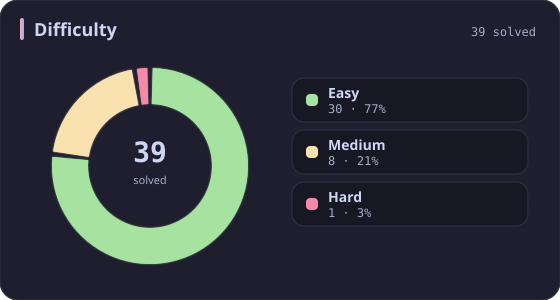
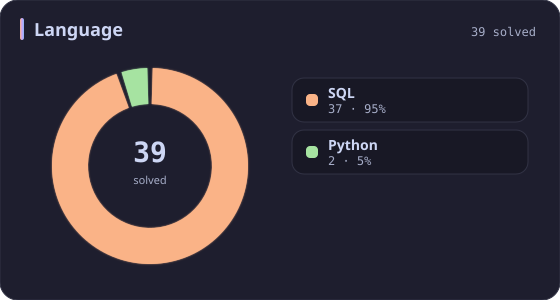
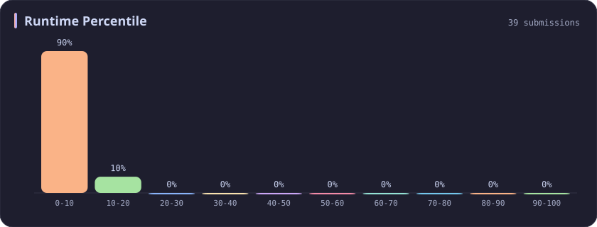
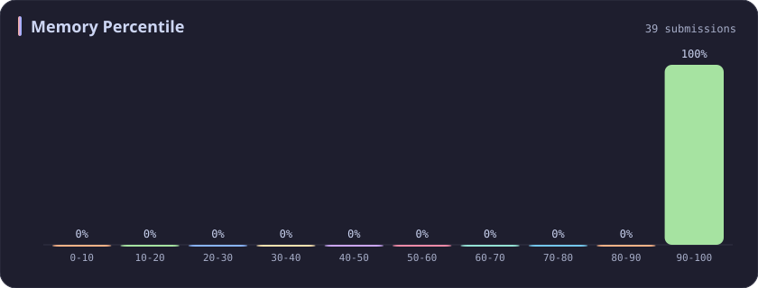

# Database Stats

[All stats](../../README.md)

**39** problems · updated `2026-09-04 19:32 UTC`

## Stats

### Difficulty

### Language

### Runtime Percentile

### Memory Percentile

### Topics

| Topic | # | Topic | # | Topic | # | Topic | # |
| :--- | ---: | :--- | ---: | :--- | ---: | :--- | ---: |
| [Array](array.md) | 387 | [Divide and Conquer](divide-and-conquer.md) | 16 | [Directed Acyclic Graph](directed-acyclic-graph.md) | 2 | [Range Minimum/Maximum Query](range-minimum-maximum-query.md) | 1 |
| [Hash Table](hash-table.md) | 168 | [Queue](queue.md) | 16 | [Quickselect](quickselect.md) | 2 | [Nim Game](nim-game.md) | 1 |
| [String](string.md) | 167 | [Trie](trie.md) | 11 | [Binary Lifting](binary-lifting.md) | 2 | [Impartial Game](impartial-game.md) | 1 |
| [Math](math.md) | 114 | [Binary Search Tree](binary-search-tree.md) | 11 | [Lowest Common Ancestor](lowest-common-ancestor.md) | 2 | [Binary Indexed Tree](binary-indexed-tree.md) | 1 |
| [Sorting](sorting.md) | 87 | [Monotonic Stack](monotonic-stack.md) | 10 | [Counting Sort](counting-sort.md) | 2 | [Sqrt Decomposition](sqrt-decomposition.md) | 1 |
| [Dynamic Programming](dynamic-programming.md) | 83 | [Number Theory](number-theory.md) | 10 | [Interactive](interactive.md) | 2 | [Complete Knapsack](complete-knapsack.md) | 1 |
| [Depth-First Search](depth-first-search.md) | 80 | [Ordered Set](ordered-set.md) | 8 | [Pigeonhole Principle](pigeonhole-principle.md) | 2 | [Reservoir Sampling](reservoir-sampling.md) | 1 |
| [Greedy](greedy.md) | 79 | [Combinatorics](combinatorics.md) | 7 | [Longest Increasing Subsequence](longest-increasing-subsequence.md) | 2 | [Bellman–Ford Algorithm](bellman-ford-algorithm.md) | 1 |
| [Two Pointers](two-pointers.md) | 70 | [Memoization](memoization.md) | 6 | [Segment Tree](segment-tree.md) | 2 | [Floyd–Warshall Algorithm](floyd-warshall-algorithm.md) | 1 |
| [Breadth-First Search](breadth-first-search.md) | 69 | [Data Stream](data-stream.md) | 6 | [Linear Algebra](linear-algebra.md) | 2 | [0-1 Knapsack](0-1-knapsack.md) | 1 |
| [Matrix](matrix.md) | 64 | [Shortest Path](shortest-path.md) | 6 | [Randomized](randomized.md) | 2 | [Aho–Corasick Algorithm](aho-corasick-algorithm.md) | 1 |
| [Binary Search](binary-search.md) | 63 | [Game Theory](game-theory.md) | 5 | [Heuristic Search](heuristic-search.md) | 2 | [Bidirectional Search](bidirectional-search.md) | 1 |
| [Tree](tree.md) | 60 | [Geometry](geometry.md) | 5 | [A* Search](a-search.md) | 2 | [Ternary Search](ternary-search.md) | 1 |
| [Binary Tree](binary-tree.md) | 50 | [Bracket Sequences](bracket-sequences.md) | 4 | [Hash Function](hash-function.md) | 2 | [Zero-Sum Game](zero-sum-game.md) | 1 |
| [Stack](stack.md) | 47 | [String Matching](string-matching.md) | 4 | [Greatest Common Divisor](greatest-common-divisor.md) | 2 | [Timsort](timsort.md) | 1 |
| [Prefix Sum](prefix-sum.md) | 46 | [Floyd's Cycle Finding Algorithm](floyd-s-cycle-finding-algorithm.md) | 4 | [Longest Common Subsequence](longest-common-subsequence.md) | 2 | [Radix Sort](radix-sort.md) | 1 |
| [Bit Manipulation](bit-manipulation.md) | 41 | [Topological Sort](topological-sort.md) | 4 | [Prime Factorization](prime-factorization.md) | 2 | [Triangulation](triangulation.md) | 1 |
| [Simulation](simulation.md) | 40 | [Monotonic Queue](monotonic-queue.md) | 4 | [Bitmask](bitmask.md) | 2 | [Euclidean Algorithm](euclidean-algorithm.md) | 1 |
| [Counting](counting.md) | 40 | [DP on Trees](dp-on-trees.md) | 4 | [Manacher](manacher.md) | 1 | [Minimum Spanning Tree](minimum-spanning-tree.md) | 1 |
| **Database** | **39** | [Brainteaser](brainteaser.md) | 4 | [Tournament Sort](tournament-sort.md) | 1 | [Doubly-Linked List](doubly-linked-list.md) | 1 |
| [Heap (Priority Queue)](heap-priority-queue.md) | 34 | [Polygons](polygons.md) | 4 | [Z Algorithm](z-algorithm.md) | 1 | [Least Common Multiple](least-common-multiple.md) | 1 |
| [Sliding Window](sliding-window.md) | 30 | [Merge Sort](merge-sort.md) | 3 | [Knuth–Morris–Pratt Algorithm](knuth-morris-pratt-algorithm.md) | 1 | [Fermat's Little Theorem](fermat-s-little-theorem.md) | 1 |
| [Linked List](linked-list.md) | 28 | [Algorithm X](algorithm-x.md) | 3 | [Boyer–Moore String-Search Algorithm](boyer-moore-string-search-algorithm.md) | 1 | [Kosaraju's Algorithm](kosaraju-s-algorithm.md) | 1 |
| [Graph Theory](graph-theory.md) | 27 | [Quicksort](quicksort.md) | 3 | [Dancing Links](dancing-links.md) | 1 | [Tarjan's SCC Algorithm](tarjan-s-scc-algorithm.md) | 1 |
| [Design](design.md) | 25 | [Minimax](minimax.md) | 3 | [Newton's Method](newton-s-method.md) | 1 | [Multiple Knapsack](multiple-knapsack.md) | 1 |
| [Recursion](recursion.md) | 21 | [Knapsack Problem](knapsack-problem.md) | 3 | [Bubble Sort](bubble-sort.md) | 1 | [Rolling Hash](rolling-hash.md) | 1 |
| [Backtracking](backtracking.md) | 18 | [Bucket Sort](bucket-sort.md) | 3 | [Primality Test](primality-test.md) | 1 |  |  |
| [Union-Find](union-find.md) | 17 | [Dijkstra's Algorithm](dijkstra-s-algorithm.md) | 3 | [Sieve Theory](sieve-theory.md) | 1 |  |  |
| [Enumeration](enumeration.md) | 17 | [Boyer–Moore Majority Vote Algorithm](boyer-moore-majority-vote-algorithm.md) | 2 | [Prime Number Sieve](prime-number-sieve.md) | 1 |  |  |

---

## Recent Activity

Latest **39** accepted submissions.

| Date | Title | Difficulty | Lang | Runtime | Memory |
| :--- | :--- | :---: | :---: | ---: | ---: |
| 2023&#8209;10&#8209;01 | [185. Department Top Three Salaries](https://leetcode.com/problems/department-top-three-salaries/) | Hard | Python | 745 ms `5.52%` | 62.8 MB `100.00%` |
| 2023&#8209;09&#8209;30 | [180. Consecutive Numbers](https://leetcode.com/problems/consecutive-numbers/) | Medium | Python | 897 ms `5.05%` | 60.6 MB `100.00%` |
| 2023&#8209;03&#8209;09 | [1393. Capital Gain/Loss](https://leetcode.com/problems/capital-gainloss/) | Medium | SQL | 1187 ms `5.00%` | 0.0B `100.00%` |
| 2023&#8209;03&#8209;09 | [1407. Top Travellers](https://leetcode.com/problems/top-travellers/) | Easy | SQL | 1771 ms `5.02%` | 0.0B `100.00%` |
| 2023&#8209;03&#8209;09 | [1158. Market Analysis I](https://leetcode.com/problems/market-analysis-i/) | Medium | SQL | 2378 ms `5.01%` | 0.0B `100.00%` |
| 2023&#8209;03&#8209;09 | [1050. Actors and Directors Who Cooperated At Least Three Times](https://leetcode.com/problems/actors-and-directors-who-cooperated-at-least-three-times/) | Easy | SQL | 673 ms `5.01%` | 0.0B `100.00%` |
| 2023&#8209;03&#8209;09 | [586. Customer Placing the Largest Number of Orders](https://leetcode.com/problems/customer-placing-the-largest-number-of-orders/) | Easy | SQL | 875 ms `5.01%` | 0.0B `100.00%` |
| 2023&#8209;03&#8209;09 | [1890. The Latest Login in 2020](https://leetcode.com/problems/the-latest-login-in-2020/) | Easy | SQL | 1439 ms `5.02%` | 0.0B `100.00%` |
| 2023&#8209;03&#8209;09 | [1729. Find Followers Count](https://leetcode.com/problems/find-followers-count/) | Easy | SQL | 1076 ms `5.01%` | 0.0B `100.00%` |
| 2023&#8209;03&#8209;09 | [1587. Bank Account Summary II](https://leetcode.com/problems/bank-account-summary-ii/) | Easy | SQL | 2064 ms `5.01%` | 0.0B `100.00%` |
| 2023&#8209;03&#8209;09 | [1084. Sales Analysis III](https://leetcode.com/problems/sales-analysis-iii/) | Easy | SQL | 2837 ms `5.01%` | 0.0B `100.00%` |
| 2023&#8209;03&#8209;09 | [182. Duplicate Emails](https://leetcode.com/problems/duplicate-emails/) | Easy | SQL | 702 ms `5.09%` | 0.0B `100.00%` |
| 2023&#8209;03&#8209;09 | [1741. Find Total Time Spent by Each Employee](https://leetcode.com/problems/find-total-time-spent-by-each-employee/) | Easy | SQL | 1228 ms `5.02%` | 0.0B `100.00%` |
| 2023&#8209;03&#8209;09 | [511. Game Play Analysis I](https://leetcode.com/problems/game-play-analysis-i/) | Easy | SQL | 926 ms `5.31%` | 0.0B `100.00%` |
| 2023&#8209;03&#8209;09 | [1693. Daily Leads and Partners](https://leetcode.com/problems/daily-leads-and-partners/) | Easy | SQL | 1347 ms `5.00%` | 0.0B `100.00%` |
| 2023&#8209;03&#8209;09 | [1141. User Activity for the Past 30 Days I](https://leetcode.com/problems/user-activity-for-the-past-30-days-i/) | Easy | SQL | 839 ms `5.62%` | 0.0B `100.00%` |
| 2023&#8209;03&#8209;09 | [197. Rising Temperature](https://leetcode.com/problems/rising-temperature/) | Easy | SQL | 685 ms `11.20%` | 0.0B `100.00%` |
| 2023&#8209;03&#8209;09 | [607. Sales Person](https://leetcode.com/problems/sales-person/) | Easy | SQL | 2756 ms `5.00%` | 0.0B `100.00%` |
| 2023&#8209;03&#8209;09 | [1148. Article Views I](https://leetcode.com/problems/article-views-i/) | Easy | SQL | 947 ms `5.02%` | 0.0B `100.00%` |
| 2023&#8209;03&#8209;09 | [1581. Customer Who Visited but Did Not Make Any Transactions](https://leetcode.com/problems/customer-who-visited-but-did-not-make-any-transactions/) | Easy | SQL | 2651 ms `5.01%` | 0.0B `100.00%` |
| 2023&#8209;03&#8209;09 | [175. Combine Two Tables](https://leetcode.com/problems/combine-two-tables/) | Easy | SQL | 700 ms `5.99%` | 0.0B `100.00%` |
| 2023&#8209;03&#8209;09 | [176. Second Highest Salary](https://leetcode.com/problems/second-highest-salary/) | Medium | SQL | 448 ms `8.16%` | 0.0B `100.00%` |
| 2023&#8209;03&#8209;09 | [608. Tree Node](https://leetcode.com/problems/tree-node/) | Medium | SQL | 983 ms `5.01%` | 0.0B `100.00%` |
| 2023&#8209;03&#8209;09 | [1795. Rearrange Products Table](https://leetcode.com/problems/rearrange-products-table/) | Easy | SQL | 1320 ms `5.02%` | 0.0B `100.00%` |
| 2023&#8209;03&#8209;08 | [1965. Employees With Missing Information](https://leetcode.com/problems/employees-with-missing-information/) | Easy | SQL | 1081 ms `5.00%` | 0.0B `100.00%` |
| 2023&#8209;03&#8209;08 | [1527. Patients With a Condition](https://leetcode.com/problems/patients-with-a-condition/) | Easy | SQL | 797 ms `5.00%` | 0.0B `100.00%` |
| 2023&#8209;03&#8209;08 | [1484. Group Sold Products By The Date](https://leetcode.com/problems/group-sold-products-by-the-date/) | Easy | SQL | 801 ms `5.42%` | 0.0B `100.00%` |
| 2023&#8209;03&#8209;08 | [1667. Fix Names in a Table](https://leetcode.com/problems/fix-names-in-a-table/) | Easy | SQL | 1712 ms `5.00%` | 0.0B `100.00%` |
| 2023&#8209;03&#8209;08 | [196. Delete Duplicate Emails](https://leetcode.com/problems/delete-duplicate-emails/) | Easy | SQL | 1709 ms `5.01%` | 0.0B `100.00%` |
| 2023&#8209;03&#8209;08 | [627. Swap Sex of Employees](https://leetcode.com/problems/swap-sex-of-employees/) | Easy | SQL | 418 ms `7.48%` | 0.0B `100.00%` |
| 2023&#8209;03&#8209;08 | [1873. Calculate Special Bonus](https://leetcode.com/problems/calculate-special-bonus/) | Easy | SQL | 1043 ms `5.65%` | 0.0B `100.00%` |
| 2023&#8209;03&#8209;08 | [584. Find Customer Referee](https://leetcode.com/problems/find-customer-referee/) | Easy | SQL | 926 ms `5.00%` | 0.0B `100.00%` |
| 2023&#8209;03&#8209;08 | [183. Customers Who Never Order](https://leetcode.com/problems/customers-who-never-order/) | Easy | SQL | 1020 ms `5.01%` | 0.0B `100.00%` |
| 2023&#8209;03&#8209;08 | [1757. Recyclable and Low Fat Products](https://leetcode.com/problems/recyclable-and-low-fat-products/) | Easy | SQL | 1211 ms `5.01%` | 0.0B `100.00%` |
| 2023&#8209;03&#8209;05 | [595. Big Countries](https://leetcode.com/problems/big-countries/) | Easy | SQL | 557 ms `5.02%` | 0.0B `100.00%` |
| 2023&#8209;02&#8209;16 | [184. Department Highest Salary](https://leetcode.com/problems/department-highest-salary/) | Medium | SQL | 1233 ms `12.08%` | 0.0B `100.00%` |
| 2023&#8209;02&#8209;16 | [181. Employees Earning More Than Their Managers](https://leetcode.com/problems/employees-earning-more-than-their-managers/) | Easy | SQL | 682 ms `11.60%` | 0.0B `100.00%` |
| 2023&#8209;02&#8209;16 | [178. Rank Scores](https://leetcode.com/problems/rank-scores/) | Medium | SQL | 551 ms `13.85%` | 0.0B `100.00%` |
| 2023&#8209;02&#8209;16 | [177. Nth Highest Salary](https://leetcode.com/problems/nth-highest-salary/) | Medium | SQL | 1189 ms `5.00%` | 0.0B `100.00%` |
