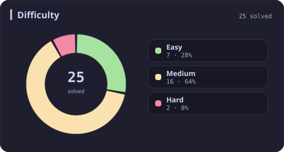
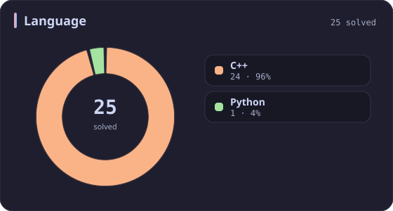
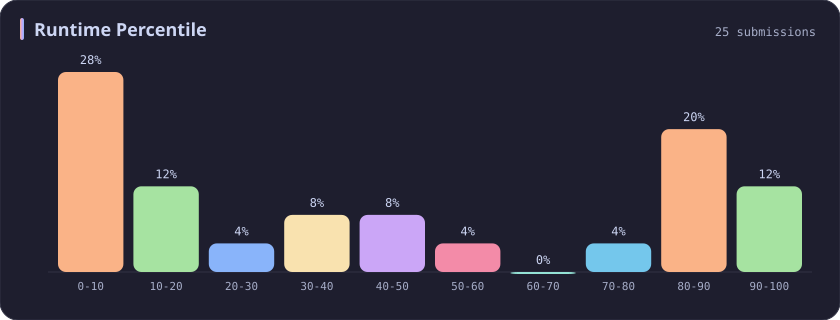
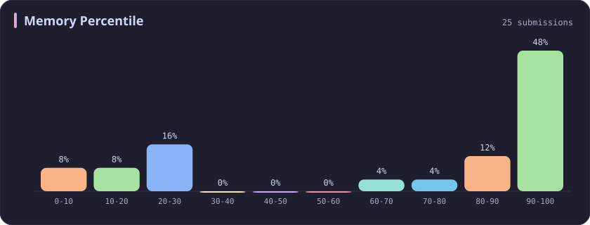
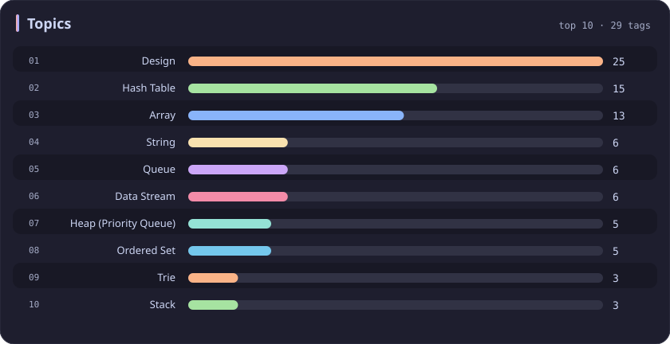

# Design Stats

[All stats](../../README.md)

**25** problems · updated `2026-09-06 09:44 UTC+8`

## Stats

### Difficulty

### Language

### Runtime Percentile

### Memory Percentile

### Topics

| Topic | # | Topic | # | Topic | # | Topic | # |
| :--- | ---: | :--- | ---: | :--- | ---: | :--- | ---: |
| [Array](array.md) | 387 | [Divide and Conquer](divide-and-conquer.md) | 16 | [Directed Acyclic Graph](directed-acyclic-graph.md) | 2 | [Range Minimum/Maximum Query](range-minimum-maximum-query.md) | 1 |
| [Hash Table](hash-table.md) | 168 | [Queue](queue.md) | 16 | [Quickselect](quickselect.md) | 2 | [Nim Game](nim-game.md) | 1 |
| [String](string.md) | 167 | [Trie](trie.md) | 11 | [Binary Lifting](binary-lifting.md) | 2 | [Impartial Game](impartial-game.md) | 1 |
| [Math](math.md) | 114 | [Binary Search Tree](binary-search-tree.md) | 11 | [Lowest Common Ancestor](lowest-common-ancestor.md) | 2 | [Binary Indexed Tree](binary-indexed-tree.md) | 1 |
| [Sorting](sorting.md) | 87 | [Monotonic Stack](monotonic-stack.md) | 10 | [Counting Sort](counting-sort.md) | 2 | [Sqrt Decomposition](sqrt-decomposition.md) | 1 |
| [Dynamic Programming](dynamic-programming.md) | 83 | [Number Theory](number-theory.md) | 10 | [Interactive](interactive.md) | 2 | [Complete Knapsack](complete-knapsack.md) | 1 |
| [Depth-First Search](depth-first-search.md) | 80 | [Ordered Set](ordered-set.md) | 8 | [Pigeonhole Principle](pigeonhole-principle.md) | 2 | [Reservoir Sampling](reservoir-sampling.md) | 1 |
| [Greedy](greedy.md) | 79 | [Combinatorics](combinatorics.md) | 7 | [Longest Increasing Subsequence](longest-increasing-subsequence.md) | 2 | [Bellman–Ford Algorithm](bellman-ford-algorithm.md) | 1 |
| [Two Pointers](two-pointers.md) | 70 | [Memoization](memoization.md) | 6 | [Segment Tree](segment-tree.md) | 2 | [Floyd–Warshall Algorithm](floyd-warshall-algorithm.md) | 1 |
| [Breadth-First Search](breadth-first-search.md) | 69 | [Data Stream](data-stream.md) | 6 | [Linear Algebra](linear-algebra.md) | 2 | [0-1 Knapsack](0-1-knapsack.md) | 1 |
| [Matrix](matrix.md) | 64 | [Shortest Path](shortest-path.md) | 6 | [Randomized](randomized.md) | 2 | [Aho–Corasick Algorithm](aho-corasick-algorithm.md) | 1 |
| [Binary Search](binary-search.md) | 63 | [Game Theory](game-theory.md) | 5 | [Heuristic Search](heuristic-search.md) | 2 | [Bidirectional Search](bidirectional-search.md) | 1 |
| [Tree](tree.md) | 60 | [Geometry](geometry.md) | 5 | [A* Search](a-search.md) | 2 | [Ternary Search](ternary-search.md) | 1 |
| [Binary Tree](binary-tree.md) | 50 | [Bracket Sequences](bracket-sequences.md) | 4 | [Hash Function](hash-function.md) | 2 | [Zero-Sum Game](zero-sum-game.md) | 1 |
| [Stack](stack.md) | 47 | [String Matching](string-matching.md) | 4 | [Greatest Common Divisor](greatest-common-divisor.md) | 2 | [Timsort](timsort.md) | 1 |
| [Prefix Sum](prefix-sum.md) | 46 | [Floyd's Cycle Finding Algorithm](floyd-s-cycle-finding-algorithm.md) | 4 | [Longest Common Subsequence](longest-common-subsequence.md) | 2 | [Radix Sort](radix-sort.md) | 1 |
| [Bit Manipulation](bit-manipulation.md) | 41 | [Topological Sort](topological-sort.md) | 4 | [Prime Factorization](prime-factorization.md) | 2 | [Triangulation](triangulation.md) | 1 |
| [Simulation](simulation.md) | 40 | [Monotonic Queue](monotonic-queue.md) | 4 | [Bitmask](bitmask.md) | 2 | [Euclidean Algorithm](euclidean-algorithm.md) | 1 |
| [Counting](counting.md) | 40 | [DP on Trees](dp-on-trees.md) | 4 | [Manacher](manacher.md) | 1 | [Minimum Spanning Tree](minimum-spanning-tree.md) | 1 |
| [Database](database.md) | 39 | [Brainteaser](brainteaser.md) | 4 | [Tournament Sort](tournament-sort.md) | 1 | [Doubly-Linked List](doubly-linked-list.md) | 1 |
| [Heap (Priority Queue)](heap-priority-queue.md) | 34 | [Polygons](polygons.md) | 4 | [Z Algorithm](z-algorithm.md) | 1 | [Least Common Multiple](least-common-multiple.md) | 1 |
| [Sliding Window](sliding-window.md) | 30 | [Merge Sort](merge-sort.md) | 3 | [Knuth–Morris–Pratt Algorithm](knuth-morris-pratt-algorithm.md) | 1 | [Fermat's Little Theorem](fermat-s-little-theorem.md) | 1 |
| [Linked List](linked-list.md) | 28 | [Algorithm X](algorithm-x.md) | 3 | [Boyer–Moore String-Search Algorithm](boyer-moore-string-search-algorithm.md) | 1 | [Kosaraju's Algorithm](kosaraju-s-algorithm.md) | 1 |
| [Graph Theory](graph-theory.md) | 27 | [Quicksort](quicksort.md) | 3 | [Dancing Links](dancing-links.md) | 1 | [Tarjan's SCC Algorithm](tarjan-s-scc-algorithm.md) | 1 |
| **Design** | **25** | [Minimax](minimax.md) | 3 | [Newton's Method](newton-s-method.md) | 1 | [Multiple Knapsack](multiple-knapsack.md) | 1 |
| [Recursion](recursion.md) | 21 | [Knapsack Problem](knapsack-problem.md) | 3 | [Bubble Sort](bubble-sort.md) | 1 | [Rolling Hash](rolling-hash.md) | 1 |
| [Backtracking](backtracking.md) | 18 | [Bucket Sort](bucket-sort.md) | 3 | [Primality Test](primality-test.md) | 1 |  |  |
| [Union-Find](union-find.md) | 17 | [Dijkstra's Algorithm](dijkstra-s-algorithm.md) | 3 | [Sieve Theory](sieve-theory.md) | 1 |  |  |
| [Enumeration](enumeration.md) | 17 | [Boyer–Moore Majority Vote Algorithm](boyer-moore-majority-vote-algorithm.md) | 2 | [Prime Number Sieve](prime-number-sieve.md) | 1 |  |  |

---

## Recent Activity

Latest **25** accepted submissions.

| Date | Title | Difficulty | Lang | Runtime | Memory |
| :--- | :--- | :---: | :---: | ---: | ---: |
| 2026&#8209;08&#8209;20 | [308. Range Sum Query 2D - Mutable](https://leetcode.com/problems/range-sum-query-2d-mutable/) | Medium | C++ | 19 ms `58.17%` | 44.6 MB `11.30%` |
| 2025&#8209;09&#8209;21 | [1912. Design Movie Rental System](https://leetcode.com/problems/design-movie-rental-system/) | Hard | C++ | 333 ms `34.71%` | 444.6 MB `8.94%` |
| 2025&#8209;09&#8209;21 | [3508. Implement Router](https://leetcode.com/problems/implement-router/) | Medium | C++ | 190 ms `82.01%` | 415.1 MB `99.28%` |
| 2025&#8209;09&#8209;20 | [3484. Design Spreadsheet](https://leetcode.com/problems/design-spreadsheet/) | Medium | Python | 57 ms `96.77%` | 23.5 MB `100.00%` |
| 2025&#8209;09&#8209;19 | [3408. Design Task Manager](https://leetcode.com/problems/design-task-manager/) | Medium | C++ | 209 ms `78.45%` | 347.5 MB `98.90%` |
| 2025&#8209;09&#8209;17 | [2353. Design a Food Rating System](https://leetcode.com/problems/design-a-food-rating-system/) | Medium | C++ | 164 ms `34.81%` | 162.7 MB `91.36%` |
| 2025&#8209;05&#8209;12 | [346. Moving Average from Data Stream](https://leetcode.com/problems/moving-average-from-data-stream/) | Easy | C++ | 3 ms `46.36%` | 20.8 MB `80.04%` |
| 2025&#8209;05&#8209;12 | [1429. First Unique Number](https://leetcode.com/problems/first-unique-number/) | Medium | C++ | 195 ms `84.46%` | 128.1 MB `99.72%` |
| 2025&#8209;05&#8209;12 | [359. Logger Rate Limiter](https://leetcode.com/problems/logger-rate-limiter/) | Easy | C++ | 4 ms `86.98%` | 39.2 MB `89.46%` |
| 2025&#8209;05&#8209;03 | [981. Time Based Key-Value Store](https://leetcode.com/problems/time-based-key-value-store/) | Medium | C++ | 38 ms `86.73%` | 136.5 MB `84.35%` |
| 2025&#8209;05&#8209;03 | [353. Design Snake Game](https://leetcode.com/problems/design-snake-game/) | Medium | C++ | 199 ms `5.48%` | 582.8 MB `19.86%` |
| 2025&#8209;04&#8209;24 | [380. Insert Delete GetRandom O(1)](https://leetcode.com/problems/insert-delete-getrandom-o1/) | Medium | C++ | 31 ms `93.33%` | 113.3 MB `28.69%` |
| 2025&#8209;04&#8209;24 | [901. Online Stock Span](https://leetcode.com/problems/online-stock-span/) | Medium | C++ | 43 ms `21.61%` | 95.1 MB `28.25%` |
| 2025&#8209;04&#8209;24 | [208. Implement Trie (Prefix Tree)](https://leetcode.com/problems/implement-trie-prefix-tree/) | Medium | C++ | 15 ms `86.33%` | 29.9 MB `99.66%` |
| 2025&#8209;04&#8209;21 | [2336. Smallest Number in Infinite Set](https://leetcode.com/problems/smallest-number-in-infinite-set/) | Medium | C++ | 33 ms `14.17%` | 54.3 MB `9.29%` |
| 2025&#8209;04&#8209;20 | [933. Number of Recent Calls](https://leetcode.com/problems/number-of-recent-calls/) | Easy | C++ | 20 ms `40.20%` | 64.1 MB `69.17%` |
| 2024&#8209;03&#8209;24 | [1570. Dot Product of Two Sparse Vectors](https://leetcode.com/problems/dot-product-of-two-sparse-vectors/) | Medium | C++ | 162 ms `9.76%` | 175.2 MB `21.95%` |
| 2023&#8209;10&#8209;04 | [706. Design HashMap](https://leetcode.com/problems/design-hashmap/) | Easy | C++ | 113 ms `7.27%` | 53.5 MB `100.00%` |
| 2023&#8209;10&#8209;01 | [1804. Implement Trie II (Prefix Tree)](https://leetcode.com/problems/implement-trie-ii-prefix-tree/) | Medium | C++ | 158 ms `5.26%` | 60.6 MB `100.00%` |
| 2023&#8209;04&#8209;15 | [2642. Design Graph With Shortest Path Calculator](https://leetcode.com/problems/design-graph-with-shortest-path-calculator/) | Hard | C++ | 220 ms `11.24%` | 78.1 MB `73.94%` |
| 2023&#8209;03&#8209;22 | [232. Implement Queue using Stacks](https://leetcode.com/problems/implement-queue-using-stacks/) | Easy | C++ | 0 ms `100.00%` | 7.1 MB `100.00%` |
| 2023&#8209;03&#8209;19 | [211. Design Add and Search Words Data Structure](https://leetcode.com/problems/design-add-and-search-words-data-structure/) | Medium | C++ | 1831 ms `5.01%` | 628.4 MB `27.78%` |
| 2023&#8209;03&#8209;18 | [1472. Design Browser History](https://leetcode.com/problems/design-browser-history/) | Medium | C++ | 140 ms `5.05%` | 57.6 MB `100.00%` |
| 2023&#8209;03&#8209;11 | [303. Range Sum Query - Immutable](https://leetcode.com/problems/range-sum-query-immutable/) | Easy | C++ | 29 ms `14.62%` | 17.1 MB `100.00%` |
| 2023&#8209;03&#8209;11 | [1603. Design Parking System](https://leetcode.com/problems/design-parking-system/) | Easy | C++ | 61 ms `5.59%` | 33.2 MB `100.00%` |
