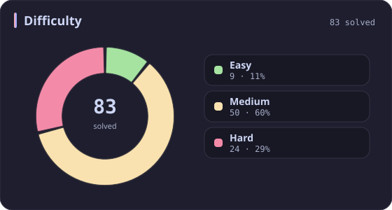
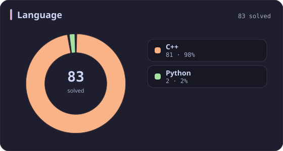
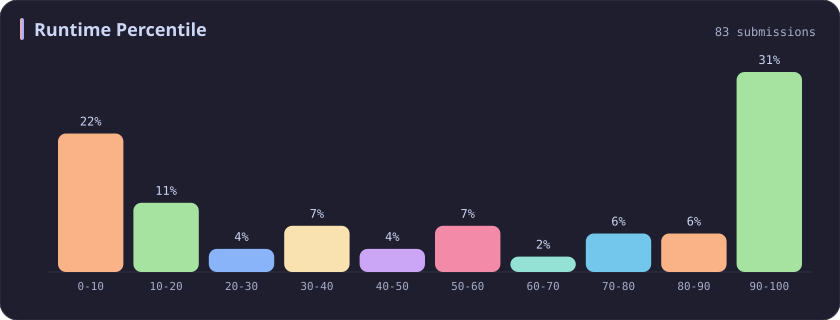
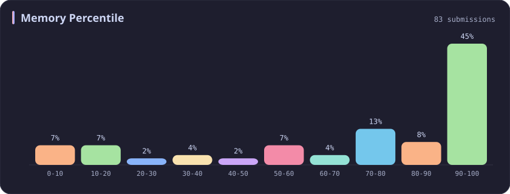
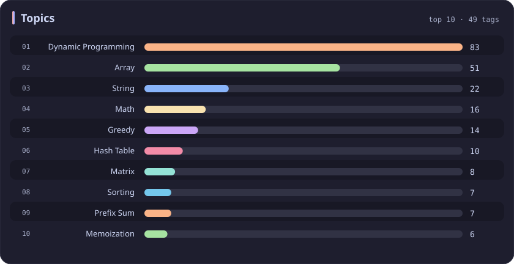

# Dynamic Programming Stats

[All stats](../../README.md)

**83** problems · updated `2026-09-04 19:32 UTC`

## Stats

### Difficulty

### Language

### Runtime Percentile

### Memory Percentile

### Topics

| Topic | # | Topic | # | Topic | # | Topic | # |
| :--- | ---: | :--- | ---: | :--- | ---: | :--- | ---: |
| [Array](array.md) | 387 | [Divide and Conquer](divide-and-conquer.md) | 16 | [Directed Acyclic Graph](directed-acyclic-graph.md) | 2 | [Range Minimum/Maximum Query](range-minimum-maximum-query.md) | 1 |
| [Hash Table](hash-table.md) | 168 | [Queue](queue.md) | 16 | [Quickselect](quickselect.md) | 2 | [Nim Game](nim-game.md) | 1 |
| [String](string.md) | 167 | [Trie](trie.md) | 11 | [Binary Lifting](binary-lifting.md) | 2 | [Impartial Game](impartial-game.md) | 1 |
| [Math](math.md) | 114 | [Binary Search Tree](binary-search-tree.md) | 11 | [Lowest Common Ancestor](lowest-common-ancestor.md) | 2 | [Binary Indexed Tree](binary-indexed-tree.md) | 1 |
| [Sorting](sorting.md) | 87 | [Monotonic Stack](monotonic-stack.md) | 10 | [Counting Sort](counting-sort.md) | 2 | [Sqrt Decomposition](sqrt-decomposition.md) | 1 |
| **Dynamic Programming** | **83** | [Number Theory](number-theory.md) | 10 | [Interactive](interactive.md) | 2 | [Complete Knapsack](complete-knapsack.md) | 1 |
| [Depth-First Search](depth-first-search.md) | 80 | [Ordered Set](ordered-set.md) | 8 | [Pigeonhole Principle](pigeonhole-principle.md) | 2 | [Reservoir Sampling](reservoir-sampling.md) | 1 |
| [Greedy](greedy.md) | 79 | [Combinatorics](combinatorics.md) | 7 | [Longest Increasing Subsequence](longest-increasing-subsequence.md) | 2 | [Bellman–Ford Algorithm](bellman-ford-algorithm.md) | 1 |
| [Two Pointers](two-pointers.md) | 70 | [Memoization](memoization.md) | 6 | [Segment Tree](segment-tree.md) | 2 | [Floyd–Warshall Algorithm](floyd-warshall-algorithm.md) | 1 |
| [Breadth-First Search](breadth-first-search.md) | 69 | [Data Stream](data-stream.md) | 6 | [Linear Algebra](linear-algebra.md) | 2 | [0-1 Knapsack](0-1-knapsack.md) | 1 |
| [Matrix](matrix.md) | 64 | [Shortest Path](shortest-path.md) | 6 | [Randomized](randomized.md) | 2 | [Aho–Corasick Algorithm](aho-corasick-algorithm.md) | 1 |
| [Binary Search](binary-search.md) | 63 | [Game Theory](game-theory.md) | 5 | [Heuristic Search](heuristic-search.md) | 2 | [Bidirectional Search](bidirectional-search.md) | 1 |
| [Tree](tree.md) | 60 | [Geometry](geometry.md) | 5 | [A* Search](a-search.md) | 2 | [Ternary Search](ternary-search.md) | 1 |
| [Binary Tree](binary-tree.md) | 50 | [Bracket Sequences](bracket-sequences.md) | 4 | [Hash Function](hash-function.md) | 2 | [Zero-Sum Game](zero-sum-game.md) | 1 |
| [Stack](stack.md) | 47 | [String Matching](string-matching.md) | 4 | [Greatest Common Divisor](greatest-common-divisor.md) | 2 | [Timsort](timsort.md) | 1 |
| [Prefix Sum](prefix-sum.md) | 46 | [Floyd's Cycle Finding Algorithm](floyd-s-cycle-finding-algorithm.md) | 4 | [Longest Common Subsequence](longest-common-subsequence.md) | 2 | [Radix Sort](radix-sort.md) | 1 |
| [Bit Manipulation](bit-manipulation.md) | 41 | [Topological Sort](topological-sort.md) | 4 | [Prime Factorization](prime-factorization.md) | 2 | [Triangulation](triangulation.md) | 1 |
| [Simulation](simulation.md) | 40 | [Monotonic Queue](monotonic-queue.md) | 4 | [Bitmask](bitmask.md) | 2 | [Euclidean Algorithm](euclidean-algorithm.md) | 1 |
| [Counting](counting.md) | 40 | [DP on Trees](dp-on-trees.md) | 4 | [Manacher](manacher.md) | 1 | [Minimum Spanning Tree](minimum-spanning-tree.md) | 1 |
| [Database](database.md) | 39 | [Brainteaser](brainteaser.md) | 4 | [Tournament Sort](tournament-sort.md) | 1 | [Doubly-Linked List](doubly-linked-list.md) | 1 |
| [Heap (Priority Queue)](heap-priority-queue.md) | 34 | [Polygons](polygons.md) | 4 | [Z Algorithm](z-algorithm.md) | 1 | [Least Common Multiple](least-common-multiple.md) | 1 |
| [Sliding Window](sliding-window.md) | 30 | [Merge Sort](merge-sort.md) | 3 | [Knuth–Morris–Pratt Algorithm](knuth-morris-pratt-algorithm.md) | 1 | [Fermat's Little Theorem](fermat-s-little-theorem.md) | 1 |
| [Linked List](linked-list.md) | 28 | [Algorithm X](algorithm-x.md) | 3 | [Boyer–Moore String-Search Algorithm](boyer-moore-string-search-algorithm.md) | 1 | [Kosaraju's Algorithm](kosaraju-s-algorithm.md) | 1 |
| [Graph Theory](graph-theory.md) | 27 | [Quicksort](quicksort.md) | 3 | [Dancing Links](dancing-links.md) | 1 | [Tarjan's SCC Algorithm](tarjan-s-scc-algorithm.md) | 1 |
| [Design](design.md) | 25 | [Minimax](minimax.md) | 3 | [Newton's Method](newton-s-method.md) | 1 | [Multiple Knapsack](multiple-knapsack.md) | 1 |
| [Recursion](recursion.md) | 21 | [Knapsack Problem](knapsack-problem.md) | 3 | [Bubble Sort](bubble-sort.md) | 1 | [Rolling Hash](rolling-hash.md) | 1 |
| [Backtracking](backtracking.md) | 18 | [Bucket Sort](bucket-sort.md) | 3 | [Primality Test](primality-test.md) | 1 |  |  |
| [Union-Find](union-find.md) | 17 | [Dijkstra's Algorithm](dijkstra-s-algorithm.md) | 3 | [Sieve Theory](sieve-theory.md) | 1 |  |  |
| [Enumeration](enumeration.md) | 17 | [Boyer–Moore Majority Vote Algorithm](boyer-moore-majority-vote-algorithm.md) | 2 | [Prime Number Sieve](prime-number-sieve.md) | 1 |  |  |

---

## Recent Activity

Latest **83** accepted submissions.

| Date | Title | Difficulty | Lang | Runtime | Memory |
| :--- | :--- | :---: | :---: | ---: | ---: |
| 2026&#8209;08&#8209;17 | [877. Stone Game](https://leetcode.com/problems/stone-game/) | Medium | C++ | 12 ms `17.70%` | 19.8 MB `7.31%` |
| 2026&#8209;08&#8209;17 | [1563. Stone Game V](https://leetcode.com/problems/stone-game-v/) | Hard | C++ | 407 ms `57.19%` | 27.6 MB `46.96%` |
| 2026&#8209;06&#8209;06 | [3952. Maximum Total Value of Covered Indices](https://leetcode.com/problems/maximum-total-value-of-covered-indices/) | Medium | C++ | 127 ms `33.96%` | 236.8 MB `31.46%` |
| 2026&#8209;06&#8209;04 | [3751. Total Waviness of Numbers in Range I](https://leetcode.com/problems/total-waviness-of-numbers-in-range-i/) | Medium | C++ | 50 ms `45.88%` | 9.3 MB `72.51%` |
| 2026&#8209;05&#8209;23 | [3938. Maximum Path Intersection Sum in a Grid](https://leetcode.com/problems/maximum-path-intersection-sum-in-a-grid/) | Medium | C++ | 72 ms `9.23%` | 185.7 MB `5.00%` |
| 2026&#8209;02&#8209;08 | [1653. Minimum Deletions to Make String Balanced](https://leetcode.com/problems/minimum-deletions-to-make-string-balanced/) | Medium | C++ | 51 ms `18.43%` | 55.1 MB `19.34%` |
| 2025&#8209;10&#8209;17 | [3003. Maximize the Number of Partitions After Operations](https://leetcode.com/problems/maximize-the-number-of-partitions-after-operations/) | Hard | C++ | 4 ms `96.26%` | 12.3 MB `97.20%` |
| 2025&#8209;10&#8209;12 | [3539. Find Sum of Array Product of Magical Sequences](https://leetcode.com/problems/find-sum-of-array-product-of-magical-sequences/) | Hard | Python | 411 ms `97.50%` | 33.9 MB `70.00%` |
| 2025&#8209;10&#8209;11 | [3147. Taking Maximum Energy From the Mystic Dungeon](https://leetcode.com/problems/taking-maximum-energy-from-the-mystic-dungeon/) | Medium | C++ | 141 ms `82.37%` | 151.8 MB `100.00%` |
| 2025&#8209;10&#8209;11 | [3186. Maximum Total Damage With Spell Casting](https://leetcode.com/problems/maximum-total-damage-with-spell-casting/) | Medium | C++ | 111 ms `86.08%` | 162.8 MB `90.83%` |
| 2025&#8209;09&#8209;29 | [1039. Minimum Score Triangulation of Polygon](https://leetcode.com/problems/minimum-score-triangulation-of-polygon/) | Medium | C++ | 5 ms `10.47%` | 11.4 MB `15.89%` |
| 2025&#8209;09&#8209;28 | [3700. Number of ZigZag Arrays II](https://leetcode.com/problems/number-of-zigzag-arrays-ii/) | Hard | C++ | 285 ms `71.83%` | 23.4 MB `79.93%` |
| 2025&#8209;09&#8209;28 | [3699. Number of ZigZag Arrays I](https://leetcode.com/problems/number-of-zigzag-arrays-i/) | Hard | C++ | 407 ms `76.79%` | 11.7 MB `94.59%` |
| 2025&#8209;09&#8209;27 | [3693. Climbing Stairs II](https://leetcode.com/problems/climbing-stairs-ii/) | Medium | C++ | 20 ms `54.23%` | 177.8 MB `64.31%` |
| 2025&#8209;09&#8209;25 | [120. Triangle](https://leetcode.com/problems/triangle/) | Medium | C++ | 0 ms `100.00%` | 13.9 MB `5.01%` |
| 2025&#8209;09&#8209;09 | [2327. Number of People Aware of a Secret](https://leetcode.com/problems/number-of-people-aware-of-a-secret/) | Medium | C++ | 34 ms `9.11%` | 9.1 MB `92.86%` |
| 2025&#8209;08&#8209;27 | [3459. Length of Longest V-Shaped Diagonal Segment](https://leetcode.com/problems/length-of-longest-v-shaped-diagonal-segment/) | Hard | C++ | 231 ms `91.38%` | 111.8 MB `52.16%` |
| 2025&#8209;06&#8209;13 | [2616. Minimize the Maximum Difference of Pairs](https://leetcode.com/problems/minimize-the-maximum-difference-of-pairs/) | Medium | C++ | 30 ms `30.34%` | 86.8 MB `50.70%` |
| 2025&#8209;05&#8209;29 | [3068. Find the Maximum Sum of Node Values](https://leetcode.com/problems/find-the-maximum-sum-of-node-values/) | Hard | C++ | 111 ms `11.83%` | 158 MB `11.26%` |
| 2025&#8209;05&#8209;26 | [1857. Largest Color Value in a Directed Graph](https://leetcode.com/problems/largest-color-value-in-a-directed-graph/) | Hard | C++ | 401 ms `39.45%` | 188.9 MB `30.53%` |
| 2025&#8209;05&#8209;24 | [3557. Find Maximum Number of Non Intersecting Substrings](https://leetcode.com/problems/find-maximum-number-of-non-intersecting-substrings/) | Medium | C++ | 3 ms `98.31%` | 20.2 MB `90.40%` |
| 2025&#8209;05&#8209;16 | [2901. Longest Unequal Adjacent Groups Subsequence II](https://leetcode.com/problems/longest-unequal-adjacent-groups-subsequence-ii/) | Medium | C++ | 63 ms `64.73%` | 34.4 MB `74.88%` |
| 2025&#8209;05&#8209;15 | [2900. Longest Unequal Adjacent Groups Subsequence I](https://leetcode.com/problems/longest-unequal-adjacent-groups-subsequence-i/) | Easy | C++ | 0 ms `100.00%` | 29.9 MB `88.73%` |
| 2025&#8209;05&#8209;14 | [3337. Total Characters in String After Transformations II](https://leetcode.com/problems/total-characters-in-string-after-transformations-ii/) | Hard | C++ | 543 ms `9.64%` | 70.7 MB `42.17%` |
| 2025&#8209;05&#8209;13 | [3335. Total Characters in String After Transformations I](https://leetcode.com/problems/total-characters-in-string-after-transformations-i/) | Medium | C++ | 14 ms `98.77%` | 19.2 MB `88.62%` |
| 2025&#8209;05&#8209;09 | [3343. Count Number of Balanced Permutations](https://leetcode.com/problems/count-number-of-balanced-permutations/) | Hard | C++ | 150 ms `50.60%` | 19.4 MB `65.06%` |
| 2025&#8209;05&#8209;05 | [790. Domino and Tromino Tiling](https://leetcode.com/problems/domino-and-tromino-tiling/) | Medium | C++ | 0 ms `100.00%` | 7.9 MB `86.89%` |
| 2025&#8209;05&#8209;04 | [487. Max Consecutive Ones II](https://leetcode.com/problems/max-consecutive-ones-ii/) | Medium | C++ | 0 ms `100.00%` | 39.8 MB `87.01%` |
| 2025&#8209;05&#8209;02 | [838. Push Dominoes](https://leetcode.com/problems/push-dominoes/) | Medium | C++ | 27 ms `32.11%` | 27.2 MB `30.96%` |
| 2025&#8209;04&#8209;24 | [45. Jump Game II](https://leetcode.com/problems/jump-game-ii/) | Medium | C++ | 0 ms `100.00%` | 20.6 MB `78.55%` |
| 2025&#8209;04&#8209;24 | [55. Jump Game](https://leetcode.com/problems/jump-game/) | Medium | C++ | 0 ms `100.00%` | 52.3 MB `83.21%` |
| 2025&#8209;04&#8209;24 | [122. Best Time to Buy and Sell Stock II](https://leetcode.com/problems/best-time-to-buy-and-sell-stock-ii/) | Medium | C++ | 0 ms `100.00%` | 17 MB `100.00%` |
| 2025&#8209;04&#8209;24 | [121. Best Time to Buy and Sell Stock](https://leetcode.com/problems/best-time-to-buy-and-sell-stock/) | Easy | C++ | 0 ms `100.00%` | 97.2 MB `99.49%` |
| 2025&#8209;04&#8209;24 | [435. Non-overlapping Intervals](https://leetcode.com/problems/non-overlapping-intervals/) | Medium | C++ | 47 ms `52.82%` | 93.8 MB `90.88%` |
| 2025&#8209;04&#8209;24 | [714. Best Time to Buy and Sell Stock with Transaction Fee](https://leetcode.com/problems/best-time-to-buy-and-sell-stock-with-transaction-fee/) | Medium | C++ | 0 ms `100.00%` | 58.9 MB `100.00%` |
| 2025&#8209;04&#8209;23 | [338. Counting Bits](https://leetcode.com/problems/counting-bits/) | Easy | C++ | 0 ms `100.00%` | 11.4 MB `8.16%` |
| 2025&#8209;04&#8209;23 | [1143. Longest Common Subsequence](https://leetcode.com/problems/longest-common-subsequence/) | Medium | C++ | 24 ms `72.81%` | 27.4 MB `55.87%` |
| 2025&#8209;04&#8209;23 | [72. Edit Distance](https://leetcode.com/problems/edit-distance/) | Medium | C++ | 11 ms `28.88%` | 13.1 MB `74.14%` |
| 2025&#8209;04&#8209;23 | [62. Unique Paths](https://leetcode.com/problems/unique-paths/) | Medium | C++ | 0 ms `100.00%` | 9 MB `72.04%` |
| 2025&#8209;04&#8209;23 | [1137. N-th Tribonacci Number](https://leetcode.com/problems/n-th-tribonacci-number/) | Easy | C++ | 0 ms `100.00%` | 7.7 MB `98.51%` |
| 2025&#8209;04&#8209;23 | [746. Min Cost Climbing Stairs](https://leetcode.com/problems/min-cost-climbing-stairs/) | Easy | C++ | 0 ms `100.00%` | 17.5 MB `75.70%` |
| 2025&#8209;04&#8209;23 | [198. House Robber](https://leetcode.com/problems/house-robber/) | Medium | C++ | 0 ms `100.00%` | 10.8 MB `23.91%` |
| 2025&#8209;04&#8209;22 | [2338. Count the Number of Ideal Arrays](https://leetcode.com/problems/count-the-number-of-ideal-arrays/) | Hard | C++ | 10 ms `75.00%` | 10.3 MB `76.47%` |
| 2025&#8209;04&#8209;20 | [3524. Find X Value of Array I](https://leetcode.com/problems/find-x-value-of-array-i/) | Medium | C++ | 150 ms `82.08%` | 151.2 MB `54.72%` |
| 2025&#8209;04&#8209;19 | [1372. Longest ZigZag Path in a Binary Tree](https://leetcode.com/problems/longest-zigzag-path-in-a-binary-tree/) | Medium | C++ | 0 ms `100.00%` | 94.3 MB `99.04%` |
| 2025&#8209;04&#8209;19 | [1493. Longest Subarray of 1's After Deleting One Element](https://leetcode.com/problems/longest-subarray-of-1s-after-deleting-one-element/) | Medium | C++ | 4 ms `15.22%` | 62.3 MB `13.21%` |
| 2025&#8209;04&#8209;19 | [392. Is Subsequence](https://leetcode.com/problems/is-subsequence/) | Easy | C++ | 0 ms `100.00%` | 8.5 MB `91.47%` |
| 2025&#8209;04&#8209;07 | [416. Partition Equal Subset Sum](https://leetcode.com/problems/partition-equal-subset-sum/) | Medium | C++ | 71 ms `85.52%` | 15.9 MB `74.44%` |
| 2024&#8209;10&#8209;30 | [1671. Minimum Number of Removals to Make Mountain Array](https://leetcode.com/problems/minimum-number-of-removals-to-make-mountain-array/) | Hard | C++ | 5 ms `89.20%` | 15.1 MB `99.67%` |
| 2024&#8209;10&#8209;29 | [265. Paint House II](https://leetcode.com/problems/paint-house-ii/) | Hard | C++ | 0 ms `100.00%` | 15.4 MB `52.47%` |
| 2024&#8209;10&#8209;29 | [2684. Maximum Number of Moves in a Grid](https://leetcode.com/problems/maximum-number-of-moves-in-a-grid/) | Medium | C++ | 15 ms `58.58%` | 74.4 MB `74.18%` |
| 2024&#8209;10&#8209;28 | [2501. Longest Square Streak in an Array](https://leetcode.com/problems/longest-square-streak-in-an-array/) | Medium | C++ | 115 ms `34.23%` | 86.3 MB `98.21%` |
| 2024&#8209;10&#8209;27 | [1277. Count Square Submatrices with All Ones](https://leetcode.com/problems/count-square-submatrices-with-all-ones/) | Medium | C++ | 1039 ms `5.05%` | 26.5 MB `100.00%` |
| 2024&#8209;04&#8209;25 | [2370. Longest Ideal Subsequence](https://leetcode.com/problems/longest-ideal-subsequence/) | Medium | C++ | 28 ms `57.00%` | 11.5 MB `100.00%` |
| 2024&#8209;04&#8209;13 | [85. Maximal Rectangle](https://leetcode.com/problems/maximal-rectangle/) | Hard | Python | 1343 ms `6.67%` | 24.6 MB `50.77%` |
| 2024&#8209;04&#8209;12 | [42. Trapping Rain Water](https://leetcode.com/problems/trapping-rain-water/) | Hard | C++ | 13 ms `4.64%` | 22.2 MB `100.00%` |
| 2024&#8209;04&#8209;07 | [678. Valid Parenthesis String](https://leetcode.com/problems/valid-parenthesis-string/) | Medium | C++ | 3 ms `9.38%` | 7.2 MB `100.00%` |
| 2024&#8209;03&#8209;26 | [10. Regular Expression Matching](https://leetcode.com/problems/regular-expression-matching/) | Hard | C++ | 39 ms `10.93%` | 23.9 MB `5.07%` |
| 2023&#8209;10&#8209;08 | [1458. Max Dot Product of Two Subsequences](https://leetcode.com/problems/max-dot-product-of-two-subsequences/) | Hard | C++ | 24 ms `48.36%` | 9.8 MB `100.00%` |
| 2023&#8209;10&#8209;07 | [1420. Build Array Where You Can Find The Maximum Exactly K Comparisons](https://leetcode.com/problems/build-array-where-you-can-find-the-maximum-exactly-k-comparisons/) | Hard | C++ | 4 ms `99.37%` | 8.7 MB `99.69%` |
| 2023&#8209;10&#8209;06 | [343. Integer Break](https://leetcode.com/problems/integer-break/) | Medium | C++ | 2 ms `13.60%` | 6.2 MB `100.00%` |
| 2023&#8209;04&#8209;15 | [2218. Maximum Value of K Coins From Piles](https://leetcode.com/problems/maximum-value-of-k-coins-from-piles/) | Hard | C++ | 615 ms `5.04%` | 18 MB `93.82%` |
| 2023&#8209;04&#8209;14 | [516. Longest Palindromic Subsequence](https://leetcode.com/problems/longest-palindromic-subsequence/) | Medium | C++ | 85 ms `41.32%` | 72.3 MB `81.80%` |
| 2023&#8209;04&#8209;05 | [2439. Minimize Maximum of Array](https://leetcode.com/problems/minimize-maximum-of-array/) | Medium | C++ | 143 ms `5.03%` | 71.3 MB `100.00%` |
| 2023&#8209;04&#8209;01 | [2606. Find the Substring With Maximum Cost](https://leetcode.com/problems/find-the-substring-with-maximum-cost/) | Medium | C++ | 51 ms `5.05%` | 42.5 MB `18.08%` |
| 2023&#8209;03&#8209;31 | [1444. Number of Ways of Cutting a Pizza](https://leetcode.com/problems/number-of-ways-of-cutting-a-pizza/) | Hard | C++ | 23 ms `8.59%` | 8.2 MB `100.00%` |
| 2023&#8209;03&#8209;30 | [87. Scramble String](https://leetcode.com/problems/scramble-string/) | Hard | C++ | 171 ms `7.11%` | 36.2 MB `9.90%` |
| 2023&#8209;03&#8209;29 | [1402. Reducing Dishes](https://leetcode.com/problems/reducing-dishes/) | Hard | C++ | 24 ms `22.97%` | 8.2 MB `100.00%` |
| 2023&#8209;03&#8209;28 | [983. Minimum Cost For Tickets](https://leetcode.com/problems/minimum-cost-for-tickets/) | Medium | C++ | 0 ms `100.00%` | 9.7 MB `100.00%` |
| 2023&#8209;03&#8209;27 | [64. Minimum Path Sum](https://leetcode.com/problems/minimum-path-sum/) | Medium | C++ | 8 ms `5.26%` | 10.2 MB `100.00%` |
| 2023&#8209;03&#8209;19 | [118. Pascal's Triangle](https://leetcode.com/problems/pascals-triangle/) | Easy | C++ | 2 ms `15.08%` | 6.9 MB `100.00%` |
| 2023&#8209;03&#8209;19 | [2597. The Number of Beautiful Subsets](https://leetcode.com/problems/the-number-of-beautiful-subsets/) | Medium | C++ | 801 ms `28.10%` | 34 MB `100.00%` |
| 2023&#8209;03&#8209;15 | [53. Maximum Subarray](https://leetcode.com/problems/maximum-subarray/) | Medium | C++ | 144 ms `4.53%` | 73.1 MB `14.90%` |
| 2023&#8209;03&#8209;13 | [509. Fibonacci Number](https://leetcode.com/problems/fibonacci-number/) | Easy | C++ | 0 ms `100.00%` | 6.1 MB `100.00%` |
| 2023&#8209;03&#8209;13 | [542. 01 Matrix](https://leetcode.com/problems/01-matrix/) | Medium | C++ | 69 ms `7.79%` | 31.2 MB `99.98%` |
| 2023&#8209;03&#8209;13 | [70. Climbing Stairs](https://leetcode.com/problems/climbing-stairs/) | Easy | C++ | 0 ms `100.00%` | 5.9 MB `100.00%` |
| 2023&#8209;03&#8209;05 | [2585. Number of Ways to Earn Points](https://leetcode.com/problems/number-of-ways-to-earn-points/) | Hard | C++ | 280 ms `5.27%` | 17 MB `63.85%` |
| 2023&#8209;03&#8209;04 | [2581. Count Number of Possible Root Nodes](https://leetcode.com/problems/count-number-of-possible-root-nodes/) | Hard | C++ | 701 ms `18.68%` | 247.9 MB `22.18%` |
| 2023&#8209;02&#8209;17 | [300. Longest Increasing Subsequence](https://leetcode.com/problems/longest-increasing-subsequence/) | Medium | C++ | 7 ms `74.79%` | 10.4 MB `100.00%` |
| 2023&#8209;02&#8209;17 | [322. Coin Change](https://leetcode.com/problems/coin-change/) | Medium | C++ | 27 ms `63.28%` | 10.1 MB `100.00%` |
| 2023&#8209;02&#8209;16 | [152. Maximum Product Subarray](https://leetcode.com/problems/maximum-product-subarray/) | Medium | C++ | 7 ms `9.86%` | 13.8 MB `100.00%` |
| 2023&#8209;02&#8209;16 | [22. Generate Parentheses](https://leetcode.com/problems/generate-parentheses/) | Medium | C++ | 14 ms `6.05%` | 13 MB `82.22%` |
| 2023&#8209;02&#8209;15 | [5. Longest Palindromic Substring](https://leetcode.com/problems/longest-palindromic-substring/) | Medium | C++ | 37 ms `39.20%` | 7 MB `100.00%` |
