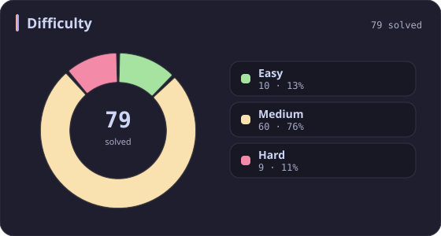
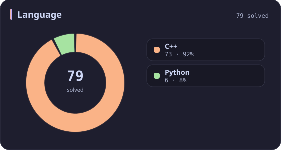
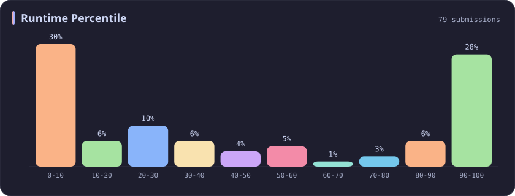
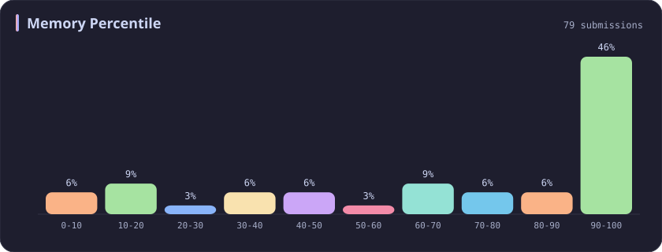
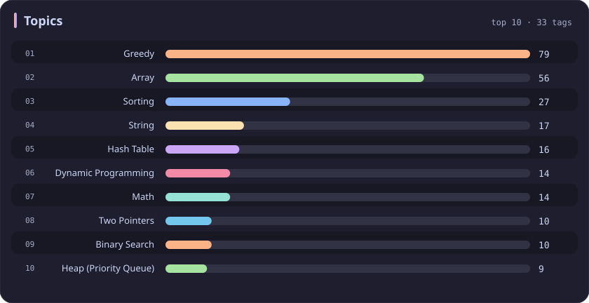

# Greedy Stats

[All stats](../../README.md)

**79** problems · updated `2026-09-04 19:32 UTC`

## Stats

### Difficulty

### Language

### Runtime Percentile

### Memory Percentile

### Topics

| Topic | # | Topic | # | Topic | # | Topic | # |
| :--- | ---: | :--- | ---: | :--- | ---: | :--- | ---: |
| [Array](array.md) | 387 | [Divide and Conquer](divide-and-conquer.md) | 16 | [Directed Acyclic Graph](directed-acyclic-graph.md) | 2 | [Range Minimum/Maximum Query](range-minimum-maximum-query.md) | 1 |
| [Hash Table](hash-table.md) | 168 | [Queue](queue.md) | 16 | [Quickselect](quickselect.md) | 2 | [Nim Game](nim-game.md) | 1 |
| [String](string.md) | 167 | [Trie](trie.md) | 11 | [Binary Lifting](binary-lifting.md) | 2 | [Impartial Game](impartial-game.md) | 1 |
| [Math](math.md) | 114 | [Binary Search Tree](binary-search-tree.md) | 11 | [Lowest Common Ancestor](lowest-common-ancestor.md) | 2 | [Binary Indexed Tree](binary-indexed-tree.md) | 1 |
| [Sorting](sorting.md) | 87 | [Monotonic Stack](monotonic-stack.md) | 10 | [Counting Sort](counting-sort.md) | 2 | [Sqrt Decomposition](sqrt-decomposition.md) | 1 |
| [Dynamic Programming](dynamic-programming.md) | 83 | [Number Theory](number-theory.md) | 10 | [Interactive](interactive.md) | 2 | [Complete Knapsack](complete-knapsack.md) | 1 |
| [Depth-First Search](depth-first-search.md) | 80 | [Ordered Set](ordered-set.md) | 8 | [Pigeonhole Principle](pigeonhole-principle.md) | 2 | [Reservoir Sampling](reservoir-sampling.md) | 1 |
| **Greedy** | **79** | [Combinatorics](combinatorics.md) | 7 | [Longest Increasing Subsequence](longest-increasing-subsequence.md) | 2 | [Bellman–Ford Algorithm](bellman-ford-algorithm.md) | 1 |
| [Two Pointers](two-pointers.md) | 70 | [Memoization](memoization.md) | 6 | [Segment Tree](segment-tree.md) | 2 | [Floyd–Warshall Algorithm](floyd-warshall-algorithm.md) | 1 |
| [Breadth-First Search](breadth-first-search.md) | 69 | [Data Stream](data-stream.md) | 6 | [Linear Algebra](linear-algebra.md) | 2 | [0-1 Knapsack](0-1-knapsack.md) | 1 |
| [Matrix](matrix.md) | 64 | [Shortest Path](shortest-path.md) | 6 | [Randomized](randomized.md) | 2 | [Aho–Corasick Algorithm](aho-corasick-algorithm.md) | 1 |
| [Binary Search](binary-search.md) | 63 | [Game Theory](game-theory.md) | 5 | [Heuristic Search](heuristic-search.md) | 2 | [Bidirectional Search](bidirectional-search.md) | 1 |
| [Tree](tree.md) | 60 | [Geometry](geometry.md) | 5 | [A* Search](a-search.md) | 2 | [Ternary Search](ternary-search.md) | 1 |
| [Binary Tree](binary-tree.md) | 50 | [Bracket Sequences](bracket-sequences.md) | 4 | [Hash Function](hash-function.md) | 2 | [Zero-Sum Game](zero-sum-game.md) | 1 |
| [Stack](stack.md) | 47 | [String Matching](string-matching.md) | 4 | [Greatest Common Divisor](greatest-common-divisor.md) | 2 | [Timsort](timsort.md) | 1 |
| [Prefix Sum](prefix-sum.md) | 46 | [Floyd's Cycle Finding Algorithm](floyd-s-cycle-finding-algorithm.md) | 4 | [Longest Common Subsequence](longest-common-subsequence.md) | 2 | [Radix Sort](radix-sort.md) | 1 |
| [Bit Manipulation](bit-manipulation.md) | 41 | [Topological Sort](topological-sort.md) | 4 | [Prime Factorization](prime-factorization.md) | 2 | [Triangulation](triangulation.md) | 1 |
| [Simulation](simulation.md) | 40 | [Monotonic Queue](monotonic-queue.md) | 4 | [Bitmask](bitmask.md) | 2 | [Euclidean Algorithm](euclidean-algorithm.md) | 1 |
| [Counting](counting.md) | 40 | [DP on Trees](dp-on-trees.md) | 4 | [Manacher](manacher.md) | 1 | [Minimum Spanning Tree](minimum-spanning-tree.md) | 1 |
| [Database](database.md) | 39 | [Brainteaser](brainteaser.md) | 4 | [Tournament Sort](tournament-sort.md) | 1 | [Doubly-Linked List](doubly-linked-list.md) | 1 |
| [Heap (Priority Queue)](heap-priority-queue.md) | 34 | [Polygons](polygons.md) | 4 | [Z Algorithm](z-algorithm.md) | 1 | [Least Common Multiple](least-common-multiple.md) | 1 |
| [Sliding Window](sliding-window.md) | 30 | [Merge Sort](merge-sort.md) | 3 | [Knuth–Morris–Pratt Algorithm](knuth-morris-pratt-algorithm.md) | 1 | [Fermat's Little Theorem](fermat-s-little-theorem.md) | 1 |
| [Linked List](linked-list.md) | 28 | [Algorithm X](algorithm-x.md) | 3 | [Boyer–Moore String-Search Algorithm](boyer-moore-string-search-algorithm.md) | 1 | [Kosaraju's Algorithm](kosaraju-s-algorithm.md) | 1 |
| [Graph Theory](graph-theory.md) | 27 | [Quicksort](quicksort.md) | 3 | [Dancing Links](dancing-links.md) | 1 | [Tarjan's SCC Algorithm](tarjan-s-scc-algorithm.md) | 1 |
| [Design](design.md) | 25 | [Minimax](minimax.md) | 3 | [Newton's Method](newton-s-method.md) | 1 | [Multiple Knapsack](multiple-knapsack.md) | 1 |
| [Recursion](recursion.md) | 21 | [Knapsack Problem](knapsack-problem.md) | 3 | [Bubble Sort](bubble-sort.md) | 1 | [Rolling Hash](rolling-hash.md) | 1 |
| [Backtracking](backtracking.md) | 18 | [Bucket Sort](bucket-sort.md) | 3 | [Primality Test](primality-test.md) | 1 |  |  |
| [Union-Find](union-find.md) | 17 | [Dijkstra's Algorithm](dijkstra-s-algorithm.md) | 3 | [Sieve Theory](sieve-theory.md) | 1 |  |  |
| [Enumeration](enumeration.md) | 17 | [Boyer–Moore Majority Vote Algorithm](boyer-moore-majority-vote-algorithm.md) | 2 | [Prime Number Sieve](prime-number-sieve.md) | 1 |  |  |

---

## Recent Activity

Latest **79** accepted submissions.

| Date | Title | Difficulty | Lang | Runtime | Memory |
| :--- | :--- | :---: | :---: | ---: | ---: |
| 2026&#8209;08&#8209;19 | [1386. Cinema Seat Allocation](https://leetcode.com/problems/cinema-seat-allocation/) | Medium | C++ | 125 ms `9.88%` | 84.2 MB `20.70%` |
| 2026&#8209;06&#8209;06 | [3952. Maximum Total Value of Covered Indices](https://leetcode.com/problems/maximum-total-value-of-covered-indices/) | Medium | C++ | 127 ms `33.96%` | 236.8 MB `31.46%` |
| 2026&#8209;02&#8209;09 | [1382. Balance a Binary Search Tree](https://leetcode.com/problems/balance-a-binary-search-tree/) | Medium | C++ | 22 ms `20.32%` | 65.6 MB `66.43%` |
| 2025&#8209;10&#8209;16 | [2598. Smallest Missing Non-negative Integer After Operations](https://leetcode.com/problems/smallest-missing-non-negative-integer-after-operations/) | Medium | C++ | 169 ms `13.05%` | 138.6 MB `45.43%` |
| 2025&#8209;10&#8209;07 | [1488. Avoid Flood in The City](https://leetcode.com/problems/avoid-flood-in-the-city/) | Medium | C++ | 216 ms `21.79%` | 121.2 MB `100.00%` |
| 2025&#8209;10&#8209;04 | [11. Container With Most Water](https://leetcode.com/problems/container-with-most-water/) | Medium | C++ | 0 ms `100.00%` | 62.8 MB `79.30%` |
| 2025&#8209;09&#8209;28 | [976. Largest Perimeter Triangle](https://leetcode.com/problems/largest-perimeter-triangle/) | Easy | C++ | 12 ms `25.68%` | 25.6 MB `79.00%` |
| 2025&#8209;09&#8209;27 | [3695. Maximize Alternating Sum Using Swaps](https://leetcode.com/problems/maximize-alternating-sum-using-swaps/) | Hard | C++ | 294 ms `56.92%` | 341.9 MB `32.45%` |
| 2025&#8209;09&#8209;27 | [3689. Maximum Total Subarray Value I](https://leetcode.com/problems/maximum-total-subarray-value-i/) | Medium | C++ | 5 ms `15.46%` | 103.6 MB `97.34%` |
| 2025&#8209;09&#8209;26 | [611. Valid Triangle Number](https://leetcode.com/problems/valid-triangle-number/) | Medium | C++ | 430 ms `8.62%` | 16.8 MB `10.43%` |
| 2025&#8209;09&#8209;10 | [1733. Minimum Number of People to Teach](https://leetcode.com/problems/minimum-number-of-people-to-teach/) | Medium | C++ | 35 ms `82.77%` | 67.6 MB `68.42%` |
| 2025&#8209;09&#8209;01 | [1792. Maximum Average Pass Ratio](https://leetcode.com/problems/maximum-average-pass-ratio/) | Medium | C++ | 273 ms `89.50%` | 97.9 MB `69.41%` |
| 2025&#8209;08&#8209;16 | [1323. Maximum 69 Number](https://leetcode.com/problems/maximum-69-number/) | Easy | Python | 0 ms `100.00%` | 17.9 MB `100.00%` |
| 2025&#8209;06&#8209;19 | [2294. Partition Array Such That Maximum Difference Is K](https://leetcode.com/problems/partition-array-such-that-maximum-difference-is-k/) | Medium | C++ | 35 ms `76.66%` | 87 MB `100.00%` |
| 2025&#8209;06&#8209;18 | [2966. Divide Array Into Arrays With Max Difference](https://leetcode.com/problems/divide-array-into-arrays-with-max-difference/) | Medium | C++ | 115 ms `13.42%` | 126.1 MB `18.08%` |
| 2025&#8209;06&#8209;15 | [1432. Max Difference You Can Get From Changing an Integer](https://leetcode.com/problems/max-difference-you-can-get-from-changing-an-integer/) | Medium | Python | 0 ms `100.00%` | 17.6 MB `100.00%` |
| 2025&#8209;06&#8209;14 | [2566. Maximum Difference by Remapping a Digit](https://leetcode.com/problems/maximum-difference-by-remapping-a-digit/) | Easy | Python | 0 ms `100.00%` | 17.9 MB `100.00%` |
| 2025&#8209;06&#8209;13 | [2616. Minimize the Maximum Difference of Pairs](https://leetcode.com/problems/minimize-the-maximum-difference-of-pairs/) | Medium | C++ | 30 ms `30.34%` | 86.8 MB `50.70%` |
| 2025&#8209;06&#8209;07 | [3170. Lexicographically Minimum String After Removing Stars](https://leetcode.com/problems/lexicographically-minimum-string-after-removing-stars/) | Medium | C++ | 54 ms `80.71%` | 27.2 MB `42.51%` |
| 2025&#8209;06&#8209;06 | [2434. Using a Robot to Print the Lexicographically Smallest String](https://leetcode.com/problems/using-a-robot-to-print-the-lexicographically-smallest-string/) | Medium | C++ | 67 ms `26.26%` | 51.4 MB `5.20%` |
| 2025&#8209;06&#8209;02 | [135. Candy](https://leetcode.com/problems/candy/) | Hard | C++ | 4 ms `28.57%` | 22.9 MB `69.10%` |
| 2025&#8209;05&#8209;29 | [3068. Find the Maximum Sum of Node Values](https://leetcode.com/problems/find-the-maximum-sum-of-node-values/) | Hard | C++ | 111 ms `11.83%` | 158 MB `11.26%` |
| 2025&#8209;05&#8209;25 | [2131. Longest Palindrome by Concatenating Two Letter Words](https://leetcode.com/problems/longest-palindrome-by-concatenating-two-letter-words/) | Medium | C++ | 27 ms `88.02%` | 171.9 MB `78.72%` |
| 2025&#8209;05&#8209;24 | [3557. Find Maximum Number of Non Intersecting Substrings](https://leetcode.com/problems/find-maximum-number-of-non-intersecting-substrings/) | Medium | C++ | 3 ms `98.31%` | 20.2 MB `90.40%` |
| 2025&#8209;05&#8209;22 | [3362. Zero Array Transformation III](https://leetcode.com/problems/zero-array-transformation-iii/) | Medium | C++ | 128 ms `50.88%` | 224.5 MB `38.16%` |
| 2025&#8209;05&#8209;15 | [2900. Longest Unequal Adjacent Groups Subsequence I](https://leetcode.com/problems/longest-unequal-adjacent-groups-subsequence-i/) | Easy | C++ | 0 ms `100.00%` | 29.9 MB `88.73%` |
| 2025&#8209;05&#8209;11 | [484. Find Permutation](https://leetcode.com/problems/find-permutation/) | Medium | C++ | 3 ms `29.79%` | 14.4 MB `14.89%` |
| 2025&#8209;05&#8209;11 | [3547. Maximum Sum of Edge Values in a Graph](https://leetcode.com/problems/maximum-sum-of-edge-values-in-a-graph/) | Hard | C++ | 195 ms `41.78%` | 191.3 MB `100.00%` |
| 2025&#8209;05&#8209;11 | [3545. Minimum Deletions for At Most K Distinct Characters](https://leetcode.com/problems/minimum-deletions-for-at-most-k-distinct-characters/) | Easy | C++ | 3 ms `41.64%` | 9 MB `89.15%` |
| 2025&#8209;05&#8209;10 | [3542. Minimum Operations to Convert All Elements to Zero](https://leetcode.com/problems/minimum-operations-to-convert-all-elements-to-zero/) | Medium | C++ | 1960 ms `5.13%` | 484.1 MB `5.40%` |
| 2025&#8209;05&#8209;10 | [2918. Minimum Equal Sum of Two Arrays After Replacing Zeros](https://leetcode.com/problems/minimum-equal-sum-of-two-arrays-after-replacing-zeros/) | Medium | C++ | 127 ms `94.22%` | 135.5 MB `100.00%` |
| 2025&#8209;05&#8209;04 | [253. Meeting Rooms II](https://leetcode.com/problems/meeting-rooms-ii/) | Medium | C++ | 0 ms `100.00%` | 15.9 MB `99.80%` |
| 2025&#8209;05&#8209;04 | [1055. Shortest Way to Form String](https://leetcode.com/problems/shortest-way-to-form-string/) | Medium | C++ | 0 ms `100.00%` | 8.7 MB `96.94%` |
| 2025&#8209;05&#8209;03 | [1007. Minimum Domino Rotations For Equal Row](https://leetcode.com/problems/minimum-domino-rotations-for-equal-row/) | Medium | Python | 91 ms `9.86%` | 18.4 MB `100.00%` |
| 2025&#8209;05&#8209;01 | [2071. Maximum Number of Tasks You Can Assign](https://leetcode.com/problems/maximum-number-of-tasks-you-can-assign/) | Hard | C++ | 714 ms `60.06%` | 286.3 MB `39.93%` |
| 2025&#8209;04&#8209;25 | [280. Wiggle Sort](https://leetcode.com/problems/wiggle-sort/) | Medium | C++ | 0 ms `100.00%` | 17.7 MB `79.14%` |
| 2025&#8209;04&#8209;25 | [624. Maximum Distance in Arrays](https://leetcode.com/problems/maximum-distance-in-arrays/) | Medium | C++ | 0 ms `100.00%` | 108.2 MB `18.53%` |
| 2025&#8209;04&#8209;24 | [134. Gas Station](https://leetcode.com/problems/gas-station/) | Medium | C++ | 3 ms `34.61%` | 112.5 MB `61.27%` |
| 2025&#8209;04&#8209;24 | [45. Jump Game II](https://leetcode.com/problems/jump-game-ii/) | Medium | C++ | 0 ms `100.00%` | 20.6 MB `78.55%` |
| 2025&#8209;04&#8209;24 | [55. Jump Game](https://leetcode.com/problems/jump-game/) | Medium | C++ | 0 ms `100.00%` | 52.3 MB `83.21%` |
| 2025&#8209;04&#8209;24 | [122. Best Time to Buy and Sell Stock II](https://leetcode.com/problems/best-time-to-buy-and-sell-stock-ii/) | Medium | C++ | 0 ms `100.00%` | 17 MB `100.00%` |
| 2025&#8209;04&#8209;24 | [452. Minimum Number of Arrows to Burst Balloons](https://leetcode.com/problems/minimum-number-of-arrows-to-burst-balloons/) | Medium | C++ | 44 ms `72.58%` | 93.7 MB `99.85%` |
| 2025&#8209;04&#8209;24 | [435. Non-overlapping Intervals](https://leetcode.com/problems/non-overlapping-intervals/) | Medium | C++ | 47 ms `52.82%` | 93.8 MB `90.88%` |
| 2025&#8209;04&#8209;24 | [714. Best Time to Buy and Sell Stock with Transaction Fee](https://leetcode.com/problems/best-time-to-buy-and-sell-stock-with-transaction-fee/) | Medium | C++ | 0 ms `100.00%` | 58.9 MB `100.00%` |
| 2025&#8209;04&#8209;23 | [2542. Maximum Subsequence Score](https://leetcode.com/problems/maximum-subsequence-score/) | Medium | C++ | 75 ms `30.92%` | 99.3 MB `27.05%` |
| 2025&#8209;04&#8209;20 | [781. Rabbits in Forest](https://leetcode.com/problems/rabbits-in-forest/) | Medium | C++ | 4 ms `7.15%` | 12.3 MB `37.72%` |
| 2025&#8209;04&#8209;20 | [3523. Make Array Non-decreasing](https://leetcode.com/problems/make-array-non-decreasing/) | Medium | C++ | 0 ms `100.00%` | 206.4 MB `51.04%` |
| 2025&#8209;04&#8209;20 | [649. Dota2 Senate](https://leetcode.com/problems/dota2-senate/) | Medium | C++ | 7 ms `17.56%` | 12.6 MB `7.47%` |
| 2025&#8209;04&#8209;19 | [334. Increasing Triplet Subsequence](https://leetcode.com/problems/increasing-triplet-subsequence/) | Medium | C++ | 0 ms `100.00%` | 115.7 MB `67.97%` |
| 2025&#8209;04&#8209;19 | [605. Can Place Flowers](https://leetcode.com/problems/can-place-flowers/) | Easy | C++ | 0 ms `100.00%` | 24.1 MB `43.87%` |
| 2024&#8209;11&#8209;14 | [2064. Minimized Maximum of Products Distributed to Any Store](https://leetcode.com/problems/minimized-maximum-of-products-distributed-to-any-store/) | Medium | C++ | 34 ms `46.39%` | 87.4 MB `100.00%` |
| 2024&#8209;11&#8209;11 | [2601. Prime Subtraction Operation](https://leetcode.com/problems/prime-subtraction-operation/) | Medium | C++ | 25 ms `34.60%` | 28.7 MB `41.64%` |
| 2024&#8209;10&#8209;30 | [1671. Minimum Number of Removals to Make Mountain Array](https://leetcode.com/problems/minimum-number-of-removals-to-make-mountain-array/) | Hard | C++ | 5 ms `89.20%` | 15.1 MB `99.67%` |
| 2024&#8209;10&#8209;20 | [846. Hand of Straights](https://leetcode.com/problems/hand-of-straights/) | Medium | C++ | 57 ms `7.27%` | 32.2 MB `63.49%` |
| 2024&#8209;10&#8209;20 | [2486. Append Characters to String to Make Subsequence](https://leetcode.com/problems/append-characters-to-string-to-make-subsequence/) | Medium | C++ | 4 ms `21.75%` | 12.2 MB `99.78%` |
| 2024&#8209;04&#8209;11 | [402. Remove K Digits](https://leetcode.com/problems/remove-k-digits/) | Medium | Python | 63 ms `5.34%` | 18.1 MB `100.00%` |
| 2024&#8209;04&#8209;07 | [678. Valid Parenthesis String](https://leetcode.com/problems/valid-parenthesis-string/) | Medium | C++ | 3 ms `9.38%` | 7.2 MB `100.00%` |
| 2024&#8209;03&#8209;30 | [3091. Apply Operations to Make Sum of Array Greater Than or Equal to k](https://leetcode.com/problems/apply-operations-to-make-sum-of-array-greater-than-or-equal-to-k/) | Medium | C++ | 0 ms `100.00%` | 7.3 MB `100.00%` |
| 2023&#8209;10&#8209;02 | [2038. Remove Colored Pieces if Both Neighbors are the Same Color](https://leetcode.com/problems/remove-colored-pieces-if-both-neighbors-are-the-same-color/) | Medium | Python | 205 ms `9.43%` | 19.9 MB `85.28%` |
| 2023&#8209;04&#8209;05 | [2439. Minimize Maximum of Array](https://leetcode.com/problems/minimize-maximum-of-array/) | Medium | C++ | 143 ms `5.03%` | 71.3 MB `100.00%` |
| 2023&#8209;04&#8209;04 | [2405. Optimal Partition of String](https://leetcode.com/problems/optimal-partition-of-string/) | Medium | C++ | 248 ms `5.08%` | 72.1 MB `11.02%` |
| 2023&#8209;04&#8209;03 | [881. Boats to Save People](https://leetcode.com/problems/boats-to-save-people/) | Medium | C++ | 246 ms `5.78%` | 70.4 MB `5.29%` |
| 2023&#8209;04&#8209;02 | [2611. Mice and Cheese](https://leetcode.com/problems/mice-and-cheese/) | Medium | C++ | 217 ms `5.13%` | 110.2 MB `81.62%` |
| 2023&#8209;04&#8209;01 | [2607. Make K-Subarray Sums Equal](https://leetcode.com/problems/make-k-subarray-sums-equal/) | Medium | C++ | 203 ms `5.81%` | 112.6 MB `90.70%` |
| 2023&#8209;03&#8209;29 | [1402. Reducing Dishes](https://leetcode.com/problems/reducing-dishes/) | Hard | C++ | 24 ms `22.97%` | 8.2 MB `100.00%` |
| 2023&#8209;03&#8209;26 | [2600. K Items With the Maximum Sum](https://leetcode.com/problems/k-items-with-the-maximum-sum/) | Easy | C++ | 0 ms `100.00%` | 6 MB `100.00%` |
| 2023&#8209;03&#8209;18 | [2592. Maximize Greatness of an Array](https://leetcode.com/problems/maximize-greatness-of-an-array/) | Medium | C++ | 244 ms `5.29%` | 96.7 MB `16.04%` |
| 2023&#8209;03&#8209;18 | [2591. Distribute Money to Maximum Children](https://leetcode.com/problems/distribute-money-to-maximum-children/) | Easy | C++ | 4 ms `7.48%` | 6 MB `100.00%` |
| 2023&#8209;03&#8209;13 | [409. Longest Palindrome](https://leetcode.com/problems/longest-palindrome/) | Easy | C++ | 7 ms `2.03%` | 6.7 MB `100.00%` |
| 2023&#8209;03&#8209;12 | [2587. Rearrange Array to Maximize Prefix Score](https://leetcode.com/problems/rearrange-array-to-maximize-prefix-score/) | Medium | C++ | 158 ms `5.18%` | 90.1 MB `47.79%` |
| 2023&#8209;03&#8209;08 | [2429. Minimize XOR](https://leetcode.com/problems/minimize-xor/) | Medium | C++ | 0 ms `100.00%` | 6.3 MB `100.00%` |
| 2023&#8209;03&#8209;06 | [1689. Partitioning Into Minimum Number Of Deci-Binary Numbers](https://leetcode.com/problems/partitioning-into-minimum-number-of-deci-binary-numbers/) | Medium | C++ | 29 ms `7.02%` | 13.6 MB `100.00%` |
| 2023&#8209;03&#8209;04 | [2578. Split With Minimum Sum](https://leetcode.com/problems/split-with-minimum-sum/) | Easy | C++ | 0 ms `100.00%` | 5.9 MB `100.00%` |
| 2023&#8209;02&#8209;27 | [1481. Least Number of Unique Integers after K Removals](https://leetcode.com/problems/least-number-of-unique-integers-after-k-removals/) | Medium | C++ | 252 ms `5.05%` | 64.2 MB `96.17%` |
| 2023&#8209;02&#8209;26 | [2576. Find the Maximum Number of Marked Indices](https://leetcode.com/problems/find-the-maximum-number-of-marked-indices/) | Medium | C++ | 374 ms `5.81%` | 100.2 MB `5.16%` |
| 2023&#8209;02&#8209;24 | [1675. Minimize Deviation in Array](https://leetcode.com/problems/minimize-deviation-in-array/) | Hard | C++ | 561 ms `5.36%` | 56.8 MB `99.49%` |
| 2023&#8209;02&#8209;23 | [502. IPO](https://leetcode.com/problems/ipo/) | Hard | C++ | 232 ms `5.04%` | 78.1 MB `100.00%` |
| 2023&#8209;02&#8209;19 | [1282. Group the People Given the Group Size They Belong To](https://leetcode.com/problems/group-the-people-given-the-group-size-they-belong-to/) | Medium | C++ | 4 ms `51.29%` | 13.3 MB `100.00%` |
| 2023&#8209;02&#8209;18 | [2567. Minimum Score by Changing Two Elements](https://leetcode.com/problems/minimum-score-by-changing-two-elements/) | Medium | C++ | 104 ms `7.44%` | 34.2 MB `100.00%` |
