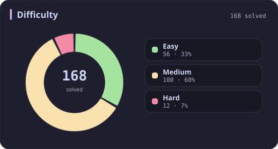
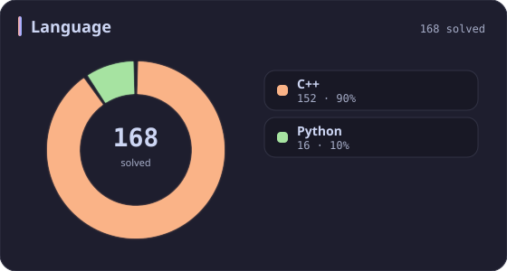
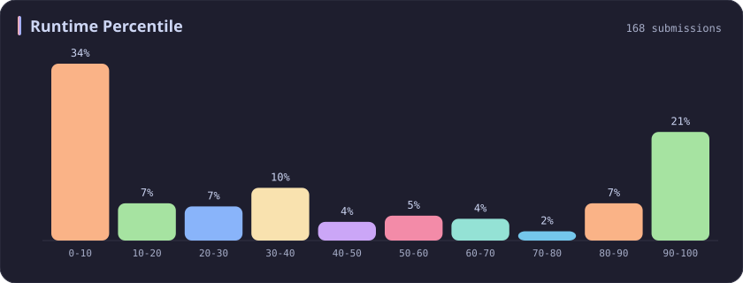
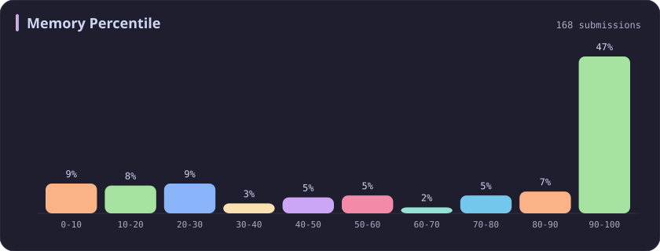
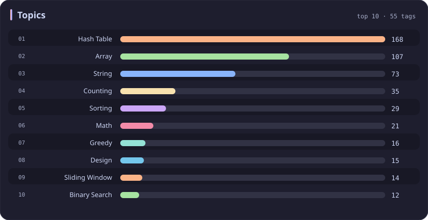

# Hash Table Stats

[All stats](../../README.md)

**168** problems · updated `2026-09-05 03:41 UTC+8`

## Stats

### Difficulty

### Language

### Runtime Percentile

### Memory Percentile

### Topics

| Topic | # | Topic | # | Topic | # | Topic | # |
| :--- | ---: | :--- | ---: | :--- | ---: | :--- | ---: |
| [Array](array.md) | 387 | [Divide and Conquer](divide-and-conquer.md) | 16 | [Directed Acyclic Graph](directed-acyclic-graph.md) | 2 | [Range Minimum/Maximum Query](range-minimum-maximum-query.md) | 1 |
| **Hash Table** | **168** | [Queue](queue.md) | 16 | [Quickselect](quickselect.md) | 2 | [Nim Game](nim-game.md) | 1 |
| [String](string.md) | 167 | [Trie](trie.md) | 11 | [Binary Lifting](binary-lifting.md) | 2 | [Impartial Game](impartial-game.md) | 1 |
| [Math](math.md) | 114 | [Binary Search Tree](binary-search-tree.md) | 11 | [Lowest Common Ancestor](lowest-common-ancestor.md) | 2 | [Binary Indexed Tree](binary-indexed-tree.md) | 1 |
| [Sorting](sorting.md) | 87 | [Monotonic Stack](monotonic-stack.md) | 10 | [Counting Sort](counting-sort.md) | 2 | [Sqrt Decomposition](sqrt-decomposition.md) | 1 |
| [Dynamic Programming](dynamic-programming.md) | 83 | [Number Theory](number-theory.md) | 10 | [Interactive](interactive.md) | 2 | [Complete Knapsack](complete-knapsack.md) | 1 |
| [Depth-First Search](depth-first-search.md) | 80 | [Ordered Set](ordered-set.md) | 8 | [Pigeonhole Principle](pigeonhole-principle.md) | 2 | [Reservoir Sampling](reservoir-sampling.md) | 1 |
| [Greedy](greedy.md) | 79 | [Combinatorics](combinatorics.md) | 7 | [Longest Increasing Subsequence](longest-increasing-subsequence.md) | 2 | [Bellman–Ford Algorithm](bellman-ford-algorithm.md) | 1 |
| [Two Pointers](two-pointers.md) | 70 | [Memoization](memoization.md) | 6 | [Segment Tree](segment-tree.md) | 2 | [Floyd–Warshall Algorithm](floyd-warshall-algorithm.md) | 1 |
| [Breadth-First Search](breadth-first-search.md) | 69 | [Data Stream](data-stream.md) | 6 | [Linear Algebra](linear-algebra.md) | 2 | [0-1 Knapsack](0-1-knapsack.md) | 1 |
| [Matrix](matrix.md) | 64 | [Shortest Path](shortest-path.md) | 6 | [Randomized](randomized.md) | 2 | [Aho–Corasick Algorithm](aho-corasick-algorithm.md) | 1 |
| [Binary Search](binary-search.md) | 63 | [Game Theory](game-theory.md) | 5 | [Heuristic Search](heuristic-search.md) | 2 | [Bidirectional Search](bidirectional-search.md) | 1 |
| [Tree](tree.md) | 60 | [Geometry](geometry.md) | 5 | [A* Search](a-search.md) | 2 | [Ternary Search](ternary-search.md) | 1 |
| [Binary Tree](binary-tree.md) | 50 | [Bracket Sequences](bracket-sequences.md) | 4 | [Hash Function](hash-function.md) | 2 | [Zero-Sum Game](zero-sum-game.md) | 1 |
| [Stack](stack.md) | 47 | [String Matching](string-matching.md) | 4 | [Greatest Common Divisor](greatest-common-divisor.md) | 2 | [Timsort](timsort.md) | 1 |
| [Prefix Sum](prefix-sum.md) | 46 | [Floyd's Cycle Finding Algorithm](floyd-s-cycle-finding-algorithm.md) | 4 | [Longest Common Subsequence](longest-common-subsequence.md) | 2 | [Radix Sort](radix-sort.md) | 1 |
| [Bit Manipulation](bit-manipulation.md) | 41 | [Topological Sort](topological-sort.md) | 4 | [Prime Factorization](prime-factorization.md) | 2 | [Triangulation](triangulation.md) | 1 |
| [Simulation](simulation.md) | 40 | [Monotonic Queue](monotonic-queue.md) | 4 | [Bitmask](bitmask.md) | 2 | [Euclidean Algorithm](euclidean-algorithm.md) | 1 |
| [Counting](counting.md) | 40 | [DP on Trees](dp-on-trees.md) | 4 | [Manacher](manacher.md) | 1 | [Minimum Spanning Tree](minimum-spanning-tree.md) | 1 |
| [Database](database.md) | 39 | [Brainteaser](brainteaser.md) | 4 | [Tournament Sort](tournament-sort.md) | 1 | [Doubly-Linked List](doubly-linked-list.md) | 1 |
| [Heap (Priority Queue)](heap-priority-queue.md) | 34 | [Polygons](polygons.md) | 4 | [Z Algorithm](z-algorithm.md) | 1 | [Least Common Multiple](least-common-multiple.md) | 1 |
| [Sliding Window](sliding-window.md) | 30 | [Merge Sort](merge-sort.md) | 3 | [Knuth–Morris–Pratt Algorithm](knuth-morris-pratt-algorithm.md) | 1 | [Fermat's Little Theorem](fermat-s-little-theorem.md) | 1 |
| [Linked List](linked-list.md) | 28 | [Algorithm X](algorithm-x.md) | 3 | [Boyer–Moore String-Search Algorithm](boyer-moore-string-search-algorithm.md) | 1 | [Kosaraju's Algorithm](kosaraju-s-algorithm.md) | 1 |
| [Graph Theory](graph-theory.md) | 27 | [Quicksort](quicksort.md) | 3 | [Dancing Links](dancing-links.md) | 1 | [Tarjan's SCC Algorithm](tarjan-s-scc-algorithm.md) | 1 |
| [Design](design.md) | 25 | [Minimax](minimax.md) | 3 | [Newton's Method](newton-s-method.md) | 1 | [Multiple Knapsack](multiple-knapsack.md) | 1 |
| [Recursion](recursion.md) | 21 | [Knapsack Problem](knapsack-problem.md) | 3 | [Bubble Sort](bubble-sort.md) | 1 | [Rolling Hash](rolling-hash.md) | 1 |
| [Backtracking](backtracking.md) | 18 | [Bucket Sort](bucket-sort.md) | 3 | [Primality Test](primality-test.md) | 1 |  |  |
| [Union-Find](union-find.md) | 17 | [Dijkstra's Algorithm](dijkstra-s-algorithm.md) | 3 | [Sieve Theory](sieve-theory.md) | 1 |  |  |
| [Enumeration](enumeration.md) | 17 | [Boyer–Moore Majority Vote Algorithm](boyer-moore-majority-vote-algorithm.md) | 2 | [Prime Number Sieve](prime-number-sieve.md) | 1 |  |  |

---

## Recent Activity

Latest **100** accepted submissions.

| Date | Title | Difficulty | Lang | Runtime | Memory |
| :--- | :--- | :---: | :---: | ---: | ---: |
| 2026&#8209;09&#8209;05 | [1. Two Sum](https://leetcode.com/problems/two-sum/) | Easy | C++ | 3 ms `67.25%` | 14.8 MB `58.55%` |
| 2026&#8209;08&#8209;19 | [1386. Cinema Seat Allocation](https://leetcode.com/problems/cinema-seat-allocation/) | Medium | C++ | 125 ms `9.88%` | 84.2 MB `20.70%` |
| 2026&#8209;08&#8209;18 | [3471. Find the Largest Almost Missing Integer](https://leetcode.com/problems/find-the-largest-almost-missing-integer/) | Easy | C++ | 0 ms `100.00%` | 28.9 MB `92.57%` |
| 2026&#8209;05&#8209;31 | [3945. Digit Frequency Score](https://leetcode.com/problems/digit-frequency-score/) | Easy | C++ | 0 ms `100.00%` | 8.7 MB `54.46%` |
| 2026&#8209;05&#8209;24 | [3941. Password Strength](https://leetcode.com/problems/password-strength/) | Medium | C++ | 20 ms `39.05%` | 17.6 MB `58.98%` |
| 2026&#8209;05&#8209;23 | [2744. Find Maximum Number of String Pairs](https://leetcode.com/problems/find-maximum-number-of-string-pairs/) | Easy | Python | 15 ms `8.76%` | 19.3 MB `18.79%` |
| 2026&#8209;05&#8209;21 | [3043. Find the Length of the Longest Common Prefix](https://leetcode.com/problems/find-the-length-of-the-longest-common-prefix/) | Medium | C++ | 374 ms `18.26%` | 156.5 MB `52.60%` |
| 2026&#8209;05&#8209;20 | [2657. Find the Prefix Common Array of Two Arrays](https://leetcode.com/problems/find-the-prefix-common-array-of-two-arrays/) | Medium | C++ | 0 ms `100.00%` | 85.9 MB `74.63%` |
| 2026&#8209;05&#8209;19 | [2540. Minimum Common Value](https://leetcode.com/problems/minimum-common-value/) | Easy | C++ | 0 ms `100.00%` | 54.6 MB `26.20%` |
| 2026&#8209;02&#8209;10 | [3719. Longest Balanced Subarray I](https://leetcode.com/problems/longest-balanced-subarray-i/) | Medium | C++ | 151 ms `89.04%` | 35.7 MB `94.90%` |
| 2025&#8209;10&#8209;16 | [2598. Smallest Missing Non-negative Integer After Operations](https://leetcode.com/problems/smallest-missing-non-negative-integer-after-operations/) | Medium | C++ | 169 ms `13.05%` | 138.6 MB `45.43%` |
| 2025&#8209;10&#8209;13 | [2273. Find Resultant Array After Removing Anagrams](https://leetcode.com/problems/find-resultant-array-after-removing-anagrams/) | Easy | C++ | 3 ms `45.53%` | 17.9 MB `24.76%` |
| 2025&#8209;10&#8209;12 | [3715. Sum of Perfect Square Ancestors](https://leetcode.com/problems/sum-of-perfect-square-ancestors/) | Hard | C++ | 1461 ms `21.09%` | 383.2 MB `25.85%` |
| 2025&#8209;10&#8209;12 | [3714. Longest Balanced Substring II](https://leetcode.com/problems/longest-balanced-substring-ii/) | Medium | C++ | 1603 ms `59.24%` | 403.9 MB `18.22%` |
| 2025&#8209;10&#8209;12 | [3713. Longest Balanced Substring I](https://leetcode.com/problems/longest-balanced-substring-i/) | Medium | C++ | 3030 ms `5.07%` | 498.4 MB `5.06%` |
| 2025&#8209;10&#8209;12 | [3712. Sum of Elements With Frequency Divisible by K](https://leetcode.com/problems/sum-of-elements-with-frequency-divisible-by-k/) | Easy | C++ | 0 ms `100.00%` | 26.4 MB `12.32%` |
| 2025&#8209;10&#8209;12 | [3186. Maximum Total Damage With Spell Casting](https://leetcode.com/problems/maximum-total-damage-with-spell-casting/) | Medium | C++ | 111 ms `86.08%` | 162.8 MB `90.83%` |
| 2025&#8209;10&#8209;07 | [1488. Avoid Flood in The City](https://leetcode.com/problems/avoid-flood-in-the-city/) | Medium | C++ | 216 ms `21.79%` | 121.2 MB `100.00%` |
| 2025&#8209;09&#8209;27 | [3694. Distinct Points Reachable After Substring Removal](https://leetcode.com/problems/distinct-points-reachable-after-substring-removal/) | Medium | C++ | 130 ms `52.48%` | 53.5 MB `42.98%` |
| 2025&#8209;09&#8209;27 | [3692. Majority Frequency Characters](https://leetcode.com/problems/majority-frequency-characters/) | Easy | C++ | 5 ms `31.61%` | 9.2 MB `86.77%` |
| 2025&#8209;09&#8209;27 | [3690. Split and Merge Array Transformation](https://leetcode.com/problems/split-and-merge-array-transformation/) | Medium | C++ | 1672 ms `7.57%` | 432.5 MB `21.01%` |
| 2025&#8209;09&#8209;26 | [1152. Analyze User Website Visit Pattern](https://leetcode.com/problems/analyze-user-website-visit-pattern/) | Medium | C++ | 55 ms `19.05%` | 26.6 MB `42.86%` |
| 2025&#8209;09&#8209;24 | [166. Fraction to Recurring Decimal](https://leetcode.com/problems/fraction-to-recurring-decimal/) | Medium | Python | 0 ms `100.00%` | 17.9 MB `100.00%` |
| 2025&#8209;09&#8209;22 | [3005. Count Elements With Maximum Frequency](https://leetcode.com/problems/count-elements-with-maximum-frequency/) | Easy | C++ | 0 ms `100.00%` | 23.6 MB `8.88%` |
| 2025&#8209;09&#8209;21 | [1912. Design Movie Rental System](https://leetcode.com/problems/design-movie-rental-system/) | Hard | C++ | 333 ms `34.71%` | 444.6 MB `8.94%` |
| 2025&#8209;09&#8209;21 | [3508. Implement Router](https://leetcode.com/problems/implement-router/) | Medium | C++ | 190 ms `82.01%` | 415.1 MB `99.28%` |
| 2025&#8209;09&#8209;20 | [3484. Design Spreadsheet](https://leetcode.com/problems/design-spreadsheet/) | Medium | Python | 57 ms `96.77%` | 23.5 MB `100.00%` |
| 2025&#8209;09&#8209;19 | [3408. Design Task Manager](https://leetcode.com/problems/design-task-manager/) | Medium | C++ | 209 ms `78.45%` | 347.5 MB `98.90%` |
| 2025&#8209;09&#8209;17 | [2353. Design a Food Rating System](https://leetcode.com/problems/design-a-food-rating-system/) | Medium | C++ | 164 ms `34.81%` | 162.7 MB `91.36%` |
| 2025&#8209;09&#8209;15 | [1935. Maximum Number of Words You Can Type](https://leetcode.com/problems/maximum-number-of-words-you-can-type/) | Easy | Python | 3 ms `33.08%` | 17.9 MB `100.00%` |
| 2025&#8209;09&#8209;14 | [966. Vowel Spellchecker](https://leetcode.com/problems/vowel-spellchecker/) | Medium | C++ | 37 ms `68.34%` | 41.6 MB `55.21%` |
| 2025&#8209;09&#8209;13 | [3541. Find Most Frequent Vowel and Consonant](https://leetcode.com/problems/find-most-frequent-vowel-and-consonant/) | Easy | C++ | 2 ms `39.99%` | 10 MB `24.45%` |
| 2025&#8209;09&#8209;10 | [1133. Largest Unique Number](https://leetcode.com/problems/largest-unique-number/) | Easy | C++ | 0 ms `100.00%` | 12.2 MB `95.53%` |
| 2025&#8209;09&#8209;10 | [1733. Minimum Number of People to Teach](https://leetcode.com/problems/minimum-number-of-people-to-teach/) | Medium | C++ | 35 ms `82.77%` | 67.6 MB `68.42%` |
| 2025&#8209;08&#8209;31 | [37. Sudoku Solver](https://leetcode.com/problems/sudoku-solver/) | Hard | C++ | 46 ms `97.76%` | 8.7 MB `97.42%` |
| 2025&#8209;08&#8209;30 | [36. Valid Sudoku](https://leetcode.com/problems/valid-sudoku/) | Medium | C++ | 0 ms `100.00%` | 22.7 MB `57.13%` |
| 2025&#8209;08&#8209;27 | [1181. Before and After Puzzle](https://leetcode.com/problems/before-and-after-puzzle/) | Medium | Python | 15 ms `5.56%` | 18.2 MB `100.00%` |
| 2025&#8209;06&#8209;10 | [3442. Maximum Difference Between Even and Odd Frequency I](https://leetcode.com/problems/maximum-difference-between-even-and-odd-frequency-i/) | Easy | C++ | 3 ms `36.10%` | 9.9 MB `27.80%` |
| 2025&#8209;06&#8209;07 | [3170. Lexicographically Minimum String After Removing Stars](https://leetcode.com/problems/lexicographically-minimum-string-after-removing-stars/) | Medium | C++ | 54 ms `80.71%` | 27.2 MB `42.51%` |
| 2025&#8209;06&#8209;06 | [2434. Using a Robot to Print the Lexicographically Smallest String](https://leetcode.com/problems/using-a-robot-to-print-the-lexicographically-smallest-string/) | Medium | C++ | 67 ms `26.26%` | 51.4 MB `5.20%` |
| 2025&#8209;05&#8209;27 | [1857. Largest Color Value in a Directed Graph](https://leetcode.com/problems/largest-color-value-in-a-directed-graph/) | Hard | C++ | 401 ms `39.45%` | 188.9 MB `30.53%` |
| 2025&#8209;05&#8209;25 | [2131. Longest Palindrome by Concatenating Two Letter Words](https://leetcode.com/problems/longest-palindrome-by-concatenating-two-letter-words/) | Medium | C++ | 27 ms `88.02%` | 171.9 MB `78.72%` |
| 2025&#8209;05&#8209;24 | [3557. Find Maximum Number of Non Intersecting Substrings](https://leetcode.com/problems/find-maximum-number-of-non-intersecting-substrings/) | Medium | C++ | 3 ms `98.31%` | 20.2 MB `90.40%` |
| 2025&#8209;05&#8209;24 | [3556. Sum of Largest Prime Substrings](https://leetcode.com/problems/sum-of-largest-prime-substrings/) | Medium | C++ | 15 ms `51.49%` | 10.8 MB `60.40%` |
| 2025&#8209;05&#8209;21 | [73. Set Matrix Zeroes](https://leetcode.com/problems/set-matrix-zeroes/) | Medium | C++ | 0 ms `100.00%` | 18.7 MB `99.98%` |
| 2025&#8209;05&#8209;14 | [3337. Total Characters in String After Transformations II](https://leetcode.com/problems/total-characters-in-string-after-transformations-ii/) | Hard | C++ | 543 ms `9.64%` | 70.7 MB `42.17%` |
| 2025&#8209;05&#8209;13 | [3335. Total Characters in String After Transformations I](https://leetcode.com/problems/total-characters-in-string-after-transformations-i/) | Medium | C++ | 14 ms `98.77%` | 19.2 MB `88.62%` |
| 2025&#8209;05&#8209;12 | [3289. The Two Sneaky Numbers of Digitville](https://leetcode.com/problems/the-two-sneaky-numbers-of-digitville/) | Easy | C++ | 0 ms `100.00%` | 26.5 MB `21.86%` |
| 2025&#8209;05&#8209;12 | [1429. First Unique Number](https://leetcode.com/problems/first-unique-number/) | Medium | C++ | 195 ms `84.46%` | 128.1 MB `99.72%` |
| 2025&#8209;05&#8209;12 | [359. Logger Rate Limiter](https://leetcode.com/problems/logger-rate-limiter/) | Easy | C++ | 4 ms `86.98%` | 39.2 MB `89.46%` |
| 2025&#8209;05&#8209;12 | [770. Basic Calculator IV](https://leetcode.com/problems/basic-calculator-iv/) | Hard | C++ | 4 ms `85.71%` | 21.8 MB `99.51%` |
| 2025&#8209;05&#8209;12 | [2094. Finding 3-Digit Even Numbers](https://leetcode.com/problems/finding-3-digit-even-numbers/) | Easy | C++ | 0 ms `100.00%` | 12.5 MB `82.00%` |
| 2025&#8209;05&#8209;11 | [3548. Equal Sum Grid Partition II](https://leetcode.com/problems/equal-sum-grid-partition-ii/) | Hard | C++ | 826 ms `55.46%` | 400.9 MB `37.86%` |
| 2025&#8209;05&#8209;11 | [3545. Minimum Deletions for At Most K Distinct Characters](https://leetcode.com/problems/minimum-deletions-for-at-most-k-distinct-characters/) | Easy | C++ | 3 ms `41.64%` | 9 MB `89.15%` |
| 2025&#8209;05&#8209;10 | [3542. Minimum Operations to Convert All Elements to Zero](https://leetcode.com/problems/minimum-operations-to-convert-all-elements-to-zero/) | Medium | C++ | 1960 ms `5.13%` | 484.1 MB `5.40%` |
| 2025&#8209;05&#8209;04 | [616. Add Bold Tag in String](https://leetcode.com/problems/add-bold-tag-in-string/) | Medium | C++ | 7 ms `65.58%` | 13.9 MB `59.74%` |
| 2025&#8209;05&#8209;04 | [311. Sparse Matrix Multiplication](https://leetcode.com/problems/sparse-matrix-multiplication/) | Medium | C++ | 0 ms `100.00%` | 12.5 MB `11.29%` |
| 2025&#8209;05&#8209;04 | [531. Lonely Pixel I](https://leetcode.com/problems/lonely-pixel-i/) | Medium | Python | 32 ms `5.66%` | 22.9 MB `100.00%` |
| 2025&#8209;05&#8209;04 | [1198. Find Smallest Common Element in All Rows](https://leetcode.com/problems/find-smallest-common-element-in-all-rows/) | Medium | C++ | 12 ms `33.33%` | 31.3 MB `25.56%` |
| 2025&#8209;05&#8209;04 | [1426. Counting Elements](https://leetcode.com/problems/counting-elements/) | Easy | C++ | 0 ms `100.00%` | 11.5 MB `36.21%` |
| 2025&#8209;05&#8209;04 | [249. Group Shifted Strings](https://leetcode.com/problems/group-shifted-strings/) | Medium | C++ | 1 ms `64.95%` | 10.9 MB `92.27%` |
| 2025&#8209;05&#8209;04 | [1165. Single-Row Keyboard](https://leetcode.com/problems/single-row-keyboard/) | Easy | C++ | 0 ms `100.00%` | 9.2 MB `95.06%` |
| 2025&#8209;05&#8209;04 | [1100. Find K-Length Substrings With No Repeated Characters](https://leetcode.com/problems/find-k-length-substrings-with-no-repeated-characters/) | Medium | C++ | 0 ms `100.00%` | 9 MB `73.74%` |
| 2025&#8209;05&#8209;04 | [340. Longest Substring with At Most K Distinct Characters](https://leetcode.com/problems/longest-substring-with-at-most-k-distinct-characters/) | Medium | C++ | 0 ms `100.00%` | 9.7 MB `78.62%` |
| 2025&#8209;05&#8209;04 | [159. Longest Substring with At Most Two Distinct Characters](https://leetcode.com/problems/longest-substring-with-at-most-two-distinct-characters/) | Medium | C++ | 3 ms `93.66%` | 12.1 MB `88.81%` |
| 2025&#8209;05&#8209;04 | [1128. Number of Equivalent Domino Pairs](https://leetcode.com/problems/number-of-equivalent-domino-pairs/) | Easy | C++ | 0 ms `100.00%` | 26.1 MB `92.76%` |
| 2025&#8209;05&#8209;03 | [981. Time Based Key-Value Store](https://leetcode.com/problems/time-based-key-value-store/) | Medium | C++ | 38 ms `86.73%` | 136.5 MB `84.35%` |
| 2025&#8209;05&#8209;03 | [353. Design Snake Game](https://leetcode.com/problems/design-snake-game/) | Medium | C++ | 199 ms `5.48%` | 582.8 MB `19.86%` |
| 2025&#8209;04&#8209;29 | [734. Sentence Similarity](https://leetcode.com/problems/sentence-similarity/) | Easy | C++ | 2 ms `52.34%` | 15.7 MB `70.09%` |
| 2025&#8209;04&#8209;27 | [3532. Path Existence Queries in a Graph I](https://leetcode.com/problems/path-existence-queries-in-a-graph-i/) | Medium | C++ | 482 ms `5.06%` | 327.8 MB `5.23%` |
| 2025&#8209;04&#8209;27 | [3531. Count Covered Buildings](https://leetcode.com/problems/count-covered-buildings/) | Medium | C++ | 894 ms `10.51%` | 451.1 MB `10.05%` |
| 2025&#8209;04&#8209;26 | [3527. Find the Most Common Response](https://leetcode.com/problems/find-the-most-common-response/) | Medium | C++ | 1472 ms `24.07%` | 479.3 MB `51.50%` |
| 2025&#8209;04&#8209;26 | [266. Palindrome Permutation](https://leetcode.com/problems/palindrome-permutation/) | Easy | C++ | 0 ms `100.00%` | 8.2 MB `88.46%` |
| 2025&#8209;04&#8209;26 | [760. Find Anagram Mappings](https://leetcode.com/problems/find-anagram-mappings/) | Easy | Python | 0 ms `100.00%` | 17.7 MB `100.00%` |
| 2025&#8209;04&#8209;25 | [2845. Count of Interesting Subarrays](https://leetcode.com/problems/count-of-interesting-subarrays/) | Medium | C++ | 59 ms `42.22%` | 127.3 MB `10.79%` |
| 2025&#8209;04&#8209;24 | [2799. Count Complete Subarrays in an Array](https://leetcode.com/problems/count-complete-subarrays-in-an-array/) | Medium | C++ | 19 ms `70.43%` | 40.3 MB `95.38%` |
| 2025&#8209;04&#8209;24 | [380. Insert Delete GetRandom O(1)](https://leetcode.com/problems/insert-delete-getrandom-o1/) | Medium | C++ | 31 ms `93.33%` | 113.3 MB `28.69%` |
| 2025&#8209;04&#8209;24 | [169. Majority Element](https://leetcode.com/problems/majority-element/) | Easy | C++ | 0 ms `100.00%` | 28.1 MB `95.18%` |
| 2025&#8209;04&#8209;24 | [208. Implement Trie (Prefix Tree)](https://leetcode.com/problems/implement-trie-prefix-tree/) | Medium | C++ | 15 ms `86.33%` | 29.9 MB `99.66%` |
| 2025&#8209;04&#8209;24 | [17. Letter Combinations of a Phone Number](https://leetcode.com/problems/letter-combinations-of-a-phone-number/) | Medium | Python | 0 ms `100.00%` | 17.7 MB `100.00%` |
| 2025&#8209;04&#8209;23 | [1399. Count Largest Group](https://leetcode.com/problems/count-largest-group/) | Easy | C++ | 0 ms `100.00%` | 7.9 MB `77.49%` |
| 2025&#8209;04&#8209;21 | [2336. Smallest Number in Infinite Set](https://leetcode.com/problems/smallest-number-in-infinite-set/) | Medium | C++ | 33 ms `14.17%` | 54.3 MB `9.29%` |
| 2025&#8209;04&#8209;20 | [781. Rabbits in Forest](https://leetcode.com/problems/rabbits-in-forest/) | Medium | C++ | 4 ms `7.15%` | 12.3 MB `37.72%` |
| 2025&#8209;04&#8209;20 | [3522. Calculate Score After Performing Instructions](https://leetcode.com/problems/calculate-score-after-performing-instructions/) | Medium | C++ | 4 ms `64.29%` | 167.2 MB `74.06%` |
| 2025&#8209;04&#8209;20 | [1657. Determine if Two Strings Are Close](https://leetcode.com/problems/determine-if-two-strings-are-close/) | Medium | C++ | 27 ms `35.74%` | 23.6 MB `49.60%` |
| 2025&#8209;04&#8209;20 | [1207. Unique Number of Occurrences](https://leetcode.com/problems/unique-number-of-occurrences/) | Easy | C++ | 0 ms `100.00%` | 11.8 MB `88.68%` |
| 2025&#8209;04&#8209;20 | [2215. Find the Difference of Two Arrays](https://leetcode.com/problems/find-the-difference-of-two-arrays/) | Easy | Python | 5 ms `77.75%` | 18 MB `100.00%` |
| 2025&#8209;04&#8209;20 | [2352. Equal Row and Column Pairs](https://leetcode.com/problems/equal-row-and-column-pairs/) | Medium | Python | 51 ms `32.70%` | 22.1 MB `99.98%` |
| 2025&#8209;04&#8209;20 | [1679. Max Number of K-Sum Pairs](https://leetcode.com/problems/max-number-of-k-sum-pairs/) | Medium | C++ | 106 ms `31.48%` | 72 MB `23.30%` |
| 2025&#8209;04&#8209;20 | [325. Maximum Size Subarray Sum Equals k](https://leetcode.com/problems/maximum-size-subarray-sum-equals-k/) | Medium | C++ | 353 ms `6.74%` | 122.8 MB `74.16%` |
| 2025&#8209;04&#8209;10 | [3375. Minimum Operations to Make Array Values Equal to K](https://leetcode.com/problems/minimum-operations-to-make-array-values-equal-to-k/) | Easy | C++ | 6 ms `89.22%` | 32.2 MB `71.12%` |
| 2025&#8209;04&#8209;08 | [3396. Minimum Number of Operations to Make Elements in Array Distinct](https://leetcode.com/problems/minimum-number-of-operations-to-make-elements-in-array-distinct/) | Easy | C++ | 0 ms `100.00%` | 27.9 MB `40.94%` |
| 2025&#8209;02&#8209;14 | [448. Find All Numbers Disappeared in an Array](https://leetcode.com/problems/find-all-numbers-disappeared-in-an-array/) | Easy | C++ | 4 ms `66.42%` | 54.8 MB `45.01%` |
| 2024&#8209;11&#8209;21 | [2516. Take K of Each Character From Left and Right](https://leetcode.com/problems/take-k-of-each-character-from-left-and-right/) | Medium | C++ | 21 ms `29.47%` | 11.9 MB `100.00%` |
| 2024&#8209;11&#8209;19 | [2461. Maximum Sum of Distinct Subarrays With Length K](https://leetcode.com/problems/maximum-sum-of-distinct-subarrays-with-length-k/) | Medium | C++ | 212 ms `8.96%` | 100.9 MB `13.48%` |
| 2024&#8209;11&#8209;14 | [1213. Intersection of Three Sorted Arrays](https://leetcode.com/problems/intersection-of-three-sorted-arrays/) | Easy | Python | 4 ms `41.61%` | 16.9 MB `100.00%` |
| 2024&#8209;11&#8209;07 | [2275. Largest Combination With Bitwise AND Greater Than Zero](https://leetcode.com/problems/largest-combination-with-bitwise-and-greater-than-zero/) | Medium | C++ | 43 ms `19.26%` | 60.2 MB `100.00%` |
| 2024&#8209;11&#8209;04 | [2955. Number of Same-End Substrings](https://leetcode.com/problems/number-of-same-end-substrings/) | Medium | C++ | 238 ms `15.38%` | 230.3 MB `7.69%` |
| 2024&#8209;10&#8209;28 | [2501. Longest Square Streak in an Array](https://leetcode.com/problems/longest-square-streak-in-an-array/) | Medium | C++ | 115 ms `34.23%` | 86.3 MB `98.21%` |
| 2024&#8209;10&#8209;23 | [2641. Cousins in Binary Tree II](https://leetcode.com/problems/cousins-in-binary-tree-ii/) | Medium | C++ | 157 ms `16.02%` | 392.9 MB `8.35%` |
