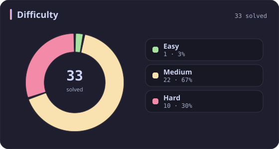
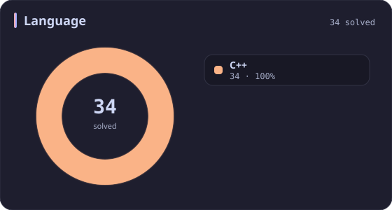
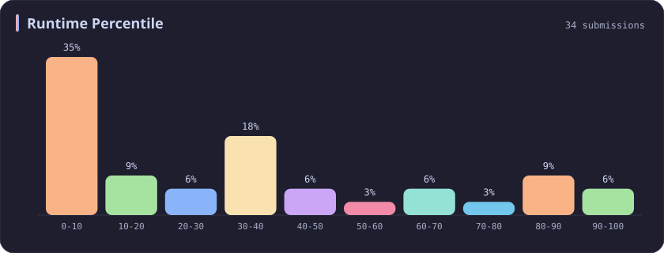
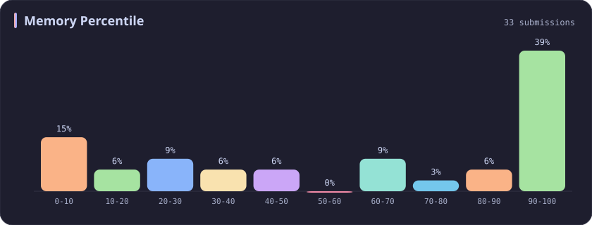
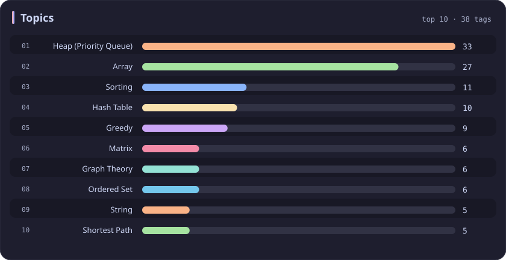

# Heap (Priority Queue) Stats

[All stats](../../README.md)

**33** problems · updated `2026-09-04 19:23 UTC`

## Stats

### Difficulty

### Language

### Runtime Percentile

### Memory Percentile

### Topics

| Topic | # | Topic | # | Topic | # | Topic | # |
| :--- | ---: | :--- | ---: | :--- | ---: | :--- | ---: |
| [Array](array.md) | 386 | [Divide and Conquer](divide-and-conquer.md) | 16 | [Directed Acyclic Graph](directed-acyclic-graph.md) | 2 | [Range Minimum/Maximum Query](range-minimum-maximum-query.md) | 1 |
| [Hash Table](hash-table.md) | 168 | [Queue](queue.md) | 16 | [Quickselect](quickselect.md) | 2 | [Nim Game](nim-game.md) | 1 |
| [String](string.md) | 167 | [Trie](trie.md) | 11 | [Binary Lifting](binary-lifting.md) | 2 | [Impartial Game](impartial-game.md) | 1 |
| [Math](math.md) | 114 | [Binary Search Tree](binary-search-tree.md) | 11 | [Lowest Common Ancestor](lowest-common-ancestor.md) | 2 | [Binary Indexed Tree](binary-indexed-tree.md) | 1 |
| [Sorting](sorting.md) | 86 | [Monotonic Stack](monotonic-stack.md) | 10 | [Counting Sort](counting-sort.md) | 2 | [Sqrt Decomposition](sqrt-decomposition.md) | 1 |
| [Dynamic Programming](dynamic-programming.md) | 83 | [Number Theory](number-theory.md) | 10 | [Interactive](interactive.md) | 2 | [Complete Knapsack](complete-knapsack.md) | 1 |
| [Depth-First Search](depth-first-search.md) | 80 | [Ordered Set](ordered-set.md) | 8 | [Pigeonhole Principle](pigeonhole-principle.md) | 2 | [Reservoir Sampling](reservoir-sampling.md) | 1 |
| [Greedy](greedy.md) | 79 | [Combinatorics](combinatorics.md) | 7 | [Longest Increasing Subsequence](longest-increasing-subsequence.md) | 2 | [Bellman–Ford Algorithm](bellman-ford-algorithm.md) | 1 |
| [Two Pointers](two-pointers.md) | 70 | [Memoization](memoization.md) | 6 | [Segment Tree](segment-tree.md) | 2 | [Floyd–Warshall Algorithm](floyd-warshall-algorithm.md) | 1 |
| [Breadth-First Search](breadth-first-search.md) | 69 | [Data Stream](data-stream.md) | 6 | [Linear Algebra](linear-algebra.md) | 2 | [0-1 Knapsack](0-1-knapsack.md) | 1 |
| [Matrix](matrix.md) | 64 | [Shortest Path](shortest-path.md) | 6 | [Randomized](randomized.md) | 2 | [Aho–Corasick Algorithm](aho-corasick-algorithm.md) | 1 |
| [Binary Search](binary-search.md) | 63 | [Game Theory](game-theory.md) | 5 | [Heuristic Search](heuristic-search.md) | 2 | [Bidirectional Search](bidirectional-search.md) | 1 |
| [Tree](tree.md) | 60 | [Geometry](geometry.md) | 5 | [A* Search](a-search.md) | 2 | [Ternary Search](ternary-search.md) | 1 |
| [Binary Tree](binary-tree.md) | 50 | [Bracket Sequences](bracket-sequences.md) | 4 | [Hash Function](hash-function.md) | 2 | [Zero-Sum Game](zero-sum-game.md) | 1 |
| [Stack](stack.md) | 47 | [String Matching](string-matching.md) | 4 | [Greatest Common Divisor](greatest-common-divisor.md) | 2 | [Timsort](timsort.md) | 1 |
| [Prefix Sum](prefix-sum.md) | 46 | [Floyd's Cycle Finding Algorithm](floyd-s-cycle-finding-algorithm.md) | 4 | [Longest Common Subsequence](longest-common-subsequence.md) | 2 | [Radix Sort](radix-sort.md) | 1 |
| [Bit Manipulation](bit-manipulation.md) | 41 | [Topological Sort](topological-sort.md) | 4 | [Prime Factorization](prime-factorization.md) | 2 | [Triangulation](triangulation.md) | 1 |
| [Simulation](simulation.md) | 40 | [Monotonic Queue](monotonic-queue.md) | 4 | [Bitmask](bitmask.md) | 2 | [Euclidean Algorithm](euclidean-algorithm.md) | 1 |
| [Counting](counting.md) | 40 | [DP on Trees](dp-on-trees.md) | 4 | [Manacher](manacher.md) | 1 | [Minimum Spanning Tree](minimum-spanning-tree.md) | 1 |
| [Database](database.md) | 39 | [Brainteaser](brainteaser.md) | 4 | [Tournament Sort](tournament-sort.md) | 1 | [Doubly-Linked List](doubly-linked-list.md) | 1 |
| **Heap (Priority Queue)** | **33** | [Polygons](polygons.md) | 4 | [Z Algorithm](z-algorithm.md) | 1 | [Least Common Multiple](least-common-multiple.md) | 1 |
| [Sliding Window](sliding-window.md) | 30 | [Merge Sort](merge-sort.md) | 3 | [Knuth–Morris–Pratt Algorithm](knuth-morris-pratt-algorithm.md) | 1 | [Fermat's Little Theorem](fermat-s-little-theorem.md) | 1 |
| [Linked List](linked-list.md) | 28 | [Algorithm X](algorithm-x.md) | 3 | [Boyer–Moore String-Search Algorithm](boyer-moore-string-search-algorithm.md) | 1 | [Kosaraju's Algorithm](kosaraju-s-algorithm.md) | 1 |
| [Graph Theory](graph-theory.md) | 27 | [Quicksort](quicksort.md) | 3 | [Dancing Links](dancing-links.md) | 1 | [Tarjan's SCC Algorithm](tarjan-s-scc-algorithm.md) | 1 |
| [Design](design.md) | 25 | [Minimax](minimax.md) | 3 | [Newton's Method](newton-s-method.md) | 1 | [Multiple Knapsack](multiple-knapsack.md) | 1 |
| [Recursion](recursion.md) | 21 | [Knapsack Problem](knapsack-problem.md) | 3 | [Bubble Sort](bubble-sort.md) | 1 | [Rolling Hash](rolling-hash.md) | 1 |
| [Backtracking](backtracking.md) | 18 | [Bucket Sort](bucket-sort.md) | 3 | [Primality Test](primality-test.md) | 1 |  |  |
| [Union-Find](union-find.md) | 17 | [Dijkstra's Algorithm](dijkstra-s-algorithm.md) | 3 | [Sieve Theory](sieve-theory.md) | 1 |  |  |
| [Enumeration](enumeration.md) | 17 | [Boyer–Moore Majority Vote Algorithm](boyer-moore-majority-vote-algorithm.md) | 2 | [Prime Number Sieve](prime-number-sieve.md) | 1 |  |  |

---

## Recent Activity

Latest **33** accepted submissions.

| Date | Title | Difficulty | Lang | Runtime | Memory |
| :--- | :--- | :---: | :---: | ---: | ---: |
| 2025&#8209;10&#8209;07 | [1488. Avoid Flood in The City](https://leetcode.com/problems/avoid-flood-in-the-city/) | Medium | C++ | 216 ms `21.79%` | 121.2 MB `100.00%` |
| 2025&#8209;10&#8209;06 | [778. Swim in Rising Water](https://leetcode.com/problems/swim-in-rising-water/) | Hard | C++ | 34 ms `7.85%` | 17.1 MB `10.48%` |
| 2025&#8209;10&#8209;03 | [1135. Connecting Cities With Minimum Cost](https://leetcode.com/problems/connecting-cities-with-minimum-cost/) | Medium | C++ | 45 ms `32.04%` | 58.5 MB `26.21%` |
| 2025&#8209;10&#8209;03 | [407. Trapping Rain Water II](https://leetcode.com/problems/trapping-rain-water-ii/) | Hard | C++ | 34 ms `43.03%` | 22.7 MB `32.34%` |
| 2025&#8209;09&#8209;21 | [1912. Design Movie Rental System](https://leetcode.com/problems/design-movie-rental-system/) | Hard | C++ | 333 ms `34.71%` | 444.6 MB `8.94%` |
| 2025&#8209;09&#8209;18 | [3408. Design Task Manager](https://leetcode.com/problems/design-task-manager/) | Medium | C++ | 209 ms `78.45%` | 347.5 MB `98.90%` |
| 2025&#8209;09&#8209;17 | [2353. Design a Food Rating System](https://leetcode.com/problems/design-a-food-rating-system/) | Medium | C++ | 164 ms `34.81%` | 162.7 MB `91.36%` |
| 2025&#8209;09&#8209;01 | [1792. Maximum Average Pass Ratio](https://leetcode.com/problems/maximum-average-pass-ratio/) | Medium | C++ | 273 ms `89.50%` | 97.9 MB `69.41%` |
| 2025&#8209;06&#8209;07 | [3170. Lexicographically Minimum String After Removing Stars](https://leetcode.com/problems/lexicographically-minimum-string-after-removing-stars/) | Medium | C++ | 54 ms `80.71%` | 27.2 MB `42.51%` |
| 2025&#8209;05&#8209;22 | [3362. Zero Array Transformation III](https://leetcode.com/problems/zero-array-transformation-iii/) | Medium | C++ | 128 ms `50.88%` | 224.5 MB `38.16%` |
| 2025&#8209;05&#8209;08 | [3342. Find Minimum Time to Reach Last Room II](https://leetcode.com/problems/find-minimum-time-to-reach-last-room-ii/) | Medium | C++ | 777 ms `30.12%` | 116.8 MB `49.84%` |
| 2025&#8209;05&#8209;07 | [3341. Find Minimum Time to Reach Last Room I](https://leetcode.com/problems/find-minimum-time-to-reach-last-room-i/) | Medium | C++ | 26 ms `37.76%` | 31.1 MB `25.92%` |
| 2025&#8209;05&#8209;04 | [253. Meeting Rooms II](https://leetcode.com/problems/meeting-rooms-ii/) | Medium | C++ | 0 ms `100.00%` | 15.9 MB `99.80%` |
| 2025&#8209;04&#8209;26 | [499. The Maze III](https://leetcode.com/problems/the-maze-iii/) | Hard | C++ | 17 ms `6.78%` | 20.2 MB `5.08%` |
| 2025&#8209;04&#8209;26 | [505. The Maze II](https://leetcode.com/problems/the-maze-ii/) | Medium | C++ | 3 ms `85.22%` | 24.3 MB `63.05%` |
| 2025&#8209;04&#8209;24 | [1268. Search Suggestions System](https://leetcode.com/problems/search-suggestions-system/) | Medium | C++ | 31 ms `64.68%` | 44 MB `62.90%` |
| 2025&#8209;04&#8209;23 | [2462. Total Cost to Hire K Workers](https://leetcode.com/problems/total-cost-to-hire-k-workers/) | Medium | C++ | 56 ms `23.98%` | 79.8 MB `18.79%` |
| 2025&#8209;04&#8209;23 | [2542. Maximum Subsequence Score](https://leetcode.com/problems/maximum-subsequence-score/) | Medium | C++ | 75 ms `30.92%` | 99.3 MB `27.05%` |
| 2025&#8209;04&#8209;21 | [2336. Smallest Number in Infinite Set](https://leetcode.com/problems/smallest-number-in-infinite-set/) | Medium | C++ | 33 ms `14.17%` | 54.3 MB `9.29%` |
| 2025&#8209;04&#8209;21 | [215. Kth Largest Element in an Array](https://leetcode.com/problems/kth-largest-element-in-an-array/) | Medium | C++ | 38 ms `47.95%` | 64.7 MB `100.00%` |
| 2024&#8209;11&#8209;17 | [862. Shortest Subarray with Sum at Least K](https://leetcode.com/problems/shortest-subarray-with-sum-at-least-k/) | Hard | C++ | 50 ms `9.43%` | 112.6 MB `5.17%` |
| 2024&#8209;03&#8209;30 | [3092. Most Frequent IDs](https://leetcode.com/problems/most-frequent-ids/) | Medium | C++ | 474 ms `7.78%` | 157 MB `100.00%` |
| 2023&#8209;04&#8209;15 | [2642. Design Graph With Shortest Path Calculator](https://leetcode.com/problems/design-graph-with-shortest-path-calculator/) | Hard | C++ | 220 ms `11.24%` | 78.1 MB `73.94%` |
| 2023&#8209;04&#8209;02 | [2611. Mice and Cheese](https://leetcode.com/problems/mice-and-cheese/) | Medium | C++ | 217 ms `5.13%` | 110.2 MB `81.62%` |
| 2023&#8209;03&#8209;18 | [2593. Find Score of an Array After Marking All Elements](https://leetcode.com/problems/find-score-of-an-array-after-marking-all-elements/) | Medium | C++ | 379 ms `7.82%` | 102.9 MB `87.24%` |
| 2023&#8209;03&#8209;17 | [692. Top K Frequent Words](https://leetcode.com/problems/top-k-frequent-words/) | Medium | C++ | 13 ms `5.43%` | 12.6 MB `100.00%` |
| 2023&#8209;03&#8209;17 | [1046. Last Stone Weight](https://leetcode.com/problems/last-stone-weight/) | Easy | C++ | 2 ms `6.01%` | 7.6 MB `100.00%` |
| 2023&#8209;03&#8209;12 | [23. Merge k Sorted Lists](https://leetcode.com/problems/merge-k-sorted-lists/) | Hard | C++ | 30 ms `15.41%` | 13.9 MB `99.99%` |
| 2023&#8209;03&#8209;01 | [912. Sort an Array](https://leetcode.com/problems/sort-an-array/) | Medium | C++ | 123 ms `68.89%` | 61.3 MB `100.00%` |
| 2023&#8209;02&#8209;24 | [1675. Minimize Deviation in Array](https://leetcode.com/problems/minimize-deviation-in-array/) | Hard | C++ | 561 ms `5.36%` | 56.8 MB `99.49%` |
| 2023&#8209;02&#8209;23 | [239. Sliding Window Maximum](https://leetcode.com/problems/sliding-window-maximum/) | Hard | C++ | 998 ms `5.17%` | 191.6 MB `5.71%` |
| 2023&#8209;02&#8209;23 | [502. IPO](https://leetcode.com/problems/ipo/) | Hard | C++ | 232 ms `5.04%` | 78.1 MB `100.00%` |
| 2023&#8209;02&#8209;17 | [347. Top K Frequent Elements](https://leetcode.com/problems/top-k-frequent-elements/) | Medium | C++ | 23 ms `8.42%` | 14.2 MB `100.00%` |
