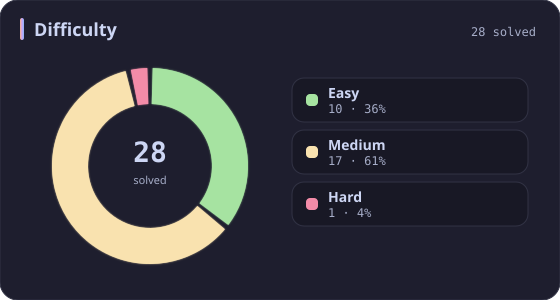
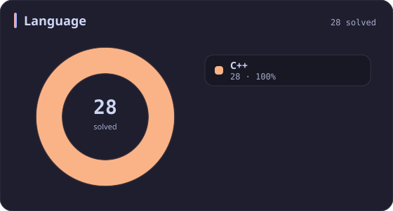
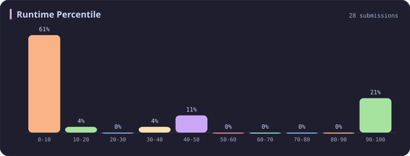
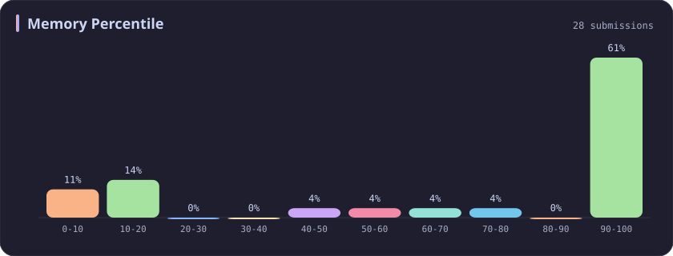
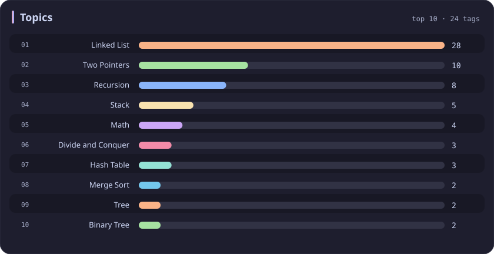

# Linked List Stats

[All stats](../../README.md)

**28** problems · updated `2026-09-04 19:23 UTC`

## Stats

### Difficulty

### Language

### Runtime Percentile

### Memory Percentile

### Topics

| Topic | # | Topic | # | Topic | # | Topic | # |
| :--- | ---: | :--- | ---: | :--- | ---: | :--- | ---: |
| [Array](array.md) | 386 | [Divide and Conquer](divide-and-conquer.md) | 16 | [Directed Acyclic Graph](directed-acyclic-graph.md) | 2 | [Range Minimum/Maximum Query](range-minimum-maximum-query.md) | 1 |
| [Hash Table](hash-table.md) | 168 | [Queue](queue.md) | 16 | [Quickselect](quickselect.md) | 2 | [Nim Game](nim-game.md) | 1 |
| [String](string.md) | 167 | [Trie](trie.md) | 11 | [Binary Lifting](binary-lifting.md) | 2 | [Impartial Game](impartial-game.md) | 1 |
| [Math](math.md) | 114 | [Binary Search Tree](binary-search-tree.md) | 11 | [Lowest Common Ancestor](lowest-common-ancestor.md) | 2 | [Binary Indexed Tree](binary-indexed-tree.md) | 1 |
| [Sorting](sorting.md) | 86 | [Monotonic Stack](monotonic-stack.md) | 10 | [Counting Sort](counting-sort.md) | 2 | [Sqrt Decomposition](sqrt-decomposition.md) | 1 |
| [Dynamic Programming](dynamic-programming.md) | 83 | [Number Theory](number-theory.md) | 10 | [Interactive](interactive.md) | 2 | [Complete Knapsack](complete-knapsack.md) | 1 |
| [Depth-First Search](depth-first-search.md) | 80 | [Ordered Set](ordered-set.md) | 8 | [Pigeonhole Principle](pigeonhole-principle.md) | 2 | [Reservoir Sampling](reservoir-sampling.md) | 1 |
| [Greedy](greedy.md) | 79 | [Combinatorics](combinatorics.md) | 7 | [Longest Increasing Subsequence](longest-increasing-subsequence.md) | 2 | [Bellman–Ford Algorithm](bellman-ford-algorithm.md) | 1 |
| [Two Pointers](two-pointers.md) | 70 | [Memoization](memoization.md) | 6 | [Segment Tree](segment-tree.md) | 2 | [Floyd–Warshall Algorithm](floyd-warshall-algorithm.md) | 1 |
| [Breadth-First Search](breadth-first-search.md) | 69 | [Data Stream](data-stream.md) | 6 | [Linear Algebra](linear-algebra.md) | 2 | [0-1 Knapsack](0-1-knapsack.md) | 1 |
| [Matrix](matrix.md) | 64 | [Shortest Path](shortest-path.md) | 6 | [Randomized](randomized.md) | 2 | [Aho–Corasick Algorithm](aho-corasick-algorithm.md) | 1 |
| [Binary Search](binary-search.md) | 63 | [Game Theory](game-theory.md) | 5 | [Heuristic Search](heuristic-search.md) | 2 | [Bidirectional Search](bidirectional-search.md) | 1 |
| [Tree](tree.md) | 60 | [Geometry](geometry.md) | 5 | [A* Search](a-search.md) | 2 | [Ternary Search](ternary-search.md) | 1 |
| [Binary Tree](binary-tree.md) | 50 | [Bracket Sequences](bracket-sequences.md) | 4 | [Hash Function](hash-function.md) | 2 | [Zero-Sum Game](zero-sum-game.md) | 1 |
| [Stack](stack.md) | 47 | [String Matching](string-matching.md) | 4 | [Greatest Common Divisor](greatest-common-divisor.md) | 2 | [Timsort](timsort.md) | 1 |
| [Prefix Sum](prefix-sum.md) | 46 | [Floyd's Cycle Finding Algorithm](floyd-s-cycle-finding-algorithm.md) | 4 | [Longest Common Subsequence](longest-common-subsequence.md) | 2 | [Radix Sort](radix-sort.md) | 1 |
| [Bit Manipulation](bit-manipulation.md) | 41 | [Topological Sort](topological-sort.md) | 4 | [Prime Factorization](prime-factorization.md) | 2 | [Triangulation](triangulation.md) | 1 |
| [Simulation](simulation.md) | 40 | [Monotonic Queue](monotonic-queue.md) | 4 | [Bitmask](bitmask.md) | 2 | [Euclidean Algorithm](euclidean-algorithm.md) | 1 |
| [Counting](counting.md) | 40 | [DP on Trees](dp-on-trees.md) | 4 | [Manacher](manacher.md) | 1 | [Minimum Spanning Tree](minimum-spanning-tree.md) | 1 |
| [Database](database.md) | 39 | [Brainteaser](brainteaser.md) | 4 | [Tournament Sort](tournament-sort.md) | 1 | [Doubly-Linked List](doubly-linked-list.md) | 1 |
| [Heap (Priority Queue)](heap-priority-queue.md) | 33 | [Polygons](polygons.md) | 4 | [Z Algorithm](z-algorithm.md) | 1 | [Least Common Multiple](least-common-multiple.md) | 1 |
| [Sliding Window](sliding-window.md) | 30 | [Merge Sort](merge-sort.md) | 3 | [Knuth–Morris–Pratt Algorithm](knuth-morris-pratt-algorithm.md) | 1 | [Fermat's Little Theorem](fermat-s-little-theorem.md) | 1 |
| **Linked List** | **28** | [Algorithm X](algorithm-x.md) | 3 | [Boyer–Moore String-Search Algorithm](boyer-moore-string-search-algorithm.md) | 1 | [Kosaraju's Algorithm](kosaraju-s-algorithm.md) | 1 |
| [Graph Theory](graph-theory.md) | 27 | [Quicksort](quicksort.md) | 3 | [Dancing Links](dancing-links.md) | 1 | [Tarjan's SCC Algorithm](tarjan-s-scc-algorithm.md) | 1 |
| [Design](design.md) | 25 | [Minimax](minimax.md) | 3 | [Newton's Method](newton-s-method.md) | 1 | [Multiple Knapsack](multiple-knapsack.md) | 1 |
| [Recursion](recursion.md) | 21 | [Knapsack Problem](knapsack-problem.md) | 3 | [Bubble Sort](bubble-sort.md) | 1 | [Rolling Hash](rolling-hash.md) | 1 |
| [Backtracking](backtracking.md) | 18 | [Bucket Sort](bucket-sort.md) | 3 | [Primality Test](primality-test.md) | 1 |  |  |
| [Union-Find](union-find.md) | 17 | [Dijkstra's Algorithm](dijkstra-s-algorithm.md) | 3 | [Sieve Theory](sieve-theory.md) | 1 |  |  |
| [Enumeration](enumeration.md) | 17 | [Boyer–Moore Majority Vote Algorithm](boyer-moore-majority-vote-algorithm.md) | 2 | [Prime Number Sieve](prime-number-sieve.md) | 1 |  |  |

---

## Recent Activity

Latest **28** accepted submissions.

| Date | Title | Difficulty | Lang | Runtime | Memory |
| :--- | :--- | :---: | :---: | ---: | ---: |
| 2026&#8209;06&#8209;04 | [1265. Print Immutable Linked List in Reverse](https://leetcode.com/problems/print-immutable-linked-list-in-reverse/) | Medium | C++ | 0 ms `100.00%` | 9.9 MB `5.81%` |
| 2026&#8209;06&#8209;04 | [369. Plus One Linked List](https://leetcode.com/problems/plus-one-linked-list/) | Medium | C++ | 0 ms `100.00%` | 12.2 MB `56.32%` |
| 2025&#8209;05&#8209;12 | [708. Insert into a Sorted Circular Linked List](https://leetcode.com/problems/insert-into-a-sorted-circular-linked-list/) | Medium | C++ | 11 ms `8.16%` | 13.1 MB `96.60%` |
| 2025&#8209;04&#8209;26 | [1474. Delete N Nodes After M Nodes of a Linked List](https://leetcode.com/problems/delete-n-nodes-after-m-nodes-of-a-linked-list/) | Easy | C++ | 0 ms `100.00%` | 21 MB `10.00%` |
| 2025&#8209;04&#8209;19 | [2095. Delete the Middle Node of a Linked List](https://leetcode.com/problems/delete-the-middle-node-of-a-linked-list/) | Medium | C++ | 19 ms `8.47%` | 342.5 MB `17.31%` |
| 2025&#8209;04&#8209;19 | [328. Odd Even Linked List](https://leetcode.com/problems/odd-even-linked-list/) | Medium | C++ | 0 ms `100.00%` | 15.6 MB `63.59%` |
| 2025&#8209;04&#8209;19 | [2130. Maximum Twin Sum of a Linked List](https://leetcode.com/problems/maximum-twin-sum-of-a-linked-list/) | Medium | C++ | 5 ms `36.76%` | 138.4 MB `17.32%` |
| 2025&#8209;04&#8209;19 | [206. Reverse Linked List](https://leetcode.com/problems/reverse-linked-list/) | Easy | C++ | 0 ms `100.00%` | 13.4 MB `72.41%` |
| 2024&#8209;03&#8209;23 | [148. Sort List](https://leetcode.com/problems/sort-list/) | Medium | C++ | 124 ms `5.01%` | 58.8 MB `49.20%` |
| 2024&#8209;03&#8209;23 | [24. Swap Nodes in Pairs](https://leetcode.com/problems/swap-nodes-in-pairs/) | Medium | C++ | 3 ms `0.42%` | 9.4 MB `100.00%` |
| 2024&#8209;03&#8209;23 | [143. Reorder List](https://leetcode.com/problems/reorder-list/) | Medium | C++ | 31 ms `5.08%` | 22.4 MB `99.97%` |
| 2024&#8209;03&#8209;22 | [234. Palindrome Linked List](https://leetcode.com/problems/palindrome-linked-list/) | Easy | C++ | 173 ms `5.13%` | 130.7 MB `18.01%` |
| 2024&#8209;03&#8209;20 | [1669. Merge In Between Linked Lists](https://leetcode.com/problems/merge-in-between-linked-lists/) | Medium | C++ | 204 ms `41.16%` | 98.1 MB `99.62%` |
| 2023&#8209;10&#8209;04 | [706. Design HashMap](https://leetcode.com/problems/design-hashmap/) | Easy | C++ | 113 ms `7.27%` | 53.5 MB `100.00%` |
| 2023&#8209;03&#8209;21 | [83. Remove Duplicates from Sorted List](https://leetcode.com/problems/remove-duplicates-from-sorted-list/) | Easy | C++ | 18 ms `0.75%` | 12 MB `100.00%` |
| 2023&#8209;03&#8209;21 | [203. Remove Linked List Elements](https://leetcode.com/problems/remove-linked-list-elements/) | Easy | C++ | 11 ms `1.56%` | 15.7 MB `100.00%` |
| 2023&#8209;03&#8209;21 | [141. Linked List Cycle](https://leetcode.com/problems/linked-list-cycle/) | Easy | C++ | 11 ms `42.93%` | 8.2 MB `100.00%` |
| 2023&#8209;03&#8209;21 | [21. Merge Two Sorted Lists](https://leetcode.com/problems/merge-two-sorted-lists/) | Easy | C++ | 12 ms `0.53%` | 23.1 MB `8.45%` |
| 2023&#8209;03&#8209;18 | [1472. Design Browser History](https://leetcode.com/problems/design-browser-history/) | Medium | C++ | 140 ms `5.05%` | 57.6 MB `100.00%` |
| 2023&#8209;03&#8209;12 | [23. Merge k Sorted Lists](https://leetcode.com/problems/merge-k-sorted-lists/) | Hard | C++ | 30 ms `15.41%` | 13.9 MB `99.99%` |
| 2023&#8209;03&#8209;11 | [109. Convert Sorted List to Binary Search Tree](https://leetcode.com/problems/convert-sorted-list-to-binary-search-tree/) | Medium | C++ | 435 ms `5.92%` | 345.2 MB `5.43%` |
| 2023&#8209;03&#8209;10 | [116. Populating Next Right Pointers in Each Node](https://leetcode.com/problems/populating-next-right-pointers-in-each-node/) | Medium | C++ | 24 ms `7.89%` | 17.7 MB `99.99%` |
| 2023&#8209;03&#8209;10 | [19. Remove Nth Node From End of List](https://leetcode.com/problems/remove-nth-node-from-end-of-list/) | Medium | C++ | 3 ms `1.53%` | 10.9 MB `99.98%` |
| 2023&#8209;03&#8209;10 | [1290. Convert Binary Number in a Linked List to Integer](https://leetcode.com/problems/convert-binary-number-in-a-linked-list-to-integer/) | Easy | C++ | 0 ms `100.00%` | 8.4 MB `100.00%` |
| 2023&#8209;03&#8209;10 | [876. Middle of the Linked List](https://leetcode.com/problems/middle-of-the-linked-list/) | Easy | C++ | 2 ms `0.39%` | 6.9 MB `100.00%` |
| 2023&#8209;03&#8209;10 | [382. Linked List Random Node](https://leetcode.com/problems/linked-list-random-node/) | Medium | C++ | 28 ms `5.25%` | 16.7 MB `100.00%` |
| 2023&#8209;03&#8209;09 | [142. Linked List Cycle II](https://leetcode.com/problems/linked-list-cycle-ii/) | Medium | C++ | 8 ms `48.92%` | 7.6 MB `100.00%` |
| 2023&#8209;02&#8209;15 | [2. Add Two Numbers](https://leetcode.com/problems/add-two-numbers/) | Medium | C++ | 51 ms `6.98%` | 71.5 MB `99.95%` |
