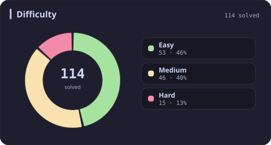
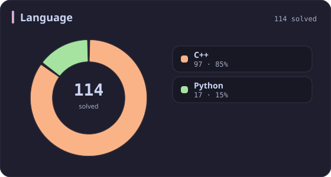
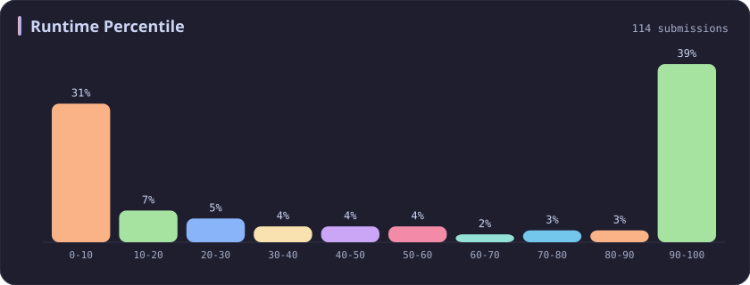
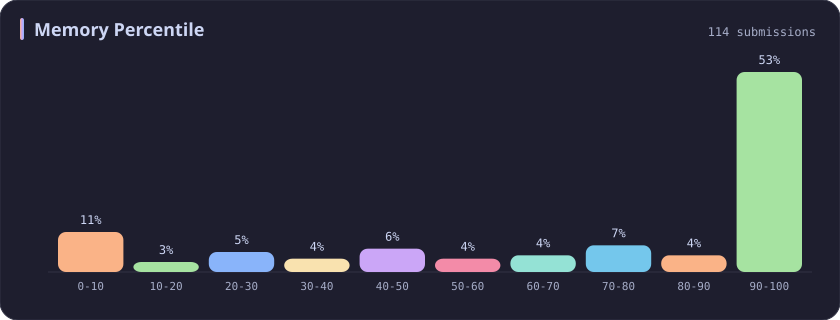
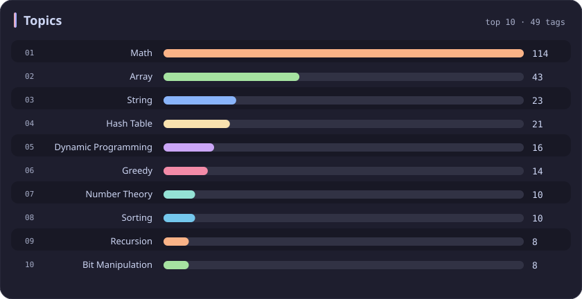

# Math Stats

[All stats](../../README.md)

**114** problems · updated `2026-09-04 19:14 UTC`

## Stats

### Difficulty

### Language

### Runtime Percentile

### Memory Percentile

### Topics

| Topic | # | Topic | # | Topic | # | Topic | # |
| :--- | ---: | :--- | ---: | :--- | ---: | :--- | ---: |
| [Array](array.md) | 386 | [Divide and Conquer](divide-and-conquer.md) | 16 | [Directed Acyclic Graph](directed-acyclic-graph.md) | 2 | [Range Minimum/Maximum Query](range-minimum-maximum-query.md) | 1 |
| [Hash Table](hash-table.md) | 168 | [Queue](queue.md) | 16 | [Quickselect](quickselect.md) | 2 | [Nim Game](nim-game.md) | 1 |
| [String](string.md) | 167 | [Trie](trie.md) | 11 | [Binary Lifting](binary-lifting.md) | 2 | [Impartial Game](impartial-game.md) | 1 |
| **Math** | **114** | [Binary Search Tree](binary-search-tree.md) | 11 | [Lowest Common Ancestor](lowest-common-ancestor.md) | 2 | [Binary Indexed Tree](binary-indexed-tree.md) | 1 |
| [Sorting](sorting.md) | 86 | [Monotonic Stack](monotonic-stack.md) | 10 | [Counting Sort](counting-sort.md) | 2 | [Sqrt Decomposition](sqrt-decomposition.md) | 1 |
| [Dynamic Programming](dynamic-programming.md) | 83 | [Number Theory](number-theory.md) | 10 | [Interactive](interactive.md) | 2 | [Complete Knapsack](complete-knapsack.md) | 1 |
| [Depth-First Search](depth-first-search.md) | 80 | [Ordered Set](ordered-set.md) | 8 | [Pigeonhole Principle](pigeonhole-principle.md) | 2 | [Reservoir Sampling](reservoir-sampling.md) | 1 |
| [Greedy](greedy.md) | 79 | [Combinatorics](combinatorics.md) | 7 | [Longest Increasing Subsequence](longest-increasing-subsequence.md) | 2 | [Bellman–Ford Algorithm](bellman-ford-algorithm.md) | 1 |
| [Two Pointers](two-pointers.md) | 70 | [Memoization](memoization.md) | 6 | [Segment Tree](segment-tree.md) | 2 | [Floyd–Warshall Algorithm](floyd-warshall-algorithm.md) | 1 |
| [Breadth-First Search](breadth-first-search.md) | 69 | [Data Stream](data-stream.md) | 6 | [Linear Algebra](linear-algebra.md) | 2 | [0-1 Knapsack](0-1-knapsack.md) | 1 |
| [Matrix](matrix.md) | 64 | [Shortest Path](shortest-path.md) | 6 | [Randomized](randomized.md) | 2 | [Aho–Corasick Algorithm](aho-corasick-algorithm.md) | 1 |
| [Binary Search](binary-search.md) | 63 | [Game Theory](game-theory.md) | 5 | [Heuristic Search](heuristic-search.md) | 2 | [Bidirectional Search](bidirectional-search.md) | 1 |
| [Tree](tree.md) | 60 | [Geometry](geometry.md) | 5 | [A* Search](a-search.md) | 2 | [Ternary Search](ternary-search.md) | 1 |
| [Binary Tree](binary-tree.md) | 50 | [Bracket Sequences](bracket-sequences.md) | 4 | [Hash Function](hash-function.md) | 2 | [Zero-Sum Game](zero-sum-game.md) | 1 |
| [Stack](stack.md) | 47 | [String Matching](string-matching.md) | 4 | [Greatest Common Divisor](greatest-common-divisor.md) | 2 | [Timsort](timsort.md) | 1 |
| [Prefix Sum](prefix-sum.md) | 46 | [Floyd's Cycle Finding Algorithm](floyd-s-cycle-finding-algorithm.md) | 4 | [Longest Common Subsequence](longest-common-subsequence.md) | 2 | [Radix Sort](radix-sort.md) | 1 |
| [Bit Manipulation](bit-manipulation.md) | 41 | [Topological Sort](topological-sort.md) | 4 | [Prime Factorization](prime-factorization.md) | 2 | [Triangulation](triangulation.md) | 1 |
| [Simulation](simulation.md) | 40 | [Monotonic Queue](monotonic-queue.md) | 4 | [Bitmask](bitmask.md) | 2 | [Euclidean Algorithm](euclidean-algorithm.md) | 1 |
| [Counting](counting.md) | 40 | [DP on Trees](dp-on-trees.md) | 4 | [Manacher](manacher.md) | 1 | [Minimum Spanning Tree](minimum-spanning-tree.md) | 1 |
| [Database](database.md) | 39 | [Brainteaser](brainteaser.md) | 4 | [Tournament Sort](tournament-sort.md) | 1 | [Doubly-Linked List](doubly-linked-list.md) | 1 |
| [Heap (Priority Queue)](heap-priority-queue.md) | 33 | [Polygons](polygons.md) | 4 | [Z Algorithm](z-algorithm.md) | 1 | [Least Common Multiple](least-common-multiple.md) | 1 |
| [Sliding Window](sliding-window.md) | 30 | [Merge Sort](merge-sort.md) | 3 | [Knuth–Morris–Pratt Algorithm](knuth-morris-pratt-algorithm.md) | 1 | [Fermat's Little Theorem](fermat-s-little-theorem.md) | 1 |
| [Linked List](linked-list.md) | 28 | [Algorithm X](algorithm-x.md) | 3 | [Boyer–Moore String-Search Algorithm](boyer-moore-string-search-algorithm.md) | 1 | [Kosaraju's Algorithm](kosaraju-s-algorithm.md) | 1 |
| [Graph Theory](graph-theory.md) | 27 | [Quicksort](quicksort.md) | 3 | [Dancing Links](dancing-links.md) | 1 | [Tarjan's SCC Algorithm](tarjan-s-scc-algorithm.md) | 1 |
| [Design](design.md) | 25 | [Minimax](minimax.md) | 3 | [Newton's Method](newton-s-method.md) | 1 | [Multiple Knapsack](multiple-knapsack.md) | 1 |
| [Recursion](recursion.md) | 21 | [Knapsack Problem](knapsack-problem.md) | 3 | [Bubble Sort](bubble-sort.md) | 1 | [Rolling Hash](rolling-hash.md) | 1 |
| [Backtracking](backtracking.md) | 18 | [Bucket Sort](bucket-sort.md) | 3 | [Primality Test](primality-test.md) | 1 |  |  |
| [Union-Find](union-find.md) | 17 | [Dijkstra's Algorithm](dijkstra-s-algorithm.md) | 3 | [Sieve Theory](sieve-theory.md) | 1 |  |  |
| [Enumeration](enumeration.md) | 17 | [Boyer–Moore Majority Vote Algorithm](boyer-moore-majority-vote-algorithm.md) | 2 | [Prime Number Sieve](prime-number-sieve.md) | 1 |  |  |

---

## Recent Activity

Latest **100** accepted submissions.

| Date | Title | Difficulty | Lang | Runtime | Memory |
| :--- | :--- | :---: | :---: | ---: | ---: |
| 2026&#8209;09&#8209;03 | [3876. Construct Uniform Parity Array II](https://leetcode.com/problems/construct-uniform-parity-array-ii/) | Medium | C++ | 7 ms `42.89%` | 165.7 MB `84.39%` |
| 2026&#8209;09&#8209;02 | [3875. Construct Uniform Parity Array I](https://leetcode.com/problems/construct-uniform-parity-array-i/) | Easy | C++ | 0 ms `100.00%` | 30.3 MB `27.31%` |
| 2026&#8209;08&#8209;17 | [877. Stone Game](https://leetcode.com/problems/stone-game/) | Medium | C++ | 12 ms `17.70%` | 19.8 MB `7.31%` |
| 2026&#8209;08&#8209;17 | [1563. Stone Game V](https://leetcode.com/problems/stone-game-v/) | Hard | C++ | 407 ms `57.19%` | 27.6 MB `46.96%` |
| 2026&#8209;06&#8209;11 | [3558. Number of Ways to Assign Edge Weights I](https://leetcode.com/problems/number-of-ways-to-assign-edge-weights-i/) | Medium | C++ | 303 ms `53.85%` | 346.5 MB `44.39%` |
| 2026&#8209;06&#8209;04 | [369. Plus One Linked List](https://leetcode.com/problems/plus-one-linked-list/) | Medium | C++ | 0 ms `100.00%` | 12.2 MB `56.32%` |
| 2026&#8209;06&#8209;04 | [3751. Total Waviness of Numbers in Range I](https://leetcode.com/problems/total-waviness-of-numbers-in-range-i/) | Medium | C++ | 50 ms `45.88%` | 9.3 MB `72.51%` |
| 2026&#8209;05&#8209;31 | [3945. Digit Frequency Score](https://leetcode.com/problems/digit-frequency-score/) | Easy | C++ | 0 ms `100.00%` | 8.7 MB `54.46%` |
| 2025&#8209;10&#8209;16 | [2598. Smallest Missing Non-negative Integer After Operations](https://leetcode.com/problems/smallest-missing-non-negative-integer-after-operations/) | Medium | C++ | 169 ms `13.05%` | 138.6 MB `45.43%` |
| 2025&#8209;10&#8209;12 | [3539. Find Sum of Array Product of Magical Sequences](https://leetcode.com/problems/find-sum-of-array-product-of-magical-sequences/) | Hard | Python | 411 ms `97.50%` | 33.9 MB `70.00%` |
| 2025&#8209;10&#8209;12 | [3715. Sum of Perfect Square Ancestors](https://leetcode.com/problems/sum-of-perfect-square-ancestors/) | Hard | C++ | 1461 ms `21.09%` | 383.2 MB `25.85%` |
| 2025&#8209;10&#8209;02 | [3100. Water Bottles II](https://leetcode.com/problems/water-bottles-ii/) | Medium | C++ | 2 ms `38.80%` | 8.7 MB `15.89%` |
| 2025&#8209;10&#8209;01 | [1518. Water Bottles](https://leetcode.com/problems/water-bottles/) | Easy | C++ | 0 ms `100.00%` | 7.8 MB `46.26%` |
| 2025&#8209;09&#8209;30 | [2221. Find Triangular Sum of an Array](https://leetcode.com/problems/find-triangular-sum-of-an-array/) | Medium | C++ | 431 ms `5.07%` | 384.5 MB `5.28%` |
| 2025&#8209;09&#8209;28 | [976. Largest Perimeter Triangle](https://leetcode.com/problems/largest-perimeter-triangle/) | Easy | C++ | 12 ms `25.68%` | 25.6 MB `79.00%` |
| 2025&#8209;09&#8209;28 | [3700. Number of ZigZag Arrays II](https://leetcode.com/problems/number-of-zigzag-arrays-ii/) | Hard | C++ | 285 ms `71.83%` | 23.4 MB `79.93%` |
| 2025&#8209;09&#8209;28 | [3697. Compute Decimal Representation](https://leetcode.com/problems/compute-decimal-representation/) | Easy | C++ | 0 ms `100.00%` | 9.8 MB `33.26%` |
| 2025&#8209;09&#8209;27 | [812. Largest Triangle Area](https://leetcode.com/problems/largest-triangle-area/) | Easy | C++ | 0 ms `100.00%` | 10.6 MB `7.20%` |
| 2025&#8209;09&#8209;24 | [166. Fraction to Recurring Decimal](https://leetcode.com/problems/fraction-to-recurring-decimal/) | Medium | Python | 0 ms `100.00%` | 17.9 MB `100.00%` |
| 2025&#8209;09&#8209;16 | [2197. Replace Non-Coprime Numbers in Array](https://leetcode.com/problems/replace-non-coprime-numbers-in-array/) | Hard | C++ | 2138 ms `5.26%` | 306.9 MB `5.26%` |
| 2025&#8209;09&#8209;12 | [3227. Vowels Game in a String](https://leetcode.com/problems/vowels-game-in-a-string/) | Medium | Python | 0 ms `100.00%` | 18.2 MB `100.00%` |
| 2025&#8209;09&#8209;08 | [1317. Convert Integer to the Sum of Two No-Zero Integers](https://leetcode.com/problems/convert-integer-to-the-sum-of-two-no-zero-integers/) | Easy | C++ | 0 ms `100.00%` | 8.2 MB `60.98%` |
| 2025&#8209;09&#8209;07 | [1304. Find N Unique Integers Sum up to Zero](https://leetcode.com/problems/find-n-unique-integers-sum-up-to-zero/) | Easy | Python | 3 ms `4.43%` | 17.9 MB `100.00%` |
| 2025&#8209;09&#8209;06 | [3495. Minimum Operations to Make Array Elements Zero](https://leetcode.com/problems/minimum-operations-to-make-array-elements-zero/) | Hard | C++ | 7 ms `87.50%` | 183.2 MB `73.61%` |
| 2025&#8209;09&#8209;04 | [3516. Find Closest Person](https://leetcode.com/problems/find-closest-person/) | Easy | C++ | 0 ms `100.00%` | 8.7 MB `0.00%` |
| 2025&#8209;09&#8209;03 | [3027. Find the Number of Ways to Place People II](https://leetcode.com/problems/find-the-number-of-ways-to-place-people-ii/) | Hard | C++ | 221 ms `15.38%` | 47.6 MB `5.77%` |
| 2025&#8209;09&#8209;02 | [3025. Find the Number of Ways to Place People I](https://leetcode.com/problems/find-the-number-of-ways-to-place-people-i/) | Medium | C++ | 19 ms `25.00%` | 32.7 MB `28.24%` |
| 2025&#8209;08&#8209;29 | [3021. Alice and Bob Playing Flower Game](https://leetcode.com/problems/alice-and-bob-playing-flower-game/) | Medium | C++ | 0 ms `100.00%` | 8.4 MB `89.39%` |
| 2025&#8209;08&#8209;16 | [1323. Maximum 69 Number](https://leetcode.com/problems/maximum-69-number/) | Easy | Python | 0 ms `100.00%` | 17.9 MB `100.00%` |
| 2025&#8209;06&#8209;15 | [1432. Max Difference You Can Get From Changing an Integer](https://leetcode.com/problems/max-difference-you-can-get-from-changing-an-integer/) | Medium | Python | 0 ms `100.00%` | 17.6 MB `100.00%` |
| 2025&#8209;06&#8209;14 | [2566. Maximum Difference by Remapping a Digit](https://leetcode.com/problems/maximum-difference-by-remapping-a-digit/) | Easy | Python | 0 ms `100.00%` | 17.9 MB `100.00%` |
| 2025&#8209;06&#8209;01 | [2929. Distribute Candies Among Children II](https://leetcode.com/problems/distribute-candies-among-children-ii/) | Medium | C++ | 14 ms `49.47%` | 8.9 MB `83.04%` |
| 2025&#8209;05&#8209;27 | [2894. Divisible and Non-divisible Sums Difference](https://leetcode.com/problems/divisible-and-non-divisible-sums-difference/) | Easy | C++ | 0 ms `100.00%` | 8.3 MB `66.09%` |
| 2025&#8209;05&#8209;25 | [3560. Find Minimum Log Transportation Cost](https://leetcode.com/problems/find-minimum-log-transportation-cost/) | Easy | C++ | 0 ms `100.00%` | 8.9 MB `19.00%` |
| 2025&#8209;05&#8209;24 | [3556. Sum of Largest Prime Substrings](https://leetcode.com/problems/sum-of-largest-prime-substrings/) | Medium | C++ | 15 ms `51.49%` | 10.8 MB `60.40%` |
| 2025&#8209;05&#8209;19 | [3024. Type of Triangle](https://leetcode.com/problems/type-of-triangle/) | Easy | C++ | 0 ms `100.00%` | 22.8 MB `92.33%` |
| 2025&#8209;05&#8209;14 | [3337. Total Characters in String After Transformations II](https://leetcode.com/problems/total-characters-in-string-after-transformations-ii/) | Hard | C++ | 543 ms `9.64%` | 70.7 MB `42.17%` |
| 2025&#8209;05&#8209;13 | [3335. Total Characters in String After Transformations I](https://leetcode.com/problems/total-characters-in-string-after-transformations-i/) | Medium | C++ | 14 ms `98.77%` | 19.2 MB `88.62%` |
| 2025&#8209;05&#8209;12 | [3289. The Two Sneaky Numbers of Digitville](https://leetcode.com/problems/the-two-sneaky-numbers-of-digitville/) | Easy | C++ | 0 ms `100.00%` | 26.5 MB `21.86%` |
| 2025&#8209;05&#8209;12 | [1180. Count Substrings with Only One Distinct Letter](https://leetcode.com/problems/count-substrings-with-only-one-distinct-letter/) | Easy | C++ | 0 ms `100.00%` | 8.5 MB `29.73%` |
| 2025&#8209;05&#8209;12 | [1134. Armstrong Number](https://leetcode.com/problems/armstrong-number/) | Easy | C++ | 0 ms `100.00%` | 8 MB `38.46%` |
| 2025&#8209;05&#8209;12 | [770. Basic Calculator IV](https://leetcode.com/problems/basic-calculator-iv/) | Hard | C++ | 4 ms `85.71%` | 21.8 MB `99.51%` |
| 2025&#8209;05&#8209;11 | [772. Basic Calculator III](https://leetcode.com/problems/basic-calculator-iii/) | Hard | C++ | 0 ms `100.00%` | 11.5 MB `56.44%` |
| 2025&#8209;05&#8209;11 | [227. Basic Calculator II](https://leetcode.com/problems/basic-calculator-ii/) | Medium | C++ | 38 ms `5.53%` | 38.6 MB `5.00%` |
| 2025&#8209;05&#8209;11 | [224. Basic Calculator](https://leetcode.com/problems/basic-calculator/) | Hard | C++ | 19 ms `7.01%` | 23.2 MB `5.06%` |
| 2025&#8209;05&#8209;11 | [3547. Maximum Sum of Edge Values in a Graph](https://leetcode.com/problems/maximum-sum-of-edge-values-in-a-graph/) | Hard | C++ | 195 ms `41.78%` | 191.3 MB `100.00%` |
| 2025&#8209;05&#8209;09 | [3343. Count Number of Balanced Permutations](https://leetcode.com/problems/count-number-of-balanced-permutations/) | Hard | C++ | 150 ms `50.60%` | 19.4 MB `65.06%` |
| 2025&#8209;05&#8209;04 | [3536. Maximum Product of Two Digits](https://leetcode.com/problems/maximum-product-of-two-digits/) | Easy | C++ | 3 ms `10.81%` | 8.9 MB `31.83%` |
| 2025&#8209;04&#8209;30 | [1295. Find Numbers with Even Number of Digits](https://leetcode.com/problems/find-numbers-with-even-number-of-digits/) | Easy | Python | 4 ms `32.34%` | 12.5 MB `4.41%` |
| 2025&#8209;04&#8209;25 | [1427. Perform String Shifts](https://leetcode.com/problems/perform-string-shifts/) | Easy | Python | 0 ms `100.00%` | 17.9 MB `100.00%` |
| 2025&#8209;04&#8209;25 | [1056. Confusing Number](https://leetcode.com/problems/confusing-number/) | Easy | Python | 0 ms `100.00%` | 18 MB `100.00%` |
| 2025&#8209;04&#8209;24 | [380. Insert Delete GetRandom O(1)](https://leetcode.com/problems/insert-delete-getrandom-o1/) | Medium | C++ | 31 ms `93.33%` | 113.3 MB `28.69%` |
| 2025&#8209;04&#8209;24 | [189. Rotate Array](https://leetcode.com/problems/rotate-array/) | Medium | C++ | 0 ms `100.00%` | 29.6 MB `66.58%` |
| 2025&#8209;04&#8209;23 | [62. Unique Paths](https://leetcode.com/problems/unique-paths/) | Medium | C++ | 0 ms `100.00%` | 9 MB `72.04%` |
| 2025&#8209;04&#8209;23 | [1137. N-th Tribonacci Number](https://leetcode.com/problems/n-th-tribonacci-number/) | Easy | C++ | 0 ms `100.00%` | 7.7 MB `98.51%` |
| 2025&#8209;04&#8209;23 | [1399. Count Largest Group](https://leetcode.com/problems/count-largest-group/) | Easy | C++ | 0 ms `100.00%` | 7.9 MB `77.49%` |
| 2025&#8209;04&#8209;22 | [2338. Count the Number of Ideal Arrays](https://leetcode.com/problems/count-the-number-of-ideal-arrays/) | Hard | C++ | 10 ms `75.00%` | 10.3 MB `76.47%` |
| 2025&#8209;04&#8209;20 | [781. Rabbits in Forest](https://leetcode.com/problems/rabbits-in-forest/) | Medium | C++ | 4 ms `7.15%` | 12.3 MB `37.72%` |
| 2025&#8209;04&#8209;20 | [3524. Find X Value of Array I](https://leetcode.com/problems/find-x-value-of-array-i/) | Medium | C++ | 150 ms `82.08%` | 151.2 MB `54.72%` |
| 2025&#8209;04&#8209;13 | [1922. Count Good Numbers](https://leetcode.com/problems/count-good-numbers/) | Medium | C++ | 2 ms `2.20%` | 7.8 MB `97.14%` |
| 2025&#8209;04&#8209;11 | [1071. Greatest Common Divisor of Strings](https://leetcode.com/problems/greatest-common-divisor-of-strings/) | Easy | C++ | 19 ms `5.25%` | 46.6 MB `5.11%` |
| 2025&#8209;04&#8209;11 | [2843.   Count Symmetric Integers](https://leetcode.com/problems/count-symmetric-integers/) | Easy | C++ | 77 ms `18.11%` | 10.5 MB `8.76%` |
| 2024&#8209;11&#8209;11 | [2601. Prime Subtraction Operation](https://leetcode.com/problems/prime-subtraction-operation/) | Medium | C++ | 25 ms `34.60%` | 28.7 MB `41.64%` |
| 2024&#8209;10&#8209;23 | [3084. Count Substrings Starting and Ending with Given Character](https://leetcode.com/problems/count-substrings-starting-and-ending-with-given-character/) | Medium | C++ | 0 ms `100.00%` | 11.8 MB `99.87%` |
| 2024&#8209;10&#8209;20 | [1442. Count Triplets That Can Form Two Arrays of Equal XOR](https://leetcode.com/problems/count-triplets-that-can-form-two-arrays-of-equal-xor/) | Medium | C++ | 20 ms `17.46%` | 9.6 MB `100.00%` |
| 2024&#8209;03&#8209;30 | [3091. Apply Operations to Make Sum of Array Greater Than or Equal to k](https://leetcode.com/problems/apply-operations-to-make-sum-of-array-greater-than-or-equal-to-k/) | Medium | C++ | 0 ms `100.00%` | 7.3 MB `100.00%` |
| 2024&#8209;03&#8209;23 | [523. Continuous Subarray Sum](https://leetcode.com/problems/continuous-subarray-sum/) | Medium | C++ | 268 ms `5.32%` | 147.1 MB `17.99%` |
| 2024&#8209;03&#8209;23 | [168. Excel Sheet Column Title](https://leetcode.com/problems/excel-sheet-column-title/) | Easy | C++ | 0 ms `100.00%` | 7.1 MB `100.00%` |
| 2024&#8209;03&#8209;23 | [204. Count Primes](https://leetcode.com/problems/count-primes/) | Medium | C++ | 658 ms `12.86%` | 11.5 MB `99.23%` |
| 2024&#8209;01&#8209;18 | [9. Palindrome Number](https://leetcode.com/problems/palindrome-number/) | Easy | C++ | 8 ms `8.99%` | 6.3 MB `100.00%` |
| 2023&#8209;10&#8209;06 | [343. Integer Break](https://leetcode.com/problems/integer-break/) | Medium | C++ | 2 ms `13.60%` | 6.2 MB `100.00%` |
| 2023&#8209;10&#8209;03 | [1512. Number of Good Pairs](https://leetcode.com/problems/number-of-good-pairs/) | Easy | C++ | 3 ms `2.39%` | 7.5 MB `100.00%` |
| 2023&#8209;10&#8209;02 | [2038. Remove Colored Pieces if Both Neighbors are the Same Color](https://leetcode.com/problems/remove-colored-pieces-if-both-neighbors-are-the-same-color/) | Medium | Python | 205 ms `9.43%` | 19.9 MB `85.28%` |
| 2023&#8209;04&#8209;09 | [2614. Prime In Diagonal](https://leetcode.com/problems/prime-in-diagonal/) | Easy | C++ | 129 ms `5.06%` | 35.7 MB `99.92%` |
| 2023&#8209;04&#8209;01 | [2607. Make K-Subarray Sums Equal](https://leetcode.com/problems/make-k-subarray-sums-equal/) | Medium | C++ | 203 ms `5.81%` | 112.6 MB `90.70%` |
| 2023&#8209;03&#8209;26 | [2600. K Items With the Maximum Sum](https://leetcode.com/problems/k-items-with-the-maximum-sum/) | Easy | C++ | 0 ms `100.00%` | 6 MB `100.00%` |
| 2023&#8209;03&#8209;21 | [2348. Number of Zero-Filled Subarrays](https://leetcode.com/problems/number-of-zero-filled-subarrays/) | Medium | C++ | 169 ms `5.21%` | 107.5 MB `100.00%` |
| 2023&#8209;03&#8209;19 | [2597. The Number of Beautiful Subsets](https://leetcode.com/problems/the-number-of-beautiful-subsets/) | Medium | C++ | 801 ms `28.10%` | 34 MB `100.00%` |
| 2023&#8209;03&#8209;18 | [2591. Distribute Money to Maximum Children](https://leetcode.com/problems/distribute-money-to-maximum-children/) | Easy | C++ | 4 ms `7.48%` | 6 MB `100.00%` |
| 2023&#8209;03&#8209;17 | [43. Multiply Strings](https://leetcode.com/problems/multiply-strings/) | Medium | Python | 36 ms `64.41%` | 13.8 MB `100.00%` |
| 2023&#8209;03&#8209;17 | [989. Add to Array-Form of Integer](https://leetcode.com/problems/add-to-array-form-of-integer/) | Easy | C++ | 36 ms `6.45%` | 28.8 MB `100.00%` |
| 2023&#8209;03&#8209;17 | [67. Add Binary](https://leetcode.com/problems/add-binary/) | Easy | C++ | 6 ms `3.31%` | 6.5 MB `100.00%` |
| 2023&#8209;03&#8209;15 | [150. Evaluate Reverse Polish Notation](https://leetcode.com/problems/evaluate-reverse-polish-notation/) | Medium | C++ | 21 ms `6.33%` | 12.9 MB `100.00%` |
| 2023&#8209;03&#8209;15 | [66. Plus One](https://leetcode.com/problems/plus-one/) | Easy | C++ | 0 ms `100.00%` | 8.7 MB `100.00%` |
| 2023&#8209;03&#8209;13 | [509. Fibonacci Number](https://leetcode.com/problems/fibonacci-number/) | Easy | C++ | 0 ms `100.00%` | 6.1 MB `100.00%` |
| 2023&#8209;03&#8209;13 | [70. Climbing Stairs](https://leetcode.com/problems/climbing-stairs/) | Easy | C++ | 0 ms `100.00%` | 5.9 MB `100.00%` |
| 2023&#8209;03&#8209;13 | [231. Power of Two](https://leetcode.com/problems/power-of-two/) | Easy | C++ | 0 ms `100.00%` | 5.9 MB `100.00%` |
| 2023&#8209;03&#8209;10 | [1290. Convert Binary Number in a Linked List to Integer](https://leetcode.com/problems/convert-binary-number-in-a-linked-list-to-integer/) | Easy | C++ | 0 ms `100.00%` | 8.4 MB `100.00%` |
| 2023&#8209;03&#8209;10 | [1588. Sum of All Odd Length Subarrays](https://leetcode.com/problems/sum-of-all-odd-length-subarrays/) | Easy | C++ | 4 ms `7.10%` | 8.5 MB `100.00%` |
| 2023&#8209;03&#8209;10 | [1232. Check If It Is a Straight Line](https://leetcode.com/problems/check-if-it-is-a-straight-line/) | Easy | C++ | 17 ms `1.31%` | 11.2 MB `100.00%` |
| 2023&#8209;03&#8209;10 | [1822. Sign of the Product of an Array](https://leetcode.com/problems/sign-of-the-product-of-an-array/) | Easy | C++ | 7 ms `0.08%` | 10.2 MB `100.00%` |
| 2023&#8209;03&#8209;10 | [202. Happy Number](https://leetcode.com/problems/happy-number/) | Easy | C++ | 0 ms `100.00%` | 5.9 MB `100.00%` |
| 2023&#8209;03&#8209;10 | [382. Linked List Random Node](https://leetcode.com/problems/linked-list-random-node/) | Medium | C++ | 28 ms `5.25%` | 16.7 MB `100.00%` |
| 2023&#8209;03&#8209;09 | [1281. Subtract the Product and Sum of Digits of an Integer](https://leetcode.com/problems/subtract-the-product-and-sum-of-digits-of-an-integer/) | Easy | C++ | 0 ms `100.00%` | 5.9 MB `100.00%` |
| 2023&#8209;03&#8209;09 | [1523. Count Odd Numbers in an Interval Range](https://leetcode.com/problems/count-odd-numbers-in-an-interval-range/) | Easy | C++ | 3 ms `64.39%` | 5.9 MB `100.00%` |
| 2023&#8209;03&#8209;06 | [29. Divide Two Integers](https://leetcode.com/problems/divide-two-integers/) | Medium | Python | 211 ms `2.00%` | 31.8 MB `6.12%` |
| 2023&#8209;03&#8209;05 | [292. Nim Game](https://leetcode.com/problems/nim-game/) | Easy | C++ | 0 ms `100.00%` | 6 MB `100.00%` |
| 2023&#8209;03&#8209;05 | [2584. Split the Array to Make Coprime Products](https://leetcode.com/problems/split-the-array-to-make-coprime-products/) | Hard | C++ | 512 ms `26.86%` | 21.6 MB `100.00%` |
| 2023&#8209;03&#8209;05 | [2582. Pass the Pillow](https://leetcode.com/problems/pass-the-pillow/) | Easy | C++ | 0 ms `100.00%` | 5.9 MB `100.00%` |
| 2023&#8209;03&#8209;04 | [2578. Split With Minimum Sum](https://leetcode.com/problems/split-with-minimum-sum/) | Easy | C++ | 0 ms `100.00%` | 5.9 MB `100.00%` |
