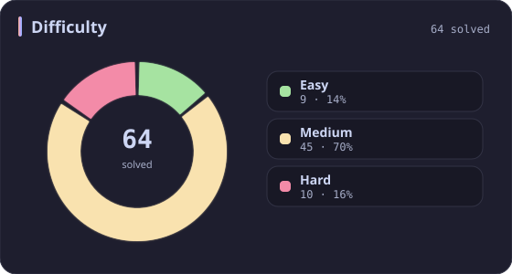
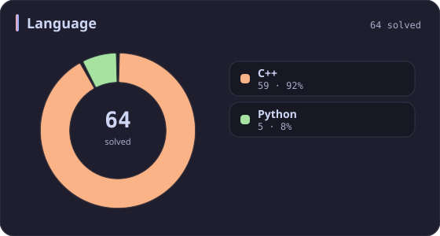
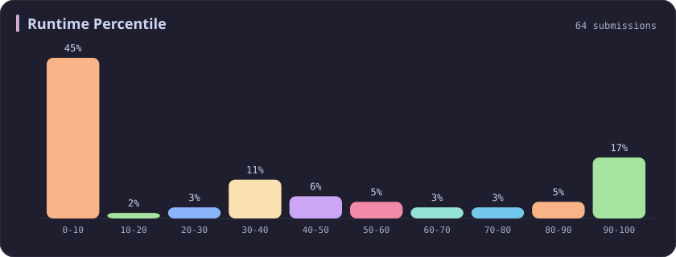
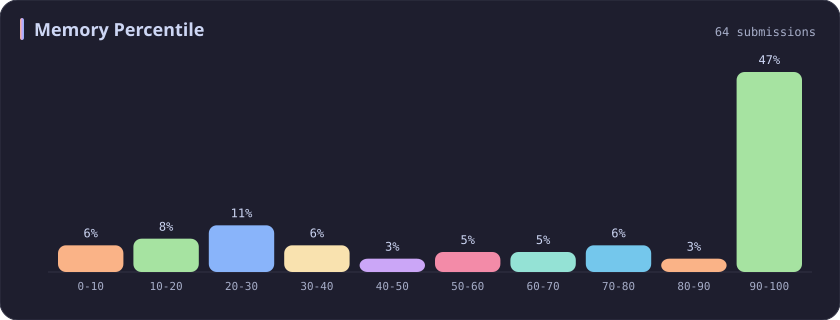
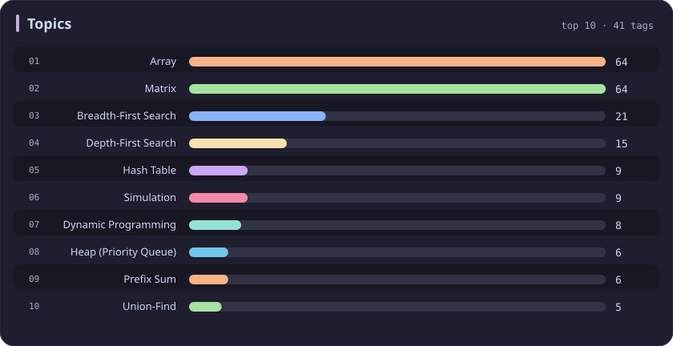

# Matrix Stats

[All stats](../../README.md)

**64** problems · updated `2026-09-06 09:44 UTC+8`

## Stats

### Difficulty

### Language

### Runtime Percentile

### Memory Percentile

### Topics

| Topic | # | Topic | # | Topic | # | Topic | # |
| :--- | ---: | :--- | ---: | :--- | ---: | :--- | ---: |
| [Array](array.md) | 387 | [Divide and Conquer](divide-and-conquer.md) | 16 | [Directed Acyclic Graph](directed-acyclic-graph.md) | 2 | [Range Minimum/Maximum Query](range-minimum-maximum-query.md) | 1 |
| [Hash Table](hash-table.md) | 168 | [Queue](queue.md) | 16 | [Quickselect](quickselect.md) | 2 | [Nim Game](nim-game.md) | 1 |
| [String](string.md) | 167 | [Trie](trie.md) | 11 | [Binary Lifting](binary-lifting.md) | 2 | [Impartial Game](impartial-game.md) | 1 |
| [Math](math.md) | 114 | [Binary Search Tree](binary-search-tree.md) | 11 | [Lowest Common Ancestor](lowest-common-ancestor.md) | 2 | [Binary Indexed Tree](binary-indexed-tree.md) | 1 |
| [Sorting](sorting.md) | 87 | [Monotonic Stack](monotonic-stack.md) | 10 | [Counting Sort](counting-sort.md) | 2 | [Sqrt Decomposition](sqrt-decomposition.md) | 1 |
| [Dynamic Programming](dynamic-programming.md) | 83 | [Number Theory](number-theory.md) | 10 | [Interactive](interactive.md) | 2 | [Complete Knapsack](complete-knapsack.md) | 1 |
| [Depth-First Search](depth-first-search.md) | 80 | [Ordered Set](ordered-set.md) | 8 | [Pigeonhole Principle](pigeonhole-principle.md) | 2 | [Reservoir Sampling](reservoir-sampling.md) | 1 |
| [Greedy](greedy.md) | 79 | [Combinatorics](combinatorics.md) | 7 | [Longest Increasing Subsequence](longest-increasing-subsequence.md) | 2 | [Bellman–Ford Algorithm](bellman-ford-algorithm.md) | 1 |
| [Two Pointers](two-pointers.md) | 70 | [Memoization](memoization.md) | 6 | [Segment Tree](segment-tree.md) | 2 | [Floyd–Warshall Algorithm](floyd-warshall-algorithm.md) | 1 |
| [Breadth-First Search](breadth-first-search.md) | 69 | [Data Stream](data-stream.md) | 6 | [Linear Algebra](linear-algebra.md) | 2 | [0-1 Knapsack](0-1-knapsack.md) | 1 |
| **Matrix** | **64** | [Shortest Path](shortest-path.md) | 6 | [Randomized](randomized.md) | 2 | [Aho–Corasick Algorithm](aho-corasick-algorithm.md) | 1 |
| [Binary Search](binary-search.md) | 63 | [Game Theory](game-theory.md) | 5 | [Heuristic Search](heuristic-search.md) | 2 | [Bidirectional Search](bidirectional-search.md) | 1 |
| [Tree](tree.md) | 60 | [Geometry](geometry.md) | 5 | [A* Search](a-search.md) | 2 | [Ternary Search](ternary-search.md) | 1 |
| [Binary Tree](binary-tree.md) | 50 | [Bracket Sequences](bracket-sequences.md) | 4 | [Hash Function](hash-function.md) | 2 | [Zero-Sum Game](zero-sum-game.md) | 1 |
| [Stack](stack.md) | 47 | [String Matching](string-matching.md) | 4 | [Greatest Common Divisor](greatest-common-divisor.md) | 2 | [Timsort](timsort.md) | 1 |
| [Prefix Sum](prefix-sum.md) | 46 | [Floyd's Cycle Finding Algorithm](floyd-s-cycle-finding-algorithm.md) | 4 | [Longest Common Subsequence](longest-common-subsequence.md) | 2 | [Radix Sort](radix-sort.md) | 1 |
| [Bit Manipulation](bit-manipulation.md) | 41 | [Topological Sort](topological-sort.md) | 4 | [Prime Factorization](prime-factorization.md) | 2 | [Triangulation](triangulation.md) | 1 |
| [Simulation](simulation.md) | 40 | [Monotonic Queue](monotonic-queue.md) | 4 | [Bitmask](bitmask.md) | 2 | [Euclidean Algorithm](euclidean-algorithm.md) | 1 |
| [Counting](counting.md) | 40 | [DP on Trees](dp-on-trees.md) | 4 | [Manacher](manacher.md) | 1 | [Minimum Spanning Tree](minimum-spanning-tree.md) | 1 |
| [Database](database.md) | 39 | [Brainteaser](brainteaser.md) | 4 | [Tournament Sort](tournament-sort.md) | 1 | [Doubly-Linked List](doubly-linked-list.md) | 1 |
| [Heap (Priority Queue)](heap-priority-queue.md) | 34 | [Polygons](polygons.md) | 4 | [Z Algorithm](z-algorithm.md) | 1 | [Least Common Multiple](least-common-multiple.md) | 1 |
| [Sliding Window](sliding-window.md) | 30 | [Merge Sort](merge-sort.md) | 3 | [Knuth–Morris–Pratt Algorithm](knuth-morris-pratt-algorithm.md) | 1 | [Fermat's Little Theorem](fermat-s-little-theorem.md) | 1 |
| [Linked List](linked-list.md) | 28 | [Algorithm X](algorithm-x.md) | 3 | [Boyer–Moore String-Search Algorithm](boyer-moore-string-search-algorithm.md) | 1 | [Kosaraju's Algorithm](kosaraju-s-algorithm.md) | 1 |
| [Graph Theory](graph-theory.md) | 27 | [Quicksort](quicksort.md) | 3 | [Dancing Links](dancing-links.md) | 1 | [Tarjan's SCC Algorithm](tarjan-s-scc-algorithm.md) | 1 |
| [Design](design.md) | 25 | [Minimax](minimax.md) | 3 | [Newton's Method](newton-s-method.md) | 1 | [Multiple Knapsack](multiple-knapsack.md) | 1 |
| [Recursion](recursion.md) | 21 | [Knapsack Problem](knapsack-problem.md) | 3 | [Bubble Sort](bubble-sort.md) | 1 | [Rolling Hash](rolling-hash.md) | 1 |
| [Backtracking](backtracking.md) | 18 | [Bucket Sort](bucket-sort.md) | 3 | [Primality Test](primality-test.md) | 1 |  |  |
| [Union-Find](union-find.md) | 17 | [Dijkstra's Algorithm](dijkstra-s-algorithm.md) | 3 | [Sieve Theory](sieve-theory.md) | 1 |  |  |
| [Enumeration](enumeration.md) | 17 | [Boyer–Moore Majority Vote Algorithm](boyer-moore-majority-vote-algorithm.md) | 2 | [Prime Number Sieve](prime-number-sieve.md) | 1 |  |  |

---

## Recent Activity

Latest **64** accepted submissions.

| Date | Title | Difficulty | Lang | Runtime | Memory |
| :--- | :--- | :---: | :---: | ---: | ---: |
| 2026&#8209;08&#8209;20 | [308. Range Sum Query 2D - Mutable](https://leetcode.com/problems/range-sum-query-2d-mutable/) | Medium | C++ | 19 ms `58.17%` | 44.6 MB `11.30%` |
| 2026&#8209;08&#8209;13 | [286. Walls and Gates](https://leetcode.com/problems/walls-and-gates/) | Medium | C++ | 7 ms `44.44%` | 19 MB `83.33%` |
| 2026&#8209;06&#8209;04 | [723. Candy Crush](https://leetcode.com/problems/candy-crush/) | Medium | C++ | 4 ms `61.92%` | 14.4 MB `20.92%` |
| 2026&#8209;05&#8209;23 | [3938. Maximum Path Intersection Sum in a Grid](https://leetcode.com/problems/maximum-path-intersection-sum-in-a-grid/) | Medium | C++ | 72 ms `9.23%` | 185.7 MB `5.00%` |
| 2026&#8209;05&#8209;20 | [2061. Number of Spaces Cleaning Robot Cleaned](https://leetcode.com/problems/number-of-spaces-cleaning-robot-cleaned/) | Medium | C++ | 65 ms `26.67%` | 54 MB `26.67%` |
| 2026&#8209;03&#8209;25 | [3546. Equal Sum Grid Partition I](https://leetcode.com/problems/equal-sum-grid-partition-i/) | Medium | C++ | 12 ms `34.01%` | 130.2 MB `100.00%` |
| 2025&#8209;10&#8209;06 | [778. Swim in Rising Water](https://leetcode.com/problems/swim-in-rising-water/) | Hard | C++ | 34 ms `7.85%` | 17.1 MB `10.48%` |
| 2025&#8209;10&#8209;05 | [417. Pacific Atlantic Water Flow](https://leetcode.com/problems/pacific-atlantic-water-flow/) | Medium | C++ | 4 ms `76.47%` | 22.2 MB `76.03%` |
| 2025&#8209;10&#8209;03 | [407. Trapping Rain Water II](https://leetcode.com/problems/trapping-rain-water-ii/) | Hard | C++ | 34 ms `43.03%` | 22.7 MB `32.34%` |
| 2025&#8209;09&#8209;20 | [3484. Design Spreadsheet](https://leetcode.com/problems/design-spreadsheet/) | Medium | Python | 57 ms `96.77%` | 23.5 MB `100.00%` |
| 2025&#8209;08&#8209;31 | [37. Sudoku Solver](https://leetcode.com/problems/sudoku-solver/) | Hard | C++ | 46 ms `97.76%` | 8.7 MB `97.42%` |
| 2025&#8209;08&#8209;30 | [36. Valid Sudoku](https://leetcode.com/problems/valid-sudoku/) | Medium | C++ | 0 ms `100.00%` | 22.7 MB `57.13%` |
| 2025&#8209;08&#8209;28 | [3446. Sort Matrix by Diagonals](https://leetcode.com/problems/sort-matrix-by-diagonals/) | Medium | C++ | 4 ms `84.97%` | 43.3 MB `86.76%` |
| 2025&#8209;08&#8209;27 | [3459. Length of Longest V-Shaped Diagonal Segment](https://leetcode.com/problems/length-of-longest-v-shaped-diagonal-segment/) | Hard | C++ | 231 ms `91.38%` | 111.8 MB `52.16%` |
| 2025&#8209;08&#8209;25 | [498. Diagonal Traverse](https://leetcode.com/problems/diagonal-traverse/) | Medium | C++ | 0 ms `100.00%` | 22.8 MB `70.10%` |
| 2025&#8209;06&#8209;01 | [909. Snakes and Ladders](https://leetcode.com/problems/snakes-and-ladders/) | Medium | C++ | 0 ms `100.00%` | 16.9 MB `67.49%` |
| 2025&#8209;05&#8209;21 | [73. Set Matrix Zeroes](https://leetcode.com/problems/set-matrix-zeroes/) | Medium | C++ | 0 ms `100.00%` | 18.7 MB `99.98%` |
| 2025&#8209;05&#8209;11 | [3548. Equal Sum Grid Partition II](https://leetcode.com/problems/equal-sum-grid-partition-ii/) | Hard | C++ | 826 ms `55.46%` | 400.9 MB `37.86%` |
| 2025&#8209;05&#8209;08 | [3342. Find Minimum Time to Reach Last Room II](https://leetcode.com/problems/find-minimum-time-to-reach-last-room-ii/) | Medium | C++ | 777 ms `30.12%` | 116.8 MB `49.84%` |
| 2025&#8209;05&#8209;07 | [3341. Find Minimum Time to Reach Last Room I](https://leetcode.com/problems/find-minimum-time-to-reach-last-room-i/) | Medium | C++ | 26 ms `37.76%` | 31.1 MB `25.92%` |
| 2025&#8209;05&#8209;04 | [311. Sparse Matrix Multiplication](https://leetcode.com/problems/sparse-matrix-multiplication/) | Medium | C++ | 0 ms `100.00%` | 12.5 MB `11.29%` |
| 2025&#8209;05&#8209;04 | [531. Lonely Pixel I](https://leetcode.com/problems/lonely-pixel-i/) | Medium | Python | 32 ms `5.66%` | 22.9 MB `100.00%` |
| 2025&#8209;05&#8209;04 | [422. Valid Word Square](https://leetcode.com/problems/valid-word-square/) | Easy | Python | 18 ms `65.88%` | 18.4 MB `100.00%` |
| 2025&#8209;05&#8209;04 | [1198. Find Smallest Common Element in All Rows](https://leetcode.com/problems/find-smallest-common-element-in-all-rows/) | Medium | C++ | 12 ms `33.33%` | 31.3 MB `25.56%` |
| 2025&#8209;05&#8209;04 | [3537. Fill a Special Grid](https://leetcode.com/problems/fill-a-special-grid/) | Medium | C++ | 8 ms `75.76%` | 69.1 MB `22.22%` |
| 2025&#8209;04&#8209;27 | [3529. Count Cells in Overlapping Horizontal and Vertical Substrings](https://leetcode.com/problems/count-cells-in-overlapping-horizontal-and-vertical-substrings/) | Medium | C++ | 2256 ms `5.71%` | 63.1 MB `95.71%` |
| 2025&#8209;04&#8209;26 | [499. The Maze III](https://leetcode.com/problems/the-maze-iii/) | Hard | C++ | 17 ms `6.78%` | 20.2 MB `5.08%` |
| 2025&#8209;04&#8209;26 | [505. The Maze II](https://leetcode.com/problems/the-maze-ii/) | Medium | C++ | 3 ms `85.22%` | 24.3 MB `63.05%` |
| 2025&#8209;04&#8209;26 | [490. The Maze](https://leetcode.com/problems/the-maze/) | Medium | C++ | 0 ms `100.00%` | 22.9 MB `79.49%` |
| 2025&#8209;04&#8209;24 | [302. Smallest Rectangle Enclosing Black Pixels](https://leetcode.com/problems/smallest-rectangle-enclosing-black-pixels/) | Hard | C++ | 8 ms `13.11%` | 23.9 MB `13.11%` |
| 2025&#8209;04&#8209;21 | [1926. Nearest Exit from Entrance in Maze](https://leetcode.com/problems/nearest-exit-from-entrance-in-maze/) | Medium | C++ | 139 ms `5.55%` | 69.5 MB `5.01%` |
| 2025&#8209;04&#8209;20 | [994. Rotting Oranges](https://leetcode.com/problems/rotting-oranges/) | Medium | C++ | 1 ms `36.04%` | 17.2 MB `28.15%` |
| 2025&#8209;04&#8209;20 | [2352. Equal Row and Column Pairs](https://leetcode.com/problems/equal-row-and-column-pairs/) | Medium | Python | 51 ms `32.70%` | 22.1 MB `99.98%` |
| 2025&#8209;04&#8209;07 | [317. Shortest Distance from All Buildings](https://leetcode.com/problems/shortest-distance-from-all-buildings/) | Hard | C++ | 470 ms `46.48%` | 197.7 MB `39.44%` |
| 2024&#8209;10&#8209;29 | [2684. Maximum Number of Moves in a Grid](https://leetcode.com/problems/maximum-number-of-moves-in-a-grid/) | Medium | C++ | 15 ms `58.58%` | 74.4 MB `74.18%` |
| 2024&#8209;10&#8209;27 | [1277. Count Square Submatrices with All Ones](https://leetcode.com/problems/count-square-submatrices-with-all-ones/) | Medium | C++ | 1039 ms `5.05%` | 26.5 MB `100.00%` |
| 2024&#8209;10&#8209;22 | [2664. The Knight’s Tour](https://leetcode.com/problems/the-knights-tour/) | Medium | C++ | 71 ms `85.71%` | 7.7 MB `100.00%` |
| 2024&#8209;04&#8209;21 | [1992. Find All Groups of Farmland](https://leetcode.com/problems/find-all-groups-of-farmland/) | Medium | C++ | 510 ms `7.61%` | 106.4 MB `31.99%` |
| 2024&#8209;04&#8209;19 | [200. Number of Islands](https://leetcode.com/problems/number-of-islands/) | Medium | C++ | 28 ms `47.94%` | 16.8 MB `60.84%` |
| 2024&#8209;04&#8209;18 | [463. Island Perimeter](https://leetcode.com/problems/island-perimeter/) | Easy | C++ | 78 ms `5.13%` | 104.4 MB `25.27%` |
| 2024&#8209;04&#8209;14 | [85. Maximal Rectangle](https://leetcode.com/problems/maximal-rectangle/) | Hard | Python | 1343 ms `6.67%` | 24.6 MB `50.77%` |
| 2024&#8209;04&#8209;04 | [79. Word Search](https://leetcode.com/problems/word-search/) | Medium | C++ | 375 ms `39.57%` | 10.8 MB `49.28%` |
| 2023&#8209;04&#8209;15 | [2639. Find the Width of Columns of a Grid](https://leetcode.com/problems/find-the-width-of-columns-of-a-grid/) | Easy | C++ | 28 ms `6.07%` | 10.2 MB `100.00%` |
| 2023&#8209;04&#8209;09 | [2614. Prime In Diagonal](https://leetcode.com/problems/prime-in-diagonal/) | Easy | C++ | 129 ms `5.06%` | 35.7 MB `99.92%` |
| 2023&#8209;04&#8209;07 | [1254. Number of Closed Islands](https://leetcode.com/problems/number-of-closed-islands/) | Medium | C++ | 152 ms `5.01%` | 10 MB `100.00%` |
| 2023&#8209;04&#8209;07 | [1020. Number of Enclaves](https://leetcode.com/problems/number-of-enclaves/) | Medium | C++ | 87 ms `6.98%` | 27.7 MB `99.98%` |
| 2023&#8209;03&#8209;31 | [1444. Number of Ways of Cutting a Pizza](https://leetcode.com/problems/number-of-ways-of-cutting-a-pizza/) | Hard | C++ | 23 ms `8.59%` | 8.2 MB `100.00%` |
| 2023&#8209;03&#8209;27 | [64. Minimum Path Sum](https://leetcode.com/problems/minimum-path-sum/) | Medium | C++ | 8 ms `5.26%` | 10.2 MB `100.00%` |
| 2023&#8209;03&#8209;21 | [54. Spiral Matrix](https://leetcode.com/problems/spiral-matrix/) | Medium | C++ | 0 ms `100.00%` | 7 MB `100.00%` |
| 2023&#8209;03&#8209;20 | [74. Search a 2D Matrix](https://leetcode.com/problems/search-a-2d-matrix/) | Medium | C++ | 5 ms `0.15%` | 9.3 MB `100.00%` |
| 2023&#8209;03&#8209;20 | [566. Reshape the Matrix](https://leetcode.com/problems/reshape-the-matrix/) | Easy | C++ | 17 ms `1.93%` | 10.9 MB `100.00%` |
| 2023&#8209;03&#8209;19 | [2596. Check Knight Tour Configuration](https://leetcode.com/problems/check-knight-tour-configuration/) | Medium | C++ | 15 ms `2.96%` | 28.1 MB `100.00%` |
| 2023&#8209;03&#8209;14 | [733. Flood Fill](https://leetcode.com/problems/flood-fill/) | Easy | C++ | 10 ms `1.87%` | 14 MB `100.00%` |
| 2023&#8209;03&#8209;13 | [542. 01 Matrix](https://leetcode.com/problems/01-matrix/) | Medium | C++ | 69 ms `7.79%` | 31.2 MB `99.98%` |
| 2023&#8209;03&#8209;10 | [1572. Matrix Diagonal Sum](https://leetcode.com/problems/matrix-diagonal-sum/) | Easy | C++ | 26 ms `0.43%` | 11.4 MB `100.00%` |
| 2023&#8209;03&#8209;10 | [1672. Richest Customer Wealth](https://leetcode.com/problems/richest-customer-wealth/) | Easy | C++ | 12 ms `0.07%` | 8.1 MB `100.00%` |
| 2023&#8209;03&#8209;10 | [695. Max Area of Island](https://leetcode.com/problems/max-area-of-island/) | Medium | C++ | 25 ms `5.15%` | 24.1 MB `100.00%` |
| 2023&#8209;03&#8209;08 | [2428. Maximum Sum of an Hourglass](https://leetcode.com/problems/maximum-sum-of-an-hourglass/) | Medium | C++ | 42 ms `5.12%` | 13.2 MB `100.00%` |
| 2023&#8209;03&#8209;03 | [1314. Matrix Block Sum](https://leetcode.com/problems/matrix-block-sum/) | Medium | C++ | 15 ms `21.90%` | 9.6 MB `100.00%` |
| 2023&#8209;02&#8209;27 | [427. Construct Quad Tree](https://leetcode.com/problems/construct-quad-tree/) | Medium | C++ | 31 ms `5.31%` | 23.5 MB `15.71%` |
| 2023&#8209;02&#8209;24 | [59. Spiral Matrix II](https://leetcode.com/problems/spiral-matrix-ii/) | Medium | C++ | 0 ms `100.00%` | 6.5 MB `100.00%` |
| 2023&#8209;02&#8209;17 | [883. Projection Area of 3D Shapes](https://leetcode.com/problems/projection-area-of-3d-shapes/) | Easy | C++ | 10 ms `0.58%` | 9.4 MB `100.00%` |
| 2023&#8209;02&#8209;17 | [2545. Sort the Students by Their Kth Score](https://leetcode.com/problems/sort-the-students-by-their-kth-score/) | Medium | C++ | 80 ms `5.17%` | 55.9 MB `5.27%` |
| 2023&#8209;02&#8209;16 | [1706. Where Will the Ball Fall](https://leetcode.com/problems/where-will-the-ball-fall/) | Medium | C++ | 29 ms `3.20%` | 13.3 MB `100.00%` |
