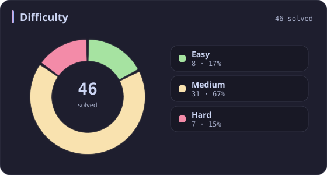
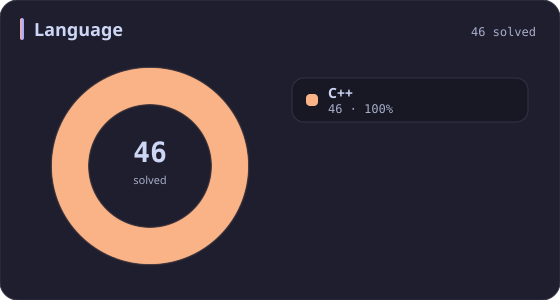
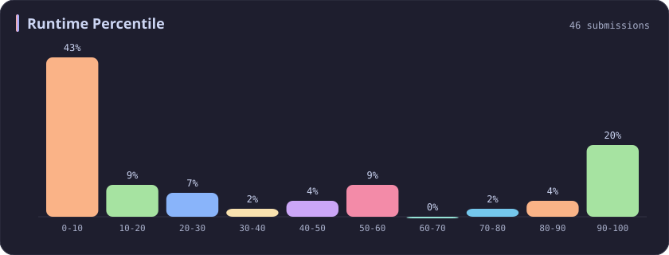
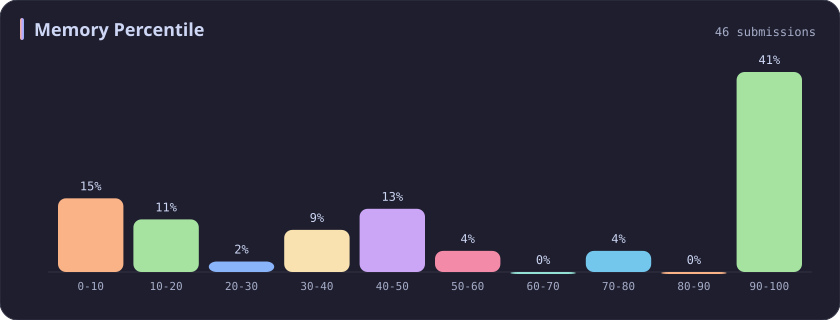
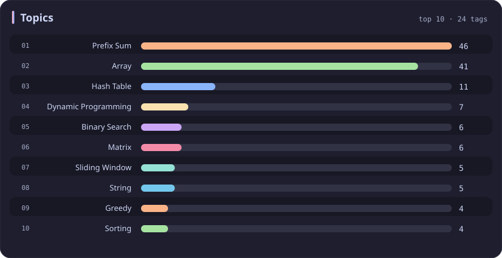

# Prefix Sum Stats

[All stats](../../README.md)

**46** problems · updated `2026-09-06 09:44 UTC+8`

## Stats

### Difficulty

### Language

### Runtime Percentile

### Memory Percentile

### Topics

| Topic | # | Topic | # | Topic | # | Topic | # |
| :--- | ---: | :--- | ---: | :--- | ---: | :--- | ---: |
| [Array](array.md) | 387 | [Divide and Conquer](divide-and-conquer.md) | 16 | [Directed Acyclic Graph](directed-acyclic-graph.md) | 2 | [Range Minimum/Maximum Query](range-minimum-maximum-query.md) | 1 |
| [Hash Table](hash-table.md) | 168 | [Queue](queue.md) | 16 | [Quickselect](quickselect.md) | 2 | [Nim Game](nim-game.md) | 1 |
| [String](string.md) | 167 | [Trie](trie.md) | 11 | [Binary Lifting](binary-lifting.md) | 2 | [Impartial Game](impartial-game.md) | 1 |
| [Math](math.md) | 114 | [Binary Search Tree](binary-search-tree.md) | 11 | [Lowest Common Ancestor](lowest-common-ancestor.md) | 2 | [Binary Indexed Tree](binary-indexed-tree.md) | 1 |
| [Sorting](sorting.md) | 87 | [Monotonic Stack](monotonic-stack.md) | 10 | [Counting Sort](counting-sort.md) | 2 | [Sqrt Decomposition](sqrt-decomposition.md) | 1 |
| [Dynamic Programming](dynamic-programming.md) | 83 | [Number Theory](number-theory.md) | 10 | [Interactive](interactive.md) | 2 | [Complete Knapsack](complete-knapsack.md) | 1 |
| [Depth-First Search](depth-first-search.md) | 80 | [Ordered Set](ordered-set.md) | 8 | [Pigeonhole Principle](pigeonhole-principle.md) | 2 | [Reservoir Sampling](reservoir-sampling.md) | 1 |
| [Greedy](greedy.md) | 79 | [Combinatorics](combinatorics.md) | 7 | [Longest Increasing Subsequence](longest-increasing-subsequence.md) | 2 | [Bellman–Ford Algorithm](bellman-ford-algorithm.md) | 1 |
| [Two Pointers](two-pointers.md) | 70 | [Memoization](memoization.md) | 6 | [Segment Tree](segment-tree.md) | 2 | [Floyd–Warshall Algorithm](floyd-warshall-algorithm.md) | 1 |
| [Breadth-First Search](breadth-first-search.md) | 69 | [Data Stream](data-stream.md) | 6 | [Linear Algebra](linear-algebra.md) | 2 | [0-1 Knapsack](0-1-knapsack.md) | 1 |
| [Matrix](matrix.md) | 64 | [Shortest Path](shortest-path.md) | 6 | [Randomized](randomized.md) | 2 | [Aho–Corasick Algorithm](aho-corasick-algorithm.md) | 1 |
| [Binary Search](binary-search.md) | 63 | [Game Theory](game-theory.md) | 5 | [Heuristic Search](heuristic-search.md) | 2 | [Bidirectional Search](bidirectional-search.md) | 1 |
| [Tree](tree.md) | 60 | [Geometry](geometry.md) | 5 | [A* Search](a-search.md) | 2 | [Ternary Search](ternary-search.md) | 1 |
| [Binary Tree](binary-tree.md) | 50 | [Bracket Sequences](bracket-sequences.md) | 4 | [Hash Function](hash-function.md) | 2 | [Zero-Sum Game](zero-sum-game.md) | 1 |
| [Stack](stack.md) | 47 | [String Matching](string-matching.md) | 4 | [Greatest Common Divisor](greatest-common-divisor.md) | 2 | [Timsort](timsort.md) | 1 |
| **Prefix Sum** | **46** | [Floyd's Cycle Finding Algorithm](floyd-s-cycle-finding-algorithm.md) | 4 | [Longest Common Subsequence](longest-common-subsequence.md) | 2 | [Radix Sort](radix-sort.md) | 1 |
| [Bit Manipulation](bit-manipulation.md) | 41 | [Topological Sort](topological-sort.md) | 4 | [Prime Factorization](prime-factorization.md) | 2 | [Triangulation](triangulation.md) | 1 |
| [Simulation](simulation.md) | 40 | [Monotonic Queue](monotonic-queue.md) | 4 | [Bitmask](bitmask.md) | 2 | [Euclidean Algorithm](euclidean-algorithm.md) | 1 |
| [Counting](counting.md) | 40 | [DP on Trees](dp-on-trees.md) | 4 | [Manacher](manacher.md) | 1 | [Minimum Spanning Tree](minimum-spanning-tree.md) | 1 |
| [Database](database.md) | 39 | [Brainteaser](brainteaser.md) | 4 | [Tournament Sort](tournament-sort.md) | 1 | [Doubly-Linked List](doubly-linked-list.md) | 1 |
| [Heap (Priority Queue)](heap-priority-queue.md) | 34 | [Polygons](polygons.md) | 4 | [Z Algorithm](z-algorithm.md) | 1 | [Least Common Multiple](least-common-multiple.md) | 1 |
| [Sliding Window](sliding-window.md) | 30 | [Merge Sort](merge-sort.md) | 3 | [Knuth–Morris–Pratt Algorithm](knuth-morris-pratt-algorithm.md) | 1 | [Fermat's Little Theorem](fermat-s-little-theorem.md) | 1 |
| [Linked List](linked-list.md) | 28 | [Algorithm X](algorithm-x.md) | 3 | [Boyer–Moore String-Search Algorithm](boyer-moore-string-search-algorithm.md) | 1 | [Kosaraju's Algorithm](kosaraju-s-algorithm.md) | 1 |
| [Graph Theory](graph-theory.md) | 27 | [Quicksort](quicksort.md) | 3 | [Dancing Links](dancing-links.md) | 1 | [Tarjan's SCC Algorithm](tarjan-s-scc-algorithm.md) | 1 |
| [Design](design.md) | 25 | [Minimax](minimax.md) | 3 | [Newton's Method](newton-s-method.md) | 1 | [Multiple Knapsack](multiple-knapsack.md) | 1 |
| [Recursion](recursion.md) | 21 | [Knapsack Problem](knapsack-problem.md) | 3 | [Bubble Sort](bubble-sort.md) | 1 | [Rolling Hash](rolling-hash.md) | 1 |
| [Backtracking](backtracking.md) | 18 | [Bucket Sort](bucket-sort.md) | 3 | [Primality Test](primality-test.md) | 1 |  |  |
| [Union-Find](union-find.md) | 17 | [Dijkstra's Algorithm](dijkstra-s-algorithm.md) | 3 | [Sieve Theory](sieve-theory.md) | 1 |  |  |
| [Enumeration](enumeration.md) | 17 | [Boyer–Moore Majority Vote Algorithm](boyer-moore-majority-vote-algorithm.md) | 2 | [Prime Number Sieve](prime-number-sieve.md) | 1 |  |  |

---

## Recent Activity

Latest **46** accepted submissions.

| Date | Title | Difficulty | Lang | Runtime | Memory |
| :--- | :--- | :---: | :---: | ---: | ---: |
| 2026&#8209;09&#8209;04 | [3903. Smallest Stable Index I](https://leetcode.com/problems/smallest-stable-index-i/) | Easy | C++ | 0 ms `100.00%` | 31.5 MB `20.68%` |
| 2026&#8209;06&#8209;06 | [2574. Left and Right Sum Differences](https://leetcode.com/problems/left-and-right-sum-differences/) | Easy | C++ | 0 ms `100.00%` | 15.2 MB `41.89%` |
| 2026&#8209;05&#8209;23 | [3938. Maximum Path Intersection Sum in a Grid](https://leetcode.com/problems/maximum-path-intersection-sum-in-a-grid/) | Medium | C++ | 72 ms `9.23%` | 185.7 MB `5.00%` |
| 2026&#8209;03&#8209;25 | [3546. Equal Sum Grid Partition I](https://leetcode.com/problems/equal-sum-grid-partition-i/) | Medium | C++ | 12 ms `34.01%` | 130.2 MB `100.00%` |
| 2026&#8209;02&#8209;10 | [3719. Longest Balanced Subarray I](https://leetcode.com/problems/longest-balanced-subarray-i/) | Medium | C++ | 151 ms `89.04%` | 35.7 MB `94.90%` |
| 2025&#8209;10&#8209;12 | [3714. Longest Balanced Substring II](https://leetcode.com/problems/longest-balanced-substring-ii/) | Medium | C++ | 1603 ms `59.24%` | 403.9 MB `18.22%` |
| 2025&#8209;10&#8209;12 | [3147. Taking Maximum Energy From the Mystic Dungeon](https://leetcode.com/problems/taking-maximum-energy-from-the-mystic-dungeon/) | Medium | C++ | 141 ms `82.37%` | 151.8 MB `100.00%` |
| 2025&#8209;10&#8209;11 | [3707. Equal Score Substrings](https://leetcode.com/problems/equal-score-substrings/) | Easy | C++ | 3 ms `23.55%` | 8.6 MB `44.95%` |
| 2025&#8209;10&#8209;09 | [3494. Find the Minimum Amount of Time to Brew Potions](https://leetcode.com/problems/find-the-minimum-amount-of-time-to-brew-potions/) | Medium | C++ | 575 ms `18.46%` | 407.4 MB `15.38%` |
| 2025&#8209;09&#8209;28 | [3699. Number of ZigZag Arrays I](https://leetcode.com/problems/number-of-zigzag-arrays-i/) | Hard | C++ | 407 ms `76.79%` | 11.7 MB `94.59%` |
| 2025&#8209;09&#8209;28 | [3698. Split Array With Minimum Difference](https://leetcode.com/problems/split-array-with-minimum-difference/) | Medium | C++ | 0 ms `100.00%` | 169.6 MB `94.85%` |
| 2025&#8209;09&#8209;27 | [3694. Distinct Points Reachable After Substring Removal](https://leetcode.com/problems/distinct-points-reachable-after-substring-removal/) | Medium | C++ | 130 ms `52.48%` | 53.5 MB `42.98%` |
| 2025&#8209;05&#8209;22 | [3362. Zero Array Transformation III](https://leetcode.com/problems/zero-array-transformation-iii/) | Medium | C++ | 128 ms `50.88%` | 224.5 MB `38.16%` |
| 2025&#8209;05&#8209;20 | [3355. Zero Array Transformation I](https://leetcode.com/problems/zero-array-transformation-i/) | Medium | C++ | 220 ms `5.01%` | 298.2 MB `30.88%` |
| 2025&#8209;05&#8209;11 | [3548. Equal Sum Grid Partition II](https://leetcode.com/problems/equal-sum-grid-partition-ii/) | Hard | C++ | 826 ms `55.46%` | 400.9 MB `37.86%` |
| 2025&#8209;05&#8209;04 | [253. Meeting Rooms II](https://leetcode.com/problems/meeting-rooms-ii/) | Medium | C++ | 0 ms `100.00%` | 15.9 MB `99.80%` |
| 2025&#8209;04&#8209;29 | [2302. Count Subarrays With Score Less Than K](https://leetcode.com/problems/count-subarrays-with-score-less-than-k/) | Hard | C++ | 0 ms `100.00%` | 99.1 MB `45.78%` |
| 2025&#8209;04&#8209;25 | [2845. Count of Interesting Subarrays](https://leetcode.com/problems/count-of-interesting-subarrays/) | Medium | C++ | 59 ms `42.22%` | 127.3 MB `10.79%` |
| 2025&#8209;04&#8209;24 | [238. Product of Array Except Self](https://leetcode.com/problems/product-of-array-except-self/) | Medium | C++ | 2 ms `42.79%` | 41.6 MB `37.92%` |
| 2025&#8209;04&#8209;21 | [2145. Count the Hidden Sequences](https://leetcode.com/problems/count-the-hidden-sequences/) | Medium | C++ | 0 ms `100.00%` | 112.6 MB `50.89%` |
| 2025&#8209;04&#8209;20 | [1732. Find the Highest Altitude](https://leetcode.com/problems/find-the-highest-altitude/) | Easy | C++ | 0 ms `100.00%` | 10.8 MB `44.88%` |
| 2025&#8209;04&#8209;20 | [724. Find Pivot Index](https://leetcode.com/problems/find-pivot-index/) | Easy | C++ | 0 ms `100.00%` | 37.1 MB `10.61%` |
| 2025&#8209;04&#8209;20 | [1004. Max Consecutive Ones III](https://leetcode.com/problems/max-consecutive-ones-iii/) | Medium | C++ | 11 ms `6.07%` | 65.6 MB `100.00%` |
| 2025&#8209;04&#8209;20 | [325. Maximum Size Subarray Sum Equals k](https://leetcode.com/problems/maximum-size-subarray-sum-equals-k/) | Medium | C++ | 353 ms `6.74%` | 122.8 MB `74.16%` |
| 2024&#8209;11&#8209;17 | [862. Shortest Subarray with Sum at Least K](https://leetcode.com/problems/shortest-subarray-with-sum-at-least-k/) | Hard | C++ | 50 ms `9.43%` | 112.6 MB `5.17%` |
| 2024&#8209;11&#8209;08 | [1829. Maximum XOR for Each Query](https://leetcode.com/problems/maximum-xor-for-each-query/) | Medium | C++ | 12 ms `20.47%` | 99.6 MB `58.04%` |
| 2024&#8209;11&#8209;04 | [2955. Number of Same-End Substrings](https://leetcode.com/problems/number-of-same-end-substrings/) | Medium | C++ | 238 ms `15.38%` | 230.3 MB `7.69%` |
| 2024&#8209;10&#8209;20 | [1442. Count Triplets That Can Form Two Arrays of Equal XOR](https://leetcode.com/problems/count-triplets-that-can-form-two-arrays-of-equal-xor/) | Medium | C++ | 20 ms `17.46%` | 9.6 MB `100.00%` |
| 2024&#8209;03&#8209;30 | [3096. Minimum Levels to Gain More Points](https://leetcode.com/problems/minimum-levels-to-gain-more-points/) | Medium | C++ | 221 ms `6.38%` | 291.7 MB `8.08%` |
| 2024&#8209;03&#8209;27 | [713. Subarray Product Less Than K](https://leetcode.com/problems/subarray-product-less-than-k/) | Medium | C++ | 62 ms `9.64%` | 63.8 MB `5.29%` |
| 2024&#8209;03&#8209;24 | [523. Continuous Subarray Sum](https://leetcode.com/problems/continuous-subarray-sum/) | Medium | C++ | 268 ms `5.32%` | 147.1 MB `17.99%` |
| 2023&#8209;10&#8209;07 | [1420. Build Array Where You Can Find The Maximum Exactly K Comparisons](https://leetcode.com/problems/build-array-where-you-can-find-the-maximum-exactly-k-comparisons/) | Hard | C++ | 4 ms `99.37%` | 8.7 MB `99.69%` |
| 2023&#8209;04&#8209;16 | [2218. Maximum Value of K Coins From Piles](https://leetcode.com/problems/maximum-value-of-k-coins-from-piles/) | Hard | C++ | 615 ms `5.04%` | 18 MB `93.82%` |
| 2023&#8209;04&#8209;15 | [2640. Find the Score of All Prefixes of an Array](https://leetcode.com/problems/find-the-score-of-all-prefixes-of-an-array/) | Medium | C++ | 146 ms `5.37%` | 58.9 MB `98.88%` |
| 2023&#8209;04&#8209;09 | [2615. Sum of Distances](https://leetcode.com/problems/sum-of-distances/) | Medium | C++ | 414 ms `5.00%` | 139.5 MB `7.50%` |
| 2023&#8209;04&#8209;05 | [2439. Minimize Maximum of Array](https://leetcode.com/problems/minimize-maximum-of-array/) | Medium | C++ | 143 ms `5.03%` | 71.3 MB `100.00%` |
| 2023&#8209;03&#8209;31 | [1444. Number of Ways of Cutting a Pizza](https://leetcode.com/problems/number-of-ways-of-cutting-a-pizza/) | Hard | C++ | 23 ms `8.59%` | 8.2 MB `100.00%` |
| 2023&#8209;03&#8209;26 | [2602. Minimum Operations to Make All Array Elements Equal](https://leetcode.com/problems/minimum-operations-to-make-all-array-elements-equal/) | Medium | C++ | 270 ms `5.04%` | 84.5 MB `78.02%` |
| 2023&#8209;03&#8209;14 | [1480. Running Sum of 1d Array](https://leetcode.com/problems/running-sum-of-1d-array/) | Easy | C++ | 4 ms `1.27%` | 8.6 MB `100.00%` |
| 2023&#8209;03&#8209;12 | [2588. Count the Number of Beautiful Subarrays](https://leetcode.com/problems/count-the-number-of-beautiful-subarrays/) | Medium | C++ | 509 ms `5.14%` | 132.3 MB `9.00%` |
| 2023&#8209;03&#8209;12 | [2587. Rearrange Array to Maximize Prefix Score](https://leetcode.com/problems/rearrange-array-to-maximize-prefix-score/) | Medium | C++ | 158 ms `5.18%` | 90.1 MB `47.79%` |
| 2023&#8209;03&#8209;11 | [303. Range Sum Query - Immutable](https://leetcode.com/problems/range-sum-query-immutable/) | Easy | C++ | 29 ms `14.62%` | 17.1 MB `100.00%` |
| 2023&#8209;03&#8209;10 | [1588. Sum of All Odd Length Subarrays](https://leetcode.com/problems/sum-of-all-odd-length-subarrays/) | Easy | C++ | 4 ms `7.10%` | 8.5 MB `100.00%` |
| 2023&#8209;03&#8209;08 | [2428. Maximum Sum of an Hourglass](https://leetcode.com/problems/maximum-sum-of-an-hourglass/) | Medium | C++ | 42 ms `5.12%` | 13.2 MB `100.00%` |
| 2023&#8209;03&#8209;03 | [1314. Matrix Block Sum](https://leetcode.com/problems/matrix-block-sum/) | Medium | C++ | 15 ms `21.90%` | 9.6 MB `100.00%` |
| 2023&#8209;02&#8209;27 | [848. Shifting Letters](https://leetcode.com/problems/shifting-letters/) | Medium | C++ | 148 ms `5.24%` | 67.8 MB `100.00%` |
