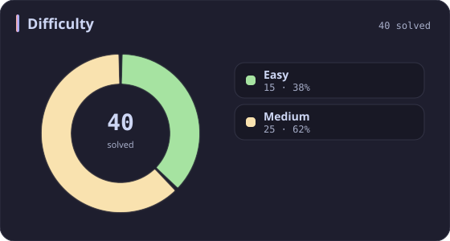
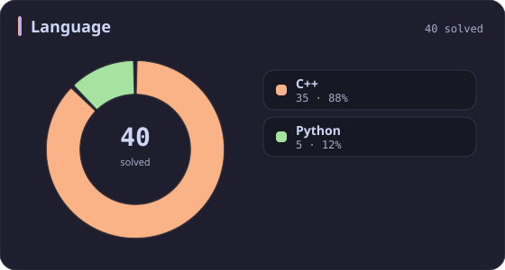
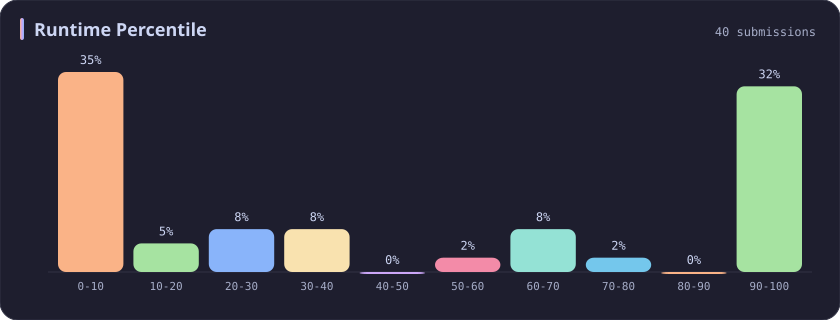
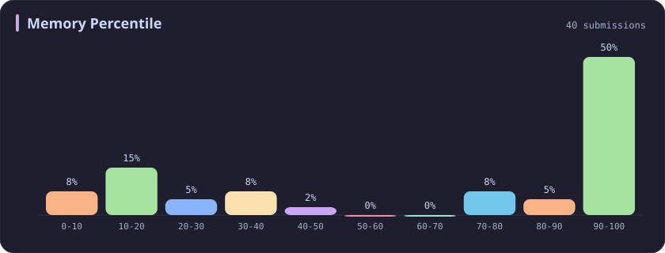
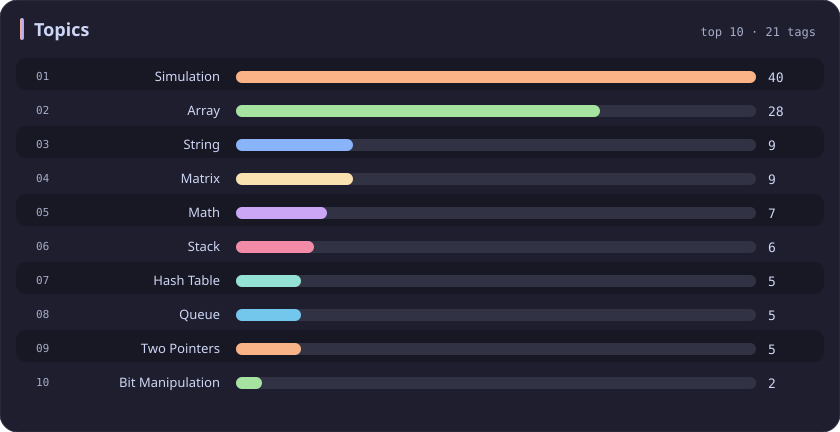

# Simulation Stats

[All stats](../../README.md)

**40** problems · updated `2026-09-04 19:12 UTC`

## Stats

### Difficulty

### Language

### Runtime Percentile

### Memory Percentile

### Topics

| Topic | # | Topic | # | Topic | # | Topic | # |
| :--- | ---: | :--- | ---: | :--- | ---: | :--- | ---: |
| [Array](array.md) | 386 | [Divide and Conquer](divide-and-conquer.md) | 16 | [Directed Acyclic Graph](directed-acyclic-graph.md) | 2 | [Range Minimum/Maximum Query](range-minimum-maximum-query.md) | 1 |
| [Hash Table](hash-table.md) | 168 | [Queue](queue.md) | 16 | [Quickselect](quickselect.md) | 2 | [Nim Game](nim-game.md) | 1 |
| [String](string.md) | 167 | [Trie](trie.md) | 11 | [Binary Lifting](binary-lifting.md) | 2 | [Impartial Game](impartial-game.md) | 1 |
| [Math](math.md) | 114 | [Binary Search Tree](binary-search-tree.md) | 11 | [Lowest Common Ancestor](lowest-common-ancestor.md) | 2 | [Binary Indexed Tree](binary-indexed-tree.md) | 1 |
| [Sorting](sorting.md) | 86 | [Monotonic Stack](monotonic-stack.md) | 10 | [Counting Sort](counting-sort.md) | 2 | [Sqrt Decomposition](sqrt-decomposition.md) | 1 |
| [Dynamic Programming](dynamic-programming.md) | 83 | [Number Theory](number-theory.md) | 10 | [Interactive](interactive.md) | 2 | [Complete Knapsack](complete-knapsack.md) | 1 |
| [Depth-First Search](depth-first-search.md) | 80 | [Ordered Set](ordered-set.md) | 8 | [Pigeonhole Principle](pigeonhole-principle.md) | 2 | [Reservoir Sampling](reservoir-sampling.md) | 1 |
| [Greedy](greedy.md) | 79 | [Combinatorics](combinatorics.md) | 7 | [Longest Increasing Subsequence](longest-increasing-subsequence.md) | 2 | [Bellman–Ford Algorithm](bellman-ford-algorithm.md) | 1 |
| [Two Pointers](two-pointers.md) | 70 | [Memoization](memoization.md) | 6 | [Segment Tree](segment-tree.md) | 2 | [Floyd–Warshall Algorithm](floyd-warshall-algorithm.md) | 1 |
| [Breadth-First Search](breadth-first-search.md) | 69 | [Data Stream](data-stream.md) | 6 | [Linear Algebra](linear-algebra.md) | 2 | [0-1 Knapsack](0-1-knapsack.md) | 1 |
| [Matrix](matrix.md) | 64 | [Shortest Path](shortest-path.md) | 6 | [Randomized](randomized.md) | 2 | [Aho–Corasick Algorithm](aho-corasick-algorithm.md) | 1 |
| [Binary Search](binary-search.md) | 63 | [Game Theory](game-theory.md) | 5 | [Heuristic Search](heuristic-search.md) | 2 | [Bidirectional Search](bidirectional-search.md) | 1 |
| [Tree](tree.md) | 60 | [Geometry](geometry.md) | 5 | [A* Search](a-search.md) | 2 | [Ternary Search](ternary-search.md) | 1 |
| [Binary Tree](binary-tree.md) | 50 | [Bracket Sequences](bracket-sequences.md) | 4 | [Hash Function](hash-function.md) | 2 | [Zero-Sum Game](zero-sum-game.md) | 1 |
| [Stack](stack.md) | 47 | [String Matching](string-matching.md) | 4 | [Greatest Common Divisor](greatest-common-divisor.md) | 2 | [Timsort](timsort.md) | 1 |
| [Prefix Sum](prefix-sum.md) | 46 | [Floyd's Cycle Finding Algorithm](floyd-s-cycle-finding-algorithm.md) | 4 | [Longest Common Subsequence](longest-common-subsequence.md) | 2 | [Radix Sort](radix-sort.md) | 1 |
| [Bit Manipulation](bit-manipulation.md) | 41 | [Topological Sort](topological-sort.md) | 4 | [Prime Factorization](prime-factorization.md) | 2 | [Triangulation](triangulation.md) | 1 |
| **Simulation** | **40** | [Monotonic Queue](monotonic-queue.md) | 4 | [Bitmask](bitmask.md) | 2 | [Euclidean Algorithm](euclidean-algorithm.md) | 1 |
| [Counting](counting.md) | 40 | [DP on Trees](dp-on-trees.md) | 4 | [Manacher](manacher.md) | 1 | [Minimum Spanning Tree](minimum-spanning-tree.md) | 1 |
| [Database](database.md) | 39 | [Brainteaser](brainteaser.md) | 4 | [Tournament Sort](tournament-sort.md) | 1 | [Doubly-Linked List](doubly-linked-list.md) | 1 |
| [Heap (Priority Queue)](heap-priority-queue.md) | 33 | [Polygons](polygons.md) | 4 | [Z Algorithm](z-algorithm.md) | 1 | [Least Common Multiple](least-common-multiple.md) | 1 |
| [Sliding Window](sliding-window.md) | 30 | [Merge Sort](merge-sort.md) | 3 | [Knuth–Morris–Pratt Algorithm](knuth-morris-pratt-algorithm.md) | 1 | [Fermat's Little Theorem](fermat-s-little-theorem.md) | 1 |
| [Linked List](linked-list.md) | 28 | [Algorithm X](algorithm-x.md) | 3 | [Boyer–Moore String-Search Algorithm](boyer-moore-string-search-algorithm.md) | 1 | [Kosaraju's Algorithm](kosaraju-s-algorithm.md) | 1 |
| [Graph Theory](graph-theory.md) | 27 | [Quicksort](quicksort.md) | 3 | [Dancing Links](dancing-links.md) | 1 | [Tarjan's SCC Algorithm](tarjan-s-scc-algorithm.md) | 1 |
| [Design](design.md) | 25 | [Minimax](minimax.md) | 3 | [Newton's Method](newton-s-method.md) | 1 | [Multiple Knapsack](multiple-knapsack.md) | 1 |
| [Recursion](recursion.md) | 21 | [Knapsack Problem](knapsack-problem.md) | 3 | [Bubble Sort](bubble-sort.md) | 1 | [Rolling Hash](rolling-hash.md) | 1 |
| [Backtracking](backtracking.md) | 18 | [Bucket Sort](bucket-sort.md) | 3 | [Primality Test](primality-test.md) | 1 |  |  |
| [Union-Find](union-find.md) | 17 | [Dijkstra's Algorithm](dijkstra-s-algorithm.md) | 3 | [Sieve Theory](sieve-theory.md) | 1 |  |  |
| [Enumeration](enumeration.md) | 17 | [Boyer–Moore Majority Vote Algorithm](boyer-moore-majority-vote-algorithm.md) | 2 | [Prime Number Sieve](prime-number-sieve.md) | 1 |  |  |

---

## Recent Activity

Latest **40** accepted submissions.

| Date | Title | Difficulty | Lang | Runtime | Memory |
| :--- | :--- | :---: | :---: | ---: | ---: |
| 2026-08-20 | [3069. Distribute Elements Into Two Arrays I](https://leetcode.com/problems/distribute-elements-into-two-arrays-i/) | Easy | C++ | 0 ms `100.00%` | 24 MB `32.91%` |
| 2026-06-08 | [2161. Partition Array According to Given Pivot](https://leetcode.com/problems/partition-array-according-to-given-pivot/) | Medium | C++ | 7 ms `58.96%` | 139.4 MB `16.25%` |
| 2026-06-04 | [723. Candy Crush](https://leetcode.com/problems/candy-crush/) | Medium | C++ | 4 ms `61.92%` | 14.4 MB `20.92%` |
| 2026-05-23 | [2744. Find Maximum Number of String Pairs](https://leetcode.com/problems/find-maximum-number-of-string-pairs/) | Easy | Python | 15 ms `8.76%` | 19.3 MB `18.79%` |
| 2026-05-20 | [2061. Number of Spaces Cleaning Robot Cleaned](https://leetcode.com/problems/number-of-spaces-cleaning-robot-cleaned/) | Medium | C++ | 65 ms `26.67%` | 54 MB `26.67%` |
| 2026-02-05 | [3379. Transformed Array](https://leetcode.com/problems/transformed-array/) | Easy | C++ | 4 ms `78.48%` | 25.8 MB `9.70%` |
| 2025-10-09 | [3494. Find the Minimum Amount of Time to Brew Potions](https://leetcode.com/problems/find-the-minimum-amount-of-time-to-brew-potions/) | Medium | C++ | 575 ms `18.46%` | 407.4 MB `15.38%` |
| 2025-10-02 | [3100. Water Bottles II](https://leetcode.com/problems/water-bottles-ii/) | Medium | C++ | 2 ms `38.80%` | 8.7 MB `15.89%` |
| 2025-10-01 | [1518. Water Bottles](https://leetcode.com/problems/water-bottles/) | Easy | C++ | 0 ms `100.00%` | 7.8 MB `46.26%` |
| 2025-09-30 | [2221. Find Triangular Sum of an Array](https://leetcode.com/problems/find-triangular-sum-of-an-array/) | Medium | C++ | 431 ms `5.07%` | 384.5 MB `5.28%` |
| 2025-09-27 | [3688. Bitwise OR of Even Numbers in an Array](https://leetcode.com/problems/bitwise-or-of-even-numbers-in-an-array/) | Easy | C++ | 0 ms `100.00%` | 24.5 MB `71.15%` |
| 2025-09-09 | [2327. Number of People Aware of a Secret](https://leetcode.com/problems/number-of-people-aware-of-a-secret/) | Medium | C++ | 34 ms `9.11%` | 9.1 MB `92.86%` |
| 2025-08-25 | [498. Diagonal Traverse](https://leetcode.com/problems/diagonal-traverse/) | Medium | C++ | 0 ms `100.00%` | 22.8 MB `70.10%` |
| 2025-05-25 | [3561. Resulting String After Adjacent Removals](https://leetcode.com/problems/resulting-string-after-adjacent-removals/) | Medium | C++ | 106 ms `36.98%` | 78.6 MB `7.40%` |
| 2025-05-06 | [1920. Build Array from Permutation](https://leetcode.com/problems/build-array-from-permutation/) | Easy | Python | 0 ms `100.00%` | 18 MB `100.00%` |
| 2025-05-03 | [353. Design Snake Game](https://leetcode.com/problems/design-snake-game/) | Medium | C++ | 199 ms `5.48%` | 582.8 MB `19.86%` |
| 2025-04-23 | [2462. Total Cost to Hire K Workers](https://leetcode.com/problems/total-cost-to-hire-k-workers/) | Medium | C++ | 56 ms `23.98%` | 79.8 MB `18.79%` |
| 2025-04-20 | [3522. Calculate Score After Performing Instructions](https://leetcode.com/problems/calculate-score-after-performing-instructions/) | Medium | C++ | 4 ms `64.29%` | 167.2 MB `74.06%` |
| 2025-04-19 | [735. Asteroid Collision](https://leetcode.com/problems/asteroid-collision/) | Medium | C++ | 0 ms `100.00%` | 21.6 MB `89.55%` |
| 2025-04-19 | [2390. Removing Stars From a String](https://leetcode.com/problems/removing-stars-from-a-string/) | Medium | C++ | 7 ms `96.62%` | 29.8 MB `36.41%` |
| 2025-04-19 | [2352. Equal Row and Column Pairs](https://leetcode.com/problems/equal-row-and-column-pairs/) | Medium | Python | 51 ms `32.70%` | 22.1 MB `99.98%` |
| 2024-10-19 | [1545. Find Kth Bit in Nth Binary String](https://leetcode.com/problems/find-kth-bit-in-nth-binary-string/) | Medium | C++ | 86 ms `11.17%` | 46.1 MB `31.53%` |
| 2024-04-11 | [950. Reveal Cards In Increasing Order](https://leetcode.com/problems/reveal-cards-in-increasing-order/) | Medium | C++ | 0 ms `100.00%` | 11.5 MB `100.00%` |
| 2024-04-09 | [2073. Time Needed to Buy Tickets](https://leetcode.com/problems/time-needed-to-buy-tickets/) | Easy | C++ | 2 ms `24.65%` | 9.4 MB `100.00%` |
| 2024-04-08 | [1700. Number of Students Unable to Eat Lunch](https://leetcode.com/problems/number-of-students-unable-to-eat-lunch/) | Easy | C++ | 0 ms `100.00%` | 10.8 MB `100.00%` |
| 2023-04-13 | [946. Validate Stack Sequences](https://leetcode.com/problems/validate-stack-sequences/) | Medium | C++ | 14 ms `1.96%` | 15.5 MB `100.00%` |
| 2023-03-21 | [54. Spiral Matrix](https://leetcode.com/problems/spiral-matrix/) | Medium | C++ | 0 ms `100.00%` | 7 MB `100.00%` |
| 2023-03-19 | [566. Reshape the Matrix](https://leetcode.com/problems/reshape-the-matrix/) | Easy | C++ | 17 ms `1.93%` | 10.9 MB `100.00%` |
| 2023-03-19 | [2596. Check Knight Tour Configuration](https://leetcode.com/problems/check-knight-tour-configuration/) | Medium | C++ | 15 ms `2.96%` | 28.1 MB `100.00%` |
| 2023-03-18 | [2593. Find Score of an Array After Marking All Elements](https://leetcode.com/problems/find-score-of-an-array-after-marking-all-elements/) | Medium | C++ | 379 ms `7.82%` | 102.9 MB `87.24%` |
| 2023-03-17 | [43. Multiply Strings](https://leetcode.com/problems/multiply-strings/) | Medium | Python | 36 ms `64.41%` | 13.8 MB `100.00%` |
| 2023-03-17 | [67. Add Binary](https://leetcode.com/problems/add-binary/) | Easy | C++ | 6 ms `3.31%` | 6.5 MB `100.00%` |
| 2023-03-16 | [844. Backspace String Compare](https://leetcode.com/problems/backspace-string-compare/) | Easy | C++ | 0 ms `100.00%` | 6.5 MB `100.00%` |
| 2023-03-11 | [1603. Design Parking System](https://leetcode.com/problems/design-parking-system/) | Easy | C++ | 61 ms `5.59%` | 33.2 MB `100.00%` |
| 2023-03-05 | [2582. Pass the Pillow](https://leetcode.com/problems/pass-the-pillow/) | Easy | C++ | 0 ms `100.00%` | 5.9 MB `100.00%` |
| 2023-02-28 | [537. Complex Number Multiplication](https://leetcode.com/problems/complex-number-multiplication/) | Medium | Python | 32 ms `0.00%` | 13.9 MB `100.00%` |
| 2023-02-24 | [1929. Concatenation of Array](https://leetcode.com/problems/concatenation-of-array/) | Easy | C++ | 4 ms `3.26%` | 13 MB `100.00%` |
| 2023-02-23 | [59. Spiral Matrix II](https://leetcode.com/problems/spiral-matrix-ii/) | Medium | C++ | 0 ms `100.00%` | 6.5 MB `100.00%` |
| 2023-02-21 | [2562. Find the Array Concatenation Value](https://leetcode.com/problems/find-the-array-concatenation-value/) | Easy | C++ | 9 ms `5.02%` | 9.2 MB `100.00%` |
| 2023-02-16 | [1706. Where Will the Ball Fall](https://leetcode.com/problems/where-will-the-ball-fall/) | Medium | C++ | 29 ms `3.20%` | 13.3 MB `100.00%` |
