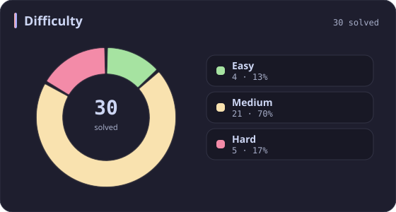
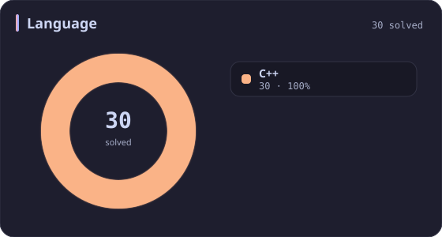
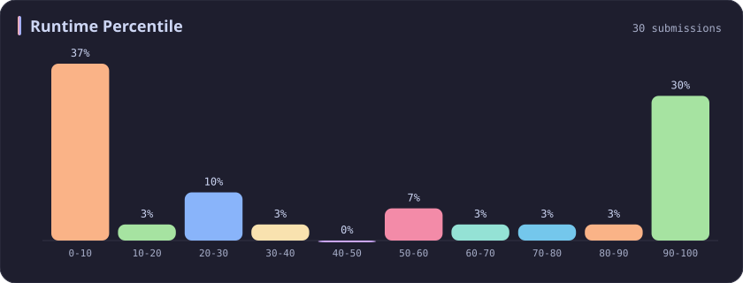
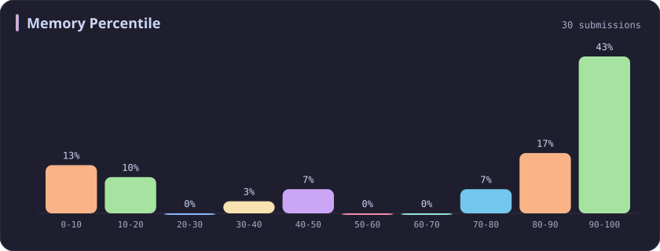
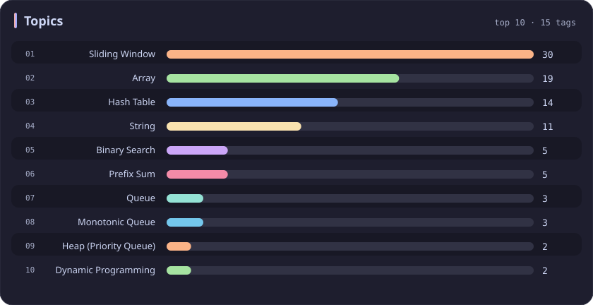

# Sliding Window Stats

[All stats](../../README.md)

**30** problems · updated `2026-09-05 03:36 UTC+8`

## Stats

### Difficulty

### Language

### Runtime Percentile

### Memory Percentile

### Topics

| Topic | # | Topic | # | Topic | # | Topic | # |
| :--- | ---: | :--- | ---: | :--- | ---: | :--- | ---: |
| [Array](array.md) | 387 | [Divide and Conquer](divide-and-conquer.md) | 16 | [Directed Acyclic Graph](directed-acyclic-graph.md) | 2 | [Range Minimum/Maximum Query](range-minimum-maximum-query.md) | 1 |
| [Hash Table](hash-table.md) | 168 | [Queue](queue.md) | 16 | [Quickselect](quickselect.md) | 2 | [Nim Game](nim-game.md) | 1 |
| [String](string.md) | 167 | [Trie](trie.md) | 11 | [Binary Lifting](binary-lifting.md) | 2 | [Impartial Game](impartial-game.md) | 1 |
| [Math](math.md) | 114 | [Binary Search Tree](binary-search-tree.md) | 11 | [Lowest Common Ancestor](lowest-common-ancestor.md) | 2 | [Binary Indexed Tree](binary-indexed-tree.md) | 1 |
| [Sorting](sorting.md) | 87 | [Monotonic Stack](monotonic-stack.md) | 10 | [Counting Sort](counting-sort.md) | 2 | [Sqrt Decomposition](sqrt-decomposition.md) | 1 |
| [Dynamic Programming](dynamic-programming.md) | 83 | [Number Theory](number-theory.md) | 10 | [Interactive](interactive.md) | 2 | [Complete Knapsack](complete-knapsack.md) | 1 |
| [Depth-First Search](depth-first-search.md) | 80 | [Ordered Set](ordered-set.md) | 8 | [Pigeonhole Principle](pigeonhole-principle.md) | 2 | [Reservoir Sampling](reservoir-sampling.md) | 1 |
| [Greedy](greedy.md) | 79 | [Combinatorics](combinatorics.md) | 7 | [Longest Increasing Subsequence](longest-increasing-subsequence.md) | 2 | [Bellman–Ford Algorithm](bellman-ford-algorithm.md) | 1 |
| [Two Pointers](two-pointers.md) | 70 | [Memoization](memoization.md) | 6 | [Segment Tree](segment-tree.md) | 2 | [Floyd–Warshall Algorithm](floyd-warshall-algorithm.md) | 1 |
| [Breadth-First Search](breadth-first-search.md) | 69 | [Data Stream](data-stream.md) | 6 | [Linear Algebra](linear-algebra.md) | 2 | [0-1 Knapsack](0-1-knapsack.md) | 1 |
| [Matrix](matrix.md) | 64 | [Shortest Path](shortest-path.md) | 6 | [Randomized](randomized.md) | 2 | [Aho–Corasick Algorithm](aho-corasick-algorithm.md) | 1 |
| [Binary Search](binary-search.md) | 63 | [Game Theory](game-theory.md) | 5 | [Heuristic Search](heuristic-search.md) | 2 | [Bidirectional Search](bidirectional-search.md) | 1 |
| [Tree](tree.md) | 60 | [Geometry](geometry.md) | 5 | [A* Search](a-search.md) | 2 | [Ternary Search](ternary-search.md) | 1 |
| [Binary Tree](binary-tree.md) | 50 | [Bracket Sequences](bracket-sequences.md) | 4 | [Hash Function](hash-function.md) | 2 | [Zero-Sum Game](zero-sum-game.md) | 1 |
| [Stack](stack.md) | 47 | [String Matching](string-matching.md) | 4 | [Greatest Common Divisor](greatest-common-divisor.md) | 2 | [Timsort](timsort.md) | 1 |
| [Prefix Sum](prefix-sum.md) | 46 | [Floyd's Cycle Finding Algorithm](floyd-s-cycle-finding-algorithm.md) | 4 | [Longest Common Subsequence](longest-common-subsequence.md) | 2 | [Radix Sort](radix-sort.md) | 1 |
| [Bit Manipulation](bit-manipulation.md) | 41 | [Topological Sort](topological-sort.md) | 4 | [Prime Factorization](prime-factorization.md) | 2 | [Triangulation](triangulation.md) | 1 |
| [Simulation](simulation.md) | 40 | [Monotonic Queue](monotonic-queue.md) | 4 | [Bitmask](bitmask.md) | 2 | [Euclidean Algorithm](euclidean-algorithm.md) | 1 |
| [Counting](counting.md) | 40 | [DP on Trees](dp-on-trees.md) | 4 | [Manacher](manacher.md) | 1 | [Minimum Spanning Tree](minimum-spanning-tree.md) | 1 |
| [Database](database.md) | 39 | [Brainteaser](brainteaser.md) | 4 | [Tournament Sort](tournament-sort.md) | 1 | [Doubly-Linked List](doubly-linked-list.md) | 1 |
| [Heap (Priority Queue)](heap-priority-queue.md) | 34 | [Polygons](polygons.md) | 4 | [Z Algorithm](z-algorithm.md) | 1 | [Least Common Multiple](least-common-multiple.md) | 1 |
| **Sliding Window** | **30** | [Merge Sort](merge-sort.md) | 3 | [Knuth–Morris–Pratt Algorithm](knuth-morris-pratt-algorithm.md) | 1 | [Fermat's Little Theorem](fermat-s-little-theorem.md) | 1 |
| [Linked List](linked-list.md) | 28 | [Algorithm X](algorithm-x.md) | 3 | [Boyer–Moore String-Search Algorithm](boyer-moore-string-search-algorithm.md) | 1 | [Kosaraju's Algorithm](kosaraju-s-algorithm.md) | 1 |
| [Graph Theory](graph-theory.md) | 27 | [Quicksort](quicksort.md) | 3 | [Dancing Links](dancing-links.md) | 1 | [Tarjan's SCC Algorithm](tarjan-s-scc-algorithm.md) | 1 |
| [Design](design.md) | 25 | [Minimax](minimax.md) | 3 | [Newton's Method](newton-s-method.md) | 1 | [Multiple Knapsack](multiple-knapsack.md) | 1 |
| [Recursion](recursion.md) | 21 | [Knapsack Problem](knapsack-problem.md) | 3 | [Bubble Sort](bubble-sort.md) | 1 | [Rolling Hash](rolling-hash.md) | 1 |
| [Backtracking](backtracking.md) | 18 | [Bucket Sort](bucket-sort.md) | 3 | [Primality Test](primality-test.md) | 1 |  |  |
| [Union-Find](union-find.md) | 17 | [Dijkstra's Algorithm](dijkstra-s-algorithm.md) | 3 | [Sieve Theory](sieve-theory.md) | 1 |  |  |
| [Enumeration](enumeration.md) | 17 | [Boyer–Moore Majority Vote Algorithm](boyer-moore-majority-vote-algorithm.md) | 2 | [Prime Number Sieve](prime-number-sieve.md) | 1 |  |  |

---

## Recent Activity

Latest **30** accepted submissions.

| Date | Title | Difficulty | Lang | Runtime | Memory |
| :--- | :--- | :---: | :---: | ---: | ---: |
| 2026&#8209;02&#8209;06 | [3634. Minimum Removals to Balance Array](https://leetcode.com/problems/minimum-removals-to-balance-array/) | Medium | C++ | 31 ms `62.90%` | 105 MB `86.33%` |
| 2025&#8209;09&#8209;27 | [3694. Distinct Points Reachable After Substring Removal](https://leetcode.com/problems/distinct-points-reachable-after-substring-removal/) | Medium | C++ | 130 ms `52.48%` | 53.5 MB `42.98%` |
| 2025&#8209;05&#8209;04 | [1100. Find K-Length Substrings With No Repeated Characters](https://leetcode.com/problems/find-k-length-substrings-with-no-repeated-characters/) | Medium | C++ | 0 ms `100.00%` | 9 MB `73.74%` |
| 2025&#8209;05&#8209;04 | [487. Max Consecutive Ones II](https://leetcode.com/problems/max-consecutive-ones-ii/) | Medium | C++ | 0 ms `100.00%` | 39.8 MB `87.01%` |
| 2025&#8209;05&#8209;04 | [340. Longest Substring with At Most K Distinct Characters](https://leetcode.com/problems/longest-substring-with-at-most-k-distinct-characters/) | Medium | C++ | 0 ms `100.00%` | 9.7 MB `78.62%` |
| 2025&#8209;05&#8209;04 | [159. Longest Substring with At Most Two Distinct Characters](https://leetcode.com/problems/longest-substring-with-at-most-two-distinct-characters/) | Medium | C++ | 3 ms `93.66%` | 12.1 MB `88.81%` |
| 2025&#8209;04&#8209;29 | [2962. Count Subarrays Where Max Element Appears at Least K Times](https://leetcode.com/problems/count-subarrays-where-max-element-appears-at-least-k-times/) | Medium | C++ | 0 ms `100.00%` | 121.5 MB `100.00%` |
| 2025&#8209;04&#8209;29 | [2302. Count Subarrays With Score Less Than K](https://leetcode.com/problems/count-subarrays-with-score-less-than-k/) | Hard | C++ | 0 ms `100.00%` | 99.1 MB `45.78%` |
| 2025&#8209;04&#8209;26 | [2444. Count Subarrays With Fixed Bounds](https://leetcode.com/problems/count-subarrays-with-fixed-bounds/) | Hard | C++ | 0 ms `100.00%` | 94 MB `36.87%` |
| 2025&#8209;04&#8209;24 | [2799. Count Complete Subarrays in an Array](https://leetcode.com/problems/count-complete-subarrays-in-an-array/) | Medium | C++ | 19 ms `70.43%` | 40.3 MB `95.38%` |
| 2025&#8209;04&#8209;20 | [1493. Longest Subarray of 1's After Deleting One Element](https://leetcode.com/problems/longest-subarray-of-1s-after-deleting-one-element/) | Medium | C++ | 4 ms `15.22%` | 62.3 MB `13.21%` |
| 2025&#8209;04&#8209;20 | [1004. Max Consecutive Ones III](https://leetcode.com/problems/max-consecutive-ones-iii/) | Medium | C++ | 11 ms `6.07%` | 65.6 MB `100.00%` |
| 2025&#8209;04&#8209;20 | [1456. Maximum Number of Vowels in a Substring of Given Length](https://leetcode.com/problems/maximum-number-of-vowels-in-a-substring-of-given-length/) | Medium | C++ | 3 ms `87.94%` | 13 MB `89.77%` |
| 2025&#8209;04&#8209;20 | [643. Maximum Average Subarray I](https://leetcode.com/problems/maximum-average-subarray-i/) | Easy | C++ | 0 ms `100.00%` | 113.7 MB `86.94%` |
| 2024&#8209;11&#8209;21 | [2516. Take K of Each Character From Left and Right](https://leetcode.com/problems/take-k-of-each-character-from-left-and-right/) | Medium | C++ | 21 ms `29.47%` | 11.9 MB `100.00%` |
| 2024&#8209;11&#8209;19 | [2461. Maximum Sum of Distinct Subarrays With Length K](https://leetcode.com/problems/maximum-sum-of-distinct-subarrays-with-length-k/) | Medium | C++ | 212 ms `8.96%` | 100.9 MB `13.48%` |
| 2024&#8209;11&#8209;19 | [1652. Defuse the Bomb](https://leetcode.com/problems/defuse-the-bomb/) | Easy | C++ | 0 ms `100.00%` | 10.7 MB `99.92%` |
| 2024&#8209;11&#8209;17 | [862. Shortest Subarray with Sum at Least K](https://leetcode.com/problems/shortest-subarray-with-sum-at-least-k/) | Hard | C++ | 50 ms `9.43%` | 112.6 MB `5.17%` |
| 2024&#8209;11&#8209;16 | [3254. Find the Power of K-Size Subarrays I](https://leetcode.com/problems/find-the-power-of-k-size-subarrays-i/) | Medium | C++ | 11 ms `5.84%` | 33.7 MB `100.00%` |
| 2024&#8209;11&#8209;10 | [3097. Shortest Subarray With OR at Least K II](https://leetcode.com/problems/shortest-subarray-with-or-at-least-k-ii/) | Medium | C++ | 51 ms `30.41%` | 88.3 MB `100.00%` |
| 2024&#8209;03&#8209;30 | [3095. Shortest Subarray With OR at Least K I](https://leetcode.com/problems/shortest-subarray-with-or-at-least-k-i/) | Easy | C++ | 4 ms `6.28%` | 26 MB `100.00%` |
| 2024&#8209;03&#8209;30 | [3090. Maximum Length Substring With Two Occurrences](https://leetcode.com/problems/maximum-length-substring-with-two-occurrences/) | Easy | C++ | 52 ms `5.17%` | 8 MB `100.00%` |
| 2024&#8209;03&#8209;30 | [992. Subarrays with K Different Integers](https://leetcode.com/problems/subarrays-with-k-different-integers/) | Hard | C++ | 1061 ms `5.69%` | 46.9 MB `95.70%` |
| 2024&#8209;03&#8209;28 | [2958. Length of Longest Subarray With at Most K Frequency](https://leetcode.com/problems/length-of-longest-subarray-with-at-most-k-frequency/) | Medium | C++ | 361 ms `5.11%` | 148.6 MB `99.25%` |
| 2024&#8209;03&#8209;27 | [713. Subarray Product Less Than K](https://leetcode.com/problems/subarray-product-less-than-k/) | Medium | C++ | 62 ms `9.64%` | 63.8 MB `5.29%` |
| 2023&#8209;03&#8209;25 | [438. Find All Anagrams in a String](https://leetcode.com/problems/find-all-anagrams-in-a-string/) | Medium | C++ | 64 ms `8.56%` | 37.9 MB `5.00%` |
| 2023&#8209;03&#8209;16 | [424. Longest Repeating Character Replacement](https://leetcode.com/problems/longest-repeating-character-replacement/) | Medium | C++ | 13 ms `20.45%` | 7.1 MB `100.00%` |
| 2023&#8209;03&#8209;13 | [567. Permutation in String](https://leetcode.com/problems/permutation-in-string/) | Medium | C++ | 42 ms `25.26%` | 30 MB `10.40%` |
| 2023&#8209;03&#8209;11 | [3. Longest Substring Without Repeating Characters](https://leetcode.com/problems/longest-substring-without-repeating-characters/) | Medium | C++ | 21 ms `51.68%` | 8.6 MB `100.00%` |
| 2023&#8209;02&#8209;23 | [239. Sliding Window Maximum](https://leetcode.com/problems/sliding-window-maximum/) | Hard | C++ | 998 ms `5.17%` | 191.6 MB `5.71%` |
