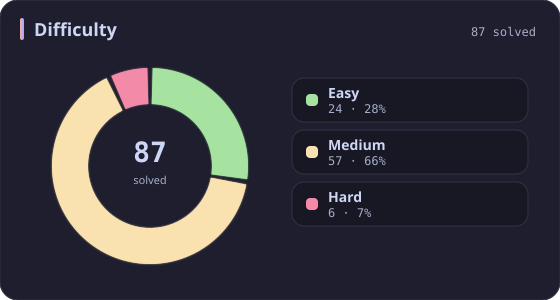
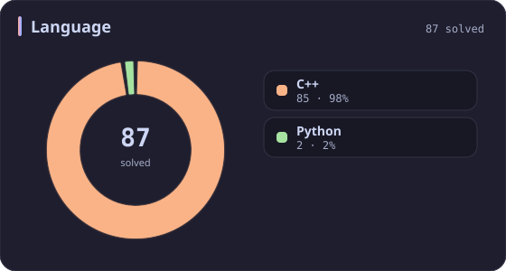
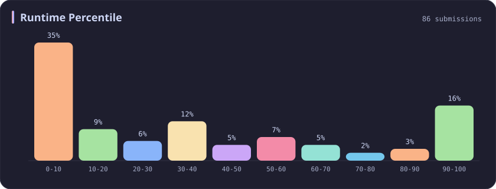
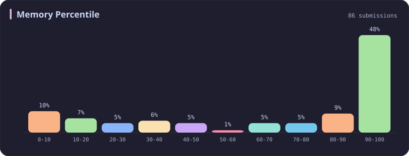
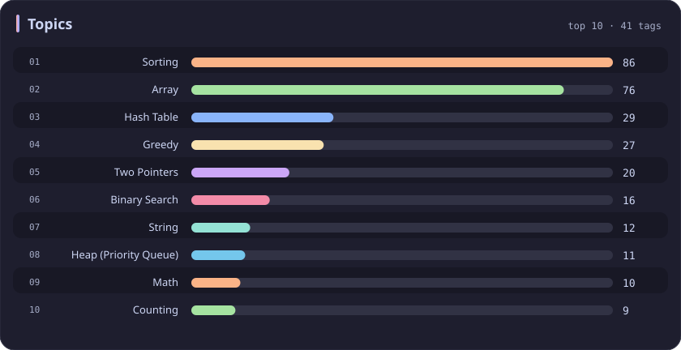

# Sorting Stats

[All stats](../../README.md)

**86** problems · updated `2026-09-04 19:14 UTC`

## Stats

### Difficulty

### Language

### Runtime Percentile

### Memory Percentile

### Topics

| Topic | # | Topic | # | Topic | # | Topic | # |
| :--- | ---: | :--- | ---: | :--- | ---: | :--- | ---: |
| [Array](array.md) | 386 | [Divide and Conquer](divide-and-conquer.md) | 16 | [Directed Acyclic Graph](directed-acyclic-graph.md) | 2 | [Range Minimum/Maximum Query](range-minimum-maximum-query.md) | 1 |
| [Hash Table](hash-table.md) | 168 | [Queue](queue.md) | 16 | [Quickselect](quickselect.md) | 2 | [Nim Game](nim-game.md) | 1 |
| [String](string.md) | 167 | [Trie](trie.md) | 11 | [Binary Lifting](binary-lifting.md) | 2 | [Impartial Game](impartial-game.md) | 1 |
| [Math](math.md) | 114 | [Binary Search Tree](binary-search-tree.md) | 11 | [Lowest Common Ancestor](lowest-common-ancestor.md) | 2 | [Binary Indexed Tree](binary-indexed-tree.md) | 1 |
| **Sorting** | **86** | [Monotonic Stack](monotonic-stack.md) | 10 | [Counting Sort](counting-sort.md) | 2 | [Sqrt Decomposition](sqrt-decomposition.md) | 1 |
| [Dynamic Programming](dynamic-programming.md) | 83 | [Number Theory](number-theory.md) | 10 | [Interactive](interactive.md) | 2 | [Complete Knapsack](complete-knapsack.md) | 1 |
| [Depth-First Search](depth-first-search.md) | 80 | [Ordered Set](ordered-set.md) | 8 | [Pigeonhole Principle](pigeonhole-principle.md) | 2 | [Reservoir Sampling](reservoir-sampling.md) | 1 |
| [Greedy](greedy.md) | 79 | [Combinatorics](combinatorics.md) | 7 | [Longest Increasing Subsequence](longest-increasing-subsequence.md) | 2 | [Bellman–Ford Algorithm](bellman-ford-algorithm.md) | 1 |
| [Two Pointers](two-pointers.md) | 70 | [Memoization](memoization.md) | 6 | [Segment Tree](segment-tree.md) | 2 | [Floyd–Warshall Algorithm](floyd-warshall-algorithm.md) | 1 |
| [Breadth-First Search](breadth-first-search.md) | 69 | [Data Stream](data-stream.md) | 6 | [Linear Algebra](linear-algebra.md) | 2 | [0-1 Knapsack](0-1-knapsack.md) | 1 |
| [Matrix](matrix.md) | 64 | [Shortest Path](shortest-path.md) | 6 | [Randomized](randomized.md) | 2 | [Aho–Corasick Algorithm](aho-corasick-algorithm.md) | 1 |
| [Binary Search](binary-search.md) | 63 | [Game Theory](game-theory.md) | 5 | [Heuristic Search](heuristic-search.md) | 2 | [Bidirectional Search](bidirectional-search.md) | 1 |
| [Tree](tree.md) | 60 | [Geometry](geometry.md) | 5 | [A* Search](a-search.md) | 2 | [Ternary Search](ternary-search.md) | 1 |
| [Binary Tree](binary-tree.md) | 50 | [Bracket Sequences](bracket-sequences.md) | 4 | [Hash Function](hash-function.md) | 2 | [Zero-Sum Game](zero-sum-game.md) | 1 |
| [Stack](stack.md) | 47 | [String Matching](string-matching.md) | 4 | [Greatest Common Divisor](greatest-common-divisor.md) | 2 | [Timsort](timsort.md) | 1 |
| [Prefix Sum](prefix-sum.md) | 46 | [Floyd's Cycle Finding Algorithm](floyd-s-cycle-finding-algorithm.md) | 4 | [Longest Common Subsequence](longest-common-subsequence.md) | 2 | [Radix Sort](radix-sort.md) | 1 |
| [Bit Manipulation](bit-manipulation.md) | 41 | [Topological Sort](topological-sort.md) | 4 | [Prime Factorization](prime-factorization.md) | 2 | [Triangulation](triangulation.md) | 1 |
| [Simulation](simulation.md) | 40 | [Monotonic Queue](monotonic-queue.md) | 4 | [Bitmask](bitmask.md) | 2 | [Euclidean Algorithm](euclidean-algorithm.md) | 1 |
| [Counting](counting.md) | 40 | [DP on Trees](dp-on-trees.md) | 4 | [Manacher](manacher.md) | 1 | [Minimum Spanning Tree](minimum-spanning-tree.md) | 1 |
| [Database](database.md) | 39 | [Brainteaser](brainteaser.md) | 4 | [Tournament Sort](tournament-sort.md) | 1 | [Doubly-Linked List](doubly-linked-list.md) | 1 |
| [Heap (Priority Queue)](heap-priority-queue.md) | 33 | [Polygons](polygons.md) | 4 | [Z Algorithm](z-algorithm.md) | 1 | [Least Common Multiple](least-common-multiple.md) | 1 |
| [Sliding Window](sliding-window.md) | 30 | [Merge Sort](merge-sort.md) | 3 | [Knuth–Morris–Pratt Algorithm](knuth-morris-pratt-algorithm.md) | 1 | [Fermat's Little Theorem](fermat-s-little-theorem.md) | 1 |
| [Linked List](linked-list.md) | 28 | [Algorithm X](algorithm-x.md) | 3 | [Boyer–Moore String-Search Algorithm](boyer-moore-string-search-algorithm.md) | 1 | [Kosaraju's Algorithm](kosaraju-s-algorithm.md) | 1 |
| [Graph Theory](graph-theory.md) | 27 | [Quicksort](quicksort.md) | 3 | [Dancing Links](dancing-links.md) | 1 | [Tarjan's SCC Algorithm](tarjan-s-scc-algorithm.md) | 1 |
| [Design](design.md) | 25 | [Minimax](minimax.md) | 3 | [Newton's Method](newton-s-method.md) | 1 | [Multiple Knapsack](multiple-knapsack.md) | 1 |
| [Recursion](recursion.md) | 21 | [Knapsack Problem](knapsack-problem.md) | 3 | [Bubble Sort](bubble-sort.md) | 1 | [Rolling Hash](rolling-hash.md) | 1 |
| [Backtracking](backtracking.md) | 18 | [Bucket Sort](bucket-sort.md) | 3 | [Primality Test](primality-test.md) | 1 |  |  |
| [Union-Find](union-find.md) | 17 | [Dijkstra's Algorithm](dijkstra-s-algorithm.md) | 3 | [Sieve Theory](sieve-theory.md) | 1 |  |  |
| [Enumeration](enumeration.md) | 17 | [Boyer–Moore Majority Vote Algorithm](boyer-moore-majority-vote-algorithm.md) | 2 | [Prime Number Sieve](prime-number-sieve.md) | 1 |  |  |

---

## Recent Activity

Latest **86** accepted submissions.

| Date | Title | Difficulty | Lang | Runtime | Memory |
| :--- | :--- | :---: | :---: | ---: | ---: |
| 2026&#8209;06&#8209;06 | [3951. Minimum Energy to Maintain Brightness](https://leetcode.com/problems/minimum-energy-to-maintain-brightness/) | Medium | C++ | 74 ms `83.55%` | 203.6 MB `61.06%` |
| 2026&#8209;02&#8209;06 | [3634. Minimum Removals to Balance Array](https://leetcode.com/problems/minimum-removals-to-balance-array/) | Medium | C++ | 31 ms `62.90%` | 105 MB `86.33%` |
| 2025&#8209;10&#8209;13 | [2273. Find Resultant Array After Removing Anagrams](https://leetcode.com/problems/find-resultant-array-after-removing-anagrams/) | Easy | C++ | 3 ms `45.53%` | 17.9 MB `24.76%` |
| 2025&#8209;10&#8209;11 | [3186. Maximum Total Damage With Spell Casting](https://leetcode.com/problems/maximum-total-damage-with-spell-casting/) | Medium | C++ | 111 ms `86.08%` | 162.8 MB `90.83%` |
| 2025&#8209;10&#8209;08 | [2300. Successful Pairs of Spells and Potions](https://leetcode.com/problems/successful-pairs-of-spells-and-potions/) | Medium | C++ | 47 ms `42.48%` | 138.4 MB `8.28%` |
| 2025&#8209;09&#8209;28 | [976. Largest Perimeter Triangle](https://leetcode.com/problems/largest-perimeter-triangle/) | Easy | C++ | 12 ms `25.68%` | 25.6 MB `79.00%` |
| 2025&#8209;09&#8209;27 | [3695. Maximize Alternating Sum Using Swaps](https://leetcode.com/problems/maximize-alternating-sum-using-swaps/) | Hard | C++ | 294 ms `56.92%` | 341.9 MB `32.45%` |
| 2025&#8209;09&#8209;26 | [1152. Analyze User Website Visit Pattern](https://leetcode.com/problems/analyze-user-website-visit-pattern/) | Medium | C++ | 55 ms `19.05%` | 26.6 MB `42.86%` |
| 2025&#8209;09&#8209;26 | [611. Valid Triangle Number](https://leetcode.com/problems/valid-triangle-number/) | Medium | C++ | 430 ms `8.62%` | 16.8 MB `10.43%` |
| 2025&#8209;09&#8209;11 | [2785. Sort Vowels in a String](https://leetcode.com/problems/sort-vowels-in-a-string/) | Medium | C++ | 19 ms `35.89%` | 20.6 MB `5.76%` |
| 2025&#8209;09&#8209;10 | [1133. Largest Unique Number](https://leetcode.com/problems/largest-unique-number/) | Easy | C++ | 0 ms `100.00%` | 12.2 MB `95.53%` |
| 2025&#8209;09&#8209;03 | [3027. Find the Number of Ways to Place People II](https://leetcode.com/problems/find-the-number-of-ways-to-place-people-ii/) | Hard | C++ | 221 ms `15.38%` | 47.6 MB `5.77%` |
| 2025&#8209;09&#8209;02 | [3025. Find the Number of Ways to Place People I](https://leetcode.com/problems/find-the-number-of-ways-to-place-people-i/) | Medium | C++ | 19 ms `25.00%` | 32.7 MB `28.24%` |
| 2025&#8209;08&#8209;28 | [3446. Sort Matrix by Diagonals](https://leetcode.com/problems/sort-matrix-by-diagonals/) | Medium | C++ | 4 ms `84.97%` | 43.3 MB `86.76%` |
| 2025&#8209;08&#8209;27 | [1181. Before and After Puzzle](https://leetcode.com/problems/before-and-after-puzzle/) | Medium | Python | 15 ms `5.56%` | 18.2 MB `100.00%` |
| 2025&#8209;06&#8209;19 | [2294. Partition Array Such That Maximum Difference Is K](https://leetcode.com/problems/partition-array-such-that-maximum-difference-is-k/) | Medium | C++ | 35 ms `76.66%` | 87 MB `100.00%` |
| 2025&#8209;06&#8209;18 | [2966. Divide Array Into Arrays With Max Difference](https://leetcode.com/problems/divide-array-into-arrays-with-max-difference/) | Medium | C++ | 115 ms `13.42%` | 126.1 MB `18.08%` |
| 2025&#8209;06&#8209;13 | [2616. Minimize the Maximum Difference of Pairs](https://leetcode.com/problems/minimize-the-maximum-difference-of-pairs/) | Medium | C++ | 30 ms `30.34%` | 86.8 MB `50.70%` |
| 2025&#8209;05&#8209;29 | [3068. Find the Maximum Sum of Node Values](https://leetcode.com/problems/find-the-maximum-sum-of-node-values/) | Hard | C++ | 111 ms `11.83%` | 158 MB `11.26%` |
| 2025&#8209;05&#8209;24 | [3556. Sum of Largest Prime Substrings](https://leetcode.com/problems/sum-of-largest-prime-substrings/) | Medium | C++ | 15 ms `51.49%` | 10.8 MB `60.40%` |
| 2025&#8209;05&#8209;22 | [3362. Zero Array Transformation III](https://leetcode.com/problems/zero-array-transformation-iii/) | Medium | C++ | 128 ms `50.88%` | 224.5 MB `38.16%` |
| 2025&#8209;05&#8209;19 | [3024. Type of Triangle](https://leetcode.com/problems/type-of-triangle/) | Easy | C++ | 0 ms `100.00%` | 22.8 MB `92.33%` |
| 2025&#8209;05&#8209;17 | [75. Sort Colors](https://leetcode.com/problems/sort-colors/) | Medium | C++ | 0 ms `100.00%` | 11.7 MB `11.44%` |
| 2025&#8209;05&#8209;12 | [2094. Finding 3-Digit Even Numbers](https://leetcode.com/problems/finding-3-digit-even-numbers/) | Easy | C++ | 0 ms `100.00%` | 12.5 MB `82.00%` |
| 2025&#8209;05&#8209;11 | [3545. Minimum Deletions for At Most K Distinct Characters](https://leetcode.com/problems/minimum-deletions-for-at-most-k-distinct-characters/) | Easy | C++ | 3 ms `41.64%` | 9 MB `89.15%` |
| 2025&#8209;05&#8209;04 | [253. Meeting Rooms II](https://leetcode.com/problems/meeting-rooms-ii/) | Medium | C++ | 0 ms `100.00%` | 15.9 MB `99.80%` |
| 2025&#8209;05&#8209;04 | [252. Meeting Rooms](https://leetcode.com/problems/meeting-rooms/) | Easy | C++ | 3 ms `39.58%` | 15.9 MB `79.28%` |
| 2025&#8209;05&#8209;04 | [3536. Maximum Product of Two Digits](https://leetcode.com/problems/maximum-product-of-two-digits/) | Easy | C++ | 3 ms `10.81%` | 8.9 MB `31.83%` |
| 2025&#8209;05&#8209;01 | [2071. Maximum Number of Tasks You Can Assign](https://leetcode.com/problems/maximum-number-of-tasks-you-can-assign/) | Hard | C++ | 714 ms `60.06%` | 286.3 MB `39.93%` |
| 2025&#8209;04&#8209;27 | [3531. Count Covered Buildings](https://leetcode.com/problems/count-covered-buildings/) | Medium | C++ | 894 ms `10.51%` | 451.1 MB `10.05%` |
| 2025&#8209;04&#8209;25 | [280. Wiggle Sort](https://leetcode.com/problems/wiggle-sort/) | Medium | C++ | 0 ms `100.00%` | 17.7 MB `79.14%` |
| 2025&#8209;04&#8209;24 | [274. H-Index](https://leetcode.com/problems/h-index/) | Medium | C++ | 0 ms `100.00%` | 12.3 MB `35.12%` |
| 2025&#8209;04&#8209;24 | [169. Majority Element](https://leetcode.com/problems/majority-element/) | Easy | C++ | 0 ms `100.00%` | 28.1 MB `95.18%` |
| 2025&#8209;04&#8209;24 | [88. Merge Sorted Array](https://leetcode.com/problems/merge-sorted-array/) | Easy | C++ | 0 ms `100.00%` | 12.4 MB `82.77%` |
| 2025&#8209;04&#8209;24 | [452. Minimum Number of Arrows to Burst Balloons](https://leetcode.com/problems/minimum-number-of-arrows-to-burst-balloons/) | Medium | C++ | 44 ms `72.58%` | 93.7 MB `99.85%` |
| 2025&#8209;04&#8209;24 | [435. Non-overlapping Intervals](https://leetcode.com/problems/non-overlapping-intervals/) | Medium | C++ | 47 ms `52.82%` | 93.8 MB `90.88%` |
| 2025&#8209;04&#8209;24 | [1268. Search Suggestions System](https://leetcode.com/problems/search-suggestions-system/) | Medium | C++ | 31 ms `64.68%` | 44 MB `62.90%` |
| 2025&#8209;04&#8209;23 | [2542. Maximum Subsequence Score](https://leetcode.com/problems/maximum-subsequence-score/) | Medium | C++ | 75 ms `30.92%` | 99.3 MB `27.05%` |
| 2025&#8209;04&#8209;21 | [215. Kth Largest Element in an Array](https://leetcode.com/problems/kth-largest-element-in-an-array/) | Medium | C++ | 38 ms `47.95%` | 64.7 MB `100.00%` |
| 2025&#8209;04&#8209;19 | [1657. Determine if Two Strings Are Close](https://leetcode.com/problems/determine-if-two-strings-are-close/) | Medium | C++ | 27 ms `35.74%` | 23.6 MB `49.60%` |
| 2025&#8209;04&#8209;19 | [1679. Max Number of K-Sum Pairs](https://leetcode.com/problems/max-number-of-k-sum-pairs/) | Medium | C++ | 106 ms `31.48%` | 72 MB `23.30%` |
| 2025&#8209;04&#8209;19 | [2563. Count the Number of Fair Pairs](https://leetcode.com/problems/count-the-number-of-fair-pairs/) | Medium | C++ | 61 ms `59.74%` | 60.3 MB `100.00%` |
| 2024&#8209;11&#8209;12 | [2070. Most Beautiful Item for Each Query](https://leetcode.com/problems/most-beautiful-item-for-each-query/) | Medium | C++ | 35 ms `96.42%` | 92.3 MB `86.68%` |
| 2024&#8209;11&#8209;06 | [3011. Find if Array Can Be Sorted](https://leetcode.com/problems/find-if-array-can-be-sorted/) | Medium | C++ | 0 ms `100.00%` | 31.4 MB `100.00%` |
| 2024&#8209;10&#8209;28 | [2501. Longest Square Streak in an Array](https://leetcode.com/problems/longest-square-streak-in-an-array/) | Medium | C++ | 115 ms `34.23%` | 86.3 MB `98.21%` |
| 2024&#8209;10&#8209;22 | [2583. Kth Largest Sum in a Binary Tree](https://leetcode.com/problems/kth-largest-sum-in-a-binary-tree/) | Medium | C++ | 34 ms `58.53%` | 167 MB `100.00%` |
| 2024&#8209;10&#8209;20 | [846. Hand of Straights](https://leetcode.com/problems/hand-of-straights/) | Medium | C++ | 57 ms `7.27%` | 32.2 MB `63.49%` |
| 2024&#8209;04&#8209;11 | [950. Reveal Cards In Increasing Order](https://leetcode.com/problems/reveal-cards-in-increasing-order/) | Medium | C++ | 0 ms `100.00%` | 11.5 MB `100.00%` |
| 2024&#8209;03&#8209;25 | [442. Find All Duplicates in an Array](https://leetcode.com/problems/find-all-duplicates-in-an-array/) | Medium | C++ | 33 ms `32.10%` | 36 MB `100.00%` |
| 2024&#8209;03&#8209;24 | [645. Set Mismatch](https://leetcode.com/problems/set-mismatch/) | Easy | C++ | 69 ms `8.82%` | 35.3 MB `6.03%` |
| 2024&#8209;03&#8209;23 | [148. Sort List](https://leetcode.com/problems/sort-list/) | Medium | C++ | 124 ms `5.01%` | 58.8 MB `49.20%` |
| 2024&#8209;03&#8209;23 | [18. 4Sum](https://leetcode.com/problems/4sum/) | Medium | C++ | 336 ms `5.01%` | 81.5 MB `5.13%` |
| 2024&#8209;03&#8209;23 | [16. 3Sum Closest](https://leetcode.com/problems/3sum-closest/) | Medium | C++ | 18 ms `14.57%` | 12.9 MB `100.00%` |
| 2023&#8209;10&#8209;05 | [229. Majority Element II](https://leetcode.com/problems/majority-element-ii/) | Medium | C++ | 8 ms `29.21%` | 16.3 MB `100.00%` |
| 2023&#8209;04&#8209;03 | [881. Boats to Save People](https://leetcode.com/problems/boats-to-save-people/) | Medium | C++ | 246 ms `5.78%` | 70.4 MB `5.29%` |
| 2023&#8209;04&#8209;02 | [2611. Mice and Cheese](https://leetcode.com/problems/mice-and-cheese/) | Medium | C++ | 217 ms `5.13%` | 110.2 MB `81.62%` |
| 2023&#8209;04&#8209;01 | [2607. Make K-Subarray Sums Equal](https://leetcode.com/problems/make-k-subarray-sums-equal/) | Medium | C++ | 203 ms `5.81%` | 112.6 MB `90.70%` |
| 2023&#8209;03&#8209;29 | [1402. Reducing Dishes](https://leetcode.com/problems/reducing-dishes/) | Hard | C++ | 24 ms `22.97%` | 8.2 MB `100.00%` |
| 2023&#8209;03&#8209;26 | [2602. Minimum Operations to Make All Array Elements Equal](https://leetcode.com/problems/minimum-operations-to-make-all-array-elements-equal/) | Medium | C++ | 270 ms `5.04%` | 84.5 MB `78.02%` |
| 2023&#8209;03&#8209;25 | [15. 3Sum](https://leetcode.com/problems/3sum/) | Medium | C++ | 2275 ms `5.02%` | 305.4 MB `5.21%` |
| 2023&#8209;03&#8209;25 | [49. Group Anagrams](https://leetcode.com/problems/group-anagrams/) | Medium | Python | 110 ms `5.00%` | 19.1 MB `100.00%` |
| 2023&#8209;03&#8209;21 | [349. Intersection of Two Arrays](https://leetcode.com/problems/intersection-of-two-arrays/) | Easy | C++ | 3 ms `38.14%` | 11.2 MB `100.00%` |
| 2023&#8209;03&#8209;21 | [350. Intersection of Two Arrays II](https://leetcode.com/problems/intersection-of-two-arrays-ii/) | Easy | C++ | 15 ms `5.21%` | 11.2 MB `100.00%` |
| 2023&#8209;03&#8209;19 | [242. Valid Anagram](https://leetcode.com/problems/valid-anagram/) | Easy | C++ | 4 ms `33.94%` | 7.4 MB `100.00%` |
| 2023&#8209;03&#8209;19 | [2597. The Number of Beautiful Subsets](https://leetcode.com/problems/the-number-of-beautiful-subsets/) | Medium | C++ | 801 ms `28.10%` | 34 MB `100.00%` |
| 2023&#8209;03&#8209;18 | [2593. Find Score of an Array After Marking All Elements](https://leetcode.com/problems/find-score-of-an-array-after-marking-all-elements/) | Medium | C++ | 379 ms `7.82%` | 102.9 MB `87.24%` |
| 2023&#8209;03&#8209;18 | [2592. Maximize Greatness of an Array](https://leetcode.com/problems/maximize-greatness-of-an-array/) | Medium | C++ | 244 ms `5.29%` | 96.7 MB `16.04%` |
| 2023&#8209;03&#8209;17 | [692. Top K Frequent Words](https://leetcode.com/problems/top-k-frequent-words/) | Medium | C++ | 13 ms `5.43%` | 12.6 MB `100.00%` |
| 2023&#8209;03&#8209;15 | [217. Contains Duplicate](https://leetcode.com/problems/contains-duplicate/) | Easy | C++ | 201 ms `5.30%` | 70.8 MB `100.00%` |
| 2023&#8209;03&#8209;12 | [2587. Rearrange Array to Maximize Prefix Score](https://leetcode.com/problems/rearrange-array-to-maximize-prefix-score/) | Medium | C++ | 158 ms `5.18%` | 90.1 MB `47.79%` |
| 2023&#8209;03&#8209;10 | [977. Squares of a Sorted Array](https://leetcode.com/problems/squares-of-a-sorted-array/) | Easy | C++ | 44 ms `6.33%` | 26.8 MB `99.97%` |
| 2023&#8209;03&#8209;10 | [1356. Sort Integers by The Number of 1 Bits](https://leetcode.com/problems/sort-integers-by-the-number-of-1-bits/) | Easy | C++ | 10 ms `10.81%` | 10 MB `100.00%` |
| 2023&#8209;03&#8209;10 | [389. Find the Difference](https://leetcode.com/problems/find-the-difference/) | Easy | C++ | 4 ms `3.98%` | 6.7 MB `100.00%` |
| 2023&#8209;03&#8209;10 | [1502. Can Make Arithmetic Progression From Sequence](https://leetcode.com/problems/can-make-arithmetic-progression-from-sequence/) | Easy | C++ | 6 ms `1.83%` | 9.1 MB `100.00%` |
| 2023&#8209;03&#8209;09 | [1491. Average Salary Excluding the Minimum and Maximum Salary](https://leetcode.com/problems/average-salary-excluding-the-minimum-and-maximum-salary/) | Easy | C++ | 0 ms `100.00%` | 7.1 MB `100.00%` |
| 2023&#8209;03&#8209;04 | [2580. Count Ways to Group Overlapping Ranges](https://leetcode.com/problems/count-ways-to-group-overlapping-ranges/) | Medium | C++ | 339 ms `5.32%` | 72.7 MB `100.00%` |
| 2023&#8209;03&#8209;04 | [2578. Split With Minimum Sum](https://leetcode.com/problems/split-with-minimum-sum/) | Easy | C++ | 0 ms `100.00%` | 5.9 MB `100.00%` |
| 2023&#8209;03&#8209;03 | [2089. Find Target Indices After Sorting Array](https://leetcode.com/problems/find-target-indices-after-sorting-array/) | Easy | C++ | 3 ms `9.91%` | 11.5 MB `100.00%` |
| 2023&#8209;03&#8209;01 | [912. Sort an Array](https://leetcode.com/problems/sort-an-array/) | Medium | C++ | 123 ms `68.89%` | 61.3 MB `100.00%` |
| 2023&#8209;02&#8209;27 | [1481. Least Number of Unique Integers after K Removals](https://leetcode.com/problems/least-number-of-unique-integers-after-k-removals/) | Medium | C++ | 252 ms `5.05%` | 64.2 MB `96.17%` |
| 2023&#8209;02&#8209;26 | [2576. Find the Maximum Number of Marked Indices](https://leetcode.com/problems/find-the-maximum-number-of-marked-indices/) | Medium | C++ | 374 ms `5.81%` | 100.2 MB `5.16%` |
| 2023&#8209;02&#8209;23 | [502. IPO](https://leetcode.com/problems/ipo/) | Hard | C++ | 232 ms `5.04%` | 78.1 MB `100.00%` |
| 2023&#8209;02&#8209;18 | [2567. Minimum Score by Changing Two Elements](https://leetcode.com/problems/minimum-score-by-changing-two-elements/) | Medium | C++ | 104 ms `7.44%` | 34.2 MB `100.00%` |
| 2023&#8209;02&#8209;17 | [347. Top K Frequent Elements](https://leetcode.com/problems/top-k-frequent-elements/) | Medium | C++ | 23 ms `8.42%` | 14.2 MB `100.00%` |
| 2023&#8209;02&#8209;17 | [2545. Sort the Students by Their Kth Score](https://leetcode.com/problems/sort-the-students-by-their-kth-score/) | Medium | C++ | 80 ms `5.17%` | 55.9 MB `5.27%` |
| 2023&#8209;02&#8209;17 | [268. Missing Number](https://leetcode.com/problems/missing-number/) | Easy | C++ | 18 ms `9.47%` | 17.9 MB `99.97%` |
