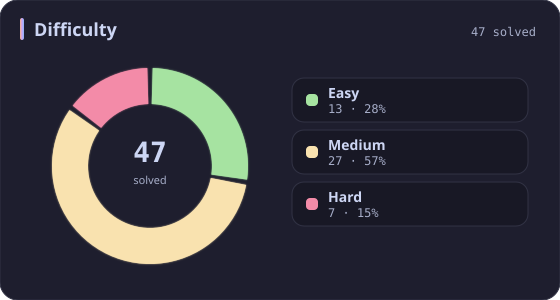
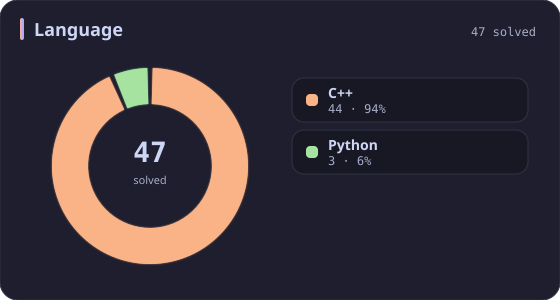
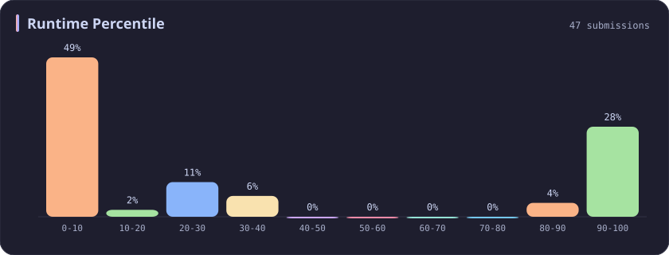
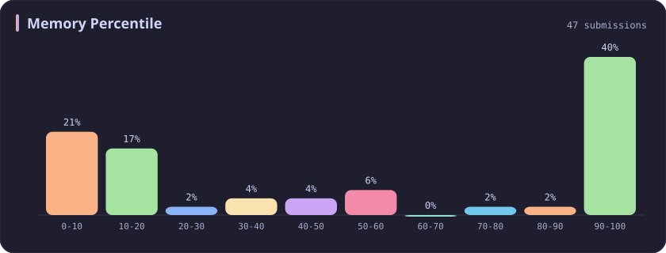
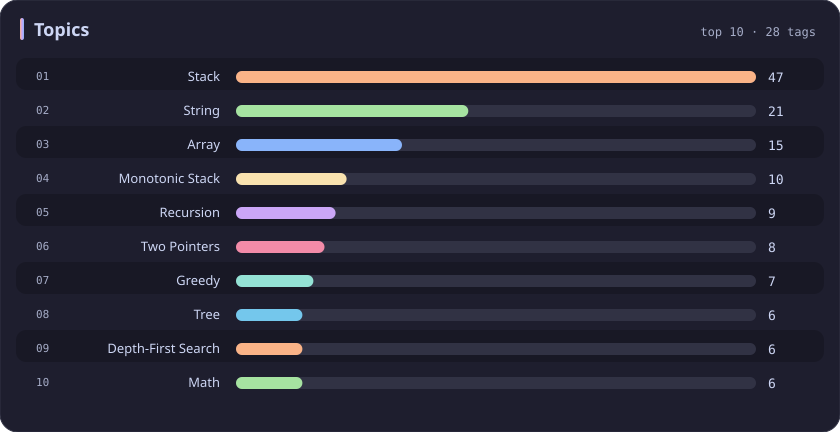

# Stack Stats

[All stats](../../README.md)

**47** problems · updated `2026-09-04 19:10 UTC`

## Stats

### Difficulty

### Language

### Runtime Percentile

### Memory Percentile

### Topics

| Topic | # | Topic | # | Topic | # | Topic | # |
| :--- | ---: | :--- | ---: | :--- | ---: | :--- | ---: |
| [Array](array.md) | 386 | [Divide and Conquer](divide-and-conquer.md) | 16 | [Directed Acyclic Graph](directed-acyclic-graph.md) | 2 | [Range Minimum/Maximum Query](range-minimum-maximum-query.md) | 1 |
| [Hash Table](hash-table.md) | 168 | [Queue](queue.md) | 16 | [Quickselect](quickselect.md) | 2 | [Nim Game](nim-game.md) | 1 |
| [String](string.md) | 167 | [Trie](trie.md) | 11 | [Binary Lifting](binary-lifting.md) | 2 | [Impartial Game](impartial-game.md) | 1 |
| [Math](math.md) | 114 | [Binary Search Tree](binary-search-tree.md) | 11 | [Lowest Common Ancestor](lowest-common-ancestor.md) | 2 | [Binary Indexed Tree](binary-indexed-tree.md) | 1 |
| [Sorting](sorting.md) | 86 | [Monotonic Stack](monotonic-stack.md) | 10 | [Counting Sort](counting-sort.md) | 2 | [Sqrt Decomposition](sqrt-decomposition.md) | 1 |
| [Dynamic Programming](dynamic-programming.md) | 83 | [Number Theory](number-theory.md) | 10 | [Interactive](interactive.md) | 2 | [Complete Knapsack](complete-knapsack.md) | 1 |
| [Depth-First Search](depth-first-search.md) | 80 | [Ordered Set](ordered-set.md) | 8 | [Pigeonhole Principle](pigeonhole-principle.md) | 2 | [Reservoir Sampling](reservoir-sampling.md) | 1 |
| [Greedy](greedy.md) | 79 | [Combinatorics](combinatorics.md) | 7 | [Longest Increasing Subsequence](longest-increasing-subsequence.md) | 2 | [Bellman–Ford Algorithm](bellman-ford-algorithm.md) | 1 |
| [Two Pointers](two-pointers.md) | 70 | [Memoization](memoization.md) | 6 | [Segment Tree](segment-tree.md) | 2 | [Floyd–Warshall Algorithm](floyd-warshall-algorithm.md) | 1 |
| [Breadth-First Search](breadth-first-search.md) | 69 | [Data Stream](data-stream.md) | 6 | [Linear Algebra](linear-algebra.md) | 2 | [0-1 Knapsack](0-1-knapsack.md) | 1 |
| [Matrix](matrix.md) | 64 | [Shortest Path](shortest-path.md) | 6 | [Randomized](randomized.md) | 2 | [Aho–Corasick Algorithm](aho-corasick-algorithm.md) | 1 |
| [Binary Search](binary-search.md) | 63 | [Game Theory](game-theory.md) | 5 | [Heuristic Search](heuristic-search.md) | 2 | [Bidirectional Search](bidirectional-search.md) | 1 |
| [Tree](tree.md) | 60 | [Geometry](geometry.md) | 5 | [A* Search](a-search.md) | 2 | [Ternary Search](ternary-search.md) | 1 |
| [Binary Tree](binary-tree.md) | 50 | [Bracket Sequences](bracket-sequences.md) | 4 | [Hash Function](hash-function.md) | 2 | [Zero-Sum Game](zero-sum-game.md) | 1 |
| **Stack** | **47** | [String Matching](string-matching.md) | 4 | [Greatest Common Divisor](greatest-common-divisor.md) | 2 | [Timsort](timsort.md) | 1 |
| [Prefix Sum](prefix-sum.md) | 46 | [Floyd's Cycle Finding Algorithm](floyd-s-cycle-finding-algorithm.md) | 4 | [Longest Common Subsequence](longest-common-subsequence.md) | 2 | [Radix Sort](radix-sort.md) | 1 |
| [Bit Manipulation](bit-manipulation.md) | 41 | [Topological Sort](topological-sort.md) | 4 | [Prime Factorization](prime-factorization.md) | 2 | [Triangulation](triangulation.md) | 1 |
| [Simulation](simulation.md) | 40 | [Monotonic Queue](monotonic-queue.md) | 4 | [Bitmask](bitmask.md) | 2 | [Euclidean Algorithm](euclidean-algorithm.md) | 1 |
| [Counting](counting.md) | 40 | [DP on Trees](dp-on-trees.md) | 4 | [Manacher](manacher.md) | 1 | [Minimum Spanning Tree](minimum-spanning-tree.md) | 1 |
| [Database](database.md) | 39 | [Brainteaser](brainteaser.md) | 4 | [Tournament Sort](tournament-sort.md) | 1 | [Doubly-Linked List](doubly-linked-list.md) | 1 |
| [Heap (Priority Queue)](heap-priority-queue.md) | 33 | [Polygons](polygons.md) | 4 | [Z Algorithm](z-algorithm.md) | 1 | [Least Common Multiple](least-common-multiple.md) | 1 |
| [Sliding Window](sliding-window.md) | 30 | [Merge Sort](merge-sort.md) | 3 | [Knuth–Morris–Pratt Algorithm](knuth-morris-pratt-algorithm.md) | 1 | [Fermat's Little Theorem](fermat-s-little-theorem.md) | 1 |
| [Linked List](linked-list.md) | 28 | [Algorithm X](algorithm-x.md) | 3 | [Boyer–Moore String-Search Algorithm](boyer-moore-string-search-algorithm.md) | 1 | [Kosaraju's Algorithm](kosaraju-s-algorithm.md) | 1 |
| [Graph Theory](graph-theory.md) | 27 | [Quicksort](quicksort.md) | 3 | [Dancing Links](dancing-links.md) | 1 | [Tarjan's SCC Algorithm](tarjan-s-scc-algorithm.md) | 1 |
| [Design](design.md) | 25 | [Minimax](minimax.md) | 3 | [Newton's Method](newton-s-method.md) | 1 | [Multiple Knapsack](multiple-knapsack.md) | 1 |
| [Recursion](recursion.md) | 21 | [Knapsack Problem](knapsack-problem.md) | 3 | [Bubble Sort](bubble-sort.md) | 1 | [Rolling Hash](rolling-hash.md) | 1 |
| [Backtracking](backtracking.md) | 18 | [Bucket Sort](bucket-sort.md) | 3 | [Primality Test](primality-test.md) | 1 |  |  |
| [Union-Find](union-find.md) | 17 | [Dijkstra's Algorithm](dijkstra-s-algorithm.md) | 3 | [Sieve Theory](sieve-theory.md) | 1 |  |  |
| [Enumeration](enumeration.md) | 17 | [Boyer–Moore Majority Vote Algorithm](boyer-moore-majority-vote-algorithm.md) | 2 | [Prime Number Sieve](prime-number-sieve.md) | 1 |  |  |

---

## Recent Activity

Latest **47** accepted submissions.

| Date | # | Title | Difficulty | Lang | Runtime | Memory |
| :--- | ---: | :--- | :---: | :---: | ---: | ---: |
| 2026-06-04 | 1265 | [Print Immutable Linked List in Reverse](https://leetcode.com/problems/print-immutable-linked-list-in-reverse/) | Medium | C++ | 0 ms `100.00%` | 9.9 MB `5.81%` |
| 2026-02-08 | 1653 | [Minimum Deletions to Make String Balanced](https://leetcode.com/problems/minimum-deletions-to-make-string-balanced/) | Medium | C++ | 51 ms `18.43%` | 55.1 MB `19.34%` |
| 2025-09-16 | 2197 | [Replace Non-Coprime Numbers in Array](https://leetcode.com/problems/replace-non-coprime-numbers-in-array/) | Hard | C++ | 2138 ms `5.26%` | 306.9 MB `5.26%` |
| 2025-06-07 | 3170 | [Lexicographically Minimum String After Removing Stars](https://leetcode.com/problems/lexicographically-minimum-string-after-removing-stars/) | Medium | C++ | 54 ms `80.71%` | 27.2 MB `42.51%` |
| 2025-06-06 | 2434 | [Using a Robot to Print the Lexicographically Smallest String](https://leetcode.com/problems/using-a-robot-to-print-the-lexicographically-smallest-string/) | Medium | C++ | 67 ms `26.26%` | 51.4 MB `5.20%` |
| 2025-05-25 | 3561 | [Resulting String After Adjacent Removals](https://leetcode.com/problems/resulting-string-after-adjacent-removals/) | Medium | C++ | 106 ms `36.98%` | 78.6 MB `7.40%` |
| 2025-05-12 | 770 | [Basic Calculator IV](https://leetcode.com/problems/basic-calculator-iv/) | Hard | C++ | 4 ms `85.71%` | 21.8 MB `99.51%` |
| 2025-05-11 | 772 | [Basic Calculator III](https://leetcode.com/problems/basic-calculator-iii/) | Hard | C++ | 0 ms `100.00%` | 11.5 MB `56.44%` |
| 2025-05-11 | 227 | [Basic Calculator II](https://leetcode.com/problems/basic-calculator-ii/) | Medium | C++ | 38 ms `5.53%` | 38.6 MB `5.00%` |
| 2025-05-11 | 224 | [Basic Calculator](https://leetcode.com/problems/basic-calculator/) | Hard | C++ | 19 ms `7.01%` | 23.2 MB `5.06%` |
| 2025-05-11 | 484 | [Find Permutation](https://leetcode.com/problems/find-permutation/) | Medium | C++ | 3 ms `29.79%` | 14.4 MB `14.89%` |
| 2025-05-11 | 439 | [Ternary Expression Parser](https://leetcode.com/problems/ternary-expression-parser/) | Medium | C++ | 0 ms `100.00%` | 8.9 MB `79.45%` |
| 2025-05-10 | 3542 | [Minimum Operations to Convert All Elements to Zero](https://leetcode.com/problems/minimum-operations-to-convert-all-elements-to-zero/) | Medium | C++ | 1960 ms `5.13%` | 484.1 MB `5.40%` |
| 2025-04-26 | 1214 | [Two Sum BSTs](https://leetcode.com/problems/two-sum-bsts/) | Medium | C++ | 0 ms `100.00%` | 29.5 MB `42.11%` |
| 2025-04-24 | 901 | [Online Stock Span](https://leetcode.com/problems/online-stock-span/) | Medium | C++ | 43 ms `21.61%` | 95.1 MB `28.25%` |
| 2025-04-24 | 739 | [Daily Temperatures](https://leetcode.com/problems/daily-temperatures/) | Medium | C++ | 27 ms `34.20%` | 107.4 MB `34.92%` |
| 2025-04-20 | 3523 | [Make Array Non-decreasing](https://leetcode.com/problems/make-array-non-decreasing/) | Medium | C++ | 0 ms `100.00%` | 206.4 MB `51.04%` |
| 2025-04-19 | 2130 | [Maximum Twin Sum of a Linked List](https://leetcode.com/problems/maximum-twin-sum-of-a-linked-list/) | Medium | C++ | 5 ms `36.76%` | 138.4 MB `17.32%` |
| 2025-04-19 | 735 | [Asteroid Collision](https://leetcode.com/problems/asteroid-collision/) | Medium | C++ | 0 ms `100.00%` | 21.6 MB `89.55%` |
| 2025-04-19 | 394 | [Decode String](https://leetcode.com/problems/decode-string/) | Medium | C++ | 1 ms `29.13%` | 9.7 MB `10.91%` |
| 2025-04-19 | 2390 | [Removing Stars From a String](https://leetcode.com/problems/removing-stars-from-a-string/) | Medium | C++ | 7 ms `96.62%` | 29.8 MB `36.41%` |
| 2024-11-15 | 1574 | [Shortest Subarray to be Removed to Make Array Sorted](https://leetcode.com/problems/shortest-subarray-to-be-removed-to-make-array-sorted/) | Medium | C++ | 0 ms `100.00%` | 69.4 MB `100.00%` |
| 2024-10-20 | 1106 | [Parsing A Boolean Expression](https://leetcode.com/problems/parsing-a-boolean-expression/) | Hard | C++ | 9 ms `21.74%` | 13.3 MB `9.84%` |
| 2024-04-13 | 85 | [Maximal Rectangle](https://leetcode.com/problems/maximal-rectangle/) | Hard | Python | 1343 ms `6.67%` | 24.6 MB `50.77%` |
| 2024-04-12 | 42 | [Trapping Rain Water](https://leetcode.com/problems/trapping-rain-water/) | Hard | C++ | 13 ms `4.64%` | 22.2 MB `100.00%` |
| 2024-04-11 | 402 | [Remove K Digits](https://leetcode.com/problems/remove-k-digits/) | Medium | Python | 63 ms `5.34%` | 18.1 MB `100.00%` |
| 2024-04-08 | 1700 | [Number of Students Unable to Eat Lunch](https://leetcode.com/problems/number-of-students-unable-to-eat-lunch/) | Easy | C++ | 0 ms `100.00%` | 10.8 MB `100.00%` |
| 2024-04-07 | 678 | [Valid Parenthesis String](https://leetcode.com/problems/valid-parenthesis-string/) | Medium | C++ | 3 ms `9.38%` | 7.2 MB `100.00%` |
| 2024-04-06 | 1249 | [Minimum Remove to Make Valid Parentheses](https://leetcode.com/problems/minimum-remove-to-make-valid-parentheses/) | Medium | C++ | 17 ms `9.28%` | 15.1 MB `17.08%` |
| 2024-04-05 | 1544 | [Make The String Great](https://leetcode.com/problems/make-the-string-great/) | Easy | C++ | 8 ms `1.08%` | 11.4 MB `6.07%` |
| 2024-04-04 | 1614 | [Maximum Nesting Depth of the Parentheses](https://leetcode.com/problems/maximum-nesting-depth-of-the-parentheses/) | Easy | C++ | 4 ms `0.11%` | 8.1 MB `99.14%` |
| 2024-03-23 | 143 | [Reorder List](https://leetcode.com/problems/reorder-list/) | Medium | C++ | 31 ms `5.08%` | 22.4 MB `99.97%` |
| 2024-03-22 | 234 | [Palindrome Linked List](https://leetcode.com/problems/palindrome-linked-list/) | Easy | C++ | 173 ms `5.13%` | 130.7 MB `18.01%` |
| 2023-09-30 | 456 | [132 Pattern](https://leetcode.com/problems/132-pattern/) | Medium | C++ | 71 ms `6.97%` | 49.1 MB `100.00%` |
| 2023-04-13 | 946 | [Validate Stack Sequences](https://leetcode.com/problems/validate-stack-sequences/) | Medium | C++ | 14 ms `1.96%` | 15.5 MB `100.00%` |
| 2023-04-12 | 71 | [Simplify Path](https://leetcode.com/problems/simplify-path/) | Medium | Python | 37 ms `5.67%` | 13.7 MB `100.00%` |
| 2023-04-10 | 20 | [Valid Parentheses](https://leetcode.com/problems/valid-parentheses/) | Easy | C++ | 0 ms `100.00%` | 6.3 MB `100.00%` |
| 2023-03-25 | 145 | [Binary Tree Postorder Traversal](https://leetcode.com/problems/binary-tree-postorder-traversal/) | Easy | C++ | 3 ms `3.87%` | 8.6 MB `100.00%` |
| 2023-03-25 | 94 | [Binary Tree Inorder Traversal](https://leetcode.com/problems/binary-tree-inorder-traversal/) | Easy | C++ | 0 ms `100.00%` | 8.4 MB `100.00%` |
| 2023-03-25 | 144 | [Binary Tree Preorder Traversal](https://leetcode.com/problems/binary-tree-preorder-traversal/) | Easy | C++ | 6 ms `0.03%` | 8.3 MB `100.00%` |
| 2023-03-22 | 232 | [Implement Queue using Stacks](https://leetcode.com/problems/implement-queue-using-stacks/) | Easy | C++ | 0 ms `100.00%` | 7.1 MB `100.00%` |
| 2023-03-18 | 1472 | [Design Browser History](https://leetcode.com/problems/design-browser-history/) | Medium | C++ | 140 ms `5.05%` | 57.6 MB `100.00%` |
| 2023-03-16 | 844 | [Backspace String Compare](https://leetcode.com/problems/backspace-string-compare/) | Easy | C++ | 0 ms `100.00%` | 6.5 MB `100.00%` |
| 2023-03-15 | 150 | [Evaluate Reverse Polish Notation](https://leetcode.com/problems/evaluate-reverse-polish-notation/) | Medium | C++ | 21 ms `6.33%` | 12.9 MB `100.00%` |
| 2023-03-10 | 496 | [Next Greater Element I](https://leetcode.com/problems/next-greater-element-i/) | Easy | C++ | 13 ms `5.79%` | 15.8 MB `15.09%` |
| 2023-03-10 | 589 | [N-ary Tree Preorder Traversal](https://leetcode.com/problems/n-ary-tree-preorder-traversal/) | Easy | C++ | 40 ms `5.08%` | 16.3 MB `11.81%` |
| 2023-03-06 | 590 | [N-ary Tree Postorder Traversal](https://leetcode.com/problems/n-ary-tree-postorder-traversal/) | Easy | C++ | 33 ms `8.49%` | 16.3 MB `8.15%` |
