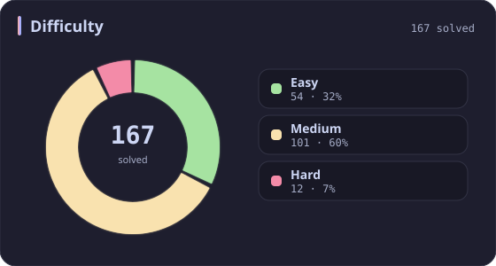
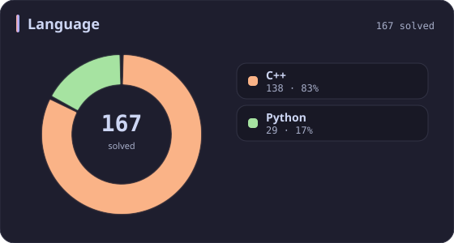
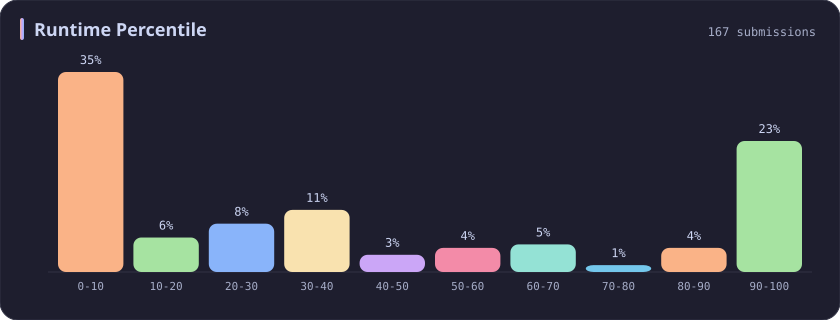
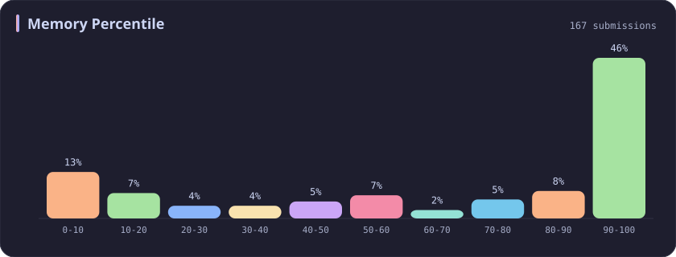
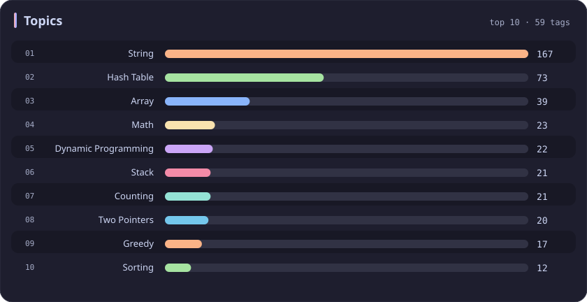

# String Stats

[All stats](../../README.md)

**167** problems · updated `2026-09-05 03:36 UTC+8`

## Stats

### Difficulty

### Language

### Runtime Percentile

### Memory Percentile

### Topics

| Topic | # | Topic | # | Topic | # | Topic | # |
| :--- | ---: | :--- | ---: | :--- | ---: | :--- | ---: |
| [Array](array.md) | 387 | [Divide and Conquer](divide-and-conquer.md) | 16 | [Directed Acyclic Graph](directed-acyclic-graph.md) | 2 | [Range Minimum/Maximum Query](range-minimum-maximum-query.md) | 1 |
| [Hash Table](hash-table.md) | 168 | [Queue](queue.md) | 16 | [Quickselect](quickselect.md) | 2 | [Nim Game](nim-game.md) | 1 |
| **String** | **167** | [Trie](trie.md) | 11 | [Binary Lifting](binary-lifting.md) | 2 | [Impartial Game](impartial-game.md) | 1 |
| [Math](math.md) | 114 | [Binary Search Tree](binary-search-tree.md) | 11 | [Lowest Common Ancestor](lowest-common-ancestor.md) | 2 | [Binary Indexed Tree](binary-indexed-tree.md) | 1 |
| [Sorting](sorting.md) | 87 | [Monotonic Stack](monotonic-stack.md) | 10 | [Counting Sort](counting-sort.md) | 2 | [Sqrt Decomposition](sqrt-decomposition.md) | 1 |
| [Dynamic Programming](dynamic-programming.md) | 83 | [Number Theory](number-theory.md) | 10 | [Interactive](interactive.md) | 2 | [Complete Knapsack](complete-knapsack.md) | 1 |
| [Depth-First Search](depth-first-search.md) | 80 | [Ordered Set](ordered-set.md) | 8 | [Pigeonhole Principle](pigeonhole-principle.md) | 2 | [Reservoir Sampling](reservoir-sampling.md) | 1 |
| [Greedy](greedy.md) | 79 | [Combinatorics](combinatorics.md) | 7 | [Longest Increasing Subsequence](longest-increasing-subsequence.md) | 2 | [Bellman–Ford Algorithm](bellman-ford-algorithm.md) | 1 |
| [Two Pointers](two-pointers.md) | 70 | [Memoization](memoization.md) | 6 | [Segment Tree](segment-tree.md) | 2 | [Floyd–Warshall Algorithm](floyd-warshall-algorithm.md) | 1 |
| [Breadth-First Search](breadth-first-search.md) | 69 | [Data Stream](data-stream.md) | 6 | [Linear Algebra](linear-algebra.md) | 2 | [0-1 Knapsack](0-1-knapsack.md) | 1 |
| [Matrix](matrix.md) | 64 | [Shortest Path](shortest-path.md) | 6 | [Randomized](randomized.md) | 2 | [Aho–Corasick Algorithm](aho-corasick-algorithm.md) | 1 |
| [Binary Search](binary-search.md) | 63 | [Game Theory](game-theory.md) | 5 | [Heuristic Search](heuristic-search.md) | 2 | [Bidirectional Search](bidirectional-search.md) | 1 |
| [Tree](tree.md) | 60 | [Geometry](geometry.md) | 5 | [A* Search](a-search.md) | 2 | [Ternary Search](ternary-search.md) | 1 |
| [Binary Tree](binary-tree.md) | 50 | [Bracket Sequences](bracket-sequences.md) | 4 | [Hash Function](hash-function.md) | 2 | [Zero-Sum Game](zero-sum-game.md) | 1 |
| [Stack](stack.md) | 47 | [String Matching](string-matching.md) | 4 | [Greatest Common Divisor](greatest-common-divisor.md) | 2 | [Timsort](timsort.md) | 1 |
| [Prefix Sum](prefix-sum.md) | 46 | [Floyd's Cycle Finding Algorithm](floyd-s-cycle-finding-algorithm.md) | 4 | [Longest Common Subsequence](longest-common-subsequence.md) | 2 | [Radix Sort](radix-sort.md) | 1 |
| [Bit Manipulation](bit-manipulation.md) | 41 | [Topological Sort](topological-sort.md) | 4 | [Prime Factorization](prime-factorization.md) | 2 | [Triangulation](triangulation.md) | 1 |
| [Simulation](simulation.md) | 40 | [Monotonic Queue](monotonic-queue.md) | 4 | [Bitmask](bitmask.md) | 2 | [Euclidean Algorithm](euclidean-algorithm.md) | 1 |
| [Counting](counting.md) | 40 | [DP on Trees](dp-on-trees.md) | 4 | [Manacher](manacher.md) | 1 | [Minimum Spanning Tree](minimum-spanning-tree.md) | 1 |
| [Database](database.md) | 39 | [Brainteaser](brainteaser.md) | 4 | [Tournament Sort](tournament-sort.md) | 1 | [Doubly-Linked List](doubly-linked-list.md) | 1 |
| [Heap (Priority Queue)](heap-priority-queue.md) | 34 | [Polygons](polygons.md) | 4 | [Z Algorithm](z-algorithm.md) | 1 | [Least Common Multiple](least-common-multiple.md) | 1 |
| [Sliding Window](sliding-window.md) | 30 | [Merge Sort](merge-sort.md) | 3 | [Knuth–Morris–Pratt Algorithm](knuth-morris-pratt-algorithm.md) | 1 | [Fermat's Little Theorem](fermat-s-little-theorem.md) | 1 |
| [Linked List](linked-list.md) | 28 | [Algorithm X](algorithm-x.md) | 3 | [Boyer–Moore String-Search Algorithm](boyer-moore-string-search-algorithm.md) | 1 | [Kosaraju's Algorithm](kosaraju-s-algorithm.md) | 1 |
| [Graph Theory](graph-theory.md) | 27 | [Quicksort](quicksort.md) | 3 | [Dancing Links](dancing-links.md) | 1 | [Tarjan's SCC Algorithm](tarjan-s-scc-algorithm.md) | 1 |
| [Design](design.md) | 25 | [Minimax](minimax.md) | 3 | [Newton's Method](newton-s-method.md) | 1 | [Multiple Knapsack](multiple-knapsack.md) | 1 |
| [Recursion](recursion.md) | 21 | [Knapsack Problem](knapsack-problem.md) | 3 | [Bubble Sort](bubble-sort.md) | 1 | [Rolling Hash](rolling-hash.md) | 1 |
| [Backtracking](backtracking.md) | 18 | [Bucket Sort](bucket-sort.md) | 3 | [Primality Test](primality-test.md) | 1 |  |  |
| [Union-Find](union-find.md) | 17 | [Dijkstra's Algorithm](dijkstra-s-algorithm.md) | 3 | [Sieve Theory](sieve-theory.md) | 1 |  |  |
| [Enumeration](enumeration.md) | 17 | [Boyer–Moore Majority Vote Algorithm](boyer-moore-majority-vote-algorithm.md) | 2 | [Prime Number Sieve](prime-number-sieve.md) | 1 |  |  |

---

## Recent Activity

Latest **100** accepted submissions.

| Date | Title | Difficulty | Lang | Runtime | Memory |
| :--- | :--- | :---: | :---: | ---: | ---: |
| 2026&#8209;06&#8209;06 | [3952. Maximum Total Value of Covered Indices](https://leetcode.com/problems/maximum-total-value-of-covered-indices/) | Medium | C++ | 127 ms `33.96%` | 236.8 MB `31.46%` |
| 2026&#8209;05&#8209;24 | [3941. Password Strength](https://leetcode.com/problems/password-strength/) | Medium | C++ | 20 ms `39.05%` | 17.6 MB `58.98%` |
| 2026&#8209;05&#8209;23 | [2744. Find Maximum Number of String Pairs](https://leetcode.com/problems/find-maximum-number-of-string-pairs/) | Easy | Python | 15 ms `8.76%` | 19.3 MB `18.79%` |
| 2026&#8209;05&#8209;21 | [3043. Find the Length of the Longest Common Prefix](https://leetcode.com/problems/find-the-length-of-the-longest-common-prefix/) | Medium | C++ | 374 ms `18.26%` | 156.5 MB `52.60%` |
| 2026&#8209;02&#8209;19 | [696. Count Binary Substrings](https://leetcode.com/problems/count-binary-substrings/) | Easy | C++ | 0 ms `100.00%` | 13.1 MB `56.88%` |
| 2026&#8209;02&#8209;08 | [1653. Minimum Deletions to Make String Balanced](https://leetcode.com/problems/minimum-deletions-to-make-string-balanced/) | Medium | C++ | 51 ms `18.43%` | 55.1 MB `19.34%` |
| 2025&#8209;10&#8209;17 | [3003. Maximize the Number of Partitions After Operations](https://leetcode.com/problems/maximize-the-number-of-partitions-after-operations/) | Hard | C++ | 4 ms `96.26%` | 12.3 MB `97.20%` |
| 2025&#8209;10&#8209;13 | [2273. Find Resultant Array After Removing Anagrams](https://leetcode.com/problems/find-resultant-array-after-removing-anagrams/) | Easy | C++ | 3 ms `45.53%` | 17.9 MB `24.76%` |
| 2025&#8209;10&#8209;12 | [3714. Longest Balanced Substring II](https://leetcode.com/problems/longest-balanced-substring-ii/) | Medium | C++ | 1603 ms `59.24%` | 403.9 MB `18.22%` |
| 2025&#8209;10&#8209;12 | [3713. Longest Balanced Substring I](https://leetcode.com/problems/longest-balanced-substring-i/) | Medium | C++ | 3030 ms `5.07%` | 498.4 MB `5.06%` |
| 2025&#8209;10&#8209;11 | [3707. Equal Score Substrings](https://leetcode.com/problems/equal-score-substrings/) | Easy | C++ | 3 ms `23.55%` | 8.6 MB `44.95%` |
| 2025&#8209;09&#8209;27 | [3694. Distinct Points Reachable After Substring Removal](https://leetcode.com/problems/distinct-points-reachable-after-substring-removal/) | Medium | C++ | 130 ms `52.48%` | 53.5 MB `42.98%` |
| 2025&#8209;09&#8209;27 | [3692. Majority Frequency Characters](https://leetcode.com/problems/majority-frequency-characters/) | Easy | C++ | 5 ms `31.61%` | 9.2 MB `86.77%` |
| 2025&#8209;09&#8209;26 | [1152. Analyze User Website Visit Pattern](https://leetcode.com/problems/analyze-user-website-visit-pattern/) | Medium | C++ | 55 ms `19.05%` | 26.6 MB `42.86%` |
| 2025&#8209;09&#8209;24 | [166. Fraction to Recurring Decimal](https://leetcode.com/problems/fraction-to-recurring-decimal/) | Medium | Python | 0 ms `100.00%` | 17.9 MB `100.00%` |
| 2025&#8209;09&#8209;23 | [165. Compare Version Numbers](https://leetcode.com/problems/compare-version-numbers/) | Medium | Python | 0 ms `100.00%` | 17.7 MB `100.00%` |
| 2025&#8209;09&#8209;20 | [3484. Design Spreadsheet](https://leetcode.com/problems/design-spreadsheet/) | Medium | Python | 57 ms `96.77%` | 23.5 MB `100.00%` |
| 2025&#8209;09&#8209;17 | [2353. Design a Food Rating System](https://leetcode.com/problems/design-a-food-rating-system/) | Medium | C++ | 164 ms `34.81%` | 162.7 MB `91.36%` |
| 2025&#8209;09&#8209;15 | [1935. Maximum Number of Words You Can Type](https://leetcode.com/problems/maximum-number-of-words-you-can-type/) | Easy | Python | 3 ms `33.08%` | 17.9 MB `100.00%` |
| 2025&#8209;09&#8209;14 | [966. Vowel Spellchecker](https://leetcode.com/problems/vowel-spellchecker/) | Medium | C++ | 37 ms `68.34%` | 41.6 MB `55.21%` |
| 2025&#8209;09&#8209;13 | [3541. Find Most Frequent Vowel and Consonant](https://leetcode.com/problems/find-most-frequent-vowel-and-consonant/) | Easy | C++ | 2 ms `39.99%` | 10 MB `24.45%` |
| 2025&#8209;09&#8209;12 | [3227. Vowels Game in a String](https://leetcode.com/problems/vowels-game-in-a-string/) | Medium | Python | 0 ms `100.00%` | 18.2 MB `100.00%` |
| 2025&#8209;09&#8209;11 | [2785. Sort Vowels in a String](https://leetcode.com/problems/sort-vowels-in-a-string/) | Medium | C++ | 19 ms `35.89%` | 20.6 MB `5.76%` |
| 2025&#8209;08&#8209;27 | [1181. Before and After Puzzle](https://leetcode.com/problems/before-and-after-puzzle/) | Medium | Python | 15 ms `5.56%` | 18.2 MB `100.00%` |
| 2025&#8209;06&#8209;10 | [3442. Maximum Difference Between Even and Odd Frequency I](https://leetcode.com/problems/maximum-difference-between-even-and-odd-frequency-i/) | Easy | C++ | 3 ms `36.10%` | 9.9 MB `27.80%` |
| 2025&#8209;06&#8209;07 | [3170. Lexicographically Minimum String After Removing Stars](https://leetcode.com/problems/lexicographically-minimum-string-after-removing-stars/) | Medium | C++ | 54 ms `80.71%` | 27.2 MB `42.51%` |
| 2025&#8209;06&#8209;06 | [2434. Using a Robot to Print the Lexicographically Smallest String](https://leetcode.com/problems/using-a-robot-to-print-the-lexicographically-smallest-string/) | Medium | C++ | 67 ms `26.26%` | 51.4 MB `5.20%` |
| 2025&#8209;06&#8209;06 | [1061. Lexicographically Smallest Equivalent String](https://leetcode.com/problems/lexicographically-smallest-equivalent-string/) | Medium | C++ | 2 ms `46.62%` | 9 MB `53.92%` |
| 2025&#8209;06&#8209;05 | [3406. Find the Lexicographically Largest String From the Box II](https://leetcode.com/problems/find-the-lexicographically-largest-string-from-the-box-ii/) | Hard | C++ | 510 ms `0.00%` | 278 MB `0.00%` |
| 2025&#8209;06&#8209;05 | [3403. Find the Lexicographically Largest String From the Box I](https://leetcode.com/problems/find-the-lexicographically-largest-string-from-the-box-i/) | Medium | C++ | 9 ms `91.91%` | 12.9 MB `76.28%` |
| 2025&#8209;05&#8209;27 | [1857. Largest Color Value in a Directed Graph](https://leetcode.com/problems/largest-color-value-in-a-directed-graph/) | Hard | C++ | 401 ms `39.45%` | 188.9 MB `30.53%` |
| 2025&#8209;05&#8209;25 | [2131. Longest Palindrome by Concatenating Two Letter Words](https://leetcode.com/problems/longest-palindrome-by-concatenating-two-letter-words/) | Medium | C++ | 27 ms `88.02%` | 171.9 MB `78.72%` |
| 2025&#8209;05&#8209;25 | [3561. Resulting String After Adjacent Removals](https://leetcode.com/problems/resulting-string-after-adjacent-removals/) | Medium | C++ | 106 ms `36.98%` | 78.6 MB `7.40%` |
| 2025&#8209;05&#8209;24 | [3557. Find Maximum Number of Non Intersecting Substrings](https://leetcode.com/problems/find-maximum-number-of-non-intersecting-substrings/) | Medium | C++ | 3 ms `98.31%` | 20.2 MB `90.40%` |
| 2025&#8209;05&#8209;24 | [3556. Sum of Largest Prime Substrings](https://leetcode.com/problems/sum-of-largest-prime-substrings/) | Medium | C++ | 15 ms `51.49%` | 10.8 MB `60.40%` |
| 2025&#8209;05&#8209;24 | [2942. Find Words Containing Character](https://leetcode.com/problems/find-words-containing-character/) | Easy | Python | 0 ms `100.00%` | 17.7 MB `100.00%` |
| 2025&#8209;05&#8209;16 | [2901. Longest Unequal Adjacent Groups Subsequence II](https://leetcode.com/problems/longest-unequal-adjacent-groups-subsequence-ii/) | Medium | C++ | 63 ms `64.73%` | 34.4 MB `74.88%` |
| 2025&#8209;05&#8209;15 | [2900. Longest Unequal Adjacent Groups Subsequence I](https://leetcode.com/problems/longest-unequal-adjacent-groups-subsequence-i/) | Easy | C++ | 0 ms `100.00%` | 29.9 MB `88.73%` |
| 2025&#8209;05&#8209;14 | [3337. Total Characters in String After Transformations II](https://leetcode.com/problems/total-characters-in-string-after-transformations-ii/) | Hard | C++ | 543 ms `9.64%` | 70.7 MB `42.17%` |
| 2025&#8209;05&#8209;13 | [3335. Total Characters in String After Transformations I](https://leetcode.com/problems/total-characters-in-string-after-transformations-i/) | Medium | C++ | 14 ms `98.77%` | 19.2 MB `88.62%` |
| 2025&#8209;05&#8209;12 | [1180. Count Substrings with Only One Distinct Letter](https://leetcode.com/problems/count-substrings-with-only-one-distinct-letter/) | Easy | C++ | 0 ms `100.00%` | 8.5 MB `29.73%` |
| 2025&#8209;05&#8209;12 | [770. Basic Calculator IV](https://leetcode.com/problems/basic-calculator-iv/) | Hard | C++ | 4 ms `85.71%` | 21.8 MB `99.51%` |
| 2025&#8209;05&#8209;12 | [772. Basic Calculator III](https://leetcode.com/problems/basic-calculator-iii/) | Hard | C++ | 0 ms `100.00%` | 11.5 MB `56.44%` |
| 2025&#8209;05&#8209;12 | [227. Basic Calculator II](https://leetcode.com/problems/basic-calculator-ii/) | Medium | C++ | 38 ms `5.53%` | 38.6 MB `5.00%` |
| 2025&#8209;05&#8209;12 | [224. Basic Calculator](https://leetcode.com/problems/basic-calculator/) | Hard | C++ | 19 ms `7.01%` | 23.2 MB `5.06%` |
| 2025&#8209;05&#8209;11 | [484. Find Permutation](https://leetcode.com/problems/find-permutation/) | Medium | C++ | 3 ms `29.79%` | 14.4 MB `14.89%` |
| 2025&#8209;05&#8209;11 | [439. Ternary Expression Parser](https://leetcode.com/problems/ternary-expression-parser/) | Medium | C++ | 0 ms `100.00%` | 8.9 MB `79.45%` |
| 2025&#8209;05&#8209;11 | [3545. Minimum Deletions for At Most K Distinct Characters](https://leetcode.com/problems/minimum-deletions-for-at-most-k-distinct-characters/) | Easy | C++ | 3 ms `41.64%` | 9 MB `89.15%` |
| 2025&#8209;05&#8209;09 | [3343. Count Number of Balanced Permutations](https://leetcode.com/problems/count-number-of-balanced-permutations/) | Hard | C++ | 150 ms `50.60%` | 19.4 MB `65.06%` |
| 2025&#8209;05&#8209;04 | [616. Add Bold Tag in String](https://leetcode.com/problems/add-bold-tag-in-string/) | Medium | C++ | 7 ms `65.58%` | 13.9 MB `59.74%` |
| 2025&#8209;05&#8209;04 | [249. Group Shifted Strings](https://leetcode.com/problems/group-shifted-strings/) | Medium | C++ | 1 ms `64.95%` | 10.9 MB `92.27%` |
| 2025&#8209;05&#8209;04 | [1165. Single-Row Keyboard](https://leetcode.com/problems/single-row-keyboard/) | Easy | C++ | 0 ms `100.00%` | 9.2 MB `95.06%` |
| 2025&#8209;05&#8209;04 | [1100. Find K-Length Substrings With No Repeated Characters](https://leetcode.com/problems/find-k-length-substrings-with-no-repeated-characters/) | Medium | C++ | 0 ms `100.00%` | 9 MB `73.74%` |
| 2025&#8209;05&#8209;04 | [340. Longest Substring with At Most K Distinct Characters](https://leetcode.com/problems/longest-substring-with-at-most-k-distinct-characters/) | Medium | C++ | 0 ms `100.00%` | 9.7 MB `78.62%` |
| 2025&#8209;05&#8209;04 | [159. Longest Substring with At Most Two Distinct Characters](https://leetcode.com/problems/longest-substring-with-at-most-two-distinct-characters/) | Medium | C++ | 3 ms `93.66%` | 12.1 MB `88.81%` |
| 2025&#8209;05&#8209;04 | [1055. Shortest Way to Form String](https://leetcode.com/problems/shortest-way-to-form-string/) | Medium | C++ | 0 ms `100.00%` | 8.7 MB `96.94%` |
| 2025&#8209;05&#8209;04 | [186. Reverse Words in a String II](https://leetcode.com/problems/reverse-words-in-a-string-ii/) | Medium | C++ | 0 ms `100.00%` | 20.1 MB `59.42%` |
| 2025&#8209;05&#8209;03 | [981. Time Based Key-Value Store](https://leetcode.com/problems/time-based-key-value-store/) | Medium | C++ | 38 ms `86.73%` | 136.5 MB `84.35%` |
| 2025&#8209;05&#8209;02 | [838. Push Dominoes](https://leetcode.com/problems/push-dominoes/) | Medium | C++ | 27 ms `32.11%` | 27.2 MB `30.96%` |
| 2025&#8209;04&#8209;29 | [734. Sentence Similarity](https://leetcode.com/problems/sentence-similarity/) | Easy | C++ | 2 ms `52.34%` | 15.7 MB `70.09%` |
| 2025&#8209;04&#8209;27 | [3529. Count Cells in Overlapping Horizontal and Vertical Substrings](https://leetcode.com/problems/count-cells-in-overlapping-horizontal-and-vertical-substrings/) | Medium | C++ | 2256 ms `5.71%` | 63.1 MB `95.71%` |
| 2025&#8209;04&#8209;26 | [3527. Find the Most Common Response](https://leetcode.com/problems/find-the-most-common-response/) | Medium | C++ | 1472 ms `24.07%` | 479.3 MB `51.50%` |
| 2025&#8209;04&#8209;26 | [266. Palindrome Permutation](https://leetcode.com/problems/palindrome-permutation/) | Easy | C++ | 0 ms `100.00%` | 8.2 MB `88.46%` |
| 2025&#8209;04&#8209;26 | [499. The Maze III](https://leetcode.com/problems/the-maze-iii/) | Hard | C++ | 17 ms `6.78%` | 20.2 MB `5.08%` |
| 2025&#8209;04&#8209;26 | [161. One Edit Distance](https://leetcode.com/problems/one-edit-distance/) | Medium | Python | 3 ms `26.80%` | 17.7 MB `100.00%` |
| 2025&#8209;04&#8209;26 | [1427. Perform String Shifts](https://leetcode.com/problems/perform-string-shifts/) | Easy | Python | 0 ms `100.00%` | 17.9 MB `100.00%` |
| 2025&#8209;04&#8209;24 | [208. Implement Trie (Prefix Tree)](https://leetcode.com/problems/implement-trie-prefix-tree/) | Medium | C++ | 15 ms `86.33%` | 29.9 MB `99.66%` |
| 2025&#8209;04&#8209;24 | [1268. Search Suggestions System](https://leetcode.com/problems/search-suggestions-system/) | Medium | C++ | 31 ms `64.68%` | 44 MB `62.90%` |
| 2025&#8209;04&#8209;24 | [1143. Longest Common Subsequence](https://leetcode.com/problems/longest-common-subsequence/) | Medium | C++ | 24 ms `72.81%` | 27.4 MB `55.87%` |
| 2025&#8209;04&#8209;24 | [72. Edit Distance](https://leetcode.com/problems/edit-distance/) | Medium | C++ | 11 ms `28.88%` | 13.1 MB `74.14%` |
| 2025&#8209;04&#8209;24 | [17. Letter Combinations of a Phone Number](https://leetcode.com/problems/letter-combinations-of-a-phone-number/) | Medium | Python | 0 ms `100.00%` | 17.7 MB `100.00%` |
| 2025&#8209;04&#8209;20 | [399. Evaluate Division](https://leetcode.com/problems/evaluate-division/) | Medium | C++ | 2 ms `22.06%` | 12 MB `60.01%` |
| 2025&#8209;04&#8209;20 | [3522. Calculate Score After Performing Instructions](https://leetcode.com/problems/calculate-score-after-performing-instructions/) | Medium | C++ | 4 ms `64.29%` | 167.2 MB `74.06%` |
| 2025&#8209;04&#8209;20 | [649. Dota2 Senate](https://leetcode.com/problems/dota2-senate/) | Medium | C++ | 7 ms `17.56%` | 12.6 MB `7.47%` |
| 2025&#8209;04&#8209;20 | [394. Decode String](https://leetcode.com/problems/decode-string/) | Medium | C++ | 1 ms `29.13%` | 9.7 MB `10.91%` |
| 2025&#8209;04&#8209;20 | [2390. Removing Stars From a String](https://leetcode.com/problems/removing-stars-from-a-string/) | Medium | C++ | 7 ms `96.62%` | 29.8 MB `36.41%` |
| 2025&#8209;04&#8209;20 | [1657. Determine if Two Strings Are Close](https://leetcode.com/problems/determine-if-two-strings-are-close/) | Medium | C++ | 27 ms `35.74%` | 23.6 MB `49.60%` |
| 2025&#8209;04&#8209;20 | [1456. Maximum Number of Vowels in a Substring of Given Length](https://leetcode.com/problems/maximum-number-of-vowels-in-a-substring-of-given-length/) | Medium | C++ | 3 ms `87.94%` | 13 MB `89.77%` |
| 2025&#8209;04&#8209;20 | [392. Is Subsequence](https://leetcode.com/problems/is-subsequence/) | Easy | C++ | 0 ms `100.00%` | 8.5 MB `91.47%` |
| 2025&#8209;04&#8209;20 | [443. String Compression](https://leetcode.com/problems/string-compression/) | Medium | C++ | 0 ms `100.00%` | 13.6 MB `92.00%` |
| 2025&#8209;04&#8209;20 | [151. Reverse Words in a String](https://leetcode.com/problems/reverse-words-in-a-string/) | Medium | Python | 3 ms `30.78%` | 17.8 MB `100.00%` |
| 2025&#8209;04&#8209;20 | [345. Reverse Vowels of a String](https://leetcode.com/problems/reverse-vowels-of-a-string/) | Easy | C++ | 0 ms `100.00%` | 11.6 MB `5.33%` |
| 2025&#8209;04&#8209;18 | [38. Count and Say](https://leetcode.com/problems/count-and-say/) | Medium | C++ | 3 ms `81.25%` | 10.3 MB `21.90%` |
| 2025&#8209;04&#8209;11 | [1071. Greatest Common Divisor of Strings](https://leetcode.com/problems/greatest-common-divisor-of-strings/) | Easy | C++ | 19 ms `5.25%` | 46.6 MB `5.11%` |
| 2025&#8209;04&#8209;11 | [1768. Merge Strings Alternately](https://leetcode.com/problems/merge-strings-alternately/) | Easy | C++ | 3 ms `40.70%` | 8.6 MB `13.54%` |
| 2024&#8209;11&#8209;21 | [2516. Take K of Each Character From Left and Right](https://leetcode.com/problems/take-k-of-each-character-from-left-and-right/) | Medium | C++ | 21 ms `29.47%` | 11.9 MB `100.00%` |
| 2024&#8209;11&#8209;05 | [2914. Minimum Number of Changes to Make Binary String Beautiful](https://leetcode.com/problems/minimum-number-of-changes-to-make-binary-string-beautiful/) | Medium | C++ | 9 ms `5.33%` | 16.9 MB `11.93%` |
| 2024&#8209;11&#8209;04 | [2955. Number of Same-End Substrings](https://leetcode.com/problems/number-of-same-end-substrings/) | Medium | C++ | 238 ms `15.38%` | 230.3 MB `7.69%` |
| 2024&#8209;11&#8209;04 | [3163. String Compression III](https://leetcode.com/problems/string-compression-iii/) | Medium | C++ | 26 ms `65.21%` | 35.5 MB `5.36%` |
| 2024&#8209;11&#8209;03 | [796. Rotate String](https://leetcode.com/problems/rotate-string/) | Easy | C++ | 2 ms `8.59%` | 8.6 MB `6.12%` |
| 2024&#8209;11&#8209;02 | [2490. Circular Sentence](https://leetcode.com/problems/circular-sentence/) | Easy | Python | 0 ms `100.00%` | 16.6 MB `100.00%` |
| 2024&#8209;11&#8209;01 | [1957. Delete Characters to Make Fancy String](https://leetcode.com/problems/delete-characters-to-make-fancy-string/) | Easy | C++ | 23 ms `77.42%` | 42.7 MB `87.55%` |
| 2024&#8209;10&#8209;23 | [3084. Count Substrings Starting and Ending with Given Character](https://leetcode.com/problems/count-substrings-starting-and-ending-with-given-character/) | Medium | C++ | 0 ms `100.00%` | 11.8 MB `99.87%` |
| 2024&#8209;10&#8209;21 | [1593. Split a String Into the Max Number of Unique Substrings](https://leetcode.com/problems/split-a-string-into-the-max-number-of-unique-substrings/) | Medium | Python | 1706 ms `5.01%` | 29.9 MB `8.46%` |
| 2024&#8209;10&#8209;20 | [648. Replace Words](https://leetcode.com/problems/replace-words/) | Medium | Python | 136 ms `24.51%` | 26.7 MB `100.00%` |
| 2024&#8209;10&#8209;20 | [1002. Find Common Characters](https://leetcode.com/problems/find-common-characters/) | Easy | C++ | 0 ms `100.00%` | 11.9 MB `90.83%` |
| 2024&#8209;10&#8209;20 | [2486. Append Characters to String to Make Subsequence](https://leetcode.com/problems/append-characters-to-string-to-make-subsequence/) | Medium | C++ | 4 ms `21.75%` | 12.2 MB `99.78%` |
| 2024&#8209;10&#8209;20 | [3110. Score of a String](https://leetcode.com/problems/score-of-a-string/) | Easy | C++ | 2 ms `7.95%` | 8.3 MB `100.00%` |
| 2024&#8209;10&#8209;20 | [1106. Parsing A Boolean Expression](https://leetcode.com/problems/parsing-a-boolean-expression/) | Hard | C++ | 9 ms `21.74%` | 13.3 MB `9.84%` |
| 2024&#8209;10&#8209;19 | [2451. Odd String Difference](https://leetcode.com/problems/odd-string-difference/) | Easy | C++ | 0 ms `100.00%` | 10.2 MB `55.73%` |
