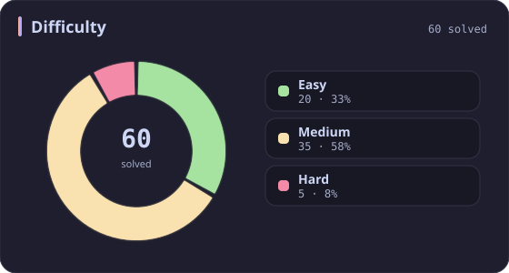
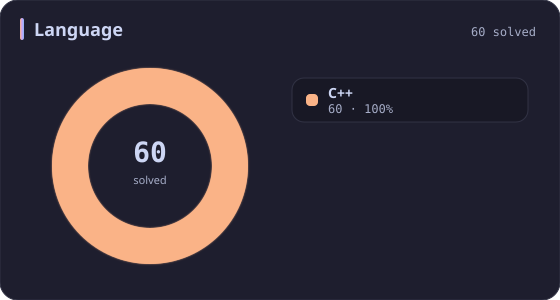
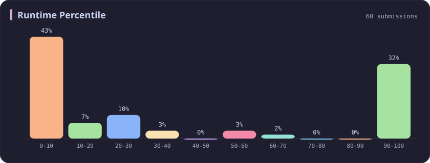
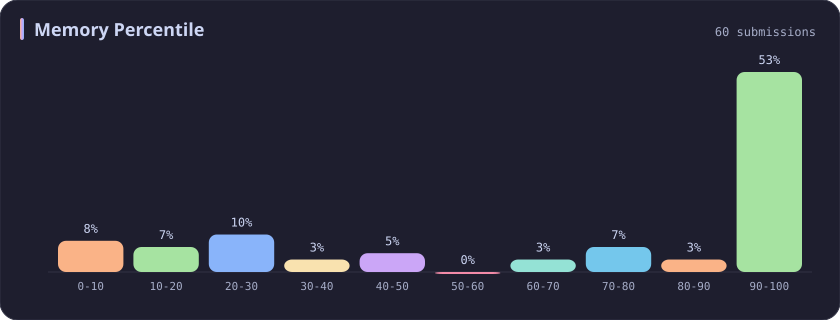
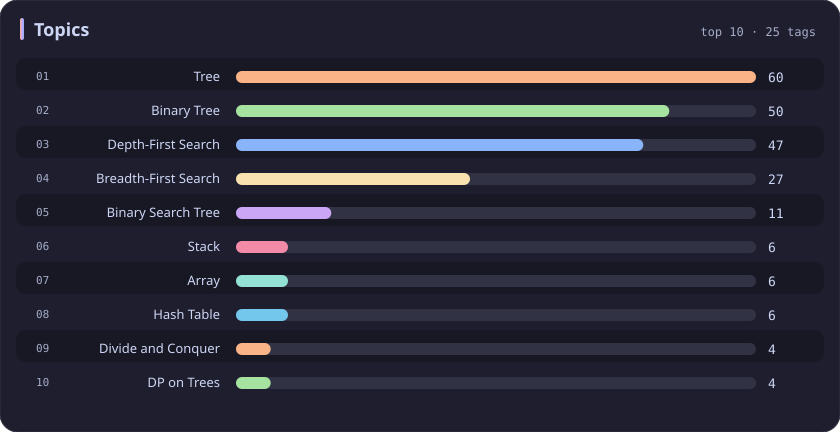

# Tree Stats

[All stats](../../README.md)

**60** problems · updated `2026-09-04 19:10 UTC`

## Stats

### Difficulty

### Language

### Runtime Percentile

### Memory Percentile

### Topics

| Topic | # | Topic | # | Topic | # | Topic | # |
| :--- | ---: | :--- | ---: | :--- | ---: | :--- | ---: |
| [Array](array.md) | 386 | [Divide and Conquer](divide-and-conquer.md) | 16 | [Directed Acyclic Graph](directed-acyclic-graph.md) | 2 | [Range Minimum/Maximum Query](range-minimum-maximum-query.md) | 1 |
| [Hash Table](hash-table.md) | 168 | [Queue](queue.md) | 16 | [Quickselect](quickselect.md) | 2 | [Nim Game](nim-game.md) | 1 |
| [String](string.md) | 167 | [Trie](trie.md) | 11 | [Binary Lifting](binary-lifting.md) | 2 | [Impartial Game](impartial-game.md) | 1 |
| [Math](math.md) | 114 | [Binary Search Tree](binary-search-tree.md) | 11 | [Lowest Common Ancestor](lowest-common-ancestor.md) | 2 | [Binary Indexed Tree](binary-indexed-tree.md) | 1 |
| [Sorting](sorting.md) | 86 | [Monotonic Stack](monotonic-stack.md) | 10 | [Counting Sort](counting-sort.md) | 2 | [Sqrt Decomposition](sqrt-decomposition.md) | 1 |
| [Dynamic Programming](dynamic-programming.md) | 83 | [Number Theory](number-theory.md) | 10 | [Interactive](interactive.md) | 2 | [Complete Knapsack](complete-knapsack.md) | 1 |
| [Depth-First Search](depth-first-search.md) | 80 | [Ordered Set](ordered-set.md) | 8 | [Pigeonhole Principle](pigeonhole-principle.md) | 2 | [Reservoir Sampling](reservoir-sampling.md) | 1 |
| [Greedy](greedy.md) | 79 | [Combinatorics](combinatorics.md) | 7 | [Longest Increasing Subsequence](longest-increasing-subsequence.md) | 2 | [Bellman–Ford Algorithm](bellman-ford-algorithm.md) | 1 |
| [Two Pointers](two-pointers.md) | 70 | [Memoization](memoization.md) | 6 | [Segment Tree](segment-tree.md) | 2 | [Floyd–Warshall Algorithm](floyd-warshall-algorithm.md) | 1 |
| [Breadth-First Search](breadth-first-search.md) | 69 | [Data Stream](data-stream.md) | 6 | [Linear Algebra](linear-algebra.md) | 2 | [0-1 Knapsack](0-1-knapsack.md) | 1 |
| [Matrix](matrix.md) | 64 | [Shortest Path](shortest-path.md) | 6 | [Randomized](randomized.md) | 2 | [Aho–Corasick Algorithm](aho-corasick-algorithm.md) | 1 |
| [Binary Search](binary-search.md) | 63 | [Game Theory](game-theory.md) | 5 | [Heuristic Search](heuristic-search.md) | 2 | [Bidirectional Search](bidirectional-search.md) | 1 |
| **Tree** | **60** | [Geometry](geometry.md) | 5 | [A* Search](a-search.md) | 2 | [Ternary Search](ternary-search.md) | 1 |
| [Binary Tree](binary-tree.md) | 50 | [Bracket Sequences](bracket-sequences.md) | 4 | [Hash Function](hash-function.md) | 2 | [Zero-Sum Game](zero-sum-game.md) | 1 |
| [Stack](stack.md) | 47 | [String Matching](string-matching.md) | 4 | [Greatest Common Divisor](greatest-common-divisor.md) | 2 | [Timsort](timsort.md) | 1 |
| [Prefix Sum](prefix-sum.md) | 46 | [Floyd's Cycle Finding Algorithm](floyd-s-cycle-finding-algorithm.md) | 4 | [Longest Common Subsequence](longest-common-subsequence.md) | 2 | [Radix Sort](radix-sort.md) | 1 |
| [Bit Manipulation](bit-manipulation.md) | 41 | [Topological Sort](topological-sort.md) | 4 | [Prime Factorization](prime-factorization.md) | 2 | [Triangulation](triangulation.md) | 1 |
| [Simulation](simulation.md) | 40 | [Monotonic Queue](monotonic-queue.md) | 4 | [Bitmask](bitmask.md) | 2 | [Euclidean Algorithm](euclidean-algorithm.md) | 1 |
| [Counting](counting.md) | 40 | [DP on Trees](dp-on-trees.md) | 4 | [Manacher](manacher.md) | 1 | [Minimum Spanning Tree](minimum-spanning-tree.md) | 1 |
| [Database](database.md) | 39 | [Brainteaser](brainteaser.md) | 4 | [Tournament Sort](tournament-sort.md) | 1 | [Doubly-Linked List](doubly-linked-list.md) | 1 |
| [Heap (Priority Queue)](heap-priority-queue.md) | 33 | [Polygons](polygons.md) | 4 | [Z Algorithm](z-algorithm.md) | 1 | [Least Common Multiple](least-common-multiple.md) | 1 |
| [Sliding Window](sliding-window.md) | 30 | [Merge Sort](merge-sort.md) | 3 | [Knuth–Morris–Pratt Algorithm](knuth-morris-pratt-algorithm.md) | 1 | [Fermat's Little Theorem](fermat-s-little-theorem.md) | 1 |
| [Linked List](linked-list.md) | 28 | [Algorithm X](algorithm-x.md) | 3 | [Boyer–Moore String-Search Algorithm](boyer-moore-string-search-algorithm.md) | 1 | [Kosaraju's Algorithm](kosaraju-s-algorithm.md) | 1 |
| [Graph Theory](graph-theory.md) | 27 | [Quicksort](quicksort.md) | 3 | [Dancing Links](dancing-links.md) | 1 | [Tarjan's SCC Algorithm](tarjan-s-scc-algorithm.md) | 1 |
| [Design](design.md) | 25 | [Minimax](minimax.md) | 3 | [Newton's Method](newton-s-method.md) | 1 | [Multiple Knapsack](multiple-knapsack.md) | 1 |
| [Recursion](recursion.md) | 21 | [Knapsack Problem](knapsack-problem.md) | 3 | [Bubble Sort](bubble-sort.md) | 1 | [Rolling Hash](rolling-hash.md) | 1 |
| [Backtracking](backtracking.md) | 18 | [Bucket Sort](bucket-sort.md) | 3 | [Primality Test](primality-test.md) | 1 |  |  |
| [Union-Find](union-find.md) | 17 | [Dijkstra's Algorithm](dijkstra-s-algorithm.md) | 3 | [Sieve Theory](sieve-theory.md) | 1 |  |  |
| [Enumeration](enumeration.md) | 17 | [Boyer–Moore Majority Vote Algorithm](boyer-moore-majority-vote-algorithm.md) | 2 | [Prime Number Sieve](prime-number-sieve.md) | 1 |  |  |

---

## Recent Activity

Latest **60** accepted submissions.

| Date | # | Title | Difficulty | Lang | Runtime | Memory |
| :--- | ---: | :--- | :---: | :---: | ---: | ---: |
| 2026-08-13 | 270 | [Closest Binary Search Tree Value](https://leetcode.com/problems/closest-binary-search-tree-value/) | Easy | C++ | 0 ms `100.00%` | 21.2 MB `48.40%` |
| 2026-08-13 | 250 | [Count Univalue Subtrees](https://leetcode.com/problems/count-univalue-subtrees/) | Medium | C++ | 0 ms `100.00%` | 18.5 MB `75.93%` |
| 2026-08-13 | 549 | [Binary Tree Longest Consecutive Sequence II](https://leetcode.com/problems/binary-tree-longest-consecutive-sequence-ii/) | Medium | C++ | 0 ms `100.00%` | 22.7 MB `78.57%` |
| 2026-06-11 | 3558 | [Number of Ways to Assign Edge Weights I](https://leetcode.com/problems/number-of-ways-to-assign-edge-weights-i/) | Medium | C++ | 303 ms `53.85%` | 346.5 MB `44.39%` |
| 2026-06-04 | 298 | [Binary Tree Longest Consecutive Sequence](https://leetcode.com/problems/binary-tree-longest-consecutive-sequence/) | Medium | C++ | 0 ms `100.00%` | 32.9 MB `74.42%` |
| 2026-02-09 | 1382 | [Balance a Binary Search Tree](https://leetcode.com/problems/balance-a-binary-search-tree/) | Medium | C++ | 22 ms `20.32%` | 65.6 MB `66.43%` |
| 2026-02-08 | 110 | [Balanced Binary Tree](https://leetcode.com/problems/balanced-binary-tree/) | Easy | C++ | 0 ms `100.00%` | 23 MB `83.72%` |
| 2025-10-12 | 3715 | [Sum of Perfect Square Ancestors](https://leetcode.com/problems/sum-of-perfect-square-ancestors/) | Hard | C++ | 1461 ms `21.09%` | 383.2 MB `25.85%` |
| 2025-05-29 | 3068 | [Find the Maximum Sum of Node Values](https://leetcode.com/problems/find-the-maximum-sum-of-node-values/) | Hard | C++ | 111 ms `11.83%` | 158 MB `11.26%` |
| 2025-05-29 | 3373 | [Maximize the Number of Target Nodes After Connecting Trees II](https://leetcode.com/problems/maximize-the-number-of-target-nodes-after-connecting-trees-ii/) | Hard | C++ | 457 ms `27.98%` | 387.2 MB `21.76%` |
| 2025-05-28 | 3372 | [Maximize the Number of Target Nodes After Connecting Trees I](https://leetcode.com/problems/maximize-the-number-of-target-nodes-after-connecting-trees-i/) | Medium | C++ | 181 ms `69.37%` | 62.9 MB `70.27%` |
| 2025-04-26 | 1214 | [Two Sum BSTs](https://leetcode.com/problems/two-sum-bsts/) | Medium | C++ | 0 ms `100.00%` | 29.5 MB `42.11%` |
| 2025-04-20 | 450 | [Delete Node in a BST](https://leetcode.com/problems/delete-node-in-a-bst/) | Medium | C++ | 0 ms `100.00%` | 34.3 MB `87.09%` |
| 2025-04-19 | 700 | [Search in a Binary Search Tree](https://leetcode.com/problems/search-in-a-binary-search-tree/) | Easy | C++ | 0 ms `100.00%` | 35.5 MB `31.70%` |
| 2025-04-19 | 1161 | [Maximum Level Sum of a Binary Tree](https://leetcode.com/problems/maximum-level-sum-of-a-binary-tree/) | Medium | C++ | 8 ms `21.91%` | 115.7 MB `5.42%` |
| 2025-04-19 | 199 | [Binary Tree Right Side View](https://leetcode.com/problems/binary-tree-right-side-view/) | Medium | C++ | 0 ms `100.00%` | 14.9 MB `63.75%` |
| 2025-04-19 | 1372 | [Longest ZigZag Path in a Binary Tree](https://leetcode.com/problems/longest-zigzag-path-in-a-binary-tree/) | Medium | C++ | 0 ms `100.00%` | 94.3 MB `99.04%` |
| 2025-04-19 | 236 | [Lowest Common Ancestor of a Binary Tree](https://leetcode.com/problems/lowest-common-ancestor-of-a-binary-tree/) | Medium | C++ | 11 ms `100.00%` | 18.7 MB `100.00%` |
| 2025-04-19 | 1448 | [Count Good Nodes in Binary Tree](https://leetcode.com/problems/count-good-nodes-in-binary-tree/) | Medium | C++ | 104 ms `32.00%` | 88.1 MB `97.77%` |
| 2025-04-19 | 437 | [Path Sum III](https://leetcode.com/problems/path-sum-iii/) | Medium | C++ | 12 ms `30.68%` | 21.5 MB `25.06%` |
| 2025-04-19 | 872 | [Leaf-Similar Trees](https://leetcode.com/problems/leaf-similar-trees/) | Easy | C++ | 0 ms `100.00%` | 15.1 MB `99.71%` |
| 2025-04-19 | 104 | [Maximum Depth of Binary Tree](https://leetcode.com/problems/maximum-depth-of-binary-tree/) | Easy | C++ | 0 ms `100.00%` | 19.1 MB `99.94%` |
| 2024-10-26 | 2458 | [Height of Binary Tree After Subtree Removal Queries](https://leetcode.com/problems/height-of-binary-tree-after-subtree-removal-queries/) | Hard | C++ | 339 ms `28.83%` | 312.8 MB `34.69%` |
| 2024-10-24 | 951 | [Flip Equivalent Binary Trees](https://leetcode.com/problems/flip-equivalent-binary-trees/) | Medium | C++ | 0 ms `100.00%` | 14.5 MB `100.00%` |
| 2024-10-23 | 2641 | [Cousins in Binary Tree II](https://leetcode.com/problems/cousins-in-binary-tree-ii/) | Medium | C++ | 157 ms `16.02%` | 392.9 MB `8.35%` |
| 2024-10-22 | 2583 | [Kth Largest Sum in a Binary Tree](https://leetcode.com/problems/kth-largest-sum-in-a-binary-tree/) | Medium | C++ | 34 ms `58.53%` | 167 MB `100.00%` |
| 2024-04-17 | 988 | [Smallest String Starting From Leaf](https://leetcode.com/problems/smallest-string-starting-from-leaf/) | Medium | C++ | 10 ms `6.63%` | 20.4 MB `100.00%` |
| 2024-04-17 | 623 | [Add One Row to Tree](https://leetcode.com/problems/add-one-row-to-tree/) | Medium | C++ | 8 ms `0.27%` | 24.3 MB `99.93%` |
| 2024-04-15 | 129 | [Sum Root to Leaf Numbers](https://leetcode.com/problems/sum-root-to-leaf-numbers/) | Medium | C++ | 0 ms `100.00%` | 11.4 MB `99.98%` |
| 2024-04-15 | 404 | [Sum of Left Leaves](https://leetcode.com/problems/sum-of-left-leaves/) | Easy | C++ | 0 ms `100.00%` | 14.8 MB `99.89%` |
| 2024-03-24 | 113 | [Path Sum II](https://leetcode.com/problems/path-sum-ii/) | Medium | C++ | 8 ms `27.27%` | 18.8 MB `99.98%` |
| 2024-03-23 | 111 | [Minimum Depth of Binary Tree](https://leetcode.com/problems/minimum-depth-of-binary-tree/) | Easy | C++ | 187 ms `5.21%` | 145 MB `99.96%` |
| 2024-03-23 | 107 | [Binary Tree Level Order Traversal II](https://leetcode.com/problems/binary-tree-level-order-traversal-ii/) | Medium | C++ | 4 ms `6.61%` | 13.8 MB `99.96%` |
| 2024-03-23 | 515 | [Find Largest Value in Each Tree Row](https://leetcode.com/problems/find-largest-value-in-each-tree-row/) | Medium | C++ | 12 ms `1.76%` | 20.9 MB `99.88%` |
| 2023-03-27 | 701 | [Insert into a Binary Search Tree](https://leetcode.com/problems/insert-into-a-binary-search-tree/) | Medium | C++ | 117 ms `0.20%` | 57 MB `99.77%` |
| 2023-03-27 | 98 | [Validate Binary Search Tree](https://leetcode.com/problems/validate-binary-search-tree/) | Medium | C++ | 7 ms `1.76%` | 21.7 MB `95.02%` |
| 2023-03-27 | 653 | [Two Sum IV - Input is a BST](https://leetcode.com/problems/two-sum-iv-input-is-a-bst/) | Easy | C++ | 48 ms `5.08%` | 39 MB `20.06%` |
| 2023-03-27 | 235 | [Lowest Common Ancestor of a Binary Search Tree](https://leetcode.com/problems/lowest-common-ancestor-of-a-binary-search-tree/) | Medium | C++ | 38 ms `7.26%` | 23.2 MB `99.46%` |
| 2023-03-25 | 112 | [Path Sum](https://leetcode.com/problems/path-sum/) | Easy | C++ | 7 ms `1.04%` | 21.3 MB `99.84%` |
| 2023-03-25 | 145 | [Binary Tree Postorder Traversal](https://leetcode.com/problems/binary-tree-postorder-traversal/) | Easy | C++ | 3 ms `3.87%` | 8.6 MB `100.00%` |
| 2023-03-25 | 94 | [Binary Tree Inorder Traversal](https://leetcode.com/problems/binary-tree-inorder-traversal/) | Easy | C++ | 0 ms `100.00%` | 8.4 MB `100.00%` |
| 2023-03-25 | 144 | [Binary Tree Preorder Traversal](https://leetcode.com/problems/binary-tree-preorder-traversal/) | Easy | C++ | 6 ms `0.03%` | 8.3 MB `100.00%` |
| 2023-03-25 | 102 | [Binary Tree Level Order Traversal](https://leetcode.com/problems/binary-tree-level-order-traversal/) | Medium | C++ | 8 ms `5.86%` | 12.7 MB `99.94%` |
| 2023-03-25 | 101 | [Symmetric Tree](https://leetcode.com/problems/symmetric-tree/) | Easy | C++ | 10 ms `0.52%` | 19 MB `6.22%` |
| 2023-03-25 | 226 | [Invert Binary Tree](https://leetcode.com/problems/invert-binary-tree/) | Easy | C++ | 3 ms `0.43%` | 9.7 MB `100.00%` |
| 2023-03-21 | 429 | [N-ary Tree Level Order Traversal](https://leetcode.com/problems/n-ary-tree-level-order-traversal/) | Medium | C++ | 27 ms `13.57%` | 12.2 MB `100.00%` |
| 2023-03-16 | 106 | [Construct Binary Tree from Inorder and Postorder Traversal](https://leetcode.com/problems/construct-binary-tree-from-inorder-and-postorder-traversal/) | Medium | C++ | 38 ms `5.14%` | 26 MB `99.95%` |
| 2023-03-15 | 958 | [Check Completeness of a Binary Tree](https://leetcode.com/problems/check-completeness-of-a-binary-tree/) | Medium | C++ | 11 ms `0.47%` | 10.5 MB `100.00%` |
| 2023-03-11 | 109 | [Convert Sorted List to Binary Search Tree](https://leetcode.com/problems/convert-sorted-list-to-binary-search-tree/) | Medium | C++ | 435 ms `5.92%` | 345.2 MB `5.43%` |
| 2023-03-10 | 116 | [Populating Next Right Pointers in Each Node](https://leetcode.com/problems/populating-next-right-pointers-in-each-node/) | Medium | C++ | 24 ms `7.89%` | 17.7 MB `99.99%` |
| 2023-03-10 | 617 | [Merge Two Binary Trees](https://leetcode.com/problems/merge-two-binary-trees/) | Easy | C++ | 45 ms `5.21%` | 34.2 MB `11.43%` |
| 2023-03-10 | 589 | [N-ary Tree Preorder Traversal](https://leetcode.com/problems/n-ary-tree-preorder-traversal/) | Easy | C++ | 40 ms `5.08%` | 16.3 MB `11.81%` |
| 2023-03-06 | 590 | [N-ary Tree Postorder Traversal](https://leetcode.com/problems/n-ary-tree-postorder-traversal/) | Easy | C++ | 33 ms `8.49%` | 16.3 MB `8.15%` |
| 2023-03-04 | 2581 | [Count Number of Possible Root Nodes](https://leetcode.com/problems/count-number-of-possible-root-nodes/) | Hard | C++ | 701 ms `18.68%` | 247.9 MB `22.18%` |
| 2023-02-28 | 652 | [Find Duplicate Subtrees](https://leetcode.com/problems/find-duplicate-subtrees/) | Medium | C++ | 40 ms `5.04%` | 56 MB `22.85%` |
| 2023-02-27 | 427 | [Construct Quad Tree](https://leetcode.com/problems/construct-quad-tree/) | Medium | C++ | 31 ms `5.31%` | 23.5 MB `15.71%` |
| 2023-02-19 | 103 | [Binary Tree Zigzag Level Order Traversal](https://leetcode.com/problems/binary-tree-zigzag-level-order-traversal/) | Medium | C++ | 3 ms `8.01%` | 12 MB `99.95%` |
| 2023-02-17 | 100 | [Same Tree](https://leetcode.com/problems/same-tree/) | Easy | C++ | 0 ms `100.00%` | 10 MB `100.00%` |
| 2023-02-17 | 783 | [Minimum Distance Between BST Nodes](https://leetcode.com/problems/minimum-distance-between-bst-nodes/) | Easy | C++ | 8 ms `0.25%` | 9.7 MB `100.00%` |
| 2023-02-16 | 965 | [Univalued Binary Tree](https://leetcode.com/problems/univalued-binary-tree/) | Easy | C++ | 0 ms `100.00%` | 9.9 MB `100.00%` |
