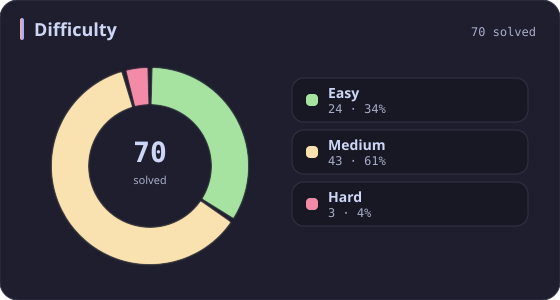
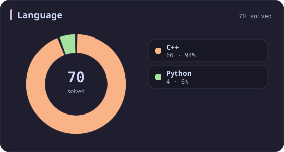
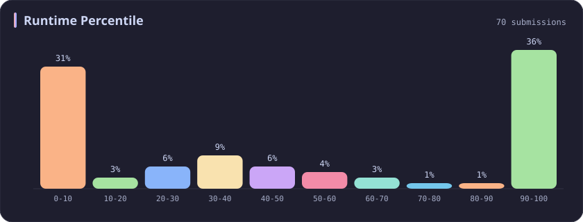
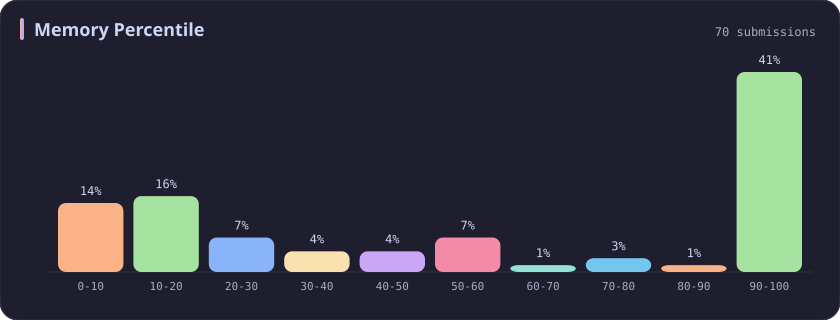
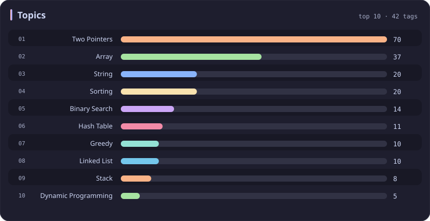

# Two Pointers Stats

[All stats](../../README.md)

**70** problems · updated `2026-09-04 19:14 UTC`

## Stats

### Difficulty

### Language

### Runtime Percentile

### Memory Percentile

### Topics

| Topic | # | Topic | # | Topic | # | Topic | # |
| :--- | ---: | :--- | ---: | :--- | ---: | :--- | ---: |
| [Array](array.md) | 386 | [Divide and Conquer](divide-and-conquer.md) | 16 | [Directed Acyclic Graph](directed-acyclic-graph.md) | 2 | [Range Minimum/Maximum Query](range-minimum-maximum-query.md) | 1 |
| [Hash Table](hash-table.md) | 168 | [Queue](queue.md) | 16 | [Quickselect](quickselect.md) | 2 | [Nim Game](nim-game.md) | 1 |
| [String](string.md) | 167 | [Trie](trie.md) | 11 | [Binary Lifting](binary-lifting.md) | 2 | [Impartial Game](impartial-game.md) | 1 |
| [Math](math.md) | 114 | [Binary Search Tree](binary-search-tree.md) | 11 | [Lowest Common Ancestor](lowest-common-ancestor.md) | 2 | [Binary Indexed Tree](binary-indexed-tree.md) | 1 |
| [Sorting](sorting.md) | 86 | [Monotonic Stack](monotonic-stack.md) | 10 | [Counting Sort](counting-sort.md) | 2 | [Sqrt Decomposition](sqrt-decomposition.md) | 1 |
| [Dynamic Programming](dynamic-programming.md) | 83 | [Number Theory](number-theory.md) | 10 | [Interactive](interactive.md) | 2 | [Complete Knapsack](complete-knapsack.md) | 1 |
| [Depth-First Search](depth-first-search.md) | 80 | [Ordered Set](ordered-set.md) | 8 | [Pigeonhole Principle](pigeonhole-principle.md) | 2 | [Reservoir Sampling](reservoir-sampling.md) | 1 |
| [Greedy](greedy.md) | 79 | [Combinatorics](combinatorics.md) | 7 | [Longest Increasing Subsequence](longest-increasing-subsequence.md) | 2 | [Bellman–Ford Algorithm](bellman-ford-algorithm.md) | 1 |
| **Two Pointers** | **70** | [Memoization](memoization.md) | 6 | [Segment Tree](segment-tree.md) | 2 | [Floyd–Warshall Algorithm](floyd-warshall-algorithm.md) | 1 |
| [Breadth-First Search](breadth-first-search.md) | 69 | [Data Stream](data-stream.md) | 6 | [Linear Algebra](linear-algebra.md) | 2 | [0-1 Knapsack](0-1-knapsack.md) | 1 |
| [Matrix](matrix.md) | 64 | [Shortest Path](shortest-path.md) | 6 | [Randomized](randomized.md) | 2 | [Aho–Corasick Algorithm](aho-corasick-algorithm.md) | 1 |
| [Binary Search](binary-search.md) | 63 | [Game Theory](game-theory.md) | 5 | [Heuristic Search](heuristic-search.md) | 2 | [Bidirectional Search](bidirectional-search.md) | 1 |
| [Tree](tree.md) | 60 | [Geometry](geometry.md) | 5 | [A* Search](a-search.md) | 2 | [Ternary Search](ternary-search.md) | 1 |
| [Binary Tree](binary-tree.md) | 50 | [Bracket Sequences](bracket-sequences.md) | 4 | [Hash Function](hash-function.md) | 2 | [Zero-Sum Game](zero-sum-game.md) | 1 |
| [Stack](stack.md) | 47 | [String Matching](string-matching.md) | 4 | [Greatest Common Divisor](greatest-common-divisor.md) | 2 | [Timsort](timsort.md) | 1 |
| [Prefix Sum](prefix-sum.md) | 46 | [Floyd's Cycle Finding Algorithm](floyd-s-cycle-finding-algorithm.md) | 4 | [Longest Common Subsequence](longest-common-subsequence.md) | 2 | [Radix Sort](radix-sort.md) | 1 |
| [Bit Manipulation](bit-manipulation.md) | 41 | [Topological Sort](topological-sort.md) | 4 | [Prime Factorization](prime-factorization.md) | 2 | [Triangulation](triangulation.md) | 1 |
| [Simulation](simulation.md) | 40 | [Monotonic Queue](monotonic-queue.md) | 4 | [Bitmask](bitmask.md) | 2 | [Euclidean Algorithm](euclidean-algorithm.md) | 1 |
| [Counting](counting.md) | 40 | [DP on Trees](dp-on-trees.md) | 4 | [Manacher](manacher.md) | 1 | [Minimum Spanning Tree](minimum-spanning-tree.md) | 1 |
| [Database](database.md) | 39 | [Brainteaser](brainteaser.md) | 4 | [Tournament Sort](tournament-sort.md) | 1 | [Doubly-Linked List](doubly-linked-list.md) | 1 |
| [Heap (Priority Queue)](heap-priority-queue.md) | 33 | [Polygons](polygons.md) | 4 | [Z Algorithm](z-algorithm.md) | 1 | [Least Common Multiple](least-common-multiple.md) | 1 |
| [Sliding Window](sliding-window.md) | 30 | [Merge Sort](merge-sort.md) | 3 | [Knuth–Morris–Pratt Algorithm](knuth-morris-pratt-algorithm.md) | 1 | [Fermat's Little Theorem](fermat-s-little-theorem.md) | 1 |
| [Linked List](linked-list.md) | 28 | [Algorithm X](algorithm-x.md) | 3 | [Boyer–Moore String-Search Algorithm](boyer-moore-string-search-algorithm.md) | 1 | [Kosaraju's Algorithm](kosaraju-s-algorithm.md) | 1 |
| [Graph Theory](graph-theory.md) | 27 | [Quicksort](quicksort.md) | 3 | [Dancing Links](dancing-links.md) | 1 | [Tarjan's SCC Algorithm](tarjan-s-scc-algorithm.md) | 1 |
| [Design](design.md) | 25 | [Minimax](minimax.md) | 3 | [Newton's Method](newton-s-method.md) | 1 | [Multiple Knapsack](multiple-knapsack.md) | 1 |
| [Recursion](recursion.md) | 21 | [Knapsack Problem](knapsack-problem.md) | 3 | [Bubble Sort](bubble-sort.md) | 1 | [Rolling Hash](rolling-hash.md) | 1 |
| [Backtracking](backtracking.md) | 18 | [Bucket Sort](bucket-sort.md) | 3 | [Primality Test](primality-test.md) | 1 |  |  |
| [Union-Find](union-find.md) | 17 | [Dijkstra's Algorithm](dijkstra-s-algorithm.md) | 3 | [Sieve Theory](sieve-theory.md) | 1 |  |  |
| [Enumeration](enumeration.md) | 17 | [Boyer–Moore Majority Vote Algorithm](boyer-moore-majority-vote-algorithm.md) | 2 | [Prime Number Sieve](prime-number-sieve.md) | 1 |  |  |

---

## Recent Activity

Latest **70** accepted submissions.

| Date | Title | Difficulty | Lang | Runtime | Memory |
| :--- | :--- | :---: | :---: | ---: | ---: |
| 2026&#8209;06&#8209;08 | [2161. Partition Array According to Given Pivot](https://leetcode.com/problems/partition-array-according-to-given-pivot/) | Medium | C++ | 7 ms `58.96%` | 139.4 MB `16.25%` |
| 2026&#8209;06&#8209;04 | [723. Candy Crush](https://leetcode.com/problems/candy-crush/) | Medium | C++ | 4 ms `61.92%` | 14.4 MB `20.92%` |
| 2026&#8209;06&#8209;04 | [1265. Print Immutable Linked List in Reverse](https://leetcode.com/problems/print-immutable-linked-list-in-reverse/) | Medium | C++ | 0 ms `100.00%` | 9.9 MB `5.81%` |
| 2026&#8209;05&#8209;24 | [3940. Limit Occurrences in Sorted Array](https://leetcode.com/problems/limit-occurrences-in-sorted-array/) | Easy | C++ | 0 ms `100.00%` | 34.2 MB `8.37%` |
| 2026&#8209;05&#8209;23 | [3936. Minimum Swaps to Move Zeros to End](https://leetcode.com/problems/minimum-swaps-to-move-zeros-to-end/) | Easy | Python | 0 ms `100.00%` | 19.2 MB `57.55%` |
| 2026&#8209;05&#8209;19 | [2540. Minimum Common Value](https://leetcode.com/problems/minimum-common-value/) | Easy | C++ | 0 ms `100.00%` | 54.6 MB `26.20%` |
| 2026&#8209;02&#8209;19 | [696. Count Binary Substrings](https://leetcode.com/problems/count-binary-substrings/) | Easy | C++ | 0 ms `100.00%` | 13.1 MB `56.88%` |
| 2025&#8209;10&#8209;11 | [3186. Maximum Total Damage With Spell Casting](https://leetcode.com/problems/maximum-total-damage-with-spell-casting/) | Medium | C++ | 111 ms `86.08%` | 162.8 MB `90.83%` |
| 2025&#8209;10&#8209;08 | [2300. Successful Pairs of Spells and Potions](https://leetcode.com/problems/successful-pairs-of-spells-and-potions/) | Medium | C++ | 47 ms `42.48%` | 138.4 MB `8.28%` |
| 2025&#8209;10&#8209;04 | [11. Container With Most Water](https://leetcode.com/problems/container-with-most-water/) | Medium | C++ | 0 ms `100.00%` | 62.8 MB `79.30%` |
| 2025&#8209;09&#8209;26 | [611. Valid Triangle Number](https://leetcode.com/problems/valid-triangle-number/) | Medium | C++ | 430 ms `8.62%` | 16.8 MB `10.43%` |
| 2025&#8209;09&#8209;23 | [165. Compare Version Numbers](https://leetcode.com/problems/compare-version-numbers/) | Medium | Python | 0 ms `100.00%` | 17.7 MB `100.00%` |
| 2025&#8209;06&#8209;04 | [3406. Find the Lexicographically Largest String From the Box II](https://leetcode.com/problems/find-the-lexicographically-largest-string-from-the-box-ii/) | Hard | C++ | 510 ms `0.00%` | 278 MB `0.00%` |
| 2025&#8209;06&#8209;04 | [3403. Find the Lexicographically Largest String From the Box I](https://leetcode.com/problems/find-the-lexicographically-largest-string-from-the-box-i/) | Medium | C++ | 9 ms `91.91%` | 12.9 MB `76.28%` |
| 2025&#8209;05&#8209;22 | [3362. Zero Array Transformation III](https://leetcode.com/problems/zero-array-transformation-iii/) | Medium | C++ | 128 ms `50.88%` | 224.5 MB `38.16%` |
| 2025&#8209;05&#8209;17 | [75. Sort Colors](https://leetcode.com/problems/sort-colors/) | Medium | C++ | 0 ms `100.00%` | 11.7 MB `11.44%` |
| 2025&#8209;05&#8209;04 | [253. Meeting Rooms II](https://leetcode.com/problems/meeting-rooms-ii/) | Medium | C++ | 0 ms `100.00%` | 15.9 MB `99.80%` |
| 2025&#8209;05&#8209;04 | [1055. Shortest Way to Form String](https://leetcode.com/problems/shortest-way-to-form-string/) | Medium | C++ | 0 ms `100.00%` | 8.7 MB `96.94%` |
| 2025&#8209;05&#8209;04 | [186. Reverse Words in a String II](https://leetcode.com/problems/reverse-words-in-a-string-ii/) | Medium | C++ | 0 ms `100.00%` | 20.1 MB `59.42%` |
| 2025&#8209;05&#8209;02 | [838. Push Dominoes](https://leetcode.com/problems/push-dominoes/) | Medium | C++ | 27 ms `32.11%` | 27.2 MB `30.96%` |
| 2025&#8209;05&#8209;01 | [2071. Maximum Number of Tasks You Can Assign](https://leetcode.com/problems/maximum-number-of-tasks-you-can-assign/) | Hard | C++ | 714 ms `60.06%` | 286.3 MB `39.93%` |
| 2025&#8209;04&#8209;26 | [1214. Two Sum BSTs](https://leetcode.com/problems/two-sum-bsts/) | Medium | C++ | 0 ms `100.00%` | 29.5 MB `42.11%` |
| 2025&#8209;04&#8209;25 | [161. One Edit Distance](https://leetcode.com/problems/one-edit-distance/) | Medium | Python | 3 ms `26.80%` | 17.7 MB `100.00%` |
| 2025&#8209;04&#8209;24 | [189. Rotate Array](https://leetcode.com/problems/rotate-array/) | Medium | C++ | 0 ms `100.00%` | 29.6 MB `66.58%` |
| 2025&#8209;04&#8209;24 | [80. Remove Duplicates from Sorted Array II](https://leetcode.com/problems/remove-duplicates-from-sorted-array-ii/) | Medium | C++ | 7 ms `72.05%` | 19.6 MB `59.90%` |
| 2025&#8209;04&#8209;24 | [26. Remove Duplicates from Sorted Array](https://leetcode.com/problems/remove-duplicates-from-sorted-array/) | Easy | C++ | 0 ms `100.00%` | 22.6 MB `52.70%` |
| 2025&#8209;04&#8209;24 | [27. Remove Element](https://leetcode.com/problems/remove-element/) | Easy | C++ | 0 ms `100.00%` | 11.8 MB `48.98%` |
| 2025&#8209;04&#8209;24 | [88. Merge Sorted Array](https://leetcode.com/problems/merge-sorted-array/) | Easy | C++ | 0 ms `100.00%` | 12.4 MB `82.77%` |
| 2025&#8209;04&#8209;23 | [2462. Total Cost to Hire K Workers](https://leetcode.com/problems/total-cost-to-hire-k-workers/) | Medium | C++ | 56 ms `23.98%` | 79.8 MB `18.79%` |
| 2025&#8209;04&#8209;19 | [2095. Delete the Middle Node of a Linked List](https://leetcode.com/problems/delete-the-middle-node-of-a-linked-list/) | Medium | C++ | 19 ms `8.47%` | 342.5 MB `17.31%` |
| 2025&#8209;04&#8209;19 | [2130. Maximum Twin Sum of a Linked List](https://leetcode.com/problems/maximum-twin-sum-of-a-linked-list/) | Medium | C++ | 5 ms `36.76%` | 138.4 MB `17.32%` |
| 2025&#8209;04&#8209;19 | [1679. Max Number of K-Sum Pairs](https://leetcode.com/problems/max-number-of-k-sum-pairs/) | Medium | C++ | 106 ms `31.48%` | 72 MB `23.30%` |
| 2025&#8209;04&#8209;19 | [392. Is Subsequence](https://leetcode.com/problems/is-subsequence/) | Easy | C++ | 0 ms `100.00%` | 8.5 MB `91.47%` |
| 2025&#8209;04&#8209;19 | [283. Move Zeroes](https://leetcode.com/problems/move-zeroes/) | Easy | C++ | 0 ms `100.00%` | 23.9 MB `19.59%` |
| 2025&#8209;04&#8209;19 | [443. String Compression](https://leetcode.com/problems/string-compression/) | Medium | C++ | 0 ms `100.00%` | 13.6 MB `92.00%` |
| 2025&#8209;04&#8209;19 | [151. Reverse Words in a String](https://leetcode.com/problems/reverse-words-in-a-string/) | Medium | Python | 3 ms `30.78%` | 17.8 MB `100.00%` |
| 2025&#8209;04&#8209;19 | [345. Reverse Vowels of a String](https://leetcode.com/problems/reverse-vowels-of-a-string/) | Easy | C++ | 0 ms `100.00%` | 11.6 MB `5.33%` |
| 2025&#8209;04&#8209;19 | [2563. Count the Number of Fair Pairs](https://leetcode.com/problems/count-the-number-of-fair-pairs/) | Medium | C++ | 61 ms `59.74%` | 60.3 MB `100.00%` |
| 2025&#8209;04&#8209;11 | [1768. Merge Strings Alternately](https://leetcode.com/problems/merge-strings-alternately/) | Easy | C++ | 3 ms `40.70%` | 8.6 MB `13.54%` |
| 2024&#8209;11&#8209;15 | [1574. Shortest Subarray to be Removed to Make Array Sorted](https://leetcode.com/problems/shortest-subarray-to-be-removed-to-make-array-sorted/) | Medium | C++ | 0 ms `100.00%` | 69.4 MB `100.00%` |
| 2024&#8209;10&#8209;20 | [2486. Append Characters to String to Make Subsequence](https://leetcode.com/problems/append-characters-to-string-to-make-subsequence/) | Medium | C++ | 4 ms `21.75%` | 12.2 MB `99.78%` |
| 2024&#8209;04&#8209;12 | [42. Trapping Rain Water](https://leetcode.com/problems/trapping-rain-water/) | Hard | C++ | 13 ms `4.64%` | 22.2 MB `100.00%` |
| 2024&#8209;03&#8209;24 | [1570. Dot Product of Two Sparse Vectors](https://leetcode.com/problems/dot-product-of-two-sparse-vectors/) | Medium | C++ | 162 ms `9.76%` | 175.2 MB `21.95%` |
| 2024&#8209;03&#8209;24 | [287. Find the Duplicate Number](https://leetcode.com/problems/find-the-duplicate-number/) | Medium | C++ | 216 ms `5.28%` | 88.1 MB `9.66%` |
| 2024&#8209;03&#8209;23 | [148. Sort List](https://leetcode.com/problems/sort-list/) | Medium | C++ | 124 ms `5.01%` | 58.8 MB `49.20%` |
| 2024&#8209;03&#8209;23 | [18. 4Sum](https://leetcode.com/problems/4sum/) | Medium | C++ | 336 ms `5.01%` | 81.5 MB `5.13%` |
| 2024&#8209;03&#8209;23 | [16. 3Sum Closest](https://leetcode.com/problems/3sum-closest/) | Medium | C++ | 18 ms `14.57%` | 12.9 MB `100.00%` |
| 2024&#8209;03&#8209;23 | [143. Reorder List](https://leetcode.com/problems/reorder-list/) | Medium | C++ | 31 ms `5.08%` | 22.4 MB `99.97%` |
| 2024&#8209;03&#8209;22 | [234. Palindrome Linked List](https://leetcode.com/problems/palindrome-linked-list/) | Easy | C++ | 173 ms `5.13%` | 130.7 MB `18.01%` |
| 2023&#8209;10&#8209;01 | [557. Reverse Words in a String III](https://leetcode.com/problems/reverse-words-in-a-string-iii/) | Easy | C++ | 10 ms `11.82%` | 10 MB `100.00%` |
| 2023&#8209;04&#8209;03 | [881. Boats to Save People](https://leetcode.com/problems/boats-to-save-people/) | Medium | C++ | 246 ms `5.78%` | 70.4 MB `5.29%` |
| 2023&#8209;03&#8209;27 | [653. Two Sum IV - Input is a BST](https://leetcode.com/problems/two-sum-iv-input-is-a-bst/) | Easy | C++ | 48 ms `5.08%` | 39 MB `20.06%` |
| 2023&#8209;03&#8209;25 | [15. 3Sum](https://leetcode.com/problems/3sum/) | Medium | C++ | 2275 ms `5.02%` | 305.4 MB `5.21%` |
| 2023&#8209;03&#8209;21 | [349. Intersection of Two Arrays](https://leetcode.com/problems/intersection-of-two-arrays/) | Easy | C++ | 3 ms `38.14%` | 11.2 MB `100.00%` |
| 2023&#8209;03&#8209;21 | [350. Intersection of Two Arrays II](https://leetcode.com/problems/intersection-of-two-arrays-ii/) | Easy | C++ | 15 ms `5.21%` | 11.2 MB `100.00%` |
| 2023&#8209;03&#8209;21 | [141. Linked List Cycle](https://leetcode.com/problems/linked-list-cycle/) | Easy | C++ | 11 ms `42.93%` | 8.2 MB `100.00%` |
| 2023&#8209;03&#8209;18 | [2592. Maximize Greatness of an Array](https://leetcode.com/problems/maximize-greatness-of-an-array/) | Medium | C++ | 244 ms `5.29%` | 96.7 MB `16.04%` |
| 2023&#8209;03&#8209;16 | [844. Backspace String Compare](https://leetcode.com/problems/backspace-string-compare/) | Easy | C++ | 0 ms `100.00%` | 6.5 MB `100.00%` |
| 2023&#8209;03&#8209;13 | [28. Find the Index of the First Occurrence in a String](https://leetcode.com/problems/find-the-index-of-the-first-occurrence-in-a-string/) | Easy | C++ | 0 ms `100.00%` | 6.3 MB `100.00%` |
| 2023&#8209;03&#8209;13 | [567. Permutation in String](https://leetcode.com/problems/permutation-in-string/) | Medium | C++ | 42 ms `25.26%` | 30 MB `10.40%` |
| 2023&#8209;03&#8209;10 | [19. Remove Nth Node From End of List](https://leetcode.com/problems/remove-nth-node-from-end-of-list/) | Medium | C++ | 3 ms `1.53%` | 10.9 MB `99.98%` |
| 2023&#8209;03&#8209;10 | [344. Reverse String](https://leetcode.com/problems/reverse-string/) | Easy | C++ | 22 ms `2.07%` | 23.1 MB `100.00%` |
| 2023&#8209;03&#8209;10 | [167. Two Sum II - Input Array Is Sorted](https://leetcode.com/problems/two-sum-ii-input-array-is-sorted/) | Medium | C++ | 11 ms `1.49%` | 15.7 MB `100.00%` |
| 2023&#8209;03&#8209;10 | [977. Squares of a Sorted Array](https://leetcode.com/problems/squares-of-a-sorted-array/) | Easy | C++ | 44 ms `6.33%` | 26.8 MB `99.97%` |
| 2023&#8209;03&#8209;10 | [876. Middle of the Linked List](https://leetcode.com/problems/middle-of-the-linked-list/) | Easy | C++ | 2 ms `0.39%` | 6.9 MB `100.00%` |
| 2023&#8209;03&#8209;10 | [202. Happy Number](https://leetcode.com/problems/happy-number/) | Easy | C++ | 0 ms `100.00%` | 5.9 MB `100.00%` |
| 2023&#8209;03&#8209;09 | [142. Linked List Cycle II](https://leetcode.com/problems/linked-list-cycle-ii/) | Medium | C++ | 8 ms `48.92%` | 7.6 MB `100.00%` |
| 2023&#8209;02&#8209;26 | [2576. Find the Maximum Number of Marked Indices](https://leetcode.com/problems/find-the-maximum-number-of-marked-indices/) | Medium | C++ | 374 ms `5.81%` | 100.2 MB `5.16%` |
| 2023&#8209;02&#8209;21 | [2562. Find the Array Concatenation Value](https://leetcode.com/problems/find-the-array-concatenation-value/) | Easy | C++ | 9 ms `5.02%` | 9.2 MB `100.00%` |
| 2023&#8209;02&#8209;15 | [5. Longest Palindromic Substring](https://leetcode.com/problems/longest-palindromic-substring/) | Medium | C++ | 37 ms `39.20%` | 7 MB `100.00%` |
